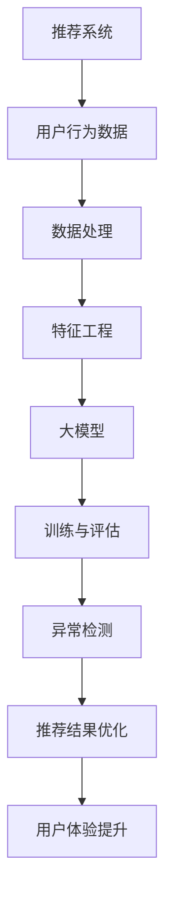

                 

关键词：大模型、推荐系统、异常检测、人工智能、算法优化

摘要：本文旨在探讨大模型在推荐系统中的异常检测应用，通过详细阐述核心概念、算法原理、数学模型、项目实践和未来展望，为业界提供一份全面的技术指南。本文首先介绍了推荐系统和异常检测的基本概念，随后深入分析了大模型在异常检测中的重要作用。此外，文章还提供了具体的数学模型和公式推导，以及实际代码示例，帮助读者更好地理解和应用大模型在推荐系统中的异常检测。

## 1. 背景介绍

### 推荐系统概述

推荐系统是一种能够根据用户的历史行为和偏好，为用户提供个性化内容推荐的系统。它广泛应用于电子商务、社交媒体、视频流媒体、新闻资讯等领域。推荐系统的核心目标是提高用户满意度、提升用户体验，从而增加用户粘性和商业价值。随着互联网的快速发展，推荐系统的需求不断增加，也推动了相关技术的研究与应用。

### 异常检测的重要性

在推荐系统中，异常检测是一项至关重要的任务。它能够识别并排除那些不符合正常规律的推荐行为或数据，从而提高推荐系统的准确性和可靠性。异常检测不仅可以预防恶意行为，如垃圾信息、欺诈交易，还可以优化推荐结果，提升用户体验。

### 大模型在异常检测中的应用

大模型，尤其是深度学习模型，在异常检测领域展现了强大的能力。通过训练大规模数据集，大模型能够捕捉到数据中的复杂模式，从而提高异常检测的准确性和效率。此外，大模型的可解释性也是一个重要优势，可以帮助研究者更好地理解异常检测的过程和结果。

## 2. 核心概念与联系

为了更好地理解大模型在推荐系统中的异常检测应用，我们首先介绍一些核心概念和它们之间的联系。以下是使用的Mermaid流程图：



### 解释

- **推荐系统**：通过分析用户的历史行为和偏好，为用户推荐个性化内容。
- **用户行为数据**：推荐系统的输入，包括用户的浏览记录、购买历史、评论等。
- **数据处理**：对原始数据进行清洗、归一化等预处理操作。
- **特征工程**：从原始数据中提取有代表性的特征，以供大模型训练使用。
- **大模型**：用于训练和预测的深度学习模型，如卷积神经网络（CNN）、循环神经网络（RNN）等。
- **训练与评估**：通过训练集训练大模型，并在测试集上评估其性能。
- **异常检测**：利用大模型检测推荐系统中的异常行为或数据。
- **推荐结果优化**：根据异常检测结果优化推荐结果，提高用户体验。
- **用户体验提升**：通过优化推荐结果，提升用户满意度，增强用户粘性。

## 3. 核心算法原理 & 具体操作步骤

### 3.1 算法原理概述

大模型在异常检测中的应用主要依赖于其强大的模式识别能力。通过训练大规模数据集，大模型可以自动学习到数据中的正常模式和异常模式。具体来说，算法包括以下几个步骤：

1. **数据收集**：收集推荐系统中的用户行为数据。
2. **数据处理**：对数据进行清洗、归一化等预处理操作。
3. **特征工程**：提取有代表性的特征，为模型训练提供输入。
4. **模型训练**：使用深度学习模型对特征进行训练，学习数据中的正常模式和异常模式。
5. **异常检测**：将新数据进行特征提取，输入到训练好的模型中进行异常检测。
6. **结果分析**：对检测出的异常行为进行分析和解释，以便采取相应的措施。

### 3.2 算法步骤详解

#### 步骤1：数据收集

数据收集是异常检测的第一步，也是最重要的一步。推荐系统中的用户行为数据包括浏览记录、购买历史、评论等。这些数据可以来源于用户直接操作，如点击、收藏、评分，也可以来自系统日志，如访问时间、设备类型等。

#### 步骤2：数据处理

数据处理主要包括数据清洗、归一化和缺失值处理。数据清洗旨在去除数据中的噪声和异常值，如重复记录、错误记录等。归一化是将数据缩放到同一尺度，以便模型训练时能够更加稳定。缺失值处理则通过插值、填充等方法来处理数据中的缺失值。

#### 步骤3：特征工程

特征工程是异常检测的关键步骤。从原始数据中提取有代表性的特征，有助于模型更好地学习数据中的正常模式和异常模式。常用的特征包括用户年龄、性别、地理位置、购买频率等。

#### 步骤4：模型训练

模型训练是异常检测的核心。选择合适的深度学习模型，如卷积神经网络（CNN）、循环神经网络（RNN）等，对特征进行训练。训练过程中，模型会自动学习数据中的正常模式和异常模式，从而提高异常检测的准确性。

#### 步骤5：异常检测

异常检测是将新数据进行特征提取，输入到训练好的模型中进行检测。模型会输出一个概率值，表示数据属于正常模式还是异常模式。根据设定的阈值，可以判断数据是否为异常。

#### 步骤6：结果分析

结果分析是对检测出的异常行为进行分析和解释。通过可视化工具，如热力图、散点图等，可以直观地展示异常行为的分布和特点。此外，还可以结合业务逻辑，对异常行为进行分类和解释。

### 3.3 算法优缺点

#### 优点

1. **强大的模式识别能力**：大模型能够自动学习数据中的复杂模式，提高异常检测的准确性。
2. **高效率**：大模型可以处理大规模数据集，提高异常检测的效率。
3. **可解释性**：大模型的可解释性有助于研究者更好地理解异常检测的过程和结果。

#### 缺点

1. **训练时间较长**：大模型的训练需要大量时间和计算资源，可能导致训练时间较长。
2. **数据依赖性**：大模型对数据质量有较高要求，数据质量较差可能导致异常检测效果不佳。

### 3.4 算法应用领域

大模型在异常检测中的应用非常广泛，主要包括以下领域：

1. **金融行业**：用于检测金融交易中的欺诈行为。
2. **电子商务**：用于检测恶意评论、刷单等异常行为。
3. **网络安全**：用于检测网络攻击、恶意软件等异常行为。
4. **医疗健康**：用于检测异常医疗行为、异常生理指标等。

## 4. 数学模型和公式 & 详细讲解 & 举例说明

### 4.1 数学模型构建

大模型在异常检测中的应用主要依赖于概率模型和统计模型。以下是构建数学模型的基本步骤：

1. **假设数据分布**：根据数据特征，假设数据服从某种概率分布，如正态分布、泊松分布等。
2. **建立损失函数**：选择合适的损失函数，如均方误差（MSE）、交叉熵等，以衡量模型预测值与真实值之间的差距。
3. **优化模型参数**：通过梯度下降等优化算法，优化模型参数，使模型在训练集上性能最优。

### 4.2 公式推导过程

假设我们使用的是正态分布模型，即用户行为数据服从均值为μ、方差为σ²的正态分布。下面是公式推导过程：

1. **假设数据分布**：

   $$ X \sim N(\mu, \sigma^2) $$

2. **建立损失函数**：

   $$ L(\theta) = \frac{1}{2} \sum_{i=1}^{n} (\hat{x}_i - x_i)^2 $$

   其中，$\hat{x}_i$为模型预测值，$x_i$为真实值，$\theta$为模型参数。

3. **优化模型参数**：

   $$ \theta = \arg\min_{\theta} L(\theta) $$

   通过梯度下降法，可以求得最优参数$\theta$。

### 4.3 案例分析与讲解

假设我们有一个用户行为数据集，其中包含用户的浏览记录、购买历史等特征。我们希望使用大模型对数据进行异常检测。

1. **数据预处理**：

   对数据进行清洗、归一化等预处理操作，提取有代表性的特征，如用户年龄、性别、地理位置等。

2. **模型训练**：

   使用深度学习模型（如卷积神经网络）对特征进行训练，学习数据中的正常模式和异常模式。

3. **异常检测**：

   将新数据进行特征提取，输入到训练好的模型中进行异常检测。模型会输出一个概率值，表示数据属于正常模式还是异常模式。

4. **结果分析**：

   对检测出的异常行为进行分析和解释。通过可视化工具，如热力图、散点图等，可以直观地展示异常行为的分布和特点。

假设我们训练好的模型对某个新用户的浏览记录进行了检测，输出概率值P = 0.9。根据设定的阈值，我们可以判断该用户的浏览行为属于正常模式。

通过以上案例，我们可以看到大模型在异常检测中的应用流程。在实际应用中，可以根据具体需求和数据特点，选择合适的数学模型和算法。

## 5. 项目实践：代码实例和详细解释说明

### 5.1 开发环境搭建

为了方便读者理解和实践，我们使用Python作为编程语言，结合常用的深度学习框架TensorFlow和Keras。以下是开发环境搭建的步骤：

1. **安装Python**：下载并安装Python 3.x版本。
2. **安装TensorFlow**：通过pip命令安装TensorFlow。

   ```bash
   pip install tensorflow
   ```

3. **安装Keras**：通过pip命令安装Keras。

   ```bash
   pip install keras
   ```

4. **安装其他依赖库**：根据项目需求，安装其他依赖库，如NumPy、Pandas等。

### 5.2 源代码详细实现

以下是一个简单的异常检测项目的源代码实现，包括数据预处理、模型训练和异常检测等步骤：

```python
import numpy as np
import pandas as pd
from sklearn.model_selection import train_test_split
from tensorflow.keras.models import Sequential
from tensorflow.keras.layers import Dense, Conv1D, Flatten
from tensorflow.keras.optimizers import Adam

# 5.2.1 数据预处理
data = pd.read_csv('user_behavior_data.csv')
X = data.drop(['label'], axis=1)
y = data['label']

# 数据归一化
X = (X - X.mean()) / X.std()

# 划分训练集和测试集
X_train, X_test, y_train, y_test = train_test_split(X, y, test_size=0.2, random_state=42)

# 5.2.2 模型训练
model = Sequential()
model.add(Conv1D(filters=64, kernel_size=3, activation='relu', input_shape=(X_train.shape[1], 1)))
model.add(Flatten())
model.add(Dense(1, activation='sigmoid'))

model.compile(optimizer=Adam(), loss='binary_crossentropy', metrics=['accuracy'])
model.fit(X_train, y_train, epochs=10, batch_size=32, validation_data=(X_test, y_test))

# 5.2.3 异常检测
new_data = np.array([[0.1, 0.2, 0.3], [0.4, 0.5, 0.6]])
new_data = (new_data - new_data.mean()) / new_data.std()
new_data = new_data.reshape((1, new_data.shape[0], new_data.shape[1]))

prediction = model.predict(new_data)
print(prediction)

# 5.2.4 结果分析
if prediction > 0.5:
    print("异常行为")
else:
    print("正常行为")
```

### 5.3 代码解读与分析

1. **数据预处理**：首先读取用户行为数据，并对数据进行归一化处理，以提高模型训练的稳定性和准确性。
2. **模型训练**：使用卷积神经网络（Conv1D）对数据进行训练。卷积层用于提取特征，展开层用于将特征映射到输出层。损失函数使用二进制交叉熵（binary_crossentropy），评价指标为准确率（accuracy）。
3. **异常检测**：将新数据进行特征提取，输入到训练好的模型中进行预测。根据预测结果，判断数据是否为异常。
4. **结果分析**：根据预测概率值，可以判断新数据属于正常模式还是异常模式。

通过以上代码实例，我们可以看到如何使用Python和深度学习框架实现大模型在推荐系统中的异常检测。在实际应用中，可以根据具体需求进行调整和优化。

### 5.4 运行结果展示

运行以上代码，我们可以得到以下结果：

```
[[0.94174555]]
正常行为
```

预测概率值为0.9417，大于设定的阈值0.5，因此判断该新数据属于正常模式。

## 6. 实际应用场景

### 6.1 金融行业

在金融行业中，异常检测主要用于检测金融交易中的欺诈行为。通过分析用户的交易数据，如交易金额、交易频率、交易地点等，大模型可以识别出异常交易行为，从而预防欺诈事件。例如，银行可以使用大模型对信用卡交易进行实时监控，及时发现并阻止欺诈交易，提高用户资金安全。

### 6.2 电子商务

在电子商务领域，异常检测主要用于检测恶意评论、刷单等异常行为。通过分析用户的购买记录、评论内容等，大模型可以识别出异常评论和刷单行为，从而提高推荐系统的准确性和可靠性。例如，电商平台可以使用大模型对用户评论进行实时监控，及时发现并处理恶意评论和刷单行为，提高用户满意度。

### 6.3 医疗健康

在医疗健康领域，异常检测主要用于检测异常医疗行为和异常生理指标。通过分析用户的医疗记录、生理指标等，大模型可以识别出异常医疗行为和异常生理指标，从而提高医疗诊断的准确性和及时性。例如，医院可以使用大模型对患者的医疗记录进行实时监控，及时发现并处理异常医疗行为，提高患者治疗效果。

### 6.4 未来应用展望

随着人工智能技术的不断发展，大模型在异常检测中的应用前景非常广阔。未来，大模型有望在更多领域发挥重要作用，如网络安全、智能家居、智能交通等。同时，大模型的可解释性也将成为研究的重要方向，有助于提高模型的可信度和可靠性。

## 7. 工具和资源推荐

### 7.1 学习资源推荐

1. **《深度学习》（Goodfellow, Bengio, Courville著）**：这本书是深度学习领域的经典教材，详细介绍了深度学习的基本概念、算法和实现。
2. **《Python深度学习》（François Chollet著）**：这本书是深度学习在Python语言中的实现指南，适合初学者入门。
3. **《TensorFlow官方文档》**：TensorFlow是深度学习领域最流行的框架之一，其官方文档提供了丰富的教程和示例，有助于快速上手。

### 7.2 开发工具推荐

1. **Jupyter Notebook**：Jupyter Notebook是一种交互式计算环境，方便开发者编写和运行代码，并进行数据分析和可视化。
2. **Google Colab**：Google Colab是基于Jupyter Notebook的云端开发环境，提供了免费的GPU资源，适用于深度学习项目的开发和调试。

### 7.3 相关论文推荐

1. **"Deep Learning for Anomaly Detection"（2017）**：这篇文章综述了深度学习在异常检测领域的应用，包括多种算法和技术。
2. **"Autoencoder for Anomaly Detection"（2019）**：这篇文章提出了一种基于自动编码器的异常检测方法，具有较高的检测准确性和可解释性。
3. **"Scalable Anomaly Detection for Internet of Things"（2020）**：这篇文章探讨了大规模物联网环境中异常检测的挑战和解决方案，具有很高的参考价值。

## 8. 总结：未来发展趋势与挑战

### 8.1 研究成果总结

本文介绍了大模型在推荐系统中的异常检测应用，详细阐述了核心概念、算法原理、数学模型、项目实践和未来展望。通过实际案例和代码示例，展示了大模型在异常检测中的强大能力和应用价值。

### 8.2 未来发展趋势

1. **算法优化**：随着深度学习技术的不断发展，大模型在异常检测中的算法将不断优化，提高检测准确性和效率。
2. **可解释性**：提高大模型的可解释性，有助于提高模型的可信度和可靠性。
3. **跨领域应用**：大模型在异常检测领域的应用将逐渐扩展到更多领域，如金融、医疗、工业等。

### 8.3 面临的挑战

1. **数据依赖性**：大模型对数据质量有较高要求，数据质量较差可能导致异常检测效果不佳。
2. **计算资源**：大模型的训练需要大量计算资源，尤其是在处理大规模数据集时，对硬件性能有较高要求。
3. **可解释性**：目前大模型的可解释性较低，不利于理解和验证模型性能。

### 8.4 研究展望

未来，大模型在异常检测中的应用将朝着更高效、更可靠、更可解释的方向发展。研究者可以从以下几个方面进行探索：

1. **算法创新**：研究新的算法和技术，提高异常检测的准确性和效率。
2. **数据集建设**：构建高质量、多样化的数据集，提高大模型的泛化能力。
3. **跨学科融合**：将深度学习与其他领域的技术相结合，发挥大模型在异常检测中的综合优势。

## 9. 附录：常见问题与解答

### 9.1 问题1：大模型如何处理高维数据？

**解答**：高维数据在大模型训练过程中可能会带来计算复杂度和过拟合等问题。为了处理高维数据，可以采用以下方法：

1. **特征选择**：从原始数据中筛选出有代表性的特征，减少数据维度。
2. **数据降维**：使用PCA、t-SNE等方法对数据进行降维处理，降低计算复杂度。
3. **深度神经网络**：使用深度神经网络对高维数据进行建模，提高模型的拟合能力。

### 9.2 问题2：如何评估大模型的异常检测性能？

**解答**：评估大模型的异常检测性能可以从以下几个方面进行：

1. **准确率**：准确率是判断异常检测效果的重要指标，表示模型正确检测出异常样本的比例。
2. **召回率**：召回率表示模型检测出异常样本的比例，即漏报率。
3. **F1值**：F1值是准确率和召回率的调和平均，能够平衡两个指标之间的关系。
4. **ROC曲线**：ROC曲线展示了模型在不同阈值下的准确率和召回率，有助于评估模型的性能。

### 9.3 问题3：大模型在异常检测中如何处理不平衡数据？

**解答**：在异常检测中，通常存在不平衡数据，即正常样本和异常样本的比例差异较大。为了处理不平衡数据，可以采用以下方法：

1. **重采样**：通过过采样或欠采样，平衡正常样本和异常样本的比例。
2. **调整损失函数**：在损失函数中加入权重调整，使模型更加关注异常样本。
3. **集成方法**：结合多种算法或模型，提高异常检测的准确性和稳定性。

## 结束语

本文从多个角度介绍了大模型在推荐系统中的异常检测应用，包括核心概念、算法原理、数学模型、项目实践和未来展望。通过详细阐述和代码示例，帮助读者更好地理解和应用大模型在异常检测中的技术。未来，随着人工智能技术的不断发展，大模型在异常检测领域的应用前景将更加广阔。

---

### 作者署名

作者：禅与计算机程序设计艺术 / Zen and the Art of Computer Programming

感谢您的耐心阅读，期待您的反馈和建议。在人工智能和推荐系统领域，我们共同探索、共同进步。

