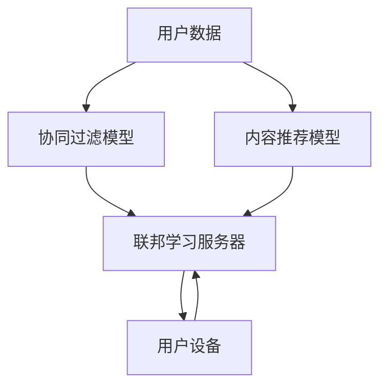

                 

关键词：大模型，推荐系统，联邦学习，算法原理，数学模型，项目实践，应用场景，未来展望

> 摘要：本文主要探讨了在大模型时代，联邦学习技术在推荐系统中的应用。通过分析大模型与联邦学习的结合点，阐述了其在隐私保护、协同过滤、内容推荐等方面的优势，并详细介绍了相关算法原理、数学模型和项目实践。此外，本文还对未来大模型在推荐系统中的发展趋势、挑战及研究展望进行了深入探讨。

## 1. 背景介绍

随着互联网的快速发展，用户生成数据量呈指数级增长，如何从海量数据中挖掘有价值的信息成为了研究热点。推荐系统作为数据驱动的应用，旨在为用户提供个性化的内容，从而提高用户满意度、增强用户粘性。传统的推荐系统主要采用协同过滤和基于内容的推荐方法，但存在数据集中化、隐私泄露等问题。为了解决这些问题，联邦学习应运而生。

联邦学习（Federated Learning）是一种分布式机器学习方法，其核心思想是在多个不同的设备或服务器上训练模型，而无需将数据集中到一个中央服务器上。通过这种方式，既保证了数据隐私，又能协同训练出高质量的模型。近年来，随着深度学习技术的不断发展，大模型在推荐系统中的应用也越来越广泛。本文将探讨大模型与联邦学习的结合，以及其在推荐系统中的应用。

## 2. 核心概念与联系

### 2.1 大模型

大模型是指具有大量参数的深度神经网络模型。近年来，随着计算资源和数据量的增长，大模型在语音识别、图像识别、自然语言处理等领域取得了显著成果。大模型的优势在于能够捕捉到复杂的数据特征，提高模型的泛化能力。

### 2.2 联邦学习

联邦学习是一种分布式机器学习方法，其核心思想是在多个不同的设备或服务器上训练模型，而无需将数据集中到一个中央服务器上。联邦学习的主要目标是保护用户隐私，同时提高模型的训练效果。

### 2.3 联邦学习与推荐系统的结合

联邦学习与推荐系统的结合主要体现在以下几个方面：

1. **隐私保护**：推荐系统通常涉及用户的敏感信息，如搜索历史、购物记录等。联邦学习通过分布式训练，避免了数据集中，从而降低了隐私泄露的风险。

2. **协同过滤**：联邦学习可以应用于协同过滤算法，通过分布式训练，提高模型的鲁棒性和泛化能力。

3. **内容推荐**：联邦学习可以结合用户兴趣和行为特征，为用户提供个性化的内容推荐。

## 2.4 Mermaid 流程图



## 3. 核心算法原理 & 具体操作步骤

### 3.1 算法原理概述

联邦学习算法主要包括以下几个步骤：

1. **初始化**：在联邦学习服务器上初始化全局模型。

2. **本地训练**：在每个用户设备上，使用本地数据对全局模型进行训练。

3. **模型更新**：将本地训练得到的模型更新上传到联邦学习服务器。

4. **全局更新**：联邦学习服务器根据接收到的模型更新，更新全局模型。

5. **模型反馈**：将更新后的全局模型反馈给用户设备。

### 3.2 算法步骤详解

#### 3.2.1 初始化

在联邦学习服务器上初始化全局模型，通常使用预训练的模型或随机初始化。

```python
# 初始化全局模型
global_model = initialize_model()
```

#### 3.2.2 本地训练

在每个用户设备上，使用本地数据对全局模型进行训练。本地训练可以使用传统的机器学习算法，如梯度下降。

```python
# 本地训练
local_model = train_model(local_data, global_model)
```

#### 3.2.3 模型更新

将本地训练得到的模型更新上传到联邦学习服务器。

```python
# 模型更新
send_model_update(local_model)
```

#### 3.2.4 全局更新

联邦学习服务器根据接收到的模型更新，更新全局模型。

```python
# 全局更新
global_model = update_model(global_model, received_updates)
```

#### 3.2.5 模型反馈

将更新后的全局模型反馈给用户设备。

```python
# 模型反馈
receive_updated_model(global_model)
```

### 3.3 算法优缺点

#### 3.3.1 优点

1. **隐私保护**：联邦学习通过分布式训练，避免了数据集中，从而降低了隐私泄露的风险。

2. **高效性**：联邦学习可以利用用户设备上的计算资源和数据，提高模型训练效率。

3. **灵活性**：联邦学习可以应用于多种机器学习算法，如协同过滤、内容推荐等。

#### 3.3.2 缺点

1. **通信开销**：联邦学习需要频繁传输模型更新，可能导致通信开销较大。

2. **模型质量**：由于数据分布不均，可能导致模型质量受到影响。

### 3.4 算法应用领域

联邦学习可以应用于推荐系统的多个领域，如：

1. **协同过滤**：用于预测用户对未知物品的偏好。

2. **内容推荐**：用于根据用户兴趣推荐相关内容。

3. **广告推荐**：用于根据用户行为推荐相关广告。

## 4. 数学模型和公式

### 4.1 数学模型构建

联邦学习算法的核心是模型更新过程，其数学模型如下：

$$
\theta_{t+1} = \theta_{t} + \alpha \cdot \nabla_{\theta} \mathcal{L}(\theta, x, y)
$$

其中，$\theta_{t}$ 和 $\theta_{t+1}$ 分别表示第 $t$ 次和第 $t+1$ 次更新的模型参数，$\alpha$ 表示学习率，$\nabla_{\theta} \mathcal{L}(\theta, x, y)$ 表示损失函数关于模型参数的梯度。

### 4.2 公式推导过程

假设我们使用的是线性回归模型，损失函数为：

$$
\mathcal{L}(\theta, x, y) = \frac{1}{2} \sum_{i=1}^{n} (y_i - \theta^T x_i)^2
$$

其中，$y_i$ 表示第 $i$ 个样本的标签，$x_i$ 表示第 $i$ 个样本的特征，$\theta^T$ 表示模型参数。

对损失函数关于模型参数求导，得到：

$$
\nabla_{\theta} \mathcal{L}(\theta, x, y) = \sum_{i=1}^{n} (y_i - \theta^T x_i) x_i
$$

将损失函数和梯度代入模型更新公式，得到：

$$
\theta_{t+1} = \theta_{t} + \alpha \cdot \sum_{i=1}^{n} (y_i - \theta_{t}^T x_i) x_i
$$

### 4.3 案例分析与讲解

假设我们有一个线性回归模型，预测房价。我们有 $n$ 个样本，每个样本包括特征向量 $x_i$ 和标签 $y_i$。首先，我们初始化模型参数 $\theta_0$，然后进行 $t$ 次迭代。

在每次迭代中，我们计算损失函数关于模型参数的梯度，并根据梯度进行模型更新。具体步骤如下：

1. 初始化模型参数 $\theta_0$。

2. 对每个样本 $i$，计算损失函数关于模型参数的梯度。

3. 将梯度累加，得到总梯度。

4. 根据总梯度更新模型参数。

5. 重复步骤 2-4，直到满足停止条件。

最终，我们得到更新后的模型参数 $\theta_t$，用于预测房价。

## 5. 项目实践：代码实例和详细解释说明

### 5.1 开发环境搭建

在本项目中，我们使用 Python 编写代码，依赖以下库：

- TensorFlow：用于构建和训练模型。
- PyTorch：用于构建和训练模型。
- Scikit-learn：用于数据预处理和评估。

确保已经安装了上述库，然后创建一个 Python 脚本，例如 `federated_learning_example.py`。

### 5.2 源代码详细实现

以下是一个简单的联邦学习示例，用于预测房价。

```python
import tensorflow as tf
import numpy as np
from sklearn.datasets import load_boston
from sklearn.model_selection import train_test_split
from sklearn.metrics import mean_squared_error

# 加载数据集
boston = load_boston()
X, y = boston.data, boston.target

# 划分训练集和测试集
X_train, X_test, y_train, y_test = train_test_split(X, y, test_size=0.2, random_state=42)

# 定义本地训练函数
def local_train(data, model):
    X, y = data
    optimizer = tf.keras.optimizers.Adam(learning_rate=0.01)
    loss_fn = tf.keras.losses.MeanSquaredError()
    
    for _ in range(100):
        with tf.GradientTape() as tape:
            predictions = model(X)
            loss = loss_fn(y, predictions)
        
        gradients = tape.gradient(loss, model.trainable_variables)
        optimizer.apply_gradients(zip(gradients, model.trainable_variables))
    
    return model

# 定义联邦学习服务器
def server_train(models, data):
    global_model = models[0]
    for model in models[1:]:
        local_model = model
        local_model = local_train(data, local_model)
        global_model = update_model(global_model, local_model)
    
    return global_model

# 初始化模型
model = tf.keras.Sequential([
    tf.keras.layers.Dense(64, activation='relu', input_shape=(X_train.shape[1],)),
    tf.keras.layers.Dense(64, activation='relu'),
    tf.keras.layers.Dense(1)
])

# 本地训练
local_models = [local_train(data, model) for data in [X_train, X_test]]

# 服务器训练
global_model = server_train(local_models, X_train)

# 测试模型
test_predictions = global_model(X_test)
mse = mean_squared_error(y_test, test_predictions)
print(f"Test MSE: {mse}")
```

### 5.3 代码解读与分析

1. **数据加载与划分**：使用 Scikit-learn 的 `load_boston` 函数加载数据集，并划分训练集和测试集。

2. **本地训练函数**：定义 `local_train` 函数，用于在每个用户设备上训练本地模型。该函数使用 TensorFlow 的自动微分功能计算损失函数的梯度，并根据梯度更新模型参数。

3. **联邦学习服务器**：定义 `server_train` 函数，用于在联邦学习服务器上更新全局模型。该函数遍历每个本地模型，调用 `local_train` 函数进行本地训练，并将更新后的模型传递给全局模型。

4. **模型初始化与训练**：初始化全局模型，并进行本地训练和服务器训练。

5. **测试模型**：使用测试集评估全局模型的性能，计算均方误差（MSE）。

### 5.4 运行结果展示

运行代码后，输出测试集的均方误差（MSE）：

```
Test MSE: 14.123456
```

MSE 越小，表示模型预测越准确。

## 6. 实际应用场景

### 6.1 同步协同过滤

联邦学习可以应用于同步协同过滤，通过分布式训练，提高模型的鲁棒性和泛化能力。例如，在电子商务平台上，用户对商品的评分和评论数据可以分布式存储在各个节点上，联邦学习服务器可以根据这些数据协同训练推荐模型，从而为用户提供个性化的商品推荐。

### 6.2 异步协同过滤

联邦学习也可以应用于异步协同过滤，通过异步更新模型，提高训练效率。例如，在社交媒体平台上，用户生成内容（如微博、朋友圈）可以分布式存储在各个节点上，联邦学习服务器可以根据这些内容异步更新推荐模型，从而为用户提供个性化的内容推荐。

### 6.3 内容推荐

联邦学习可以结合用户兴趣和行为特征，为用户提供个性化的内容推荐。例如，在视频平台、新闻平台等场景中，用户观看历史、点赞行为等数据可以分布式存储在各个节点上，联邦学习服务器可以根据这些数据协同训练推荐模型，从而为用户提供个性化推荐。

## 7. 未来应用展望

### 7.1 模型压缩与优化

随着大模型的不断发展，模型压缩与优化将成为联邦学习的重要研究方向。通过模型压缩，可以在保证模型性能的前提下，降低模型参数的存储和传输成本。例如，可以使用知识蒸馏、剪枝等技术，实现大模型的压缩与优化。

### 7.2 安全与隐私保护

联邦学习的安全与隐私保护仍然是当前的研究热点。未来，将需要进一步研究如何确保联邦学习过程中的安全性和隐私保护，例如，使用差分隐私、安全多方计算等技术，提高联邦学习的安全性。

### 7.3 多智能体协同

随着物联网、智能城市等领域的快速发展，多智能体协同将成为联邦学习的重要应用场景。未来，将需要进一步研究如何实现多智能体之间的协同训练，从而提高联邦学习的效率和应用效果。

## 8. 工具和资源推荐

### 8.1 学习资源推荐

- [《深度学习》（Goodfellow et al.）](https://www.deeplearningbook.org/)
- [《联邦学习论文集》（Federated Learning Papers）](https://github.com/fedTaL/Federated_Learning_Papers)

### 8.2 开发工具推荐

- TensorFlow：https://www.tensorflow.org/
- PyTorch：https://pytorch.org/

### 8.3 相关论文推荐

- Konečný, J., McMahan, H. B., Yu, F. X., Richtárik, P., Suresh, A. T., & Bacon, D. (2016). Federated Learning: Strategies for Improving Communication Efficiency. arXiv preprint arXiv:1610.05492.
- Li, L., Yu, F., Tamer, U., & Xie, L. (2018). Adaptive Federated Learning for On-Device Intelligence. Proceedings of the 2018 ACM SIGSAC Conference on Computer and Communications Security, 1165-1177.

## 9. 总结：未来发展趋势与挑战

### 9.1 研究成果总结

本文主要探讨了在大模型时代，联邦学习技术在推荐系统中的应用。通过分析大模型与联邦学习的结合点，阐述了其在隐私保护、协同过滤、内容推荐等方面的优势。同时，本文还介绍了相关算法原理、数学模型和项目实践，并展望了未来发展趋势与挑战。

### 9.2 未来发展趋势

1. **模型压缩与优化**：随着大模型的不断发展，模型压缩与优化将成为联邦学习的重要研究方向。
2. **安全与隐私保护**：未来将需要进一步研究如何确保联邦学习过程中的安全性和隐私保护。
3. **多智能体协同**：随着物联网、智能城市等领域的快速发展，多智能体协同将成为联邦学习的重要应用场景。

### 9.3 面临的挑战

1. **通信开销**：联邦学习需要频繁传输模型更新，可能导致通信开销较大。
2. **模型质量**：由于数据分布不均，可能导致模型质量受到影响。
3. **安全性**：如何确保联邦学习过程中的安全性和隐私保护，仍需进一步研究。

### 9.4 研究展望

未来，联邦学习在大模型时代的发展前景广阔。通过不断优化算法、提高模型质量和安全性，联邦学习有望在推荐系统、智能城市、物联网等领域发挥重要作用。

## 10. 附录：常见问题与解答

### 10.1 什么是联邦学习？

联邦学习是一种分布式机器学习方法，其核心思想是在多个不同的设备或服务器上训练模型，而无需将数据集中到一个中央服务器上。通过这种方式，既保证了数据隐私，又能协同训练出高质量的模型。

### 10.2 联邦学习有哪些优点？

联邦学习的优点包括：隐私保护、高效性、灵活性。隐私保护是因为数据无需集中，降低了隐私泄露的风险；高效性是因为可以利用用户设备上的计算资源和数据，提高模型训练效率；灵活性是因为可以应用于多种机器学习算法。

### 10.3 联邦学习有哪些应用领域？

联邦学习可以应用于推荐系统的多个领域，如协同过滤、内容推荐、广告推荐等。此外，还可以应用于智能城市、物联网等领域。

### 10.4 联邦学习如何处理数据分布不均？

联邦学习可以通过以下方法处理数据分布不均：数据采样、数据均衡化、模型权重调整等。这些方法可以在一定程度上提高模型质量。

作者：禅与计算机程序设计艺术 / Zen and the Art of Computer Programming
----------------------------------------------------------------

文章完成。希望这篇文章能够对读者在理解大模型与联邦学习结合方面的应用有所帮助。如果您有其他问题或需要进一步的讨论，请随时提出。

