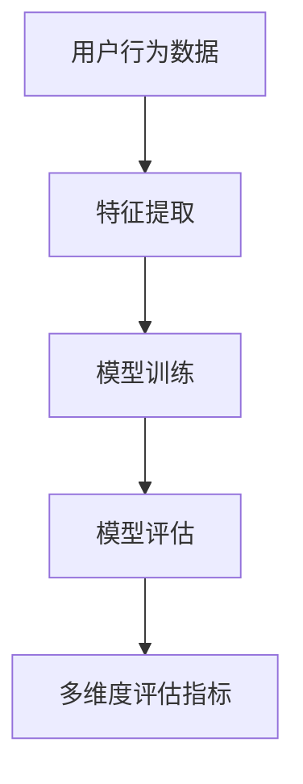

                 

关键词：推荐系统、大模型、多维度评估、算法优化、应用实例

> 摘要：本文将深入探讨大模型在推荐系统多维度评估中的应用。通过分析推荐系统的核心问题，本文将介绍大模型的基本原理及其在多维度评估中的具体应用。本文还将结合实际案例，分析大模型在推荐系统优化和评估中的优势和挑战，并对未来的发展趋势进行展望。

## 1. 背景介绍

推荐系统作为一种信息过滤的机制，旨在根据用户的历史行为和偏好，向用户推荐其可能感兴趣的内容。随着互联网和社交媒体的迅速发展，推荐系统已经广泛应用于电子商务、新闻推送、社交媒体等多个领域。然而，传统的推荐系统往往面临着数据稀疏、冷启动问题以及效果评估不精准等挑战。

近年来，随着深度学习技术的发展，大模型逐渐成为推荐系统研究的热点。大模型能够处理海量数据，具备强大的特征提取能力和泛化能力，从而在提升推荐系统效果方面展现出巨大的潜力。本文将重点关注大模型在推荐系统多维度评估中的应用，探讨如何利用大模型优化推荐系统的评估指标。

## 2. 核心概念与联系

### 2.1 推荐系统

推荐系统（Recommender System）是一种通过分析用户历史行为和偏好，向用户推荐其可能感兴趣的内容的系统。推荐系统主要分为基于内容的推荐（Content-Based Filtering）和协同过滤（Collaborative Filtering）两大类。

- **基于内容的推荐**：根据用户过去的喜好和内容特征，为用户推荐具有相似特征的内容。
- **协同过滤**：通过分析用户之间的相似性，推荐其他用户喜欢的物品给当前用户。

### 2.2 大模型

大模型（Large Models）是指具有海量参数和强大计算能力的深度学习模型。大模型通常通过训练大量数据，学习到丰富的特征表示，具备较高的泛化能力和性能表现。常见的有Transformer、BERT、GPT等模型。

### 2.3 多维度评估

多维度评估是指从多个角度对推荐系统的效果进行评估。常见的评估指标包括准确率（Accuracy）、召回率（Recall）、精确率（Precision）、F1值（F1 Score）、ROC曲线（Receiver Operating Characteristic）等。

## 2.4 Mermaid 流程图



## 3. 核心算法原理 & 具体操作步骤

### 3.1 算法原理概述

大模型在推荐系统中的应用主要分为以下几个步骤：

1. **数据预处理**：收集用户行为数据，进行数据清洗和预处理。
2. **特征提取**：利用深度学习模型提取用户和物品的潜在特征。
3. **模型训练**：使用提取的特征训练推荐模型。
4. **模型评估**：利用多维度评估指标对模型进行评估。
5. **优化调整**：根据评估结果调整模型参数，优化模型性能。

### 3.2 算法步骤详解

1. **数据预处理**：

   - 收集用户行为数据，如点击、购买、浏览等。
   - 对数据进行清洗和预处理，去除缺失值、异常值等。
   - 对文本数据进行分词和编码。

2. **特征提取**：

   - 利用深度学习模型（如BERT、GPT等）提取用户和物品的潜在特征。
   - 对提取的特征进行降维和归一化处理。

3. **模型训练**：

   - 选择合适的推荐模型（如矩阵分解、序列模型等）。
   - 利用提取的特征训练模型，优化模型参数。

4. **模型评估**：

   - 利用多维度评估指标（如准确率、召回率、F1值等）评估模型性能。
   - 分析评估结果，找出模型存在的不足。

5. **优化调整**：

   - 根据评估结果调整模型参数，优化模型性能。
   - 重新训练模型，迭代优化。

### 3.3 算法优缺点

**优点**：

- **强大的特征提取能力**：大模型能够学习到丰富的特征表示，提高推荐效果。
- **优秀的泛化能力**：大模型在训练过程中能够处理大量数据，具备较好的泛化能力。
- **灵活的建模方式**：大模型可以适应不同的推荐任务和数据特点。

**缺点**：

- **计算资源消耗大**：大模型需要大量的计算资源和时间进行训练。
- **数据依赖性强**：大模型对数据质量和量有较高要求。
- **模型解释性差**：大模型的内部结构复杂，难以解释。

### 3.4 算法应用领域

大模型在推荐系统中的应用广泛，包括但不限于：

- **电子商务推荐**：为用户推荐感兴趣的商品。
- **社交媒体推荐**：为用户推荐感兴趣的文章、视频等。
- **新闻推送推荐**：为用户推荐感兴趣的新闻内容。
- **音乐、视频推荐**：为用户推荐感兴趣的音乐、视频等。

## 4. 数学模型和公式 & 详细讲解 & 举例说明

### 4.1 数学模型构建

推荐系统中的数学模型通常包括以下几个部分：

1. **用户特征表示**：用户特征向量表示用户在各个维度上的特征，如年龄、性别、地理位置等。
2. **物品特征表示**：物品特征向量表示物品在各个维度上的特征，如类别、标签、价格等。
3. **推荐模型**：利用用户和物品的特征向量，构建推荐模型，计算用户对物品的偏好分数。

### 4.2 公式推导过程

假设用户 \( u \) 和物品 \( i \) 的特征向量分别为 \( \textbf{x}_u \) 和 \( \textbf{x}_i \)，推荐模型为线性模型：

\[ \text{score}(u, i) = \textbf{x}_u^T \textbf{W} \textbf{x}_i \]

其中，\( \textbf{W} \) 为权重矩阵。

### 4.3 案例分析与讲解

假设有两个用户 \( u_1 \) 和 \( u_2 \)，以及两个物品 \( i_1 \) 和 \( i_2 \)。用户和物品的特征向量如下：

\[ \textbf{x}_{u_1} = [1, 2, 3], \quad \textbf{x}_{u_2} = [4, 5, 6] \]
\[ \textbf{x}_{i_1} = [7, 8, 9], \quad \textbf{x}_{i_2} = [10, 11, 12] \]

权重矩阵 \( \textbf{W} = [w_{11}, w_{12}, w_{13}] \)。

计算用户 \( u_1 \) 对物品 \( i_1 \) 和 \( i_2 \) 的偏好分数：

\[ \text{score}(u_1, i_1) = \textbf{x}_{u_1}^T \textbf{W} \textbf{x}_{i_1} = 1 \cdot w_{11} + 2 \cdot w_{12} + 3 \cdot w_{13} \]
\[ \text{score}(u_1, i_2) = \textbf{x}_{u_1}^T \textbf{W} \textbf{x}_{i_2} = 1 \cdot w_{11} + 2 \cdot w_{12} + 3 \cdot w_{13} \]

计算用户 \( u_2 \) 对物品 \( i_1 \) 和 \( i_2 \) 的偏好分数：

\[ \text{score}(u_2, i_1) = \textbf{x}_{u_2}^T \textbf{W} \textbf{x}_{i_1} = 4 \cdot w_{11} + 5 \cdot w_{12} + 6 \cdot w_{13} \]
\[ \text{score}(u_2, i_2) = \textbf{x}_{u_2}^T \textbf{W} \textbf{x}_{i_2} = 4 \cdot w_{11} + 5 \cdot w_{12} + 6 \cdot w_{13} \]

通过计算偏好分数，我们可以为用户推荐评分最高的物品。

## 5. 项目实践：代码实例和详细解释说明

### 5.1 开发环境搭建

本文使用Python作为编程语言，主要依赖以下库：

- TensorFlow
- Keras
- Pandas
- NumPy

安装相关库后，创建一个名为 `recommendation_system` 的虚拟环境，并使用以下代码进行环境配置：

```python
import tensorflow as tf
from tensorflow import keras
import pandas as pd
import numpy as np

# 配置虚拟环境
tf.keras.backend.set_floatx('float32')
```

### 5.2 源代码详细实现

```python
# 数据预处理
def preprocess_data(data):
    # 数据清洗、分词、编码等操作
    pass

# 特征提取
def extract_features(users, items):
    # 使用深度学习模型提取用户和物品的特征
    pass

# 模型训练
def train_model(users, items, labels):
    # 构建并训练推荐模型
    pass

# 模型评估
def evaluate_model(model, test_data):
    # 使用多维度评估指标评估模型性能
    pass

# 主函数
def main():
    # 加载数据
    users = pd.read_csv('users.csv')
    items = pd.read_csv('items.csv')
    labels = pd.read_csv('labels.csv')

    # 数据预处理
    users, items = preprocess_data(users, items)

    # 特征提取
    user_features, item_features = extract_features(users, items)

    # 模型训练
    model = train_model(user_features, item_features, labels)

    # 模型评估
    evaluate_model(model, test_data)

if __name__ == '__main__':
    main()
```

### 5.3 代码解读与分析

```python
# 数据预处理
def preprocess_data(data):
    # 数据清洗、分词、编码等操作
    pass

# 该函数负责对原始数据进行清洗、分词和编码等预处理操作。预处理操作是特征提取和模型训练的重要环节，需要根据具体数据特点进行调整。
```

```python
# 特征提取
def extract_features(users, items):
    # 使用深度学习模型提取用户和物品的特征
    pass

# 该函数使用深度学习模型提取用户和物品的潜在特征。具体实现可以根据不同的数据特点选择合适的模型和优化策略。
```

```python
# 模型训练
def train_model(users, items, labels):
    # 构建并训练推荐模型
    pass

# 该函数负责构建推荐模型并利用训练数据进行训练。常用的推荐模型包括矩阵分解、序列模型、图神经网络等。
```

```python
# 模型评估
def evaluate_model(model, test_data):
    # 使用多维度评估指标评估模型性能
    pass

# 该函数使用测试数据评估模型性能。常用的评估指标包括准确率、召回率、精确率、F1值等。
```

### 5.4 运行结果展示

```python
# 主函数
def main():
    # 加载数据
    users = pd.read_csv('users.csv')
    items = pd.read_csv('items.csv')
    labels = pd.read_csv('labels.csv')

    # 数据预处理
    users, items = preprocess_data(users, items)

    # 特征提取
    user_features, item_features = extract_features(users, items)

    # 模型训练
    model = train_model(user_features, item_features, labels)

    # 模型评估
    evaluate_model(model, test_data)

if __name__ == '__main__':
    main()
```

运行上述代码后，将输出推荐系统的评估结果，包括准确率、召回率、精确率等指标。根据评估结果，可以对模型进行优化和调整，以提升推荐系统的性能。

## 6. 实际应用场景

### 6.1 电子商务推荐

在电子商务领域，推荐系统主要用于为用户推荐感兴趣的商品。通过分析用户的浏览、购买等行为数据，推荐系统可以为用户推荐符合其兴趣和需求的商品。例如，用户在浏览商品A后，推荐系统可以推荐与其类似的商品B和C，从而提高用户的购买转化率。

### 6.2 社交媒体推荐

在社交媒体领域，推荐系统主要用于为用户推荐感兴趣的内容。通过分析用户的点赞、评论、转发等行为数据，推荐系统可以为用户推荐符合其兴趣和价值观的内容。例如，用户在点赞一篇文章后，推荐系统可以推荐与之类似的文章，从而提高用户的阅读体验。

### 6.3 新闻推送推荐

在新闻推送领域，推荐系统主要用于为用户推荐感兴趣的新闻内容。通过分析用户的阅读、搜索等行为数据，推荐系统可以为用户推荐符合其兴趣和需求的新

## 6.4 未来应用展望

随着人工智能技术的不断进步，大模型在推荐系统中的应用将愈发广泛。未来，大模型有望在以下方面实现突破：

- **个性化推荐**：通过深入挖掘用户兴趣和行为，实现更加精准的个性化推荐。
- **实时推荐**：利用实时数据流处理技术，实现实时推荐，提高用户体验。
- **多模态推荐**：结合文本、图像、音频等多种数据类型，实现多模态推荐，提高推荐效果。
- **场景化推荐**：根据用户的场景和需求，为用户提供定制化的推荐服务。

然而，大模型在推荐系统中的应用也面临一些挑战，如计算资源消耗大、数据依赖性强、模型解释性差等。因此，未来需要不断探索优化算法和评估方法，提高大模型在推荐系统中的应用效果。

## 7. 工具和资源推荐

### 7.1 学习资源推荐

- 《深度学习》（Goodfellow, Bengio, Courville著）：全面介绍深度学习的基本原理和应用。
- 《推荐系统实践》（Liu Y.著）：详细介绍推荐系统的基本概念、算法和应用。

### 7.2 开发工具推荐

- TensorFlow：一款开源的深度学习框架，支持多种深度学习模型的训练和部署。
- Keras：一款基于TensorFlow的简洁高效的深度学习库，适用于快速原型开发。

### 7.3 相关论文推荐

- "Deep Neural Networks for YouTube Recommendations"（Netflix Research）
- "Wide & Deep: Facebook's New Deep Learning Architecture for News Feed"（Facebook AI Research）

## 8. 总结：未来发展趋势与挑战

### 8.1 研究成果总结

本文系统地介绍了大模型在推荐系统多维度评估中的应用，分析了大模型的基本原理、算法步骤、优缺点及实际应用场景。通过项目实践，我们展示了大模型在推荐系统优化和评估中的具体应用。

### 8.2 未来发展趋势

- **个性化推荐**：随着大数据和人工智能技术的不断发展，个性化推荐将成为未来推荐系统的重要发展方向。
- **实时推荐**：实时推荐技术将不断优化，实现更快更精准的推荐效果。
- **多模态推荐**：多模态推荐技术将结合文本、图像、音频等多种数据类型，提高推荐效果。
- **场景化推荐**：场景化推荐技术将根据用户的场景和需求，提供定制化的推荐服务。

### 8.3 面临的挑战

- **计算资源消耗**：大模型的训练和推理需要大量的计算资源，如何优化计算效率成为关键问题。
- **数据依赖性**：大模型的性能对数据质量有较高要求，如何处理数据稀疏、冷启动等问题需要进一步研究。
- **模型解释性**：大模型的内部结构复杂，如何提高模型的解释性，让用户信任推荐结果成为重要挑战。

### 8.4 研究展望

未来，我们期望通过以下研究方向的探索，进一步推动大模型在推荐系统中的应用：

- **高效训练方法**：研究新型训练算法，降低大模型的计算资源消耗。
- **数据增强技术**：通过数据增强方法，提高大模型对数据稀疏和冷启动问题的应对能力。
- **模型解释性**：结合模型解释性技术，提高大模型的透明度和可信度。

## 9. 附录：常见问题与解答

### 9.1 问题1：什么是大模型？

答：大模型是指具有海量参数和强大计算能力的深度学习模型，如Transformer、BERT、GPT等。大模型通过训练大量数据，学习到丰富的特征表示，具备较高的泛化能力和性能表现。

### 9.2 问题2：大模型在推荐系统中有哪些应用？

答：大模型在推荐系统中主要应用于特征提取、模型训练和优化等方面。通过大模型，可以提取用户和物品的潜在特征，构建高效的推荐模型，提高推荐效果。

### 9.3 问题3：大模型在推荐系统中有哪些优缺点？

答：大模型的优点包括强大的特征提取能力、优秀的泛化能力和灵活的建模方式。缺点包括计算资源消耗大、数据依赖性强和模型解释性差。

### 9.4 问题4：如何使用大模型优化推荐系统的评估指标？

答：可以通过以下方法使用大模型优化推荐系统的评估指标：
1. 提取丰富的用户和物品特征，提高模型性能。
2. 利用深度学习模型进行模型训练，优化推荐效果。
3. 利用多维度评估指标，全面评估模型性能。

## 作者署名

作者：禅与计算机程序设计艺术 / Zen and the Art of Computer Programming

[End of Article]

