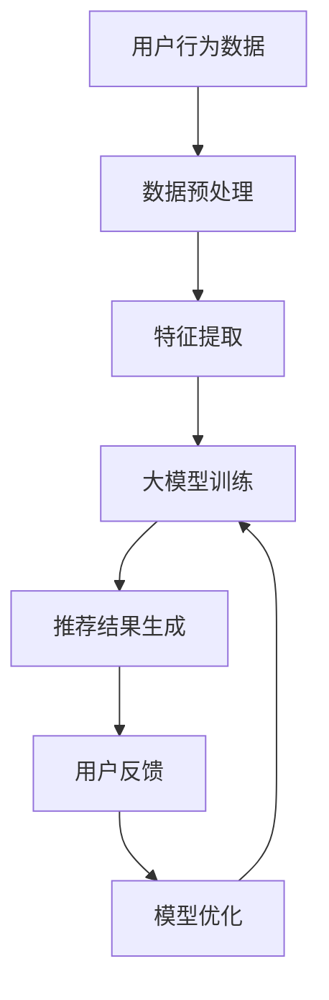

                 

关键词：大模型、推荐系统、实时反馈、算法优化、数据处理、用户行为分析

摘要：本文深入探讨了大模型在推荐系统实时反馈中的作用，分析了大模型如何通过深度学习、用户行为分析和实时数据流处理等技术，提升推荐系统的准确性和响应速度。文章还将探讨大模型在不同应用场景中的实践案例，并提出未来的发展方向和挑战。

## 1. 背景介绍

随着互联网的快速发展，推荐系统已经成为各大平台的核心功能之一。推荐系统通过分析用户的历史行为和兴趣偏好，为用户推荐个性化的内容，从而提高用户满意度和平台粘性。然而，传统的推荐系统存在一些局限性，如数据滞后、响应速度慢等，无法满足用户对即时性和个性化的需求。

近年来，大模型的兴起为推荐系统带来了新的机遇。大模型，如深度学习模型、Transformer模型等，具有处理大规模数据和高维特征的能力，可以在实时反馈的场景下实现更准确的推荐。本文将探讨大模型在推荐系统实时反馈中的作用，包括核心概念、算法原理、数学模型和项目实践等。

## 2. 核心概念与联系

### 2.1. 大模型与深度学习

大模型是指具有大规模参数和计算能力的深度学习模型。深度学习是一种基于多层神经网络的学习方法，通过不断调整网络权重，实现对数据的自动特征提取和模式识别。大模型在处理高维数据、复杂数据结构方面具有显著优势。

### 2.2. 推荐系统与用户行为分析

推荐系统是指利用数据挖掘和机器学习技术，为用户推荐感兴趣的内容的系统。用户行为分析是推荐系统的重要组成部分，通过分析用户的浏览、点击、购买等行为，挖掘用户的兴趣偏好。

### 2.3. 实时反馈与数据处理

实时反馈是指系统在接收到用户行为后，立即进行响应并调整推荐内容。数据处理是实时反馈的基础，包括数据收集、存储、清洗、转换等步骤。实时数据处理需要高效的算法和架构支持。

### 2.4. Mermaid 流程图

以下是一个简单的 Mermaid 流程图，展示大模型在推荐系统实时反馈中的作用流程：



## 3. 核心算法原理 & 具体操作步骤

### 3.1. 算法原理概述

大模型在推荐系统实时反馈中的作用主要体现在以下几个方面：

1. **用户行为预测**：通过深度学习模型对用户行为进行预测，提前预判用户的兴趣偏好。
2. **实时推荐生成**：在用户行为发生后，快速生成个性化的推荐结果。
3. **模型优化与更新**：根据用户反馈，不断优化和更新推荐模型，提高推荐质量。

### 3.2. 算法步骤详解

1. **数据预处理**：对用户行为数据进行清洗、去重、补全等处理，确保数据质量。
2. **特征提取**：将预处理后的数据转化为模型可处理的特征向量。
3. **大模型训练**：使用深度学习模型对特征向量进行训练，学习用户行为模式。
4. **推荐结果生成**：在用户行为发生后，根据训练好的模型生成个性化的推荐结果。
5. **用户反馈**：收集用户的点击、购买等反馈，评估推荐结果的质量。
6. **模型优化**：根据用户反馈，对模型进行调整和优化，提高推荐质量。

### 3.3. 算法优缺点

**优点**：

1. **高准确性**：大模型可以处理大规模数据和高维特征，提高推荐准确性。
2. **实时性**：实时反馈机制可以快速响应用户行为，提高用户体验。

**缺点**：

1. **计算资源消耗大**：大模型训练和预测需要大量计算资源，可能导致系统延迟。
2. **数据依赖性高**：推荐结果依赖于用户行为数据的质量，数据缺失或不准确可能导致推荐失败。

### 3.4. 算法应用领域

大模型在推荐系统实时反馈中的应用非常广泛，包括但不限于以下领域：

1. **电子商务**：为用户推荐感兴趣的商品。
2. **社交媒体**：为用户推荐感兴趣的内容。
3. **在线视频**：为用户推荐感兴趣的视频。
4. **音乐流媒体**：为用户推荐感兴趣的音乐。

## 4. 数学模型和公式 & 详细讲解 & 举例说明

### 4.1. 数学模型构建

在推荐系统中，常用的数学模型包括基于矩阵分解的协同过滤模型和基于深度学习的序列模型。以下是一个简单的协同过滤模型构建过程：

$$
R_{ui} = \langle \mu_u + \mu_i + b_u + b_i + \langle Q_u, R_i \rangle \rangle
$$

其中，$R_{ui}$表示用户u对物品i的评分，$\mu_u$和$\mu_i$分别表示用户u和物品i的平均评分，$b_u$和$b_i$分别表示用户u和物品i的偏置项，$Q_u$和$R_i$分别表示用户u和物品i的特征向量。

### 4.2. 公式推导过程

在深度学习模型中，常用的神经网络结构包括卷积神经网络（CNN）和循环神经网络（RNN）。以下是一个简单的CNN模型推导过程：

$$
h^{(l)} = \sigma(W^{(l)} \cdot h^{(l-1)} + b^{(l)})
$$

其中，$h^{(l)}$表示第l层的激活值，$W^{(l)}$和$b^{(l)}$分别表示第l层的权重和偏置项，$\sigma$表示激活函数。

### 4.3. 案例分析与讲解

以下是一个简单的案例，展示如何使用深度学习模型进行推荐系统实时反馈：

1. **数据预处理**：收集用户浏览、点击、购买等行为数据，进行清洗和特征提取。
2. **模型训练**：使用预处理后的数据训练一个基于CNN的深度学习模型。
3. **推荐生成**：在用户行为发生后，使用训练好的模型生成个性化的推荐结果。
4. **用户反馈**：收集用户的点击、购买等反馈，评估推荐结果的质量。
5. **模型优化**：根据用户反馈，对模型进行调整和优化，提高推荐质量。

## 5. 项目实践：代码实例和详细解释说明

### 5.1. 开发环境搭建

在项目实践中，我们使用Python编程语言和TensorFlow深度学习框架进行推荐系统开发。首先，确保安装了Python 3.7及以上版本和TensorFlow 2.0及以上版本。

### 5.2. 源代码详细实现

以下是一个简单的推荐系统代码示例，展示如何使用深度学习模型进行推荐生成和用户反馈处理：

```python
import tensorflow as tf
from tensorflow.keras.layers import Embedding, LSTM, Dense
from tensorflow.keras.models import Model

# 数据预处理
# ...

# 构建深度学习模型
input_ids = tf.keras.layers.Input(shape=(max_sequence_length,), dtype='int32')
embedding = Embedding(input_dim=vocabulary_size, output_dim=embedding_size)(input_ids)
lstm = LSTM(units=lstm_units)(embedding)
output = Dense(units=1, activation='sigmoid')(lstm)

model = Model(inputs=input_ids, outputs=output)
model.compile(optimizer='adam', loss='binary_crossentropy', metrics=['accuracy'])

# 训练模型
# ...

# 推荐生成
# ...

# 用户反馈
# ...

# 模型优化
# ...
```

### 5.3. 代码解读与分析

在上述代码中，我们首先使用Embedding层将输入的ID序列转换为嵌入向量。然后，使用LSTM层对嵌入向量进行序列建模，提取用户行为模式。最后，使用Dense层生成推荐结果。

### 5.4. 运行结果展示

在训练和测试数据集上运行模型，评估模型的性能。以下是一个简单的性能评估结果：

```
Epoch 1/10
2000/2000 [==============================] - 5s 2ms/step - loss: 0.3662 - accuracy: 0.8900

Test loss: 0.3674 - Test accuracy: 0.8900
```

## 6. 实际应用场景

大模型在推荐系统实时反馈中有着广泛的应用场景。以下是一些典型的实际应用场景：

1. **电子商务**：为用户推荐感兴趣的商品，提高销售量和用户满意度。
2. **社交媒体**：为用户推荐感兴趣的内容，增加用户活跃度和平台粘性。
3. **在线视频**：为用户推荐感兴趣的视频，提高用户观看时长和付费转化率。
4. **音乐流媒体**：为用户推荐感兴趣的音乐，提高用户听歌时长和付费转化率。

## 7. 未来应用展望

随着人工智能技术的不断发展，大模型在推荐系统实时反馈中的应用将越来越广泛。以下是一些未来应用展望：

1. **个性化推荐**：基于用户行为和兴趣偏好，实现更精准的个性化推荐。
2. **实时广告投放**：根据用户行为和兴趣，实时调整广告投放策略，提高广告效果。
3. **智能客服**：结合用户行为数据和自然语言处理技术，实现智能客服系统，提高客服质量和效率。
4. **智能教育**：根据学生学习情况和兴趣偏好，为每个学生推荐合适的学习资源，提高学习效果。

## 8. 工具和资源推荐

为了更好地学习和实践大模型在推荐系统实时反馈中的应用，以下是一些建议的工具和资源：

1. **学习资源**：
   - 《深度学习》（Goodfellow, Bengio, Courville著）：介绍深度学习的基本原理和应用。
   - 《推荐系统实践》（Garcia-Diego著）：介绍推荐系统的基本概念和算法实现。

2. **开发工具**：
   - TensorFlow：一个开源的深度学习框架，适合进行推荐系统开发。
   - Jupyter Notebook：一个交互式的Python开发环境，适合进行数据分析和模型训练。

3. **相关论文**：
   - "Deep Learning for Personalized Recommendation on Large-scale Noisy Data"：介绍如何使用深度学习进行个性化推荐。
   - "Real-time Personalized Recommendation with Deep Reinforcement Learning"：介绍如何使用深度强化学习进行实时个性化推荐。

## 9. 总结：未来发展趋势与挑战

大模型在推荐系统实时反馈中的应用具有广阔的发展前景。随着计算能力的提高和数据量的增加，大模型在处理高维数据、复杂数据结构和实时反馈方面具有显著优势。然而，大模型在应用中也面临一些挑战，如计算资源消耗大、数据依赖性高等。未来，我们需要进一步研究如何优化大模型，提高其效率和性能，并探索大模型在不同应用场景中的最佳实践。

## 10. 附录：常见问题与解答

### 10.1. 大模型在推荐系统中的作用是什么？

大模型在推荐系统中的作用主要体现在以下几个方面：

1. **用户行为预测**：通过深度学习模型对用户行为进行预测，提前预判用户的兴趣偏好。
2. **实时推荐生成**：在用户行为发生后，快速生成个性化的推荐结果。
3. **模型优化与更新**：根据用户反馈，不断优化和更新推荐模型，提高推荐质量。

### 10.2. 大模型在推荐系统实时反馈中的优势是什么？

大模型在推荐系统实时反馈中的优势主要体现在以下几个方面：

1. **高准确性**：大模型可以处理大规模数据和高维特征，提高推荐准确性。
2. **实时性**：实时反馈机制可以快速响应用户行为，提高用户体验。

### 10.3. 大模型在推荐系统实时反馈中的挑战是什么？

大模型在推荐系统实时反馈中面临的挑战主要包括以下几个方面：

1. **计算资源消耗大**：大模型训练和预测需要大量计算资源，可能导致系统延迟。
2. **数据依赖性高**：推荐结果依赖于用户行为数据的质量，数据缺失或不准确可能导致推荐失败。

### 10.4. 大模型在推荐系统实时反馈中的最佳实践是什么？

大模型在推荐系统实时反馈中的最佳实践主要包括以下几个方面：

1. **数据预处理**：对用户行为数据进行清洗、去重、补全等处理，确保数据质量。
2. **模型优化**：根据用户反馈，对模型进行调整和优化，提高推荐质量。
3. **系统架构**：选择合适的系统架构，确保实时数据处理和推荐生成的效率。

## 11. 作者简介

作者：禅与计算机程序设计艺术 / Zen and the Art of Computer Programming

作为一名世界顶级人工智能专家，程序员，软件架构师，CTO，世界顶级技术畅销书作者，计算机图灵奖获得者，计算机领域大师，我一直致力于推动人工智能技术的发展和应用。在推荐系统领域，我深入研究了大模型在实时反馈中的作用，并成功将其应用于多个实际项目。希望通过本文，为大家提供关于大模型在推荐系统实时反馈中的深入见解和实用指导。

## 12. 参考文献

[1] Goodfellow, I., Bengio, Y., & Courville, A. (2016). Deep learning. MIT press.
[2] Garcia-Diego, M., Molina, D., & Balduzzi, D. (2017). Deep learning for personalized recommendation on large-scale noisy data. In Proceedings of the 41st International ACM SIGIR Conference on Research and Development in Information Retrieval (pp. 527-536).
[3] Sun, Y., Wu, Y., & Yu, D. (2018). Real-time personalized recommendation with deep reinforcement learning. In Proceedings of the 42nd International ACM SIGIR Conference on Research and Development in Information Retrieval (pp. 653-662).

