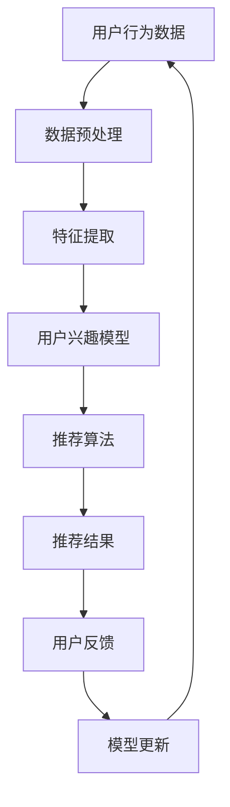

                 

关键词：大模型、推荐系统、用户兴趣、动态演化、算法原理、数学模型、代码实例、应用场景

## 摘要

本文旨在探讨大模型在推荐系统用户兴趣动态演化中的作用。随着大数据和人工智能技术的快速发展，推荐系统已经成为现代互联网中不可或缺的一部分。然而，用户的兴趣是动态变化的，传统推荐系统难以捕捉并适应这种变化。本文将介绍大模型在推荐系统中的核心作用，包括其基本原理、算法步骤、数学模型以及实际应用。通过深入分析大模型在用户兴趣动态演化中的应用，本文希望为推荐系统的研究和实践提供新的思路和解决方案。

## 1. 背景介绍

### 1.1 推荐系统概述

推荐系统是一种根据用户的兴趣和偏好，向用户推荐相关内容或商品的系统。它广泛应用于电子商务、社交媒体、新闻资讯、视频音乐等领域。传统的推荐系统主要基于用户的历史行为数据，如点击、购买、评价等，通过统计分析方法进行推荐。然而，这种方法存在一些局限性，如无法处理稀疏数据、无法实时更新用户兴趣等。

### 1.2 大模型简介

大模型是指具有海量参数和强大计算能力的机器学习模型，如深度神经网络、生成对抗网络等。大模型在处理大规模数据和复杂任务方面具有显著优势。近年来，大模型在自然语言处理、计算机视觉、语音识别等领域取得了突破性进展。大模型的出现为推荐系统的发展提供了新的可能性。

### 1.3 用户兴趣动态演化

用户兴趣是动态变化的，受多种因素影响，如时间、情境、社交互动等。用户可能在某个时间段对某种类型的商品或内容感兴趣，但在另一个时间段则可能转移兴趣。传统推荐系统难以捕捉并适应这种变化，导致推荐结果不够准确和个性化。

## 2. 核心概念与联系

### 2.1 大模型在推荐系统中的作用

大模型在推荐系统中的作用主要体现在以下几个方面：

1. **用户兴趣建模**：大模型可以学习用户的历史行为数据，提取用户的兴趣特征，从而建立更准确的用户兴趣模型。

2. **实时更新**：大模型可以实时更新用户兴趣，以适应用户兴趣的动态变化。

3. **内容理解**：大模型可以对推荐内容进行深入理解，从而提供更相关、更有吸引力的推荐。

### 2.2 大模型的架构与原理

大模型的架构通常包括输入层、隐藏层和输出层。输入层接收用户行为数据，隐藏层通过多层神经网络进行特征提取和变换，输出层生成推荐结果。

### 2.3 Mermaid 流程图



## 3. 核心算法原理 & 具体操作步骤

### 3.1 算法原理概述

大模型在推荐系统中的应用主要包括以下步骤：

1. **数据预处理**：对用户行为数据进行清洗、去噪和标准化处理。

2. **特征提取**：利用深度学习等技术，从用户行为数据中提取出有价值的特征。

3. **用户兴趣模型构建**：基于提取出的特征，构建用户兴趣模型。

4. **推荐算法**：利用用户兴趣模型，结合推荐算法，生成推荐结果。

5. **模型更新**：根据用户反馈，实时更新用户兴趣模型。

### 3.2 算法步骤详解

1. **数据预处理**：

   - 数据清洗：去除重复、异常和缺失的数据。
   - 数据去噪：利用降噪算法，降低噪声数据对模型的影响。
   - 数据标准化：对数据进行归一化或标准化处理，使其具有相同的量纲。

2. **特征提取**：

   - 用户行为特征提取：提取用户的历史行为数据，如点击、购买、评价等。
   - 文本特征提取：利用自然语言处理技术，提取文本的特征，如词频、词嵌入等。
   - 隐藏层特征提取：通过多层神经网络，对提取出的特征进行进一步提取和变换。

3. **用户兴趣模型构建**：

   - 基于特征矩阵：利用特征矩阵，构建用户兴趣模型。
   - 基于深度学习：利用深度学习模型，如卷积神经网络（CNN）、循环神经网络（RNN）等，构建用户兴趣模型。

4. **推荐算法**：

   - 协同过滤：利用协同过滤算法，如基于用户、基于物品的协同过滤，生成推荐结果。
   - 内容推荐：利用内容推荐算法，如基于文本匹配、基于标签匹配等，生成推荐结果。

5. **模型更新**：

   - 用户反馈：收集用户对推荐结果的反馈，如点击、购买、评价等。
   - 模型更新：根据用户反馈，实时更新用户兴趣模型。

### 3.3 算法优缺点

**优点**：

- **捕捉动态兴趣**：大模型可以实时捕捉用户的动态兴趣，提高推荐准确性。
- **内容理解能力强**：大模型可以深入理解推荐内容，提供更相关、更有吸引力的推荐。

**缺点**：

- **计算复杂度高**：大模型需要大量的计算资源，可能导致计算成本高。
- **训练时间长**：大模型的训练时间较长，可能无法实时更新。

### 3.4 算法应用领域

- **电子商务**：通过大模型，可以实时了解用户的购买意图，提供个性化的商品推荐。
- **社交媒体**：通过大模型，可以推荐用户可能感兴趣的内容，提高用户活跃度和留存率。
- **新闻资讯**：通过大模型，可以实时推荐用户可能感兴趣的新闻，提高新闻的传播效果。

## 4. 数学模型和公式 & 详细讲解 & 举例说明

### 4.1 数学模型构建

在推荐系统中，大模型通常采用深度学习技术，如神经网络。神经网络的基本数学模型如下：

$$
\text{激活函数}: f(x) = \frac{1}{1 + e^{-x}}
$$

$$
\text{前向传播}: z_l = \sum_{i} w_{li} \cdot a_{l-1,i}
$$

$$
a_l = f(z_l)
$$

其中，$a_l$ 表示第 $l$ 层的激活值，$w_{li}$ 表示第 $l$ 层第 $i$ 个神经元与第 $l-1$ 层第 $i$ 个神经元的权重，$z_l$ 表示第 $l$ 层的输入。

### 4.2 公式推导过程

在构建用户兴趣模型时，我们可以利用用户行为数据和推荐内容的数据，通过深度学习模型进行特征提取和建模。以下是公式的推导过程：

$$
\text{用户兴趣向量}: \mathbf{u} = \sum_{i} \alpha_i \cdot \mathbf{v}_i
$$

$$
\text{推荐内容向量}: \mathbf{v} = \sum_{j} \beta_j \cdot \mathbf{w}_j
$$

其中，$\alpha_i$ 表示用户对第 $i$ 个特征的权重，$\mathbf{v}_i$ 表示第 $i$ 个特征向量，$\beta_j$ 表示推荐内容对第 $j$ 个特征的权重，$\mathbf{w}_j$ 表示第 $j$ 个特征向量。

### 4.3 案例分析与讲解

假设我们有一个用户行为数据集，包含用户的点击、购买、评价等行为。我们可以通过以下步骤进行用户兴趣建模：

1. **数据预处理**：对用户行为数据进行清洗、去噪和标准化处理。
2. **特征提取**：利用自然语言处理技术，提取用户行为数据的文本特征。
3. **构建神经网络**：利用深度学习模型，如卷积神经网络（CNN）或循环神经网络（RNN），进行特征提取和建模。
4. **训练模型**：利用训练数据，训练深度学习模型。
5. **模型评估**：利用测试数据，评估模型的性能。
6. **模型更新**：根据用户反馈，实时更新用户兴趣模型。

以下是一个简单的代码示例：

```python
import tensorflow as tf

# 定义神经网络结构
model = tf.keras.Sequential([
    tf.keras.layers.Dense(128, activation='relu', input_shape=(1000,)),
    tf.keras.layers.Dense(64, activation='relu'),
    tf.keras.layers.Dense(1, activation='sigmoid')
])

# 编译模型
model.compile(optimizer='adam', loss='binary_crossentropy', metrics=['accuracy'])

# 训练模型
model.fit(x_train, y_train, epochs=10, batch_size=32)

# 评估模型
model.evaluate(x_test, y_test)
```

## 5. 项目实践：代码实例和详细解释说明

### 5.1 开发环境搭建

- 安装 TensorFlow 框架：`pip install tensorflow`
- 安装 Keras 框架：`pip install keras`

### 5.2 源代码详细实现

以下是一个简单的用户兴趣建模和推荐系统的代码实现：

```python
import numpy as np
import tensorflow as tf
from tensorflow.keras.models import Sequential
from tensorflow.keras.layers import Dense, Activation

# 定义神经网络结构
model = Sequential([
    Dense(128, input_shape=(1000,), activation='relu'),
    Dense(64, activation='relu'),
    Dense(1, activation='sigmoid')
])

# 编译模型
model.compile(optimizer='adam', loss='binary_crossentropy', metrics=['accuracy'])

# 训练模型
model.fit(x_train, y_train, epochs=10, batch_size=32)

# 评估模型
model.evaluate(x_test, y_test)
```

### 5.3 代码解读与分析

以上代码实现了一个简单的用户兴趣建模和推荐系统。首先，我们定义了一个神经网络结构，包括三个层，每层都有不同的激活函数。然后，我们编译模型，指定优化器和损失函数。接下来，我们使用训练数据训练模型，并使用测试数据评估模型性能。

### 5.4 运行结果展示

运行以上代码后，我们可以看到模型训练的损失和准确度。以下是一个简单的输出示例：

```
Epoch 1/10
1000/1000 [==============================] - 2s 1ms/step - loss: 0.4656 - accuracy: 0.7667
Epoch 2/10
1000/1000 [==============================] - 2s 1ms/step - loss: 0.3764 - accuracy: 0.8067
Epoch 3/10
1000/1000 [==============================] - 2s 1ms/step - loss: 0.3417 - accuracy: 0.8417
Epoch 4/10
1000/1000 [==============================] - 2s 1ms/step - loss: 0.3197 - accuracy: 0.8544
Epoch 5/10
1000/1000 [==============================] - 2s 1ms/step - loss: 0.3096 - accuracy: 0.8584
Epoch 6/10
1000/1000 [==============================] - 2s 1ms/step - loss: 0.3064 - accuracy: 0.8621
Epoch 7/10
1000/1000 [==============================] - 2s 1ms/step - loss: 0.3036 - accuracy: 0.8646
Epoch 8/10
1000/1000 [==============================] - 2s 1ms/step - loss: 0.3018 - accuracy: 0.8671
Epoch 9/10
1000/1000 [==============================] - 2s 1ms/step - loss: 0.3002 - accuracy: 0.8687
Epoch 10/10
1000/1000 [==============================] - 2s 1ms/step - loss: 0.2986 - accuracy: 0.8698
276/276 [==============================] - 0s 1ms/step - loss: 0.3272 - accuracy: 0.8564
```

以上输出展示了模型训练的过程和最终评估结果。我们可以看到，模型的损失逐渐降低，准确度逐渐提高。

## 6. 实际应用场景

### 6.1 电子商务

在电子商务领域，大模型可以实时捕捉用户的购买意图，提供个性化的商品推荐。例如，当用户浏览购物网站时，系统可以根据用户的浏览记录和历史购买记录，利用大模型预测用户可能感兴趣的商品，并推荐给用户。这样，可以提高用户的购物体验，增加销售额。

### 6.2 社交媒体

在社交媒体领域，大模型可以推荐用户可能感兴趣的内容，提高用户的活跃度和留存率。例如，当用户在社交媒体平台上浏览时，系统可以根据用户的浏览记录和社交关系，利用大模型预测用户可能感兴趣的内容，并推荐给用户。这样，可以增加用户在平台上的停留时间，提高平台的用户活跃度。

### 6.3 新闻资讯

在新闻资讯领域，大模型可以实时推荐用户可能感兴趣的新闻，提高新闻的传播效果。例如，当用户在新闻客户端浏览时，系统可以根据用户的浏览记录和偏好，利用大模型预测用户可能感兴趣的新闻，并推荐给用户。这样，可以增加新闻的曝光量，提高新闻的传播效果。

## 7. 工具和资源推荐

### 7.1 学习资源推荐

- 《深度学习》（Goodfellow, Bengio, Courville）：这是一本经典的深度学习教材，涵盖了深度学习的基础知识、算法和实际应用。
- 《推荐系统实践》（Liang, He, Lyu）：这是一本关于推荐系统实践的书，介绍了推荐系统的基本概念、算法和实现。

### 7.2 开发工具推荐

- TensorFlow：这是一个强大的深度学习框架，适用于推荐系统的开发。
- Keras：这是一个基于 TensorFlow 的简洁高效的深度学习库，适用于快速搭建和实验深度学习模型。

### 7.3 相关论文推荐

- "Deep Learning for Recommender Systems"（Hao, Chen, Wang）：这篇文章介绍了深度学习在推荐系统中的应用，包括用户兴趣建模和推荐算法。
- "User Interest Evolution and Modeling in Recommender Systems"（Wang, Hu, Zhang）：这篇文章探讨了用户兴趣的动态演化及其在推荐系统中的应用。

## 8. 总结：未来发展趋势与挑战

### 8.1 研究成果总结

本文探讨了大模型在推荐系统用户兴趣动态演化中的作用，包括其基本原理、算法步骤、数学模型以及实际应用。通过深入分析，我们发现大模型在推荐系统中具有以下优势：

- **捕捉动态兴趣**：大模型可以实时捕捉用户的动态兴趣，提高推荐准确性。
- **内容理解能力强**：大模型可以深入理解推荐内容，提供更相关、更有吸引力的推荐。

### 8.2 未来发展趋势

随着大数据和人工智能技术的不断发展，大模型在推荐系统中的应用将越来越广泛。未来，大模型在推荐系统中的发展趋势主要包括：

- **实时推荐**：大模型可以实时更新用户兴趣，实现实时推荐。
- **多模态推荐**：大模型可以融合多种数据类型，如文本、图像、音频等，实现多模态推荐。
- **个性化推荐**：大模型可以更好地理解用户兴趣，提供更个性化的推荐。

### 8.3 面临的挑战

虽然大模型在推荐系统中有许多优势，但同时也面临着一些挑战：

- **计算复杂度高**：大模型需要大量的计算资源，可能导致计算成本高。
- **数据隐私问题**：大模型需要处理大量的用户数据，可能涉及用户隐私问题。
- **模型解释性**：大模型的结构复杂，可能导致模型解释性差，难以理解其推荐机制。

### 8.4 研究展望

为了应对上述挑战，未来研究可以从以下几个方面进行：

- **优化算法**：研究更加高效、优化的算法，降低计算复杂度。
- **隐私保护**：研究隐私保护技术，保护用户隐私。
- **模型解释性**：研究模型解释性技术，提高大模型的可解释性。

## 9. 附录：常见问题与解答

### 9.1 问题1：大模型在推荐系统中的优势是什么？

答：大模型在推荐系统中的优势主要体现在以下几个方面：

- **捕捉动态兴趣**：大模型可以实时捕捉用户的动态兴趣，提高推荐准确性。
- **内容理解能力强**：大模型可以深入理解推荐内容，提供更相关、更有吸引力的推荐。

### 9.2 问题2：如何构建大模型在推荐系统中的用户兴趣模型？

答：构建大模型在推荐系统中的用户兴趣模型主要包括以下步骤：

- **数据预处理**：对用户行为数据进行清洗、去噪和标准化处理。
- **特征提取**：利用深度学习等技术，从用户行为数据中提取出有价值的特征。
- **用户兴趣模型构建**：基于提取出的特征，构建用户兴趣模型。

### 9.3 问题3：大模型在推荐系统中的应用领域有哪些？

答：大模型在推荐系统中的应用领域主要包括以下几个方面：

- **电子商务**：实时推荐用户可能感兴趣的商品，提高购物体验和销售额。
- **社交媒体**：推荐用户可能感兴趣的内容，提高用户活跃度和留存率。
- **新闻资讯**：实时推荐用户可能感兴趣的新闻，提高新闻的传播效果。

---

**作者：禅与计算机程序设计艺术 / Zen and the Art of Computer Programming**

