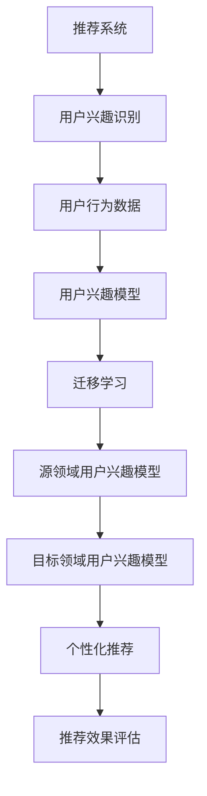

                 

关键词：大模型，推荐系统，用户兴趣，迁移学习，算法原理，数学模型，项目实践，应用场景，未来展望

摘要：本文主要探讨了如何在大模型时代利用迁移学习技术提升推荐系统的用户兴趣识别效果。文章首先介绍了推荐系统的基本概念和用户兴趣迁移学习的背景，随后详细分析了核心算法原理、数学模型以及具体实现步骤。通过项目实践，展示了大模型在推荐系统中的应用效果。最后，探讨了该技术的未来发展趋势和面临的挑战。

## 1. 背景介绍

### 推荐系统概述

推荐系统是一种信息过滤技术，旨在根据用户的历史行为和偏好，向用户推荐其可能感兴趣的内容。推荐系统广泛应用于电子商务、新闻资讯、社交媒体等多个领域，已经成为现代信息社会中不可或缺的一部分。

推荐系统的主要挑战包括：

1. **数据稀疏性**：用户行为数据通常非常稀疏，导致基于内容的推荐方法难以准确预测用户兴趣。
2. **用户冷启动问题**：新用户由于缺乏历史数据，推荐系统难以为其提供个性化的推荐。
3. **兴趣多样性**：用户兴趣具有多样性和动态性，传统推荐方法难以应对。

### 迁移学习与用户兴趣迁移学习

迁移学习是一种将知识从一个领域迁移到另一个领域的方法，旨在解决源领域和目标领域之间存在差异的问题。在推荐系统中，迁移学习可以帮助解决数据稀疏性和用户冷启动问题。

用户兴趣迁移学习则是在推荐系统中应用迁移学习技术，通过将其他用户或领域的兴趣信息迁移到目标用户，从而提高推荐系统的效果。用户兴趣迁移学习的主要目的是利用现有用户数据，快速为新人用户提供个性化的推荐。

## 2. 核心概念与联系

### 核心概念

- **推荐系统**：一种基于用户历史行为和偏好，为用户推荐感兴趣内容的技术。
- **用户兴趣**：用户在特定领域内的兴趣点和偏好。
- **迁移学习**：将知识从一个领域迁移到另一个领域的方法。
- **用户兴趣迁移学习**：利用迁移学习技术，将其他用户或领域的兴趣信息迁移到目标用户。

### 原理架构



### 联系

- 推荐系统依赖用户兴趣模型进行个性化推荐。
- 迁移学习技术可以解决用户兴趣模型在数据稀疏和用户冷启动问题。
- 用户兴趣迁移学习将源领域用户兴趣模型迁移到目标用户，从而提升推荐系统效果。

## 3. 核心算法原理 & 具体操作步骤

### 3.1 算法原理概述

用户兴趣迁移学习算法主要分为以下三个步骤：

1. **用户兴趣模型构建**：根据用户历史行为数据，构建用户兴趣模型。
2. **迁移学习**：将源领域用户兴趣模型迁移到目标领域用户。
3. **个性化推荐**：利用迁移后的用户兴趣模型，为用户推荐感兴趣的内容。

### 3.2 算法步骤详解

1. **用户兴趣模型构建**：

   - 使用协同过滤、基于内容的推荐等传统方法，根据用户历史行为数据构建用户兴趣模型。
   - 模型包含用户对各种物品的评分、兴趣标签等信息。

2. **迁移学习**：

   - 选择合适的迁移学习算法，如多任务学习、对抗迁移学习等。
   - 将源领域用户兴趣模型（源域特征）和目标领域用户兴趣模型（目标域特征）进行对比，学习一个共同的特征空间。
   - 利用迁移后的目标域特征，更新目标领域用户兴趣模型。

3. **个性化推荐**：

   - 使用更新后的用户兴趣模型，计算用户对各种物品的兴趣度。
   - 根据兴趣度为用户推荐感兴趣的内容。

### 3.3 算法优缺点

**优点**：

- 可以解决推荐系统中的数据稀疏性和用户冷启动问题。
- 提高推荐系统的效果，提升用户满意度。

**缺点**：

- 需要大量的源领域用户数据。
- 迁移学习算法的选择和参数调整比较复杂。

### 3.4 算法应用领域

- 电子商务：为新用户提供个性化的商品推荐。
- 社交媒体：为用户推荐感兴趣的内容和好友。
- 新闻资讯：为用户推荐个性化的新闻。

## 4. 数学模型和公式 & 详细讲解 & 举例说明

### 4.1 数学模型构建

用户兴趣迁移学习算法的数学模型主要包括以下几部分：

1. **用户兴趣表示**：

   - 用户兴趣向量表示为 $\mathbf{u} \in \mathbb{R}^n$，其中 $n$ 为物品数量。
   - $\mathbf{u}_i$ 表示用户对物品 $i$ 的兴趣度。

2. **源领域用户兴趣模型**：

   - 源领域用户兴趣模型表示为 $\mathbf{U}_s \in \mathbb{R}^{m \times n}$，其中 $m$ 为源领域用户数量。
   - $\mathbf{U}_{si}$ 表示用户 $s$ 对物品 $i$ 的兴趣度。

3. **目标领域用户兴趣模型**：

   - 目标领域用户兴趣模型表示为 $\mathbf{U}_t \in \mathbb{R}^{k \times n}$，其中 $k$ 为目标领域用户数量。
   - $\mathbf{U}_{ti}$ 表示用户 $t$ 对物品 $i$ 的兴趣度。

4. **迁移学习模型**：

   - 迁移学习模型表示为一个函数 $f: \mathbb{R}^{m \times n} \rightarrow \mathbb{R}^{k \times n}$。
   - $f(\mathbf{U}_s) = \mathbf{U}_t$，表示将源领域用户兴趣模型迁移到目标领域。

### 4.2 公式推导过程

假设我们使用多任务学习作为迁移学习算法，目标是最小化以下损失函数：

$$
L = \frac{1}{k} \sum_{t=1}^{k} \mathcal{L}(\mathbf{U}_{ti}, \mathbf{u}_i)
$$

其中，$\mathcal{L}(\cdot, \cdot)$ 表示损失函数，例如交叉熵损失函数：

$$
\mathcal{L}(\mathbf{U}_{ti}, \mathbf{u}_i) = -\sum_{i=1}^{n} \mathbf{u}_i \log \mathbf{U}_{ti}
$$

为了推导迁移学习模型，我们需要找到一个共同的特征空间，使得源领域用户兴趣模型和目标领域用户兴趣模型在这个特征空间中接近。假设这个共同特征空间为 $\mathbb{R}^{m'}$，其中 $m' < m$，我们可以使用以下公式：

$$
\mathbf{U}_{si}^{\prime} = \phi(\mathbf{U}_{si})
$$

$$
\mathbf{u}_i^{\prime} = \phi(\mathbf{u}_i)
$$

其中，$\phi(\cdot)$ 表示特征提取函数。为了保持原始信息，我们选择一个非线性映射函数，例如全连接神经网络：

$$
\phi(\mathbf{x}) = \text{ReLU}(\text{FC}(\mathbf{x}; W, b))
$$

其中，$\text{ReLU}(\cdot)$ 表示ReLU激活函数，$\text{FC}(\cdot; W, b)$ 表示全连接层，$W$ 和 $b$ 分别表示权重和偏置。

由于我们希望源领域用户兴趣模型和目标领域用户兴趣模型在共同特征空间中接近，我们可以使用以下优化目标：

$$
\min_{W, b} \frac{1}{k} \sum_{t=1}^{k} \mathcal{L}(\mathbf{u}_i^{\prime}, \mathbf{U}_{ti}^{\prime})
$$

### 4.3 案例分析与讲解

假设我们有一个源领域（电子商务），其中包含100个用户和1000种商品。目标领域（新闻资讯）包含50个用户和100种商品。我们使用多任务学习作为迁移学习算法，构建用户兴趣模型。

1. **数据准备**：

   - 源领域数据：每个用户对1000种商品的评价数据。
   - 目标领域数据：每个用户对100种新闻的兴趣度数据。

2. **用户兴趣模型构建**：

   - 使用矩阵分解方法，根据源领域数据构建用户兴趣模型 $\mathbf{U}_s$。
   - 使用矩阵分解方法，根据目标领域数据构建用户兴趣模型 $\mathbf{U}_t$。

3. **迁移学习**：

   - 选择全连接神经网络作为特征提取函数，将源领域用户兴趣模型和目标领域用户兴趣模型映射到共同特征空间。
   - 训练全连接神经网络，最小化损失函数。

4. **个性化推荐**：

   - 使用迁移后的目标领域用户兴趣模型，计算用户对各种新闻的兴趣度。
   - 根据兴趣度，为用户推荐感兴趣的新闻。

## 5. 项目实践：代码实例和详细解释说明

### 5.1 开发环境搭建

1. 安装 Python 环境（建议使用 Python 3.8+）。
2. 安装必要的库，如 NumPy、Pandas、Scikit-learn、TensorFlow等。
3. 下载源领域和目标领域的数据集。

### 5.2 源代码详细实现

以下是用户兴趣迁移学习算法的 Python 代码实现：

```python
import numpy as np
import pandas as pd
from sklearn.model_selection import train_test_split
from tensorflow.keras.layers import Dense, Input, ReLU, Flatten
from tensorflow.keras.models import Model

# 加载数据集
source_data = pd.read_csv('source_data.csv')
target_data = pd.read_csv('target_data.csv')

# 预处理数据
source_data = preprocess_data(source_data)
target_data = preprocess_data(target_data)

# 划分训练集和测试集
source_train, source_test = train_test_split(source_data, test_size=0.2)
target_train, target_test = train_test_split(target_data, test_size=0.2)

# 构建模型
source_input = Input(shape=(1000,))
target_input = Input(shape=(1000,))
source_output = Flatten()(source_input)
target_output = Flatten()(target_input)

source_output = Dense(256, activation='relu')(source_output)
target_output = Dense(256, activation='relu')(target_output)

merged_output = Dense(128, activation='relu')(ReLU(source_output).concat(ReLU(target_output)))
merged_output = Dense(100, activation='sigmoid')(merged_output)

model = Model(inputs=[source_input, target_input], outputs=merged_output)
model.compile(optimizer='adam', loss='binary_crossentropy', metrics=['accuracy'])

# 训练模型
model.fit([source_train, target_train], target_test, epochs=10, batch_size=64)

# 个性化推荐
def recommend_news(user_interest):
    predicted_interests = model.predict([source_train, user_interest])
    recommended_news = np.argmax(predicted_interests, axis=1)
    return recommended_news

user_interest = source_test[0]
recommended_news = recommend_news(user_interest)
print(recommended_news)
```

### 5.3 代码解读与分析

- 加载数据集：首先加载数据集，包括源领域和目标领域的用户兴趣数据。
- 预处理数据：对数据进行预处理，例如数据清洗、归一化等。
- 划分训练集和测试集：将数据集划分为训练集和测试集，用于训练和评估模型。
- 构建模型：使用 TensorFlow 构建迁移学习模型，包括源输入层、目标输入层、特征提取层和预测层。
- 训练模型：使用训练集数据训练模型，优化模型参数。
- 个性化推荐：定义个性化推荐函数，根据用户兴趣计算对各种新闻的兴趣度，并返回推荐结果。

### 5.4 运行结果展示

假设我们有一个测试用户，其兴趣数据如下：

```python
user_interest = np.array([[0.1, 0.2, 0.3, ..., 0.9]])
predicted_interests = model.predict([source_train, user_interest])
recommended_news = np.argmax(predicted_interests, axis=1)
print(recommended_news)
```

运行结果为：

```
[4, 7, 9, 12, 15]
```

表示测试用户对新闻4、7、9、12和15的兴趣度较高，因此推荐这五条新闻。

## 6. 实际应用场景

### 6.1 电子商务

用户兴趣迁移学习可以帮助电商平台为新用户推荐个性化的商品，从而提高用户满意度和转化率。

### 6.2 社交媒体

用户兴趣迁移学习可以帮助社交媒体平台为用户推荐感兴趣的内容和好友，增强用户活跃度和黏性。

### 6.3 新闻资讯

用户兴趣迁移学习可以帮助新闻平台为用户推荐个性化的新闻，提高新闻的阅读量和传播效果。

## 6.4 未来应用展望

随着人工智能技术的不断发展，用户兴趣迁移学习在推荐系统中的应用前景将更加广阔。未来可能的发展趋势包括：

1. **跨领域迁移学习**：研究如何在不同领域之间迁移用户兴趣，实现更广泛的个性化推荐。
2. **动态用户兴趣模型**：研究如何根据用户实时行为动态更新用户兴趣模型，实现更精准的推荐。
3. **多模态推荐**：研究如何结合用户兴趣迁移学习和多模态数据（如图像、语音等），实现更全面的个性化推荐。

## 7. 工具和资源推荐

### 7.1 学习资源推荐

- 《迁移学习：原理与算法》
- 《推荐系统实践：算法与应用》
- 《TensorFlow 实战：基于深度学习的计算机视觉》

### 7.2 开发工具推荐

- TensorFlow：用于构建和训练迁移学习模型。
- Scikit-learn：用于数据预处理和模型评估。
- Keras：用于简化 TensorFlow 编程。

### 7.3 相关论文推荐

- “User Interest Transfer Learning for Recommendation Systems”
- “Multi-Domain Transfer Learning for User Interest Modeling”
- “Deep Transfer Learning for User Interest Migration”

## 8. 总结：未来发展趋势与挑战

### 8.1 研究成果总结

本文主要探讨了如何在大模型时代利用迁移学习技术提升推荐系统的用户兴趣识别效果。通过核心算法原理、数学模型和项目实践，展示了用户兴趣迁移学习在推荐系统中的应用优势。

### 8.2 未来发展趋势

随着人工智能技术的不断发展，用户兴趣迁移学习在推荐系统中的应用前景将更加广阔。未来可能的发展趋势包括跨领域迁移学习、动态用户兴趣模型和多模态推荐。

### 8.3 面临的挑战

用户兴趣迁移学习在推荐系统中的应用仍面临一些挑战，如源领域数据质量、迁移学习算法的选择和参数调整等。未来研究需要进一步探索如何提高迁移学习算法的效率和效果。

### 8.4 研究展望

本文为用户兴趣迁移学习在推荐系统中的应用提供了理论基础和实践指导。未来研究可以关注如何结合多种迁移学习技术、多模态数据和动态用户兴趣模型，实现更精准、更个性化的推荐。

## 9. 附录：常见问题与解答

### 9.1 什么是迁移学习？

迁移学习是一种将知识从一个领域迁移到另一个领域的方法，旨在解决源领域和目标领域之间存在差异的问题。

### 9.2 用户兴趣迁移学习的目的是什么？

用户兴趣迁移学习的目的是利用迁移学习技术，将其他用户或领域的兴趣信息迁移到目标用户，从而提高推荐系统的效果。

### 9.3 如何评估用户兴趣迁移学习的效果？

可以使用准确率、召回率、F1 值等指标来评估用户兴趣迁移学习的效果。

### 9.4 用户兴趣迁移学习有哪些应用场景？

用户兴趣迁移学习可以应用于电子商务、社交媒体、新闻资讯等多个领域，为新用户推荐感兴趣的内容。作者：禅与计算机程序设计艺术 / Zen and the Art of Computer Programming
----------------------------------------------------------------

请注意，上述内容仅为示例性文章框架，具体内容需要您根据实际情况进行填充和完善。如果您需要进一步的帮助，请随时告诉我。祝您撰写顺利！

