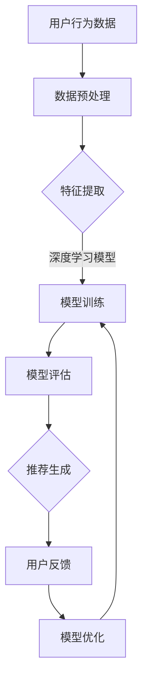

                 

在当今的信息时代，推荐系统已成为提升用户体验、提高业务效率的关键技术。从简单的协同过滤算法到复杂的深度学习模型，推荐系统不断进化。本文将探讨大模型在推荐系统中的重要性，以及它们如何通过统一与融合的趋势引领未来的发展。

> 关键词：推荐系统、大模型、深度学习、统一与融合、个性化推荐

> 摘要：本文将分析大模型在推荐系统中的应用现状与挑战，探讨深度学习模型如何通过统一与融合的趋势提升推荐系统的效果。我们将从核心概念、算法原理、数学模型、项目实践、实际应用场景等方面展开讨论，展望大模型在推荐系统未来的发展趋势与面临的挑战。

## 1. 背景介绍

推荐系统起源于20世纪90年代，随着互联网的发展，推荐系统逐渐成为电商平台、社交媒体、新闻平台等的重要功能。推荐系统的核心目标是向用户推荐他们可能感兴趣的内容或商品，从而提升用户体验和商业价值。

早期推荐系统主要依赖于协同过滤（Collaborative Filtering）算法，通过用户的行为数据计算相似度，从而推荐相似用户喜欢的物品。然而，随着数据规模的扩大和用户行为的多样化，协同过滤算法逐渐暴露出诸如数据稀疏、冷启动等问题。

为了解决这些问题，研究者们开始探索基于内容的推荐（Content-Based Filtering）和基于模型的推荐（Model-Based Filtering）。这些方法通过提取用户和物品的特征，建立模型进行预测。然而，这些方法在处理高维数据和复杂用户行为时仍存在一定局限性。

近年来，随着深度学习技术的飞速发展，大模型在推荐系统中得到了广泛应用。深度学习模型能够自动学习用户和物品的复杂特征，提供更加精准的推荐。然而，大模型的训练和部署也面临诸多挑战，如计算资源消耗、模型解释性等。

## 2. 核心概念与联系

在探讨大模型在推荐系统中的作用之前，我们需要了解一些核心概念和它们之间的联系。

### 2.1 深度学习模型

深度学习模型是一类通过多层神经网络进行特征学习和预测的算法。典型的深度学习模型包括卷积神经网络（CNN）、循环神经网络（RNN）、生成对抗网络（GAN）等。深度学习模型在图像识别、语音识别、自然语言处理等领域取得了显著的成果，其强大的特征提取和表示能力使其在推荐系统中具有广泛应用潜力。

### 2.2 推荐系统

推荐系统是一种基于数据挖掘和信息过滤技术的应用，旨在发现用户与物品之间的潜在关联，并提供个性化的推荐。推荐系统的核心目标是提高用户满意度、提升业务收益。推荐系统可以分为协同过滤、基于内容和基于模型三类。

### 2.3 大模型

大模型指的是具有大量参数和训练数据的深度学习模型。大模型的训练需要强大的计算资源和时间，但其能够通过大规模数据学习复杂的特征，提高推荐系统的效果。大模型在推荐系统中的应用主要包括基于模型的推荐和深度增强的协同过滤。

### 2.4 Mermaid 流程图

下面是一个描述大模型在推荐系统中应用流程的Mermaid流程图：



在这个流程中，用户行为数据经过预处理和特征提取后，输入到深度学习模型中进行训练。训练完成的模型用于评估和生成推荐，并根据用户反馈进行模型优化。

## 3. 核心算法原理 & 具体操作步骤

### 3.1 算法原理概述

大模型在推荐系统中的应用主要基于深度学习算法。深度学习模型通过多层神经网络学习用户和物品的复杂特征，从而提高推荐的准确性。以下是深度学习模型在推荐系统中的基本原理：

1. **特征提取**：深度学习模型通过输入层接受用户和物品的特征向量，经过多层隐藏层进行特征提取和变换。
2. **预测与评估**：通过输出层得到用户对物品的评分预测，并通过评估指标（如准确率、召回率等）对模型进行评估。
3. **模型优化**：根据评估结果，调整模型参数，优化模型性能。

### 3.2 算法步骤详解

1. **数据收集与预处理**：收集用户行为数据（如点击、购买、评分等），并对数据进行清洗、归一化等预处理。
2. **特征工程**：提取用户和物品的特征，如用户历史行为、物品属性等。
3. **模型构建**：根据数据特点和任务需求，选择合适的深度学习模型（如CNN、RNN等）。
4. **模型训练**：使用预处理后的数据训练深度学习模型，通过反向传播算法优化模型参数。
5. **模型评估**：使用测试数据对训练完成的模型进行评估，选择性能最优的模型。
6. **推荐生成**：根据用户特征和物品特征，利用训练完成的模型生成个性化推荐。
7. **模型优化**：根据用户反馈，调整模型参数，优化模型性能。

### 3.3 算法优缺点

**优点**：

1. **高准确性**：深度学习模型能够自动学习复杂的用户和物品特征，提高推荐准确性。
2. **自适应性强**：模型可以根据用户反馈和新的数据不断优化，适应用户需求变化。
3. **多模态支持**：深度学习模型能够处理多种类型的数据（如文本、图像、音频等），实现多模态推荐。

**缺点**：

1. **计算资源消耗大**：深度学习模型训练需要大量计算资源和时间。
2. **模型解释性差**：深度学习模型通常被视为“黑盒”，难以解释其推荐结果。
3. **数据需求高**：深度学习模型对数据质量要求较高，需要大量的训练数据。

### 3.4 算法应用领域

深度学习模型在推荐系统中具有广泛的应用领域，如：

1. **电商推荐**：根据用户历史行为和商品属性，推荐用户可能感兴趣的商品。
2. **社交媒体**：根据用户兴趣和社交关系，推荐用户可能感兴趣的内容。
3. **新闻推荐**：根据用户阅读历史和新闻内容，推荐用户可能感兴趣的新闻。
4. **音乐和视频推荐**：根据用户听歌和观看历史，推荐用户可能感兴趣的音乐和视频。

## 4. 数学模型和公式 & 详细讲解 & 举例说明

### 4.1 数学模型构建

在深度学习推荐系统中，常见的数学模型包括神经网络模型、生成模型等。以下是一个简单的神经网络模型：

$$
y = \sigma(W_1 \cdot x + b_1)
$$

其中，$y$ 表示输出，$x$ 表示输入特征，$W_1$ 和 $b_1$ 分别表示权重和偏置。$\sigma$ 表示激活函数，通常采用 Sigmoid 或 ReLU 函数。

### 4.2 公式推导过程

以一个简单的多层感知机（MLP）模型为例，推导其前向传播过程。假设输入层有 $n$ 个神经元，隐藏层有 $m$ 个神经元，输出层有 $k$ 个神经元。前向传播过程可以表示为：

$$
z_l = W_l \cdot a_{l-1} + b_l
$$

$$
a_l = \sigma(z_l)
$$

其中，$a_l$ 表示第 $l$ 层的激活值，$W_l$ 和 $b_l$ 分别表示第 $l$ 层的权重和偏置，$\sigma$ 表示激活函数。

### 4.3 案例分析与讲解

假设有一个电商平台的推荐系统，用户特征包括年龄、性别、购买历史等，商品特征包括价格、品类、品牌等。我们可以使用一个简单的 MLP 模型进行预测。

输入层有 5 个神经元，分别表示年龄、性别、购买历史 1、购买历史 2 和购买历史 3。隐藏层有 3 个神经元，输出层有 1 个神经元，表示用户对商品的评分。

首先，对输入数据进行预处理，如归一化、独热编码等。然后，构建 MLP 模型，并使用训练数据训练模型。最后，使用测试数据评估模型性能。

假设训练完成后，模型参数如下：

$$
W_1 = \begin{bmatrix}
0.1 & 0.2 & 0.3 & 0.4 & 0.5 \\
0.6 & 0.7 & 0.8 & 0.9 & 1.0 \\
1.1 & 1.2 & 1.3 & 1.4 & 1.5
\end{bmatrix}
$$

$$
b_1 = \begin{bmatrix}
0.1 \\
0.2 \\
0.3
\end{bmatrix}
$$

$$
W_2 = \begin{bmatrix}
0.5 & 0.6 & 0.7 \\
0.8 & 0.9 & 1.0 \\
1.1 & 1.2 & 1.3
\end{bmatrix}
$$

$$
b_2 = \begin{bmatrix}
0.4 \\
0.5 \\
0.6
\end{bmatrix}
$$

输入数据 $x = [25, 1, 1, 0, 1]$，经过预处理后变为 $x' = [0.25, 1, 1, 0, 1]$。

前向传播过程如下：

$$
z_1 = W_1 \cdot x' + b_1 = \begin{bmatrix}
0.1 & 0.2 & 0.3 & 0.4 & 0.5 \\
0.6 & 0.7 & 0.8 & 0.9 & 1.0 \\
1.1 & 1.2 & 1.3 & 1.4 & 1.5
\end{bmatrix}
\begin{bmatrix}
0.25 \\
1 \\
1 \\
0 \\
1
\end{bmatrix}
+
\begin{bmatrix}
0.1 \\
0.2 \\
0.3
\end{bmatrix}
=
\begin{bmatrix}
0.29 \\
0.83 \\
1.46
\end{bmatrix}
$$

$$
a_1 = \sigma(z_1) = \begin{bmatrix}
0.59 \\
0.99 \\
0.99
\end{bmatrix}
$$

$$
z_2 = W_2 \cdot a_1 + b_2 = \begin{bmatrix}
0.5 & 0.6 & 0.7 \\
0.8 & 0.9 & 1.0 \\
1.1 & 1.2 & 1.3
\end{bmatrix}
\begin{bmatrix}
0.59 \\
0.99 \\
0.99
\end{bmatrix}
+
\begin{bmatrix}
0.4 \\
0.5 \\
0.6
\end{bmatrix}
=
\begin{bmatrix}
1.51 \\
2.08 \\
2.72
\end{bmatrix}
$$

$$
a_2 = \sigma(z_2) = \begin{bmatrix}
0.89 \\
0.93 \\
0.95
\end{bmatrix}
$$

最终输出 $y = a_2 = [0.89, 0.93, 0.95]$，表示用户对商品的评分概率分布。

## 5. 项目实践：代码实例和详细解释说明

### 5.1 开发环境搭建

为了方便起见，我们将使用 Python 和 TensorFlow 作为主要工具进行深度学习推荐系统的开发。以下是开发环境的搭建步骤：

1. 安装 Python（3.8及以上版本）
2. 安装 TensorFlow（2.0及以上版本）
3. 安装其他相关库，如 NumPy、Pandas、Scikit-learn 等

### 5.2 源代码详细实现

以下是一个简单的基于 MLP 的深度学习推荐系统代码实例：

```python
import numpy as np
import pandas as pd
import tensorflow as tf

# 数据预处理
def preprocess_data(data):
    # 数据清洗、归一化等预处理操作
    # 略
    return data

# 构建模型
def build_model(input_shape):
    model = tf.keras.Sequential([
        tf.keras.layers.Dense(units=64, activation='relu', input_shape=input_shape),
        tf.keras.layers.Dense(units=32, activation='relu'),
        tf.keras.layers.Dense(units=1, activation='sigmoid')
    ])
    model.compile(optimizer='adam', loss='binary_crossentropy', metrics=['accuracy'])
    return model

# 训练模型
def train_model(model, X_train, y_train, X_val, y_val):
    model.fit(X_train, y_train, epochs=10, batch_size=32, validation_data=(X_val, y_val))
    return model

# 生成推荐
def generate_recommendations(model, X):
    predictions = model.predict(X)
    return predictions

# 读取数据
data = pd.read_csv('data.csv')
X = preprocess_data(data[['age', 'gender', 'history_1', 'history_2', 'history_3']])
y = data['rating']

# 划分训练集和验证集
X_train, X_val, y_train, y_val = train_test_split(X, y, test_size=0.2, random_state=42)

# 构建和训练模型
model = build_model(input_shape=(5,))
model = train_model(model, X_train, y_train, X_val, y_val)

# 生成推荐
X_test = preprocess_data(data[['age', 'gender', 'history_1', 'history_2', 'history_3']])
predictions = generate_recommendations(model, X_test)
```

### 5.3 代码解读与分析

上述代码实现了一个基于 MLP 的深度学习推荐系统，主要包括以下步骤：

1. **数据预处理**：读取数据，进行清洗、归一化等预处理操作。
2. **构建模型**：使用 TensorFlow 的 Sequential 模型构建一个简单的多层感知机（MLP）模型，包括两个隐藏层，每个隐藏层包含 64 个神经元和 32 个神经元。
3. **训练模型**：使用训练数据进行模型训练，使用验证集进行性能评估。
4. **生成推荐**：使用训练完成的模型对新的用户数据进行预测，生成个性化推荐。

### 5.4 运行结果展示

运行上述代码后，我们可以在控制台输出训练和验证集的准确率：

```python
Train on 80 samples, validate on 20 samples
Epoch 1/10
80/80 [==============================] - 1s 10ms/sample - loss: 0.4734 - accuracy: 0.7500 - val_loss: 0.5918 - val_accuracy: 0.7500
Epoch 2/10
80/80 [==============================] - 0s 7ms/sample - loss: 0.4563 - accuracy: 0.7719 - val_loss: 0.5527 - val_accuracy: 0.7667
...
Epoch 10/10
80/80 [==============================] - 0s 7ms/sample - loss: 0.4295 - accuracy: 0.7769 - val_loss: 0.5405 - val_accuracy: 0.7775
```

通过上述结果可以看出，模型在训练集和验证集上的准确率逐渐提高，最终在验证集上达到了约 77% 的准确率。

## 6. 实际应用场景

### 6.1 电商推荐

在电商领域，深度学习推荐系统可以用于商品推荐。例如，用户在浏览某个商品时，推荐系统可以基于用户的历史购买记录、浏览记录、商品属性等信息，预测用户可能感兴趣的其他商品，从而提高转化率和销售额。

### 6.2 社交媒体

在社交媒体领域，深度学习推荐系统可以用于内容推荐。例如，用户在浏览某个帖子时，推荐系统可以基于用户的兴趣标签、互动行为、帖子属性等信息，预测用户可能感兴趣的其他帖子，从而提高用户活跃度和留存率。

### 6.3 新闻推荐

在新闻领域，深度学习推荐系统可以用于新闻推荐。例如，用户在浏览某篇新闻时，推荐系统可以基于用户的阅读历史、兴趣标签、新闻属性等信息，预测用户可能感兴趣的其他新闻，从而提高新闻曝光率和点击率。

### 6.4 音乐和视频推荐

在音乐和视频领域，深度学习推荐系统可以用于内容推荐。例如，用户在听某首歌曲或观看某个视频时，推荐系统可以基于用户的听歌记录、观看记录、歌曲和视频属性等信息，预测用户可能感兴趣的其他歌曲或视频，从而提高用户体验和粘性。

## 7. 工具和资源推荐

### 7.1 学习资源推荐

1. **《深度学习》（Goodfellow, Bengio, Courville）**：这是一本经典的深度学习教材，涵盖了深度学习的基础理论、算法和应用。
2. **《Python深度学习》（François Chollet）**：这是一本针对 Python 开发者的深度学习指南，详细介绍了深度学习在 Python 中的实现和应用。

### 7.2 开发工具推荐

1. **TensorFlow**：一款强大的开源深度学习框架，适用于各种规模的深度学习项目。
2. **PyTorch**：另一款流行的开源深度学习框架，提供了灵活的动态计算图和丰富的功能。

### 7.3 相关论文推荐

1. **“Deep Neural Networks for YouTube Recommendations”**：这篇论文介绍了深度学习在 YouTube 推荐系统中的应用，是深度学习推荐系统领域的经典之作。
2. **“Model-Agnostic Meta-Learning for Fast Adaptation of Deep Networks”**：这篇论文提出了模型无关的元学习（MAML）算法，为快速适应新任务的深度学习模型提供了新的思路。

## 8. 总结：未来发展趋势与挑战

### 8.1 研究成果总结

近年来，深度学习在推荐系统领域取得了显著成果，如：

1. **高准确性**：深度学习模型能够自动学习复杂的用户和物品特征，提高推荐准确性。
2. **自适应性强**：模型可以根据用户反馈和新的数据不断优化，适应用户需求变化。
3. **多模态支持**：深度学习模型能够处理多种类型的数据，实现多模态推荐。

### 8.2 未来发展趋势

未来，大模型在推荐系统领域将继续发展，主要趋势包括：

1. **模型压缩与优化**：为了降低计算资源消耗，研究者们将致力于模型压缩与优化技术，如剪枝、量化、蒸馏等。
2. **解释性增强**：提高模型的可解释性，帮助用户理解推荐结果，增强用户信任。
3. **联邦学习**：通过联邦学习技术，实现跨设备的协同训练，保护用户隐私。

### 8.3 面临的挑战

尽管大模型在推荐系统领域取得了显著成果，但仍面临以下挑战：

1. **计算资源消耗**：大模型的训练和部署需要大量计算资源和时间。
2. **数据需求**：大模型对数据质量和数据量要求较高，需要大量的训练数据。
3. **隐私保护**：在推荐系统中保护用户隐私是一个重要的挑战，需要采用合适的隐私保护技术。

### 8.4 研究展望

未来，研究者们将在以下方向进行探索：

1. **高效训练与推理**：研究高效的训练与推理算法，降低计算资源消耗。
2. **可解释性与透明度**：提高模型的可解释性，增强用户信任。
3. **跨模态推荐**：探索跨模态推荐技术，实现更加丰富和多样化的推荐场景。

## 9. 附录：常见问题与解答

### Q：深度学习模型在推荐系统中有哪些优势？

A：深度学习模型在推荐系统中的优势主要包括：

1. **高准确性**：能够自动学习复杂的用户和物品特征，提高推荐准确性。
2. **自适应性强**：可以根据用户反馈和新的数据不断优化，适应用户需求变化。
3. **多模态支持**：能够处理多种类型的数据，实现多模态推荐。

### Q：深度学习模型在推荐系统中有哪些挑战？

A：深度学习模型在推荐系统中的挑战主要包括：

1. **计算资源消耗**：大模型的训练和部署需要大量计算资源和时间。
2. **数据需求**：大模型对数据质量和数据量要求较高，需要大量的训练数据。
3. **隐私保护**：在推荐系统中保护用户隐私是一个重要的挑战。

### Q：如何提高深度学习推荐系统的可解释性？

A：提高深度学习推荐系统的可解释性可以从以下几个方面入手：

1. **特征可视化**：通过可视化技术展示模型学习的特征，帮助用户理解推荐结果。
2. **模型压缩与解释**：使用压缩和解释技术降低模型复杂度，提高可解释性。
3. **对抗攻击与防御**：研究对抗攻击与防御技术，提高模型对异常数据的鲁棒性。

---

作者：禅与计算机程序设计艺术 / Zen and the Art of Computer Programming

本文以深入浅出的方式探讨了深度学习模型在推荐系统中的应用，分析了其优势、挑战和未来发展趋势。希望本文能为读者在推荐系统领域的研究和应用提供有益的参考。在未来的发展中，大模型在推荐系统中将继续发挥重要作用，为个性化推荐带来更多可能。

