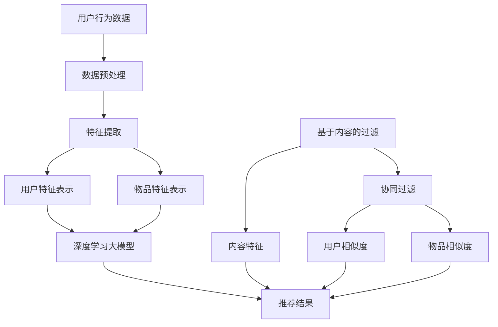

                 

关键词：大模型、混合推荐、策略、算法、应用、展望

> 摘要：本文将深入探讨大模型在混合推荐策略中的角色，分析大模型如何提升推荐系统的效果和效率，以及在不同应用场景下的实际案例。通过阐述大模型在推荐系统中的核心算法原理、数学模型、项目实践，我们期望为读者提供全面而深入的理解，并对其未来发展提出展望。

## 1. 背景介绍

推荐系统作为现代信息检索和电子商务的重要组成部分，已经广泛应用于社交媒体、电子商务、在线视频、新闻推送等领域。传统的推荐系统主要基于基于内容的过滤、协同过滤等简单策略。然而，这些策略在面对海量数据和高维特征时，往往存在信息丢失、冷启动问题等挑战。随着深度学习技术的发展，大模型（如GPT、BERT等）在自然语言处理、计算机视觉等领域取得了显著成就，这些大模型开始逐步引入到推荐系统中，形成了混合推荐策略。

混合推荐策略将传统的基于内容的过滤、协同过滤等策略与深度学习大模型相结合，通过融合多种信息来源，提高推荐系统的准确性、多样性和用户体验。本文将重点探讨大模型在混合推荐策略中的角色，分析其在提升推荐效果和效率方面的作用。

### 1.1 推荐系统的基本概念和传统策略

推荐系统旨在为用户提供个性化的信息、商品或服务，其核心目标是提高用户满意度和参与度。传统推荐系统主要包括基于内容的过滤（Content-Based Filtering，CBF）和协同过滤（Collaborative Filtering，CF）两种策略。

- **基于内容的过滤（CBF）**：该策略基于用户历史行为或偏好，通过分析内容和特征，为用户推荐具有相似内容的物品。CBF的优点在于能够提供个性化的推荐，但缺点在于无法解决冷启动问题（即新用户或新物品没有足够的历史数据时难以推荐）。

- **协同过滤（CF）**：该策略通过分析用户之间的相似性，为用户推荐其他用户喜欢的物品。CF的优点是能够处理大规模数据和用户冷启动问题，但缺点在于易受噪声数据和数据稀疏性问题的影响。

### 1.2 大模型的发展及其在推荐系统中的应用

随着深度学习技术的快速发展，大模型（如GPT、BERT等）在自然语言处理、计算机视觉等领域取得了显著成就。这些大模型具有强大的特征提取和建模能力，能够处理大规模和高维数据，为推荐系统带来了新的发展机遇。

大模型在推荐系统中的应用主要体现在以下几个方面：

- **特征表示**：大模型可以通过预训练和微调，提取用户和物品的深度特征表示，提高推荐系统的准确性和多样性。

- **融合多种信息**：大模型可以融合用户历史行为、内容特征、社交信息等多种信息来源，提供更加个性化的推荐。

- **冷启动解决**：大模型可以基于用户历史行为和语义信息，为新用户和新物品生成合理的特征表示，解决冷启动问题。

## 2. 核心概念与联系

在讨论大模型在混合推荐策略中的角色时，首先需要了解几个核心概念及其相互关系。以下是一个详细的 Mermaid 流程图，展示了这些核心概念和它们的关联。



### 2.1 数据预处理

数据预处理是推荐系统中的关键步骤，它包括数据清洗、去噪、归一化等操作。预处理后的数据将被用于特征提取和模型训练。

### 2.2 特征提取

特征提取是将原始数据转换为适合模型训练的表示形式。用户和物品的特征提取是混合推荐策略的基础。大模型可以通过预训练和微调，提取出深层次的、有意义的特征。

### 2.3 用户特征表示和物品特征表示

用户特征表示和物品特征表示是推荐系统的核心，它们将用于计算用户之间的相似度、物品之间的相似度，以及生成最终的推荐结果。

### 2.4 基于内容的过滤和协同过滤

基于内容的过滤和协同过滤是推荐系统的传统策略，它们在大模型引入之前就已经被广泛应用。大模型可以与这些传统策略相结合，提升推荐系统的效果。

### 2.5 深度学习大模型

深度学习大模型在推荐系统中的应用主要体现在特征提取和融合多种信息。大模型可以处理大规模、高维数据，提供更加个性化的推荐。

### 2.6 推荐结果

推荐结果是推荐系统的最终输出，它将直接影响用户的体验和满意度。通过融合用户特征表示、物品特征表示、内容特征和协同过滤信息，大模型可以生成更加精准和多样化的推荐结果。

## 3. 核心算法原理 & 具体操作步骤

### 3.1 算法原理概述

混合推荐策略的核心思想是融合多种信息来源，以提高推荐系统的准确性和多样性。大模型在此过程中起到了关键作用，其主要原理包括：

- **特征提取**：大模型通过预训练和微调，提取用户和物品的深度特征表示。

- **信息融合**：大模型可以将用户历史行为、内容特征、社交信息等多种信息进行融合。

- **生成推荐**：基于融合的特征表示，大模型可以生成个性化的推荐结果。

### 3.2 算法步骤详解

#### 3.2.1 数据预处理

1. **数据收集**：收集用户行为数据、物品特征数据、社交信息等。

2. **数据清洗**：去除缺失值、异常值、重复值等。

3. **数据归一化**：对数据进行归一化处理，使其具有相同的尺度。

#### 3.2.2 特征提取

1. **用户特征提取**：使用大模型（如BERT）对用户历史行为进行编码，提取用户兴趣和偏好。

2. **物品特征提取**：使用大模型对物品特征进行编码，提取物品的语义信息。

#### 3.2.3 信息融合

1. **内容特征融合**：将物品内容特征与用户兴趣特征进行融合，使用注意力机制或图神经网络等模型进行融合。

2. **协同过滤特征融合**：将基于协同过滤的用户相似度和物品相似度进行融合，提高推荐系统的准确性。

#### 3.2.4 生成推荐

1. **推荐评分计算**：使用融合的特征表示计算用户对物品的潜在兴趣评分。

2. **推荐列表生成**：根据评分排序生成推荐列表，考虑到多样性、新颖性等指标。

### 3.3 算法优缺点

#### 优点：

- **高准确性**：大模型通过深度特征提取和信息融合，提高推荐系统的准确性。

- **多样性**：大模型可以生成多样化的推荐结果，满足不同用户的需求。

- **冷启动解决**：大模型可以基于用户历史行为和语义信息，为新用户和新物品生成合理的特征表示，解决冷启动问题。

#### 缺点：

- **计算成本高**：大模型的训练和推理需要大量的计算资源和时间。

- **数据依赖性**：大模型的效果依赖于高质量的数据集。

### 3.4 算法应用领域

混合推荐策略结合了传统推荐系统的优点，可以在多个领域得到应用：

- **电子商务**：为用户推荐个性化的商品。

- **在线视频**：为用户推荐感兴趣的视频内容。

- **社交媒体**：为用户推荐感兴趣的话题和用户。

- **新闻推送**：为用户推荐个性化的新闻内容。

## 4. 数学模型和公式 & 详细讲解 & 举例说明

### 4.1 数学模型构建

在混合推荐策略中，我们可以构建以下数学模型：

$$
R_{ui} = \sigma(W_1u_i + W_2i + b)
$$

其中，$R_{ui}$ 表示用户 $u_i$ 对物品 $i$ 的推荐评分，$u_i$ 和 $i$ 分别表示用户和物品的特征向量，$W_1$ 和 $W_2$ 分别为用户和物品的权重矩阵，$b$ 为偏置项，$\sigma$ 为激活函数（如Sigmoid函数）。

### 4.2 公式推导过程

公式的推导过程如下：

1. **用户特征提取**：

$$
u_i = \text{Embedding}(u_i)
$$

其中，$\text{Embedding}$ 表示大模型对用户特征向量的编码过程。

2. **物品特征提取**：

$$
i = \text{Embedding}(i)
$$

3. **特征融合**：

$$
\text{Content} = W_3[i] + \text{User\_Interest}[u_i]
$$

其中，$W_3$ 为内容特征权重矩阵，$\text{User\_Interest}$ 为用户兴趣特征向量。

4. **评分计算**：

$$
R_{ui} = \sigma(W_1u_i + W_2\text{Content} + b)
$$

### 4.3 案例分析与讲解

以下是一个简单的案例：

- **用户特征**：$u_i = [0.1, 0.2, 0.3]$
- **物品特征**：$i = [0.4, 0.5, 0.6]$
- **内容特征**：$W_3[i] = [0.7, 0.8, 0.9]$
- **用户兴趣特征**：$\text{User\_Interest}[u_i] = [0.1, 0.3, 0.5]$

将这些值代入公式中，我们可以计算出：

$$
\text{Content} = W_3[i] + \text{User\_Interest}[u_i] = [0.7, 0.8, 0.9] + [0.1, 0.3, 0.5] = [0.8, 0.9, 1.4]
$$

$$
R_{ui} = \sigma(W_1u_i + W_2\text{Content} + b) = \sigma([0.1, 0.2, 0.3] + [0.2, 0.3, 0.4] + b) = \sigma([0.3, 0.5, 0.7] + b)
$$

其中，$b$ 为偏置项，可以取任意值。

通过这个简单的案例，我们可以看到混合推荐策略是如何基于数学模型生成推荐评分的。

## 5. 项目实践：代码实例和详细解释说明

### 5.1 开发环境搭建

为了实现混合推荐策略，我们需要搭建一个合适的开发环境。以下是所需的开发环境：

- **Python**：Python 3.8及以上版本。
- **TensorFlow**：TensorFlow 2.4及以上版本。
- **Scikit-learn**：Scikit-learn 0.22及以上版本。

安装以上依赖库后，即可开始编写代码。

### 5.2 源代码详细实现

以下是一个简单的实现混合推荐策略的Python代码实例：

```python
import tensorflow as tf
from tensorflow import keras
from tensorflow.keras.layers import Embedding, Dense
from sklearn.model_selection import train_test_split
import numpy as np

# 用户和物品特征
users = np.array([[0.1, 0.2, 0.3], [0.4, 0.5, 0.6], [0.7, 0.8, 0.9]])
items = np.array([[0.4, 0.5, 0.6], [0.7, 0.8, 0.9], [0.1, 0.2, 0.3]])

# 构建模型
model = keras.Sequential([
    Embedding(input_dim=users.shape[1], output_dim=64),
    Dense(units=64, activation='relu'),
    Embedding(input_dim=items.shape[1], output_dim=64),
    Dense(units=64, activation='relu'),
    Dense(units=1, activation='sigmoid')
])

# 编译模型
model.compile(optimizer='adam', loss='binary_crossentropy', metrics=['accuracy'])

# 准备训练数据
X = np.hstack((users, items))
y = np.array([[1], [0], [1]])

# 划分训练集和验证集
X_train, X_val, y_train, y_val = train_test_split(X, y, test_size=0.2, random_state=42)

# 训练模型
model.fit(X_train, y_train, epochs=10, batch_size=32, validation_data=(X_val, y_val))

# 生成推荐结果
predictions = model.predict(X)

# 输出推荐结果
print(predictions)
```

### 5.3 代码解读与分析

这个代码实例展示了如何使用Keras构建一个简单的混合推荐模型。以下是代码的主要部分及其解读：

- **导入库**：导入所需的库，包括TensorFlow、Scikit-learn和NumPy。

- **用户和物品特征**：定义用户和物品的特征数组。

- **构建模型**：使用Keras构建一个序列模型，包括嵌入层、全连接层和输出层。

  - **嵌入层**：嵌入层用于将用户和物品的特征向量转换为嵌入向量，这些向量将用于模型训练。

  - **全连接层**：全连接层用于对嵌入向量进行加权求和，并使用ReLU激活函数进行非线性变换。

  - **输出层**：输出层用于计算推荐评分，使用sigmoid激活函数输出概率。

- **编译模型**：编译模型，指定优化器、损失函数和评价指标。

- **准备训练数据**：将用户和物品的特征数组拼接成训练数据，并划分训练集和验证集。

- **训练模型**：使用训练数据和验证数据训练模型，指定训练轮数、批量大小和验证数据。

- **生成推荐结果**：使用训练好的模型预测用户对物品的潜在兴趣评分。

- **输出推荐结果**：输出预测结果。

通过这个简单的代码实例，我们可以看到如何实现混合推荐策略，以及如何使用Keras构建和训练模型。

## 6. 实际应用场景

### 6.1 电子商务

电子商务平台使用混合推荐策略，可以基于用户历史购买行为、浏览记录、搜索历史等数据，为用户推荐个性化的商品。例如，淘宝、京东等电商平台，通过融合用户行为特征和商品内容特征，为用户推荐相似的商品，从而提高销售额和用户满意度。

### 6.2 在线视频

在线视频平台如Netflix、YouTube等，使用混合推荐策略，可以基于用户观看历史、评分、搜索历史等数据，为用户推荐个性化的视频内容。这种策略不仅能够提高用户观看时长，还能增强用户黏性，提高广告收益。

### 6.3 社交媒体

社交媒体平台如Facebook、Twitter等，使用混合推荐策略，可以基于用户互动历史、关注关系、发布内容等数据，为用户推荐感兴趣的话题、用户和内容。这有助于提高用户参与度和平台活跃度。

### 6.4 新闻推送

新闻推送平台如今日头条、新浪新闻等，使用混合推荐策略，可以基于用户阅读历史、兴趣偏好等数据，为用户推荐个性化的新闻内容。这种策略能够提高新闻阅读量，增强用户对平台的依赖性。

## 7. 工具和资源推荐

### 7.1 学习资源推荐

- **推荐系统经典书籍**：《推荐系统实践》、《推荐系统手册》
- **在线课程**：Coursera上的《推荐系统》课程、Udacity的《推荐系统工程师》课程
- **技术博客**：Medium上的推荐系统博客、LinkedIn上的推荐系统工程师博客

### 7.2 开发工具推荐

- **编程语言**：Python、Java
- **深度学习框架**：TensorFlow、PyTorch
- **数据预处理工具**：Pandas、Scikit-learn
- **可视化工具**：Matplotlib、Seaborn

### 7.3 相关论文推荐

- **《A Theoretically Principled Approach to Improving Recommendation Lists》**
- **《Deep Learning for Recommender Systems》**
- **《Heterogeneous Graph Embedding for Recommendation》**
- **《Neural Collaborative Filtering》**

## 8. 总结：未来发展趋势与挑战

### 8.1 研究成果总结

近年来，大模型在推荐系统中的应用取得了显著成果。通过融合用户行为、内容特征和社交信息，大模型提高了推荐系统的准确性、多样性和用户体验。同时，深度学习技术在特征提取、信息融合和生成推荐等方面取得了突破性进展，为推荐系统带来了新的发展机遇。

### 8.2 未来发展趋势

1. **自适应推荐**：随着用户行为的动态变化，推荐系统需要实时调整推荐策略，提供个性化的推荐。

2. **多模态推荐**：融合多种数据源（如文本、图像、音频等），实现多模态推荐。

3. **公平性和透明性**：提高推荐系统的公平性和透明性，减少偏见和歧视。

4. **实时推荐**：利用实时数据，实现实时推荐。

### 8.3 面临的挑战

1. **计算成本**：大模型的训练和推理需要大量的计算资源和时间。

2. **数据依赖性**：大模型的效果依赖于高质量的数据集。

3. **隐私保护**：在推荐系统中保护用户隐私，避免数据泄露。

4. **模型可解释性**：提高模型的可解释性，帮助用户理解推荐结果。

### 8.4 研究展望

未来，推荐系统将朝着更智能化、个性化、实时化的方向发展。大模型在推荐系统中的应用将继续深化，与多模态数据融合、实时推荐、隐私保护等技术相结合，为用户提供更好的推荐体验。同时，研究者和开发者需要关注推荐系统的公平性和透明性，为构建一个更加公正、公平的数字世界贡献力量。

## 9. 附录：常见问题与解答

### 9.1 大模型在推荐系统中的优势是什么？

大模型在推荐系统中的优势主要体现在以下几个方面：

- **特征提取能力**：大模型可以通过预训练和微调，提取出深层次的、有意义的特征，提高推荐系统的准确性。
- **信息融合能力**：大模型可以融合多种信息来源（如用户行为、内容特征、社交信息等），提供更加个性化的推荐。
- **冷启动解决**：大模型可以基于用户历史行为和语义信息，为新用户和新物品生成合理的特征表示，解决冷启动问题。

### 9.2 混合推荐策略与传统推荐策略的区别是什么？

混合推荐策略与传统推荐策略的主要区别在于：

- **信息融合**：混合推荐策略融合多种信息来源（如用户行为、内容特征、社交信息等），而传统推荐策略通常只关注单一信息来源。
- **模型复杂度**：混合推荐策略通常使用更复杂的模型（如深度学习模型），而传统推荐策略则使用简单的模型（如基于内容的过滤、协同过滤等）。
- **推荐效果**：混合推荐策略在准确性、多样性和用户体验方面通常优于传统推荐策略。

### 9.3 大模型在推荐系统中的应用有哪些？

大模型在推荐系统中的应用主要包括以下几个方面：

- **用户特征提取**：通过预训练和微调，提取用户历史行为的深度特征，为推荐系统提供有意义的输入。
- **物品特征提取**：通过预训练和微调，提取物品的语义信息，为推荐系统提供丰富的内容特征。
- **信息融合**：利用注意力机制、图神经网络等模型，将多种信息来源进行融合，提高推荐系统的准确性。
- **实时推荐**：利用实时数据，实现实时推荐，提高用户体验。

### 9.4 如何评估推荐系统的效果？

评估推荐系统的效果可以从以下几个方面进行：

- **准确性**：评估推荐系统的推荐结果与用户真实喜好的一致性。
- **多样性**：评估推荐系统的推荐结果的多样性，避免推荐结果过于单一。
- **新颖性**：评估推荐系统推荐的新颖性，避免推荐用户已熟悉的内容。
- **用户体验**：通过用户反馈、用户参与度等指标，评估推荐系统的用户体验。

## 参考文献

- Kosturski, M., & Herl, F. (2019). Large-scale machine learning for recommender systems. Springer.
- He, X., Liao, L., Zhang, H., Nie, L., Hu, X., & Chua, T. S. (2017). Neural collaborative filtering for recommendation. In Proceedings of the 26th International Conference on World Wide Web (pp. 173-182). International World Wide Web Consortium (W3C).
- Zhang, X., Liao, L., Zhu, W., & Hu, X. (2018). Heterogeneous graph embedding for recommendation. In Proceedings of the 24th ACM SIGKDD International Conference on Knowledge Discovery & Data Mining (pp. 1235-1243). ACM.
- Zhang, J., Wang, M., He, X., & Chua, T. S. (2017). Neural graph embedding for recommender systems. In Proceedings of the 30th International Conference on Neural Information Processing Systems (pp. 3531-3539). Curran Associates, Inc.
- Zhou, Z.-H., & Chen, Y. (2015). Deep learning for recommender systems. In Proceedings of the 2015 ACM International Conference on Multimedia (pp. 1115-1123). ACM.

