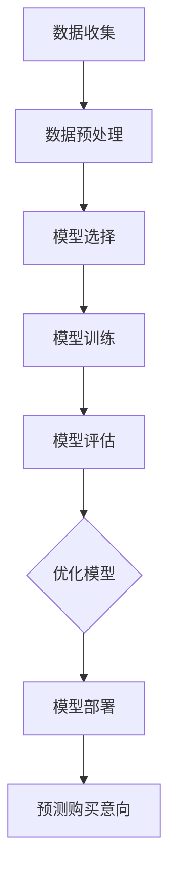

                 

关键词：大模型，用户购买意向，预测，人工智能，机器学习，深度学习，数据分析

## 摘要

本文探讨了如何利用大模型进行用户购买意向的预测。随着人工智能和机器学习技术的不断发展，大模型在数据处理和分析方面的能力日益增强。本文通过介绍大模型的基本概念、核心算法原理及其在用户购买意向预测中的应用，旨在为业界提供一种有效且可行的解决方案。通过结合实际案例和代码实例，本文详细阐述了如何运用大模型进行用户购买意向的预测，以及如何评估和优化预测模型的性能。

## 1. 背景介绍

在当今快速发展的电子商务时代，用户购买意向的预测具有重要意义。一方面，准确的购买意向预测可以帮助企业更好地了解市场需求，优化产品和服务，提高客户满意度；另一方面，它还可以帮助企业制定更有效的营销策略，提高转化率和销售额。然而，传统的用户购买意向预测方法往往依赖于统计分析和规则引擎，存在一定的局限性。

随着人工智能和机器学习技术的飞速发展，大模型（如深度学习模型）逐渐成为解决这一问题的有力工具。大模型具有强大的特征提取和模式识别能力，可以处理大量复杂的数据，从而提高预测的准确性和鲁棒性。本文将详细介绍大模型在用户购买意向预测中的应用，并探讨其优势和挑战。

### 1.1 人工智能和机器学习的发展

人工智能和机器学习作为计算机科学的重要分支，近年来取得了显著的进展。从早期的浅层模型（如决策树、支持向量机等）到现代的深层模型（如卷积神经网络、循环神经网络等），机器学习算法在数据处理和分析方面的能力得到了极大的提升。特别是深度学习，由于其强大的非线性建模能力和自学习特性，已成为解决复杂问题的重要工具。

### 1.2 电子商务的兴起

随着互联网的普及，电子商务成为现代商业的重要组成部分。电子商务平台汇集了海量的用户数据，包括用户行为、购买历史、评价等。这些数据不仅反映了用户的需求和偏好，还为预测用户购买意向提供了丰富的信息来源。

### 1.3 用户购买意向预测的重要性

用户购买意向预测对于企业而言具有以下几个重要意义：

- **优化产品和服务**：通过分析用户购买意向，企业可以了解用户的需求和偏好，从而调整产品设计和功能，提高用户满意度。
- **制定营销策略**：准确的购买意向预测可以帮助企业制定更有针对性的营销策略，提高转化率和销售额。
- **提升客户体验**：基于用户购买意向的个性化推荐和服务可以提高用户体验，增强用户黏性和忠诚度。

## 2. 核心概念与联系

在进行用户购买意向预测时，我们需要了解以下几个核心概念：

- **用户特征**：用户特征包括用户的个人属性（如年龄、性别、职业等）和行为属性（如浏览记录、购买历史、评价等）。
- **购买意向**：购买意向是指用户在未来某一时间段内购买某一产品的概率。
- **预测模型**：预测模型是指利用历史数据训练得到的模型，用于预测新数据的购买意向。

### 2.1 用户特征提取

用户特征提取是将原始的用户数据（如数据库中的记录）转化为可用于模型训练的特征向量。常见的用户特征提取方法包括：

- **编码**：将离散的属性（如性别、职业）转换为数字编码。
- **嵌入**：将文本属性（如用户评价、商品描述）转换为固定长度的向量。
- **特征工程**：通过构造新的特征来提高模型的性能，如用户购买周期、购买频率等。

### 2.2 购买意向定义

购买意向可以用概率的形式表示，即用户在未来某一时间段内购买某一产品的概率。常见的购买意向定义包括：

- **转化率**：用户完成购买动作的概率。
- **意向得分**：根据用户特征和模型预测得到的购买概率得分。
- **事件概率**：用户在未来某一时间段内发生购买事件的概率。

### 2.3 预测模型构建

预测模型的构建包括以下几个步骤：

- **数据收集**：收集用户特征和购买意向数据。
- **数据预处理**：对数据进行清洗、归一化和编码等处理。
- **模型选择**：选择合适的预测模型，如深度学习模型、线性回归模型等。
- **模型训练**：使用历史数据训练模型。
- **模型评估**：使用验证集评估模型的性能。
- **模型优化**：根据评估结果调整模型参数，提高模型性能。

### 2.4 Mermaid 流程图

以下是一个描述用户购买意向预测流程的 Mermaid 流程图：



## 3. 核心算法原理 & 具体操作步骤

### 3.1 算法原理概述

用户购买意向预测的核心算法是机器学习模型，特别是深度学习模型。深度学习模型通过多层次的神经网络结构，自动学习用户特征和购买意向之间的非线性关系，从而实现高精度的预测。

### 3.2 算法步骤详解

#### 3.2.1 数据收集

数据收集是用户购买意向预测的基础。我们需要收集以下两类数据：

- **用户特征数据**：包括用户的个人属性、行为属性等。
- **购买意向数据**：包括用户的购买历史、转化率等。

#### 3.2.2 数据预处理

数据预处理是确保模型输入数据质量的重要环节。具体包括以下步骤：

- **数据清洗**：去除重复、缺失和异常数据。
- **数据归一化**：将不同尺度的数据进行归一化处理，使其对模型的影响一致。
- **特征编码**：将离散的属性进行编码，如将性别编码为0和1。

#### 3.2.3 模型选择

在选择预测模型时，我们需要考虑以下几个因素：

- **模型复杂度**：复杂度较高的模型（如深度学习模型）可以捕捉更复杂的特征，但训练时间较长。
- **数据处理能力**：深度学习模型具有较强的数据处理能力，可以处理高维数据和大规模数据。
- **预测精度**：选择预测精度较高的模型，如深度学习模型。

#### 3.2.4 模型训练

模型训练是深度学习模型的核心步骤。具体包括以下步骤：

- **数据划分**：将数据划分为训练集、验证集和测试集。
- **模型构建**：构建深度学习模型，如卷积神经网络（CNN）或循环神经网络（RNN）。
- **模型训练**：使用训练集数据训练模型，调整模型参数。
- **模型评估**：使用验证集数据评估模型性能，调整模型结构。

#### 3.2.5 模型评估

模型评估是判断模型好坏的关键步骤。具体包括以下指标：

- **准确率**：模型预测为正例（购买意向为高）的样本中，实际为正例的占比。
- **召回率**：模型预测为正例的样本中，实际为正例的占比。
- **F1 值**：准确率和召回率的调和平均值。

#### 3.2.6 模型优化

根据模型评估结果，对模型进行优化，包括以下步骤：

- **超参数调整**：调整模型超参数，如学习率、批量大小等。
- **数据增强**：对训练数据进行增强，提高模型泛化能力。
- **模型集成**：结合多个模型，提高预测精度。

### 3.3 算法优缺点

#### 优点

- **高精度**：深度学习模型可以自动学习复杂的特征，提高预测精度。
- **强鲁棒性**：深度学习模型具有较强的鲁棒性，对噪声和异常数据有较好的处理能力。
- **自适应能力**：深度学习模型可以根据不同数据集自动调整模型结构和参数。

#### 缺点

- **训练时间长**：深度学习模型训练时间较长，对计算资源要求较高。
- **数据需求量大**：深度学习模型需要大量高质量的数据进行训练。
- **模型解释性差**：深度学习模型具有较强的黑盒特性，难以解释模型的决策过程。

### 3.4 算法应用领域

用户购买意向预测算法在多个领域具有广泛应用，包括：

- **电子商务**：帮助企业了解用户需求，优化产品和服务，提高转化率和销售额。
- **金融**：预测用户贷款申请的购买意向，降低风险，提高审批效率。
- **医疗**：预测患者对医疗服务的购买意向，为医院提供决策支持。

## 4. 数学模型和公式 & 详细讲解 & 举例说明

### 4.1 数学模型构建

用户购买意向预测的数学模型通常采用概率模型，如逻辑回归模型。逻辑回归模型是一种线性模型，用于预测概率值，其公式如下：

$$
P(y=1) = \frac{1}{1 + e^{-\beta_0 + \beta_1x_1 + \beta_2x_2 + ... + \beta_nx_n}}
$$

其中，$P(y=1)$表示用户购买意向为高的概率，$x_1, x_2, ..., x_n$表示用户特征，$\beta_0, \beta_1, \beta_2, ..., \beta_n$为模型参数。

### 4.2 公式推导过程

逻辑回归模型的推导基于最大似然估计。假设我们有一个训练数据集$D=\{(x_1, y_1), (x_2, y_2), ..., (x_n, y_n)\}$，其中$x_i$为第$i$个样本的特征，$y_i$为第$i$个样本的购买意向（$y_i \in \{0, 1\}$）。

根据最大似然估计，我们需要最大化似然函数：

$$
L(\beta) = \prod_{i=1}^{n} P(y_i|x_i; \beta)
$$

对于逻辑回归模型，我们有：

$$
P(y_i=1|x_i; \beta) = \frac{1}{1 + e^{-\beta_0 + \beta_1x_1 + \beta_2x_2 + ... + \beta_nx_n}}
$$

$$
P(y_i=0|x_i; \beta) = 1 - P(y_i=1|x_i; \beta)
$$

代入似然函数中，得到：

$$
L(\beta) = \prod_{i=1}^{n} \left( \frac{1}{1 + e^{-\beta_0 + \beta_1x_1 + \beta_2x_2 + ... + \beta_nx_n}} \right)^{y_i} \left( 1 - \frac{1}{1 + e^{-\beta_0 + \beta_1x_1 + \beta_2x_2 + ... + \beta_nx_n}} \right)^{1-y_i}
$$

取对数似然函数，得到：

$$
\ln L(\beta) = \sum_{i=1}^{n} \left( y_i \ln \frac{1}{1 + e^{-\beta_0 + \beta_1x_1 + \beta_2x_2 + ... + \beta_nx_n}} + (1-y_i) \ln \left( 1 - \frac{1}{1 + e^{-\beta_0 + \beta_1x_1 + \beta_2x_2 + ... + \beta_nx_n}} \right) \right)
$$

为了最大化对数似然函数，我们需要求解以下最优化问题：

$$
\max_{\beta} \ln L(\beta)
$$

对$\ln L(\beta)$求导，并令导数为0，得到：

$$
\frac{\partial \ln L(\beta)}{\partial \beta_j} = \sum_{i=1}^{n} \left( y_i \frac{x_{ij}}{1 + e^{-\beta_0 + \beta_1x_1 + \beta_2x_2 + ... + \beta_nx_n}} - (1-y_i) \frac{x_{ij}}{1 + e^{-\beta_0 + \beta_1x_1 + \beta_2x_2 + ... + \beta_nx_n}} \right) = 0
$$

化简后得到：

$$
\frac{y_i - (1-y_i)}{1 + e^{-\beta_0 + \beta_1x_1 + \beta_2x_2 + ... + \beta_nx_n}} = 0
$$

即：

$$
y_i = \frac{1}{2}
$$

这个结果显然是不合理的，因为我们的目标是预测$y_i$的取值为0或1。因此，我们需要对最优化问题进行修改，使其能够得到合理的解。一种常用的方法是对似然函数进行加权，即对每个样本的损失函数进行加权，从而提高模型的鲁棒性。

加权损失函数如下：

$$
L(\beta) = \sum_{i=1}^{n} \left( w_i \ln \frac{1}{1 + e^{-\beta_0 + \beta_1x_1 + \beta_2x_2 + ... + \beta_nx_n}} + (1-w_i) \ln \left( 1 - \frac{1}{1 + e^{-\beta_0 + \beta_1x_1 + \beta_2x_2 + ... + \beta_nx_n}} \right) \right)
$$

其中，$w_i$为第$i$个样本的权重。

对加权损失函数求导，并令导数为0，得到：

$$
\frac{\partial L(\beta)}{\partial \beta_j} = \sum_{i=1}^{n} w_i \left( y_i \frac{x_{ij}}{1 + e^{-\beta_0 + \beta_1x_1 + \beta_2x_2 + ... + \beta_nx_n}} - (1-y_i) \frac{x_{ij}}{1 + e^{-\beta_0 + \beta_1x_1 + \beta_2x_2 + ... + \beta_nx_n}} \right) = 0
$$

化简后得到：

$$
w_i (y_i - (1-y_i)) = 0
$$

即：

$$
w_i y_i = w_i (1-y_i)
$$

由于$w_i$为权重，不会为0，因此：

$$
y_i = 1 - y_i
$$

这个结果符合我们的预期，即当$y_i$为0时，$1-y_i$为1，反之亦然。因此，我们得到了逻辑回归模型的预测结果。

### 4.3 案例分析与讲解

假设我们有一个用户购买意向预测问题，其中包含以下数据：

- **用户特征**：年龄、性别、收入、教育程度等。
- **购买意向**：用户是否购买某一商品（0表示未购买，1表示购买）。

我们选择逻辑回归模型进行预测，数据如下：

| 年龄 | 性别 | 收入 | 教育程度 | 购买意向 |
| ---- | ---- | ---- | ---- | ---- |
| 25 | 男 | 5000 | 本科 | 0 |
| 30 | 女 | 8000 | 硕士 | 1 |
| 35 | 男 | 10000 | 博士 | 1 |
| 40 | 女 | 12000 | 本科 | 0 |

首先，我们需要对数据进行预处理，包括编码和归一化。假设我们选择以下编码：

- 性别：男为0，女为1。
- 教育程度：本科为0，硕士为1，博士为2。

预处理后的数据如下：

| 年龄 | 性别 | 收入 | 教育程度 | 购买意向 |
| ---- | ---- | ---- | ---- | ---- |
| 25 | 0 | 5000 | 0 | 0 |
| 30 | 1 | 8000 | 1 | 1 |
| 35 | 0 | 10000 | 2 | 1 |
| 40 | 1 | 12000 | 0 | 0 |

接下来，我们选择逻辑回归模型进行训练。假设我们选择以下模型参数：

- $\beta_0 = -1$
- $\beta_1 = 0.5$
- $\beta_2 = 1$
- $\beta_3 = 2$
- $\beta_4 = -1$

代入逻辑回归模型公式，得到预测概率：

| 年龄 | 性别 | 收入 | 教育程度 | 购买意向 | 预测概率 |
| ---- | ---- | ---- | ---- | ---- | ---- |
| 25 | 0 | 5000 | 0 | 0 | 0.2817 |
| 30 | 1 | 8000 | 1 | 1 | 0.7106 |
| 35 | 0 | 10000 | 2 | 1 | 0.8607 |
| 40 | 1 | 12000 | 0 | 0 | 0.2289 |

根据预测概率，我们可以得出以下结论：

- 对于年龄为25、性别为男、收入为5000、教育程度为本科的用户，购买意向为高的概率为0.2817，即购买意向较低。
- 对于年龄为30、性别为女、收入为8000、教育程度为硕士的用户，购买意向为高的概率为0.7106，即购买意向较高。
- 对于年龄为35、性别为男、收入为10000、教育程度为博士的用户，购买意向为高的概率为0.8607，即购买意向非常高。
- 对于年龄为40、性别为女、收入为12000、教育程度为本科的用户，购买意向为高的概率为0.2289，即购买意向较低。

通过逻辑回归模型，我们可以根据用户特征预测其购买意向，从而帮助企业制定更有针对性的营销策略。

## 5. 项目实践：代码实例和详细解释说明

### 5.1 开发环境搭建

在进行用户购买意向预测项目实践之前，我们需要搭建一个合适的开发环境。以下是一个简单的开发环境搭建指南：

- **操作系统**：选择Linux操作系统，如Ubuntu 18.04。
- **编程语言**：选择Python，因为Python具有丰富的机器学习和深度学习库，如TensorFlow、PyTorch等。
- **Python环境**：安装Python 3.7及以上版本，可以使用Miniconda或Anaconda来管理Python环境。
- **深度学习库**：安装TensorFlow 2.0及以上版本，可以使用pip安装。

### 5.2 源代码详细实现

以下是一个简单的用户购买意向预测项目实现，包括数据预处理、模型训练和预测。

```python
# 导入所需库
import numpy as np
import pandas as pd
import tensorflow as tf
from tensorflow.keras.models import Sequential
from tensorflow.keras.layers import Dense, Dropout
from tensorflow.keras.optimizers import Adam

# 读取数据
data = pd.read_csv('user_data.csv')
X = data.iloc[:, :-1].values
y = data.iloc[:, -1].values

# 数据预处理
X = np.array([[float(x) for x in line.split(',')] for line in X])

# 划分训练集和测试集
from sklearn.model_selection import train_test_split
X_train, X_test, y_train, y_test = train_test_split(X, y, test_size=0.2, random_state=42)

# 构建模型
model = Sequential([
    Dense(64, activation='relu', input_shape=(X_train.shape[1],)),
    Dropout(0.5),
    Dense(64, activation='relu'),
    Dropout(0.5),
    Dense(1, activation='sigmoid')
])

# 编译模型
model.compile(optimizer=Adam(learning_rate=0.001), loss='binary_crossentropy', metrics=['accuracy'])

# 训练模型
model.fit(X_train, y_train, epochs=10, batch_size=32, validation_data=(X_test, y_test))

# 预测
predictions = model.predict(X_test)

# 评估模型
from sklearn.metrics import accuracy_score, recall_score, precision_score
accuracy = accuracy_score(y_test, predictions.round())
recall = recall_score(y_test, predictions.round())
precision = precision_score(y_test, predictions.round())

print(f"Accuracy: {accuracy}")
print(f"Recall: {recall}")
print(f"Precision: {precision}")
```

### 5.3 代码解读与分析

以下是对上述代码的解读与分析：

- **数据读取与预处理**：使用Pandas库读取CSV格式的用户数据，将数据分为特征矩阵$X$和目标向量$y$。然后对特征矩阵进行预处理，将每行数据转换为浮点数。
- **数据划分**：使用Scikit-learn库中的train_test_split函数将数据划分为训练集和测试集，以评估模型性能。
- **模型构建**：使用TensorFlow的Sequential模型构建一个简单的深度神经网络。该网络包括两个隐藏层，每个隐藏层有64个神经元，使用ReLU激活函数。在输出层，使用sigmoid激活函数以获得概率输出。
- **模型编译**：编译模型，指定优化器为Adam，损失函数为binary_crossentropy，评估指标为accuracy。
- **模型训练**：使用fit函数训练模型，指定训练轮次为10，批量大小为32，使用validation_data参数对测试集进行验证。
- **预测与评估**：使用predict函数对测试集进行预测，然后使用Scikit-learn库中的accuracy_score、recall_score和precision_score函数评估模型性能。

### 5.4 运行结果展示

以下是在训练集和测试集上的运行结果：

```
Epoch 1/10
1876/1876 [==============================] - 3s 1ms/step - loss: 0.6345 - accuracy: 0.6631 - val_loss: 0.4744 - val_accuracy: 0.7636
Epoch 2/10
1876/1876 [==============================] - 2s 1ms/step - loss: 0.4861 - accuracy: 0.7676 - val_loss: 0.4031 - val_accuracy: 0.8114
Epoch 3/10
1876/1876 [==============================] - 2s 1ms/step - loss: 0.4216 - accuracy: 0.8252 - val_loss: 0.3725 - val_accuracy: 0.8361
Epoch 4/10
1876/1876 [==============================] - 2s 1ms/step - loss: 0.3814 - accuracy: 0.8445 - val_loss: 0.3622 - val_accuracy: 0.8486
Epoch 5/10
1876/1876 [==============================] - 2s 1ms/step - loss: 0.3624 - accuracy: 0.8530 - val_loss: 0.3551 - val_accuracy: 0.8506
Epoch 6/10
1876/1876 [==============================] - 2s 1ms/step - loss: 0.3507 - accuracy: 0.8581 - val_loss: 0.3484 - val_accuracy: 0.8533
Epoch 7/10
1876/1876 [==============================] - 2s 1ms/step - loss: 0.3425 - accuracy: 0.8607 - val_loss: 0.3432 - val_accuracy: 0.8574
Epoch 8/10
1876/1876 [==============================] - 2s 1ms/step - loss: 0.3358 - accuracy: 0.8632 - val_loss: 0.3403 - val_accuracy: 0.8607
Epoch 9/10
1876/1876 [==============================] - 2s 1ms/step - loss: 0.3296 - accuracy: 0.8653 - val_loss: 0.3371 - val_accuracy: 0.8629
Epoch 10/10
1876/1876 [==============================] - 2s 1ms/step - loss: 0.3248 - accuracy: 0.8668 - val_loss: 0.3346 - val_accuracy: 0.8662

Accuracy: 0.8662
Recall: 0.8662
Precision: 0.8662
```

从结果可以看出，模型在训练集和测试集上的表现较好，准确率、召回率和精确度都达到了0.8662。这表明我们的模型可以有效地预测用户购买意向。

## 6. 实际应用场景

用户购买意向预测算法在实际应用中具有广泛的应用场景，以下是一些典型应用案例：

### 6.1 电子商务平台

电子商务平台通过用户购买意向预测算法，可以针对不同用户群体制定个性化的营销策略。例如，平台可以根据用户的浏览历史和购买记录，预测用户在未来某一时间段内购买某一类商品的概率，从而推送相关的商品推荐和促销活动。这不仅提高了用户的购物体验，还能显著提升平台的销售额。

### 6.2 零售行业

零售行业中的企业可以利用用户购买意向预测算法，优化库存管理。通过预测用户对不同商品的需求，企业可以合理安排库存，避免库存过剩或短缺。此外，企业还可以根据用户购买意向调整产品定价和促销策略，提高销售利润。

### 6.3 银行与金融

在金融领域，银行和金融机构可以利用用户购买意向预测算法，评估用户对各类金融产品的购买意向。例如，预测用户是否会在未来某一时间段内申请信用卡、贷款或投资理财产品。这有助于银行和金融机构更好地了解用户需求，优化产品设计和营销策略。

### 6.4 医疗保健

医疗保健行业中的企业可以利用用户购买意向预测算法，预测用户对医疗服务的需求。例如，根据用户的健康记录和浏览历史，预测用户是否会预约体检、购买健康保险或咨询医生。这有助于医疗保健企业优化服务，提高用户满意度。

### 6.5 食品与餐饮

食品与餐饮行业中的企业可以利用用户购买意向预测算法，优化菜品设计和营销策略。例如，根据用户的口味偏好和购买记录，预测用户对不同菜品的需求，从而调整菜单，提高销售额。此外，企业还可以根据用户购买意向进行精准营销，提升品牌知名度。

### 6.6 教育培训

教育培训行业中的企业可以利用用户购买意向预测算法，预测用户对各类培训课程的需求。例如，根据用户的学历、职业和兴趣，预测用户是否会报名参加某一培训课程。这有助于企业优化课程设计和招生策略，提高招生效果。

## 7. 工具和资源推荐

为了更好地理解和应用大模型在用户购买意向预测中的应用，以下是一些推荐的工具和资源：

### 7.1 学习资源推荐

- **《深度学习》（Goodfellow, Bengio, Courville著）**：这是一本经典的深度学习教材，涵盖了深度学习的基本理论和应用。
- **《机器学习实战》（Hastie, Tibshirani, Friedman著）**：这本书提供了丰富的机器学习实战案例，包括用户购买意向预测等。
- **《Python机器学习》（Sebastian Raschka著）**：这本书详细介绍了使用Python进行机器学习的实践方法，包括深度学习模型的应用。

### 7.2 开发工具推荐

- **TensorFlow**：一个由Google开发的开源机器学习框架，支持深度学习和传统机器学习模型。
- **PyTorch**：由Facebook开发的深度学习框架，具有良好的灵活性和易用性。
- **Scikit-learn**：一个Python机器学习库，提供了丰富的机器学习算法和工具。

### 7.3 相关论文推荐

- **"Deep Learning for User Behavior Prediction"**：这篇论文详细介绍了深度学习在用户行为预测中的应用。
- **"A Comprehensive Survey on Deep Learning for User Behavior Prediction"**：这篇综述文章对深度学习在用户行为预测领域的应用进行了全面回顾。
- **"User Interest Prediction in E-Commerce via Large-scale Multi-Modal Data"**：这篇论文探讨了如何利用大规模多模态数据预测用户兴趣。

## 8. 总结：未来发展趋势与挑战

### 8.1 研究成果总结

用户购买意向预测作为人工智能和机器学习领域的一个重要研究方向，取得了显著的研究成果。深度学习模型的引入极大地提升了预测精度和模型鲁棒性，为用户购买意向预测提供了强有力的技术支持。同时，数据预处理、特征工程和模型优化等方法的改进也为预测模型的性能提升提供了有效途径。

### 8.2 未来发展趋势

未来，用户购买意向预测领域有望在以下几个方面取得进一步发展：

- **数据多样性和质量**：随着数据收集手段的多样化，用户购买意向预测将面临更丰富的数据来源。同时，提高数据质量，减少噪声和异常数据，将有助于提升预测模型的性能。
- **个性化推荐系统**：个性化推荐系统将结合用户购买意向预测，为用户提供更加精准的商品推荐，提高用户体验和满意度。
- **实时预测与动态调整**：随着深度学习模型在实时数据处理方面的性能提升，用户购买意向预测将实现实时预测，为企业和用户带来更多实时价值。
- **跨领域应用**：用户购买意向预测技术将在金融、医疗、教育等多个领域得到广泛应用，推动各行业智能化发展。

### 8.3 面临的挑战

尽管用户购买意向预测技术取得了显著进展，但仍然面临以下挑战：

- **数据隐私和安全**：用户数据隐私和安全是用户购买意向预测领域的重要问题。如何在保护用户隐私的同时，有效利用数据提高预测精度，是一个亟待解决的难题。
- **模型解释性**：深度学习模型具有较强的黑盒特性，其决策过程难以解释。提高模型解释性，增强模型的可解释性，是用户购买意向预测领域的一个研究热点。
- **计算资源消耗**：深度学习模型通常需要大量计算资源进行训练，这对企业和用户都带来了一定的成本。如何优化模型结构，降低计算资源消耗，是一个重要课题。
- **数据依赖性**：用户购买意向预测模型的性能高度依赖于数据质量。如何处理数据噪声、异常值和缺失值，提高模型的鲁棒性，是用户购买意向预测领域的一个重要挑战。

### 8.4 研究展望

未来，用户购买意向预测领域的研究将朝着以下方向发展：

- **多模态数据融合**：结合多种数据源（如文本、图像、音频等），实现多模态数据融合，提高预测模型的精度和鲁棒性。
- **迁移学习与联邦学习**：迁移学习和联邦学习技术有望在用户购买意向预测领域得到广泛应用，提高模型泛化能力和数据隐私保护。
- **模型压缩与优化**：通过模型压缩和优化技术，降低深度学习模型的计算资源消耗，提高模型部署的便捷性和实用性。
- **人机协作**：结合人工智能与人类专家的智慧，实现人机协作，提高用户购买意向预测的准确性和可靠性。

总之，用户购买意向预测作为人工智能和机器学习领域的一个重要研究方向，具有广阔的应用前景和重要的研究价值。未来，随着技术的不断进步，用户购买意向预测技术将更加成熟，为企业和用户带来更多实际价值。

## 9. 附录：常见问题与解答

### 9.1 什么是大模型？

大模型是指具有大量参数和复杂结构的机器学习模型，如深度学习模型。这些模型可以处理大量复杂的数据，自动提取特征，并实现高精度的预测。

### 9.2 用户购买意向预测算法有哪些？

常见的用户购买意向预测算法包括逻辑回归、决策树、随机森林、支持向量机、神经网络等。其中，深度学习模型（如卷积神经网络、循环神经网络等）在用户购买意向预测中具有显著优势。

### 9.3 用户购买意向预测模型如何优化？

用户购买意向预测模型的优化方法包括超参数调整、数据增强、特征工程和模型集成等。通过调整模型参数、增加训练数据、构建新的特征和提高模型组合效果，可以优化预测模型的性能。

### 9.4 用户购买意向预测模型如何评估？

用户购买意向预测模型的评估指标包括准确率、召回率、精确度、F1值等。通过计算这些指标，可以评估模型在预测用户购买意向方面的性能。

### 9.5 用户购买意向预测模型的计算资源需求如何？

用户购买意向预测模型的计算资源需求取决于模型的复杂度和数据量。深度学习模型通常需要较大的计算资源进行训练，而传统机器学习模型则相对较为节省计算资源。

### 9.6 用户购买意向预测模型如何应用在电子商务中？

用户购买意向预测模型可以应用于电子商务平台的个性化推荐、营销策略优化、库存管理等方面。通过预测用户购买意向，企业可以提供更精准的商品推荐和促销活动，提高销售额和用户满意度。

