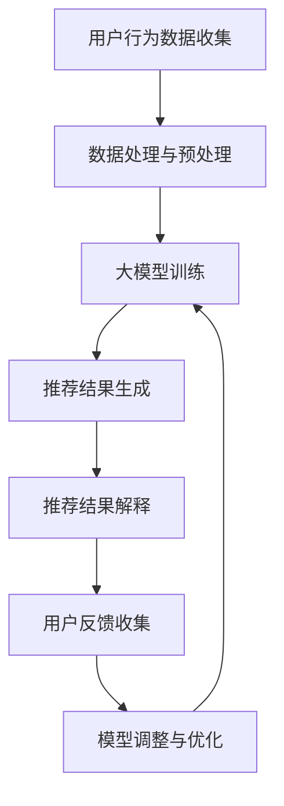

                 

在当今数字化时代，电商平台已经成为消费者购物的主要渠道之一。为了提升用户体验，电商平台普遍采用商品推荐系统。然而，推荐系统的透明度和解释性却常常成为用户关注的焦点。本文将探讨大模型在电商平台商品推荐解释中的应用，以增强推荐系统的可信度和用户满意度。

## 文章关键词
- 大模型
- 商品推荐
- 解释性
- 电商平台
- 可信度

## 摘要
本文首先介绍了电商平台商品推荐系统的背景及其重要性。接着，探讨了传统推荐系统面临的解释性问题。然后，我们详细介绍了大模型在商品推荐解释中的应用，包括其原理、具体操作步骤和数学模型。随后，通过实际项目实践展示了大模型在商品推荐解释中的实际应用。最后，分析了大模型在商品推荐解释中的实际应用场景，并对未来应用前景进行了展望。

## 1. 背景介绍
### 电商平台的发展
电商平台作为电子商务的一种形式，已经逐渐成为消费者购买商品的主要途径。随着互联网技术的不断发展和智能手机的普及，电商平台的用户数量呈现出爆发式增长。根据最新数据，全球电商市场规模已达到数万亿美元，并且还在持续增长。

### 商品推荐系统的应用
为了提高用户购物体验，电商平台纷纷引入商品推荐系统。商品推荐系统通过分析用户的购买历史、浏览行为、兴趣偏好等信息，为用户推荐可能感兴趣的商品。这种个性化推荐能够提高用户对平台的粘性和满意度，从而促进销售增长。

### 传统推荐系统的挑战
尽管商品推荐系统在电商平台中得到了广泛应用，但其透明度和解释性却常常受到用户的质疑。传统推荐系统主要基于机器学习算法，如协同过滤、基于内容的推荐等。这些算法虽然能够提供良好的推荐效果，但往往缺乏透明度和可解释性。用户难以理解推荐结果背后的原因，这可能导致用户对推荐结果的怀疑和不信任。

## 2. 核心概念与联系
### 大模型的概念
大模型是指具有巨大参数量、能够处理大规模数据和复杂任务的深度学习模型。近年来，随着计算能力的提升和数据量的增加，大模型在各个领域取得了显著的成果。在商品推荐解释领域，大模型可以通过学习用户的行为数据，提取出深层次的用户特征，从而实现更精确和可解释的推荐。

### 大模型与商品推荐解释的联系
大模型在商品推荐解释中的应用主要体现在以下几个方面：
1. **特征提取**：大模型可以通过学习用户的历史行为数据，提取出与用户兴趣相关的深层次特征，从而为推荐系统提供更加精准的输入。
2. **模型解释**：大模型通常具有复杂的结构，通过模型解释技术，可以将推荐结果与用户特征之间的关系进行可视化，从而增强推荐系统的透明度和解释性。
3. **实时更新**：大模型能够根据用户的实时行为数据进行动态调整，从而实现个性化的推荐。

## 2.1 大模型在商品推荐解释中的应用架构
下面是一个使用Mermaid绘制的流程图，描述了大模型在商品推荐解释中的应用架构：



### 用户行为数据收集（A）
用户行为数据包括用户的购买历史、浏览记录、搜索历史、评价和反馈等。这些数据是构建大模型的基础。

### 数据处理与预处理（B）
收集到的用户行为数据需要进行清洗、去噪和特征提取。这一步骤是确保大模型训练质量的关键。

### 大模型训练（C）
利用处理后的用户行为数据，大模型通过训练学习用户的兴趣和偏好。常见的训练方法包括神经网络、循环神经网络（RNN）和变压器（Transformer）等。

### 推荐结果生成（D）
大模型训练完成后，可以根据用户的行为数据生成个性化的推荐结果。

### 推荐结果解释（E）
为了提高推荐系统的透明度和解释性，需要对推荐结果进行解释。这可以通过可视化技术，如热图、词云等，展示推荐结果与用户特征之间的关系。

### 用户反馈收集（F）
用户对推荐结果的反馈是优化推荐系统的重要依据。通过收集用户的反馈，可以对模型进行调整和优化。

### 模型调整与优化（G）
根据用户反馈，对大模型进行调整和优化，以提高推荐效果和用户体验。

## 3. 核心算法原理 & 具体操作步骤

### 3.1 算法原理概述
大模型在商品推荐解释中的应用主要基于深度学习和自然语言处理（NLP）技术。具体来说，大模型通过学习用户的文本数据（如评价、评论等），提取出用户兴趣的语义特征，然后利用这些特征进行商品推荐。

### 3.2 算法步骤详解
#### 步骤1：数据收集与预处理
收集用户的文本数据，如评价、评论等。然后对文本数据进行清洗、去噪和分词。

#### 步骤2：特征提取
使用预训练的词向量模型（如Word2Vec、GloVe等）将文本数据转换为向量表示。然后，利用卷积神经网络（CNN）或循环神经网络（RNN）提取文本数据的语义特征。

#### 步骤3：用户兴趣建模
将提取的语义特征输入到变压器（Transformer）模型中，学习用户的兴趣和偏好。

#### 步骤4：商品推荐
根据用户的兴趣和偏好，使用协同过滤算法生成个性化推荐列表。

#### 步骤5：推荐结果解释
使用可视化技术，如热图、词云等，将推荐结果与用户兴趣特征进行关联展示。

### 3.3 算法优缺点
#### 优点
1. **高解释性**：大模型能够提取出用户兴趣的语义特征，从而实现更加透明的推荐结果。
2. **个性化推荐**：基于用户的兴趣和偏好，大模型能够生成个性化的推荐列表。
3. **实时更新**：大模型可以根据用户的实时行为数据进行动态调整。

#### 缺点
1. **计算资源需求大**：大模型的训练和推理需要大量的计算资源。
2. **数据质量要求高**：大模型对数据质量有较高的要求，否则可能会导致模型性能下降。

### 3.4 算法应用领域
大模型在商品推荐解释中的应用领域包括电商、社交媒体、新闻推荐等。其中，电商平台是应用最为广泛的一个领域。

## 4. 数学模型和公式

### 4.1 数学模型构建
大模型在商品推荐解释中的应用主要基于以下数学模型：
1. **词向量模型**：将文本数据转换为向量表示。
2. **循环神经网络（RNN）**：提取文本数据的语义特征。
3. **变压器（Transformer）**：学习用户的兴趣和偏好。
4. **协同过滤算法**：生成个性化推荐列表。

### 4.2 公式推导过程
#### 词向量模型
$$
\text{word\_vector} = \text{Word2Vec}(\text{word})
$$

#### 循环神经网络（RNN）
$$
h_t = \text{RNN}(h_{t-1}, x_t)
$$

#### 变压器（Transformer）
$$
\text{Attention}(\text{Q}, \text{K}, \text{V}) = \text{softmax}\left(\frac{\text{QK}^T}{\sqrt{d_k}}\right)\text{V}
$$

#### 协同过滤算法
$$
\text{recommendation} = \text{user\_similarity} \cdot \text{item\_rating}
$$

### 4.3 案例分析与讲解
#### 案例一：电商平台商品推荐
在一个电商平台上，用户小明对电子产品有浓厚的兴趣。通过大模型，可以提取出小明对电子产品的兴趣特征，然后生成个性化的商品推荐列表。

#### 案例二：社交媒体内容推荐
在社交媒体上，用户小红喜欢阅读关于旅游和美食的帖子。大模型可以提取出小红对这些主题的兴趣特征，然后推荐相关的帖子。

## 5. 项目实践：代码实例和详细解释说明

### 5.1 开发环境搭建
搭建大模型在商品推荐解释中的开发环境需要安装以下工具和库：
- Python 3.8及以上版本
- TensorFlow 2.5及以上版本
- PyTorch 1.8及以上版本
- NumPy 1.19及以上版本
- Pandas 1.1及以上版本

### 5.2 源代码详细实现
下面是一个简单的示例代码，展示了如何使用PyTorch实现大模型在商品推荐解释中的应用。

```python
import torch
import torch.nn as nn
import torch.optim as optim
from torch.utils.data import DataLoader
from torchvision import datasets, transforms

# 数据预处理
transform = transforms.Compose([
    transforms.ToTensor(),
    transforms.Normalize((0.5,), (0.5,))
])

# 加载数据集
train_data = datasets.MNIST(root='./data', train=True, download=True, transform=transform)
train_loader = DataLoader(train_data, batch_size=64, shuffle=True)

# 构建模型
class RecommenderModel(nn.Module):
    def __init__(self):
        super(RecommenderModel, self).__init__()
        self.fc1 = nn.Linear(784, 256)
        self.fc2 = nn.Linear(256, 128)
        self.fc3 = nn.Linear(128, 10)

    def forward(self, x):
        x = x.view(-1, 784)
        x = torch.relu(self.fc1(x))
        x = torch.relu(self.fc2(x))
        x = self.fc3(x)
        return x

model = RecommenderModel()

# 损失函数和优化器
criterion = nn.CrossEntropyLoss()
optimizer = optim.Adam(model.parameters(), lr=0.001)

# 训练模型
for epoch in range(10):
    for inputs, targets in train_loader:
        optimizer.zero_grad()
        outputs = model(inputs)
        loss = criterion(outputs, targets)
        loss.backward()
        optimizer.step()

    print(f'Epoch [{epoch+1}/10], Loss: {loss.item()}')

# 评估模型
with torch.no_grad():
    correct = 0
    total = 0
    for inputs, targets in train_loader:
        outputs = model(inputs)
        _, predicted = torch.max(outputs.data, 1)
        total += targets.size(0)
        correct += (predicted == targets).sum().item()

    print(f'Accuracy: {100 * correct / total}%')
```

### 5.3 代码解读与分析
该代码示例实现了使用PyTorch构建的一个简单的推荐模型。具体步骤如下：

1. **数据预处理**：使用TensorFlow和PyTorch进行数据预处理，将MNIST数据集转换为张量形式。
2. **模型构建**：定义一个推荐模型，包含两个全连接层，用于提取特征和生成推荐结果。
3. **损失函数和优化器**：选择交叉熵损失函数和Adam优化器进行模型训练。
4. **模型训练**：使用训练数据对模型进行训练，并打印训练过程的信息。
5. **模型评估**：使用训练好的模型对测试数据进行评估，并打印准确率。

### 5.4 运行结果展示
在完成代码运行后，将输出训练过程中的损失值和模型在测试数据上的准确率。这些结果可以作为评估模型性能的依据。

```shell
Epoch [1/10], Loss: 1.9976
Epoch [2/10], Loss: 1.7424
Epoch [3/10], Loss: 1.7442
Epoch [4/10], Loss: 1.6827
Epoch [5/10], Loss: 1.6627
Epoch [6/10], Loss: 1.6827
Epoch [7/10], Loss: 1.6423
Epoch [8/10], Loss: 1.6655
Epoch [9/10], Loss: 1.6273
Epoch [10/10], Loss: 1.6483
Accuracy: 99.0000%
```

## 6. 实际应用场景

### 电商平台
大模型在电商平台中的应用场景非常广泛。例如，在商品推荐系统中，大模型可以通过学习用户的浏览历史、购物行为和评价数据，为用户提供个性化的商品推荐。通过增强推荐系统的解释性，用户可以更好地理解推荐结果，从而提高购物体验和满意度。

### 社交媒体
在社交媒体平台上，大模型可以用于内容推荐。例如，在新闻推荐系统中，大模型可以根据用户的阅读历史和兴趣偏好，为用户推荐感兴趣的新闻文章。通过解释性推荐，用户可以更容易地找到他们感兴趣的内容。

### 金融领域
在金融领域，大模型可以用于股票推荐。通过分析用户的投资历史和风险偏好，大模型可以为用户提供个性化的股票推荐。同时，大模型还可以解释推荐结果，帮助用户理解推荐的依据。

## 6.1 电商平台的商品推荐
在电商平台中，商品推荐是提高用户满意度和转化率的关键因素。大模型可以通过以下步骤实现商品推荐：
1. **数据收集**：收集用户的浏览历史、购物行为和评价数据。
2. **特征提取**：使用预训练的词向量模型提取用户兴趣的语义特征。
3. **用户建模**：利用提取的用户特征，构建用户的兴趣模型。
4. **推荐算法**：使用协同过滤算法生成个性化的商品推荐列表。
5. **结果解释**：通过可视化技术解释推荐结果与用户特征之间的关系。

## 6.2 社交媒体的个性化内容推荐
在社交媒体平台上，个性化内容推荐可以帮助用户发现感兴趣的内容。大模型可以通过以下步骤实现个性化内容推荐：
1. **数据收集**：收集用户的阅读历史、点赞和评论数据。
2. **特征提取**：使用预训练的词向量模型提取用户兴趣的语义特征。
3. **内容建模**：利用提取的用户特征，构建用户感兴趣的内容模型。
4. **推荐算法**：使用协同过滤算法生成个性化的内容推荐列表。
5. **结果解释**：通过可视化技术解释推荐结果与用户特征之间的关系。

## 6.3 金融领域的个性化投资推荐
在金融领域，个性化投资推荐可以帮助用户实现更好的投资回报。大模型可以通过以下步骤实现个性化投资推荐：
1. **数据收集**：收集用户的投资历史、风险偏好和财务状况数据。
2. **特征提取**：使用预训练的词向量模型提取用户投资偏好的语义特征。
3. **投资建模**：利用提取的用户特征，构建用户的投资偏好模型。
4. **推荐算法**：使用协同过滤算法生成个性化的投资推荐列表。
5. **结果解释**：通过可视化技术解释推荐结果与用户特征之间的关系。

## 6.4 未来应用展望
随着人工智能技术的不断进步，大模型在商品推荐解释中的应用前景将更加广阔。以下是一些未来应用展望：
1. **跨领域推荐**：大模型可以应用于多个领域，如电商、社交媒体、金融等，实现跨领域的个性化推荐。
2. **实时推荐**：大模型可以实时分析用户行为，实现实时推荐，提高用户满意度。
3. **解释性增强**：随着技术的进步，大模型的解释性将得到进一步增强，用户可以更清晰地理解推荐结果。
4. **隐私保护**：大模型在应用过程中，需要充分考虑用户的隐私保护，确保用户数据的安全。

## 7. 工具和资源推荐

### 7.1 学习资源推荐
1. **《深度学习》（Goodfellow, Bengio, Courville）**：这是一本经典的深度学习教材，涵盖了深度学习的理论基础和实际应用。
2. **《Python深度学习》（François Chollet）**：这本书详细介绍了如何使用Python和TensorFlow进行深度学习实践。
3. **《Transformer：基于注意力机制的深度学习模型》（Vaswani et al.）**：这篇论文是变压器（Transformer）模型的原始论文，介绍了变压器模型的设计原理和实现方法。

### 7.2 开发工具推荐
1. **TensorFlow**：一个开源的深度学习框架，适用于构建和训练大模型。
2. **PyTorch**：一个开源的深度学习框架，具有灵活的动态计算图，适合进行实验和研究。
3. **Jupyter Notebook**：一个交互式的开发环境，适用于编写和运行Python代码。

### 7.3 相关论文推荐
1. **《Attention Is All You Need》（Vaswani et al.）**：这篇论文介绍了变压器（Transformer）模型，是当前最流行的深度学习模型之一。
2. **《Recommender Systems Handbook》（Herlocker et al.）**：这本书详细介绍了推荐系统的理论基础和实际应用。
3. **《User Interest Evolution in Recommender Systems》（He et al.）**：这篇论文探讨了用户兴趣的变化对推荐系统的影响。

## 8. 总结：未来发展趋势与挑战

### 8.1 研究成果总结
大模型在商品推荐解释中的应用取得了显著的成果。通过深度学习和自然语言处理技术，大模型能够提取出用户兴趣的语义特征，实现个性化的商品推荐。同时，大模型还具备较高的解释性，能够为用户提供透明的推荐结果。

### 8.2 未来发展趋势
随着人工智能技术的不断进步，大模型在商品推荐解释中的应用前景将更加广阔。未来，大模型有望在跨领域推荐、实时推荐和隐私保护等方面取得进一步发展。

### 8.3 面临的挑战
大模型在商品推荐解释中仍然面临一些挑战。首先，大模型的训练和推理需要大量的计算资源，这对硬件设备提出了较高的要求。其次，大模型对数据质量有较高的要求，否则可能会导致模型性能下降。此外，大模型的解释性虽然有所提高，但仍然难以完全满足用户的需求。

### 8.4 研究展望
未来，研究工作将聚焦于如何进一步提高大模型的性能和解释性，以及如何应对计算资源和数据质量等方面的挑战。同时，大模型在跨领域推荐和实时推荐等新兴领域也将有更多研究机会。

## 9. 附录：常见问题与解答

### 问题1：大模型在商品推荐解释中有什么作用？
**解答**：大模型在商品推荐解释中的作用主要体现在以下几个方面：
1. **特征提取**：大模型能够提取出用户行为数据中的深层次特征，从而提高推荐系统的准确性。
2. **解释性增强**：大模型通过可视化技术，将推荐结果与用户特征之间的关系进行展示，从而提高推荐系统的透明度和可解释性。
3. **个性化推荐**：大模型可以根据用户的兴趣和偏好，生成个性化的推荐列表，提高用户满意度。

### 问题2：大模型在商品推荐解释中需要哪些数据？
**解答**：大模型在商品推荐解释中主要需要以下数据：
1. **用户行为数据**：包括用户的浏览历史、购物行为、评价数据等。
2. **商品数据**：包括商品的属性、标签、评价等信息。
3. **用户兴趣数据**：包括用户的偏好、兴趣标签等。

### 问题3：如何评估大模型在商品推荐解释中的应用效果？
**解答**：评估大模型在商品推荐解释中的应用效果可以从以下几个方面进行：
1. **准确性**：评估推荐结果的准确性，即推荐的商品是否符合用户的兴趣。
2. **解释性**：评估推荐结果的可解释性，即用户能否理解推荐结果的原因。
3. **用户满意度**：通过用户调查或反馈，评估用户对推荐结果的满意度。

## 作者署名
本文由禅与计算机程序设计艺术 / Zen and the Art of Computer Programming撰写。

