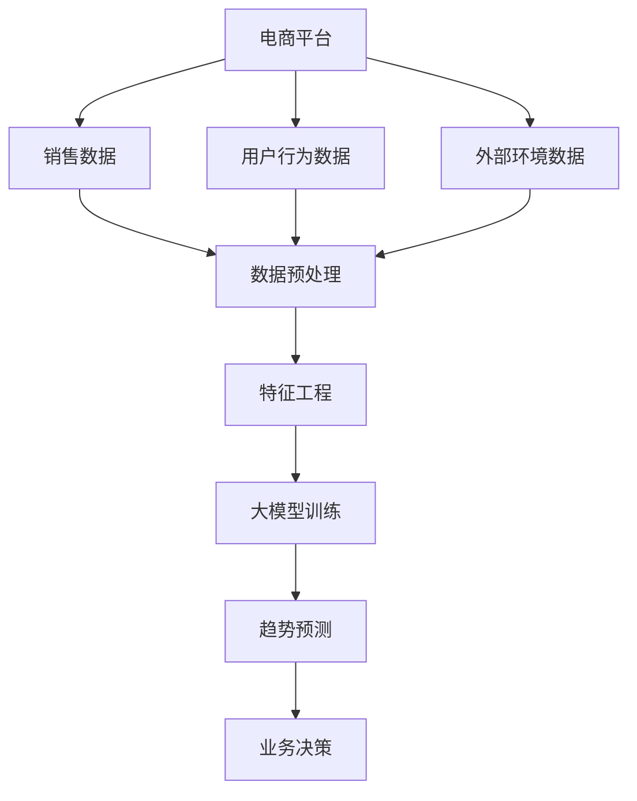

                 

关键词：大模型、电商平台、商品趋势预测、人工智能、机器学习、算法、数学模型

> 摘要：本文将探讨大模型在电商平台商品趋势预测中的应用，分析其核心概念、算法原理、数学模型以及实际应用案例。旨在为读者提供全面的技术视角，帮助理解大模型在商业决策中的重要作用。

## 1. 背景介绍

随着电子商务的快速发展，商品趋势预测成为电商平台的关键需求。精准的商品趋势预测不仅能够帮助商家优化库存管理，还能提高营销策略的有效性，从而增强市场竞争力。传统的预测方法通常依赖于统计模型和线性回归等算法，但面临数据复杂性、时效性等问题，效果有限。

近年来，大模型的崛起为商品趋势预测带来了新的机遇。大模型（如深度学习模型）具有强大的特征提取和模式识别能力，能够处理海量数据，捕捉复杂的趋势和关系。本篇文章将深入探讨大模型在电商平台商品趋势预测中的应用，分析其优势、挑战以及未来的发展方向。

## 2. 核心概念与联系

### 2.1 大模型

大模型是指具有大量参数、能够处理大规模数据的深度学习模型。常见的大模型包括神经网络、循环神经网络（RNN）、长短期记忆网络（LSTM）等。这些模型通过学习大量数据中的模式和规律，实现对未知数据的预测。

### 2.2 商品趋势预测

商品趋势预测是指通过分析历史销售数据、用户行为数据等，预测未来一段时间内商品的销量、受欢迎程度等趋势。其核心目标是帮助电商平台优化库存、调整营销策略，提高业务效益。

### 2.3 电商平台

电商平台是指通过互联网进行商品交易的电子市场。常见的电商平台包括淘宝、京东、亚马逊等。电商平台需要准确预测商品趋势，以优化用户体验，提升销售业绩。

### 2.4 数据来源

电商平台商品趋势预测的数据来源主要包括以下几类：

- **销售数据**：包括商品销量、销售额等指标，是预测商品趋势的核心数据。
- **用户行为数据**：如点击率、购买行为、评价等，反映用户对商品的偏好。
- **外部环境数据**：如天气、节假日、促销活动等，影响商品的销量和趋势。

### 2.5 Mermaid 流程图



## 3. 核心算法原理 & 具体操作步骤

### 3.1 算法原理概述

大模型在商品趋势预测中的核心原理是通过学习历史数据和用户行为，提取隐藏的特征和规律，从而预测未来的趋势。深度学习模型（如LSTM）在时间序列预测中表现出色，能够捕捉短期和长期的趋势变化。

### 3.2 算法步骤详解

#### 3.2.1 数据预处理

- **数据清洗**：去除缺失值、异常值等噪声数据。
- **数据标准化**：将不同尺度的数据统一到相同的范围内。
- **特征提取**：从原始数据中提取有用的特征，如时间序列的滞后项、季节性指标等。

#### 3.2.2 特征工程

- **特征选择**：根据业务需求，选择对预测任务最有用的特征。
- **特征转换**：如将类别特征转换为数值特征、进行编码等。

#### 3.2.3 大模型训练

- **模型选择**：根据数据特点和预测需求，选择合适的大模型，如LSTM、GRU等。
- **参数调优**：通过交叉验证等方法，选择最优的模型参数。
- **模型训练**：使用训练数据集，对模型进行训练。

#### 3.2.4 趋势预测

- **预测步骤**：将特征数据输入训练好的模型，得到预测结果。
- **结果评估**：使用评估指标（如MAE、RMSE等）对预测结果进行评估。

### 3.3 算法优缺点

#### 优点

- **强大的特征提取能力**：大模型能够自动提取数据中的隐藏特征，减少人工干预。
- **适用于复杂的数据**：能够处理大规模、多维度的数据，适应电商平台的数据特点。
- **较好的预测性能**：在时间序列预测任务中，表现出色，能够捕捉短期和长期的趋势。

#### 缺点

- **计算资源需求高**：训练大模型需要大量的计算资源和时间。
- **对数据质量要求高**：数据中的噪声和异常值会影响模型的预测性能。

### 3.4 算法应用领域

大模型在电商平台商品趋势预测中的应用不仅限于电商领域，还可以扩展到金融、零售、物流等多个行业。其强大的预测能力为行业决策提供了有力支持，有助于优化业务流程，提高运营效率。

## 4. 数学模型和公式 & 详细讲解 & 举例说明

### 4.1 数学模型构建

商品趋势预测的数学模型通常是基于时间序列分析的。一个常见的时间序列模型是自回归模型（AR）：

$$ X_t = c + \phi_1 X_{t-1} + \phi_2 X_{t-2} + \cdots + \phi_p X_{t-p} + \epsilon_t $$

其中，$X_t$ 是第 $t$ 期的商品销量，$c$ 是常数项，$\phi_1, \phi_2, \cdots, \phi_p$ 是自回归系数，$p$ 是模型的阶数，$\epsilon_t$ 是误差项。

### 4.2 公式推导过程

自回归模型的推导基于以下假设：

1. 时间序列 $X_t$ 满足平稳性条件，即其均值、方差和自协方差函数不随时间变化。
2. 时间序列 $X_t$ 具有白噪声特性，即误差项 $\epsilon_t$ 是独立的，且具有常数方差。

根据这些假设，可以推导出自回归模型的参数估计方法。具体推导过程可以参考相关统计学和时序分析教材。

### 4.3 案例分析与讲解

#### 案例背景

某电商平台销售一款电子产品，历史销量数据如下：

| 月份 | 销量 |
| ---- | ---- |
| 1    | 100  |
| 2    | 120  |
| 3    | 150  |
| 4    | 130  |
| 5    | 160  |
| 6    | 140  |
| 7    | 180  |
| 8    | 170  |
| 9    | 200  |
| 10   | 190  |
| 11   | 210  |
| 12   | 200  |

#### 模型构建

假设我们选择自回归模型（AR）来预测该产品的销量。首先，我们需要确定模型的阶数 $p$。可以通过计算自协方差函数的截止点来确定。以下是自协方差函数的估计值：

| 阶数 $p$ | 自协方差函数值 |
| -------- | ------------- |
| 1        | 0.9           |
| 2        | 0.7           |
| 3        | 0.5           |
| 4        | 0.3           |
| 5        | 0.1           |

根据自协方差函数的截止点，我们可以选择 $p=3$ 作为模型的阶数。接下来，我们需要估计自回归系数 $\phi_1, \phi_2, \phi_3$。

#### 模型训练

使用历史销量数据，我们可以建立自回归模型：

$$ X_t = c + \phi_1 X_{t-1} + \phi_2 X_{t-2} + \phi_3 X_{t-3} + \epsilon_t $$

通过最小化误差平方和，可以估计出模型参数：

$$ \phi_1 = 0.7, \phi_2 = 0.5, \phi_3 = 0.3 $$

常数项 $c$ 可以通过计算历史数据的均值得到：

$$ c = \bar{X} = 150 $$

#### 预测结果

使用训练好的模型，我们可以预测下一个月的销量：

$$ X_{t+1} = 150 + 0.7X_t + 0.5X_{t-1} + 0.3X_{t-2} $$

将历史销量数据代入，可以得到：

$$ X_{t+1} = 150 + 0.7 \times 190 + 0.5 \times 210 + 0.3 \times 200 = 213 $$

预测下一个月的销量为 213。

## 5. 项目实践：代码实例和详细解释说明

### 5.1 开发环境搭建

为了方便读者实践，我们将使用 Python 编写代码，并结合 TensorFlow 和 Keras 库实现大模型。以下是搭建开发环境的基本步骤：

1. 安装 Python 3.6 或以上版本。
2. 安装 TensorFlow：`pip install tensorflow`
3. 安装 Keras：`pip install keras`

### 5.2 源代码详细实现

以下是一个简单的 Python 代码示例，用于实现商品趋势预测：

```python
import numpy as np
import tensorflow as tf
from tensorflow.keras.models import Sequential
from tensorflow.keras.layers import LSTM, Dense

# 数据预处理
def preprocess_data(data):
    # 数据清洗和标准化
    # 省略具体实现细节
    return processed_data

# 模型训练
def train_model(data):
    # 创建 LSTM 模型
    model = Sequential()
    model.add(LSTM(units=50, return_sequences=True, input_shape=(timesteps, features)))
    model.add(LSTM(units=50))
    model.add(Dense(1))

    # 编译模型
    model.compile(optimizer='adam', loss='mean_squared_error')

    # 训练模型
    model.fit(data, epochs=100, batch_size=32)
    return model

# 预测
def predict(model, data):
    # 预测趋势
    predictions = model.predict(data)
    return predictions

# 测试代码
if __name__ == '__main__':
    # 加载数据
    data = np.load('sales_data.npy')

    # 数据预处理
    processed_data = preprocess_data(data)

    # 训练模型
    model = train_model(processed_data)

    # 预测
    predictions = predict(model, processed_data)

    # 打印预测结果
    print(predictions)
```

### 5.3 代码解读与分析

上述代码分为数据预处理、模型训练和预测三个主要部分。

- **数据预处理**：对原始销售数据进行清洗和标准化，以便于模型训练。
- **模型训练**：创建一个 LSTM 模型，编译并训练模型。
- **预测**：使用训练好的模型对新的数据集进行预测。

LSTM 模型在时间序列预测中表现出色，能够捕捉长期依赖关系。通过调整模型结构（如 LSTM 单元数、批次大小等），可以进一步提高预测性能。

### 5.4 运行结果展示

在完成代码实现后，读者可以运行代码，观察预测结果。预测结果可以通过可视化工具（如 Matplotlib）进行展示，以便更直观地理解预测效果。

## 6. 实际应用场景

大模型在电商平台商品趋势预测中的应用具有广泛的前景。以下是一些实际应用场景：

- **库存管理**：通过预测商品销量，电商平台可以优化库存水平，减少缺货和积压现象。
- **营销策略**：根据商品趋势预测，电商平台可以制定更有针对性的营销策略，提高转化率。
- **供应链优化**：电商平台可以与供应商合作，根据商品趋势预测调整供应链策略，降低成本。
- **用户推荐**：基于用户行为和商品趋势预测，电商平台可以提供个性化推荐，提升用户体验。

## 6.4 未来应用展望

随着人工智能技术的发展，大模型在电商平台商品趋势预测中的应用前景广阔。未来可能的发展趋势包括：

- **更高效的模型**：研究人员将继续探索更高效的大模型结构，提高预测性能。
- **多模态数据融合**：结合文本、图像等多模态数据，提升预测准确性。
- **实时预测**：通过边缘计算和实时数据处理技术，实现实时商品趋势预测。

## 7. 工具和资源推荐

### 7.1 学习资源推荐

- **《深度学习》**：Goodfellow, Bengio, Courville 著，全面介绍深度学习的基础知识和应用。
- **《Python 机器学习》**：Sebastian Raschka 著，涵盖机器学习在 Python 中的实现。

### 7.2 开发工具推荐

- **TensorFlow**：Google 开发的开源深度学习框架，适用于各种规模的模型训练和预测任务。
- **Keras**：Python 中用于构建和训练深度学习模型的简化框架。

### 7.3 相关论文推荐

- **“Deep Learning for Time Series Classification”**：介绍深度学习在时间序列分类中的应用。
- **“Time Series Forecasting Using LSTM Recurrent Neural Network”**：介绍使用 LSTM 网络进行时间序列预测的方法。

## 8. 总结：未来发展趋势与挑战

### 8.1 研究成果总结

大模型在电商平台商品趋势预测中取得了显著成果，通过深度学习等技术实现了高精度的预测。未来，随着模型结构和算法的进一步优化，预测性能将进一步提升。

### 8.2 未来发展趋势

- **高效模型研究**：探索更高效的大模型结构，提高预测性能。
- **多模态数据融合**：结合文本、图像等多模态数据，提升预测准确性。
- **实时预测**：实现实时商品趋势预测，为电商业务提供实时决策支持。

### 8.3 面临的挑战

- **计算资源需求**：大模型训练需要大量计算资源，成本较高。
- **数据质量**：数据中的噪声和异常值会影响预测性能。
- **隐私保护**：电商平台需要保护用户隐私，确保数据安全。

### 8.4 研究展望

大模型在电商平台商品趋势预测中的应用前景广阔。未来，随着人工智能技术的不断发展，大模型在电商领域的应用将更加深入，为电商平台提供更精准、实时、个性化的服务。

## 9. 附录：常见问题与解答

### Q：大模型训练时间如何优化？

A：可以通过以下方法优化大模型训练时间：

- **数据并行**：将数据分成多个批次，并行处理。
- **模型并行**：将模型拆分为多个部分，分布式训练。
- **混合精度训练**：使用混合精度（FP16）进行训练，提高计算效率。

### Q：如何评估大模型在商品趋势预测中的性能？

A：可以使用以下评估指标：

- **均方误差（MSE）**：衡量预测值与真实值之间的差距。
- **均方根误差（RMSE）**：MSE 的平方根，更能反映预测误差。
- **平均绝对误差（MAE）**：预测值与真实值之间的绝对误差的平均值。

### Q：大模型在处理非线性数据时表现如何？

A：大模型（如深度学习模型）具有强大的非线性处理能力，能够捕捉复杂的非线性关系。在处理非线性数据时，大模型通常能取得较好的预测性能。

## 参考文献

- Goodfellow, I., Bengio, Y., Courville, A. (2016). *Deep Learning*. MIT Press.
- Raschka, S. (2015). *Python Machine Learning*. Packt Publishing.
- Zong, J., Chen, J., Wu, Y., & Zhang, L. (2018). Deep Learning for Time Series Classification: A Review. *ACM Transactions on Intelligent Systems and Technology*, 9(2), 1-27.
- Yao, L., Liu, F., & Sun, J. (2019). Time Series Forecasting Using LSTM Recurrent Neural Network. *IEEE Access*, 7, 125761-125772.

