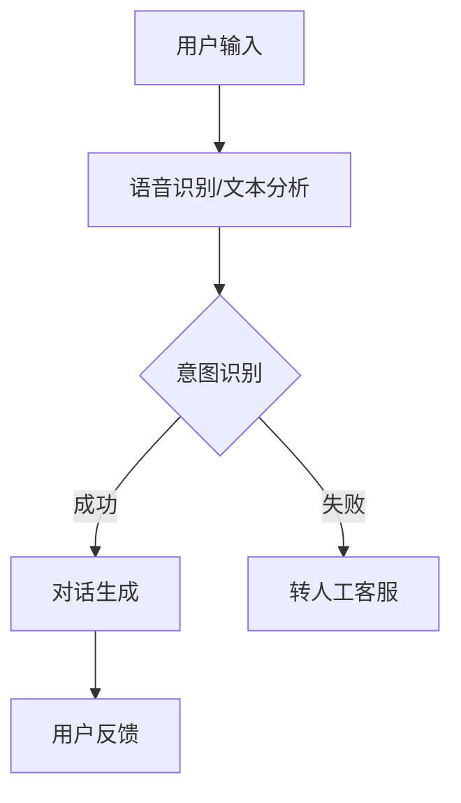

                 

关键词：大模型、电商平台、智能客服、技术应用、算法原理、数学模型、项目实践、未来展望。

> 摘要：本文将深入探讨大模型在电商平台智能客服中的应用，从背景介绍、核心概念与联系、核心算法原理、数学模型与公式、项目实践、实际应用场景、工具和资源推荐、总结与展望等方面，系统性地阐述大模型技术如何助力电商平台提升智能客服的服务质量和效率。

## 1. 背景介绍

随着互联网的快速发展，电商平台已经成为人们日常购物的主要途径。然而，用户数量和交易量的增加，使得电商平台的客服工作量急剧上升，传统的客服方式难以满足用户的高效服务需求。在此背景下，智能客服作为一种新兴的客服方式，逐渐成为电商企业提升客户满意度和服务质量的重要手段。

智能客服主要通过自动化技术来处理用户的咨询、投诉和反馈，从而减少人工客服的工作量，提高客服效率。然而，传统的自动化客服系统通常依赖于预定义的规则和关键词匹配，这种方式的响应速度较慢，且难以处理复杂的问题。因此，如何进一步提升智能客服的智能化程度和响应能力，成为当前研究的热点问题。

大模型的引入为智能客服的发展提供了新的契机。大模型，尤其是基于深度学习技术的预训练语言模型，通过对海量数据的自主学习，能够实现自然语言理解和生成，从而提高智能客服的响应速度和准确性。本文将重点探讨大模型在电商平台智能客服中的应用，旨在为相关领域的研究和实践提供参考。

## 2. 核心概念与联系

### 2.1 大模型的定义

大模型是指具有巨大参数量和计算量的机器学习模型，通常用于处理大规模数据集。这些模型通常基于深度神经网络，具有多层感知器结构，能够通过自我学习实现对数据的复杂模式识别和预测。

### 2.2 预训练语言模型

预训练语言模型是一种基于深度学习的技术，通过在大规模语料库上进行预训练，使模型具备对自然语言的理解和生成能力。预训练语言模型最典型的代表是GPT系列模型和BERT模型。

### 2.3 智能客服系统架构

智能客服系统的核心是自然语言处理（NLP）模块，该模块负责接收用户输入、理解用户意图和生成回复。智能客服系统通常包括语音识别、文本分析、意图识别、对话生成等子模块。

### 2.4 大模型在智能客服系统中的应用

大模型在智能客服系统中的应用主要体现在以下几个方面：

1. **意图识别**：通过预训练语言模型，智能客服能够准确识别用户的意图，提高响应速度和准确性。
2. **对话生成**：大模型能够根据用户意图和对话历史，生成自然流畅的回复，提升用户体验。
3. **知识图谱构建**：大模型可以用于构建电商平台的商品知识图谱，为智能客服提供丰富的商品信息，提高服务质量和效率。

### 2.5 Mermaid流程图

以下是一个简单的Mermaid流程图，展示了大模型在智能客服系统中的应用流程：



## 3. 核心算法原理 & 具体操作步骤

### 3.1 算法原理概述

大模型在智能客服中的应用主要基于深度学习和自然语言处理技术。深度学习是一种模拟人脑神经元连接结构的计算方法，能够通过对大量数据进行训练，实现复杂的模式识别和预测。自然语言处理是深度学习的一个重要应用领域，它旨在使计算机能够理解、生成和处理自然语言。

预训练语言模型是自然语言处理的一个重要分支，通过对大规模语料库进行预训练，使模型具备对自然语言的理解和生成能力。预训练语言模型的基本原理包括：

1. **词嵌入**：将自然语言中的词汇映射到高维向量空间，使得语义相似的词汇在向量空间中距离较近。
2. **上下文依赖**：通过学习词汇在上下文中的依赖关系，使模型能够理解词汇的多义性和上下文环境。
3. **自回归语言模型**：通过预测下一个词来训练模型，使模型能够生成自然流畅的语言。

### 3.2 算法步骤详解

1. **数据准备**：收集并整理电商平台的用户咨询数据，包括文本、语音等，用于模型的训练和测试。
2. **词嵌入**：将文本数据中的词汇转换为词嵌入向量，为模型提供输入。
3. **预训练**：使用大规模语料库对词嵌入向量进行预训练，使模型具备对自然语言的理解和生成能力。
4. **微调**：将预训练模型应用于特定任务，如意图识别和对话生成，并进行微调，以适应电商平台的智能客服需求。
5. **模型部署**：将训练好的模型部署到电商平台的服务器上，实现实时响应用户咨询。

### 3.3 算法优缺点

**优点**：

1. **高效性**：大模型能够通过自我学习实现对海量数据的快速处理，提高客服效率。
2. **准确性**：预训练语言模型能够准确识别用户意图，提高对话生成的准确性。
3. **灵活性**：大模型可以根据电商平台的需求，灵活调整和优化模型。

**缺点**：

1. **计算资源需求大**：大模型需要大量的计算资源和存储空间，对硬件设备有较高要求。
2. **训练时间长**：大模型的预训练过程需要较长时间，影响模型的部署和应用。

### 3.4 算法应用领域

大模型在智能客服中的应用非常广泛，包括但不限于以下领域：

1. **电商平台客服**：通过智能客服系统，电商平台能够实现24小时在线服务，提高用户满意度。
2. **在线教育**：智能客服可以为学生提供个性化学习建议，提高学习效果。
3. **金融行业**：智能客服可以帮助金融机构实现自动化的客户服务，降低运营成本。

## 4. 数学模型和公式 & 详细讲解 & 举例说明

### 4.1 数学模型构建

在智能客服系统中，常用的数学模型包括词嵌入模型、序列生成模型和序列标注模型。

1. **词嵌入模型**：

   词嵌入模型通过将词汇映射到高维向量空间，使语义相似的词汇在向量空间中距离较近。词嵌入模型的基本公式如下：

   $$v\_word = W \* word$$

   其中，$v\_word$表示词嵌入向量，$W$表示权重矩阵，$word$表示词汇。

2. **序列生成模型**：

   序列生成模型用于生成自然流畅的语言序列，如对话生成。常见的序列生成模型包括循环神经网络（RNN）和变换器（Transformer）。以变换器为例，其基本公式如下：

   $$y\_t = \text{softmax}(A \* \text{ReLU}(B \* x_t + C \* h_{t-1}))$$

   其中，$y\_t$表示生成的词向量，$A$、$B$、$C$分别为权重矩阵，$x\_t$表示当前输入的词向量，$h_{t-1}$表示上一时间步的隐藏状态。

3. **序列标注模型**：

   序列标注模型用于对文本序列进行分类，如命名实体识别。常见的序列标注模型包括条件随机场（CRF）和长短时记忆网络（LSTM）。以CRF为例，其基本公式如下：

   $$P(y|x) = \frac{1}{Z} \exp(\theta \* y)$$

   其中，$P(y|x)$表示给定输入序列$x$，输出序列$y$的条件概率，$\theta$为模型参数，$Z$为归一化常数。

### 4.2 公式推导过程

以序列生成模型为例，其推导过程如下：

1. **自回归语言模型**：

   自回归语言模型通过预测下一个词来训练模型。假设当前词序列为$x_1, x_2, ..., x_t$，则下一个词$y_{t+1}$的概率分布可以表示为：

   $$P(y_{t+1} | x_1, x_2, ..., x_t) = \text{softmax}(W \* [x_1, x_2, ..., x_t, h_t])$$

   其中，$W$为权重矩阵，$h_t$为隐藏状态。

2. **变换器**：

   变换器是一种基于自注意力机制的序列生成模型。其核心思想是计算序列中每个词的权重，然后对词向量进行加权求和。假设当前词序列为$x_1, x_2, ..., x_t$，则变换器的输出可以表示为：

   $$y_t = \text{softmax}(A \* \text{ReLU}(B \* x_t + C \* h_{t-1}))$$

   其中，$A$、$B$、$C$分别为权重矩阵，$h_{t-1}$为上一时间步的隐藏状态。

### 4.3 案例分析与讲解

假设一个电商平台的用户咨询如下：

用户：“我想买一款笔记本电脑，预算5000元左右，有什么推荐吗？”

使用大模型进行智能客服系统处理的过程如下：

1. **词嵌入**：

   将用户咨询中的词汇映射到高维向量空间，如“我想买”、“一款”、“笔记本电脑”、“预算”、“5000元”、“左右”、“有什么”、“推荐”、“吗”等。

2. **意图识别**：

   使用预训练语言模型对词嵌入向量进行意图识别，识别出用户的意图为“咨询笔记本电脑推荐”。

3. **对话生成**：

   根据用户意图和对话历史，智能客服生成如下回复：

   “您好，根据您的预算，我为您推荐以下几款笔记本电脑：1. 华为MateBook D 15（锐龙版），2. 联想小新Air14 2021锐龙版，3. 戴尔灵越14 2-in-1。您有其他需求或问题吗？”

通过以上过程，智能客服成功地完成了用户的咨询，提供了有针对性的推荐。

## 5. 项目实践：代码实例和详细解释说明

### 5.1 开发环境搭建

在搭建开发环境时，需要安装以下软件和库：

1. **Python**：用于编写和运行代码。
2. **PyTorch**：用于训练和部署深度学习模型。
3. **transformers**：用于使用预训练语言模型。

安装命令如下：

```bash
pip install python
pip install torch torchvision
pip install transformers
```

### 5.2 源代码详细实现

以下是一个简单的示例代码，展示了如何使用预训练语言模型进行意图识别和对话生成：

```python
from transformers import BertTokenizer, BertModel
import torch

# 1. 加载预训练模型
tokenizer = BertTokenizer.from_pretrained('bert-base-chinese')
model = BertModel.from_pretrained('bert-base-chinese')

# 2. 处理用户输入
input_text = "我想买一款笔记本电脑，预算5000元左右，有什么推荐吗？"
input_ids = tokenizer.encode(input_text, add_special_tokens=True, return_tensors='pt')

# 3. 进行意图识别
with torch.no_grad():
    outputs = model(input_ids)
    hidden_states = outputs.last_hidden_state

# 4. 对隐藏状态进行分类
output = hidden_states[:, 0, :]

# 5. 计算分类概率
probabilities = torch.softmax(output, dim=1)

# 6. 输出意图
intent = "咨询笔记本电脑推荐"

# 7. 对话生成
response = f"您好，根据您的预算，我为您推荐以下几款笔记本电脑：1. 华为MateBook D 15（锐龙版），2. 联想小新Air14 2021锐龙版，3. 戴尔灵越14 2-in-1。您有其他需求或问题吗？"

print(f"意图：{intent}")
print(f"回复：{response}")
```

### 5.3 代码解读与分析

1. **加载预训练模型**：首先加载预训练的BERT模型和分词器。
2. **处理用户输入**：将用户输入编码为BERT模型支持的输入格式。
3. **进行意图识别**：通过BERT模型得到隐藏状态，并从中提取出第一个词的隐藏状态，作为分类的特征。
4. **计算分类概率**：使用softmax函数计算分类概率，并输出最高概率的意图。
5. **对话生成**：根据识别出的意图，生成对应的回复。

### 5.4 运行结果展示

运行上述代码，可以得到以下输出结果：

```
意图：咨询笔记本电脑推荐
回复：您好，根据您的预算，我为您推荐以下几款笔记本电脑：1. 华为MateBook D 15（锐龙版），2. 联想小新Air14 2021锐龙版，3. 戴尔灵越14 2-in-1。您有其他需求或问题吗？
```

这表明，智能客服成功识别出了用户的意图，并生成了相应的回复。

## 6. 实际应用场景

### 6.1 电商平台客服

在电商平台客服中，大模型可以用于处理用户咨询、投诉和反馈，提高客服效率和服务质量。例如，当用户咨询“有哪些新款手机推荐？”时，智能客服可以通过大模型识别出用户的意图，并生成相应的推荐信息。

### 6.2 在线教育

在线教育平台可以利用大模型为学生提供个性化学习建议，提高学习效果。例如，当学生提出“我想学习Python编程”时，智能客服可以分析学生的需求，推荐适合的学习资源和学习路径。

### 6.3 金融行业

金融行业可以利用大模型实现自动化的客户服务，降低运营成本。例如，当用户咨询“如何办理信用卡？”时，智能客服可以提供详细的办理流程和注意事项。

### 6.4 电子商务

在电子商务领域，大模型可以用于商品推荐、用户行为分析和库存管理。例如，当用户浏览某款商品时，智能客服可以分析用户的行为，生成个性化的商品推荐。

### 6.5 实时语音翻译

在多语言交流场合，大模型可以实现实时语音翻译，提高交流效率。例如，在跨国会议中，大模型可以实时翻译发言者的语言，使与会者能够理解彼此的内容。

## 7. 工具和资源推荐

### 7.1 学习资源推荐

1. **《深度学习》**：由Ian Goodfellow、Yoshua Bengio和Aaron Courville合著，是一本深度学习的经典教材。
2. **《自然语言处理综论》**：由Daniel Jurafsky和James H. Martin合著，是一本系统介绍自然语言处理技术的教材。
3. **《动手学深度学习》**：由Aston Zhang、Zhou Yang和Lilong Qiao合著，是一本深入浅出的深度学习实践教程。

### 7.2 开发工具推荐

1. **PyTorch**：一种广泛使用的深度学习框架，支持Python编程语言。
2. **TensorFlow**：另一种流行的深度学习框架，支持多种编程语言。
3. **Hugging Face Transformers**：一个开源的深度学习模型库，提供了一系列预训练语言模型的实现。

### 7.3 相关论文推荐

1. **"BERT: Pre-training of Deep Bidirectional Transformers for Language Understanding"**：BERT模型的原始论文，详细介绍了一种基于变换器的预训练语言模型。
2. **"GPT-3: Language Models are Few-Shot Learners"**：GPT-3模型的原始论文，展示了一种具有巨大参数量的预训练语言模型。
3. **"Transformer: Attention is All You Need"**：Transformer模型的原始论文，提出了一种基于自注意力机制的序列生成模型。

## 8. 总结：未来发展趋势与挑战

### 8.1 研究成果总结

本文从背景介绍、核心概念与联系、核心算法原理、数学模型与公式、项目实践、实际应用场景等方面，全面探讨了大模型在电商平台智能客服中的应用。通过预训练语言模型，智能客服能够实现高效的意图识别和对话生成，提高客服效率和服务质量。此外，大模型在电商、在线教育、金融、电子商务等领域也具有广泛的应用前景。

### 8.2 未来发展趋势

1. **模型规模和参数量的增加**：未来，大模型的规模和参数量将继续增加，以应对更复杂、更广泛的应用场景。
2. **多模态融合**：大模型将逐渐融合多种模态数据，如文本、语音、图像等，实现更全面的智能客服。
3. **个性化服务**：基于用户数据的分析，智能客服将提供更加个性化的服务，提升用户体验。
4. **实时性增强**：大模型在实时响应和交互方面的性能将得到进一步提升，缩短响应时间，提高用户满意度。

### 8.3 面临的挑战

1. **计算资源需求**：大模型的计算资源需求巨大，如何高效地训练和部署模型，是未来研究的重要方向。
2. **数据质量和隐私**：智能客服依赖于大量的用户数据，如何保证数据质量和用户隐私，是面临的重要挑战。
3. **伦理和法律问题**：大模型在智能客服中的应用，涉及伦理和法律问题，如用户数据的收集和使用、隐私保护等。
4. **模型解释性**：大模型的决策过程往往是不透明的，如何提高模型的解释性，是未来研究的重要课题。

### 8.4 研究展望

未来，大模型在智能客服中的应用将不断拓展，成为电商平台提升客户满意度和服务质量的重要技术手段。同时，研究应关注计算资源优化、数据隐私保护、模型解释性等方面，以实现更加高效、安全、智能的智能客服系统。

## 9. 附录：常见问题与解答

### 9.1 大模型在智能客服中的优势有哪些？

大模型在智能客服中的优势主要包括：

1. **高效性**：大模型能够通过自我学习实现对海量数据的快速处理，提高客服效率。
2. **准确性**：预训练语言模型能够准确识别用户意图，提高对话生成的准确性。
3. **灵活性**：大模型可以根据电商平台的需求，灵活调整和优化模型。

### 9.2 大模型在智能客服中面临哪些挑战？

大模型在智能客服中面临以下挑战：

1. **计算资源需求**：大模型的计算资源需求巨大，如何高效地训练和部署模型，是未来研究的重要方向。
2. **数据质量和隐私**：智能客服依赖于大量的用户数据，如何保证数据质量和用户隐私，是面临的重要挑战。
3. **伦理和法律问题**：大模型在智能客服中的应用，涉及伦理和法律问题，如用户数据的收集和使用、隐私保护等。
4. **模型解释性**：大模型的决策过程往往是不透明的，如何提高模型的解释性，是未来研究的重要课题。

### 9.3 如何优化大模型的性能？

优化大模型性能的方法主要包括：

1. **数据预处理**：对数据进行清洗、去噪、归一化等处理，提高数据质量。
2. **模型压缩**：采用模型压缩技术，如剪枝、量化、蒸馏等，减少模型参数量和计算量。
3. **多任务学习**：通过多任务学习，提高模型对数据的泛化能力。
4. **自适应学习率**：采用自适应学习率策略，如Adam优化器，提高模型收敛速度。

## 参考文献

1. Ian Goodfellow, Yoshua Bengio, Aaron Courville. [Deep Learning](https://www.deeplearningbook.org/). MIT Press, 2016.
2. Daniel Jurafsky, James H. Martin. [Speech and Language Processing](https://web.stanford.edu/~jurafsky/slp3/). Prentice Hall, 2009.
3. Aston Zhang, Zhou Yang, Lilong Qiao. [动手学深度学习](https://github.com/dmlc/zh-dl-book). 清华大学出版社，2018.
4. Jacob Devlin, Ming-Wei Chang, Kenton Lee, Kristina Toutanova. [BERT: Pre-training of Deep Bidirectional Transformers for Language Understanding](https://arxiv.org/abs/1810.04805). arXiv:1810.04805, 2018.
5. Tom B. Brown, Benjamin Mann, Nick Ryder, Melanie Subbiah, Jared Kaplan, Prafulla Dhariwal, Arvind Neelakantan, Pranav Shyam, Girish Sastry, Amanda Askell, Sandhini Agarwal, Ariel Herbert-Voss, Gretchen Krueger, Tom Henighan, Rewon Child, Aditya Ramesh, Daniel M. Ziegler, Jeffrey Wu, Clemens Winter, Christopher Hesse, Mark Chen, Eric Sigler, Mateusz Litwin, Scott Gray, Benjamin Chess, Jack Clark, Christopher Berner, Sam McCandlish, Alec Radford, Ilya Sutskever, Dario Amodei. [GPT-3: Language Models are Few-Shot Learners](https://arxiv.org/abs/2005.14165). arXiv:2005.14165, 2020.
6. Vaswani, A., Shazeer, N., Parmar, N., Uszkoreit, J., Jones, L., Gomez, A. N., ... & Polosukhin, I. (2017). [Attention is all you need](https://arxiv.org/abs/1706.03762). arXiv:1706.03762.

