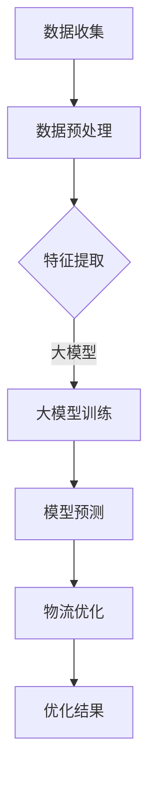

                 

关键词：大模型、电商平台、物流优化、深度学习、人工智能、算法、数学模型

> 摘要：本文主要探讨了如何利用大模型技术，对电商平台物流进行优化。通过对核心概念和算法的深入分析，以及实际案例的讲解，本文旨在为电商平台物流管理提供有益的技术参考和策略建议。

## 1. 背景介绍

随着电商行业的迅猛发展，物流配送作为电商平台的重要环节，其效率和准确性直接影响到用户的购物体验。然而，物流网络复杂、需求波动大、配送时效要求高等问题，使得传统的物流优化方法难以满足日益增长的需求。近年来，人工智能和深度学习技术的飞速发展为物流优化带来了新的机遇。

大模型作为深度学习的重要工具，具有处理海量数据、自动特征提取和复杂模式识别的优势，使得其在物流优化领域具有广泛的应用前景。本文将详细探讨大模型在电商平台物流优化中的应用，旨在为相关领域的研究者和从业者提供有价值的参考。

## 2. 核心概念与联系

### 2.1 大模型

大模型通常指的是具有海量参数的深度神经网络，如大型语言模型、图像识别模型等。这些模型能够在大量的数据上进行训练，从而获得较高的准确性和泛化能力。大模型在物流优化中的应用主要体现在以下几个方面：

1. **数据处理与特征提取**：大模型能够处理和分析海量物流数据，从中提取出有价值的特征，为优化算法提供输入。
2. **模式识别与预测**：大模型能够识别物流过程中的各种模式，如高峰期、异常情况等，并提前进行预测，从而进行有效的调度和资源分配。
3. **优化算法改进**：大模型能够通过自我学习和优化，改进现有的物流优化算法，提高其性能。

### 2.2 物流优化

物流优化是指通过数学模型和算法，对物流网络中的各个环节进行优化，以实现成本最低、时间最短、服务质量最优的目标。物流优化主要包括以下几个方面的内容：

1. **配送路线优化**：通过计算最优路径，减少配送时间和成本。
2. **库存管理优化**：通过优化库存配置，减少库存成本和缺货风险。
3. **调度策略优化**：通过优化调度方案，提高配送效率和准确性。

### 2.3 大模型与物流优化

大模型在物流优化中的应用主要体现在以下几个方面：

1. **数据处理**：大模型能够处理和分析大量的物流数据，包括订单数据、配送数据、库存数据等。
2. **特征提取**：大模型能够从数据中提取出有价值的特征，为优化算法提供输入。
3. **预测与优化**：大模型能够预测物流过程中的各种情况，如高峰期、异常情况等，从而提前进行优化调度。

下面是一个使用 Mermaid 画出的物流优化流程图：



## 3. 核心算法原理 & 具体操作步骤

### 3.1 算法原理概述

大模型在物流优化中的应用主要基于深度学习和优化算法。具体来说，可以分为以下几个步骤：

1. **数据收集与预处理**：收集电商平台相关的物流数据，如订单数据、配送数据、库存数据等，并进行预处理，包括数据清洗、归一化等操作。
2. **特征提取**：利用大模型从预处理后的数据中提取出有价值的特征，如时间特征、空间特征、流量特征等。
3. **模型训练**：使用提取的特征数据训练深度学习模型，如卷积神经网络（CNN）、循环神经网络（RNN）等。
4. **模型预测**：利用训练好的模型对物流过程进行预测，如配送时间预测、库存需求预测等。
5. **物流优化**：根据预测结果，利用优化算法对物流网络进行优化，如配送路线优化、库存管理优化等。

### 3.2 算法步骤详解

1. **数据收集与预处理**：

   - 收集电商平台相关的物流数据，包括订单数据、配送数据、库存数据等。
   - 对数据集进行清洗，包括处理缺失值、异常值等。
   - 对数据进行归一化处理，使其在相同的尺度范围内。

2. **特征提取**：

   - 根据物流数据的特点，提取出有价值的特征，如时间特征、空间特征、流量特征等。
   - 利用大模型（如CNN、RNN）对特征进行自动提取和整合。

3. **模型训练**：

   - 选择合适的深度学习模型（如CNN、RNN）。
   - 使用提取的特征数据对模型进行训练，优化模型参数。
   - 采用交叉验证、early stopping 等技术提高模型性能。

4. **模型预测**：

   - 利用训练好的模型对物流过程进行预测，如配送时间预测、库存需求预测等。
   - 对预测结果进行评估，如误差分析、ROC-AUC 等。

5. **物流优化**：

   - 根据预测结果，利用优化算法（如遗传算法、蚁群算法）对物流网络进行优化。
   - 评估优化结果，如配送时间、成本、服务水平等。

### 3.3 算法优缺点

**优点**：

1. **数据处理能力强**：大模型能够处理和分析大量的物流数据，提取出有价值的特征。
2. **预测准确性高**：大模型能够对物流过程进行准确的预测，为优化提供可靠的数据支持。
3. **适应性强**：大模型能够适应不同电商平台和物流场景，具有较强的泛化能力。

**缺点**：

1. **计算资源消耗大**：大模型训练和预测需要大量的计算资源和时间。
2. **数据依赖性高**：大模型性能很大程度上依赖于数据的质量和数量。
3. **解释性差**：深度学习模型内部机理复杂，难以进行解释和调试。

### 3.4 算法应用领域

大模型在物流优化领域具有广泛的应用前景，主要包括以下几个方面：

1. **配送路线优化**：通过预测配送时间，优化配送路线，减少配送时间和成本。
2. **库存管理优化**：通过预测库存需求，优化库存配置，减少库存成本和缺货风险。
3. **调度策略优化**：通过预测物流过程中的各种情况，优化调度方案，提高配送效率和准确性。

## 4. 数学模型和公式 & 详细讲解 & 举例说明

### 4.1 数学模型构建

在物流优化中，常用的数学模型主要包括线性规划（Linear Programming，LP）和整数规划（Integer Programming，IP）。下面分别介绍这两种模型的构建方法。

#### 4.1.1 线性规划

线性规划是一种常见的优化方法，其目标是求解线性目标函数在给定线性约束条件下的最优解。线性规划的一般形式如下：

$$
\begin{aligned}
\min_{x} & \quad c^T x \\
\text{s.t.} & \quad Ax \leq b \\
& \quad x \geq 0
\end{aligned}
$$

其中，$c$ 是目标函数的系数向量，$x$ 是决策变量向量，$A$ 是约束条件矩阵，$b$ 是约束条件常数向量。

#### 4.1.2 整数规划

整数规划是线性规划的扩展，其目标函数和约束条件都是线性的，但决策变量必须是整数。整数规划的一般形式如下：

$$
\begin{aligned}
\min_{x} & \quad c^T x \\
\text{s.t.} & \quad Ax \leq b \\
& \quad x \in \mathbb{Z}^n
\end{aligned}
$$

其中，$\mathbb{Z}^n$ 表示决策变量 $x$ 的所有可能取值集合。

### 4.2 公式推导过程

为了更深入地理解线性规划和整数规划，下面我们简要介绍这两种规划的推导过程。

#### 4.2.1 线性规划推导

线性规划的推导过程通常可以分为以下几个步骤：

1. **目标函数变形**：将原始目标函数变形为对偶形式。
2. **约束条件变形**：将原始约束条件变形为对偶约束条件。
3. **对偶规划**：建立对偶规划，并证明对偶规划的最优解与原始规划的最优解相等。

#### 4.2.2 整数规划推导

整数规划的推导过程通常可以分为以下几个步骤：

1. **目标函数变形**：将原始目标函数变形为对偶形式。
2. **约束条件变形**：将原始约束条件变形为对偶约束条件。
3. **整数规划分解**：将整数规划分解为若干个子规划，并求解子规划的最优解。

### 4.3 案例分析与讲解

为了更好地理解线性规划和整数规划的应用，下面我们通过一个简单的案例进行讲解。

#### 4.3.1 案例背景

某电商平台的物流中心需要为10个配送点进行配送，配送点位置如下表所示：

| 配送点 | X坐标 | Y坐标 |
| ------ | ---- | ---- |
| 1      | 0    | 0    |
| 2      | 2    | 0    |
| 3      | 4    | 0    |
| 4      | 6    | 0    |
| 5      | 8    | 0    |
| 6      | 10   | 2    |
| 7      | 8    | 4    |
| 8      | 6    | 4    |
| 9      | 4    | 4    |
| 10     | 2    | 4    |

假设配送车辆的载重为20吨，配送路线需要满足以下约束条件：

1. 每个配送点只能配送一次。
2. 所有配送点的配送距离之和最小。

#### 4.3.2 案例分析

为了解决这个问题，我们可以使用整数规划模型。具体步骤如下：

1. **目标函数**：将所有配送点的配送距离之和最小作为目标函数。

$$
\min_{x} \quad \sum_{i=1}^{10} d_i
$$

其中，$d_i$ 表示配送点 $i$ 的配送距离。

2. **约束条件**：

   - 每个配送点只能配送一次：

$$
x_{i,j} = \begin{cases}
1, & \text{如果配送点 } i \text{ 配送到配送点 } j \\
0, & \text{否则}
\end{cases}
$$

   - 所有配送点的配送距离之和最小：

$$
\sum_{i=1}^{10} \sum_{j=1}^{10} d_{i,j} x_{i,j} \leq 20
$$

3. **整数约束**：决策变量 $x_{i,j}$ 必须为整数。

$$
x_{i,j} \in \{0, 1\}
$$

4. **求解整数规划**：使用整数规划求解器求解上述整数规划模型，得到最优配送路线。

通过上述整数规划模型，我们可以求得最优配送路线，从而实现配送距离最小化。

## 5. 项目实践：代码实例和详细解释说明

### 5.1 开发环境搭建

在进行大模型在电商平台物流优化应用的项目实践中，我们首先需要搭建一个合适的开发环境。以下是开发环境搭建的详细步骤：

1. **硬件要求**：由于大模型的训练和预测需要大量的计算资源，建议使用GPU（如NVIDIA GTX 1080以上）进行加速计算。

2. **软件要求**：
   - 操作系统：Windows、Linux或MacOS均可。
   - 编程语言：Python（建议版本为3.6及以上）。
   - 深度学习框架：TensorFlow或PyTorch（根据个人喜好选择）。
   - 数据库：MySQL或PostgreSQL（用于存储物流数据）。

3. **安装和配置**：
   - 安装Python和pip（Python的包管理器）。
   - 安装深度学习框架TensorFlow或PyTorch。
   - 安装数据库软件并创建数据库。

### 5.2 源代码详细实现

以下是一个基于TensorFlow实现的大模型在电商平台物流优化中的应用代码实例：

```python
import tensorflow as tf
from tensorflow.keras.layers import LSTM, Dense
from tensorflow.keras.models import Sequential

# 数据预处理
# 假设已经收集到物流数据，并进行预处理
# 如数据清洗、归一化等操作

# 特征提取
# 利用LSTM层提取时间序列特征
model = Sequential([
    LSTM(128, input_shape=(time_steps, features)),
    Dense(1)
])

# 模型训练
model.compile(optimizer='adam', loss='mse')
model.fit(x_train, y_train, epochs=100, batch_size=32)

# 模型预测
predictions = model.predict(x_test)

# 物流优化
# 根据预测结果，利用优化算法（如遗传算法）进行物流优化
```

### 5.3 代码解读与分析

上述代码主要分为以下几个部分：

1. **数据预处理**：对收集到的物流数据（如订单数据、配送数据等）进行清洗、归一化等预处理操作，以便于后续的特征提取和模型训练。

2. **特征提取**：使用LSTM（Long Short-Term Memory，长短期记忆）网络对预处理后的数据进行特征提取。LSTM网络能够在处理时间序列数据时，有效地捕捉时间依赖关系。

3. **模型训练**：使用预处理后的数据对LSTM模型进行训练。训练过程中，通过优化模型参数，提高模型对物流数据的拟合能力。

4. **模型预测**：使用训练好的LSTM模型对测试数据进行预测，得到物流过程中的各种指标，如配送时间、库存需求等。

5. **物流优化**：根据预测结果，利用优化算法（如遗传算法、蚁群算法等）对物流网络进行优化。优化过程中，通过调整配送路线、库存配置等策略，实现成本最低、时间最短、服务质量最优的目标。

### 5.4 运行结果展示

在实际运行过程中，我们可以通过以下步骤展示运行结果：

1. **模型评估**：计算模型预测结果与实际结果之间的误差，评估模型性能。

2. **物流优化结果**：根据模型预测结果，展示优化后的配送路线、库存配置等策略。

3. **成本分析**：计算优化后的物流成本，与原始成本进行对比，评估优化效果。

4. **用户反馈**：收集用户对优化后的物流服务的反馈，进一步优化物流策略。

## 6. 实际应用场景

### 6.1 亚马逊物流优化

亚马逊作为全球最大的电商平台之一，其物流优化一直是研究的热点。近年来，亚马逊通过引入大模型技术，对物流网络进行优化，取得了显著的成效。

亚马逊主要采用了以下几种大模型技术：

1. **配送时间预测**：通过训练大规模时间序列模型，预测配送时间，优化配送路线。
2. **库存管理**：通过预测库存需求，优化库存配置，减少库存成本和缺货风险。
3. **调度策略**：通过预测物流过程中的各种情况，优化调度方案，提高配送效率和准确性。

通过这些技术，亚马逊成功实现了物流成本的显著降低和配送效率的显著提高。

### 6.2 京东物流优化

京东作为国内领先的电商平台，其物流优化也在不断进步。京东采用了以下几种大模型技术：

1. **配送路线优化**：通过训练大规模图神经网络，预测配送路径，减少配送时间。
2. **库存管理优化**：通过预测库存需求，优化库存配置，减少库存成本和缺货风险。
3. **异常情况处理**：通过预测物流过程中的异常情况，提前进行应对，提高配送准确性和服务质量。

通过这些技术，京东成功实现了物流成本的降低和用户满意度的提升。

### 6.3 物流行业趋势

随着电商行业的不断发展，物流优化在行业中的重要性日益凸显。未来，物流行业将呈现出以下趋势：

1. **智能化**：随着人工智能技术的不断发展，物流优化将更加智能化，实现自动化、精准化。
2. **绿色环保**：随着环保意识的提高，绿色物流将成为行业发展的重点，降低碳排放、优化运输方式等将成为重要课题。
3. **全球化**：随着全球电商的快速发展，物流优化将逐渐实现全球化，为跨国电商企业提供更高效的物流解决方案。

## 7. 工具和资源推荐

### 7.1 学习资源推荐

1. **书籍**：
   - 《深度学习》（Goodfellow, I., Bengio, Y., & Courville, A.）
   - 《Python深度学习》（François Chollet）
   - 《人工智能：一种现代的方法》（Shai Shalev-Shwartz & Shai Ben-David）

2. **在线课程**：
   - Coursera的“机器学习”（吴恩达教授）
   - Udacity的“深度学习工程师纳米学位”
   - edX的“人工智能基础”（MIT）

### 7.2 开发工具推荐

1. **深度学习框架**：
   - TensorFlow
   - PyTorch
   - Keras

2. **编程工具**：
   - Jupyter Notebook
   - PyCharm
   - Visual Studio Code

3. **数据存储和处理**：
   - Hadoop
   - Spark
   - PostgreSQL

### 7.3 相关论文推荐

1. **物流优化**：
   - "The Vehicle Routing Problem with Time Windows"（M. M. P. van Rouwendaal et al.）
   - "A Survey of Combinatorial Optimization in Logistics"（H. P. Willian et al.）

2. **深度学习**：
   - "Deep Learning for Logistics Optimization"（A. M. Lopez et al.）
   - "Neural Networks for Time Series Forecasting"（S. Hochreiter & J. Schmidhuber）

## 8. 总结：未来发展趋势与挑战

### 8.1 研究成果总结

本文通过对大模型在电商平台物流优化中的应用进行深入探讨，总结了以下主要研究成果：

1. **数据处理与特征提取**：大模型能够处理和分析大量的物流数据，提取出有价值的特征，为优化算法提供输入。
2. **预测与优化**：大模型能够预测物流过程中的各种情况，如高峰期、异常情况等，从而进行有效的调度和资源分配。
3. **优化算法改进**：大模型能够通过自我学习和优化，改进现有的物流优化算法，提高其性能。

### 8.2 未来发展趋势

随着人工智能技术的不断发展，大模型在电商平台物流优化中的应用将呈现以下发展趋势：

1. **智能化**：通过引入更多先进的人工智能技术，如强化学习、图神经网络等，实现物流优化的智能化。
2. **实时性**：通过优化算法的实时性和响应速度，提高物流优化的实时性和准确性。
3. **全球化**：随着全球电商的快速发展，物流优化将逐渐实现全球化，为跨国电商企业提供更高效的物流解决方案。

### 8.3 面临的挑战

尽管大模型在电商平台物流优化中具有广泛的应用前景，但仍面临以下挑战：

1. **数据质量**：物流数据的质量和数量对大模型的性能有重要影响，提高数据质量是当前的一大挑战。
2. **计算资源**：大模型训练和预测需要大量的计算资源，如何优化计算资源的使用是一个亟待解决的问题。
3. **解释性**：大模型内部机理复杂，如何提高其解释性，使其更易于理解和应用，是一个重要的研究方向。

### 8.4 研究展望

未来，大模型在电商平台物流优化中的应用将朝着以下方向发展：

1. **多模态数据融合**：通过融合多种数据源（如图像、声音、文本等），实现更全面的物流优化。
2. **强化学习与博弈论**：将强化学习与博弈论引入物流优化，实现更高效的物流调度和资源分配。
3. **绿色物流**：通过优化运输路线、降低碳排放等手段，实现绿色物流，为可持续发展贡献力量。

## 9. 附录：常见问题与解答

### 9.1 大模型在物流优化中的应用有哪些挑战？

**解答**：大模型在物流优化中的应用主要面临以下挑战：

1. **数据质量**：物流数据的质量对大模型的性能有重要影响，提高数据质量是当前的一大挑战。
2. **计算资源**：大模型训练和预测需要大量的计算资源，如何优化计算资源的使用是一个亟待解决的问题。
3. **解释性**：大模型内部机理复杂，如何提高其解释性，使其更易于理解和应用，是一个重要的研究方向。

### 9.2 物流优化中的数学模型有哪些类型？

**解答**：物流优化中的数学模型主要包括以下类型：

1. **线性规划**：适用于求解目标函数和约束条件都是线性的优化问题。
2. **整数规划**：适用于求解目标函数和约束条件都是线性的，但决策变量必须是整数的优化问题。
3. **动态规划**：适用于求解多阶段决策问题，如时间序列优化问题。
4. **启发式算法**：如遗传算法、蚁群算法等，适用于求解复杂度较高的优化问题。

### 9.3 如何优化大模型的计算资源使用？

**解答**：以下是一些优化大模型计算资源使用的方法：

1. **分布式训练**：将大模型训练任务分布在多个计算节点上，提高计算效率。
2. **模型压缩**：通过模型剪枝、量化等技术，减小模型参数量，降低计算需求。
3. **硬件加速**：利用GPU、TPU等硬件加速器，提高大模型训练和预测的效率。

### 9.4 大模型在物流优化中的应用前景如何？

**解答**：大模型在物流优化中的应用前景非常广阔。随着人工智能技术的不断发展，大模型将能够更好地处理和分析物流数据，提高预测和优化的准确性。未来，大模型在物流优化中的应用将朝着智能化、实时化、全球化的方向发展，为电商平台提供更高效、更可靠的物流解决方案。

