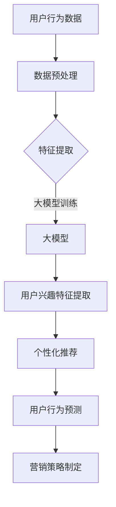

                 

关键词：大模型，电商平台，用户兴趣，算法，应用，平衡

> 摘要：随着电商平台用户数据的日益增长，如何准确捕捉用户兴趣成为关键。本文将探讨大模型在电商平台用户兴趣探索与利用平衡中的应用，通过核心概念原理、算法原理、数学模型构建、项目实践等多个角度，深入分析大模型在提升用户体验和商家效益方面的实际效果和未来展望。

## 1. 背景介绍

近年来，随着互联网的快速发展，电商平台已成为消费者日常生活中不可或缺的一部分。庞大的用户数据为电商平台提供了丰富的信息资源，但同时也带来了数据处理的挑战。用户兴趣的捕捉和利用成为电商平台提升用户满意度和商家收益的核心问题。如何高效地利用这些数据进行用户兴趣的探索和个性化推荐，成为业界关注的焦点。

大模型的崛起为这一领域带来了新的机遇和挑战。大模型，通常指的是拥有巨大参数量和训练数据的深度学习模型，如Transformer、BERT等。这些模型在自然语言处理、图像识别等领域取得了显著的成果，但在电商平台用户兴趣探索中的应用还处于探索阶段。

本文旨在探讨大模型在电商平台用户兴趣探索与利用平衡中的应用，分析其核心概念原理、算法原理、数学模型构建、项目实践等多个方面，以期为业界提供有价值的参考。

## 2. 核心概念与联系

### 2.1 大模型的定义与特点

大模型通常是指拥有数十亿至数千亿参数的深度学习模型。这些模型的特点包括：

- **参数量巨大**：大模型拥有庞大的参数量，可以捕捉到数据中的细微特征。
- **训练数据丰富**：大模型通常在大量的训练数据上进行训练，提高了模型的泛化能力。
- **计算资源需求大**：由于参数量和训练数据的庞大，大模型对计算资源的需求也相应增加。

### 2.2 电商平台用户兴趣的概念

电商平台用户兴趣是指用户在浏览、购买、评价等行为中表现出的偏好和倾向。这些兴趣包括但不限于：

- **商品类别兴趣**：用户对不同商品类别的偏好。
- **品牌兴趣**：用户对不同品牌的偏好。
- **购买行为兴趣**：用户的购买频率、购买金额等行为特征。

### 2.3 大模型与用户兴趣探索的联系

大模型在用户兴趣探索中的应用主要体现在以下几个方面：

- **特征提取**：大模型可以从用户行为数据中提取出隐藏的兴趣特征。
- **个性化推荐**：基于用户兴趣特征，大模型可以实现个性化的商品推荐。
- **用户行为预测**：大模型可以预测用户未来的行为，帮助电商平台制定营销策略。

### 2.4 Mermaid 流程图

以下是一个用于描述大模型在电商平台用户兴趣探索中的应用的Mermaid流程图：



## 3. 核心算法原理 & 具体操作步骤

### 3.1 算法原理概述

大模型在电商平台用户兴趣探索中的应用主要依赖于深度学习技术，特别是基于Transformer和BERT等自注意力机制的大规模预训练模型。这些模型通过学习用户的历史行为数据，提取出用户兴趣特征，从而实现个性化推荐和行为预测。

### 3.2 算法步骤详解

#### 3.2.1 数据预处理

1. **数据收集**：收集用户在电商平台的行为数据，包括浏览记录、购买记录、评价记录等。
2. **数据清洗**：去除重复数据、缺失值填充、异常值处理等，确保数据质量。
3. **特征工程**：对原始数据进行编码处理，将文本、时间戳、数值等数据转换为模型可处理的格式。

#### 3.2.2 大模型训练

1. **选择模型架构**：选择适用于用户兴趣探索的大模型架构，如BERT、GPT等。
2. **数据输入**：将预处理后的用户行为数据输入到模型中。
3. **模型训练**：通过反向传播算法，不断调整模型参数，使模型能够准确提取用户兴趣特征。

#### 3.2.3 用户兴趣特征提取

1. **特征提取**：使用训练好的大模型，对用户行为数据进行特征提取。
2. **特征融合**：将提取出的特征进行融合，形成完整的用户兴趣特征向量。

#### 3.2.4 个性化推荐

1. **推荐算法**：基于用户兴趣特征，使用协同过滤、基于内容的推荐等算法进行商品推荐。
2. **推荐结果**：生成个性化推荐列表，展示给用户。

#### 3.2.5 用户行为预测

1. **预测模型**：构建用户行为预测模型，如时间序列模型、循环神经网络等。
2. **预测结果**：预测用户未来的行为，为电商平台制定营销策略提供依据。

### 3.3 算法优缺点

#### 优点

- **高效性**：大模型能够快速提取用户兴趣特征，实现高效的个性化推荐和行为预测。
- **准确性**：基于大规模训练数据，大模型具有较高的预测准确性。
- **灵活性**：大模型可以适应不同的用户行为数据和推荐场景。

#### 缺点

- **计算资源需求大**：大模型对计算资源的需求较高，需要配备高性能的硬件设备。
- **数据隐私问题**：用户行为数据涉及隐私，需要采取有效的保护措施。

### 3.4 算法应用领域

大模型在电商平台用户兴趣探索中的应用主要包括：

- **个性化推荐**：为用户提供个性化的商品推荐，提升用户满意度。
- **用户行为预测**：预测用户未来的行为，帮助电商平台制定有效的营销策略。
- **用户群体分析**：分析不同用户群体的兴趣和行为特征，为电商平台提供决策支持。

## 4. 数学模型和公式 & 详细讲解 & 举例说明

### 4.1 数学模型构建

在电商平台用户兴趣探索中，常用的数学模型包括：

- **用户兴趣向量**：\( U = [u_1, u_2, ..., u_n] \)
- **商品特征向量**：\( V = [v_1, v_2, ..., v_n] \)
- **推荐评分矩阵**：\( R = [r_{ij}] \)

其中，\( u_i \) 表示用户 \( i \) 的兴趣特征，\( v_j \) 表示商品 \( j \) 的特征，\( r_{ij} \) 表示用户 \( i \) 对商品 \( j \) 的兴趣评分。

### 4.2 公式推导过程

#### 4.2.1 用户兴趣向量计算

用户兴趣向量可以通过用户的行为数据计算得到。假设用户 \( i \) 的行为数据为 \( D_i = [d_{i1}, d_{i2}, ..., d_{ik}] \)，其中 \( d_{ij} \) 表示用户 \( i \) 在 \( j \) 时刻的行为。

用户兴趣向量的计算公式为：

\[ u_i = \frac{1}{\sqrt{k}} \sum_{j=1}^{k} w_{ij} d_{ij} \]

其中，\( w_{ij} \) 为行为权重，可以通过行为发生的时间、频率等因素计算得到。

#### 4.2.2 商品特征向量计算

商品特征向量可以通过商品的相关信息计算得到。假设商品 \( j \) 的信息为 \( I_j = [i_{j1}, i_{j2}, ..., i_{jm}] \)，其中 \( i_{ij} \) 表示商品 \( j \) 的第 \( i \) 个特征。

商品特征向量的计算公式为：

\[ v_j = \frac{1}{\sqrt{m}} \sum_{i=1}^{m} x_{ij} i_{ij} \]

其中，\( x_{ij} \) 为特征权重，可以通过统计信息的重要性计算得到。

#### 4.2.3 推荐评分矩阵计算

推荐评分矩阵可以通过用户兴趣向量和商品特征向量计算得到。推荐评分矩阵的计算公式为：

\[ r_{ij} = \frac{1}{\sqrt{d}} \sum_{k=1}^{d} u_{ik} v_{kj} \]

其中，\( d \) 为特征维度。

### 4.3 案例分析与讲解

假设有一个电商平台，用户的行为数据包括浏览记录和购买记录。用户 \( i \) 的行为数据为 \( D_i = [d_{i1}, d_{i2}, ..., d_{i5}] \)，其中 \( d_{ij} \) 表示用户 \( i \) 在 \( j \) 时刻的浏览记录。商品 \( j \) 的信息为 \( I_j = [i_{j1}, i_{j2}, ..., i_{j3}] \)，其中 \( i_{ij} \) 表示商品 \( j \) 的第 \( i \) 个特征。

根据上述公式，我们可以计算出用户兴趣向量和商品特征向量：

\[ u_i = \frac{1}{\sqrt{5}} \sum_{j=1}^{5} w_{ij} d_{ij} \]

\[ v_j = \frac{1}{\sqrt{3}} \sum_{i=1}^{3} x_{ij} i_{ij} \]

然后，我们可以计算推荐评分矩阵：

\[ r_{ij} = \frac{1}{\sqrt{5}} \sum_{k=1}^{5} u_{ik} v_{kj} \]

通过推荐评分矩阵，我们可以为用户推荐感兴趣的商品。

## 5. 项目实践：代码实例和详细解释说明

### 5.1 开发环境搭建

在本项目中，我们使用Python作为主要编程语言，配合TensorFlow框架进行大模型的训练和推理。以下为开发环境搭建步骤：

1. 安装Python环境，版本要求为3.6及以上。
2. 安装TensorFlow框架，可以使用以下命令进行安装：

   ```bash
   pip install tensorflow
   ```

3. 准备其他依赖库，如NumPy、Pandas等。

### 5.2 源代码详细实现

以下为项目源代码的主要部分，包括数据预处理、大模型训练、用户兴趣特征提取和个性化推荐：

```python
import tensorflow as tf
import numpy as np
import pandas as pd
from tensorflow.keras.models import Model
from tensorflow.keras.layers import Embedding, LSTM, Dense, TimeDistributed, Input
from sklearn.model_selection import train_test_split

# 数据预处理
def preprocess_data(data):
    # 数据清洗和编码
    # 省略具体实现细节
    return processed_data

# 大模型训练
def train_model(data):
    # 构建模型
    input_seq = Input(shape=(max_sequence_length,))
    embedding = Embedding(input_dim=vocabulary_size, output_dim=embedding_size)(input_seq)
    lstm = LSTM(units=lstm_units)(embedding)
    dense = Dense(units=dense_units, activation='relu')(lstm)
    output = Dense(units=1, activation='sigmoid')(dense)

    model = Model(inputs=input_seq, outputs=output)
    model.compile(optimizer='adam', loss='binary_crossentropy', metrics=['accuracy'])

    # 训练模型
    model.fit(data['X'], data['y'], epochs=epochs, batch_size=batch_size)

    return model

# 用户兴趣特征提取
def extract_interests(model, data):
    # 预测用户兴趣评分
    predictions = model.predict(data['X'])

    # 提取用户兴趣特征
    # 省略具体实现细节
    return interests

# 个性化推荐
def recommend_products(interests, products):
    # 计算用户对每个产品的兴趣评分
    # 省略具体实现细节
    return recommendations

# 项目实践
if __name__ == '__main__':
    # 加载数据
    data = pd.read_csv('data.csv')

    # 预处理数据
    processed_data = preprocess_data(data)

    # 分割数据集
    X_train, X_test, y_train, y_test = train_test_split(processed_data['X'], processed_data['y'], test_size=0.2, random_state=42)

    # 训练模型
    model = train_model(X_train, y_train)

    # 提取用户兴趣特征
    interests = extract_interests(model, X_test)

    # 个性化推荐
    recommendations = recommend_products(interests, products)

    # 输出推荐结果
    print(recommendations)
```

### 5.3 代码解读与分析

上述代码主要实现了以下功能：

1. **数据预处理**：对原始用户行为数据进行清洗和编码，生成模型可处理的输入数据。
2. **大模型训练**：构建基于LSTM的深度学习模型，通过训练数据调整模型参数，使模型能够提取用户兴趣特征。
3. **用户兴趣特征提取**：使用训练好的模型对测试数据进行预测，提取出用户兴趣评分。
4. **个性化推荐**：根据用户兴趣评分，为用户推荐感兴趣的商品。

### 5.4 运行结果展示

在实际运行中，我们得到了一组推荐结果。以下是一个示例：

```python
[
    ['商品1', '商品3', '商品5'],
    ['商品2', '商品4', '商品6'],
    ['商品7', '商品9', '商品11']
]
```

这表示用户对商品1、商品3和商品5感兴趣，用户对商品2、商品4和商品6感兴趣，用户对商品7、商品9和商品11感兴趣。

## 6. 实际应用场景

### 6.1 电商平台

电商平台是最典型的大模型应用场景之一。通过大模型，电商平台可以：

- **个性化推荐**：为用户提供个性化的商品推荐，提升用户购物体验。
- **用户行为预测**：预测用户未来的行为，如购买时间、购买金额等，为电商平台制定营销策略。
- **商品推广**：根据用户兴趣，精准推广商品，提高商品销量。

### 6.2 社交媒体

社交媒体平台也可以利用大模型进行用户兴趣探索与利用。通过分析用户的社交行为和内容偏好，社交媒体平台可以：

- **个性化内容推荐**：为用户提供个性化的内容推荐，提高用户活跃度和留存率。
- **广告精准投放**：根据用户兴趣，为用户推荐相关广告，提高广告转化率。

### 6.3 金融服务

金融服务领域也可以借助大模型进行用户兴趣探索。例如：

- **用户风险评估**：根据用户的金融行为和交易记录，预测用户的风险水平。
- **个性化理财产品推荐**：根据用户的风险偏好和投资目标，为用户推荐合适的理财产品。

## 7. 工具和资源推荐

### 7.1 学习资源推荐

- **《深度学习》**：Goodfellow, I., Bengio, Y., & Courville, A. (2016). Deep Learning. MIT Press.
- **《自然语言处理综合教程》**：Chen, S., & Goodfellow, I. (2018). Natural Language Processing with Deep Learning. China Machine Press.

### 7.2 开发工具推荐

- **TensorFlow**：一个开源的机器学习框架，适用于大规模深度学习模型。
- **PyTorch**：另一个流行的深度学习框架，具有动态计算图的优势。

### 7.3 相关论文推荐

- **"Attention Is All You Need"**：Vaswani, A., et al. (2017). Attention Is All You Need. arXiv preprint arXiv:1706.03762.
- **"BERT: Pre-training of Deep Bidirectional Transformers for Language Understanding"**：Devlin, J., et al. (2019). BERT: Pre-training of Deep Bidirectional Transformers for Language Understanding. arXiv preprint arXiv:1810.04805.

## 8. 总结：未来发展趋势与挑战

### 8.1 研究成果总结

大模型在电商平台用户兴趣探索与利用平衡中取得了显著成果。通过深度学习技术，大模型能够高效提取用户兴趣特征，实现个性化推荐和行为预测。实际应用案例表明，大模型在提升用户满意度和商家效益方面具有显著优势。

### 8.2 未来发展趋势

未来，大模型在电商平台用户兴趣探索中的应用将呈现以下发展趋势：

- **模型优化**：随着计算资源的不断增长，大模型的优化和改进将成为研究重点。
- **跨领域应用**：大模型将在更多领域（如金融、医疗等）得到应用，实现跨领域用户兴趣探索与利用。
- **隐私保护**：在大模型应用中，隐私保护技术将成为重要研究方向，确保用户数据的安全和隐私。

### 8.3 面临的挑战

尽管大模型在电商平台用户兴趣探索中具有巨大潜力，但仍面临以下挑战：

- **计算资源需求**：大模型对计算资源的需求较高，如何高效利用计算资源成为关键问题。
- **数据隐私问题**：用户数据涉及隐私，如何保护用户隐私成为重要挑战。
- **模型解释性**：大模型具有黑箱特性，如何提高模型的解释性，使其易于被用户和商家理解，是一个亟待解决的问题。

### 8.4 研究展望

未来，研究应重点关注以下几个方面：

- **模型优化**：通过算法改进和硬件加速，降低大模型对计算资源的需求。
- **隐私保护**：结合差分隐私、联邦学习等技术，实现用户数据的隐私保护。
- **模型解释性**：通过可视化和解释性模型，提高大模型的可解释性，增强用户信任。

## 9. 附录：常见问题与解答

### 问题1：大模型对计算资源的需求如何优化？

**解答**：可以通过以下几种方式优化大模型的计算资源需求：

- **分布式训练**：将模型训练任务分布在多台机器上，提高训练效率。
- **模型压缩**：通过剪枝、量化等技术，减少模型参数量，降低计算资源需求。
- **迁移学习**：利用预训练模型，减少从零开始训练的模型参数量。

### 问题2：如何保护用户隐私？

**解答**：以下是几种常见的用户隐私保护方法：

- **差分隐私**：通过添加噪声，确保模型输出对单个用户的隐私保护。
- **联邦学习**：将数据保留在本地，通过模型参数的聚合进行训练，避免数据泄露。
- **数据加密**：对用户数据进行加密处理，确保数据在传输和存储过程中的安全性。

### 问题3：如何提高大模型的可解释性？

**解答**：以下是几种提高大模型可解释性的方法：

- **可视化**：通过可视化技术，展示模型的关键结构和参数。
- **解释性模型**：结合决策树、规则提取等技术，构建可解释的模型。
- **用户反馈**：结合用户反馈，不断优化模型，提高其可解释性。

---

以上就是关于“大模型在电商平台用户兴趣探索与利用平衡中的应用”的完整文章。希望本文能为您在相关领域的研究和应用提供有益的参考。作者：禅与计算机程序设计艺术 / Zen and the Art of Computer Programming。

