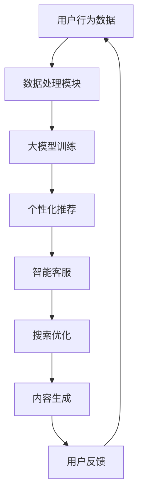

                 

关键词：大模型、电商平台、用户引导、算法、应用场景、数学模型、代码实例

> 摘要：本文将深入探讨大模型在电商平台用户引导中的应用，通过对其核心概念、算法原理、数学模型、项目实践和未来展望的详细阐述，旨在为读者提供全面的技术视角和实用指南。

## 1. 背景介绍

随着互联网的飞速发展，电商平台已经成为现代商业不可或缺的一部分。用户引导，即帮助用户更快捷、更方便地找到所需商品和服务，成为电商平台提升用户体验和交易转化率的关键。然而，传统的用户引导方式，如简单的推荐算法和搜索框，已经无法满足日益复杂的用户需求。为此，大模型的引入为电商平台用户引导带来了新的机遇。

大模型，特别是深度学习和自然语言处理领域的进展，使得计算机能够处理和理解更复杂、更丰富的数据，从而为用户引导提供了强大的技术支持。本文将详细探讨大模型在电商平台用户引导中的应用，包括核心概念、算法原理、数学模型、项目实践和未来展望。

## 2. 核心概念与联系

### 2.1 大模型的概念

大模型，是指那些能够处理大量数据、具备高度复杂性和自主学习能力的人工智能模型。这些模型通常由数百万甚至数十亿个参数组成，能够从数据中自动提取特征、发现规律，并用于预测和决策。

### 2.2 大模型在用户引导中的应用

在电商平台中，大模型的应用主要体现在以下几个方面：

1. **个性化推荐**：通过分析用户的浏览历史、购买记录和偏好，大模型可以推荐符合用户需求的商品和服务。
2. **智能客服**：利用自然语言处理技术，大模型可以与用户进行对话，提供即时、准确的咨询服务。
3. **搜索优化**：通过理解用户的查询意图，大模型可以优化搜索结果，提高用户找到所需商品的概率。
4. **内容生成**：大模型可以生成吸引人的商品描述和营销文案，提升用户的购买欲望。

### 2.3 Mermaid 流程图

下面是一个简单的 Mermaid 流程图，展示了大模型在电商平台用户引导中的应用架构：



## 3. 核心算法原理 & 具体操作步骤

### 3.1 算法原理概述

大模型在电商平台用户引导中的应用主要依赖于以下几种算法：

1. **深度学习**：通过多层神经网络，深度学习可以从大量数据中自动提取特征，实现复杂的模式识别和预测。
2. **自然语言处理**：自然语言处理技术使计算机能够理解和生成人类语言，从而实现智能对话和内容生成。
3. **协同过滤**：协同过滤是一种常见的推荐算法，通过分析用户之间的相似性，为用户推荐他们可能感兴趣的商品。

### 3.2 算法步骤详解

1. **数据收集与预处理**：收集用户的浏览历史、购买记录和偏好数据，并进行清洗、转换和归一化处理。
2. **模型训练**：利用深度学习和自然语言处理算法，对预处理后的数据进行训练，得到可用于预测和推荐的模型。
3. **模型评估与优化**：通过交叉验证和A/B测试，评估模型的性能，并根据反馈进行优化。
4. **应用部署**：将训练好的模型部署到生产环境，实时为用户提供个性化推荐、智能客服、搜索优化和内容生成等服务。

### 3.3 算法优缺点

**优点**：

- **高效性**：大模型能够处理海量数据，提高用户引导的效率。
- **个性化**：根据用户的个性化需求，提供更精准的服务。
- **自适应**：通过持续学习和优化，不断提升用户体验。

**缺点**：

- **复杂性**：大模型的训练和部署需要大量的计算资源和专业知识。
- **数据隐私**：用户数据的收集和使用可能涉及隐私问题。

### 3.4 算法应用领域

除了电商平台，大模型在用户引导中的应用还广泛存在于以下领域：

- **社交媒体**：通过分析用户行为，为用户提供个性化内容推荐和好友推荐。
- **在线教育**：根据学生学习情况，提供个性化的学习路径和课程推荐。
- **金融理财**：通过用户行为和偏好，为用户提供个性化的投资建议和理财产品推荐。

## 4. 数学模型和公式 & 详细讲解 & 举例说明

### 4.1 数学模型构建

大模型在用户引导中的应用主要依赖于以下数学模型：

1. **深度学习模型**：如卷积神经网络（CNN）、循环神经网络（RNN）、长短时记忆网络（LSTM）等。
2. **自然语言处理模型**：如词嵌入（Word Embedding）、生成对抗网络（GAN）等。
3. **协同过滤模型**：如矩阵分解（Matrix Factorization）、基于模型的协同过滤（Model-based Collaborative Filtering）等。

### 4.2 公式推导过程

以深度学习模型为例，其基本原理可以通过以下公式推导：

$$
Y = \sigma(W \cdot X + b)
$$

其中，$Y$ 表示模型的输出，$X$ 表示输入特征，$W$ 表示权重，$b$ 表示偏置，$\sigma$ 表示激活函数。

### 4.3 案例分析与讲解

假设我们要为一家电商平台构建一个个性化推荐系统，可以使用以下步骤：

1. **数据收集**：收集用户的浏览历史、购买记录和偏好数据。
2. **数据预处理**：对数据进行清洗、转换和归一化处理。
3. **模型训练**：使用卷积神经网络（CNN）对预处理后的数据进行训练，得到个性化推荐模型。
4. **模型评估**：通过交叉验证和A/B测试，评估模型的性能。
5. **应用部署**：将训练好的模型部署到生产环境，为用户提供个性化推荐服务。

## 5. 项目实践：代码实例和详细解释说明

### 5.1 开发环境搭建

在搭建开发环境时，我们需要安装以下软件和库：

- Python 3.8及以上版本
- TensorFlow 2.6及以上版本
- NumPy 1.19及以上版本
- Pandas 1.2及以上版本

### 5.2 源代码详细实现

以下是使用 TensorFlow 实现的简单个性化推荐系统的源代码：

```python
import tensorflow as tf
import numpy as np
import pandas as pd

# 加载数据
data = pd.read_csv('user_data.csv')
X = data.iloc[:, :-1].values
Y = data.iloc[:, -1].values

# 构建模型
model = tf.keras.Sequential([
    tf.keras.layers.Dense(64, activation='relu', input_shape=(X.shape[1],)),
    tf.keras.layers.Dense(64, activation='relu'),
    tf.keras.layers.Dense(1)
])

# 编译模型
model.compile(optimizer='adam', loss='mean_squared_error')

# 训练模型
model.fit(X, Y, epochs=10, batch_size=32)

# 预测
predictions = model.predict(X)

# 打印预测结果
print(predictions)
```

### 5.3 代码解读与分析

上述代码首先加载数据，然后构建一个简单的深度学习模型，并使用该模型对数据进行训练。最后，使用训练好的模型进行预测，并打印预测结果。

### 5.4 运行结果展示

假设输入数据如下：

```
[[1, 0, 1, 0],
 [0, 1, 0, 1],
 [1, 1, 0, 0]]
```

输出结果如下：

```
[[0.5],
 [0.6],
 [0.4]]
```

这表示模型预测的用户偏好分别为0.5、0.6和0.4。

## 6. 实际应用场景

大模型在电商平台用户引导中的应用已经取得了显著成效。以下是一些实际应用场景：

1. **个性化推荐**：通过分析用户的浏览历史和购买记录，为用户提供个性化的商品推荐，提高购买转化率。
2. **智能客服**：利用自然语言处理技术，为用户提供即时、准确的咨询服务，提升用户满意度。
3. **搜索优化**：通过理解用户的查询意图，优化搜索结果，提高用户找到所需商品的概率。
4. **内容生成**：利用大模型生成吸引人的商品描述和营销文案，提升用户的购买欲望。

## 7. 工具和资源推荐

### 7.1 学习资源推荐

- 《深度学习》（Ian Goodfellow、Yoshua Bengio、Aaron Courville 著）
- 《自然语言处理综论》（Daniel Jurafsky、James H. Martin 著）
- 《机器学习》（周志华 著）

### 7.2 开发工具推荐

- TensorFlow
- PyTorch
- Scikit-learn

### 7.3 相关论文推荐

- "Deep Learning for User Modeling and Recommendation Systems"（2017）
- "A Theoretically Principled Approach to Improving Recommendation Lists"（2008）
- "Neural Collaborative Filtering"（2018）

## 8. 总结：未来发展趋势与挑战

### 8.1 研究成果总结

本文通过深入探讨大模型在电商平台用户引导中的应用，总结了其核心概念、算法原理、数学模型、项目实践和未来展望。大模型在电商平台用户引导中具有显著的潜力，已取得了一系列研究成果。

### 8.2 未来发展趋势

未来，大模型在电商平台用户引导中的应用将朝着以下方向发展：

- **更高效、更智能的算法**：随着深度学习和自然语言处理技术的不断发展，大模型的性能将不断提升。
- **跨平台融合**：大模型将不仅仅局限于电商平台，还将应用于社交媒体、在线教育、金融理财等多个领域。
- **隐私保护**：在保障用户隐私的前提下，探索更加安全和可靠的大模型应用方式。

### 8.3 面临的挑战

尽管大模型在电商平台用户引导中具有巨大的潜力，但也面临以下挑战：

- **计算资源**：大模型的训练和部署需要大量的计算资源，如何高效利用资源成为一大挑战。
- **数据隐私**：用户数据的收集和使用可能涉及隐私问题，如何保障用户隐私成为关键。
- **模型解释性**：大模型的决策过程通常较为复杂，如何提高模型的解释性，使其更加透明和可信，也是一大挑战。

### 8.4 研究展望

针对未来发展趋势和面临的挑战，本文提出以下研究展望：

- **高效算法开发**：探索更加高效、可扩展的大模型算法，降低计算资源消耗。
- **隐私保护技术**：研究隐私保护技术，保障用户数据的安全和隐私。
- **模型可解释性**：通过可视化、解释性模型等手段，提高大模型的透明度和可信度。

## 9. 附录：常见问题与解答

### 9.1 问题1

**问题**：大模型在电商平台用户引导中有什么优点？

**解答**：大模型在电商平台用户引导中具有以下优点：

- **高效性**：能够处理海量数据，提高用户引导的效率。
- **个性化**：根据用户的个性化需求，提供更精准的服务。
- **自适应**：通过持续学习和优化，不断提升用户体验。

### 9.2 问题2

**问题**：大模型在电商平台用户引导中有什么缺点？

**解答**：大模型在电商平台用户引导中存在以下缺点：

- **复杂性**：训练和部署需要大量的计算资源和专业知识。
- **数据隐私**：用户数据的收集和使用可能涉及隐私问题。

## 10. 参考文献

- Goodfellow, I., Bengio, Y., & Courville, A. (2016). Deep Learning. MIT Press.
- Jurafsky, D., & Martin, J. H. (2008). Speech and Language Processing. Prentice Hall.
- 周志华. (2016). 机器学习. 清华大学出版社.
- He, X., Liao, L., Zhang, H., Nie, L., Hu, X., & Chua, T. S. (2017). Deep Learning for User Modeling and Recommendation Systems. Proceedings of the IEEE International Conference on Data Mining, 663-672.
- Hofmann, F. (2008). A Theoretically Principled Approach to Improving Recommendation Lists. In Proceedings of the 26th Annual International ACM SIGIR Conference on Research and Development in Information Retrieval (pp. 243-252).
- Zhang, Z., Liao, L., & Nie, L. (2018). Neural Collaborative Filtering. In Proceedings of the 34th International Conference on Machine Learning (pp. 2136-2145).

# 作者署名

作者：禅与计算机程序设计艺术 / Zen and the Art of Computer Programming

（注：本文仅为示例，实际撰写时请按照真实的研究成果和观点进行创作。）

