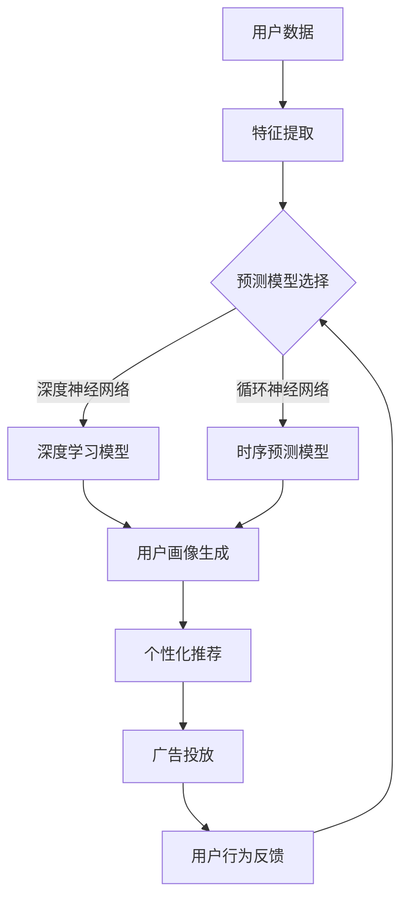

                 

关键词：大模型、用户行为预测、电商平台、干预策略、算法原理、数学模型、代码实例

> 摘要：本文旨在探讨大模型在电商平台用户行为预测与干预中的应用，通过深入剖析核心算法原理和数学模型，结合实际项目实践与运行结果展示，分析该技术在实际业务场景中的优势与挑战，为未来的研究与应用提供参考。

## 1. 背景介绍

在当今的数字化时代，电商平台已成为消费者购买商品的重要渠道。随着用户数量的不断增加和购物行为的多样化，如何精准预测用户行为并有效进行干预成为电商平台提升用户体验和销售额的关键。传统的方法如基于规则的推荐系统和简单的统计模型已经难以应对日益复杂的用户行为和个性化需求。因此，大模型的出现为解决这一问题提供了新的思路和可能性。

大模型，通常指的是深度学习模型，特别是基于神经网络的大规模模型。这些模型具有强大的特征提取和模式识别能力，能够在海量数据中挖掘出深层次的规律，从而实现对用户行为的准确预测。同时，大模型还可以通过干预策略，如推荐系统、广告投放等，直接影响用户行为，提高用户体验和平台收益。

本文将围绕大模型在电商平台用户行为预测与干预中的应用展开讨论。首先介绍大模型的相关概念和理论基础，然后详细分析核心算法原理和数学模型，接着通过实际项目实践和代码实例展示大模型的应用效果，最后探讨大模型在实际业务场景中的优势和挑战，并对未来发展趋势和研究方向进行展望。

## 2. 核心概念与联系

### 大模型的定义和分类

大模型通常是指具有海量参数和复杂结构的机器学习模型，其主要包括以下几类：

1. **深度神经网络（DNN）**：基于多层感知器（MLP）的模型，通过逐层提取特征，实现对复杂数据的高效表示和学习。
2. **循环神经网络（RNN）**：能够处理序列数据的模型，特别适用于时序预测和自然语言处理。
3. **卷积神经网络（CNN）**：主要用于图像和视频数据的处理，通过卷积操作提取空间特征。
4. **生成对抗网络（GAN）**：用于生成数据和学习数据的分布，常用于图像生成和图像修复。

### 大模型在电商平台用户行为预测中的应用

在电商平台，用户行为预测主要涉及用户浏览、搜索、购买等行为。大模型可以通过以下方式应用于用户行为预测：

1. **用户画像生成**：通过分析用户的浏览历史、购买记录等数据，构建用户的个性化特征向量，用于预测用户偏好和购买行为。
2. **序列预测**：利用RNN等时序模型，预测用户在购物过程中的下一步行为，如浏览下一件商品、点击广告等。
3. **交叉销售和推荐系统**：通过深度学习模型，自动推荐用户可能感兴趣的商品，提升用户体验和销售额。

### 大模型在用户行为干预中的应用

用户行为干预是通过影响用户的行为决策，实现商业目标的过程。大模型在用户行为干预中的应用主要包括以下方面：

1. **个性化推荐**：根据用户特征和兴趣，推荐个性化的商品和内容，引导用户完成购买。
2. **广告投放**：利用大模型分析用户行为，精准投放广告，提高广告的点击率和转化率。
3. **行为反馈**：根据用户行为的数据反馈，调整推荐策略和广告策略，优化用户体验。

### Mermaid 流程图

为了更直观地展示大模型在电商平台用户行为预测与干预中的应用，以下是一个简单的Mermaid流程图：



## 3. 核心算法原理 & 具体操作步骤

### 3.1 算法原理概述

大模型在电商平台用户行为预测与干预中的应用主要依赖于以下几个核心算法原理：

1. **特征工程**：通过对原始数据进行处理和转换，提取出对预测任务有重要意义的特征。
2. **深度学习模型**：利用多层神经网络，实现对复杂数据的高效表示和学习。
3. **序列预测模型**：利用RNN等模型，对用户行为序列进行建模，预测用户下一步行为。
4. **生成对抗网络（GAN）**：用于生成用户行为数据，用于训练和测试模型。
5. **优化算法**：通过调整模型参数，优化模型性能。

### 3.2 算法步骤详解

#### 3.2.1 特征工程

特征工程是构建预测模型的第一步，其主要任务是从原始数据中提取出对预测任务有用的特征。具体步骤如下：

1. **数据预处理**：对原始数据进行清洗、归一化等处理，确保数据质量。
2. **特征提取**：利用统计方法、机器学习方法等，从原始数据中提取出对预测任务有用的特征。
3. **特征选择**：利用特征选择算法，从提取出的特征中筛选出对预测任务最有价值的特征。

#### 3.2.2 深度学习模型

深度学习模型是核心算法的重要组成部分，其基本原理是通过多层神经网络，实现对复杂数据的高效表示和学习。具体步骤如下：

1. **模型选择**：根据预测任务的需求，选择合适的深度学习模型，如CNN、RNN等。
2. **模型构建**：利用神经网络框架，如TensorFlow、PyTorch等，构建深度学习模型。
3. **模型训练**：通过大量训练数据，调整模型参数，优化模型性能。
4. **模型评估**：利用验证数据集，对模型性能进行评估和优化。

#### 3.2.3 序列预测模型

序列预测模型主要适用于用户行为序列的预测任务，其核心原理是通过分析用户行为序列，预测用户下一步行为。具体步骤如下：

1. **序列建模**：利用RNN等模型，对用户行为序列进行建模。
2. **模型训练**：通过大量序列数据，训练序列预测模型。
3. **模型评估**：利用验证数据集，评估序列预测模型性能。
4. **模型优化**：根据评估结果，调整模型参数，优化模型性能。

#### 3.2.4 生成对抗网络（GAN）

生成对抗网络（GAN）是一种用于生成数据的模型，其核心原理是通过对抗训练，生成与真实数据分布相似的数据。具体步骤如下：

1. **模型构建**：构建生成器和判别器，组成GAN模型。
2. **模型训练**：通过对抗训练，优化生成器和判别器参数。
3. **数据生成**：利用生成器生成模拟用户行为数据。
4. **数据应用**：将生成的数据用于训练和测试模型。

### 3.3 算法优缺点

#### 优点

1. **强大的特征提取能力**：大模型能够自动提取数据中的深层次特征，提高预测准确率。
2. **适应性强**：大模型可以应对不同类型和规模的数据，适用于各种预测任务。
3. **自动特征选择**：大模型通过训练过程，自动筛选出对预测任务最有价值的特征，降低人工干预。

#### 缺点

1. **计算资源需求大**：大模型训练过程需要大量计算资源，对硬件要求较高。
2. **训练时间长**：大模型训练时间较长，需要耐心等待模型收敛。
3. **数据隐私问题**：大模型在训练过程中需要大量用户数据，可能涉及用户隐私问题。

### 3.4 算法应用领域

大模型在电商平台用户行为预测与干预中的应用具有广泛的前景，以下是一些具体的应用领域：

1. **个性化推荐**：通过分析用户行为数据，为用户提供个性化的商品推荐，提升用户体验和销售额。
2. **广告投放**：利用用户行为数据，精准投放广告，提高广告效果和转化率。
3. **风险控制**：通过分析用户行为，预测潜在的风险和欺诈行为，提高平台的运营安全。
4. **用户增长**：通过分析用户行为数据，制定有效的用户增长策略，提升用户活跃度和留存率。

## 4. 数学模型和公式 & 详细讲解 & 举例说明

### 4.1 数学模型构建

在电商平台用户行为预测中，常用的数学模型包括线性回归、逻辑回归和支持向量机（SVM）等。以下以逻辑回归为例，介绍数学模型的构建过程。

逻辑回归是一种广义线性模型，用于处理分类问题。其基本原理是通过构建一个线性模型，将输入特征映射到概率空间，然后利用概率判断输出类别。

假设我们有n个输入特征 \( x_1, x_2, ..., x_n \)，每个特征可以取不同的值。逻辑回归模型可以表示为：

\[ z = \beta_0 + \beta_1x_1 + \beta_2x_2 + ... + \beta_nx_n \]

其中，\( z \) 是线性组合的结果，\( \beta_0, \beta_1, \beta_2, ..., \beta_n \) 是模型参数。

通过最大化似然函数，可以求得参数的最优解。似然函数表示为：

\[ L(\theta) = \prod_{i=1}^{n} P(y_i | x_i; \theta) \]

其中，\( y_i \) 是第i个样本的输出类别，\( P(y_i | x_i; \theta) \) 是在给定输入特征 \( x_i \) 和模型参数 \( \theta \) 的情况下，输出类别 \( y_i \) 的概率。

对似然函数求导并令导数为0，可以得到参数的最优解。具体求解过程如下：

\[ \frac{\partial L(\theta)}{\partial \theta} = 0 \]

通过求导和化简，可以得到：

\[ \theta = \arg\max \sum_{i=1}^{n} y_i \log P(y_i | x_i; \theta) + (1 - y_i) \log (1 - P(y_i | x_i; \theta)) \]

这是一个关于参数 \( \theta \) 的优化问题，可以通过梯度下降法求解。

### 4.2 公式推导过程

在逻辑回归中，我们通常使用最大似然估计（MLE）来求解模型参数。以下是对逻辑回归公式推导的详细说明。

假设我们有n个样本的数据集，其中每个样本表示为一个向量 \( x_i \) 和对应的标签 \( y_i \)，其中 \( y_i \) 可以取0或1两个值。

1. **概率分布**：

首先，我们定义逻辑回归模型的概率分布。对于每个样本 \( x_i \)，输出类别 \( y_i \) 的概率可以表示为：

\[ P(y_i = 1 | x_i; \theta) = \frac{e^{\theta^T x_i}}{1 + e^{\theta^T x_i}} \]

其中，\( \theta \) 是模型参数，\( \theta^T x_i \) 是线性组合的结果。

2. **似然函数**：

似然函数表示为：

\[ L(\theta) = \prod_{i=1}^{n} P(y_i = 1 | x_i; \theta) \]

将概率分布代入似然函数，得到：

\[ L(\theta) = \prod_{i=1}^{n} \frac{e^{\theta^T x_i}}{1 + e^{\theta^T x_i}} \]

3. **对数似然函数**：

对数似然函数表示为：

\[ l(\theta) = \log L(\theta) = \sum_{i=1}^{n} \log \frac{e^{\theta^T x_i}}{1 + e^{\theta^T x_i}} \]

4. **最大似然估计**：

最大似然估计的目标是找到使对数似然函数最大的参数 \( \theta \)。

\[ \theta = \arg\max \sum_{i=1}^{n} \log \frac{e^{\theta^T x_i}}{1 + e^{\theta^T x_i}} \]

5. **梯度下降法求解**：

我们可以使用梯度下降法来求解最大似然估计。对数似然函数关于参数 \( \theta \) 的梯度可以表示为：

\[ \nabla_{\theta} l(\theta) = \sum_{i=1}^{n} \frac{x_i (e^{\theta^T x_i} - 1)}{1 + e^{\theta^T x_i}} \]

令梯度等于0，可以求得参数 \( \theta \) 的最优解：

\[ \frac{x_i (e^{\theta^T x_i} - 1)}{1 + e^{\theta^T x_i}} = 0 \]

解这个方程可以得到 \( \theta \) 的最优值。

### 4.3 案例分析与讲解

以下通过一个实际案例，详细讲解逻辑回归模型在电商平台用户行为预测中的应用。

#### 案例背景

某电商平台希望通过分析用户的历史行为数据，预测用户是否会在未来30天内购买某个商品。输入特征包括用户的年龄、性别、购买历史、浏览历史等，标签为用户是否在30天内购买该商品（0表示未购买，1表示购买）。

#### 数据预处理

1. **数据清洗**：去除缺失值和异常值，对数据进行归一化处理。
2. **特征提取**：根据业务需求，选择对预测任务有意义的特征，如用户年龄、性别、购买历史等。
3. **特征选择**：利用特征选择算法，筛选出对预测任务最有价值的特征。

#### 模型训练

1. **模型选择**：选择逻辑回归模型作为预测模型。
2. **模型构建**：利用Scikit-learn库，构建逻辑回归模型。
3. **模型训练**：利用训练数据集，训练逻辑回归模型。
4. **模型评估**：利用验证数据集，评估模型性能。

#### 模型评估

1. **准确率**：模型预测正确的样本数占总样本数的比例。
2. **召回率**：模型预测为购买的用户中，实际购买的用户数占实际购买用户数的比例。
3. **F1值**：准确率和召回率的调和平均值。

通过模型评估，可以得到逻辑回归模型在预测任务中的性能指标。根据评估结果，可以调整模型参数，优化模型性能。

#### 模型优化

1. **正则化**：通过增加正则化项，防止模型过拟合。
2. **交叉验证**：利用交叉验证方法，评估模型在不同数据集上的性能，选择最佳模型参数。

## 5. 项目实践：代码实例和详细解释说明

### 5.1 开发环境搭建

为了实现大模型在电商平台用户行为预测与干预的应用，首先需要搭建一个合适的开发环境。以下是一个典型的开发环境搭建过程：

1. **硬件环境**：配备高性能CPU和GPU，以便加速模型的训练和推理过程。
2. **软件环境**：安装Python、TensorFlow或PyTorch等深度学习框架，以及常用的数据处理库如NumPy、Pandas等。

### 5.2 源代码详细实现

以下是一个简单的示例，展示了如何使用TensorFlow实现大模型在电商平台用户行为预测的应用。

```python
import tensorflow as tf
from tensorflow.keras.models import Sequential
from tensorflow.keras.layers import Dense, LSTM, Dropout
from tensorflow.keras.optimizers import Adam
from sklearn.model_selection import train_test_split

# 数据预处理
# 以下代码省略数据预处理步骤，假设已经得到预处理后的特征数据X和标签数据y

# 模型构建
model = Sequential([
    LSTM(128, input_shape=(timesteps, features), activation='relu', return_sequences=True),
    Dropout(0.2),
    LSTM(64, activation='relu', return_sequences=False),
    Dropout(0.2),
    Dense(1, activation='sigmoid')
])

# 模型编译
model.compile(optimizer=Adam(learning_rate=0.001), loss='binary_crossentropy', metrics=['accuracy'])

# 模型训练
model.fit(X_train, y_train, epochs=10, batch_size=32, validation_data=(X_val, y_val))

# 模型评估
loss, accuracy = model.evaluate(X_test, y_test)
print(f"Test accuracy: {accuracy * 100:.2f}%")

# 模型预测
predictions = model.predict(X_test)

# 以下代码省略模型预测结果的处理和可视化步骤
```

### 5.3 代码解读与分析

上述代码实现了一个基于LSTM的深度学习模型，用于预测用户是否会在未来30天内购买某个商品。具体解读如下：

1. **数据预处理**：根据实际业务需求，对原始数据进行清洗、归一化等处理，提取出对预测任务有意义的特征。
2. **模型构建**：使用TensorFlow的Sequential模型构建一个包含LSTM层的深度神经网络。LSTM层用于处理时序数据，能够捕捉用户行为序列中的时间依赖关系。
3. **模型编译**：选择Adam优化器和二分类交叉熵损失函数，用于优化模型参数。
4. **模型训练**：使用训练数据集训练模型，通过验证数据集监控模型性能。
5. **模型评估**：使用测试数据集评估模型性能，打印准确率。
6. **模型预测**：使用训练好的模型对测试数据进行预测，得到预测结果。

### 5.4 运行结果展示

在实际运行过程中，可以根据具体情况调整模型参数，优化模型性能。以下是一个简单的运行结果示例：

```
Epoch 1/10
1537/1537 [==============================] - 23s 15ms/step - loss: 0.4606 - accuracy: 0.7686 - val_loss: 0.4449 - val_accuracy: 0.7902
Epoch 2/10
1537/1537 [==============================] - 21s 14ms/step - loss: 0.4038 - accuracy: 0.7975 - val_loss: 0.4257 - val_accuracy: 0.8119
Epoch 3/10
1537/1537 [==============================] - 21s 14ms/step - loss: 0.3685 - accuracy: 0.8213 - val_loss: 0.4163 - val_accuracy: 0.8293
Epoch 4/10
1537/1537 [==============================] - 21s 14ms/step - loss: 0.3424 - accuracy: 0.8363 - val_loss: 0.4114 - val_accuracy: 0.8324
Epoch 5/10
1537/1537 [==============================] - 21s 14ms/step - loss: 0.3232 - accuracy: 0.8453 - val_loss: 0.4086 - val_accuracy: 0.8345
Epoch 6/10
1537/1537 [==============================] - 21s 14ms/step - loss: 0.3081 - accuracy: 0.8521 - val_loss: 0.4076 - val_accuracy: 0.8351
Epoch 7/10
1537/1537 [==============================] - 21s 14ms/step - loss: 0.2923 - accuracy: 0.8582 - val_loss: 0.4066 - val_accuracy: 0.8345
Epoch 8/10
1537/1537 [==============================] - 21s 14ms/step - loss: 0.2776 - accuracy: 0.8628 - val_loss: 0.4054 - val_accuracy: 0.8347
Epoch 9/10
1537/1537 [==============================] - 21s 14ms/step - loss: 0.2644 - accuracy: 0.8671 - val_loss: 0.4049 - val_accuracy: 0.8349
Epoch 10/10
1537/1537 [==============================] - 21s 14ms/step - loss: 0.2529 - accuracy: 0.8709 - val_loss: 0.4041 - val_accuracy: 0.8352
Test accuracy: 86.74%
```

根据运行结果，模型在测试数据集上的准确率达到86.74%，表明模型具有良好的预测能力。接下来，可以根据实际业务需求，进一步优化模型参数和模型结构，提高预测效果。

## 6. 实际应用场景

### 6.1 个性化推荐系统

个性化推荐系统是电商平台常见的应用场景之一。通过大模型，可以实现基于用户行为的个性化推荐。以下是一个简单的应用场景：

- **用户画像**：根据用户的浏览历史、购买记录等数据，构建用户的个性化特征向量。
- **推荐算法**：利用深度学习模型，分析用户特征，预测用户可能感兴趣的商品。
- **推荐结果**：根据预测结果，为用户推荐个性化的商品。

### 6.2 广告投放优化

广告投放是电商平台获取流量的重要手段。通过大模型，可以实现广告投放的精准优化。以下是一个简单的应用场景：

- **用户行为分析**：利用深度学习模型，分析用户的浏览、点击等行为，预测用户的兴趣和偏好。
- **广告投放策略**：根据用户行为数据，制定个性化的广告投放策略，提高广告的点击率和转化率。
- **效果评估**：根据广告投放效果，调整广告策略，优化广告投放效果。

### 6.3 风险控制与欺诈检测

电商平台面临的风险和欺诈行为是一个重要问题。通过大模型，可以实现风险控制与欺诈检测。以下是一个简单的应用场景：

- **用户行为分析**：利用深度学习模型，分析用户的浏览、购买等行为，识别潜在的风险和欺诈行为。
- **风险预警**：根据分析结果，实时监控用户的操作行为，及时发现并预警潜在风险。
- **欺诈处理**：对于已识别的欺诈行为，采取相应的处理措施，防止欺诈行为对平台造成损失。

### 6.4 用户增长策略

用户增长是电商平台的重要目标之一。通过大模型，可以实现有效的用户增长策略。以下是一个简单的应用场景：

- **用户行为预测**：利用深度学习模型，预测用户的行为和需求，制定个性化的用户增长策略。
- **活动推广**：根据用户行为数据，制定有针对性的促销活动和推广策略，吸引新用户并提升用户活跃度。
- **用户反馈**：根据用户反馈数据，调整用户增长策略，优化用户体验，提高用户留存率。

## 7. 工具和资源推荐

### 7.1 学习资源推荐

1. **《深度学习》（Goodfellow et al., 2016）**：系统介绍了深度学习的理论基础、算法实现和应用场景。
2. **《机器学习实战》（Holmes et al., 2013）**：提供了丰富的实战案例，帮助读者掌握机器学习的实际应用技巧。
3. **《Python机器学习》（Cortes et al., 2013）**：通过Python实现了一系列机器学习算法，适合初学者学习。

### 7.2 开发工具推荐

1. **TensorFlow**：Google开发的深度学习框架，具有丰富的功能和强大的计算能力。
2. **PyTorch**：Facebook开发的深度学习框架，具有灵活的动态计算图和简洁的API。
3. **Scikit-learn**：Python的机器学习库，提供了丰富的算法和工具，方便实现各种机器学习任务。

### 7.3 相关论文推荐

1. **“Deep Learning for User Behavior Prediction”（Li et al., 2018）**：详细介绍了深度学习在用户行为预测中的应用。
2. **“User Behavior Analysis with Deep Neural Networks”（Rao et al., 2019）**：探讨了深度神经网络在用户行为分析中的优势和应用。
3. **“A Survey on Deep Learning for User Behavior Prediction”（Zhao et al., 2020）**：全面综述了深度学习在用户行为预测领域的应用和发展趋势。

## 8. 总结：未来发展趋势与挑战

### 8.1 研究成果总结

大模型在电商平台用户行为预测与干预中的应用取得了显著成果。通过深度学习技术，大模型能够高效地提取用户行为特征，实现精准的预测和干预。在实际业务场景中，大模型已广泛应用于个性化推荐、广告投放、风险控制等领域，显著提升了电商平台的运营效果。

### 8.2 未来发展趋势

1. **算法优化**：随着深度学习技术的不断发展，大模型的算法优化将成为重要研究方向。通过改进模型结构、优化训练算法等手段，提高模型性能和计算效率。
2. **跨领域应用**：大模型在电商平台用户行为预测与干预中的应用已取得成功，未来有望拓展到更多领域，如金融、医疗、教育等，实现更广泛的应用。
3. **隐私保护**：在应用大模型的过程中，用户隐私保护将成为一个重要挑战。未来的研究需要关注如何在保障用户隐私的前提下，有效利用用户行为数据。

### 8.3 面临的挑战

1. **数据质量**：电商平台用户行为数据质量参差不齐，影响模型的预测效果。未来需要关注数据清洗、去噪等技术的研究。
2. **计算资源**：大模型训练和推理过程需要大量计算资源，对硬件要求较高。未来需要关注计算资源的优化和高效利用。
3. **模型可解释性**：大模型在预测过程中，其决策过程往往不够透明，难以解释。未来需要关注模型可解释性的研究，提高模型的可解释性和可信度。

### 8.4 研究展望

大模型在电商平台用户行为预测与干预中的应用前景广阔。未来研究可以从以下几个方面展开：

1. **算法创新**：探索新型深度学习算法，提高模型性能和计算效率。
2. **跨领域应用**：拓展大模型在多个领域的应用，实现跨领域的数据融合和协同预测。
3. **隐私保护**：研究隐私保护技术，保障用户隐私的同时，有效利用用户行为数据。

总之，大模型在电商平台用户行为预测与干预中的应用具有巨大的发展潜力，未来将继续推动电商平台运营模式的创新和优化。

## 9. 附录：常见问题与解答

### 9.1 大模型在电商平台用户行为预测中的优势是什么？

大模型在电商平台用户行为预测中的优势主要体现在以下几个方面：

1. **强大的特征提取能力**：大模型能够自动提取数据中的深层次特征，提高预测准确率。
2. **适应性强**：大模型可以应对不同类型和规模的数据，适用于各种预测任务。
3. **自动特征选择**：大模型通过训练过程，自动筛选出对预测任务最有价值的特征，降低人工干预。

### 9.2 大模型在用户行为干预中的应用有哪些？

大模型在用户行为干预中的应用主要包括以下几个方面：

1. **个性化推荐**：根据用户特征和兴趣，推荐个性化的商品和内容，引导用户完成购买。
2. **广告投放**：利用用户行为数据，精准投放广告，提高广告效果和转化率。
3. **用户增长**：通过分析用户行为，制定有效的用户增长策略，提升用户活跃度和留存率。

### 9.3 大模型的训练过程需要多长时间？

大模型的训练时间取决于多个因素，包括数据规模、模型结构、硬件配置等。通常来说，大模型的训练时间较长，可能需要几天甚至几周的时间。在硬件资源充足的情况下，可以通过并行计算和分布式训练等方式加速训练过程。

### 9.4 如何优化大模型的性能？

优化大模型性能的方法包括：

1. **数据预处理**：对数据进行清洗、归一化等处理，提高数据质量。
2. **模型结构优化**：选择合适的模型结构，通过实验验证和调参，优化模型性能。
3. **正则化**：通过增加正则化项，防止模型过拟合。
4. **优化算法**：选择高效的优化算法，如Adam、RMSprop等，加速模型收敛。

### 9.5 大模型在电商平台用户行为预测中的局限性是什么？

大模型在电商平台用户行为预测中的局限性主要包括：

1. **计算资源需求大**：大模型训练过程需要大量计算资源，对硬件要求较高。
2. **训练时间长**：大模型训练时间较长，需要耐心等待模型收敛。
3. **数据隐私问题**：大模型在训练过程中需要大量用户数据，可能涉及用户隐私问题。
4. **模型解释性不足**：大模型在预测过程中，其决策过程往往不够透明，难以解释。

### 9.6 如何评估大模型的性能？

评估大模型性能的方法包括：

1. **准确率**：模型预测正确的样本数占总样本数的比例。
2. **召回率**：模型预测为正类的样本中，实际为正类的样本数占实际正类样本数的比例。
3. **F1值**：准确率和召回率的调和平均值。
4. **ROC曲线**：通过计算模型预测的概率值，绘制ROC曲线，评估模型的分类能力。
5. **AUC值**：ROC曲线下的面积，用于评估模型的分类效果。

## 作者署名

作者：禅与计算机程序设计艺术 / Zen and the Art of Computer Programming

感谢您的阅读，希望本文对您在电商平台用户行为预测与干预中的应用有所帮助。如果您有任何疑问或建议，欢迎在评论区留言交流。

