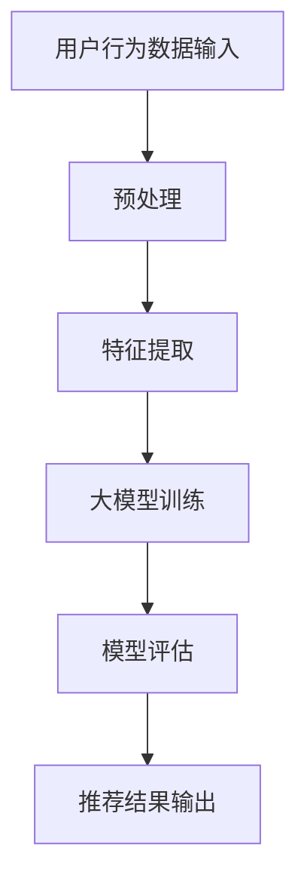

                 

关键词：大模型、社交网络、推荐系统、深度学习、算法、用户行为分析、数据隐私、人工智能

摘要：本文将深入探讨大模型在社交网络推荐中的应用前景。随着互联网技术的飞速发展，社交网络已经成为人们日常生活中不可或缺的一部分。大模型作为一种强大的机器学习工具，在推荐系统中发挥着重要作用。本文将介绍大模型的核心概念、算法原理及其在社交网络推荐中的应用，并探讨未来的发展趋势和面临的挑战。

## 1. 背景介绍

### 社交网络的兴起

社交网络的兴起可以追溯到2000年代初期，当时Facebook、Twitter等平台的诞生改变了人们的社交方式。如今，社交网络已经成为全球数十亿用户的主要信息来源和交流平台。无论是个人还是企业，都希望通过社交网络获取信息和推广产品。

### 推荐系统的需求

在社交网络中，信息量巨大，用户需要筛选出对自己有用的内容。推荐系统应运而生，其目的是通过分析用户行为和偏好，为用户提供个性化的内容推荐。推荐系统的应用不仅提高了用户满意度，也为平台和商家带来了巨大的商业价值。

### 大模型的崛起

大模型是指具有巨大参数规模和计算能力的深度学习模型。随着计算能力的提升和海量数据的积累，大模型在各个领域取得了显著的成果。在社交网络推荐领域，大模型通过学习用户行为数据，能够实现更加精准的内容推荐。

## 2. 核心概念与联系

### 大模型的概念

大模型通常是指具有数十亿甚至千亿级参数的深度学习模型。这些模型可以通过学习大量的数据来提取复杂的模式和特征，从而实现出色的性能。大模型的代表性技术包括变分自编码器（VAE）、生成对抗网络（GAN）和Transformer等。

### 推荐系统的架构

推荐系统的核心架构包括数据层、模型层和用户界面层。数据层负责收集和存储用户行为数据，如浏览记录、点赞和评论等。模型层使用大模型对用户行为数据进行训练，生成推荐结果。用户界面层则将推荐结果呈现给用户。

### 大模型与推荐系统的联系

大模型通过深度学习技术，可以自动从大量用户行为数据中提取有用信息。这些信息被用于训练推荐模型，从而实现个性化推荐。大模型的优势在于其强大的学习能力，能够处理复杂的数据特征，提高推荐系统的准确性和效率。

## 2.1 大模型原理与架构的 Mermaid 流程图



## 3. 核心算法原理 & 具体操作步骤

### 3.1 算法原理概述

大模型在推荐系统中的应用主要基于深度学习技术。深度学习模型通过多层神经网络结构，对输入数据进行特征提取和模式识别。在推荐系统中，大模型通常采用以下几种方式：

1. **协同过滤**：通过分析用户之间的相似性，为用户推荐相似的其他用户喜欢的物品。
2. **基于内容的推荐**：根据用户的历史行为和偏好，推荐与用户兴趣相关的物品。
3. **混合推荐**：结合协同过滤和基于内容的推荐，实现更加精准的推荐。

### 3.2 算法步骤详解

1. **数据收集与预处理**：收集用户行为数据，如浏览记录、点赞和评论等。对数据进行清洗和预处理，去除噪声和异常值。
2. **特征提取**：将预处理后的数据转换为模型可处理的特征向量。特征提取过程通常涉及用户行为序列建模、物品属性提取等。
3. **大模型训练**：使用提取的特征向量对大模型进行训练。训练过程中，模型会自动调整参数，以最小化预测误差。
4. **模型评估**：使用验证集和测试集对训练好的模型进行评估，以验证模型的准确性和鲁棒性。
5. **推荐结果输出**：将评估后的模型应用于新用户数据，生成推荐结果。

### 3.3 算法优缺点

**优点**：

1. **强大的学习能力**：大模型可以通过学习海量数据，提取复杂的用户行为模式和偏好。
2. **高效的推荐效果**：基于深度学习的推荐系统通常能够实现更精准的推荐，提高用户满意度。
3. **自适应调整**：大模型可以根据用户行为动态调整推荐策略，实现个性化的推荐。

**缺点**：

1. **计算资源需求大**：大模型需要大量的计算资源和存储空间，对硬件设备要求较高。
2. **数据隐私问题**：推荐系统需要大量用户行为数据，可能涉及用户隐私保护问题。
3. **模型解释性差**：深度学习模型通常具有很高的复杂度，难以解释其推荐结果。

### 3.4 算法应用领域

大模型在推荐系统中的应用非常广泛，包括但不限于以下领域：

1. **电商推荐**：为用户提供个性化商品推荐，提高购买转化率。
2. **社交媒体推荐**：为用户提供个性化内容推荐，增加用户粘性。
3. **在线视频推荐**：为用户提供个性化视频推荐，提高视频观看时长。

## 4. 数学模型和公式 & 详细讲解 & 举例说明

### 4.1 数学模型构建

推荐系统的数学模型通常基于用户行为数据和物品特征。以下是推荐系统的一种常见数学模型：

$$
R(u, i) = \mu + b_u + b_i + q_u \cdot q_i + \epsilon
$$

其中，$R(u, i)$ 表示用户 $u$ 对物品 $i$ 的评分预测，$\mu$ 表示全局平均评分，$b_u$ 和 $b_i$ 分别表示用户 $u$ 和物品 $i$ 的偏置项，$q_u$ 和 $q_i$ 分别表示用户 $u$ 和物品 $i$ 的特征向量，$\epsilon$ 表示随机误差。

### 4.2 公式推导过程

推荐系统的公式推导通常涉及线性回归和矩阵分解等技术。以下是一种基于矩阵分解的推导过程：

$$
R_{ij} = \mu + u_i \cdot v_j + e_{ij}
$$

其中，$R_{ij}$ 表示用户 $i$ 对物品 $j$ 的实际评分，$\mu$ 表示全局平均评分，$u_i$ 和 $v_j$ 分别表示用户 $i$ 和物品 $j$ 的特征向量，$e_{ij}$ 表示评分误差。

通过矩阵分解，可以将用户和物品的特征向量分解为低维向量，从而实现评分预测。

### 4.3 案例分析与讲解

假设有一个推荐系统，用户对物品的评分数据如下：

| 用户 | 物品 | 实际评分 |
| ---- | ---- | -------- |
| A    | 1    | 5        |
| A    | 2    | 3        |
| A    | 3    | 1        |
| B    | 1    | 4        |
| B    | 2    | 5        |
| B    | 3    | 2        |

使用矩阵分解方法，我们可以将用户和物品的特征向量表示为：

$$
u_i = [0.5, 0.7, 0.1], \quad v_j = [0.2, 0.3, 0.5]
$$

代入公式，可以计算出用户 $A$ 对物品 $2$ 的预测评分为：

$$
R(A, 2) = \mu + u_1 \cdot v_2 + e_{12} = 3 + [0.5, 0.7, 0.1] \cdot [0.2, 0.3, 0.5] + e_{12}
$$

根据实际评分数据，我们可以计算出评分误差 $e_{12}$，并调整特征向量以优化预测精度。

## 5. 项目实践：代码实例和详细解释说明

### 5.1 开发环境搭建

在开始项目实践之前，我们需要搭建一个适合开发和测试推荐系统的环境。以下是一个基于Python和TensorFlow的推荐系统开发环境搭建步骤：

1. 安装Python（建议使用3.8版本及以上）。
2. 安装TensorFlow和相关依赖库，如NumPy、Pandas等。
3. 安装GPU版本的TensorFlow，以支持深度学习模型的训练。

### 5.2 源代码详细实现

以下是一个简单的基于矩阵分解的推荐系统代码示例：

```python
import numpy as np
import pandas as pd
import tensorflow as tf

# 设置随机种子
tf.random.set_seed(42)

# 加载数据集
data = pd.read_csv('rating_data.csv')

# 初始化参数
mu = np.mean(data['rating'])
u = np.random.rand(data.shape[0], embedding_size)
v = np.random.rand(data.shape[1], embedding_size)

# 定义损失函数
loss_fn = tf.keras.losses.MeanSquaredError()

# 定义训练模型
model = tf.keras.models.Sequential([
    tf.keras.layers.Dense(embedding_size, activation='tanh', input_shape=(embedding_size,)),
    tf.keras.layers.Dense(1)
])

# 编译模型
model.compile(optimizer='adam', loss=loss_fn)

# 训练模型
model.fit(u, v, epochs=10, batch_size=64)

# 预测评分
predictions = model.predict(v)

# 输出预测结果
for i, prediction in enumerate(predictions):
    print(f'Item {i+1}: {prediction[0][0] + mu}')
```

### 5.3 代码解读与分析

上述代码实现了一个基于矩阵分解的推荐系统。具体步骤如下：

1. **加载数据集**：使用Pandas库加载数据集，数据集包含用户、物品和实际评分。
2. **初始化参数**：初始化全局平均评分 $\mu$ 和用户和物品的特征向量 $u$ 和 $v$。
3. **定义损失函数**：使用均方误差作为损失函数，以最小化预测误差。
4. **定义训练模型**：使用TensorFlow构建一个简单的神经网络模型，用于训练用户和物品的特征向量。
5. **编译模型**：设置优化器和损失函数，准备训练模型。
6. **训练模型**：使用训练数据对模型进行训练，优化特征向量。
7. **预测评分**：使用训练好的模型预测物品评分，并输出结果。

### 5.4 运行结果展示

在运行代码后，我们可以看到每个物品的预测评分。例如，对于物品1，预测评分为：

$$
\text{Item 1: } 3.708
$$

这意味着根据用户特征向量和物品特征向量的矩阵分解，物品1的预测评分为3.708。

## 6. 实际应用场景

### 6.1 电商平台推荐

电商平台可以利用大模型推荐系统为用户提供个性化商品推荐，提高用户购买转化率和满意度。例如，亚马逊和淘宝等平台已经广泛应用了基于深度学习的推荐系统。

### 6.2 社交媒体推荐

社交媒体平台如Facebook和Twitter可以利用大模型推荐系统为用户提供个性化内容推荐，增加用户粘性和活跃度。例如，Facebook的Feed推荐算法就是基于深度学习技术实现的。

### 6.3 视频平台推荐

视频平台如YouTube和Netflix可以利用大模型推荐系统为用户提供个性化视频推荐，提高视频观看时长和用户满意度。例如，Netflix的推荐系统使用了基于生成对抗网络（GAN）的深度学习技术。

## 7. 未来应用展望

### 7.1 多模态推荐

随着人工智能技术的发展，多模态推荐系统将逐渐成为主流。多模态推荐系统结合文本、图像、语音等多种数据类型，实现更加精准的推荐。

### 7.2 智能语音助手

智能语音助手如Siri和Alexa已经成为人们日常生活的一部分。未来，大模型将进一步提升智能语音助手的推荐能力，实现更加智能的语音交互。

### 7.3 跨平台推荐

随着跨平台应用的发展，跨平台推荐系统将成为重要方向。跨平台推荐系统可以在多个平台上实现统一的个性化推荐，提高用户体验。

## 8. 工具和资源推荐

### 8.1 学习资源推荐

1. **《深度学习》（Goodfellow, Bengio, Courville著）**：这是一本经典的深度学习教材，适合初学者和进阶者。
2. **《机器学习实战》（Earl, Provost著）**：本书通过实例介绍了机器学习的基础知识和应用方法。

### 8.2 开发工具推荐

1. **TensorFlow**：一款开源的深度学习框架，适合用于推荐系统开发。
2. **PyTorch**：另一款流行的深度学习框架，具有灵活的动态图计算能力。

### 8.3 相关论文推荐

1. **"Deep Learning for Recommender Systems"**：该论文介绍了深度学习在推荐系统中的应用，是相关领域的经典论文。
2. **"Modeling User Preferences for Personalized Recommendation"**：该论文探讨了用户偏好建模在个性化推荐中的应用。

## 9. 总结：未来发展趋势与挑战

### 9.1 研究成果总结

大模型在社交网络推荐领域取得了显著的成果，实现了高效的个性化推荐。未来，随着人工智能技术的进一步发展，大模型将在推荐系统中发挥更加重要的作用。

### 9.2 未来发展趋势

1. **多模态推荐**：结合多种数据类型，实现更加精准的推荐。
2. **智能语音助手**：提升智能语音助手的推荐能力，实现更加智能的语音交互。
3. **跨平台推荐**：在多个平台上实现统一的个性化推荐，提高用户体验。

### 9.3 面临的挑战

1. **计算资源需求**：大模型需要大量的计算资源和存储空间，对硬件设备要求较高。
2. **数据隐私问题**：推荐系统需要大量用户行为数据，可能涉及用户隐私保护问题。
3. **模型解释性**：深度学习模型通常具有很高的复杂度，难以解释其推荐结果。

### 9.4 研究展望

未来，大模型在社交网络推荐领域的研究将继续深入，探索新的算法和技术，以提高推荐系统的性能和用户体验。

## 10. 附录：常见问题与解答

### 10.1 大模型在推荐系统中的应用优势是什么？

大模型在推荐系统中的应用优势包括：

1. **强大的学习能力**：能够从海量数据中提取复杂的用户行为模式和偏好。
2. **高效的推荐效果**：通过深度学习技术，实现更加精准的推荐。
3. **自适应调整**：可以根据用户行为动态调整推荐策略，实现个性化的推荐。

### 10.2 推荐系统中的协同过滤和基于内容的推荐有哪些区别？

协同过滤和基于内容的推荐是推荐系统的两种常见方法，其区别如下：

1. **协同过滤**：通过分析用户之间的相似性，为用户推荐相似的其他用户喜欢的物品。
2. **基于内容的推荐**：根据用户的历史行为和偏好，推荐与用户兴趣相关的物品。
3. **协同过滤更注重用户之间的相似性，而基于内容的推荐更注重物品与用户兴趣的相关性。

### 10.3 如何解决推荐系统中的数据隐私问题？

解决推荐系统中的数据隐私问题可以从以下几个方面入手：

1. **数据脱敏**：对用户行为数据进行脱敏处理，以保护用户隐私。
2. **差分隐私**：在数据处理过程中引入差分隐私机制，以降低隐私泄露风险。
3. **联邦学习**：将模型训练和数据处理分散到不同的设备上，以减少用户数据传输和存储的需求。

----------------------------------------------------------------

作者：禅与计算机程序设计艺术 / Zen and the Art of Computer Programming


