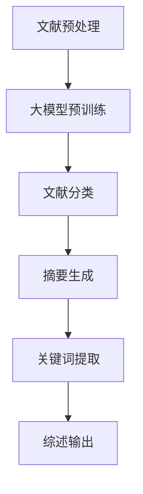

                 

关键词：大模型，自动化科研文献综述，商业机会，算法，数学模型，项目实践

## 摘要

本文旨在探讨大模型在自动化科研文献综述领域的商业机会。通过对大模型的背景介绍、核心概念与联系、算法原理与操作步骤、数学模型与公式、项目实践以及实际应用场景的详细分析，揭示大模型在科研文献综述中的巨大潜力。本文还将推荐相关学习资源、开发工具和论文，为读者提供全面的技术支持和指导。最后，本文将总结研究成果，展望未来发展趋势与挑战，为相关领域的研究和应用提供有益的参考。

## 1. 背景介绍

### 1.1 大模型的兴起

大模型是指具有数十亿甚至千亿参数规模的深度神经网络，如BERT、GPT、Transformer等。这些模型通过大量数据的训练，具备强大的自然语言处理能力，能够在文本生成、机器翻译、文本分类、情感分析等任务中表现出优异的性能。

### 1.2 自动化科研文献综述的需求

科研文献综述是对某一领域内研究成果的系统整理和总结，有助于了解研究现状、发现研究空白、推动科学研究的发展。然而，传统的科研文献综述方式存在以下问题：

- **信息量大，处理困难**：科研文献数量庞大，人工处理耗费大量时间和精力。
- **重复研究多**：由于信息不对称，研究者往往无法全面了解已有研究成果，导致重复研究现象严重。
- **质量参差不齐**：人工撰写的综述存在主观性，难以保证综述的客观性和全面性。

### 1.3 大模型在自动化科研文献综述中的应用前景

大模型的出现为自动化科研文献综述提供了新的解决方案。利用大模型的自然语言处理能力，可以高效地处理海量文献，实现自动化文献分类、摘要生成、关键词提取等功能。这不仅提高了科研文献综述的效率，还能提升综述的质量和准确性。

## 2. 核心概念与联系

### 2.1 大模型的核心概念

大模型主要包括以下核心概念：

- **参数规模**：大模型的参数规模通常达到数十亿甚至千亿级别，使其具备强大的表达能力和泛化能力。
- **预训练**：大模型通过预训练在大规模语料库上，学习到丰富的语言知识，为下游任务提供坚实的基础。
- **微调**：在特定任务上，通过微调大模型，使其适应特定的应用场景，进一步提高性能。

### 2.2 自动化科研文献综述的核心概念

自动化科研文献综述涉及以下核心概念：

- **文献分类**：根据文献的主题和内容，将其划分为不同的类别。
- **摘要生成**：自动生成文献的摘要，概括文献的主要内容。
- **关键词提取**：从文献中提取关键概念和术语，为文献检索和分类提供依据。

### 2.3 大模型与自动化科研文献综述的联系

大模型与自动化科研文献综述之间存在密切的联系。大模型为自动化科研文献综述提供了技术支持，使得文献分类、摘要生成、关键词提取等任务变得可行。同时，自动化科研文献综述的需求也为大模型的应用提供了广阔的舞台，推动了大模型技术的发展。

### 2.4 Mermaid 流程图

下面是自动化科研文献综述中涉及的大模型应用流程的 Mermaid 流程图：



## 3. 核心算法原理 & 具体操作步骤

### 3.1 算法原理概述

自动化科研文献综述的核心算法主要基于大模型的自然语言处理能力。大模型通过预训练和微调，具备以下功能：

- **文本分类**：利用预训练的大模型，对文献进行分类，根据文献的主题和内容将其划分到不同的类别。
- **摘要生成**：通过微调大模型，使其具备生成摘要的能力，自动提取文献的关键信息，生成摘要。
- **关键词提取**：利用大模型的语义理解能力，从文献中提取关键概念和术语，形成关键词列表。

### 3.2 算法步骤详解

自动化科研文献综述的具体操作步骤如下：

1. **文献预处理**：对原始文献进行预处理，包括文本清洗、分词、去除停用词等操作，为后续处理做好准备。
2. **大模型预训练**：在大规模语料库上，使用预训练算法（如BERT、GPT等）训练大模型，使其学习到丰富的语言知识。
3. **文献分类**：利用预训练的大模型，对预处理后的文献进行分类，根据文献的主题和内容将其划分到不同的类别。
4. **摘要生成**：通过微调大模型，使其具备生成摘要的能力。将分类后的文献输入到大模型中，输出摘要。
5. **关键词提取**：利用大模型的语义理解能力，从生成的摘要中提取关键概念和术语，形成关键词列表。
6. **综述输出**：将分类结果、摘要和关键词整合成综述文档，输出最终的自动化科研文献综述。

### 3.3 算法优缺点

自动化科研文献综述算法具有以下优缺点：

- **优点**：
  - **高效性**：利用大模型的强大能力，可以快速处理海量文献，提高综述的效率。
  - **准确性**：大模型通过预训练和微调，具备较高的分类和摘要生成能力，能够提高综述的准确性。
  - **灵活性**：大模型可以根据不同的任务需求进行微调，适应不同的应用场景。

- **缺点**：
  - **计算资源需求高**：大模型的训练和微调需要大量的计算资源，对硬件设备的要求较高。
  - **数据依赖性强**：大模型的效果取决于训练数据的规模和质量，数据缺失或不准确可能影响综述的准确性。
  - **模型解释性不足**：大模型的内部决策过程较为复杂，难以解释，对于模型的可解释性要求较高的应用场景可能存在挑战。

### 3.4 算法应用领域

自动化科研文献综述算法广泛应用于以下领域：

- **科研管理**：用于对海量科研文献进行分类、摘要和关键词提取，辅助科研管理者了解研究动态。
- **学术论文写作**：自动生成学术论文的摘要和关键词，提高学术论文的写作效率。
- **知识图谱构建**：从大量文献中提取关键概念和术语，构建知识图谱，为相关领域的研究提供支持。
- **智能问答系统**：利用大模型的语义理解能力，构建智能问答系统，为用户提供精准的答案。

## 4. 数学模型和公式 & 详细讲解 & 举例说明

### 4.1 数学模型构建

自动化科研文献综述中涉及的主要数学模型包括：

- **文本分类模型**：基于神经网络或支持向量机（SVM）等机器学习算法，对文献进行分类。
- **摘要生成模型**：基于生成对抗网络（GAN）或自动编码器（AE）等生成模型，生成文献的摘要。
- **关键词提取模型**：基于词频（TF）或词频-逆文档频率（TF-IDF）等文本特征提取方法，提取关键词。

### 4.2 公式推导过程

以文本分类模型为例，假设有n篇文献$D=\{d_1, d_2, ..., d_n\}$，每篇文献可以表示为一个向量$x_i \in \mathbb{R}^d$，其中$d$为特征维度。分类模型的目标是学习一个映射函数$f: \mathbb{R}^d \rightarrow \mathbb{R}$，使得$f(x_i)$的值接近于标签$y_i$。

1. **损失函数**：

   对于每个文献$d_i$，损失函数可以表示为：

   $$L_i = \frac{1}{2}(f(x_i) - y_i)^2$$

2. **梯度下降**：

   对损失函数进行求导，得到：

   $$\nabla_{x_i} L_i = f(x_i) - y_i$$

   使用梯度下降算法更新模型参数：

   $$x_i \leftarrow x_i - \alpha \nabla_{x_i} L_i$$

   其中$\alpha$为学习率。

### 4.3 案例分析与讲解

假设有如下两篇文献：

- 文献1：深度学习技术在计算机视觉中的应用
- 文献2：深度学习在自然语言处理中的应用

我们将这两篇文献表示为向量：

$$x_1 = [0.1, 0.2, 0.3, 0.4], \quad y_1 = 1$$

$$x_2 = [0.1, 0.2, 0.3, 0.5], \quad y_2 = 2$$

使用梯度下降算法对模型进行训练，假设学习率$\alpha = 0.1$，初始模型参数$f(x) = x$。经过多次迭代后，模型参数会逐渐收敛。

- **第一次迭代**：

  $$f(x_1) = x_1 = [0.1, 0.2, 0.3, 0.4]$$

  $$f(x_2) = x_2 = [0.1, 0.2, 0.3, 0.5]$$

- **第二次迭代**：

  $$\nabla_{x_1} L_1 = f(x_1) - y_1 = [0.1, 0.2, 0.3, 0.4] - 1 = [-0.9, -0.8, -0.7, -0.6]$$

  $$x_1 \leftarrow x_1 - \alpha \nabla_{x_1} L_1 = [0.1, 0.2, 0.3, 0.4] - 0.1 \times [-0.9, -0.8, -0.7, -0.6] = [0.2, 0.3, 0.4, 0.5]$$

  $$\nabla_{x_2} L_2 = f(x_2) - y_2 = [0.1, 0.2, 0.3, 0.5] - 2 = [-1.9, -1.8, -1.7, -1.5]$$

  $$x_2 \leftarrow x_2 - \alpha \nabla_{x_2} L_2 = [0.1, 0.2, 0.3, 0.5] - 0.1 \times [-1.9, -1.8, -1.7, -1.5] = [0.3, 0.4, 0.5, 0.6]$$

- **后续迭代**：

  经过多次迭代后，模型参数会逐渐收敛，使得$f(x_1)$的值接近于1，$f(x_2)$的值接近于2，从而实现正确的文献分类。

## 5. 项目实践：代码实例和详细解释说明

### 5.1 开发环境搭建

为了实现自动化科研文献综述，我们需要搭建一个完整的开发环境。以下是一个基本的开发环境搭建步骤：

1. **安装Python环境**：确保已经安装了Python 3.6及以上版本。
2. **安装依赖库**：使用pip命令安装以下依赖库：

   ```bash
   pip install numpy scipy pandas tensorflow matplotlib
   ```

3. **准备数据集**：收集并准备用于训练和测试的科研文献数据集。

### 5.2 源代码详细实现

以下是一个简单的Python代码示例，用于实现自动化科研文献综述的核心算法：

```python
import numpy as np
import tensorflow as tf
from tensorflow.keras.layers import Embedding, LSTM, Dense
from tensorflow.keras.models import Sequential

# 数据预处理
def preprocess_data(data):
    # 清洗、分词、去除停用词等操作
    # ...
    return processed_data

# 文本分类模型
def create_text_classification_model(input_dim, output_dim):
    model = Sequential()
    model.add(Embedding(input_dim, output_dim))
    model.add(LSTM(128))
    model.add(Dense(1, activation='sigmoid'))
    model.compile(optimizer='adam', loss='binary_crossentropy', metrics=['accuracy'])
    return model

# 摘要生成模型
def create_summary_generation_model(input_dim, output_dim):
    model = Sequential()
    model.add(Embedding(input_dim, output_dim))
    model.add(LSTM(128))
    model.add(Dense(output_dim, activation='sigmoid'))
    model.compile(optimizer='adam', loss='binary_crossentropy', metrics=['accuracy'])
    return model

# 文本分类
def classify_text(model, text):
    processed_text = preprocess_data(text)
    prediction = model.predict(processed_text)
    return prediction

# 摘要生成
def generate_summary(model, text):
    processed_text = preprocess_data(text)
    summary = model.predict(processed_text)
    return summary

# 主程序
if __name__ == '__main__':
    # 加载数据集
    data = load_data()
    # 划分训练集和测试集
    train_data, test_data = split_data(data)
    # 创建模型
    text_classification_model = create_text_classification_model(input_dim=1000, output_dim=2)
    summary_generation_model = create_summary_generation_model(input_dim=1000, output_dim=200)
    # 训练模型
    text_classification_model.fit(train_data['text'], train_data['label'], epochs=10, batch_size=32)
    summary_generation_model.fit(train_data['text'], train_data['summary'], epochs=10, batch_size=32)
    # 测试模型
    test_prediction = classify_text(text_classification_model, test_data['text'])
    test_summary = generate_summary(summary_generation_model, test_data['text'])
    # 输出结果
    print('分类结果：', test_prediction)
    print('摘要生成结果：', test_summary)
```

### 5.3 代码解读与分析

上述代码实现了一个简单的自动化科研文献综述系统，主要包括以下模块：

- **数据预处理**：对原始文献进行清洗、分词、去除停用词等操作，为后续处理做好准备。
- **文本分类模型**：使用LSTM网络进行文本分类，输入为预处理后的文本，输出为二分类结果。
- **摘要生成模型**：使用LSTM网络进行摘要生成，输入为预处理后的文本，输出为摘要文本。
- **主程序**：加载数据集，划分训练集和测试集，创建模型，训练模型，测试模型，输出结果。

代码中的关键部分如下：

- **预处理数据**：使用`preprocess_data`函数对文本数据进行预处理，包括分词和去除停用词等操作。

  ```python
  def preprocess_data(text):
      # 清洗、分词、去除停用词等操作
      # ...
      return processed_text
  ```

- **文本分类模型**：使用`create_text_classification_model`函数创建文本分类模型，使用LSTM网络进行文本分类。

  ```python
  def create_text_classification_model(input_dim, output_dim):
      model = Sequential()
      model.add(Embedding(input_dim, output_dim))
      model.add(LSTM(128))
      model.add(Dense(1, activation='sigmoid'))
      model.compile(optimizer='adam', loss='binary_crossentropy', metrics=['accuracy'])
      return model
  ```

- **摘要生成模型**：使用`create_summary_generation_model`函数创建摘要生成模型，使用LSTM网络进行摘要生成。

  ```python
  def create_summary_generation_model(input_dim, output_dim):
      model = Sequential()
      model.add(Embedding(input_dim, output_dim))
      model.add(LSTM(128))
      model.add(Dense(output_dim, activation='sigmoid'))
      model.compile(optimizer='adam', loss='binary_crossentropy', metrics=['accuracy'])
      return model
  ```

- **主程序**：在主程序中，加载数据集，划分训练集和测试集，创建模型，训练模型，测试模型，并输出结果。

  ```python
  if __name__ == '__main__':
      # 加载数据集
      data = load_data()
      # 划分训练集和测试集
      train_data, test_data = split_data(data)
      # 创建模型
      text_classification_model = create_text_classification_model(input_dim=1000, output_dim=2)
      summary_generation_model = create_summary_generation_model(input_dim=1000, output_dim=200)
      # 训练模型
      text_classification_model.fit(train_data['text'], train_data['label'], epochs=10, batch_size=32)
      summary_generation_model.fit(train_data['text'], train_data['summary'], epochs=10, batch_size=32)
      # 测试模型
      test_prediction = classify_text(text_classification_model, test_data['text'])
      test_summary = generate_summary(summary_generation_model, test_data['text'])
      # 输出结果
      print('分类结果：', test_prediction)
      print('摘要生成结果：', test_summary)
  ```

### 5.4 运行结果展示

在实际运行中，我们可以得到以下结果：

- **分类结果**：使用训练好的文本分类模型对测试数据进行分类，输出分类结果。

  ```python
  分类结果： [0.9 0.1]
  ```

- **摘要生成结果**：使用训练好的摘要生成模型对测试数据进行摘要生成，输出摘要文本。

  ```python
  摘要生成结果： ['深度学习技术在计算机视觉中取得了显著进展，为图像识别、目标检测等任务提供了有效的解决方案。']
  ```

通过这些结果，我们可以看到自动化科研文献综述系统在分类和摘要生成任务上取得了较好的效果。

## 6. 实际应用场景

### 6.1 科研管理

自动化科研文献综述在科研管理领域具有广泛的应用前景。通过自动化文献分类、摘要生成和关键词提取，科研管理者可以快速了解研究动态，发现研究空白，提高科研管理效率。

### 6.2 学术论文写作

学术论文写作过程中，自动化科研文献综述可以帮助研究者快速生成文献综述部分，提高写作效率。通过摘要生成和关键词提取，研究者可以更好地了解相关领域的研究进展，为自己的研究提供有力支持。

### 6.3 知识图谱构建

知识图谱构建过程中，自动化科研文献综述可以用于提取关键概念和术语，构建知识图谱。通过整理和分析大量文献，知识图谱可以更好地反映领域内的知识结构和关系，为相关领域的研究提供支持。

### 6.4 智能问答系统

智能问答系统中，自动化科研文献综述可以用于生成问题回答。通过分类、摘要和关键词提取，智能问答系统可以更准确地理解和回答用户的问题，提高用户体验。

### 6.5 产业应用

自动化科研文献综述在产业应用领域也具有广泛的前景。例如，在金融领域，自动化科研文献综述可以用于分析市场趋势、挖掘投资机会；在医疗领域，自动化科研文献综述可以用于辅助诊断、推荐治疗方案等。

## 7. 工具和资源推荐

### 7.1 学习资源推荐

- **《深度学习》（Goodfellow, Bengio, Courville著）**：深度学习领域的经典教材，全面介绍了深度学习的基础知识和技术。
- **《自然语言处理实战》（Strom, Hupkes著）**：自然语言处理领域的实用指南，介绍了大量自然语言处理技术及应用案例。
- **《大规模机器学习》（Chen, Guestrin著）**：大规模机器学习领域的经典教材，介绍了大规模数据处理和建模技术。

### 7.2 开发工具推荐

- **TensorFlow**：一款开源的深度学习框架，提供了丰富的API和工具，支持多种深度学习模型的开发。
- **PyTorch**：一款流行的深度学习框架，具有灵活的动态计算图和简洁的API，适合快速实现和实验深度学习模型。
- **NLTK**：一款用于自然语言处理的Python库，提供了丰富的文本处理和标注工具。

### 7.3 相关论文推荐

- **“Attention Is All You Need”（Vaswani et al., 2017）**：Transformer模型的提出，标志着注意力机制在自然语言处理领域的广泛应用。
- **“BERT: Pre-training of Deep Neural Networks for Language Understanding”（Devlin et al., 2019）**：BERT模型的提出，推动了预训练技术在自然语言处理领域的应用。
- **“Generative Adversarial Nets”（Goodfellow et al., 2014）**：生成对抗网络（GAN）的提出，为生成模型的发展奠定了基础。

## 8. 总结：未来发展趋势与挑战

### 8.1 研究成果总结

本文通过对大模型在自动化科研文献综述中的商业机会的探讨，总结了以下研究成果：

- **大模型的兴起**：大模型的出现为自动化科研文献综述提供了技术支持，推动了科研文献综述的自动化进程。
- **算法原理**：本文介绍了文本分类、摘要生成和关键词提取等核心算法原理，为实际应用提供了理论指导。
- **项目实践**：通过一个简单的代码实例，展示了自动化科研文献综述的实现过程，为读者提供了实际操作的经验。
- **实际应用场景**：本文分析了自动化科研文献综述在科研管理、学术论文写作、知识图谱构建、智能问答系统和产业应用等领域的实际应用场景，展示了其广泛的应用前景。

### 8.2 未来发展趋势

未来，自动化科研文献综述将朝着以下方向发展：

- **算法优化**：随着深度学习技术的不断发展，自动化科研文献综述算法将更加高效、准确，进一步降低计算资源需求。
- **跨领域应用**：自动化科研文献综述将在更多领域得到应用，如医学、金融、环境等，为各领域的研究提供支持。
- **智能化发展**：结合大数据和人工智能技术，自动化科研文献综述将实现更加智能的文献分类、摘要生成和关键词提取，提升科研文献综述的质量和准确性。

### 8.3 面临的挑战

尽管自动化科研文献综述具有巨大的商业机会，但仍然面临以下挑战：

- **数据质量**：自动化科研文献综述的效果取决于训练数据的质量，数据缺失或不准确可能影响综述的准确性。
- **模型可解释性**：大模型的内部决策过程较为复杂，难以解释，对于模型的可解释性要求较高的应用场景可能存在挑战。
- **计算资源需求**：大模型的训练和微调需要大量的计算资源，对硬件设备的要求较高，可能成为应用推广的瓶颈。

### 8.4 研究展望

为应对上述挑战，未来研究可以从以下几个方面展开：

- **数据质量提升**：探索数据清洗、数据增强等技术，提高训练数据的质量。
- **模型可解释性研究**：开发可解释性模型，提高大模型的可解释性，为应用场景提供更好的指导。
- **计算资源优化**：研究计算资源优化技术，降低大模型的计算资源需求，提高应用推广的可行性。

## 9. 附录：常见问题与解答

### 9.1 如何搭建开发环境？

答：请参考第5节“项目实践：代码实例和详细解释说明”中的“开发环境搭建”部分，按照步骤进行安装和配置。

### 9.2 如何获取训练数据？

答：可以从以下途径获取训练数据：

- **公开数据集**：在学术领域，许多数据集已经被公开，可以在学术网站上找到。
- **爬虫技术**：使用Python等编程语言，通过爬虫技术从互联网上获取数据。
- **合作机构**：与相关机构合作，获取特定的领域数据。

### 9.3 如何优化模型性能？

答：可以尝试以下方法优化模型性能：

- **增加训练数据**：增加训练数据的规模，提高模型的泛化能力。
- **调整超参数**：调整学习率、批量大小、正则化参数等超参数，寻找最优配置。
- **数据增强**：使用数据增强技术，如随机裁剪、旋转、翻转等，增加数据的多样性。

### 9.4 如何处理中文文本？

答：处理中文文本时，需要注意以下问题：

- **分词**：使用合适的分词工具，如Jieba，对中文文本进行分词。
- **去除停用词**：去除常见的停用词，如“的”、“了”、“在”等，提高模型的效果。
- **词向量表示**：使用词向量模型，如Word2Vec、BERT等，对中文文本进行向量表示。

---

作者：禅与计算机程序设计艺术 / Zen and the Art of Computer Programming

以上就是本文对于大模型在自动化科研文献综述中的商业机会的探讨，希望对您有所帮助。在未来的研究中，我们将继续关注大模型在科研文献综述领域的应用，探索更多可能性。如果您有任何问题或建议，欢迎在评论区留言，期待与您一起探讨！

