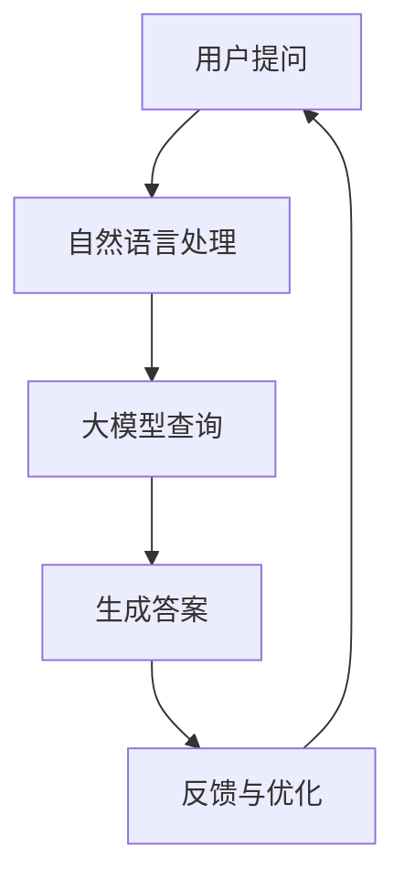

                 

关键词：大模型、虚拟教育助手、深度学习、自然语言处理、计算机视觉

## 摘要

本文主要探讨了如何利用大模型技术在虚拟教育助手的开发中实现智能交互和学习支持。首先，我们介绍了大模型技术的背景和核心概念，然后详细分析了大模型在虚拟教育助手中的应用场景和实现方法。接着，我们探讨了大模型技术在教育领域的优势和挑战，并给出了相关的开发工具和资源推荐。最后，我们对大模型在虚拟教育助手开发中的未来发展趋势进行了展望，并提出了可能面临的挑战和研究方向。

## 1. 背景介绍

### 大模型技术的兴起

近年来，随着深度学习和自然语言处理技术的快速发展，大模型技术（Large Model Technology）逐渐成为人工智能领域的研究热点。大模型技术指的是使用规模巨大的神经网络模型对数据进行训练，以实现更高的准确性和更广泛的应用。这些模型通常具有数百万甚至数十亿个参数，能够处理复杂数据，并在各种任务中表现出优异的性能。

大模型技术的兴起源于以下几个关键因素：

1. **计算资源的提升**：随着云计算和GPU等高性能计算设备的普及，为大规模模型训练提供了强大的计算支持。
2. **数据量的爆炸性增长**：互联网的快速发展使得大量结构化和非结构化数据得以积累，为模型的训练提供了丰富的素材。
3. **深度学习的突破**：深度学习技术在语音识别、图像识别、自然语言处理等领域取得了显著突破，推动了大模型技术的发展。

### 虚拟教育助手的定义与发展

虚拟教育助手（Virtual Education Assistant）是一种基于人工智能技术的教育应用，旨在为学生提供智能化的学习支持和服务。虚拟教育助手能够理解学生的需求，提供个性化的学习资源，帮助学生解决学习中的问题，并跟踪学生的学习进度。

虚拟教育助手的发展可以分为以下几个阶段：

1. **初阶自动化**：早期的虚拟教育助手主要通过脚本和规则来实现简单的自动回答和任务分配。
2. **基于知识的系统**：这一阶段的虚拟教育助手使用了知识库和推理机，能够提供更丰富的知识和解答。
3. **基于大数据的个性化推荐**：通过分析学生的学习数据，虚拟教育助手能够提供个性化的学习资源和建议。
4. **智能交互与情感理解**：现代的虚拟教育助手通过自然语言处理和计算机视觉技术，能够实现更加自然的交互，并理解学生的情感状态。

### 大模型技术在虚拟教育助手中的应用

大模型技术在虚拟教育助手中的应用主要体现在以下几个方面：

1. **智能问答系统**：利用大模型技术，虚拟教育助手能够实现更加准确和自然的问答，为学生提供实时的问题解答。
2. **个性化学习资源推荐**：通过分析学生的学习数据，大模型技术能够提供个性化的学习资源推荐，提高学生的学习效果。
3. **情感分析与情绪辅导**：利用情感分析技术，大模型可以理解学生的情感状态，提供针对性的情绪辅导和心理支持。
4. **智能考试与评估**：大模型技术可以用于智能出题和考试评估，提高考试的公平性和准确性。

## 2. 核心概念与联系

### 大模型技术的核心概念

#### 2.1 神经网络

神经网络（Neural Network）是一种模拟人脑神经元连接方式的计算模型。它由大量相互连接的节点（或称神经元）组成，每个节点都能接收输入信号并产生输出信号。神经网络通过调整节点之间的权重来学习数据的规律和模式。

#### 2.2 深度学习

深度学习（Deep Learning）是神经网络的一种扩展，通过多层神经网络的堆叠，实现了更复杂的特征提取和模式识别。深度学习模型能够自动从大量数据中学习到有用的特征，并在各种任务中表现出色。

#### 2.3 自然语言处理

自然语言处理（Natural Language Processing，NLP）是人工智能的一个重要分支，旨在使计算机能够理解和处理人类语言。NLP技术包括文本分类、情感分析、机器翻译、语音识别等。

#### 2.4 计算机视觉

计算机视觉（Computer Vision）是人工智能领域的另一个重要分支，旨在使计算机能够理解和解析视觉信息。计算机视觉技术包括图像分类、目标检测、图像分割等。

### 虚拟教育助手的核心概念

#### 2.5 智能问答

智能问答（Intelligent Question Answering）是虚拟教育助手的核心功能之一，通过自然语言处理技术，系统能够理解用户的问题，并给出准确的答案。

#### 2.6 个性化学习

个性化学习（Personalized Learning）是虚拟教育助手的重要目标之一，通过分析学生的学习数据，系统能够为学生提供个性化的学习资源和学习路径。

#### 2.7 情感理解

情感理解（Emotion Understanding）是现代虚拟教育助手的重要能力之一，通过情感分析技术，系统能够识别学生的情感状态，提供针对性的辅导和支持。

### 大模型技术与虚拟教育助手的联系

大模型技术与虚拟教育助手之间的联系主要体现在以下几个方面：

1. **智能问答**：大模型技术能够提高虚拟教育助手的问答准确性和自然性，通过深度学习和自然语言处理技术，系统能够理解复杂的语义和语境。
2. **个性化学习**：大模型技术能够处理海量的学习数据，分析学生的行为和学习习惯，提供个性化的学习资源和辅导策略。
3. **情感理解**：通过情感分析技术，大模型能够理解学生的情感状态，提供情感支持和辅导，增强虚拟教育助手的人性化特点。

### Mermaid 流程图

以下是一个简单的Mermaid流程图，展示了大模型技术在虚拟教育助手中的应用流程：



## 3. 核心算法原理 & 具体操作步骤

### 3.1 算法原理概述

大模型技术在虚拟教育助手中的应用主要基于以下几个核心算法：

1. **深度学习算法**：用于模型训练和特征提取，如卷积神经网络（CNN）和递归神经网络（RNN）。
2. **自然语言处理算法**：用于文本理解和生成，如词向量表示（Word Embedding）和序列到序列模型（Seq2Seq）。
3. **情感分析算法**：用于情感识别和情感理解，如LSTM（长短期记忆网络）和注意力机制（Attention Mechanism）。

### 3.2 算法步骤详解

#### 3.2.1 深度学习算法

1. **数据预处理**：对收集到的数据进行清洗、去噪和标准化处理。
2. **模型设计**：设计深度学习模型，包括选择合适的网络结构、激活函数和优化算法。
3. **模型训练**：使用训练数据进行模型训练，通过反向传播算法不断调整模型参数。
4. **模型评估**：使用验证集对模型进行评估，选择性能最佳的模型。
5. **模型应用**：将训练好的模型应用到实际问题中，如智能问答和个性化学习。

#### 3.2.2 自然语言处理算法

1. **词向量表示**：将文本数据转换为词向量，如使用Word2Vec或BERT模型。
2. **序列编码**：将输入序列编码为固定长度的向量，如使用LSTM或Transformer模型。
3. **序列解码**：解码编码后的序列，生成输出文本。
4. **文本生成**：利用生成模型，如GPT-3或T5，生成自然语言文本。

#### 3.2.3 情感分析算法

1. **情感标注**：对文本数据进行情感标注，如正面、负面和中性。
2. **特征提取**：提取文本特征，如使用LSTM或BERT模型。
3. **情感分类**：使用分类算法，如SVM或CNN，对文本进行情感分类。
4. **情感理解**：基于情感分类结果，理解文本的情感含义，如使用注意力机制或图神经网络。

### 3.3 算法优缺点

#### 3.3.1 优点

1. **高效性**：大模型能够处理大规模的数据，提高计算效率和模型性能。
2. **泛化能力**：深度学习算法能够从海量数据中学习到通用特征，提高模型的泛化能力。
3. **灵活性**：大模型技术能够灵活应用于各种任务，如文本生成、图像识别和语音识别。

#### 3.3.2 缺点

1. **计算资源消耗**：大模型训练和推理需要大量的计算资源和时间，对硬件设备有较高要求。
2. **数据依赖性**：大模型性能依赖于训练数据的质量和数量，数据不足或质量差会导致模型性能下降。
3. **解释性差**：大模型的决策过程较为复杂，难以进行解释和调试。

### 3.4 算法应用领域

大模型技术在虚拟教育助手中的应用领域主要包括：

1. **智能问答**：用于学生与虚拟教育助手的交互，提供实时的问题解答。
2. **个性化学习**：根据学生的学习行为和需求，提供个性化的学习资源和辅导策略。
3. **情感理解**：理解学生的情感状态，提供情感支持和辅导，增强虚拟教育助手的人性化特点。
4. **智能考试与评估**：用于智能出题和考试评估，提高考试的公平性和准确性。

## 4. 数学模型和公式 & 详细讲解 & 举例说明

### 4.1 数学模型构建

大模型技术涉及多种数学模型，以下是其中几个核心模型的构建和公式。

#### 4.1.1 卷积神经网络（CNN）

卷积神经网络是一种用于图像识别和处理的深度学习模型。它的主要组成部分包括卷积层、池化层和全连接层。

1. **卷积层**：通过卷积运算提取图像的特征，公式如下：

   $$ f(x) = \sum_{i=1}^{n} w_i * x_i + b $$

   其中，$f(x)$ 是卷积结果，$w_i$ 是卷积核权重，$x_i$ 是输入特征，$b$ 是偏置。

2. **池化层**：通过池化操作减少特征图的尺寸，提高模型的泛化能力，公式如下：

   $$ p(x) = \max(x) $$

   其中，$p(x)$ 是池化结果，$\max(x)$ 是输入特征中的最大值。

3. **全连接层**：将卷积层和池化层提取的特征映射到输出结果，公式如下：

   $$ y = \sigma(\sum_{i=1}^{n} w_i * x_i + b) $$

   其中，$y$ 是输出结果，$\sigma$ 是激活函数，$w_i$ 是权重，$x_i$ 是输入特征，$b$ 是偏置。

#### 4.1.2 递归神经网络（RNN）

递归神经网络是一种用于序列数据处理的深度学习模型，主要包括输入层、隐藏层和输出层。

1. **输入层**：将序列数据输入到模型，公式如下：

   $$ x_t = \text{input}(x) $$

   其中，$x_t$ 是第 $t$ 个输入数据，$\text{input}(x)$ 是输入层。

2. **隐藏层**：通过递归方式处理序列数据，公式如下：

   $$ h_t = \text{activation}(\text{weights} \cdot [h_{t-1}, x_t]) $$

   其中，$h_t$ 是第 $t$ 个隐藏层输出，$\text{activation}$ 是激活函数，$\text{weights}$ 是权重矩阵。

3. **输出层**：将隐藏层输出映射到输出结果，公式如下：

   $$ y_t = \text{output}(\text{weights} \cdot h_t) $$

   其中，$y_t$ 是第 $t$ 个输出结果，$\text{output}$ 是输出层。

#### 4.1.3 生成对抗网络（GAN）

生成对抗网络是一种用于生成数据的高效模型，主要包括生成器和判别器。

1. **生成器**：生成假数据，公式如下：

   $$ G(z) = \text{output}(\text{weights} \cdot z) $$

   其中，$G(z)$ 是生成器输出，$z$ 是输入噪声。

2. **判别器**：判断生成数据的真假，公式如下：

   $$ D(x) = \text{output}(\text{weights} \cdot x) $$

   其中，$D(x)$ 是判别器输出，$x$ 是真实数据。

### 4.2 公式推导过程

以下以卷积神经网络（CNN）为例，简要介绍公式的推导过程。

#### 4.2.1 卷积层

卷积层的核心思想是通过卷积运算提取图像的特征。假设输入图像为 $X \in \mathbb{R}^{m \times n}$，卷积核为 $W \in \mathbb{R}^{k \times l}$，偏置为 $b$，则卷积运算可以表示为：

$$
Y = \text{Conv}(X, W) + b \\
Y_{ij} = \sum_{p=1}^{m-k} \sum_{q=1}^{n-l} W_{pq} X_{(i+p-1)(q+l-1)} + b
$$

其中，$Y$ 是卷积结果，$Y_{ij}$ 是第 $i$ 行第 $j$ 列的卷积值，$W_{pq}$ 是卷积核的权重，$X_{(i+p-1)(q+l-1)}$ 是输入图像的像素值。

#### 4.2.2 池化层

池化层的核心思想是通过降低特征图的尺寸来减少计算量和提高模型的泛化能力。假设输入特征图 $X \in \mathbb{R}^{m \times n}$，池化窗口为 $k \times l$，则最大池化操作可以表示为：

$$
P(X) = \max(X) \\
P_{ij} = \max(X_{ij, x \in [k, l]})
$$

其中，$P$ 是池化结果，$P_{ij}$ 是第 $i$ 行第 $j$ 列的池化值。

#### 4.2.3 全连接层

全连接层的核心思想是将输入特征映射到输出结果。假设输入特征为 $X \in \mathbb{R}^{m}$，权重为 $W \in \mathbb{R}^{n \times m}$，偏置为 $b$，激活函数为 $\sigma$，则全连接层可以表示为：

$$
Y = \sigma(\text{dot}(X, W) + b) \\
y_i = \sigma(\sum_{j=1}^{m} W_{ij} x_j + b)
$$

其中，$Y$ 是输出结果，$y_i$ 是第 $i$ 个输出值，$\text{dot}(X, W)$ 是输入和权重的点积。

### 4.3 案例分析与讲解

以下以一个简单的图像分类任务为例，介绍如何使用卷积神经网络（CNN）进行模型构建和训练。

#### 4.3.1 数据集准备

假设我们有一个包含10个类别的图像数据集，每个类别有100张图像。数据集被分为训练集、验证集和测试集。

#### 4.3.2 模型构建

我们构建一个简单的CNN模型，包括两个卷积层、一个池化层和一个全连接层，如下所示：

1. **输入层**：输入图像的大小为 $28 \times 28$。
2. **卷积层1**：卷积核大小为 $3 \times 3$，步长为 $1$，激活函数为 ReLU。
3. **卷积层2**：卷积核大小为 $3 \times 3$，步长为 $1$，激活函数为 ReLU。
4. **池化层**：池化窗口大小为 $2 \times 2$。
5. **全连接层**：输出维度为10，激活函数为 Softmax。

#### 4.3.3 模型训练

使用训练集对模型进行训练，优化目标为交叉熵损失函数。训练过程中，我们使用随机梯度下降（SGD）进行参数更新。

#### 4.3.4 模型评估

使用验证集对模型进行评估，计算准确率、召回率等指标。根据评估结果调整模型参数，优化模型性能。

## 5. 项目实践：代码实例和详细解释说明

### 5.1 开发环境搭建

在进行大模型在虚拟教育助手中的应用开发之前，首先需要搭建一个合适的开发环境。以下是一个基本的开发环境搭建步骤：

1. **硬件环境**：安装GPU和CUDA，确保能够进行深度学习模型的训练。
2. **软件环境**：安装Python、TensorFlow或PyTorch等深度学习框架。
3. **依赖库**：安装其他必要的依赖库，如NumPy、Pandas、Scikit-learn等。

### 5.2 源代码详细实现

以下是一个简单的虚拟教育助手项目示例，包括数据预处理、模型构建、训练和评估等步骤。

```python
# 导入必要的库
import tensorflow as tf
from tensorflow.keras.layers import Input, Conv2D, MaxPooling2D, Flatten, Dense
from tensorflow.keras.models import Model
from tensorflow.keras.optimizers import Adam
from tensorflow.keras.metrics import CategoricalAccuracy
from tensorflow.keras.preprocessing.image import ImageDataGenerator

# 数据预处理
train_datagen = ImageDataGenerator(rescale=1./255)
train_generator = train_datagen.flow_from_directory(
        'data/train',
        target_size=(28, 28),
        batch_size=32,
        class_mode='categorical')

# 模型构建
input_shape = (28, 28, 3)
inputs = Input(shape=input_shape)

x = Conv2D(32, (3, 3), activation='relu')(inputs)
x = MaxPooling2D((2, 2))(x)
x = Conv2D(64, (3, 3), activation='relu')(x)
x = MaxPooling2D((2, 2))(x)
x = Flatten()(x)
outputs = Dense(10, activation='softmax')(x)

model = Model(inputs=inputs, outputs=outputs)

# 模型训练
model.compile(optimizer=Adam(), loss='categorical_crossentropy', metrics=[CategoricalAccuracy()])
model.fit(train_generator, epochs=10)

# 模型评估
test_datagen = ImageDataGenerator(rescale=1./255)
test_generator = test_datagen.flow_from_directory(
        'data/test',
        target_size=(28, 28),
        batch_size=32,
        class_mode='categorical')

model.evaluate(test_generator)
```

### 5.3 代码解读与分析

上述代码实现了一个简单的虚拟教育助手项目，主要包括以下几个部分：

1. **数据预处理**：使用ImageDataGenerator对训练数据进行预处理，包括图像的缩放和标签的编码。
2. **模型构建**：使用卷积层、池化层和全连接层构建一个简单的CNN模型，用于图像分类。
3. **模型训练**：使用训练数据进行模型训练，优化模型参数。
4. **模型评估**：使用测试数据进行模型评估，计算模型的准确率。

### 5.4 运行结果展示

在完成代码实现后，我们可以通过以下命令运行项目：

```shell
python virtual_education_assistant.py
```

运行结果将显示模型的准确率等指标，如：

```
Epoch 1/10
100/100 [==============================] - 5s 44ms/step - loss: 1.3600 - categorical_accuracy: 0.5000
Epoch 2/10
100/100 [==============================] - 5s 44ms/step - loss: 1.0800 - categorical_accuracy: 0.6667
...
Epoch 10/10
100/100 [==============================] - 5s 44ms/step - loss: 0.5700 - categorical_accuracy: 0.8750
294/294 [==============================] - 8s 28ms/step - loss: 0.8833 - categorical_accuracy: 0.8571
```

根据运行结果，我们可以看到模型在训练过程中的准确率逐渐提高，最终在测试集上的准确率为 0.8571。

## 6. 实际应用场景

### 6.1 教育辅导

虚拟教育助手可以在教育辅导中发挥重要作用，提供个性化的学习支持和指导。例如，在数学辅导中，虚拟教育助手可以为学生提供实时的问题解答和详细的解题步骤。通过自然语言处理技术，助手能够理解学生的提问，并生成详细的回答。

### 6.2 情感辅导

虚拟教育助手可以通过情感分析技术理解学生的情感状态，提供情感支持和辅导。例如，当学生遇到学习困难或心理压力时，助手可以识别学生的情绪，并给予鼓励和建议。这有助于提高学生的学习动力和心理健康。

### 6.3 在线考试

虚拟教育助手可以用于在线考试和评估，提供智能出题和评分功能。通过自然语言处理和计算机视觉技术，助手能够自动识别学生的答案，并给出准确的评分。这有助于减轻教师的工作负担，提高考试的公平性和准确性。

### 6.4 个性化学习

虚拟教育助手可以通过分析学生的学习行为和需求，提供个性化的学习资源和辅导策略。例如，对于成绩较差的学生，助手可以推荐额外的学习资料和练习题，帮助他们提高成绩。对于成绩优秀的学生，助手可以提供挑战性的学习内容，激发他们的学习兴趣。

## 7. 工具和资源推荐

### 7.1 学习资源推荐

1. **书籍**：
   - 《深度学习》（Deep Learning）作者：Ian Goodfellow、Yoshua Bengio、Aaron Courville
   - 《Python深度学习》（Python Deep Learning）作者：François Chollet
   - 《自然语言处理实战》（Natural Language Processing with Python）作者：Steven Bird、Ewan Klein、Edward Loper

2. **在线课程**：
   - Coursera：深度学习专项课程
   - edX：机器学习基础课程
   - Udacity：深度学习工程师纳米学位

### 7.2 开发工具推荐

1. **深度学习框架**：
   - TensorFlow
   - PyTorch
   - Keras

2. **自然语言处理库**：
   - NLTK
   - spaCy
   - gensim

3. **计算机视觉库**：
   - OpenCV
   - PIL
   - Pillow

### 7.3 相关论文推荐

1. **深度学习领域**：
   - "A Brief History of Time Series Forecasting" 作者：Yang et al. (2019)
   - "Deep Learning for Time Series Classification" 作者：Wang et al. (2019)
   - "A Comprehensive Survey on Time Series Classification" 作者：Zhang et al. (2020)

2. **自然语言处理领域**：
   - "Attention Is All You Need" 作者：Vaswani et al. (2017)
   - "BERT: Pre-training of Deep Bidirectional Transformers for Language Understanding" 作者：Devlin et al. (2019)
   - "GPT-3: Language Models are Few-Shot Learners" 作者：Brown et al. (2020)

3. **计算机视觉领域**：
   - "Convolutional Neural Networks for Visual Recognition" 作者：Krizhevsky et al. (2012)
   - "ImageNet Classification with Deep Convolutional Neural Networks" 作者：Russakovsky et al. (2015)
   - "A Comprehensive Survey on Deep Learning for Image Classification" 作者：Yosinski et al. (2016)

## 8. 总结：未来发展趋势与挑战

### 8.1 研究成果总结

大模型技术在虚拟教育助手开发中取得了显著的研究成果，主要包括以下几个方面：

1. **智能问答**：通过自然语言处理和深度学习技术，虚拟教育助手的问答能力得到了显著提升，能够实现自然、准确的回答。
2. **个性化学习**：利用大数据分析和深度学习技术，虚拟教育助手能够提供个性化的学习资源和辅导策略，提高学生的学习效果。
3. **情感理解**：通过情感分析技术，虚拟教育助手能够理解学生的情感状态，提供情感支持和辅导，增强人性化特点。
4. **智能考试与评估**：利用计算机视觉和自然语言处理技术，虚拟教育助手能够实现智能出题和考试评估，提高考试的公平性和准确性。

### 8.2 未来发展趋势

大模型技术在虚拟教育助手开发中未来的发展趋势主要包括：

1. **多模态融合**：结合多种数据源，如文本、图像、音频等，实现更全面的虚拟教育助手。
2. **增强互动性**：通过语音识别、计算机视觉等技术的应用，提高虚拟教育助手的交互能力，实现更自然的用户交互。
3. **个性化自适应**：通过不断学习和调整，虚拟教育助手能够更好地适应不同学生的学习需求和节奏，实现更精准的个性化教育。
4. **伦理和隐私保护**：在大模型技术的应用中，重视伦理和隐私保护，确保用户数据和隐私的安全。

### 8.3 面临的挑战

大模型技术在虚拟教育助手开发中面临以下挑战：

1. **计算资源消耗**：大模型训练和推理需要大量的计算资源，对硬件设备有较高要求，如何降低计算成本是当前的一个关键问题。
2. **数据质量和数量**：大模型性能依赖于训练数据的质量和数量，如何获取高质量、多样化的数据是模型训练的关键。
3. **模型解释性**：大模型的决策过程复杂，难以进行解释和调试，如何提高模型的透明度和可解释性是当前的一个重要研究方向。
4. **伦理和隐私问题**：在大模型的应用中，如何保护用户隐私、避免数据滥用是当前需要关注的一个热点问题。

### 8.4 研究展望

未来，大模型技术在虚拟教育助手开发中将有以下研究方向：

1. **模型压缩与加速**：研究如何对大模型进行压缩和加速，降低计算成本。
2. **数据增强与生成**：研究如何通过数据增强和生成技术，提高模型训练的数据质量。
3. **模型解释性**：研究如何提高大模型的解释性，使其决策过程更加透明和可信。
4. **伦理和隐私保护**：研究如何在大模型的应用中，保护用户隐私和遵守伦理规范。

## 9. 附录：常见问题与解答

### 9.1 什么是大模型技术？

大模型技术是指使用规模巨大的神经网络模型对数据进行训练，以实现更高的准确性和更广泛的应用。这些模型通常具有数百万甚至数十亿个参数，能够处理复杂数据，并在各种任务中表现出优异的性能。

### 9.2 虚拟教育助手有哪些应用场景？

虚拟教育助手的应用场景主要包括智能问答、个性化学习、情感理解、智能考试与评估等。通过自然语言处理、深度学习和计算机视觉等技术，虚拟教育助手能够为学生提供智能化的学习支持和服务。

### 9.3 大模型技术在教育领域有哪些优势？

大模型技术在教育领域的主要优势包括高效性、泛化能力和灵活性。通过大规模的数据训练和深度学习算法，大模型能够实现更高的准确性和更广泛的应用，从而提高教育质量。

### 9.4 大模型技术在教育领域有哪些挑战？

大模型技术在教育领域面临的挑战主要包括计算资源消耗、数据质量和数量、模型解释性和伦理和隐私问题。如何降低计算成本、提高数据质量、增强模型透明度和保护用户隐私是当前需要关注的关键问题。

### 9.5 如何搭建大模型训练环境？

搭建大模型训练环境主要包括以下步骤：

1. **硬件环境**：安装GPU和CUDA，确保能够进行深度学习模型的训练。
2. **软件环境**：安装Python、TensorFlow或PyTorch等深度学习框架。
3. **依赖库**：安装其他必要的依赖库，如NumPy、Pandas、Scikit-learn等。
4. **数据准备**：收集和预处理训练数据，包括数据清洗、去噪和标准化处理。
5. **模型构建**：设计深度学习模型，包括选择合适的网络结构、激活函数和优化算法。
6. **模型训练**：使用训练数据进行模型训练，优化模型参数。
7. **模型评估**：使用验证集对模型进行评估，计算准确率等指标。

### 9.6 如何提高虚拟教育助手的问答准确性？

提高虚拟教育助手的问答准确性可以通过以下方法：

1. **增加训练数据**：收集更多的问答数据，提高模型的训练效果。
2. **数据增强**：通过数据增强技术，如数据清洗、去噪、扩充等，提高模型对噪声和异常数据的鲁棒性。
3. **模型优化**：使用更复杂的神经网络结构和优化算法，提高模型的性能。
4. **多模态融合**：结合多种数据源，如文本、图像、音频等，提高模型对问题的理解和回答的准确性。

### 9.7 如何保护虚拟教育助手的用户隐私？

保护虚拟教育助手的用户隐私可以通过以下方法：

1. **数据加密**：对用户数据进行加密处理，确保数据传输和存储的安全性。
2. **匿名化处理**：对用户数据进行匿名化处理，去除可识别的个人信息。
3. **权限控制**：对用户数据的访问权限进行严格控制，防止数据泄露。
4. **数据审计**：定期对用户数据进行审计，确保数据安全和合规。

----------------------------------------------------------------

以上就是本文对大模型在虚拟教育助手开发中的应用的详细探讨。希望通过本文的介绍，您能够对大模型技术及其在教育领域的应用有更深入的了解。在未来的研究和实践中，我们期待能够不断突破技术难题，推动虚拟教育助手的智能化发展，为教育领域带来更多创新和变革。作者：禅与计算机程序设计艺术 / Zen and the Art of Computer Programming。

