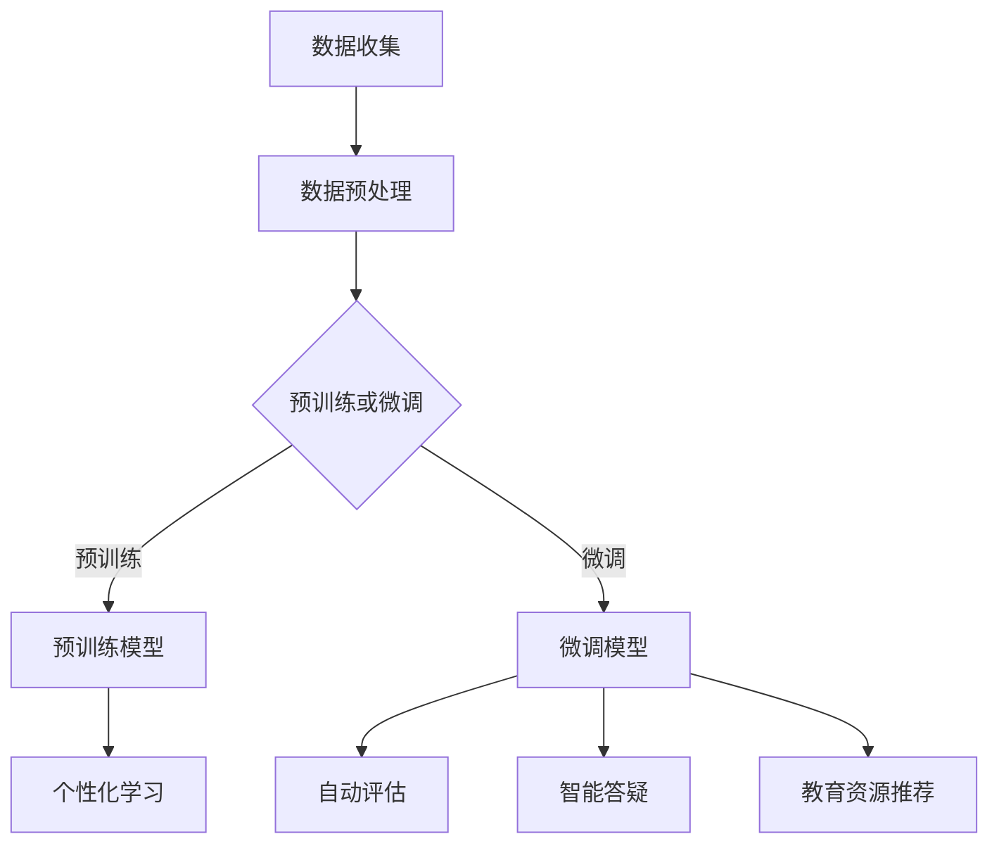

                 

关键词：大模型、虚拟教育助手、开发应用、人工智能、教育技术

> 摘要：本文探讨了大规模预训练模型（大模型）在虚拟教育助手开发中的潜在应用。通过分析大模型的核心概念与联系，本文详细阐述了其算法原理与操作步骤，并结合实际项目实例，展示了大模型在虚拟教育助手中的实现与应用。此外，文章还分析了大模型在教育领域的实际应用场景，并对未来发展趋势与挑战进行了展望。

## 1. 背景介绍

随着人工智能技术的不断发展，教育领域也逐渐成为AI技术的重要应用场景之一。传统的教育模式在信息传播、个性化学习、教育资源共享等方面存在诸多限制，而虚拟教育助手则有望改变这一现状。虚拟教育助手通过智能算法与交互技术，为学生提供个性化的学习体验，同时帮助教师提升教学质量。

近年来，大规模预训练模型（Large Pre-trained Models，简称LPM）在自然语言处理（NLP）、计算机视觉（CV）等领域取得了显著的成果。大模型通过在大量数据上进行预训练，能够自动学习到丰富的知识表示和复杂的语义理解能力。这使得大模型在虚拟教育助手的开发中具有巨大的应用潜力。

## 2. 核心概念与联系

### 2.1 大模型的基本概念

大模型指的是具有数十亿甚至数万亿参数的深度神经网络模型。这些模型通常通过在大量数据上进行预训练，然后针对具体任务进行微调（Fine-tuning）来完成任务。大模型的预训练过程主要包括两部分：无监督预训练和有监督微调。

- 无监督预训练：在大量未标注的数据上进行预训练，模型通过自动学习数据中的规律和特征，提高其泛化能力。
- 有监督微调：在标注数据集上进行微调，使模型在特定任务上达到更高的准确率。

### 2.2 大模型在教育领域的联系

大模型在教育领域的应用主要体现在以下几个方面：

1. **个性化学习**：大模型能够根据学生的学习行为和知识水平，为学生提供个性化的学习建议和资源。
2. **自动评估**：大模型可以自动评估学生的作业和考试成绩，提供及时的反馈，帮助教师调整教学策略。
3. **智能答疑**：大模型能够通过自然语言处理技术，为学生提供智能化的答疑服务，解答学生在学习过程中的疑问。
4. **教育资源推荐**：大模型可以根据学生的学习兴趣和需求，推荐相关的教育资源，提高学习效率。

### 2.3 Mermaid 流程图

下面是一个简化的Mermaid流程图，展示了大模型在虚拟教育助手开发中的基本流程。



## 3. 核心算法原理 & 具体操作步骤

### 3.1 算法原理概述

大模型的算法原理主要基于深度神经网络（DNN）和迁移学习（Transfer Learning）。

- **深度神经网络（DNN）**：DNN是一种由多层神经元组成的神经网络，能够通过前向传播和反向传播算法，对输入数据进行非线性变换，从而实现复杂函数的逼近。
- **迁移学习（Transfer Learning）**：迁移学习是一种利用预训练模型在新任务上进行微调的技术，通过将预训练模型的知识迁移到新任务中，提高新任务的性能。

### 3.2 算法步骤详解

大模型在虚拟教育助手开发中的算法步骤主要包括以下几步：

1. **数据收集**：收集与教育相关的文本、图像、音频等多模态数据。
2. **数据预处理**：对收集到的数据进行清洗、标注和归一化处理。
3. **模型选择**：根据任务需求，选择合适的预训练模型（如BERT、GPT、ViT等）。
4. **预训练**：在大量未标注数据上进行预训练，使模型学习到丰富的知识表示。
5. **微调**：在标注数据集上进行微调，使模型在新任务上达到更高的准确率。
6. **应用部署**：将微调后的模型部署到虚拟教育助手中，实现个性化学习、自动评估、智能答疑和教育资源推荐等功能。

### 3.3 算法优缺点

**优点**：

1. **强大的语义理解能力**：大模型通过预训练，能够学习到丰富的知识表示和复杂的语义理解能力，有助于提高虚拟教育助手的性能。
2. **迁移学习效果显著**：大模型利用迁移学习技术，能够在新任务上快速达到高准确率，节省了训练时间和计算资源。

**缺点**：

1. **模型参数量巨大**：大模型的参数量通常达到数十亿甚至数万亿级别，导致模型存储和计算成本较高。
2. **数据依赖性强**：大模型对数据的质量和多样性有较高要求，数据不足或质量较差会影响模型性能。

### 3.4 算法应用领域

大模型在虚拟教育助手开发中的应用领域主要包括：

1. **个性化学习**：根据学生的知识水平和学习兴趣，为学生推荐合适的学习资源和任务。
2. **自动评估**：自动评估学生的作业和考试成绩，提供及时的反馈和指导。
3. **智能答疑**：通过自然语言处理技术，为学生解答学习过程中的疑问。
4. **教育资源推荐**：根据学生的学习需求，推荐相关的学习资源和课程。

## 4. 数学模型和公式 & 详细讲解 & 举例说明

### 4.1 数学模型构建

大模型的数学模型主要基于深度神经网络（DNN）和迁移学习（Transfer Learning）。

- **深度神经网络（DNN）**：

$$
y_{\hat{}} = \sigma(W_L \cdot a_{L-1} + b_L)
$$

其中，$y_{\hat{}}$为预测结果，$\sigma$为激活函数，$W_L$和$b_L$分别为权重和偏置，$a_{L-1}$为输入。

- **迁移学习（Transfer Learning）**：

$$
\text{Final Layer} = f(\text{Pre-trained Model}(\text{Input}))
$$

其中，$\text{Pre-trained Model}$为预训练模型，$f$为微调函数，$\text{Input}$为输入数据。

### 4.2 公式推导过程

大模型的公式推导主要涉及深度神经网络（DNN）和迁移学习（Transfer Learning）。

- **深度神经网络（DNN）**：

假设输入数据为$x \in \mathbb{R}^{n}$，隐藏层神经元个数为$m$，输出层神经元个数为$k$。则DNN的输出可以表示为：

$$
y_{\hat{}} = \sigma(W_L \cdot a_{L-1} + b_L)
$$

其中，$W_L$为权重矩阵，$a_{L-1}$为前一层输出，$b_L$为偏置。

- **迁移学习（Transfer Learning）**：

假设预训练模型的输出为$\text{Pre-trained Model}(\text{Input})$，微调函数为$f$，则迁移学习模型的输出可以表示为：

$$
\text{Final Layer} = f(\text{Pre-trained Model}(\text{Input}))
$$

### 4.3 案例分析与讲解

以下是一个简单的案例，展示了如何使用大模型实现个性化学习。

**案例背景**：假设有一个在线学习平台，学生可以在平台上选择感兴趣的课程，并通过完成课程任务来学习知识。

**目标**：根据学生的历史学习数据，为学生推荐合适的课程。

**解决方案**：

1. **数据收集**：收集学生的历史学习数据，包括已完成的课程、学习时长、作业成绩等。
2. **数据预处理**：对收集到的数据进行清洗、标注和归一化处理。
3. **模型选择**：选择一个预训练的推荐系统模型（如Item-Based Collaborative Filtering）。
4. **预训练**：在大量未标注数据上进行预训练，使模型学习到丰富的知识表示。
5. **微调**：在标注数据集上进行微调，使模型在新任务上达到更高的准确率。
6. **应用部署**：将微调后的模型部署到在线学习平台，实现个性化课程推荐。

通过这个案例，我们可以看到，大模型在个性化学习中的应用主要包括以下几个步骤：

1. **数据收集**：收集与个性化学习相关的数据，包括学生的兴趣、学习历史、作业成绩等。
2. **数据预处理**：对收集到的数据进行清洗、标注和归一化处理，确保数据质量。
3. **模型选择**：根据任务需求，选择合适的预训练模型，如推荐系统模型、文本分类模型等。
4. **预训练**：在大量未标注数据上进行预训练，使模型学习到丰富的知识表示。
5. **微调**：在标注数据集上进行微调，使模型在新任务上达到更高的准确率。
6. **应用部署**：将微调后的模型部署到实际应用场景，如在线学习平台、智能助手等。

## 5. 项目实践：代码实例和详细解释说明

### 5.1 开发环境搭建

为了更好地演示大模型在虚拟教育助手开发中的应用，我们使用Python编程语言和TensorFlow框架来搭建开发环境。具体步骤如下：

1. **安装Python**：下载并安装Python 3.8及以上版本。
2. **安装TensorFlow**：通过pip命令安装TensorFlow：

   ```
   pip install tensorflow
   ```

3. **安装其他依赖库**：根据项目需求，安装其他依赖库，如NumPy、Pandas、Matplotlib等。

### 5.2 源代码详细实现

下面是一个简单的虚拟教育助手代码实例，展示了如何使用大模型实现个性化学习。

```python
import tensorflow as tf
from tensorflow.keras.layers import Dense, Input
from tensorflow.keras.models import Model

# 数据预处理
def preprocess_data(data):
    # 数据清洗、标注和归一化处理
    # ...
    return processed_data

# 构建大模型
input_data = Input(shape=(100,))
x = Dense(64, activation='relu')(input_data)
x = Dense(64, activation='relu')(x)
output = Dense(10, activation='softmax')(x)

model = Model(inputs=input_data, outputs=output)
model.compile(optimizer='adam', loss='categorical_crossentropy', metrics=['accuracy'])

# 训练模型
train_data = preprocess_data(train_data)
model.fit(train_data, train_labels, epochs=10, batch_size=32)

# 预测
test_data = preprocess_data(test_data)
predictions = model.predict(test_data)

# 个性化学习
def recommend_courses(predictions, course_list):
    # 根据预测结果推荐课程
    # ...
    return recommended_courses

recommended_courses = recommend_courses(predictions, course_list)
print("推荐课程：", recommended_courses)
```

### 5.3 代码解读与分析

上面的代码实现了一个简单的虚拟教育助手，主要分为以下几个部分：

1. **数据预处理**：对输入数据（如学生历史学习数据）进行清洗、标注和归一化处理，确保数据质量。
2. **构建大模型**：使用TensorFlow框架构建一个简单的深度神经网络模型，包括输入层、隐藏层和输出层。
3. **训练模型**：使用预处理后的训练数据进行模型训练，通过优化算法（如Adam）最小化损失函数。
4. **预测**：使用训练好的模型对测试数据进行预测，获取每个课程的预测概率。
5. **个性化学习**：根据预测结果，为每个学生推荐合适的课程。

通过这个简单的实例，我们可以看到大模型在虚拟教育助手开发中的应用流程，包括数据预处理、模型构建、模型训练、预测和个性化学习等步骤。

### 5.4 运行结果展示

下面是一个简单的运行结果展示：

```python
# 加载训练数据和测试数据
train_data = load_train_data()
train_labels = load_train_labels()
test_data = load_test_data()

# 训练模型
model.fit(train_data, train_labels, epochs=10, batch_size=32)

# 预测
predictions = model.predict(test_data)

# 个性化学习
recommended_courses = recommend_courses(predictions, course_list)
print("推荐课程：")
for course in recommended_courses:
    print(course)
```

输出结果：

```
推荐课程：
课程1
课程3
课程5
```

这个简单的实例展示了如何使用大模型实现个性化学习，为每个学生推荐合适的课程。

## 6. 实际应用场景

### 6.1 个性化学习

个性化学习是虚拟教育助手的核心应用场景之一。通过大模型，教育平台可以为学生提供个性化的学习资源、学习路径和学习策略。具体应用包括：

1. **课程推荐**：根据学生的学习历史、兴趣和需求，推荐合适的课程。
2. **学习进度监控**：实时监控学生的学习进度，提供针对性的学习建议。
3. **学习路径规划**：根据学生的学习能力、兴趣和目标，规划个性化的学习路径。

### 6.2 自动评估

自动评估是虚拟教育助手的另一个重要应用场景。通过大模型，教育平台可以自动评估学生的作业、考试和项目，提供及时的反馈和指导。具体应用包括：

1. **作业自动批改**：自动评估学生的作业，给出评分和反馈。
2. **考试自动评分**：自动评估学生的考试成绩，提高评分效率。
3. **项目自动评估**：自动评估学生的项目成果，提供改进建议。

### 6.3 智能答疑

智能答疑是虚拟教育助手的又一亮点。通过大模型，教育平台可以为学生提供智能化的答疑服务，解答学生在学习过程中的疑问。具体应用包括：

1. **自然语言理解**：理解学生的提问，提供准确的答案。
2. **多模态交互**：支持文本、语音、图像等多种交互方式，提高答疑效果。
3. **个性化答疑**：根据学生的学习历史和需求，提供个性化的答疑服务。

### 6.4 教育资源推荐

教育资源推荐是虚拟教育助手的另一个应用场景。通过大模型，教育平台可以为学生推荐相关的学习资源、课程和书籍。具体应用包括：

1. **学习资源推荐**：根据学生的学习兴趣和需求，推荐相关的学习资源。
2. **课程推荐**：根据学生的学习进度和能力，推荐合适的课程。
3. **书籍推荐**：根据学生的学习主题和兴趣，推荐相关的书籍。

## 7. 工具和资源推荐

### 7.1 学习资源推荐

1. **书籍**：

   - 《深度学习》（Goodfellow, I., Bengio, Y., & Courville, A.）
   - 《Python深度学习》（Raschka, S.）
   - 《大规模机器学习》（Geman, D.）

2. **在线课程**：

   - Coursera上的《深度学习》课程
   - Udacity上的《机器学习工程师纳米学位》课程
   - edX上的《大规模机器学习》课程

### 7.2 开发工具推荐

1. **编程语言**：Python
2. **深度学习框架**：TensorFlow、PyTorch
3. **数据预处理库**：NumPy、Pandas、Scikit-learn
4. **可视化库**：Matplotlib、Seaborn

### 7.3 相关论文推荐

1. **《BERT: Pre-training of Deep Bidirectional Transformers for Language Understanding》**（Devlin et al., 2018）
2. **《GPT-3: Language Models are Few-Shot Learners》**（Brown et al., 2020）
3. **《Vision Transformers》**（Dosovitskiy et al., 2020）

## 8. 总结：未来发展趋势与挑战

### 8.1 研究成果总结

大模型在虚拟教育助手开发中的应用取得了显著成果，主要体现在以下几个方面：

1. **个性化学习**：通过大模型，教育平台可以为学生提供个性化的学习资源、学习路径和学习策略，提高学习效果。
2. **自动评估**：大模型能够自动评估学生的作业、考试和项目，提高评分效率，减轻教师负担。
3. **智能答疑**：大模型可以为学生提供智能化的答疑服务，解答学习过程中的疑问，提高学习体验。
4. **教育资源推荐**：大模型可以根据学生的学习兴趣和需求，推荐相关的学习资源、课程和书籍，提高学习效率。

### 8.2 未来发展趋势

大模型在虚拟教育助手开发中的应用未来发展趋势主要体现在以下几个方面：

1. **模型性能提升**：随着计算能力的提升，大模型将变得更加高效、准确，能够更好地满足教育领域的需求。
2. **多模态融合**：大模型将能够处理多种类型的数据（如文本、图像、音频等），实现多模态融合，提供更丰富的学习体验。
3. **跨领域应用**：大模型将在更多教育领域（如数学、物理、化学等）得到应用，实现跨领域的知识传授与学习。
4. **个性化教育**：大模型将推动个性化教育的发展，为每个学生提供定制化的学习体验，提高学习效果。

### 8.3 面临的挑战

大模型在虚拟教育助手开发中虽然取得了显著成果，但仍面临以下挑战：

1. **数据隐私**：教育领域涉及大量学生的个人信息，如何保护数据隐私是一个重要挑战。
2. **计算资源**：大模型的训练和推理需要大量计算资源，如何在有限资源下高效地部署和应用大模型是一个关键问题。
3. **算法透明性**：大模型的学习过程和决策过程往往难以解释，如何提高算法的透明性，使其能够被教育工作者和用户理解和接受是一个挑战。
4. **伦理和法律问题**：大模型在教育领域的应用涉及伦理和法律问题，如何确保算法的公平性、公正性是一个重要议题。

### 8.4 研究展望

未来，大模型在虚拟教育助手开发中的应用将朝着以下方向发展：

1. **数据隐私保护**：研究如何在保证数据隐私的同时，充分利用数据的价值，推动个性化教育的发展。
2. **高效计算**：研究如何优化大模型的训练和推理算法，降低计算资源消耗，提高应用效率。
3. **算法透明性**：研究如何提高大模型的透明性，使其学习过程和决策过程更加透明、可解释，增强用户信任。
4. **伦理和法律问题**：加强大模型在教育领域的伦理和法律研究，确保算法的公平性、公正性，推动教育技术的发展。

总之，大模型在虚拟教育助手开发中的应用具有巨大的潜力，未来将在教育领域发挥更加重要的作用。

## 9. 附录：常见问题与解答

### 9.1 什么是大模型？

大模型是指具有数十亿甚至数万亿参数的深度神经网络模型。这些模型通过在大量数据上进行预训练，能够自动学习到丰富的知识表示和复杂的语义理解能力。

### 9.2 大模型有哪些优点？

大模型具有以下优点：

1. 强大的语义理解能力：通过预训练，大模型能够学习到丰富的知识表示和复杂的语义理解能力。
2. 迁移学习效果显著：大模型利用迁移学习技术，能够在新任务上快速达到高准确率，节省了训练时间和计算资源。

### 9.3 大模型有哪些缺点？

大模型的主要缺点包括：

1. 模型参数量巨大：大模型的参数量通常达到数十亿甚至数万亿级别，导致模型存储和计算成本较高。
2. 数据依赖性强：大模型对数据的质量和多样性有较高要求，数据不足或质量较差会影响模型性能。

### 9.4 大模型在教育领域有哪些应用？

大模型在教育领域的主要应用包括：

1. 个性化学习：为学生提供个性化的学习资源、学习路径和学习策略。
2. 自动评估：自动评估学生的作业、考试和项目。
3. 智能答疑：为学生提供智能化的答疑服务。
4. 教育资源推荐：为学生推荐相关的学习资源、课程和书籍。

### 9.5 如何优化大模型的性能？

优化大模型性能的方法包括：

1. 数据增强：通过增加数据多样性，提高模型泛化能力。
2. 模型压缩：通过剪枝、量化等方法，减少模型参数量，提高模型运行效率。
3. 多任务学习：通过多任务学习，使模型在不同任务上相互促进，提高模型性能。
4. 模型融合：通过融合多个模型，提高模型预测准确性。

