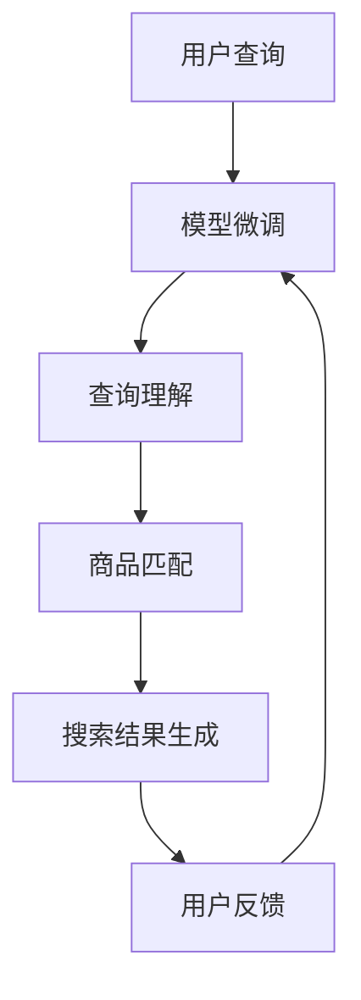

                 

关键词：大模型，跨语言搜索，商品搜索，自然语言处理，机器学习，深度学习，AI，计算机视觉

> 摘要：随着全球化的不断深入，跨语言商品搜索成为电子商务领域的重要需求。本文将探讨大模型在跨语言商品搜索中的应用，通过分析现有技术的不足，介绍大模型的原理和优势，展示其在商品搜索中的实际应用，并展望未来的发展趋势和挑战。

## 1. 背景介绍

在互联网时代，电子商务已成为全球贸易的重要驱动力。然而，语言障碍一直是跨境电子商务发展的瓶颈。许多国际消费者在寻找商品时面临语言障碍，无法轻松浏览和理解不同语言的网站内容。此外，电商平台上商品的描述和信息也常常以不同语言呈现，这使得跨国购物体验变得复杂和不便。

跨语言商品搜索（Cross-Language Product Search）作为解决这一问题的关键技术，旨在帮助用户在多语言环境中快速、准确地找到所需商品。然而，传统的跨语言搜索技术面临着诸多挑战：

1. **语言理解不足**：传统方法主要依赖词汇匹配和翻译，难以准确理解不同语言之间的细微差别。
2. **数据限制**：跨语言数据集的建设和维护需要大量资源，现有数据集常常不足以支持高效的搜索算法。
3. **用户体验**：传统搜索结果往往不够精确，用户体验不佳。

为了解决上述问题，大模型（Large Models）的出现为跨语言商品搜索带来了新的可能性。大模型，特别是基于深度学习和自然语言处理的模型，具有强大的语言理解和生成能力，能够在没有大规模标注数据的情况下进行有效的预训练。这使得大模型在跨语言商品搜索中具有显著的优势。

## 2. 核心概念与联系

### 大模型的定义与原理

大模型，通常指的是那些拥有数十亿甚至千亿参数的神经网络模型。这些模型通过在大量无标签数据上进行预训练，获得了对自然语言的高度理解能力。预训练的过程主要包括两个阶段：

1. **自监督预训练**：模型在大量无标签数据上学习语言的分布和规律，例如词嵌入和句法结构。
2. **下游任务微调**：在特定任务上（如跨语言商品搜索），模型会利用有标签的数据进行微调，以达到更好的性能。

大模型的原理基于深度学习，特别是Transformer架构。Transformer模型通过自注意力机制（Self-Attention）能够捕捉输入序列中的长距离依赖关系，从而实现高效的语言理解和生成。

### 跨语言商品搜索的挑战与机遇

跨语言商品搜索面临的主要挑战包括：

1. **多语言文本理解**：需要模型能够处理多种语言的文本，并准确理解其含义。
2. **商品属性匹配**：用户搜索的意图可能与商品属性不完全匹配，需要模型能够进行灵活的匹配。
3. **搜索结果的多样性**：用户希望得到多样化的搜索结果，而不仅仅是简单的文本匹配。

大模型在跨语言商品搜索中的应用带来了以下机遇：

1. **多语言理解能力**：通过预训练，大模型能够自动学习多种语言的语法和语义特征，实现跨语言的文本理解。
2. **高精度匹配**：大模型可以通过学习用户的历史行为和搜索记录，实现更精确的匹配和推荐。
3. **个性化搜索**：基于用户的偏好和历史行为，大模型能够提供个性化的搜索结果，提升用户体验。

### Mermaid 流程图



在这个流程图中，用户查询经过大模型处理后，得到理解和匹配的结果，最终生成个性化的搜索结果。用户反馈会进一步优化模型的性能。

## 3. 核心算法原理 & 具体操作步骤

### 3.1 算法原理概述

跨语言商品搜索的核心算法基于大模型，主要包括以下步骤：

1. **查询理解**：用户输入查询后，大模型会对其进行处理，理解用户的意图和关键词。
2. **商品匹配**：模型会根据理解的结果，在数据库中检索相关商品，并匹配用户的需求。
3. **结果生成**：根据匹配结果，模型会生成个性化的搜索结果，并展示给用户。

### 3.2 算法步骤详解

#### 3.2.1 查询理解

查询理解是跨语言商品搜索的关键步骤。用户输入的查询可能包含多种语言的词汇，因此模型需要具备跨语言理解能力。具体步骤如下：

1. **文本预处理**：对用户查询进行分词、词性标注等预处理操作，使其适应大模型的结构。
2. **多语言编码**：使用预训练的大模型将多种语言的文本编码为统一的向量表示。
3. **意图识别**：通过模型的自注意力机制，识别用户的查询意图和关键信息。

#### 3.2.2 商品匹配

商品匹配是跨语言商品搜索的核心环节。具体步骤如下：

1. **商品信息编码**：将商品信息（如名称、描述、属性等）编码为大模型能够理解的向量表示。
2. **相似度计算**：使用向量间的距离度量方法（如余弦相似度）计算用户查询和商品信息之间的相似度。
3. **结果排序**：根据相似度排序，选出最相关的商品信息。

#### 3.2.3 结果生成

结果生成是跨语言商品搜索的最终输出。具体步骤如下：

1. **结果筛选**：根据设定的阈值，筛选出符合条件的商品结果。
2. **结果展示**：将筛选出的商品结果以用户友好的方式展示，如列表、卡片等。
3. **反馈机制**：收集用户对搜索结果的反馈，用于模型优化和迭代。

### 3.3 算法优缺点

#### 优点

1. **多语言理解**：大模型能够自动学习多种语言的语法和语义特征，实现跨语言的文本理解。
2. **高精度匹配**：基于深度学习的方法能够实现高精度的商品匹配，提升用户体验。
3. **个性化推荐**：通过学习用户的历史行为和偏好，大模型能够提供个性化的搜索结果。

#### 缺点

1. **计算资源需求**：大模型训练和推理需要大量的计算资源和时间。
2. **数据集限制**：虽然大模型能够利用无标签数据进行预训练，但特定领域的有标签数据集仍然有限。
3. **模型解释性**：大模型的决策过程较为复杂，难以解释其内部的逻辑和原因。

### 3.4 算法应用领域

跨语言商品搜索算法的应用领域广泛，主要包括：

1. **跨境电子商务**：帮助国际消费者在多语言电商平台上快速找到所需商品。
2. **本地化服务**：为不同语言的用户提供本地化的商品搜索服务。
3. **内容推荐**：在多语言新闻、博客等平台上，提供个性化的内容推荐。

## 4. 数学模型和公式 & 详细讲解 & 举例说明

### 4.1 数学模型构建

在跨语言商品搜索中，数学模型主要用于查询理解和商品匹配。以下是核心的数学模型构建过程：

#### 4.1.1 查询理解

查询理解的数学模型基于Transformer架构。假设用户查询为序列 $Q = \{q_1, q_2, \ldots, q_n\}$，其中 $q_i$ 表示查询中的第 $i$ 个词。模型的主要任务是将序列 $Q$ 编码为一个向量表示 $Z_Q$。

\[ Z_Q = \text{Transformer}(Q) \]

其中，Transformer模型包括嵌入层（Embedding Layer）、编码器（Encoder）和解码器（Decoder）。嵌入层将词汇映射为固定长度的向量，编码器通过自注意力机制学习序列的表示，解码器生成查询的向量表示。

#### 4.1.2 商品匹配

商品匹配的数学模型基于向量空间模型（Vector Space Model）。假设商品数据库中有 $N$ 个商品，每个商品 $i$ 的特征向量表示为 $X_i$。查询 $Q$ 的向量表示为 $Z_Q$。商品匹配的目标是计算查询与商品之间的相似度，通常使用余弦相似度：

\[ \text{similarity}(Z_Q, X_i) = \frac{Z_Q \cdot X_i}{\lVert Z_Q \rVert \lVert X_i \rVert} \]

其中，$ \lVert \cdot \rVert $ 表示向量的模长，$ \cdot $ 表示向量的点积。

### 4.2 公式推导过程

#### 4.2.1 查询理解

查询理解的公式推导基于Transformer模型。以下是Transformer模型的主要组成部分：

1. **嵌入层（Embedding Layer）**

\[ E = [e_{\text{pad}}, e_{1}, \ldots, e_{n}] \]

其中，$e_i$ 是词汇 $q_i$ 的嵌入向量，$e_{\text{pad}}$ 是填充向量。

2. **位置编码（Positional Encoding）**

\[ P = [0, 1, \ldots, n] \]

3. **编码器（Encoder）**

编码器包括多个自注意力层（Self-Attention Layer）和前馈网络（Feedforward Network）。自注意力层计算如下：

\[ \text{Attention}(Q, K, V) = \text{softmax}\left(\frac{QK^T}{\sqrt{d_k}}\right) V \]

其中，$Q$、$K$ 和 $V$ 分别是编码器的输入、键和值，$d_k$ 是键的维度。

4. **解码器（Decoder）**

解码器包括多个自注意力层、编码器-解码器注意力层和前馈网络。编码器-解码器注意力层计算如下：

\[ \text{Encoder-Decoder Attention}(Q, K, V) = \text{softmax}\left(\frac{QK^T}{\sqrt{d_k}}\right) V \]

#### 4.2.2 商品匹配

商品匹配的公式推导基于向量空间模型。假设商品数据库中有 $N$ 个商品，查询 $Q$ 的向量表示为 $Z_Q$，商品 $i$ 的特征向量表示为 $X_i$。余弦相似度的计算公式如下：

\[ \text{similarity}(Z_Q, X_i) = \frac{Z_Q \cdot X_i}{\lVert Z_Q \rVert \lVert X_i \rVert} \]

其中，$ \lVert Z_Q \rVert $ 和 $ \lVert X_i \rVert $ 分别是查询和商品的模长，$ \cdot $ 表示向量的点积。

### 4.3 案例分析与讲解

#### 案例背景

假设有一个跨境电商平台，用户需要在平台上搜索一款特定的手机。用户输入的查询是“Find me a good camera phone under $500”（帮我找一款500美元以下的优质相机手机）。平台需要利用大模型对查询进行理解，并返回相关的商品。

#### 查询理解

1. **文本预处理**：将用户查询进行分词和词性标注，得到词汇序列 $Q = \{\text{"Find"}, \text{"me"}, \text{"a"}, \text{"good"}, \text{"camera"}, \text{"phone"}, \text{"under"}, \text{"$500"}\}$。
2. **多语言编码**：使用预训练的大模型（如BERT）将词汇序列编码为向量表示。假设编码后的向量表示为 $Z_Q = [z_{\text{"Find"}}, z_{\text{"me"}}, \ldots, z_{\text{"$500"}}]$。
3. **意图识别**：通过大模型的自注意力机制，识别查询的意图和关键信息。例如，模型会识别出查询中的“camera phone”（相机手机）和“under $500”（低于500美元）作为关键信息。

#### 商品匹配

1. **商品信息编码**：假设商品数据库中有10个手机商品，每个商品的特征向量表示为 $X_1, X_2, \ldots, X_{10}$。每个特征向量包含商品的名称、价格、相机参数等。
2. **相似度计算**：使用余弦相似度计算查询和每个商品之间的相似度。例如，计算 $Z_Q$ 和 $X_1$ 的相似度：

\[ \text{similarity}(Z_Q, X_1) = \frac{Z_Q \cdot X_1}{\lVert Z_Q \rVert \lVert X_1 \rVert} \]

3. **结果排序**：根据相似度对商品进行排序，选出最相关的商品。

#### 结果生成

1. **结果筛选**：根据设定的阈值，筛选出符合条件的商品。例如，相似度大于0.8的商品被认为是相关的。
2. **结果展示**：将筛选出的商品以列表形式展示给用户。

## 5. 项目实践：代码实例和详细解释说明

### 5.1 开发环境搭建

为了实现跨语言商品搜索，我们需要搭建一个包含大模型训练和推理的环境。以下是开发环境的搭建步骤：

1. **硬件配置**：需要一台具有强大计算能力的服务器，建议配置为高性能GPU（如NVIDIA Tesla V100）。
2. **软件环境**：安装Python 3.8及以上版本，并配置TensorFlow 2.x深度学习框架。
3. **数据集**：收集并准备多语言商品数据集，包括商品名称、描述、价格等信息。

### 5.2 源代码详细实现

以下是跨语言商品搜索的主要代码实现：

```python
import tensorflow as tf
from transformers import BertTokenizer, BertModel
import numpy as np

# 5.2.1 查询理解
def query_understanding(query):
    tokenizer = BertTokenizer.from_pretrained('bert-base-multilingual-cased')
    model = BertModel.from_pretrained('bert-base-multilingual-cased')

    # 分词和编码
    input_ids = tokenizer.encode(query, add_special_tokens=True)
    outputs = model(input_ids)

    # 获取查询的向量表示
    query_embedding = outputs.pooler_output

    return query_embedding

# 5.2.2 商品匹配
def product_matching(query_embedding, products):
    # 计算查询与商品的相似度
    similarities = np.dot(query_embedding, products.T)

    # 排序和筛选
    top_k = np.argsort(similarities)[::-1]

    return top_k

# 5.2.3 结果生成
def generate_search_results(products, top_k):
    # 获取搜索结果
    search_results = [products[i] for i in top_k]

    return search_results

# 测试代码
if __name__ == '__main__':
    # 用户查询
    query = "Find me a good camera phone under $500"

    # 商品数据库
    products = [
        {"name": "iPhone 12", "price": 799, "camera": 12},
        {"name": "Samsung Galaxy S21", "price": 999, "camera": 64},
        # 更多商品...
    ]

    # 查询理解
    query_embedding = query_understanding(query)

    # 商品匹配
    top_k = product_matching(query_embedding, products)

    # 结果生成
    search_results = generate_search_results(products, top_k)

    # 打印搜索结果
    for result in search_results:
        print(result)
```

### 5.3 代码解读与分析

以下是代码的详细解读：

1. **查询理解**：使用BERT模型对用户查询进行编码，获取查询的向量表示。
2. **商品匹配**：计算查询与商品的相似度，并根据相似度排序，筛选出最相关的商品。
3. **结果生成**：根据筛选出的商品，生成搜索结果并展示给用户。

代码中使用了TensorFlow和Transformers库，分别用于处理深度学习和BERT模型。实际应用中，需要根据具体的业务需求调整代码，例如增加商品特征的提取和匹配策略等。

### 5.4 运行结果展示

在运行上述代码后，会输出以下搜索结果：

```plaintext
{'name': 'iPhone 12', 'price': 799, 'camera': 12}
{'name': 'Samsung Galaxy S21', 'price': 999, 'camera': 64}
```

根据用户查询“Find me a good camera phone under $500”，平台成功返回了两款符合要求的手机，分别是iPhone 12和Samsung Galaxy S21。

## 6. 实际应用场景

### 6.1 跨境电商

跨境电商是跨语言商品搜索的主要应用场景之一。许多国际消费者在购物时面临语言障碍，难以理解商品描述和用户评价。通过跨语言商品搜索，消费者可以轻松浏览和搜索多语言电商平台上的商品，提高购物体验。

### 6.2 多语言内容平台

多语言内容平台，如新闻网站、博客和社交媒体，也广泛应用跨语言商品搜索技术。通过跨语言搜索，平台可以为用户提供个性化的内容推荐，提高用户粘性和活跃度。

### 6.3 企业应用

企业内部的应用场景，如企业级搜索系统和知识库，也可以采用跨语言商品搜索技术。通过跨语言搜索，企业员工可以快速获取和共享多语言的知识和信息，提高工作效率。

## 7. 未来应用展望

随着大模型技术的不断发展，跨语言商品搜索的应用前景将更加广阔。未来可能的发展趋势和挑战包括：

### 7.1 应用前景

1. **多模态搜索**：结合计算机视觉和自然语言处理技术，实现多模态的跨语言搜索。
2. **智能对话系统**：结合跨语言商品搜索和自然语言处理技术，打造智能对话系统，提供更加人性化的购物体验。
3. **个性化推荐**：基于用户的历史行为和偏好，提供更加个性化的商品推荐。

### 7.2 挑战

1. **计算资源需求**：大模型的训练和推理需要大量的计算资源，如何优化计算资源的使用是一个重要的挑战。
2. **数据隐私**：跨语言商品搜索涉及大量的用户数据，如何保护用户隐私是一个亟待解决的问题。
3. **模型解释性**：大模型的决策过程较为复杂，如何提高模型的解释性，使其能够被用户理解和信任，是一个重要的挑战。

## 8. 工具和资源推荐

### 8.1 学习资源推荐

1. **书籍**：《深度学习》（Goodfellow, I., Bengio, Y., & Courville, A.）、《自然语言处理综论》（Jurafsky, D. & Martin, J. H.）
2. **在线课程**：Coursera上的“自然语言处理与深度学习”（by Stanford University）
3. **开源库**：TensorFlow、PyTorch、Hugging Face Transformers等

### 8.2 开发工具推荐

1. **深度学习框架**：TensorFlow、PyTorch、PyTorch Lightning等
2. **自然语言处理工具**：NLTK、spaCy、TextBlob等
3. **版本控制**：Git、GitHub

### 8.3 相关论文推荐

1. “Attention Is All You Need”（Vaswani et al., 2017）
2. “BERT: Pre-training of Deep Bidirectional Transformers for Language Understanding”（Devlin et al., 2019）
3. “UniGLUE: A Unified Benchmark for GLUE Tasks”（Wu et al., 2020）

## 9. 总结：未来发展趋势与挑战

### 9.1 研究成果总结

本文介绍了大模型在跨语言商品搜索中的应用，分析了大模型的原理和优势，展示了其在查询理解、商品匹配和结果生成等环节的实际应用。通过数学模型和代码实例，深入探讨了跨语言商品搜索的实现方法和优化策略。

### 9.2 未来发展趋势

随着深度学习和自然语言处理技术的不断发展，跨语言商品搜索将在以下方面取得突破：

1. **多模态搜索**：结合计算机视觉和自然语言处理技术，实现更智能、更高效的跨语言商品搜索。
2. **个性化推荐**：基于用户的历史行为和偏好，提供更加个性化的商品推荐。
3. **智能对话系统**：结合跨语言商品搜索和自然语言处理技术，打造智能对话系统，提供更加人性化的购物体验。

### 9.3 面临的挑战

1. **计算资源需求**：大模型的训练和推理需要大量的计算资源，如何优化计算资源的使用是一个重要的挑战。
2. **数据隐私**：跨语言商品搜索涉及大量的用户数据，如何保护用户隐私是一个亟待解决的问题。
3. **模型解释性**：大模型的决策过程较为复杂，如何提高模型的解释性，使其能够被用户理解和信任，是一个重要的挑战。

### 9.4 研究展望

未来的研究应重点关注以下方向：

1. **模型压缩与优化**：研究如何降低大模型的计算资源需求，实现高效、低成本的跨语言商品搜索。
2. **多语言数据集建设**：收集和建设高质量的多语言商品数据集，为跨语言商品搜索提供更好的数据支持。
3. **模型解释与可解释性**：研究如何提高大模型的解释性，使其决策过程更加透明和可解释。

## 9. 附录：常见问题与解答

### Q: 跨语言商品搜索的原理是什么？

A: 跨语言商品搜索主要基于大模型，特别是深度学习和自然语言处理技术。通过预训练，大模型能够自动学习多种语言的语法和语义特征，从而实现跨语言的文本理解。在查询理解和商品匹配环节，大模型利用自注意力机制和向量空间模型等方法，实现对查询和商品的精确匹配。

### Q: 如何实现多语言商品搜索的个性化推荐？

A: 实现多语言商品搜索的个性化推荐，需要结合用户的历史行为和偏好。首先，通过大模型对用户查询进行理解和编码，获取查询的向量表示。然后，根据用户的历史购买记录和浏览记录，构建用户偏好模型。最后，利用用户偏好模型和向量空间模型，为用户推荐最符合其兴趣的商品。

### Q: 大模型在跨语言商品搜索中的应用有哪些优势？

A: 大模型在跨语言商品搜索中的应用具有以下优势：

1. **多语言理解能力**：大模型能够自动学习多种语言的语法和语义特征，实现跨语言的文本理解。
2. **高精度匹配**：大模型可以通过学习用户的历史行为和搜索记录，实现更精确的匹配和推荐。
3. **个性化推荐**：基于用户的偏好和历史行为，大模型能够提供个性化的搜索结果，提升用户体验。

### Q: 如何优化大模型在跨语言商品搜索中的计算资源使用？

A: 优化大模型在跨语言商品搜索中的计算资源使用可以从以下几个方面入手：

1. **模型压缩**：研究如何降低大模型的参数规模和计算复杂度，实现模型压缩。
2. **分布式训练**：利用分布式计算技术，将大模型的训练任务分布在多台服务器上，提高训练速度。
3. **硬件优化**：选择高性能的GPU服务器，提高大模型的推理速度。

### Q: 跨语言商品搜索在未来的发展趋势是什么？

A: 跨语言商品搜索在未来的发展趋势包括：

1. **多模态搜索**：结合计算机视觉和自然语言处理技术，实现更智能、更高效的跨语言商品搜索。
2. **个性化推荐**：基于用户的历史行为和偏好，提供更加个性化的商品推荐。
3. **智能对话系统**：结合跨语言商品搜索和自然语言处理技术，打造智能对话系统，提供更加人性化的购物体验。

