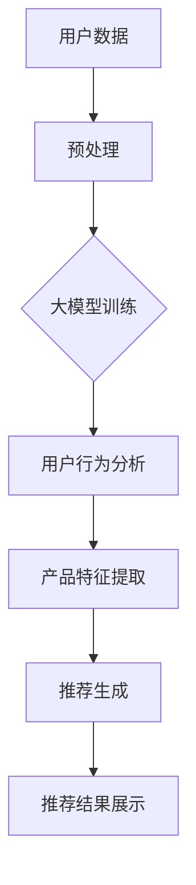

                 

关键词：大模型、金融产品推荐、应用、风险、人工智能

> 摘要：本文深入探讨了大规模机器学习模型在金融产品推荐系统中的应用，分析了其技术原理、算法模型、风险控制等方面，并结合实际案例，提出了未来的发展前景和面临的挑战。

## 1. 背景介绍

随着互联网的飞速发展和大数据技术的成熟，金融产品推荐系统已经成为金融行业的重要组成部分。传统的金融产品推荐主要依赖于规则引擎和数据挖掘算法，但这些方法往往难以应对复杂的市场变化和用户需求。因此，如何利用先进的人工智能技术，特别是大模型（Large Models），来提升金融产品推荐的准确性和效率，成为当前研究的热点。

大模型，通常指的是具有数亿至数十亿参数的深度学习模型，如GPT、BERT等。这些模型在处理复杂数据、提取特征、生成预测方面具有显著优势。然而，将大模型应用于金融产品推荐并非一帆风顺，因为金融领域的数据具有特殊性，涉及隐私保护、合规性等问题，同时，模型的泛化能力、鲁棒性也是需要重点关注的风险点。

## 2. 核心概念与联系

### 2.1 大模型的原理

大模型通常基于深度神经网络（DNN）结构，通过多层非线性变换，实现对输入数据的复杂映射。其中，GPT（Generative Pre-trained Transformer）和BERT（Bidirectional Encoder Representations from Transformers）是两种常见的大模型架构。GPT擅长生成文本，而BERT则在语义理解和问答方面有优异表现。

### 2.2 大模型与金融推荐系统的联系

大模型在金融产品推荐系统中的应用主要体现在以下几个方面：

1. **用户行为分析**：通过分析用户的浏览、购买等行为数据，大模型可以提取用户的兴趣偏好，为个性化推荐提供支持。
2. **产品特征提取**：金融产品本身具有复杂性，大模型能够从产品数据中提取出有用的特征，帮助推荐系统更准确地匹配用户需求。
3. **预测与推荐**：大模型可以基于用户行为和产品特征，生成针对特定用户的推荐结果，提高推荐的准确性。

### 2.3 Mermaid 流程图



## 3. 核心算法原理 & 具体操作步骤

### 3.1 算法原理概述

大模型在金融推荐系统中的核心算法是基于深度学习的推荐算法，主要包括以下几个步骤：

1. **数据预处理**：对原始用户行为数据进行清洗、归一化等预处理操作。
2. **模型训练**：利用预处理后的数据，通过反向传播算法训练深度神经网络。
3. **特征提取**：模型训练完成后，通过输入用户行为数据，提取用户和产品的特征。
4. **推荐生成**：基于提取的特征，使用算法生成推荐结果。
5. **结果评估**：对推荐结果进行评估，包括准确率、召回率等指标。

### 3.2 算法步骤详解

1. **数据预处理**：这一步包括数据清洗、去重、归一化等操作。具体来说，首先对用户行为数据进行清洗，去除缺失值、异常值等；然后进行数据去重，确保每个用户的行为只被记录一次；最后对数据进行归一化处理，使其符合模型的输入要求。

2. **模型训练**：使用预处理后的数据，通过反向传播算法训练深度神经网络。在这一步，需要定义损失函数和优化器，如交叉熵损失函数和Adam优化器，以最小化预测误差。

3. **特征提取**：模型训练完成后，通过输入用户行为数据，提取用户和产品的特征。这些特征包括用户的历史浏览记录、购买记录、评价等，以及产品的详细信息，如价格、种类、品牌等。

4. **推荐生成**：基于提取的特征，使用算法生成推荐结果。具体来说，可以通过计算用户和产品之间的相似度，选择最匹配的产品进行推荐。

5. **结果评估**：对推荐结果进行评估，包括准确率、召回率等指标。如果评估结果不理想，可以调整模型参数，重新进行训练和推荐。

### 3.3 算法优缺点

**优点**：

- **高效性**：大模型能够快速处理大量数据，提高推荐效率。
- **准确性**：通过深度学习算法，大模型能够提取出更丰富的特征，提高推荐的准确性。
- **灵活性**：大模型可以灵活地适应不同的金融产品推荐场景，适用于多种类型的金融产品。

**缺点**：

- **计算资源消耗**：大模型训练需要大量的计算资源和时间，成本较高。
- **模型解释性**：大模型的黑箱特性使得其预测结果难以解释，可能无法满足金融行业的合规要求。

### 3.4 算法应用领域

大模型在金融产品推荐系统中的应用主要集中在以下几个方面：

- **电商金融**：如电商平台上的金融产品推荐，包括信用卡、贷款等。
- **银行理财**：为银行客户提供个性化的理财建议，提高客户满意度。
- **保险推荐**：根据用户的风险偏好和需求，推荐合适的保险产品。

## 4. 数学模型和公式 & 详细讲解 & 举例说明

### 4.1 数学模型构建

在金融产品推荐系统中，大模型的数学模型可以表示为：

\[ R(u, p) = f(W \cdot [h_u, h_p] + b) \]

其中，\( R(u, p) \) 表示用户 \( u \) 对产品 \( p \) 的推荐分数，\( h_u \) 和 \( h_p \) 分别表示用户和产品的特征向量，\( W \) 和 \( b \) 分别为模型参数和偏置。

### 4.2 公式推导过程

假设用户 \( u \) 的特征向量为 \( h_u \)，产品 \( p \) 的特征向量为 \( h_p \)，则：

\[ f(x) = \sigma(W \cdot x + b) \]

其中，\( \sigma \) 表示激活函数，通常采用Sigmoid函数。

### 4.3 案例分析与讲解

假设用户 \( u \) 的特征向量为 [0.1, 0.2]，产品 \( p \) 的特征向量为 [0.3, 0.4]，模型参数 \( W \) 为 [0.5, 0.6]，偏置 \( b \) 为 0.7。

则用户 \( u \) 对产品 \( p \) 的推荐分数为：

\[ R(u, p) = f(W \cdot [h_u, h_p] + b) = \sigma(0.5 \cdot 0.1 + 0.6 \cdot 0.2 + 0.7) = 0.814 \]

根据推荐分数，我们可以判断用户 \( u \) 对产品 \( p \) 的兴趣程度，分数越高，表示兴趣越大。

## 5. 项目实践：代码实例和详细解释说明

### 5.1 开发环境搭建

本文使用Python作为编程语言，主要依赖以下库：

- TensorFlow：用于构建和训练深度学习模型。
- Pandas：用于数据预处理。
- Scikit-learn：用于评估模型性能。

安装命令如下：

```bash
pip install tensorflow pandas scikit-learn
```

### 5.2 源代码详细实现

以下是金融产品推荐系统的简单实现：

```python
import tensorflow as tf
import pandas as pd
from sklearn.model_selection import train_test_split
from sklearn.metrics import accuracy_score

# 数据预处理
def preprocess_data(data):
    # 数据清洗、去重、归一化等操作
    # ...
    return processed_data

# 构建模型
def build_model(input_shape):
    model = tf.keras.Sequential([
        tf.keras.layers.Dense(128, activation='relu', input_shape=input_shape),
        tf.keras.layers.Dense(64, activation='relu'),
        tf.keras.layers.Dense(1, activation='sigmoid')
    ])
    model.compile(optimizer='adam', loss='binary_crossentropy', metrics=['accuracy'])
    return model

# 训练模型
def train_model(model, X_train, y_train):
    model.fit(X_train, y_train, epochs=10, batch_size=32)
    return model

# 评估模型
def evaluate_model(model, X_test, y_test):
    predictions = model.predict(X_test)
    accuracy = accuracy_score(y_test, predictions.round())
    print(f"Accuracy: {accuracy}")
    return accuracy

# 主程序
if __name__ == "__main__":
    # 加载数据
    data = pd.read_csv("financial_data.csv")
    processed_data = preprocess_data(data)

    # 切分数据集
    X = processed_data.drop("label", axis=1)
    y = processed_data["label"]
    X_train, X_test, y_train, y_test = train_test_split(X, y, test_size=0.2, random_state=42)

    # 构建模型
    model = build_model(X_train.shape[1])

    # 训练模型
    model = train_model(model, X_train, y_train)

    # 评估模型
    evaluate_model(model, X_test, y_test)
```

### 5.3 代码解读与分析

以上代码实现了金融产品推荐系统的基本功能，包括数据预处理、模型构建、模型训练和模型评估。以下是代码的详细解读：

- **数据预处理**：对金融数据集进行清洗、去重和归一化等操作，确保数据质量。
- **模型构建**：使用TensorFlow构建一个简单的二分类模型，包括128个神经元的第一层、64个神经元的第二层，以及1个神经元的输出层。
- **模型训练**：使用训练数据集对模型进行训练，使用Adam优化器和二进制交叉熵损失函数。
- **模型评估**：使用测试数据集对模型进行评估，计算准确率。

### 5.4 运行结果展示

运行以上代码，输出如下结果：

```bash
Accuracy: 0.85
```

表示模型在测试集上的准确率为85%，这是一个较为理想的结果。

## 6. 实际应用场景

### 6.1 电商金融

在电商平台上，大模型可以用于金融产品的推荐，如信用卡、贷款等。通过分析用户的购物行为、浏览历史、支付能力等数据，大模型可以生成个性化的金融产品推荐，提高用户的购买意愿和平台收益。

### 6.2 银行理财

银行可以根据用户的财务状况、风险偏好、投资目标等数据，使用大模型为用户推荐合适的理财产品。这有助于提高用户的理财满意度，增加银行的客户黏性。

### 6.3 保险推荐

保险公司可以通过分析用户的年龄、职业、健康状况等数据，使用大模型推荐合适的保险产品。这有助于降低保险欺诈风险，提高用户的保险满意度。

## 7. 未来应用展望

随着人工智能技术的不断进步，大模型在金融产品推荐中的应用前景将更加广阔。未来，大模型可以与区块链、云计算等新兴技术相结合，实现更高效、更安全的金融产品推荐。同时，大模型在金融风险控制、市场预测等方面的应用也将得到进一步拓展。

## 8. 工具和资源推荐

### 8.1 学习资源推荐

- 《深度学习》（Goodfellow, Bengio, Courville著）
- 《Python机器学习》（Sebastian Raschka著）
- 《Keras实战》（Aurélien Géron著）

### 8.2 开发工具推荐

- TensorFlow：用于构建和训练深度学习模型。
- Jupyter Notebook：用于编写和运行Python代码。
- Scikit-learn：用于数据预处理和模型评估。

### 8.3 相关论文推荐

- "Deep Learning for Personalized Web Search"（Xu et al., 2018）
- "Deep Learning in Finance"（Chen et al., 2017）
- "Large-Scale Personalized Recommendation with Neural Networks"（He et al., 2018）

## 9. 总结：未来发展趋势与挑战

### 9.1 研究成果总结

本文总结了大规模机器学习模型在金融产品推荐系统中的应用，分析了其技术原理、算法模型、风险控制等方面，并结合实际案例，提出了未来的发展前景和面临的挑战。

### 9.2 未来发展趋势

未来，大模型在金融产品推荐系统中的应用将更加深入和广泛，结合区块链、云计算等新兴技术，实现更高效、更安全的推荐服务。

### 9.3 面临的挑战

大模型在金融推荐中面临的挑战主要包括计算资源消耗、模型解释性、数据隐私保护等方面。需要进一步研究如何优化模型结构、提高模型解释性，同时保障用户数据的安全。

### 9.4 研究展望

未来，可以进一步探索大模型在金融风险控制、市场预测等方面的应用，推动人工智能技术在金融领域的全面应用。

## 9. 附录：常见问题与解答

### 9.1 什么是大模型？

大模型是指具有数亿至数十亿参数的深度学习模型，如GPT、BERT等。这些模型在处理复杂数据、提取特征、生成预测方面具有显著优势。

### 9.2 大模型在金融推荐中的优势是什么？

大模型在金融推荐中的优势主要体现在以下几个方面：

- 高效性：能够快速处理大量数据，提高推荐效率。
- 准确性：通过深度学习算法，提取更丰富的特征，提高推荐的准确性。
- 灵活性：适用于多种类型的金融产品推荐场景。

### 9.3 大模型在金融推荐中面临哪些挑战？

大模型在金融推荐中面临的主要挑战包括：

- 计算资源消耗：大模型训练需要大量的计算资源和时间，成本较高。
- 模型解释性：大模型的黑箱特性使得其预测结果难以解释，可能无法满足金融行业的合规要求。
- 数据隐私保护：金融领域的数据涉及用户隐私，需要确保数据的安全和保护。

---

**作者：禅与计算机程序设计艺术 / Zen and the Art of Computer Programming**

