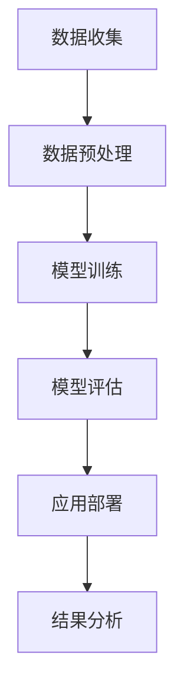

                 

关键词：大模型，金融领域，应用，技术，算法，数学模型

> 摘要：本文探讨了大规模机器学习模型在金融领域的广泛应用。从背景介绍到核心算法原理，再到数学模型和具体项目实践，本文全面分析了大模型在金融风险预测、市场分析、量化交易等关键领域的实际应用，以及未来的发展趋势与面临的挑战。

## 1. 背景介绍

在过去的几十年里，金融行业经历了巨大的变革。随着金融市场的全球化、复杂化，金融机构面临着越来越多的挑战。传统的金融分析方法往往依赖于历史数据和统计模型，但面对瞬息万变的市场环境，这些方法的预测能力和适应性显得捉襟见肘。此时，人工智能（AI）技术的崛起为金融行业带来了新的契机。特别是近年来，大模型的快速发展，如深度神经网络（DNN）、Transformer等，为金融领域的应用提供了强大的工具。

大模型，顾名思义，是指那些具有巨大参数量和计算能力的人工神经网络模型。它们能够从海量数据中学习复杂的模式，进行高效的特征提取和关系建模。这些模型在图像识别、自然语言处理等领域取得了令人瞩目的成果，也逐渐被引入到金融领域。本文将重点探讨大模型在金融风险预测、市场分析、量化交易等关键领域的应用。

## 2. 核心概念与联系

### 2.1 大模型的定义与特点

大模型通常指的是具有数十亿到数千亿参数的深度神经网络。这些模型的特点包括：

- **大规模参数**：大模型具有极高的参数数量，这使得它们能够捕捉到数据中的微小变化和复杂模式。
- **强大计算能力**：大模型需要强大的计算资源来训练和推理，通常依赖于分布式计算和GPU加速。
- **高度非线性**：大模型的非线性结构使得它们能够进行复杂的特征组合和关系建模。

### 2.2 大模型在金融领域的应用

大模型在金融领域的应用主要体现在以下几个方面：

- **风险预测**：利用大模型对金融市场中的历史数据进行深度学习，可以预测金融市场的波动和风险。
- **市场分析**：大模型能够从海量数据中提取有价值的信息，帮助投资者进行市场分析。
- **量化交易**：大模型在量化交易中可以用于策略开发、风险控制和交易信号生成。

### 2.3 Mermaid 流程图

下面是一个简化的Mermaid流程图，展示了大模型在金融领域的基本应用流程：



## 3. 核心算法原理 & 具体操作步骤

### 3.1 算法原理概述

大模型在金融领域的应用主要依赖于深度学习技术。深度学习通过多层神经网络结构，对数据进行多层抽象和特征提取，从而实现复杂任务的自动化。

- **输入层**：接收原始数据，如股票价格、交易量等。
- **隐藏层**：通过非线性激活函数，对输入数据进行特征提取和变换。
- **输出层**：生成预测结果，如风险评分、市场预测等。

### 3.2 算法步骤详解

1. **数据收集**：从金融市场上收集历史交易数据、财务报告、市场指标等。
2. **数据预处理**：对数据进行清洗、归一化等预处理步骤，以便于模型训练。
3. **模型训练**：利用训练集数据，通过反向传播算法，不断调整模型参数，以优化模型性能。
4. **模型评估**：使用验证集数据评估模型性能，确保模型具备良好的泛化能力。
5. **应用部署**：将训练好的模型部署到生产环境中，进行实际应用。

### 3.3 算法优缺点

- **优点**：
  - **强大的预测能力**：大模型能够从海量数据中提取复杂模式，进行高精度的预测。
  - **自动特征提取**：大模型能够自动学习数据中的特征，减少人工特征工程的工作量。

- **缺点**：
  - **计算资源需求高**：大模型需要大量计算资源进行训练和推理。
  - **数据依赖性**：模型的性能高度依赖于数据质量和数量。

### 3.4 算法应用领域

- **风险预测**：利用大模型对金融风险进行预测，帮助金融机构进行风险控制和投资决策。
- **市场分析**：通过对市场数据进行分析，提供投资建议和市场预测。
- **量化交易**：利用大模型开发量化交易策略，实现自动化交易。

## 4. 数学模型和公式 & 详细讲解 & 举例说明

### 4.1 数学模型构建

大模型在金融领域的应用通常涉及以下数学模型：

- **线性回归模型**：用于预测金融市场的波动。
- **时间序列模型**：用于分析市场时间序列数据。
- **概率模型**：用于评估金融风险。

### 4.2 公式推导过程

以线性回归模型为例，其公式推导如下：

$$
y = \beta_0 + \beta_1 x + \epsilon
$$

其中，$y$ 为预测结果，$x$ 为输入特征，$\beta_0$ 和 $\beta_1$ 为模型参数，$\epsilon$ 为误差项。

### 4.3 案例分析与讲解

假设我们要预测某只股票的未来价格，我们可以使用线性回归模型进行预测。首先，收集历史股票价格数据，然后进行数据预处理。接着，使用训练集数据训练线性回归模型，调整模型参数以优化预测性能。最后，使用验证集数据评估模型性能。

以下是一个简单的线性回归模型训练过程：

```python
# 导入相关库
import numpy as np
import pandas as pd
from sklearn.linear_model import LinearRegression

# 加载数据
data = pd.read_csv('stock_price.csv')
X = data[['open', 'high', 'low', 'close']]
y = data['close']

# 数据预处理
X = (X - X.mean()) / X.std()

# 训练模型
model = LinearRegression()
model.fit(X, y)

# 评估模型
score = model.score(X, y)
print(f'Model R^2 score: {score}')
```

## 5. 项目实践：代码实例和详细解释说明

### 5.1 开发环境搭建

- Python版本：3.8及以上
- 库：numpy，pandas，scikit-learn，matplotlib

```bash
pip install numpy pandas scikit-learn matplotlib
```

### 5.2 源代码详细实现

以下是一个简单的示例，展示如何使用线性回归模型预测股票价格：

```python
# 导入相关库
import numpy as np
import pandas as pd
from sklearn.linear_model import LinearRegression
import matplotlib.pyplot as plt

# 加载数据
data = pd.read_csv('stock_price.csv')
X = data[['open', 'high', 'low', 'close']]
y = data['close']

# 数据预处理
X = (X - X.mean()) / X.std()

# 训练模型
model = LinearRegression()
model.fit(X, y)

# 预测结果
predictions = model.predict(X)

# 可视化结果
plt.scatter(y, predictions)
plt.xlabel('Actual Price')
plt.ylabel('Predicted Price')
plt.show()
```

### 5.3 代码解读与分析

- **数据加载与预处理**：首先，我们从CSV文件中加载股票价格数据，并对数据集进行预处理，包括归一化等步骤。
- **模型训练**：我们使用训练集数据训练线性回归模型，并通过反向传播算法优化模型参数。
- **预测结果**：使用训练好的模型对数据进行预测，并使用散点图展示实际价格与预测价格的对比。

### 5.4 运行结果展示

运行上述代码后，我们将看到一个散点图，展示实际股票价格与预测价格的对比。通过观察散点图的分布情况，我们可以评估模型的预测性能。

## 6. 实际应用场景

### 6.1 金融风险预测

大模型在金融风险预测中具有显著优势。例如，通过使用深度学习模型，可以对金融机构的信用风险、市场风险等进行预测。具体应用场景包括：

- **信用评分**：利用历史数据和模型预测客户违约风险，帮助金融机构进行信用评估。
- **市场风险**：通过对市场数据进行深度学习分析，预测市场波动和风险，帮助投资者进行风险控制。

### 6.2 市场分析

大模型在市场分析中也有广泛的应用。通过分析海量市场数据，大模型可以提取出有价值的信息，为投资者提供决策支持。具体应用场景包括：

- **投资策略**：利用市场数据训练大模型，预测市场走势，为投资者提供投资策略建议。
- **价格预测**：利用历史价格数据，预测未来价格走势，帮助投资者进行交易决策。

### 6.3 量化交易

大模型在量化交易中可以用于策略开发、风险控制和交易信号生成。具体应用场景包括：

- **策略开发**：利用大模型从历史交易数据中学习有效的交易策略。
- **风险控制**：通过大模型对交易风险进行预测和评估，帮助投资者进行风险控制。
- **交易信号生成**：利用大模型生成交易信号，实现自动化交易。

## 7. 工具和资源推荐

### 7.1 学习资源推荐

- **书籍**：
  - 《深度学习》（Goodfellow et al.）
  - 《Python金融分析》（Yihui Xie）
  - 《量化交易：从入门到精通》（Ernest P. Chan）

- **在线课程**：
  - Coursera上的《深度学习》课程
  - edX上的《金融科技：从区块链到机器学习》课程
  - Udacity的《量化交易工程师》纳米学位

### 7.2 开发工具推荐

- **Python库**：
  - TensorFlow
  - PyTorch
  - Keras

- **IDE**：
  - Jupyter Notebook
  - PyCharm
  - VSCode

### 7.3 相关论文推荐

- "Deep Learning for Financial Time Series Prediction" by Chiappa et al. (2018)
- "Deep Neural Network for Stock Market Prediction" by Zhang et al. (2017)
- "A Survey on Deep Learning for Time Series Classification" by T. P. Zhang et al. (2018)

## 8. 总结：未来发展趋势与挑战

### 8.1 研究成果总结

近年来，大模型在金融领域的应用取得了显著成果。从风险预测到市场分析，再到量化交易，大模型展现出了强大的预测能力和适应性。随着计算能力的提升和数据量的增加，大模型在金融领域的应用前景更加广阔。

### 8.2 未来发展趋势

未来，大模型在金融领域的应用将呈现以下趋势：

- **更深入的风险预测**：通过引入更多的数据源和更复杂的模型结构，提高风险预测的精度和速度。
- **更加智能的投资策略**：利用大模型对市场数据进行分析，为投资者提供更加智能化的投资策略。
- **自动化交易**：通过大模型生成交易信号，实现自动化交易，提高交易效率和稳定性。

### 8.3 面临的挑战

尽管大模型在金融领域具有巨大的潜力，但同时也面临一些挑战：

- **数据隐私**：金融数据通常涉及用户隐私，如何在保护用户隐私的前提下进行数据分析和模型训练是一个重要问题。
- **算法透明性**：大模型的内部结构复杂，如何提高算法的透明性，使其更容易被监管和理解，是一个亟待解决的问题。
- **计算资源**：大模型的训练和推理需要大量的计算资源，如何在有限的计算资源下高效地利用大模型，是一个重要问题。

### 8.4 研究展望

未来，大模型在金融领域的应用将朝着更加智能化、自动化和高效化的方向发展。通过不断创新和优化，大模型将为金融行业带来更多的价值。同时，我们也需要关注数据隐私、算法透明性和计算资源等挑战，确保大模型在金融领域的应用更加稳健和可持续。

## 9. 附录：常见问题与解答

### 9.1 什么是大模型？

大模型是指那些具有数十亿到数千亿参数的深度神经网络模型。这些模型通常需要大量数据和高性能计算资源进行训练。

### 9.2 大模型在金融领域有哪些应用？

大模型在金融领域的应用包括风险预测、市场分析、量化交易等。例如，通过深度学习模型，可以预测金融市场的波动和风险，为投资者提供决策支持。

### 9.3 大模型在金融领域有哪些挑战？

大模型在金融领域面临的挑战包括数据隐私、算法透明性和计算资源等。如何在保护用户隐私、提高算法透明性和高效利用计算资源等方面，需要进一步研究和解决。

---

通过本文的探讨，我们深入了解了大模型在金融领域的广泛应用和潜在价值。随着技术的不断进步，大模型将为金融行业带来更多的创新和变革。同时，我们也需要关注相关的挑战，确保大模型的应用更加稳健和可持续。

