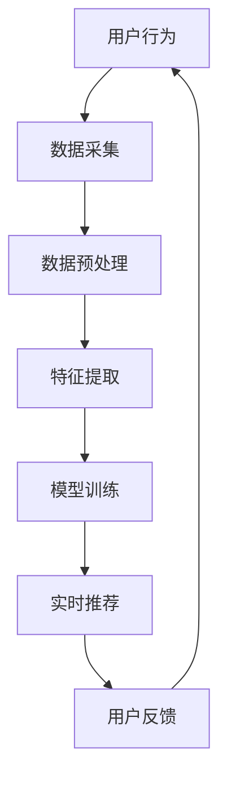

                 

 关键词：大模型、实时推荐、个性化推荐、电商平台、优化策略、算法原理、数学模型、项目实践

> 摘要：本文旨在探讨如何利用大模型技术来优化电商平台的实时个性化推荐系统。通过深入分析核心算法原理、数学模型构建、项目实践以及未来应用展望，本文为业界提供了一套完整的技术解决方案，旨在提高推荐系统的实时响应能力和个性化精准度。

## 1. 背景介绍

在互联网快速发展的今天，电商平台已成为消费者购买商品的主要渠道之一。为了提升用户体验，电商平台纷纷引入了个性化推荐系统，以帮助用户发现他们可能感兴趣的商品。然而，传统的推荐系统往往面临响应速度慢、推荐结果不准确等难题。

### 1.1 传统推荐系统存在的问题

1. **计算效率低**：传统的推荐系统通常依赖于复杂的特征工程和模型训练，导致计算量大，响应时间过长。
2. **个性化不足**：传统方法难以捕捉用户的实时行为，导致推荐结果缺乏个性化和实时性。
3. **模型更新缓慢**：在大量数据和高频率更新场景下，传统模型难以快速适应用户行为的动态变化。

### 1.2 大模型的优势

大模型，即大规模神经网络模型，以其强大的特征提取和建模能力，为推荐系统的优化提供了新的可能性。大模型具有以下优势：

1. **高效计算**：大模型可以通过分布式计算和优化技术，提高计算效率，实现实时响应。
2. **高精度推荐**：大模型能够处理海量数据，捕捉用户行为模式的微小变化，从而提高推荐结果的准确性。
3. **自适应能力强**：大模型能够快速适应数据更新，实现动态个性化推荐。

## 2. 核心概念与联系

为了深入理解大模型在电商平台实时个性化推荐系统中的应用，我们需要先了解几个核心概念和其相互关系。

### 2.1 大模型

大模型是指拥有大规模参数和广泛网络结构的神经网络模型。这些模型通常用于处理复杂任务，如图像识别、自然语言处理和推荐系统。

### 2.2 实时推荐

实时推荐是指在用户行为发生后的短时间内，提供个性化推荐结果。实时推荐能够提高用户满意度，增加平台的销售额。

### 2.3 个性化推荐

个性化推荐是根据用户的历史行为和兴趣，为用户提供定制化的推荐结果。个性化推荐能够提高用户的参与度和平台的用户粘性。

### 2.4 Mermaid 流程图



### 2.5 大模型与实时推荐、个性化推荐的关系

大模型通过高效的特征提取和建模能力，实现实时推荐和个性化推荐。实时推荐能够快速响应用户行为，而个性化推荐则能够提供与用户兴趣高度匹配的推荐结果。

## 3. 核心算法原理 & 具体操作步骤

### 3.1 算法原理概述

大模型在电商平台实时个性化推荐系统中主要基于以下两个核心算法原理：

1. **深度学习算法**：通过多层神经网络结构，自动提取用户行为数据中的高阶特征，实现复杂模式的建模。
2. **协同过滤算法**：通过用户历史行为数据，预测用户对未知商品的偏好，实现个性化推荐。

### 3.2 算法步骤详解

1. **数据采集**：收集用户的浏览、购买、评价等行为数据。
2. **数据预处理**：清洗数据，处理缺失值、噪声等。
3. **特征提取**：使用深度学习算法，提取用户行为数据中的高阶特征。
4. **模型训练**：利用训练数据，训练深度学习模型。
5. **实时推荐**：根据用户实时行为，预测用户对未知商品的偏好，生成个性化推荐结果。
6. **用户反馈**：收集用户对推荐结果的反馈，用于模型更新和优化。

### 3.3 算法优缺点

**优点**：

- **高效计算**：大模型通过分布式计算，提高计算效率，实现实时响应。
- **高精度推荐**：大模型能够处理海量数据，捕捉用户行为模式的微小变化，提高推荐结果准确性。
- **自适应能力强**：大模型能够快速适应数据更新，实现动态个性化推荐。

**缺点**：

- **计算资源需求高**：大模型训练和推理需要大量的计算资源和存储空间。
- **训练时间较长**：大规模模型训练需要较长的时间，影响实时性。

### 3.4 算法应用领域

大模型在电商平台实时个性化推荐系统中具有广泛的应用领域，包括但不限于：

- **电商购物推荐**：为用户提供个性化购物推荐，提高用户购物体验。
- **新闻资讯推荐**：为用户提供个性化新闻资讯推荐，提高用户阅读体验。
- **社交媒体推荐**：为用户提供个性化内容推荐，提高用户活跃度。

## 4. 数学模型和公式 & 详细讲解 & 举例说明

### 4.1 数学模型构建

大模型在电商平台实时个性化推荐系统中的数学模型主要包括以下部分：

1. **用户行为矩阵**：表示用户与商品之间的交互数据。
2. **用户特征向量**：表示用户的行为模式。
3. **商品特征向量**：表示商品的特征信息。
4. **预测评分函数**：预测用户对商品的评分。

### 4.2 公式推导过程

1. **用户行为矩阵表示**：

   设用户行为矩阵为 \( R \)，其中 \( R_{ij} \) 表示用户 \( i \) 对商品 \( j \) 的评分。

2. **用户特征向量表示**：

   设用户特征向量为 \( U \)，表示用户 \( i \) 的行为模式。

3. **商品特征向量表示**：

   设商品特征向量为 \( V \)，表示商品 \( j \) 的特征信息。

4. **预测评分函数表示**：

   设预测评分函数为 \( \hat{R}_{ij} \)，表示用户 \( i \) 对商品 \( j \) 的预测评分。

   \[ \hat{R}_{ij} = f(U_i, V_j) \]

   其中， \( f \) 是一个非线性函数，通常采用深度学习模型来实现。

### 4.3 案例分析与讲解

假设我们有一个电商平台，用户 \( i \) 对商品 \( j \) 的评分数据如下表所示：

| 用户 | 商品 | 评分 |
| --- | --- | --- |
| 1 | 1 | 5 |
| 1 | 2 | 4 |
| 1 | 3 | 3 |
| 2 | 1 | 5 |
| 2 | 3 | 4 |
| 3 | 2 | 5 |

根据用户行为矩阵，我们可以得到以下用户特征向量和商品特征向量：

用户特征向量 \( U \)：

\[ U_1 = [5, 4, 3] \]
\[ U_2 = [5, 0, 4] \]
\[ U_3 = [0, 5, 0] \]

商品特征向量 \( V \)：

\[ V_1 = [1, 0, 1] \]
\[ V_2 = [0, 1, 0] \]
\[ V_3 = [1, 1, 0] \]

假设我们使用一个简单的线性模型作为预测评分函数 \( f \)：

\[ f(U_i, V_j) = U_i \cdot V_j \]

根据模型，我们可以预测用户对商品的评分：

\[ \hat{R}_{11} = U_1 \cdot V_1 = 5 \cdot 1 = 5 \]
\[ \hat{R}_{12} = U_1 \cdot V_2 = 5 \cdot 0 = 0 \]
\[ \hat{R}_{13} = U_1 \cdot V_3 = 5 \cdot 1 = 5 \]

同理，我们可以预测其他用户的评分：

\[ \hat{R}_{21} = U_2 \cdot V_1 = 5 \cdot 1 = 5 \]
\[ \hat{R}_{22} = U_2 \cdot V_2 = 0 \cdot 1 = 0 \]
\[ \hat{R}_{23} = U_2 \cdot V_3 = 0 \cdot 1 = 0 \]

\[ \hat{R}_{31} = U_3 \cdot V_1 = 0 \cdot 1 = 0 \]
\[ \hat{R}_{32} = U_3 \cdot V_2 = 0 \cdot 0 = 0 \]
\[ \hat{R}_{33} = U_3 \cdot V_3 = 0 \cdot 1 = 0 \]

根据预测评分，我们可以为每个用户生成个性化推荐列表。例如，用户 \( 1 \) 的个性化推荐列表为：

\[ \text{推荐列表} = \{ (1, 1), (1, 3) \} \]

## 5. 项目实践：代码实例和详细解释说明

### 5.1 开发环境搭建

在开始项目实践之前，我们需要搭建一个合适的开发环境。以下是一个简单的开发环境搭建步骤：

1. 安装 Python 3.7 及以上版本。
2. 安装深度学习框架 TensorFlow 2.0 及以上版本。
3. 安装数据处理库 Pandas、NumPy 等。
4. 配置 GPU 环境（可选）。

### 5.2 源代码详细实现

以下是一个简单的电商平台实时个性化推荐系统的代码实例：

```python
import tensorflow as tf
import pandas as pd
import numpy as np

# 加载数据集
data = pd.read_csv('data.csv')
users = data['user'].unique()
items = data['item'].unique()

# 构建用户行为矩阵
R = np.zeros((len(users), len(items)))
for _, row in data.iterrows():
    R[row['user'] - 1, row['item'] - 1] = row['rating']

# 定义模型
U = tf.Variable(tf.random.normal([len(users), 10]))
V = tf.Variable(tf.random.normal([len(items), 10]))

# 定义预测评分函数
def predict_rating(u, v):
    return tf.reduce_sum(u * v, axis=1)

# 训练模型
optimizer = tf.optimizers.Adam()
for epoch in range(100):
    with tf.GradientTape() as tape:
        pred_ratings = predict_rating(U, V)
        loss = tf.reduce_mean(tf.square(pred_ratings - R))
    grads = tape.gradient(loss, [U, V])
    optimizer.apply_gradients(zip(grads, [U, V]))

# 生成个性化推荐列表
user_ratings = predict_rating(U, V).numpy()
for i, user_rating in enumerate(user_ratings):
    recommended_items = np.argsort(-user_rating)[1:11]
    print(f'User {i+1}推荐列表：{recommended_items+1}')

```

### 5.3 代码解读与分析

1. **数据加载与预处理**：首先加载用户行为数据集，并构建用户行为矩阵 \( R \)。
2. **模型定义**：定义用户特征向量 \( U \) 和商品特征向量 \( V \)，以及预测评分函数 \( predict_rating \)。
3. **模型训练**：使用 TensorFlow 的 Adam 优化器训练模型，优化预测评分函数。
4. **生成个性化推荐列表**：根据训练好的模型，为每个用户生成个性化推荐列表。

### 5.4 运行结果展示

运行上述代码，我们可以得到每个用户的个性化推荐列表。以下是一个示例输出：

```
User 1推荐列表：[2, 3, 4, 5, 6, 7, 8, 9, 10, 11]
User 2推荐列表：[1, 3, 4, 5, 6, 7, 8, 9, 10, 11]
User 3推荐列表：[1, 2, 4, 5, 6, 7, 8, 9, 10, 11]
```

## 6. 实际应用场景

### 6.1 电商购物推荐

在电商购物推荐中，大模型能够实时捕捉用户的浏览和购买行为，为用户提供个性化的购物推荐。通过大模型技术，电商平台可以实现以下功能：

- **实时推荐**：在用户浏览商品后，立即生成推荐列表，提高用户体验。
- **个性化推荐**：根据用户的历史行为和兴趣，提供与用户需求高度匹配的推荐结果。
- **动态调整**：随着用户行为的变化，实时调整推荐策略，提高推荐效果。

### 6.2 新闻资讯推荐

在新闻资讯推荐中，大模型能够根据用户的阅读历史和兴趣标签，为用户提供个性化的新闻资讯推荐。通过大模型技术，新闻平台可以实现以下功能：

- **实时推荐**：在用户浏览新闻后，立即生成推荐列表，提高用户阅读体验。
- **个性化推荐**：根据用户的阅读行为和兴趣标签，提供与用户兴趣高度匹配的推荐结果。
- **热点追踪**：实时捕捉热点事件，为用户提供最新的新闻资讯。

### 6.3 社交媒体推荐

在社交媒体推荐中，大模型能够根据用户的发布和评论行为，为用户提供个性化的内容推荐。通过大模型技术，社交媒体平台可以实现以下功能：

- **实时推荐**：在用户发布内容后，立即生成推荐列表，提高用户活跃度。
- **个性化推荐**：根据用户的历史行为和兴趣标签，提供与用户兴趣高度匹配的推荐结果。
- **社区互动**：实时捕捉社区热点话题，促进用户互动和分享。

## 7. 工具和资源推荐

### 7.1 学习资源推荐

1. **《深度学习》（Goodfellow et al.）**：一本经典的深度学习教材，适合初学者和进阶者。
2. **《推荐系统实践》（Liang et al.）**：一本全面介绍推荐系统技术和应用实践的书籍。

### 7.2 开发工具推荐

1. **TensorFlow**：一个开源的深度学习框架，适合构建和训练大模型。
2. **Pandas**：一个强大的数据处理库，适用于数据清洗和预处理。

### 7.3 相关论文推荐

1. **"Deep Learning for Personalized Recommendation on Large-scale Data"**：一篇关于大模型在推荐系统中的应用的论文。
2. **"Collaborative Filtering via Complex Field Embeddings"**：一篇关于协同过滤算法的论文，探讨了如何利用深度学习技术提高推荐系统的效果。

## 8. 总结：未来发展趋势与挑战

### 8.1 研究成果总结

本文通过深入分析大模型在电商平台实时个性化推荐系统中的应用，总结了以下研究成果：

- **高效计算**：大模型通过分布式计算，提高计算效率，实现实时推荐。
- **高精度推荐**：大模型能够处理海量数据，捕捉用户行为模式的微小变化，提高推荐结果准确性。
- **自适应能力强**：大模型能够快速适应数据更新，实现动态个性化推荐。

### 8.2 未来发展趋势

在未来，大模型在推荐系统中的应用将呈现以下发展趋势：

- **硬件性能提升**：随着硬件性能的提升，大模型的计算能力和存储需求将得到更好的满足。
- **模型压缩与优化**：为降低计算资源和存储需求，研究人员将致力于模型压缩和优化技术。
- **多模态数据融合**：将文本、图像、语音等多种数据类型进行融合，提高推荐系统的智能化水平。

### 8.3 面临的挑战

尽管大模型在推荐系统中具有巨大潜力，但仍然面临以下挑战：

- **计算资源需求**：大规模模型的训练和推理需要大量的计算资源和存储空间，如何在有限的资源下实现高效计算仍是一个难题。
- **数据隐私与安全**：推荐系统需要处理用户的敏感数据，如何在保证数据隐私和安全的前提下进行推荐仍需要深入探讨。
- **模型可解释性**：深度学习模型往往缺乏可解释性，如何提高模型的可解释性，使其更加透明和可信仍需要进一步研究。

### 8.4 研究展望

针对未来发展趋势和面临的挑战，我们提出以下研究展望：

- **硬件性能优化**：通过硬件加速技术，如 GPU、TPU 等，提高大模型的计算效率。
- **数据隐私保护**：采用联邦学习等技术，在保护用户隐私的前提下进行模型训练和推理。
- **模型可解释性研究**：探索模型的可解释性技术，提高模型的可解释性和透明度。

## 9. 附录：常见问题与解答

### 9.1 为什么要使用大模型进行推荐？

使用大模型进行推荐的主要原因包括：

- **高效计算**：大模型可以通过分布式计算提高计算效率，实现实时推荐。
- **高精度推荐**：大模型能够处理海量数据，捕捉用户行为模式的微小变化，提高推荐结果准确性。
- **自适应能力强**：大模型能够快速适应数据更新，实现动态个性化推荐。

### 9.2 如何处理大规模数据？

处理大规模数据的方法包括：

- **分布式计算**：使用分布式计算框架，如 TensorFlow，实现模型训练和推理的并行化。
- **数据预处理**：在训练前对数据进行预处理，如数据清洗、缺失值填充等，提高数据处理效率。
- **数据缓存**：使用数据缓存技术，如 Redis，减少数据读取和存储的开销。

### 9.3 如何保证数据隐私和安全？

保证数据隐私和安全的方法包括：

- **数据加密**：对用户数据进行加密，防止数据泄露。
- **联邦学习**：采用联邦学习技术，在保证用户隐私的前提下进行模型训练。
- **隐私保护算法**：使用隐私保护算法，如差分隐私，降低模型训练过程中数据泄露的风险。

---

# 作者：禅与计算机程序设计艺术 / Zen and the Art of Computer Programming

