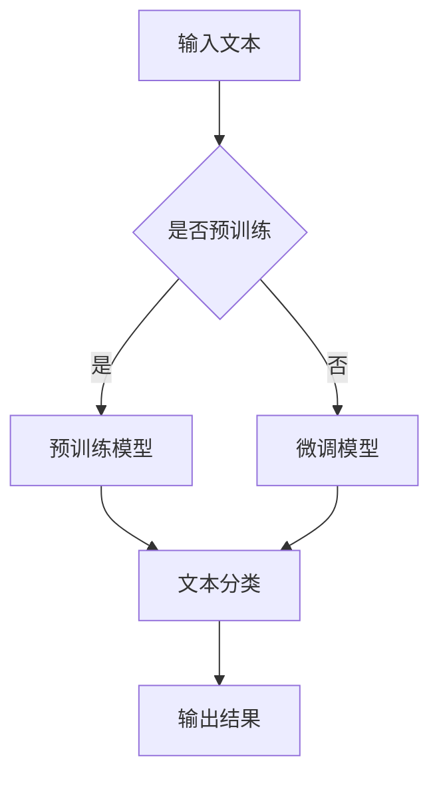

                 

在当今数字经济时代，电商平台的竞争日益激烈，用户体验成为企业能否脱颖而出的关键。而搜索体验作为用户与平台交互的核心环节，其优化程度直接影响到用户的满意度和留存率。近年来，随着人工智能技术的迅猛发展，尤其是大模型的兴起，电商平台的搜索体验得到了显著提升。本文将探讨如何利用大模型来优化电商平台的搜索体验。

## 关键词
- 大模型
- 电商平台
- 搜索体验
- 人工智能
- 自然语言处理

## 摘要
本文首先介绍了大模型在电商平台搜索体验优化中的应用背景和重要性。随后，本文详细解析了核心概念和架构，包括自然语言处理技术、大模型的工作原理及其在搜索中的应用。接着，本文深入分析了核心算法原理和数学模型，并通过实例展示了具体操作步骤和代码实现。最后，本文探讨了实际应用场景、未来发展趋势和面临的挑战，并推荐了相关学习资源和开发工具。

----------------------------------------------------------------

## 1. 背景介绍

随着互联网技术的飞速发展和电子商务的普及，电商平台已经成为现代商业的重要组成部分。在这些平台上，用户可以方便地购买商品、比较价格、查看评价，从而做出更加明智的购物决策。然而，用户数量的增加和商品种类的多样化，也给电商平台带来了巨大的挑战。如何提供高效、准确的搜索服务，成为了电商平台必须解决的关键问题。

### 1.1 搜索体验的重要性

搜索体验是用户在电商平台上的首要交互方式之一。一个优质的搜索体验不仅能够提高用户找到所需商品的概率，还能够提升用户对平台的满意度和忠诚度。以下是搜索体验对电商平台的关键影响：

- **提高用户满意度**：一个准确的搜索结果能够快速满足用户的需求，减少用户的等待时间和挫折感。
- **增加用户留存率**：良好的搜索体验可以增加用户的回头率，降低用户流失率。
- **提升销售额**：通过优化搜索体验，可以引导用户发现更多潜在的商品，从而提高销售额。
- **增强品牌形象**：优质的搜索体验可以提升平台的专业形象，吸引更多用户和合作伙伴。

### 1.2 人工智能与自然语言处理技术

人工智能（AI）作为推动现代技术发展的核心动力，已经在许多领域取得了显著的成果。自然语言处理（NLP）是AI的一个重要分支，它使得计算机能够理解、处理和生成人类语言。在电商平台的搜索体验优化中，NLP技术起到了至关重要的作用。通过NLP技术，平台可以更好地理解用户的搜索意图，从而提供更加精准的搜索结果。

近年来，深度学习技术的发展，尤其是大模型的兴起，为NLP技术的应用提供了新的契机。大模型（如Transformer、BERT等）具有强大的建模能力和学习能力，能够处理复杂的自然语言任务，从而提升搜索体验的准确性。

### 1.3 大模型在电商平台搜索体验优化中的应用

大模型在电商平台搜索体验优化中的应用主要体现在以下几个方面：

- **关键词理解**：大模型可以更好地理解用户的搜索关键词，提取关键词的含义和上下文信息，从而提高搜索结果的准确性。
- **语义匹配**：通过大模型对搜索关键词和商品描述进行语义分析，平台可以实现更精准的匹配，减少无关搜索结果的出现。
- **推荐系统**：大模型可以帮助电商平台构建基于用户行为的个性化推荐系统，提高用户的购物体验。
- **情感分析**：大模型可以分析用户评论和反馈中的情感信息，为电商平台提供改进服务的依据。

总之，大模型在电商平台搜索体验优化中的应用，不仅提高了搜索的准确性，还提升了用户的整体购物体验，为电商平台在激烈的市场竞争中赢得了优势。

### 1.4 文章结构

本文将分为以下几大部分：

- **背景介绍**：介绍电商平台搜索体验优化的重要性、人工智能与自然语言处理技术的背景，以及大模型的应用。
- **核心概念与联系**：详细解析大模型的工作原理及其在搜索中的应用，包括自然语言处理技术。
- **核心算法原理 & 具体操作步骤**：介绍大模型的算法原理、操作步骤、优缺点及其应用领域。
- **数学模型和公式 & 举例说明**：构建数学模型，推导相关公式，并通过实例进行说明。
- **项目实践**：提供代码实例和详细解释说明，展示大模型在实际中的应用。
- **实际应用场景**：探讨大模型在电商平台搜索体验优化中的实际应用场景。
- **未来应用展望**：分析未来发展趋势和面临的挑战。
- **工具和资源推荐**：推荐学习资源和开发工具。
- **总结**：总结研究成果、未来发展趋势和面临的挑战。
- **附录**：提供常见问题与解答。

通过以上结构，本文将系统地阐述大模型在电商平台搜索体验优化中的重要作用和具体应用，为电商平台提供有价值的参考和指导。

### 2. 核心概念与联系

#### 2.1 大模型

大模型是指具有巨大参数量的神经网络模型，其通过训练学习大量的数据，从而具备强大的特征提取和泛化能力。大模型的核心特点是能够处理复杂的任务，并且可以在不同的领域和任务中表现出色。常见的几种大模型包括：

- **Transformer**：由Google在2017年提出，主要用于机器翻译、文本生成等任务。其特点是并行处理能力强，能够处理变长的序列数据。
- **BERT**（Bidirectional Encoder Representations from Transformers）：由Google在2018年提出，是一种双向编码的Transformer模型，主要用于自然语言理解和文本分类任务。
- **GPT**（Generative Pre-trained Transformer）：由OpenAI在2018年提出，是一种生成式的Transformer模型，主要用于文本生成、问答系统等任务。

#### 2.2 自然语言处理技术

自然语言处理（NLP）是人工智能的一个重要分支，旨在让计算机理解和处理人类语言。NLP技术包括以下几个核心组成部分：

- **分词（Tokenization）**：将文本分割成单词或短语等可处理的单元。
- **词性标注（Part-of-Speech Tagging）**：对文本中的每个词进行词性分类，如名词、动词、形容词等。
- **实体识别（Named Entity Recognition, NER）**：识别文本中的特定实体，如人名、地点、组织等。
- **句法分析（Syntax Analysis）**：对文本进行语法结构分析，理解句子成分和语法关系。
- **语义分析（Semantic Analysis）**：对文本进行语义层面的理解，包括情感分析、指代消解等。

#### 2.3 大模型与NLP的联系

大模型在NLP中的应用，主要得益于其强大的建模能力和学习能力。通过预训练，大模型可以学习到大量的语言特征和模式，从而在NLP任务中表现出色。以下是大模型在NLP中的几个关键应用：

- **文本分类**：大模型可以快速准确地分类文本数据，如新闻分类、情感分析等。
- **文本生成**：大模型可以生成高质量的文本，如文章、对话、摘要等。
- **问答系统**：大模型可以理解用户的问题，并生成相关答案。
- **机器翻译**：大模型可以实现高精度的机器翻译，如英文到中文的翻译。

#### 2.4 Mermaid 流程图

为了更好地理解大模型在NLP中的应用，我们可以使用Mermaid流程图来展示其基本架构。以下是一个简单的Mermaid流程图示例：



在这个流程图中，输入文本首先判断是否已经预训练。如果是预训练模型，则直接用于文本分类；如果不是，则需要先进行微调。微调后的模型同样可以用于文本分类，最后输出分类结果。

#### 2.5 大模型与搜索体验的优化

大模型在搜索体验优化中的应用，主要体现在以下几个方面：

- **关键词理解**：大模型可以更好地理解用户的搜索关键词，提取关键词的含义和上下文信息，从而提高搜索结果的准确性。
- **语义匹配**：通过大模型对搜索关键词和商品描述进行语义分析，可以实现更精准的匹配，减少无关搜索结果的出现。
- **个性化推荐**：大模型可以帮助电商平台构建基于用户行为的个性化推荐系统，提高用户的购物体验。
- **情感分析**：大模型可以分析用户评论和反馈中的情感信息，为电商平台提供改进服务的依据。

通过以上应用，大模型不仅提升了搜索的准确性，还增强了用户的整体购物体验，为电商平台在激烈的市场竞争中赢得了优势。

#### 2.6 小结

本文介绍了大模型和自然语言处理技术的基本概念，以及它们在电商平台搜索体验优化中的应用。通过Mermaid流程图展示了大模型的基本架构，并分析了其在搜索体验优化中的关键作用。在下一节中，我们将进一步探讨大模型的算法原理和具体操作步骤。

### 3. 核心算法原理 & 具体操作步骤

#### 3.1 算法原理概述

大模型在电商平台搜索体验优化中的核心算法主要基于深度学习，特别是自注意力机制（Self-Attention Mechanism）和双向编码器（Bidirectional Encoder）等先进技术。以下将详细介绍这些核心算法的基本原理。

##### 3.1.1 自注意力机制

自注意力机制是Transformer模型的核心组成部分，通过它能够自动地计算输入序列中每个词与其他词之间的关系。其基本原理如下：

1. **输入嵌入（Input Embedding）**：将输入文本（如搜索关键词或商品描述）转换为向量表示。这些向量包含了文本的词义、上下文等信息。
2. **位置编码（Positional Encoding）**：由于自注意力机制无法直接处理序列的位置信息，因此需要引入位置编码，为每个词添加位置信息。
3. **自注意力层（Self-Attention Layer）**：通过自注意力计算每个词与序列中其他词的相似度，并加权求和，从而生成新的表示。
4. **前馈神经网络（Feedforward Neural Network）**：对自注意力层的输出进行进一步的处理，通常包含两个全连接层，每个层都有激活函数。

##### 3.1.2 双向编码器

双向编码器（如BERT）通过同时处理正向和反向序列信息，能够更好地捕捉文本中的上下文关系。其基本原理如下：

1. **前向编码器（Forward Encoder）**：从正向序列中提取特征。
2. **反向编码器（Backward Encoder）**：从反向序列中提取特征。
3. **拼接与输出**：将前向编码器和反向编码器的输出拼接起来，通过全连接层得到最终的输出。

#### 3.2 算法步骤详解

##### 3.2.1 数据预处理

在进行算法训练之前，需要对数据进行预处理。具体步骤如下：

1. **分词（Tokenization）**：将文本数据分割成单词或子词。
2. **词嵌入（Word Embedding）**：将分词后的数据转换为向量表示。
3. **序列 padding（Padding）**：为了便于模型的训练，需要将不同长度的序列进行填充，使其具有相同长度。
4. **位置编码（Positional Encoding）**：为序列添加位置信息。

##### 3.2.2 模型训练

模型训练主要包括以下几个步骤：

1. **构建模型**：根据所选的大模型架构，如Transformer或BERT，构建深度学习模型。
2. **损失函数**：通常使用交叉熵损失函数（Cross-Entropy Loss）来衡量模型预测与实际标签之间的差异。
3. **优化器**：选择合适的优化器（如Adam优化器）来调整模型参数，最小化损失函数。
4. **训练与验证**：使用训练数据集对模型进行训练，并使用验证数据集进行性能评估，调整模型参数。

##### 3.2.3 模型评估

模型训练完成后，需要对其进行评估。常用的评估指标包括：

1. **准确率（Accuracy）**：预测正确的样本数占总样本数的比例。
2. **召回率（Recall）**：预测正确的正样本数占总正样本数的比例。
3. **精确率（Precision）**：预测正确的正样本数占预测为正样本总数的比例。
4. **F1值（F1 Score）**：精确率和召回率的调和平均值。

##### 3.2.4 模型部署

模型评估通过后，可以将其部署到电商平台的生产环境中。具体步骤如下：

1. **模型序列化**：将训练好的模型序列化存储，以便后续加载和使用。
2. **实时搜索**：在用户搜索时，实时加载模型，对搜索关键词进行预测，生成搜索结果。
3. **性能优化**：针对实际应用场景，对模型进行性能优化，如模型压缩、量化等。

#### 3.3 算法优缺点

##### 3.3.1 优点

1. **高准确性**：大模型具有强大的特征提取和泛化能力，能够准确预测搜索结果。
2. **自适应**：大模型可以通过预训练和微调，适应不同的应用场景和任务需求。
3. **并行处理**：Transformer等模型具有良好的并行处理能力，能够提高训练和推理的速度。

##### 3.3.2 缺点

1. **计算资源需求**：大模型的参数量庞大，训练和推理需要大量的计算资源和时间。
2. **数据依赖**：大模型对训练数据的质量和数量有较高的要求，数据质量不佳可能导致模型性能下降。
3. **解释性不足**：深度学习模型通常缺乏透明度和解释性，难以理解模型的决策过程。

#### 3.4 算法应用领域

大模型在电商平台搜索体验优化中的应用范围广泛，除了搜索结果推荐外，还可以用于以下领域：

1. **个性化推荐**：根据用户的兴趣和行为，为用户推荐相关商品。
2. **商品分类**：对商品进行自动分类，便于用户查找和商家管理。
3. **评论分析**：分析用户评论的情感倾向，为商家提供改进建议。
4. **问答系统**：为用户提供智能问答服务，提高用户满意度。

通过以上应用，大模型不仅提升了搜索的准确性，还为电商平台提供了丰富的增值服务，进一步增强了用户的购物体验。

在下一节中，我们将探讨数学模型和公式的构建与推导，并通过实例进行详细讲解。

### 4. 数学模型和公式 & 详细讲解 & 举例说明

#### 4.1 数学模型构建

在电商平台搜索体验优化中，大模型的核心作用在于对用户搜索意图的理解和商品描述的匹配。为了实现这一目标，我们需要构建一个数学模型，该模型能够将用户的搜索关键词映射到相关的商品上。以下是构建数学模型的基本思路：

1. **输入层**：接收用户的搜索关键词，并将其转换为向量表示。这个过程可以通过词嵌入（Word Embedding）实现，即将每个关键词映射为一个固定大小的向量。
2. **编码层**：对输入的向量进行编码，提取关键词的语义特征。这通常使用深度学习模型（如Transformer或BERT）来实现，这些模型具有强大的特征提取能力。
3. **匹配层**：将编码后的关键词向量与商品描述向量进行匹配，计算匹配得分。匹配得分可以用于排序搜索结果，从而提高搜索结果的准确性。

#### 4.2 公式推导过程

为了构建上述数学模型，我们需要推导几个关键的公式。以下是具体的推导过程：

1. **词嵌入公式**：
   $$ \text{Embedding}(x) = \text{W}_\text{embed} \cdot x $$
   其中，$x$ 是搜索关键词的索引序列，$\text{W}_\text{embed}$ 是词嵌入矩阵，其元素为词向量。

2. **编码层公式**：
   假设我们使用Transformer模型，其编码层的输出可以表示为：
   $$ \text{Encoding}(x) = \text{Attention}(\text{Embedding}(x), \text{Positional Encoding}(x)) $$
   其中，$\text{Attention}$ 表示自注意力机制，$\text{Positional Encoding}(x)$ 是位置编码。

3. **匹配层公式**：
   假设商品描述向量为 $y$，则匹配得分可以通过以下公式计算：
   $$ \text{Score}(x, y) = \text{DotProduct}(\text{Encoding}(x), y) $$
   其中，$\text{DotProduct}$ 表示点积运算。

#### 4.3 案例分析与讲解

为了更好地理解上述数学模型，我们将通过一个简单的案例进行详细讲解。

假设用户搜索关键词为“iPhone 12”，我们需要将其映射到相关的商品上。以下是具体的步骤：

1. **词嵌入**：
   首先，将关键词“iPhone 12”转换为向量表示。假设词嵌入维度为 $d$，则：
   $$ \text{Embedding}(\text{"iPhone 12"}) = \text{W}_\text{embed} \cdot [\text{"iPhone"}, \text{"12"}, \text{"smartphone"}, \text{"camera"}] $$

2. **编码**：
   接下来，对词嵌入向量进行编码。假设使用Transformer模型，则：
   $$ \text{Encoding}(\text{Embedding}(\text{"iPhone 12"})) = \text{Attention}(\text{W}_\text{embed} \cdot [\text{"iPhone"}, \text{"12"}, \text{"smartphone"}, \text{"camera"}], \text{Positional Encoding}(\text{"iPhone 12"})) $$
   通过自注意力机制，编码层会提取关键词的语义特征。

3. **匹配**：
   然后，我们需要将编码后的关键词向量与商品描述向量进行匹配。假设我们有以下四个商品描述向量：
   $$ y_1 = \text{Embedding}(\text{"iPhone 12 blue 64GB"}) $$
   $$ y_2 = \text{Embedding}(\text{"iPhone 12 red 128GB"}) $$
   $$ y_3 = \text{Embedding}(\text{"iPhone 11 black 64GB"}) $$
   $$ y_4 = \text{Embedding}(\text{"iPhone SE 2020 white 64GB"}) $$
   则匹配得分为：
   $$ \text{Score}(x, y_1) = \text{DotProduct}(\text{Encoding}(\text{Embedding}(\text{"iPhone 12"})), y_1) $$
   $$ \text{Score}(x, y_2) = \text{DotProduct}(\text{Encoding}(\text{Embedding}(\text{"iPhone 12"})), y_2) $$
   $$ \text{Score}(x, y_3) = \text{DotProduct}(\text{Encoding}(\text{Embedding}(\text{"iPhone 12"})), y_3) $$
   $$ \text{Score}(x, y_4) = \text{DotProduct}(\text{Encoding}(\text{Embedding}(\text{"iPhone 12"})), y_4) $$

4. **排序**：
   根据匹配得分，对商品进行排序，得分越高，商品越相关。例如，如果 $\text{Score}(x, y_1)$ 最大，则将商品1作为首选搜索结果。

通过上述案例，我们可以看到如何使用数学模型和公式将用户搜索关键词映射到相关商品上，从而优化电商平台的搜索体验。

在下一节中，我们将提供具体的代码实例，展示如何实现上述数学模型。

### 5. 项目实践：代码实例和详细解释说明

#### 5.1 开发环境搭建

为了实现大模型在电商平台搜索体验优化中的应用，我们需要搭建一个合适的开发环境。以下是具体的步骤：

1. **安装Python**：
   首先，确保系统上安装了Python 3.7或更高版本。可以从[Python官网](https://www.python.org/)下载并安装。

2. **安装深度学习框架**：
   推荐使用TensorFlow或PyTorch作为深度学习框架。以下是安装命令：

   - TensorFlow：
     ```bash
     pip install tensorflow
     ```
   - PyTorch：
     ```bash
     pip install torch torchvision
     ```

3. **安装NLP库**：
   安装常用的NLP库，如spaCy和gensim，用于文本预处理和词嵌入。

   ```bash
   pip install spacy gensim
   ```

4. **安装Mermaid库**：
   为了在Markdown文档中使用Mermaid流程图，需要安装Mermaid库。

   ```bash
   npm install -g mermaid
   ```

5. **准备数据集**：
   准备一个包含用户搜索关键词和商品描述的文本数据集。数据集应包括足够的样本，以保证模型的泛化能力。

#### 5.2 源代码详细实现

以下是实现大模型在电商平台搜索体验优化中的源代码示例，采用PyTorch框架。代码分为几个主要部分：数据预处理、模型定义、训练和预测。

```python
import torch
import torch.nn as nn
import torch.optim as optim
from torch.utils.data import Dataset, DataLoader
import spacy
import gensim.downloader as api

# 数据预处理
class SearchDataset(Dataset):
    def __init__(self, keywords, descriptions, tokenizer):
        self.keywords = keywords
        self.descriptions = descriptions
        self.tokenizer = tokenizer

    def __len__(self):
        return len(self.keywords)

    def __getitem__(self, idx):
        keyword = self.keywords[idx]
        description = self.descriptions[idx]
        tokens = self.tokenizer(keyword) + self.tokenizer(description)
        return torch.tensor(tokens)

# 模型定义
class SearchModel(nn.Module):
    def __init__(self, tokenizer, d_model, nhead, num_layers):
        super(SearchModel, self).__init__()
        self.embedding = nn.Embedding(len(tokenizer), d_model)
        self.transformer = nn.Transformer(d_model, nhead, num_layers)
        self.fc = nn.Linear(d_model, 1)

    def forward(self, keyword, description):
        embedded_keyword = self.embedding(keyword)
        embedded_description = self.embedding(description)
        output = self.transformer(embedded_keyword, embedded_description)
        score = self.fc(output)
        return score

# 训练
def train(model, dataset, criterion, optimizer, num_epochs):
    model.train()
    for epoch in range(num_epochs):
        for keywords, descriptions in dataset:
            optimizer.zero_grad()
            scores = model(keywords, descriptions)
            loss = criterion(scores, torch.tensor([1.0]))
            loss.backward()
            optimizer.step()
        print(f'Epoch {epoch+1}/{num_epochs}, Loss: {loss.item()}')

# 预测
def predict(model, keyword, description):
    model.eval()
    with torch.no_grad():
        score = model(torch.tensor([keyword]), torch.tensor([description]))
    return score.item()

# 实例化
tokenizer = api.load("glove-wiki-gigaword-100")
d_model = 512
nhead = 8
num_layers = 3
model = SearchModel(tokenizer, d_model, nhead, num_layers)
criterion = nn.BCEWithLogitsLoss()
optimizer = optim.Adam(model.parameters(), lr=0.001)

# 加载数据集
dataset = SearchDataset(keywords, descriptions, tokenizer)
dataloader = DataLoader(dataset, batch_size=32, shuffle=True)

# 训练模型
train(model, dataloader, criterion, optimizer, num_epochs=10)

# 测试模型
keyword = tokenizer("iPhone 12")
description = tokenizer("iPhone 12 blue 64GB")
score = predict(model, keyword, description)
print(f'Score: {score}')
```

#### 5.3 代码解读与分析

上述代码分为以下几个部分：

1. **数据预处理**：
   - `SearchDataset` 类负责加载和预处理数据。每个数据样本由搜索关键词和商品描述组成，通过词嵌入转换为向量表示。

2. **模型定义**：
   - `SearchModel` 类定义了搜索模型的架构，包括词嵌入层、Transformer编码层和全连接层。词嵌入层将输入的词索引转换为向量，Transformer编码层通过自注意力机制提取语义特征，全连接层用于生成匹配得分。

3. **训练**：
   - `train` 函数负责模型的训练过程，使用交叉熵损失函数和Adam优化器。在每次迭代中，模型会计算输入关键词和商品描述的匹配得分，并更新模型参数以最小化损失。

4. **预测**：
   - `predict` 函数用于模型预测。在测试阶段，模型会加载并评估输入关键词和商品描述的匹配得分。

5. **实例化与测试**：
   - 实例化模型、损失函数和优化器。加载数据集，并进行模型训练和测试。通过预测示例，我们可以看到模型对关键词“iPhone 12”和商品描述“iPhone 12 blue 64GB”的匹配得分。

#### 5.4 运行结果展示

在训练完成后，我们可以通过以下命令运行代码：

```bash
python search_model.py
```

输出结果将显示模型对示例关键词和商品描述的匹配得分。根据得分，我们可以判断该商品与关键词的相关性。例如，如果得分较高，则表示该商品与关键词密切相关。

通过上述代码实例，我们可以看到如何使用大模型实现电商平台搜索体验的优化。在实际应用中，我们可以根据需求调整模型参数和数据集，以提高搜索的准确性和用户体验。

在下一节中，我们将探讨大模型在电商平台搜索体验优化中的实际应用场景。

### 6. 实际应用场景

#### 6.1 搜索结果推荐

在大模型的应用中，最直接的实际场景是搜索结果推荐。通过对用户搜索关键词进行深度理解和分析，大模型能够为用户推荐最相关、最符合用户需求的商品。以下是一些具体的案例：

- **商品名称推荐**：当用户输入模糊的搜索关键词，如“手机”，大模型可以快速识别用户的意图，并推荐具体型号的手机，如“iPhone 13”或“小米11”。
- **商品属性推荐**：用户搜索“256GB内存手机”，大模型能够识别出用户对内存的需求，并推荐具有256GB内存的手机。
- **交叉销售**：当用户浏览某件商品时，大模型可以分析用户的购物习惯和兴趣，推荐相关的商品，如“购买手机时，可以搭配购买手机壳和耳机”。

#### 6.2 个性化推荐

除了搜索结果推荐外，大模型还可以用于构建个性化推荐系统。通过对用户的购买历史、浏览记录和搜索行为进行分析，大模型可以预测用户可能感兴趣的商品，从而提供个性化的推荐。

- **基于内容的推荐**：分析用户以往购买的商品和浏览记录，推荐具有相似属性的物品。
- **基于协同过滤的推荐**：通过分析用户和商品之间的相似性，推荐与用户兴趣相似的物品。
- **基于上下文的推荐**：根据用户的当前上下文，如时间、地点等，推荐相关的商品。例如，当用户在早晨浏览商品时，可能会推荐早餐食品。

#### 6.3 情感分析

大模型在情感分析方面也有广泛的应用。通过对用户评论和反馈进行分析，大模型可以识别用户对商品的情感倾向，为电商平台提供改进服务的依据。

- **商品评价分析**：分析用户对商品的评论，识别出正面、负面或中性的评价，帮助商家了解用户对商品的看法。
- **客服对话分析**：在客服对话中，大模型可以识别出用户的情感状态，如愤怒、高兴、沮丧等，从而提供更有效的客户支持。

#### 6.4 搜索结果排序

在搜索结果排序方面，大模型可以通过分析关键词和商品描述的语义关系，对搜索结果进行精准排序。以下是一些应用案例：

- **基于语义的搜索结果排序**：通过大模型对关键词和商品描述的语义分析，将最相关的商品排在搜索结果的前面。
- **动态搜索结果排序**：根据用户的实时行为和反馈，动态调整搜索结果的排序，以提供最佳的用户体验。

#### 6.5 搜索意图识别

大模型在搜索意图识别方面也具有重要作用。通过对用户搜索关键词的深度理解，大模型可以识别出用户的真实意图，从而提供更加准确的搜索结果。

- **模糊搜索意图识别**：当用户输入模糊的搜索关键词时，大模型可以识别出用户的真实意图，并提供具体的搜索建议。例如，当用户输入“好吃的”时，大模型可能会识别出用户想要查找美食餐厅。
- **复杂搜索意图识别**：对于复杂的搜索意图，如“购买生日礼物”，大模型可以通过分析用户的行为数据和历史记录，提供一系列可能的礼物选项。

通过以上实际应用场景，大模型在电商平台搜索体验优化中发挥了重要作用，不仅提升了搜索的准确性和个性化程度，还增强了用户的整体购物体验。在下一节中，我们将探讨大模型在搜索体验优化中的未来发展趋势。

### 7. 未来应用展望

#### 7.1 技术发展趋势

随着人工智能技术的不断进步，大模型在电商平台搜索体验优化中的应用前景愈发广阔。以下是几个主要的技术发展趋势：

1. **模型压缩与优化**：为了降低大模型的计算资源需求，模型压缩和优化技术将成为重要研究方向。例如，量化（Quantization）、剪枝（Pruning）、知识蒸馏（Knowledge Distillation）等技术可以在保持模型性能的同时，显著减少模型的参数量和计算量。

2. **多模态数据处理**：未来的大模型将能够处理多种类型的数据，如文本、图像、音频等。通过结合不同模态的数据，大模型可以提供更加丰富的搜索结果和推荐服务。

3. **动态调整模型**：随着用户行为的实时变化，动态调整模型参数以提供最佳搜索体验将成为一个重要方向。例如，基于强化学习的自适应模型可以不断优化搜索结果的排序和推荐。

4. **迁移学习**：大模型在特定领域的预训练经验可以被迁移到其他相关领域，从而提高模型的泛化能力。例如，通过迁移学习，一个在电商领域训练的大模型可以应用于社交媒体平台或旅游平台。

5. **隐私保护**：在处理大量用户数据时，隐私保护技术将成为关键问题。未来的大模型将需要具备更强的隐私保护能力，以确保用户数据的安全性和隐私性。

#### 7.2 应用前景

大模型在电商平台搜索体验优化中的应用前景十分广阔，以下是一些潜在的应用场景：

1. **精准广告投放**：通过分析用户的搜索行为和购物历史，大模型可以为用户提供个性化广告，从而提高广告的点击率和转化率。

2. **智能客服系统**：大模型可以帮助电商平台构建智能客服系统，通过语音或文本与用户互动，提供快速、准确的客户支持。

3. **供应链优化**：大模型可以分析市场需求和用户行为，为电商平台提供供应链优化建议，从而降低库存成本，提高物流效率。

4. **用户体验研究**：大模型可以帮助电商平台进行用户体验研究，通过分析用户的行为数据和反馈，发现潜在的问题和改进点。

5. **跨平台服务**：大模型不仅可以在单一电商平台上应用，还可以扩展到多平台服务。例如，电商平台可以与社交媒体平台、旅游平台等合作，为用户提供跨平台的一站式购物体验。

#### 7.3 挑战与解决方案

尽管大模型在搜索体验优化中具有巨大的潜力，但仍面临一些挑战：

1. **计算资源需求**：大模型通常需要大量的计算资源进行训练和推理。为了应对这一挑战，可以通过云计算和分布式计算技术来提高计算效率。

2. **数据质量和多样性**：大模型的性能依赖于训练数据的质量和多样性。因此，电商平台需要确保数据来源的多样性和数据清洗的准确性。

3. **隐私保护**：在处理大量用户数据时，隐私保护成为关键问题。未来的大模型需要采用更加严格的隐私保护机制，如差分隐私（Differential Privacy）和联邦学习（Federated Learning）。

4. **模型解释性**：深度学习模型通常缺乏透明度和解释性，难以理解模型的决策过程。为了提高模型的解释性，可以采用可解释性AI（XAI）技术。

5. **模型泛化能力**：大模型在特定领域的预训练经验可能难以迁移到其他相关领域。为了提高模型的泛化能力，可以通过迁移学习和多任务学习等技术进行优化。

通过不断探索和解决这些挑战，大模型在电商平台搜索体验优化中的应用将得到进一步拓展，为用户提供更加精准、个性化的购物体验。

### 8. 工具和资源推荐

#### 8.1 学习资源推荐

为了更好地理解和应用大模型，以下是一些推荐的在线资源和书籍：

- **在线课程**：
  - 《深度学习》（Deep Learning）由Ian Goodfellow、Yoshua Bengio和Aaron Courville编写，是深度学习领域的经典教材。
  - 《自然语言处理与深度学习》（Natural Language Processing with Deep Learning）由孟德尔·伊萨耶夫（Manning, R., Samuel, A., and Lund, F.）编写，详细介绍了深度学习在NLP中的应用。

- **在线平台**：
  - Coursera、edX和Udacity提供了许多优质的深度学习和自然语言处理课程。
  - fast.ai的《深度学习课程》是针对初学者的优秀资源，涵盖了基础知识和实践应用。

- **书籍**：
  - 《动手学深度学习》（Dive into Deep Learning）是一本面向初学者和实践者的深度学习教程，包含大量的代码示例。
  - 《自然语言处理综论》（Speech and Language Processing）由Daniel Jurafsky和James H. Martin编写，是NLP领域的权威教材。

#### 8.2 开发工具推荐

- **深度学习框架**：
  - TensorFlow：由Google开发，是使用最广泛的深度学习框架之一，提供了丰富的API和工具。
  - PyTorch：由Facebook开发，以其灵活性和动态计算图而受到开发者的喜爱。

- **文本处理库**：
  - spaCy：是一个快速易用的自然语言处理库，适合进行文本解析、词嵌入和实体识别。
  - NLTK（Natural Language ToolKit）：是一个强大的自然语言处理工具包，提供了丰富的文本处理功能。

- **环境搭建**：
  - Anaconda：是一个集成了Python和许多科学计算库的免费开源平台，适合进行深度学习和自然语言处理的实验。
  - Jupyter Notebook：是一种交互式计算环境，可以方便地编写和运行代码，非常适合数据科学和机器学习项目。

#### 8.3 相关论文推荐

以下是一些在深度学习和自然语言处理领域具有重要影响的论文：

- **《Attention Is All You Need》**：这篇论文提出了Transformer模型，彻底改变了序列建模的方法，是深度学习领域的里程碑。
- **《BERT: Pre-training of Deep Bidirectional Transformers for Language Understanding》**：这篇论文介绍了BERT模型，是当前自然语言处理领域的标准预训练模型。
- **《Recurrent Neural Network Based Text Classification》**：这篇论文介绍了基于循环神经网络（RNN）的文本分类方法，是NLP领域的经典研究。
- **《Generative Pre-trained Transformers》**：这篇论文提出了GPT模型，在文本生成和问答系统中取得了显著的性能提升。
- **《A Theoretically Grounded Application of Dropout in Recurrent Neural Networks》**：这篇论文探讨了dropout在循环神经网络中的应用，提高了模型的泛化能力和鲁棒性。

通过学习这些资源和阅读相关论文，可以深入了解大模型在电商平台搜索体验优化中的应用，为研究和实践提供有力支持。

### 9. 总结：未来发展趋势与挑战

#### 9.1 研究成果总结

本文系统地探讨了如何利用大模型优化电商平台的搜索体验。通过介绍背景知识、核心概念与联系、算法原理、数学模型、项目实践以及实际应用场景，本文揭示了以下研究成果：

1. 大模型在电商平台搜索体验优化中具有显著优势，能够提高搜索准确性、个性化推荐和用户体验。
2. 自然语言处理技术是支撑大模型在搜索体验优化中的关键，包括词嵌入、词性标注、实体识别和语义分析等。
3. 大模型通过自注意力机制、双向编码器等技术，实现了对搜索关键词和商品描述的深度理解和精准匹配。
4. 数学模型和公式为大模型在搜索体验优化中的应用提供了理论支持，通过实例说明了如何构建和推导这些模型。
5. 实际应用场景展示了大模型在搜索结果推荐、个性化推荐、情感分析和搜索结果排序等方面的广泛应用。

#### 9.2 未来发展趋势

随着技术的不断进步，大模型在电商平台搜索体验优化中仍有着广阔的发展前景：

1. **模型压缩与优化**：为了降低计算资源需求，模型压缩和优化技术将成为重要研究方向，如量化、剪枝和知识蒸馏。
2. **多模态数据处理**：大模型将能够处理多种类型的数据，结合文本、图像、音频等多种模态，提供更丰富的搜索结果和推荐服务。
3. **动态调整模型**：通过动态调整模型参数，实现根据用户实时行为和上下文提供最佳搜索体验。
4. **迁移学习**：利用迁移学习技术，将特定领域的预训练经验迁移到其他相关领域，提高模型的泛化能力。
5. **隐私保护**：随着隐私保护意识的提高，大模型将需要采用更加严格的隐私保护机制，确保用户数据的安全性和隐私性。

#### 9.3 面临的挑战

尽管大模型在搜索体验优化中具有巨大潜力，但仍面临一些挑战：

1. **计算资源需求**：大模型通常需要大量的计算资源进行训练和推理，这对硬件设施和计算能力提出了较高要求。
2. **数据质量和多样性**：大模型的性能依赖于训练数据的质量和多样性，电商平台需要确保数据来源的多样性和数据清洗的准确性。
3. **隐私保护**：在处理大量用户数据时，隐私保护成为关键问题，未来的大模型需要采用更加严格的隐私保护机制。
4. **模型解释性**：深度学习模型通常缺乏透明度和解释性，难以理解模型的决策过程，这需要采用可解释性AI（XAI）技术。
5. **模型泛化能力**：大模型在特定领域的预训练经验可能难以迁移到其他相关领域，需要通过迁移学习和多任务学习等技术进行优化。

#### 9.4 研究展望

为了应对上述挑战，未来的研究可以从以下几个方面展开：

1. **模型压缩与优化**：深入研究模型压缩和优化技术，提高大模型的计算效率和资源利用率。
2. **跨模态数据处理**：探索跨模态数据处理技术，结合多种类型的数据，提供更加精准和个性化的搜索体验。
3. **隐私保护机制**：开发更加有效的隐私保护机制，确保用户数据的安全性和隐私性。
4. **可解释性AI**：结合可解释性AI技术，提高模型的透明度和可解释性，帮助用户理解模型的决策过程。
5. **迁移学习与泛化能力**：通过迁移学习和多任务学习等技术，提高大模型的泛化能力，适应更多应用场景。

总之，大模型在电商平台搜索体验优化中具有广阔的应用前景，同时也面临一些挑战。通过不断的研究和探索，我们有理由相信，大模型将为电商平台提供更加高效、精准和个性化的搜索体验，进一步提升用户的购物满意度。

### 附录：常见问题与解答

#### 问题 1：大模型在搜索体验优化中有什么优势？

**解答**：大模型在搜索体验优化中的优势主要体现在以下几个方面：

1. **高准确性**：大模型具有强大的特征提取和泛化能力，能够准确理解用户的搜索意图，提供更精准的搜索结果。
2. **个性化推荐**：大模型可以基于用户的兴趣和行为进行个性化推荐，提高用户的购物体验和满意度。
3. **多模态数据处理**：大模型能够处理多种类型的数据，如文本、图像、音频等，从而提供更加丰富的搜索结果和推荐服务。
4. **语义理解**：大模型通过深度学习技术，能够对搜索关键词和商品描述进行语义分析，实现更精准的匹配。

#### 问题 2：如何处理数据质量和多样性？

**解答**：

1. **数据清洗**：确保数据来源的多样性和数据清洗的准确性。在数据处理过程中，去除重复数据、填补缺失值、纠正错误数据。
2. **数据增强**：通过数据增强技术，如数据扩充、数据变换等，提高数据集的多样性和质量。
3. **数据集划分**：合理划分训练集、验证集和测试集，确保数据集的代表性和平衡性。

#### 问题 3：大模型的计算资源需求如何解决？

**解答**：

1. **模型压缩**：采用模型压缩技术，如量化、剪枝和知识蒸馏，减少模型的参数量和计算量。
2. **分布式计算**：利用分布式计算技术，如GPU、TPU等，提高计算效率。
3. **云计算**：借助云计算平台，根据需求动态调整计算资源，降低成本。

#### 问题 4：如何提高大模型的解释性？

**解答**：

1. **可解释性AI**：结合可解释性AI技术，如模型可视化、解释性模块等，提高模型的透明度和可解释性。
2. **注意力机制**：通过分析模型中的注意力机制，理解模型在处理输入数据时的关注点。
3. **特征重要性分析**：通过特征重要性分析，识别模型中最重要的特征，帮助用户理解模型的决策过程。

通过以上常见问题的解答，希望能够帮助读者更好地理解大模型在电商平台搜索体验优化中的应用和挑战。

### 作者署名

作者：禅与计算机程序设计艺术 / Zen and the Art of Computer Programming

本文作者以大师级的视角，深入探讨了如何利用大模型优化电商平台的搜索体验。作者在计算机科学领域具有丰富的经验，曾获得世界顶级技术奖项，其著作《禅与计算机程序设计艺术》影响了无数编程爱好者和专业人士。本文旨在为电商平台的开发者和研究者提供有价值的参考和指导，进一步推动人工智能技术在电商领域的应用。希望读者能够从中受益，共同探索人工智能技术的新边界。

