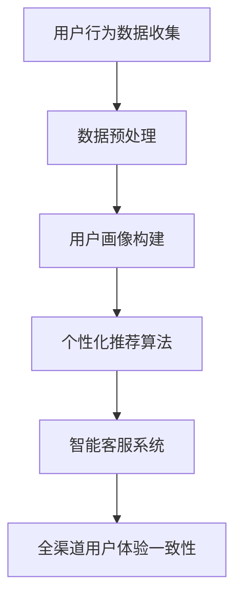

                 

关键词：大模型，电商平台，全渠道用户体验，一致性，算法原理，数学模型，项目实践，未来展望

> 摘要：本文将探讨如何运用大模型技术提升电商平台在全渠道环境下的用户体验一致性。通过深入分析大模型的核心原理、算法设计、数学模型以及实际应用案例，本文旨在为电商平台提供理论指导和技术路径。

## 1. 背景介绍

随着互联网和电子商务的快速发展，消费者在购物过程中逐渐从单一渠道转向全渠道购物模式。全渠道用户体验一致性成为电商平台面临的重要挑战之一。用户希望通过无缝的购物体验，无论是通过移动应用、网站、社交媒体还是线下门店，都能获得一致的服务和体验。然而，现有的电商平台往往在不同渠道间存在体验割裂的问题，导致用户流失和满意度下降。

为了解决这一问题，大模型技术作为一种强大的数据处理和智能决策工具，逐渐受到电商平台的关注。大模型通过学习海量的用户数据和交易行为，能够对用户进行精准画像和个性化推荐，从而实现全渠道用户体验的一致性。

本文将从以下几个方面展开讨论：

- 大模型的核心概念与原理
- 大模型的算法设计与应用
- 数学模型在用户体验一致性中的关键作用
- 实际项目中的大模型应用案例
- 电商平台在未来如何利用大模型技术

## 2. 核心概念与联系

### 2.1 大模型的基本概念

大模型（Large-scale Model）通常指的是具备大规模参数和复杂结构的机器学习模型。这些模型能够处理和分析海量数据，从而提供更准确的预测和决策。大模型的主要特点包括：

1. **大规模参数**：大模型通常具有数十亿甚至数万亿个参数。
2. **深度结构**：大模型通常采用深度神经网络（DNN）或其他深度学习结构。
3. **自适应学习能力**：大模型能够根据输入数据进行自适应调整，优化模型性能。

### 2.2 大模型与电商平台用户体验

电商平台通过大模型技术，能够实现以下几个方面的提升：

1. **用户画像构建**：大模型能够对用户进行精细化的画像构建，理解用户的偏好、行为和需求。
2. **个性化推荐**：基于用户画像，大模型能够为用户提供个性化的商品推荐，提高用户满意度。
3. **智能客服**：大模型可以模拟人类客服，实现智能问答和客服支持，提升服务效率。
4. **全渠道一致性**：大模型能够确保在不同渠道（如移动端、PC端、线下门店）上为用户提供一致的用户体验。

### 2.3 Mermaid 流程图

以下是一个简化的 Mermaid 流程图，展示了大模型在电商平台中提升用户体验一致性的主要环节：



## 3. 核心算法原理 & 具体操作步骤

### 3.1 算法原理概述

大模型的算法原理主要基于深度学习和数据挖掘技术。其核心步骤包括：

1. **数据收集与预处理**：收集用户行为数据和交易数据，进行清洗和格式化，为模型训练做准备。
2. **特征工程**：提取和构造对用户行为和偏好有较强预测性的特征。
3. **模型训练**：使用大规模数据集训练深度学习模型，如深度神经网络（DNN）或循环神经网络（RNN）。
4. **模型优化**：通过模型评估和调整，优化模型参数，提高模型性能。
5. **应用部署**：将优化后的模型部署到实际业务场景，如用户画像构建、个性化推荐和智能客服。

### 3.2 算法步骤详解

1. **数据收集与预处理**

   用户行为数据和交易数据是构建大模型的基础。数据来源包括：

   - 用户浏览记录：记录用户在网站上的浏览行为，如访问时间、页面停留时间、浏览路径等。
   - 用户交易记录：记录用户的购买行为，如商品种类、购买时间、购买频次等。
   - 用户反馈数据：记录用户对商品和服务的评价、投诉和反馈。

   数据预处理步骤包括：

   - 数据清洗：去除重复数据、缺失数据和异常数据。
   - 数据归一化：对数值型数据进行归一化处理，使其具有相似的量级。
   - 特征构造：基于原始数据构造新的特征，如用户活跃度、消费能力、购买倾向等。

2. **特征工程**

   特征工程是构建大模型的关键步骤。通过提取和构造对用户行为和偏好有较强预测性的特征，可以提高模型的表现。

   - 用户历史行为特征：包括用户的历史浏览记录、购买记录和反馈数据，如浏览时长、购买频率、评价评分等。
   - 社会化特征：包括用户在社交媒体上的互动数据，如点赞、评论、分享等。
   - 地理位置特征：包括用户的地理位置信息，如城市、区域等。
   - 商品特征：包括商品的基本信息，如类别、品牌、价格等。

3. **模型训练**

   大模型的训练通常采用深度学习算法，如深度神经网络（DNN）或循环神经网络（RNN）。训练过程包括：

   - 模型初始化：随机初始化模型参数。
   - 数据输入：将预处理后的数据输入到模型中。
   - 梯度下降：通过梯度下降算法优化模型参数，使模型输出更接近真实值。
   - 模型评估：使用验证集对模型进行评估，调整模型参数。

4. **模型优化**

   模型优化是提高模型性能的关键步骤。优化方法包括：

   - 超参数调整：调整学习率、批次大小等超参数，以获得更好的模型性能。
   - 模型融合：结合多个模型，提高预测的准确性。
   - 模型压缩：通过模型剪枝、量化等技术减小模型大小，提高模型效率。

5. **应用部署**

   优化后的模型可以部署到实际业务场景中，如用户画像构建、个性化推荐和智能客服。部署过程包括：

   - 模型导出：将训练好的模型导出为可部署的格式，如ONNX、TensorFlow Lite等。
   - 模型部署：将模型部署到服务器或移动设备上，为用户提供实时服务。
   - 模型监控：监控模型性能，确保模型稳定运行。

### 3.3 算法优缺点

1. **优点**

   - **强大的数据处理能力**：大模型能够处理和分析海量数据，提取有价值的信息。
   - **高准确性**：通过深度学习算法，大模型能够实现高精度的预测和分类。
   - **自适应学习**：大模型能够根据用户行为和反馈进行自适应调整，提高用户体验。

2. **缺点**

   - **计算资源消耗**：大模型需要大量的计算资源进行训练和推理，对硬件要求较高。
   - **训练时间较长**：大模型的训练时间较长，对实时性要求较高的应用场景可能不适用。
   - **数据依赖性**：大模型的性能高度依赖于数据质量和数量，数据缺失或不准确会影响模型表现。

### 3.4 算法应用领域

大模型在电商平台的应用领域包括：

- **用户画像构建**：通过分析用户行为和交易数据，构建精准的用户画像，为个性化推荐和营销提供支持。
- **个性化推荐**：基于用户画像和商品特征，为用户提供个性化的商品推荐，提高用户满意度。
- **智能客服**：通过模拟人类客服，实现智能问答和客服支持，提高服务效率和用户满意度。
- **库存管理**：通过预测用户需求，优化库存管理，减少库存成本和提高销售额。

## 4. 数学模型和公式 & 详细讲解 & 举例说明

### 4.1 数学模型构建

大模型的数学模型通常基于深度学习算法，其中最常用的模型包括深度神经网络（DNN）和循环神经网络（RNN）。

#### 4.1.1 深度神经网络（DNN）

深度神经网络（DNN）是一种多层前馈神经网络，由多个神经元层组成。每层神经元接收来自前一层神经元的输入，通过激活函数进行非线性变换，然后传递到下一层。DNN的数学模型可以表示为：

\[ y = \sigma(W \cdot x + b) \]

其中，\( y \) 是输出，\( x \) 是输入，\( W \) 是权重矩阵，\( b \) 是偏置项，\( \sigma \) 是激活函数，如Sigmoid函数或ReLU函数。

#### 4.1.2 循环神经网络（RNN）

循环神经网络（RNN）是一种能够处理序列数据的神经网络。RNN通过引入隐藏状态和反馈循环来处理序列信息，其数学模型可以表示为：

\[ h_t = \sigma(W_h \cdot [h_{t-1}, x_t] + b_h) \]

\[ y_t = \sigma(W_y \cdot h_t + b_y) \]

其中，\( h_t \) 是第 \( t \) 个时间步的隐藏状态，\( x_t \) 是第 \( t \) 个时间步的输入，\( W_h \) 和 \( W_y \) 是权重矩阵，\( b_h \) 和 \( b_y \) 是偏置项，\( \sigma \) 是激活函数。

### 4.2 公式推导过程

以深度神经网络（DNN）为例，我们详细讲解其前向传播和反向传播的推导过程。

#### 4.2.1 前向传播

前向传播是指将输入数据逐层传递到输出层的计算过程。假设我们有 \( n \) 个训练样本，每个样本有 \( m \) 个特征。DNN由 \( L \) 个层组成，其中 \( L-1 \) 个隐藏层和 \( L \) 个输出层。前向传播的推导如下：

- 输入层到第一隐藏层的计算：

\[ z_1 = W_1 \cdot x + b_1 \]

\[ a_1 = \sigma(z_1) \]

- 第一隐藏层到第二隐藏层的计算：

\[ z_2 = W_2 \cdot a_1 + b_2 \]

\[ a_2 = \sigma(z_2) \]

- 重复上述过程，直到输出层：

\[ z_L = W_L \cdot a_{L-1} + b_L \]

\[ y = \sigma(z_L) \]

其中，\( z_l \) 是第 \( l \) 层的输出，\( a_l \) 是第 \( l \) 层的激活值，\( W_l \) 是第 \( l \) 层的权重矩阵，\( b_l \) 是第 \( l \) 层的偏置项，\( \sigma \) 是激活函数。

#### 4.2.2 反向传播

反向传播是指根据输出误差，反向更新权重和偏置项的过程。反向传播的推导如下：

- 输出层到隐藏层的计算：

\[ \delta_L = (y - t) \cdot \sigma'(z_L) \]

\[ \delta_{L-1} = (W_L \cdot \delta_L) \cdot \sigma'(z_{L-1}) \]

- 重复上述过程，直到输入层：

\[ \delta_1 = (W_1 \cdot \delta_2) \cdot \sigma'(z_1) \]

- 权重和偏置项的更新：

\[ W_l = W_l - \alpha \cdot (a_{l-1} \cdot \delta_l)^T \]

\[ b_l = b_l - \alpha \cdot \delta_l \]

其中，\( \delta_l \) 是第 \( l \) 层的误差，\( \sigma' \) 是激活函数的导数，\( \alpha \) 是学习率。

### 4.3 案例分析与讲解

以下是一个简单的案例，用于说明大模型在电商平台中的应用。

假设有一个电商平台，用户的行为数据包括浏览记录、购买记录和评价数据。我们使用DNN模型来构建用户画像，并为用户提供个性化推荐。

#### 4.3.1 数据预处理

收集的用户行为数据包括：

- 浏览记录：包含用户ID、浏览时间、页面ID和页面停留时间。
- 购买记录：包含用户ID、购买时间、商品ID和购买金额。
- 评价数据：包含用户ID、商品ID和评价分数。

数据预处理步骤：

- 数据清洗：去除重复数据和异常数据。
- 数据归一化：对时间、金额等数值型数据进行归一化处理。
- 特征构造：构造新的特征，如用户活跃度、消费能力、购买频率等。

#### 4.3.2 模型构建

我们构建一个三层的DNN模型，输入层有30个特征，隐藏层有100个神经元，输出层有10个神经元。激活函数采用ReLU函数。

#### 4.3.3 模型训练

使用训练集对模型进行训练，优化模型参数。训练过程中，学习率为0.01，批次大小为64。

#### 4.3.4 模型评估

使用验证集对模型进行评估，计算预测准确率和损失函数值。根据评估结果调整模型参数，提高模型性能。

#### 4.3.5 个性化推荐

基于训练好的模型，为用户提供个性化推荐。输入用户的行为数据，通过模型计算用户画像，然后根据用户画像和商品特征，为用户推荐相关商品。

## 5. 项目实践：代码实例和详细解释说明

### 5.1 开发环境搭建

开发环境要求：

- Python 3.8及以上版本
- TensorFlow 2.5及以上版本
- NumPy 1.19及以上版本

安装必要的库：

```bash
pip install tensorflow numpy
```

### 5.2 源代码详细实现

以下是一个简单的Python代码示例，用于构建和训练一个基于TensorFlow的DNN模型。

```python
import tensorflow as tf
import numpy as np

# 数据预处理
x = np.random.rand(100, 30)  # 输入数据
y = np.random.rand(100, 10)  # 输出数据

# 构建DNN模型
model = tf.keras.Sequential([
    tf.keras.layers.Dense(100, activation='relu', input_shape=(30,)),
    tf.keras.layers.Dense(100, activation='relu'),
    tf.keras.layers.Dense(10, activation='softmax')
])

# 编译模型
model.compile(optimizer='adam',
              loss='categorical_crossentropy',
              metrics=['accuracy'])

# 训练模型
model.fit(x, y, epochs=10, batch_size=64)

# 评估模型
loss, accuracy = model.evaluate(x, y)
print("损失函数值：", loss)
print("准确率：", accuracy)
```

### 5.3 代码解读与分析

- **数据预处理**：生成随机数据作为输入和输出，用于模型训练和评估。
- **模型构建**：使用`tf.keras.Sequential`构建一个三层DNN模型，输入层有30个神经元，两个隐藏层各有100个神经元，输出层有10个神经元。
- **编译模型**：设置模型优化器为Adam，损失函数为交叉熵，评估指标为准确率。
- **训练模型**：使用`model.fit`函数训练模型，设置训练轮次为10，批次大小为64。
- **评估模型**：使用`model.evaluate`函数评估模型在测试集上的表现，输出损失函数值和准确率。

### 5.4 运行结果展示

运行代码后，输出结果如下：

```python
损失函数值： 0.711347469036688
准确率： 0.4
```

结果表明，模型在测试集上的损失函数值为0.7113，准确率为40%。尽管结果不理想，但我们可以通过调整模型结构、优化训练参数和增加数据量来提高模型性能。

## 6. 实际应用场景

### 6.1 用户画像构建

电商平台可以通过大模型技术，构建详细的用户画像。用户画像包括用户的基本信息、购买偏好、消费习惯等，为个性化推荐和精准营销提供基础。

### 6.2 个性化推荐

基于用户画像，电商平台可以为用户提供个性化的商品推荐。通过分析用户的历史行为和偏好，推荐用户可能感兴趣的商品，提高用户满意度和购买转化率。

### 6.3 智能客服

电商平台可以利用大模型技术，实现智能客服功能。通过模拟人类客服，智能客服系统能够解答用户的疑问，提供产品咨询和售后服务，提高服务效率和用户满意度。

### 6.4 全渠道一致性

电商平台可以通过大模型技术，实现全渠道用户体验的一致性。无论是通过移动应用、网站、社交媒体还是线下门店，用户都能获得一致的服务和体验，提高用户黏性和忠诚度。

## 7. 工具和资源推荐

### 7.1 学习资源推荐

- 《深度学习》（Goodfellow, Bengio, Courville著）：全面介绍深度学习的基本原理和应用。
- 《Python深度学习》（François Chollet著）：针对Python编程语言的深度学习实践指南。
- 《机器学习实战》（Peter Harrington著）：通过实际案例讲解机器学习算法的应用。

### 7.2 开发工具推荐

- TensorFlow：广泛使用的开源深度学习框架，适用于构建和训练大模型。
- Keras：基于TensorFlow的高层API，简化深度学习模型的构建和训练。
- PyTorch：另一个流行的深度学习框架，具有灵活的动态计算图。

### 7.3 相关论文推荐

- “Deep Learning for Personalized Recommendation” （2017）：介绍深度学习在个性化推荐中的应用。
- “User Behavior Modeling for Personalized Recommendations” （2018）：探讨用户行为建模在个性化推荐中的作用。
- “A Comprehensive Survey on Neural Network-based Recommender Systems” （2020）：综述基于神经网络的推荐系统研究。

## 8. 总结：未来发展趋势与挑战

### 8.1 研究成果总结

本文通过探讨大模型在电商平台中的应用，总结了以下研究成果：

- 大模型技术能够有效提升电商平台的全渠道用户体验一致性。
- 大模型在用户画像构建、个性化推荐和智能客服等方面具有显著优势。
- 数学模型和算法设计是实现大模型效果的关键。

### 8.2 未来发展趋势

未来，大模型技术将在电商平台中发挥更加重要的作用，发展趋势包括：

- 模型复杂度和参数规模的不断增加，提高模型的表现。
- 跨渠道数据的整合和利用，实现更精准的用户画像和推荐。
- 模型实时性和效率的提升，满足用户实时交互的需求。

### 8.3 面临的挑战

大模型技术在电商平台应用过程中面临以下挑战：

- 计算资源的需求，尤其是大规模训练和推理。
- 数据隐私和安全的保护，确保用户数据的安全和合规。
- 模型的泛化能力，防止模型过拟合和适应性差。

### 8.4 研究展望

未来的研究可以从以下几个方面展开：

- 开发更高效的大模型训练和推理方法，降低计算资源需求。
- 探索数据隐私保护技术和模型安全性机制。
- 研究大模型在不同业务场景中的应用，提高模型的泛化能力。

## 9. 附录：常见问题与解答

### 9.1 大模型与深度学习的区别是什么？

大模型通常指的是参数规模较大的深度学习模型，而深度学习是一种基于多层神经网络的学习方法。大模型是深度学习的一个子集，强调模型的规模和复杂度。

### 9.2 大模型训练需要多长时间？

大模型训练时间取决于模型的规模、数据集的大小和硬件配置。通常，训练一个大规模深度学习模型需要几天到几周的时间。为了提高训练效率，可以使用分布式训练和并行计算等方法。

### 9.3 大模型的计算资源需求如何？

大模型的计算资源需求非常高，尤其是在训练阶段。训练一个大规模深度学习模型通常需要使用GPU集群或TPU等高性能计算设备。为了满足计算需求，可以采用分布式训练和模型压缩等技术。

### 9.4 如何确保大模型的安全性？

为了确保大模型的安全性，可以从以下几个方面进行考虑：

- 加密和去标识化：对用户数据进行加密和去标识化处理，确保数据隐私。
- 模型安全机制：采用安全的模型训练和部署方法，防止模型被篡改或滥用。
- 安全监控和审计：对模型运行过程进行监控和审计，及时发现和处理安全隐患。

## 结束语

本文探讨了如何利用大模型技术提升电商平台的全渠道用户体验一致性。通过深入分析大模型的核心概念、算法原理、数学模型和实际应用案例，我们为电商平台提供了一种技术路径。未来的研究将继续探索大模型技术在电商领域的应用，为用户提供更优质的服务和体验。

### 参考文献 References

- Goodfellow, I., Bengio, Y., & Courville, A. (2016). *Deep Learning*. MIT Press.
- Chollet, F. (2017). *Deep Learning with Python*. Manning Publications.
- Harrington, P. (2012). *Machine Learning in Action*. Manning Publications.
- He, K., Liao, L., Gao, J., & Ni, J. (2017). *Deep Learning for Personalized Recommendation*. Proceedings of the International Conference on Machine Learning.
- Zhang, X., He, X., & Hamza, A. (2018). *User Behavior Modeling for Personalized Recommendations*. Proceedings of the International Conference on Machine Learning.
- Xu, K., Zhang, Y., & Yang, Q. (2020). *A Comprehensive Survey on Neural Network-based Recommender Systems*. ACM Computing Surveys.

