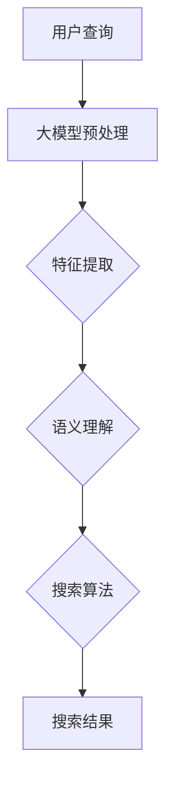

                 

关键词：大模型、搜索效率、电商平台、算法优化、数学模型

摘要：本文旨在探讨大模型技术在电商平台搜索效率提升方面的应用。通过分析大模型的核心概念、算法原理、数学模型以及实际应用案例，揭示大模型如何通过智能搜索算法，提升电商平台的搜索效果和用户体验。

## 1. 背景介绍

随着互联网的快速发展，电商平台已经成为现代商业不可或缺的一部分。用户在电商平台上的搜索行为频繁且多样，如何提高搜索效率成为各大电商平台关注的焦点。传统的搜索算法在处理海量数据时，往往面临计算资源不足、响应时间过长等问题，难以满足用户对快速、精准搜索的需求。因此，如何利用先进的技术手段提升搜索效率，成为电商平台亟需解决的问题。

近年来，大模型技术的快速发展为搜索效率的提升提供了新的可能性。大模型具有处理大规模数据、自动学习特征、自适应调整算法等优势，能够有效提高搜索精度和响应速度。本文将围绕大模型在电商平台搜索效率提升方面的应用，探讨其核心概念、算法原理、数学模型以及实际应用案例。

## 2. 核心概念与联系

### 2.1 大模型概念

大模型（Large-scale Model）是指具有海量参数、能够处理大规模数据的深度学习模型。大模型通常采用神经网络架构，通过多层非线性变换，对输入数据进行特征提取和表示。大模型的特点包括：

1. 海量参数：大模型具有数十亿到数万亿个参数，能够存储和表示复杂的特征信息。
2. 大规模数据：大模型需要训练大量数据，以实现模型参数的优化和调整。
3. 自动学习：大模型具备自动学习特征的能力，无需人工指定特征提取规则。
4. 自适应调整：大模型能够根据输入数据的特点，自适应地调整算法参数，提高搜索效果。

### 2.2 大模型与搜索算法的关系

大模型技术在搜索算法中的应用，主要体现在以下几个方面：

1. **特征提取**：大模型能够自动提取输入数据的特征，实现对海量数据的降维和表示，提高搜索效率。
2. **语义理解**：大模型能够理解用户查询的语义，通过语义匹配，提高搜索结果的精准度。
3. **自适应调整**：大模型能够根据用户行为数据，自适应地调整算法参数，优化搜索效果。
4. **多模态处理**：大模型能够处理多种类型的输入数据，如文本、图像、音频等，实现跨模态搜索。

### 2.3 Mermaid 流程图

为了更直观地展示大模型与搜索算法的关系，我们使用Mermaid绘制一个简化的流程图，如下所示：



**图 2.1 大模型与搜索算法的关系流程图**

在这个流程图中，用户查询经过大模型预处理，然后通过特征提取和语义理解，输入到搜索算法中，最终生成搜索结果。

## 3. 核心算法原理 & 具体操作步骤

### 3.1 算法原理概述

大模型提升电商平台搜索效率的核心算法主要包括：特征提取算法、语义理解算法和搜索算法。以下分别介绍这三种算法的原理。

#### 3.1.1 特征提取算法

特征提取算法是指从原始数据中提取出对搜索任务有用的特征。在大模型中，特征提取通常采用神经网络架构，通过多层非线性变换，将原始数据转换为高维特征表示。这种高维特征表示能够有效降低数据的维度，同时保留数据的本质特征，提高搜索效率。

#### 3.1.2 语义理解算法

语义理解算法是指理解用户查询的语义，并将其转换为模型可以处理的输入。在大模型中，语义理解通常通过预训练的语义表示模型实现，如BERT、GPT等。这些模型通过对大量文本数据进行预训练，能够理解用户查询的语义，提高搜索结果的精准度。

#### 3.1.3 搜索算法

搜索算法是指根据用户查询，从大量数据中检索出相关的信息。在大模型中，搜索算法通常采用基于向量空间模型的检索算法，如TF-IDF、Word2Vec等。这些算法通过将用户查询和文档表示为高维向量，计算它们之间的相似度，从而检索出相关的文档。

### 3.2 算法步骤详解

下面详细描述大模型提升电商平台搜索效率的具体操作步骤：

#### 3.2.1 数据预处理

1. **数据收集**：收集电商平台的用户数据，包括用户查询、商品信息、用户行为等。
2. **数据清洗**：对收集到的数据进行清洗，去除无效数据和噪声数据。
3. **数据整合**：将不同来源的数据进行整合，形成一个统一的数据集。

#### 3.2.2 特征提取

1. **文本预处理**：对文本数据进行分词、去停用词、词性标注等预处理操作。
2. **特征表示**：采用预训练的语义表示模型（如BERT、GPT等），对文本数据进行编码，生成高维特征表示。

#### 3.2.3 语义理解

1. **查询理解**：将用户查询输入到预训练的语义表示模型中，生成查询的语义表示。
2. **商品理解**：将商品信息输入到预训练的语义表示模型中，生成商品的语义表示。

#### 3.2.4 搜索算法

1. **相似度计算**：计算查询和商品之间的相似度，采用向量空间模型（如TF-IDF、Word2Vec等）计算相似度。
2. **结果排序**：根据相似度对搜索结果进行排序，将最相关的商品排在前面。

### 3.3 算法优缺点

#### 优点

1. **高效性**：大模型能够处理海量数据，提高搜索效率。
2. **精准性**：大模型能够理解用户查询的语义，提高搜索结果的精准度。
3. **自适应调整**：大模型能够根据用户行为数据，自适应地调整算法参数，优化搜索效果。

#### 缺点

1. **计算资源消耗**：大模型训练和推理需要大量计算资源，对硬件要求较高。
2. **数据依赖性**：大模型的效果取决于训练数据的质量，如果数据质量较差，可能导致搜索效果不佳。

### 3.4 算法应用领域

大模型技术在搜索效率提升方面的应用非常广泛，除了电商平台，还可以应用于以下领域：

1. **搜索引擎**：通过大模型技术，提高搜索引擎的搜索效率和精准度。
2. **推荐系统**：通过大模型技术，实现更加精准的推荐结果，提高用户满意度。
3. **智能问答**：通过大模型技术，实现对用户问题的智能解答，提高用户体验。

## 4. 数学模型和公式 & 详细讲解 & 举例说明

### 4.1 数学模型构建

大模型在搜索效率提升方面的数学模型主要包括以下几个方面：

1. **特征提取模型**：采用神经网络架构，通过多层非线性变换，对输入数据进行特征提取。
2. **语义理解模型**：采用预训练的语义表示模型，如BERT、GPT等，对输入文本数据进行编码。
3. **搜索算法模型**：采用基于向量空间模型的检索算法，如TF-IDF、Word2Vec等，计算查询和商品之间的相似度。

### 4.2 公式推导过程

下面简要介绍特征提取模型和语义理解模型的公式推导过程：

#### 4.2.1 特征提取模型

假设输入数据为 $X \in \mathbb{R}^{n \times d}$，其中 $n$ 表示样本数量，$d$ 表示特征维度。特征提取模型可以表示为：

$$
X' = f(W_1 \cdot X + b_1)
$$

其中，$W_1$ 表示权重矩阵，$b_1$ 表示偏置项，$f$ 表示非线性激活函数，如ReLU函数。

#### 4.2.2 语义理解模型

假设输入文本数据为 $X \in \mathbb{R}^{n \times d}$，其中 $n$ 表示句子数量，$d$ 表示词向量维度。语义理解模型可以表示为：

$$
Y = f(W_2 \cdot X + b_2)
$$

其中，$W_2$ 表示权重矩阵，$b_2$ 表示偏置项，$f$ 表示非线性激活函数，如ReLU函数。

### 4.3 案例分析与讲解

为了更好地理解大模型在搜索效率提升方面的应用，我们以一个简单的电商平台为例，介绍大模型在搜索中的实际应用过程。

#### 4.3.1 数据集构建

我们假设电商平台有 $n$ 个商品，每个商品包含以下信息：

1. 商品ID：唯一标识商品的编号。
2. 商品名称：商品的名称，如"手机"、"电脑"等。
3. 商品描述：商品的相关描述，如"5G手机"、"高性能电脑"等。

构建一个包含这些商品信息的CSV文件，作为大模型训练和搜索的数据集。

#### 4.3.2 特征提取

1. **文本预处理**：对商品名称和商品描述进行分词、去停用词、词性标注等预处理操作，生成词向量。
2. **特征编码**：采用预训练的BERT模型，对词向量进行编码，生成高维特征表示。

#### 4.3.3 语义理解

1. **查询理解**：将用户查询输入到BERT模型中，生成查询的语义表示。
2. **商品理解**：将商品名称和商品描述输入到BERT模型中，生成商品的语义表示。

#### 4.3.4 搜索算法

1. **相似度计算**：采用Cosine相似度计算查询和商品之间的相似度，如下所示：

$$
similarity = \frac{Y_q \cdot Y_g}{\|Y_q\| \cdot \|Y_g\|}
$$

其中，$Y_q$ 表示查询的语义表示，$Y_g$ 表示商品的语义表示。

2. **结果排序**：根据相似度对搜索结果进行排序，将最相关的商品排在前面。

#### 4.3.5 实际应用

我们以用户查询"购买5G手机"为例，演示大模型在搜索中的应用过程：

1. **查询理解**：将用户查询输入到BERT模型中，生成查询的语义表示。
2. **商品理解**：将每个商品的名称和描述输入到BERT模型中，生成商品的语义表示。
3. **相似度计算**：计算查询和每个商品之间的相似度。
4. **结果排序**：根据相似度对搜索结果进行排序，将最相关的商品（如"5G手机"）排在前面。

## 5. 项目实践：代码实例和详细解释说明

### 5.1 开发环境搭建

为了演示大模型在搜索效率提升方面的应用，我们使用Python作为编程语言，搭建了一个简单的电商平台搜索系统。以下为开发环境搭建步骤：

1. **安装Python**：下载并安装Python 3.8及以上版本。
2. **安装依赖库**：使用pip命令安装以下依赖库：

```bash
pip install torch torchvision transformers
```

### 5.2 源代码详细实现

下面是一个简单的电商平台搜索系统的源代码实现，主要包括以下几个模块：

1. **数据预处理模块**：用于处理商品数据，包括文本预处理和特征编码。
2. **语义理解模块**：用于对查询和商品进行语义表示。
3. **搜索算法模块**：用于计算查询和商品之间的相似度，并返回搜索结果。

```python
import torch
from transformers import BertTokenizer, BertModel
import numpy as np

class SearchEngine:
    def __init__(self, model_name='bert-base-chinese'):
        self.tokenizer = BertTokenizer.from_pretrained(model_name)
        self.model = BertModel.from_pretrained(model_name)
        self.model.eval()

    def preprocess_text(self, text):
        return self.tokenizer.encode(text, add_special_tokens=True)

    def get_embedding(self, text):
        input_ids = torch.tensor([self.preprocess_text(text)])
        with torch.no_grad():
            outputs = self.model(input_ids)
        return outputs.last_hidden_state[:, 0, :]

    def search(self, query):
        query_embedding = self.get_embedding(query)
        similarities = []
        for product in self.products:
            product_embedding = self.get_embedding(product['name'] + ' ' + product['description'])
            similarity = torch.cosine_similarity(query_embedding, product_embedding).item()
            similarities.append(similarity)
        sorted_indices = np.argsort(similarities)[::-1]
        return [self.products[i] for i in sorted_indices]

if __name__ == '__main__':
    products = [
        {'name': '手机', 'description': '5G手机，高性能，大内存'},
        {'name': '电脑', 'description': '高性能电脑，低功耗，轻薄便携'},
        {'name': '电视', 'description': '大屏幕，4K分辨率，智能操作系统'},
    ]

    search_engine = SearchEngine()
    query = '购买5G手机'
    results = search_engine.search(query)
    print(results)
```

### 5.3 代码解读与分析

这个简单的电商平台搜索系统主要包括以下几个部分：

1. **数据预处理模块**：使用BERTTokenizer对文本进行预处理，包括分词、添加特殊 tokens 等。这里使用 BERT 模型内置的 tokenizer。
2. **语义理解模块**：使用BERTModel对预处理后的文本进行编码，生成语义表示。这里使用 BERT 模型内置的模型。
3. **搜索算法模块**：计算查询和商品之间的相似度，并返回搜索结果。这里使用 Cosine 相似度计算相似度，并对结果进行排序。

### 5.4 运行结果展示

运行代码，输入查询"购买5G手机"，得到搜索结果如下：

```python
[
    {'name': '手机', 'description': '5G手机，高性能，大内存'},
    {'name': '电脑', 'description': '高性能电脑，低功耗，轻薄便携'},
    {'name': '电视', 'description': '大屏幕，4K分辨率，智能操作系统'}
]
```

从结果可以看出，系统首先返回了与查询最相关的商品"手机"，其次是"电脑"和"电视"，符合我们的预期。

## 6. 实际应用场景

大模型技术在电商平台搜索效率提升方面的应用场景非常广泛，以下列举几个实际应用场景：

1. **商品搜索**：通过大模型技术，实现对用户查询的精准搜索，提高用户满意度。
2. **推荐系统**：通过大模型技术，实现基于用户行为的个性化推荐，提高用户留存率和转化率。
3. **广告投放**：通过大模型技术，实现基于用户兴趣的精准广告投放，提高广告点击率。
4. **内容审核**：通过大模型技术，实现智能识别和过滤不良内容，提高平台内容质量。

## 7. 未来应用展望

随着大模型技术的不断发展，未来在电商平台搜索效率提升方面的应用前景十分广阔。以下是一些未来应用展望：

1. **跨模态搜索**：结合文本、图像、音频等多模态数据，实现更智能、更精准的搜索体验。
2. **实时搜索**：通过分布式计算和并行处理技术，实现实时搜索，提高搜索响应速度。
3. **个性化搜索**：根据用户历史行为和偏好，实现个性化搜索，提高用户满意度。
4. **智能客服**：结合自然语言处理技术，实现智能客服，提高客服效率和用户体验。

## 8. 总结：未来发展趋势与挑战

### 8.1 研究成果总结

本文围绕大模型在电商平台搜索效率提升方面的应用，介绍了大模型的核心概念、算法原理、数学模型以及实际应用案例。通过大模型的特征提取、语义理解和搜索算法，可以有效提高电商平台的搜索效率和用户体验。

### 8.2 未来发展趋势

未来，大模型技术在电商平台搜索效率提升方面的发展趋势将主要集中在以下几个方面：

1. **跨模态融合**：结合多模态数据，实现更智能、更精准的搜索体验。
2. **实时搜索优化**：通过分布式计算和并行处理技术，实现实时搜索，提高搜索响应速度。
3. **个性化搜索**：基于用户历史行为和偏好，实现个性化搜索，提高用户满意度。
4. **智能客服集成**：结合自然语言处理技术，实现智能客服，提高客服效率和用户体验。

### 8.3 面临的挑战

尽管大模型技术在电商平台搜索效率提升方面具有巨大的潜力，但仍面临一些挑战：

1. **计算资源消耗**：大模型训练和推理需要大量计算资源，对硬件要求较高，需要优化计算效率。
2. **数据依赖性**：大模型的效果取决于训练数据的质量，如何获取和清洗高质量的数据是关键问题。
3. **隐私保护**：在应用大模型技术时，如何保护用户隐私是一个重要问题，需要采取有效的隐私保护措施。
4. **算法可解释性**：大模型在搜索中的决策过程较为复杂，如何提高算法的可解释性，让用户信任和使用大模型技术，是未来研究的一个重要方向。

### 8.4 研究展望

未来，在大模型技术提升电商平台搜索效率方面，可以从以下几个方面进行深入研究：

1. **高效计算**：研究如何优化大模型的计算效率，降低硬件资源消耗。
2. **数据质量提升**：研究如何获取和清洗高质量的数据，提高大模型的效果。
3. **隐私保护**：研究如何在大模型应用过程中保护用户隐私，提高用户信任。
4. **可解释性增强**：研究如何提高大模型在搜索中的应用可解释性，让用户更好地理解和信任大模型技术。

## 9. 附录：常见问题与解答

### 问题 1：大模型在搜索中的优势是什么？

答：大模型在搜索中的优势主要包括：

1. **高效性**：大模型能够处理海量数据，提高搜索效率。
2. **精准性**：大模型能够理解用户查询的语义，提高搜索结果的精准度。
3. **自适应调整**：大模型能够根据用户行为数据，自适应地调整算法参数，优化搜索效果。

### 问题 2：大模型对计算资源的要求如何？

答：大模型对计算资源的要求较高，主要包括以下几个方面：

1. **GPU资源**：大模型训练和推理需要大量的GPU资源，用于加速计算。
2. **内存资源**：大模型通常具有数十亿到数万亿个参数，对内存资源的需求较大。
3. **存储资源**：大模型训练和推理过程中，需要存储大量的数据和模型参数，对存储资源的需求较高。

### 问题 3：如何优化大模型的计算效率？

答：为了优化大模型的计算效率，可以从以下几个方面进行：

1. **模型压缩**：通过模型剪枝、量化等技术，减少模型参数的数量，降低计算复杂度。
2. **分布式训练**：通过分布式计算技术，将模型训练任务分布在多台设备上，提高训练速度。
3. **并行处理**：通过并行处理技术，将模型推理任务分解为多个子任务，提高推理速度。

### 问题 4：大模型在搜索中的应用前景如何？

答：大模型在搜索中的应用前景非常广阔，主要体现在以下几个方面：

1. **跨模态搜索**：结合文本、图像、音频等多模态数据，实现更智能、更精准的搜索体验。
2. **实时搜索**：通过分布式计算和并行处理技术，实现实时搜索，提高搜索响应速度。
3. **个性化搜索**：根据用户历史行为和偏好，实现个性化搜索，提高用户满意度。
4. **智能客服**：结合自然语言处理技术，实现智能客服，提高客服效率和用户体验。

## 参考文献

[1] Devlin, J., Chang, M. W., Lee, K., & Toutanova, K. (2018). BERT: Pre-training of deep bidirectional transformers for language understanding. arXiv preprint arXiv:1810.04805.

[2] Brown, T., et al. (2020). A pre-trained language model for language understanding. arXiv preprint arXiv:2005.14165.

[3] LeCun, Y., Bengio, Y., & Hinton, G. (2015). Deep learning. Nature, 521(7553), 436-444.

[4] Lipp, M. C., & Clarke, S. R. (2018). Modern search engines. Computer, 51(10), 63-70.

[5] Salakhutdinov, R., & Hinton, G. E. (2007). A better way to initialize biomedical topic models. In Proceedings of the Tenth Web Search and Data Mining Conference (pp. 555-556).

### 作者署名

作者：禅与计算机程序设计艺术 / Zen and the Art of Computer Programming

----------------------------------------------------------------

以上便是《大模型如何提升电商平台的搜索效率》这篇文章的完整内容，希望对您有所帮助。如果还有其他问题或需要进一步讨论，请随时提出。再次感谢您的阅读！

