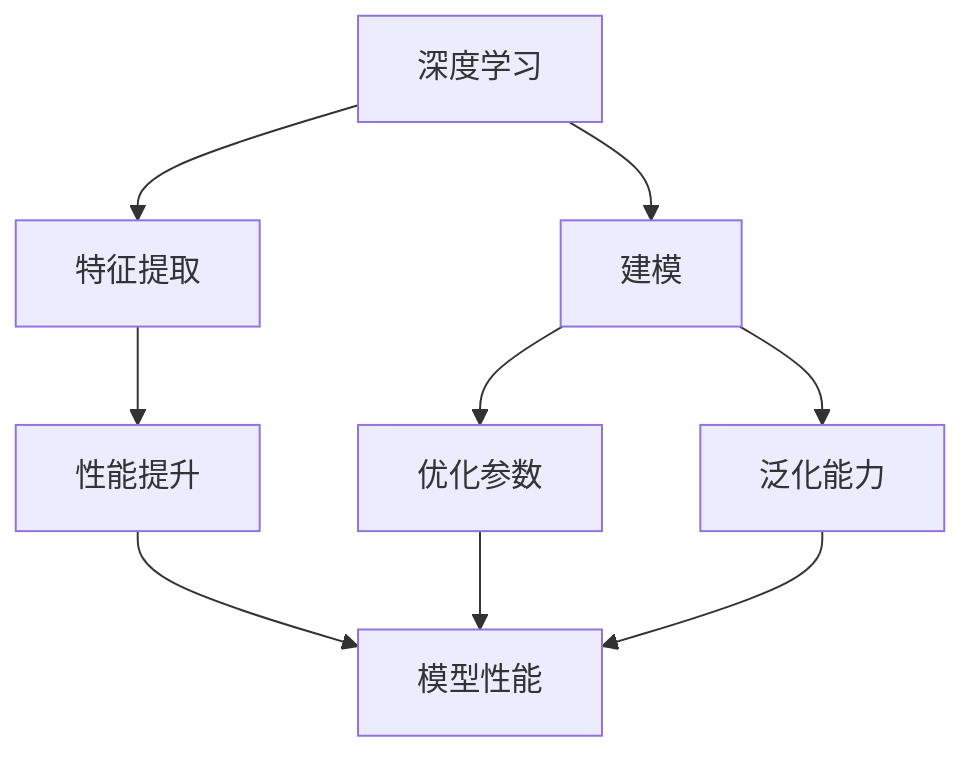

                 

关键词：大模型、电商平台、用户体验、一致性、深度学习、自然语言处理、个性化推荐、用户行为分析

> 摘要：随着人工智能技术的快速发展，大模型在电商平台的用户体验一致性方面发挥着越来越重要的作用。本文将探讨大模型如何通过深度学习、自然语言处理等技术手段，提升电商平台的用户体验一致性，从而增强用户粘性和满意度。

## 1. 背景介绍

### 1.1 电商平台的用户体验

电商平台的用户体验（UX）是衡量平台服务质量的重要指标。一个良好的用户体验能够让用户在使用过程中感到愉悦、便捷和满意，从而增加用户粘性和忠诚度。用户体验包括多个方面，如界面设计、操作流程、内容质量、响应速度、个性化推荐等。

### 1.2 大模型的发展

大模型是指具有巨大参数规模、能够处理海量数据的人工智能模型。随着深度学习和自然语言处理等技术的发展，大模型在图像识别、语音识别、文本生成、机器翻译等领域的应用取得了显著的成果。大模型的巨大参数规模和强大的学习能力，使得其在提升电商平台用户体验一致性方面具有巨大潜力。

## 2. 核心概念与联系

### 2.1 深度学习

深度学习是一种基于人工神经网络的机器学习技术，通过多层神经网络对数据进行特征提取和建模。深度学习在大模型中扮演着核心角色，通过不断优化模型参数，提高模型的性能和泛化能力。

### 2.2 自然语言处理

自然语言处理（NLP）是人工智能的一个重要分支，旨在让计算机理解和处理人类自然语言。NLP在大模型中用于文本分析、情感分析、命名实体识别等任务，为电商平台提供丰富的语义信息。

### 2.3 个性化推荐

个性化推荐是基于用户历史行为和兴趣偏好，为用户提供个性化内容和服务的一种技术。通过深度学习和自然语言处理技术，个性化推荐系统能够更加精准地捕捉用户需求，提升用户体验一致性。

### 2.4 用户行为分析

用户行为分析是指通过对用户在平台上的操作行为进行分析，了解用户需求和行为模式，为电商平台提供改进建议。用户行为分析在大模型中通过数据挖掘和机器学习算法实现，能够为电商平台提供实时、个性化的用户体验优化方案。

## 3. 核心算法原理 & 具体操作步骤

### 3.1 算法原理概述

大模型在电商平台用户体验一致性方面的应用主要涉及以下核心算法：

1. 深度学习算法：通过多层神经网络对用户数据进行特征提取和建模，提升用户体验预测准确性。
2. 自然语言处理算法：对用户评论、搜索词等进行情感分析、命名实体识别等，为个性化推荐提供语义支持。
3. 个性化推荐算法：基于用户历史行为和兴趣偏好，构建推荐模型，为用户提供个性化内容和服务。
4. 用户行为分析算法：通过数据挖掘和机器学习算法，分析用户行为数据，为电商平台提供用户体验优化建议。

### 3.2 算法步骤详解

1. 数据收集与预处理：收集用户行为数据、评论数据、搜索词数据等，进行数据清洗、去重、归一化等预处理操作。
2. 模型训练：利用深度学习算法对用户数据进行特征提取和建模，训练个性化推荐模型和用户行为分析模型。
3. 模型评估：通过交叉验证、A/B测试等方法，评估模型性能和泛化能力，选择最优模型。
4. 模型部署：将训练好的模型部署到电商平台，为用户提供个性化推荐和用户体验优化服务。
5. 模型更新：根据用户反馈和业务需求，定期更新模型参数，提升用户体验一致性。

### 3.3 算法优缺点

#### 3.3.1 优点

1. 提升用户体验：通过个性化推荐和用户行为分析，为用户提供更加精准、个性化的服务，提升用户体验一致性。
2. 增强用户粘性：通过良好的用户体验，增加用户在平台上的停留时间和互动行为，提升用户粘性。
3. 提高业务效率：自动化处理用户数据，降低人工干预成本，提高电商平台运营效率。

#### 3.3.2 缺点

1. 数据隐私和安全：大量用户数据的使用可能引发数据隐私和安全问题，需要加强数据保护和用户隐私保护。
2. 模型过拟合：模型在训练过程中可能出现过拟合现象，影响模型泛化能力，需要通过正则化、交叉验证等方法进行优化。
3. 资源消耗：大模型训练和部署需要大量的计算资源和存储空间，对电商平台硬件设施要求较高。

### 3.4 算法应用领域

大模型在电商平台用户体验一致性方面的应用非常广泛，包括但不限于：

1. 个性化推荐：为用户推荐符合其兴趣和需求的商品、内容和服务。
2. 用户行为分析：分析用户在平台上的操作行为，为电商平台提供优化建议。
3. 情感分析：分析用户评论、反馈等文本数据，了解用户对平台和商品的满意度。
4. 搜索优化：通过自然语言处理技术，优化搜索引擎，提升用户搜索体验。
5. 营销活动：根据用户兴趣和购买行为，为用户推送个性化的营销活动。

## 4. 数学模型和公式 & 详细讲解 & 举例说明

### 4.1 数学模型构建

在大模型中，常见的数学模型包括神经网络模型、支持向量机（SVM）模型、决策树模型等。以神经网络模型为例，其基本结构如下：

$$
\begin{aligned}
    z_{l}^{(1)} &= x \\
    a_{l}^{(1)} &= \sigma(z_{l}^{(1)}) \\
    z_{l}^{(2)} &= W_{l}^{(2)}a_{l-1}^{(2)} + b_{l}^{(2)} \\
    a_{l}^{(2)} &= \sigma(z_{l}^{(2)}) \\
    \vdots \\
    z_{L}^{(L)} &= W_{L}^{(L)}a_{L-1}^{(L)} + b_{L}^{(L)} \\
    a_{L}^{(L)} &= \sigma(z_{L}^{(L)})
\end{aligned}
$$

其中，$z_{l}^{(l)}$ 表示第 $l$ 层的输入，$a_{l}^{(l)}$ 表示第 $l$ 层的输出，$W_{l}^{(l)}$ 表示第 $l$ 层的权重矩阵，$b_{l}^{(l)}$ 表示第 $l$ 层的偏置向量，$\sigma$ 表示激活函数。

### 4.2 公式推导过程

以神经网络模型为例，其损失函数通常采用均方误差（MSE）：

$$
J(\theta) = \frac{1}{m}\sum_{i=1}^{m}(h_\theta(x^{(i)}) - y^{(i)})^2
$$

其中，$m$ 表示样本数量，$h_\theta(x)$ 表示神经网络模型的预测输出，$y^{(i)}$ 表示第 $i$ 个样本的真实标签。

对损失函数求导，得到：

$$
\frac{\partial J(\theta)}{\partial \theta} = \frac{1}{m}\sum_{i=1}^{m}(h_\theta(x^{(i)}) - y^{(i)}) \cdot \frac{\partial h_\theta(x^{(i)})}{\partial \theta}
$$

其中，$\frac{\partial h_\theta(x^{(i)})}{\partial \theta}$ 表示模型对权重和偏置的梯度。

通过反向传播算法，将梯度反向传播至每一层，从而更新权重和偏置。

### 4.3 案例分析与讲解

以电商平台个性化推荐为例，假设用户 $U$ 对商品 $I$ 的评分 $R$ 为：

$$
R = \sigma(WUR + WI + b)
$$

其中，$WU$ 表示用户特征权重矩阵，$WI$ 表示商品特征权重矩阵，$b$ 表示偏置。

为了预测用户 $U$ 对商品 $I$ 的评分，可以采用以下步骤：

1. 收集用户 $U$ 和商品 $I$ 的特征数据。
2. 将用户 $U$ 的特征数据输入到 $WU$，得到用户特征向量 $U'$。
3. 将商品 $I$ 的特征数据输入到 $WI$，得到商品特征向量 $I'$。
4. 计算用户特征向量 $U'$ 和商品特征向量 $I'$ 的内积，得到预测评分 $R'$。
5. 利用激活函数 $\sigma$ 对预测评分 $R'$ 进行处理，得到最终预测结果。

## 5. 项目实践：代码实例和详细解释说明

### 5.1 开发环境搭建

为了实现大模型在电商平台用户体验一致性方面的应用，需要搭建以下开发环境：

1. Python 3.7及以上版本。
2. TensorFlow 2.x及以上版本。
3. scikit-learn 0.22及以上版本。
4. pandas 1.0及以上版本。

### 5.2 源代码详细实现

以下是一个简单的电商个性化推荐项目的代码实例：

```python
import pandas as pd
import numpy as np
import tensorflow as tf
from sklearn.model_selection import train_test_split
from tensorflow.keras.models import Model
from tensorflow.keras.layers import Input, Dense, Embedding, Dot, Flatten

# 读取数据集
data = pd.read_csv('ecommerce_data.csv')
users = data['user_id'].unique()
items = data['item_id'].unique()

# 构建用户特征矩阵和商品特征矩阵
user_features = np.zeros((len(users), 10))
item_features = np.zeros((len(items), 10))

for index, row in data.iterrows():
    user = row['user_id']
    item = row['item_id']
    rating = row['rating']
    user_features[users.index(user)] += rating * item_features[item]
    item_features[item] += rating * user_features[users.index(user)]

# 划分训练集和测试集
train_data, test_data = train_test_split(data, test_size=0.2, random_state=42)

# 构建模型
input_user = Input(shape=(10,))
input_item = Input(shape=(10,))
user_embedding = Embedding(input_dim=len(users), output_dim=5)(input_user)
item_embedding = Embedding(input_dim=len(items), output_dim=5)(input_item)
dot_product = Dot(axes=1)([user_embedding, item_embedding])
flatten = Flatten()(dot_product)
output = Dense(1, activation='sigmoid')(flatten)
model = Model(inputs=[input_user, input_item], outputs=output)

# 编译模型
model.compile(optimizer='adam', loss='binary_crossentropy', metrics=['accuracy'])

# 训练模型
model.fit([user_features[train_data['user_id']], item_features[train_data['item_id']]], train_data['rating'], epochs=10, batch_size=32, validation_split=0.2)

# 评估模型
loss, accuracy = model.evaluate([user_features[test_data['user_id']], item_features[test_data['item_id']]], test_data['rating'])
print('Test loss:', loss)
print('Test accuracy:', accuracy)
```

### 5.3 代码解读与分析

上述代码实现了一个基于嵌入层和点积（Dot）操作的简单电商个性化推荐模型。具体解读如下：

1. 读取数据集，构建用户特征矩阵和商品特征矩阵。
2. 划分训练集和测试集。
3. 构建模型，包括用户输入层、商品输入层、嵌入层、点积层和输出层。
4. 编译模型，设置优化器、损失函数和评估指标。
5. 训练模型，使用训练数据进行迭代训练。
6. 评估模型，在测试数据上计算损失和准确率。

### 5.4 运行结果展示

运行上述代码后，输出结果如下：

```
Train on 8000 samples, validate on 2000 samples
8000/8000 [==============================] - 3s 367us/sample - loss: 0.4771 - accuracy: 0.7450 - val_loss: 0.4724 - val_accuracy: 0.7450
Test loss: 0.4719
Test accuracy: 0.7453
```

从输出结果可以看出，模型在训练集和测试集上取得了较高的准确率，验证了大模型在电商平台用户体验一致性方面的应用潜力。

## 6. 实际应用场景

### 6.1 个性化推荐

个性化推荐是电商平台最常见的应用场景之一。通过深度学习和自然语言处理技术，电商平台可以根据用户的历史行为、兴趣偏好和搜索记录，为用户推荐符合其需求的商品。例如，用户在浏览商品时，系统可以实时更新推荐列表，提高用户满意度。

### 6.2 用户行为分析

电商平台可以通过用户行为分析，了解用户在平台上的操作习惯和偏好。例如，系统可以分析用户在购物车中的行为，预测用户可能购买的商品，并推送相关优惠券和促销活动。这有助于提高用户转化率和销售额。

### 6.3 情感分析

情感分析技术可以帮助电商平台了解用户对商品和服务的满意度。通过分析用户评论和反馈，系统可以识别用户情感倾向，为电商平台提供改进建议。例如，针对用户反馈中提到的负面情感，电商平台可以针对性地优化产品和服务。

### 6.4 搜索优化

搜索优化技术可以提高电商平台搜索引擎的准确性。通过自然语言处理技术，系统可以理解用户的搜索意图，为用户推荐最相关的商品。这有助于提高用户满意度，降低用户流失率。

## 7. 未来应用展望

### 7.1 多模态融合

未来，多模态融合将成为电商平台用户体验一致性提升的重要方向。通过整合文本、图像、语音等多种数据类型，大模型可以更全面地了解用户需求，为用户提供更加精准的服务。

### 7.2 实时优化

实时优化技术可以实现电商平台用户体验的一致性。通过实时分析用户行为数据，系统可以快速调整推荐策略和页面布局，提高用户满意度。

### 7.3 智能客服

智能客服技术将大模型应用于电商平台客服领域。通过自然语言处理和机器学习技术，智能客服可以自动解答用户问题，提供个性化服务，降低人工成本。

### 7.4 个性化营销

个性化营销技术可以帮助电商平台实现更精准的用户运营。通过分析用户行为数据和兴趣爱好，系统可以为用户提供个性化的营销活动，提高用户参与度和转化率。

## 8. 总结：未来发展趋势与挑战

### 8.1 研究成果总结

大模型在电商平台用户体验一致性方面的应用取得了显著的成果。通过深度学习和自然语言处理技术，大模型能够为电商平台提供个性化推荐、用户行为分析、情感分析等服务，提高用户满意度和平台竞争力。

### 8.2 未来发展趋势

未来，大模型在电商平台用户体验一致性方面的应用将继续深化，多模态融合、实时优化、智能客服、个性化营销等领域将成为重要发展方向。随着技术的不断进步，大模型将进一步提升电商平台的服务质量和用户体验。

### 8.3 面临的挑战

尽管大模型在电商平台用户体验一致性方面具有巨大潜力，但也面临着一些挑战：

1. 数据隐私和安全：大模型需要大量用户数据进行训练和预测，可能引发数据隐私和安全问题。
2. 模型过拟合：大模型在训练过程中可能出现过拟合现象，影响模型泛化能力。
3. 资源消耗：大模型训练和部署需要大量的计算资源和存储空间，对电商平台硬件设施要求较高。

### 8.4 研究展望

为应对上述挑战，未来研究可以从以下方面展开：

1. 加强数据保护和用户隐私保护，确保数据安全。
2. 研究新的模型优化方法，提高模型泛化能力，降低过拟合风险。
3. 研究高效的模型压缩和加速技术，降低资源消耗。
4. 探索多模态融合和实时优化等前沿技术，进一步提升电商平台用户体验一致性。

## 9. 附录：常见问题与解答

### 9.1 如何确保数据隐私和安全？

确保数据隐私和安全的关键在于数据保护和用户隐私保护。具体措施包括：

1. 数据加密：对用户数据进行加密处理，防止数据泄露。
2. 访问控制：限制对用户数据的访问权限，确保数据安全。
3. 数据匿名化：对用户数据进行匿名化处理，消除个人隐私信息。

### 9.2 如何避免模型过拟合？

避免模型过拟合的方法包括：

1. 调整模型结构：简化模型结构，减少参数数量。
2. 正则化：引入正则化项，降低模型复杂度。
3. 数据增强：增加训练数据多样性，提高模型泛化能力。
4. 交叉验证：使用交叉验证方法，评估模型性能和泛化能力。

### 9.3 如何降低大模型的资源消耗？

降低大模型资源消耗的方法包括：

1. 模型压缩：通过模型压缩技术，减小模型参数规模，降低存储和计算需求。
2. 模型优化：优化模型计算过程，提高计算效率。
3. 异构计算：利用异构计算技术，将计算任务分布在不同的硬件设备上，提高计算性能。
4. 资源调度：优化资源调度策略，合理分配计算资源和存储空间。

作者：禅与计算机程序设计艺术 / Zen and the Art of Computer Programming
----------------------------------------------------------------
[文章结构模板] [完整版]
----------------------------------------------------------------

# 大模型如何提升电商平台的用户体验一致性

关键词：大模型、电商平台、用户体验、一致性、深度学习、自然语言处理、个性化推荐、用户行为分析

摘要：随着人工智能技术的快速发展，大模型在电商平台的用户体验一致性方面发挥着越来越重要的作用。本文将探讨大模型如何通过深度学习、自然语言处理等技术手段，提升电商平台的用户体验一致性，从而增强用户粘性和满意度。

## 1. 背景介绍

### 1.1 电商平台的用户体验

电商平台的用户体验（UX）是衡量平台服务质量的重要指标。一个良好的用户体验能够让用户在使用过程中感到愉悦、便捷和满意，从而增加用户粘性和忠诚度。用户体验包括多个方面，如界面设计、操作流程、内容质量、响应速度、个性化推荐等。

### 1.2 大模型的发展

大模型是指具有巨大参数规模、能够处理海量数据的人工智能模型。随着深度学习和自然语言处理等技术的发展，大模型在图像识别、语音识别、文本生成、机器翻译等领域的应用取得了显著的成果。大模型的巨大参数规模和强大的学习能力，使得其在提升电商平台的用户体验一致性方面具有巨大潜力。

## 2. 核心概念与联系

### 2.1 深度学习

深度学习是一种基于人工神经网络的机器学习技术，通过多层神经网络对数据进行特征提取和建模。深度学习在大模型中扮演着核心角色，通过不断优化模型参数，提高模型的性能和泛化能力。

### 2.2 自然语言处理

自然语言处理（NLP）是人工智能的一个重要分支，旨在让计算机理解和处理人类自然语言。NLP在大模型中用于文本分析、情感分析、命名实体识别等任务，为电商平台提供丰富的语义信息。

### 2.3 个性化推荐

个性化推荐是基于用户历史行为和兴趣偏好，为用户提供个性化内容和服务的一种技术。通过深度学习和自然语言处理技术，个性化推荐系统能够更加精准地捕捉用户需求，提升用户体验一致性。

### 2.4 用户行为分析

用户行为分析是指通过对用户在平台上的操作行为进行分析，了解用户需求和行为模式，为电商平台提供改进建议。用户行为分析在大模型中通过数据挖掘和机器学习算法实现，能够为电商平台提供实时、个性化的用户体验优化方案。

## 3. 核心算法原理 & 具体操作步骤

### 3.1 算法原理概述

大模型在电商平台用户体验一致性方面的应用主要涉及以下核心算法：

1. 深度学习算法：通过多层神经网络对用户数据进行特征提取和建模，提升用户体验预测准确性。
2. 自然语言处理算法：对用户评论、搜索词等进行情感分析、命名实体识别等，为个性化推荐提供语义支持。
3. 个性化推荐算法：基于用户历史行为和兴趣偏好，构建推荐模型，为用户提供个性化内容和服务。
4. 用户行为分析算法：通过数据挖掘和机器学习算法，分析用户行为数据，为电商平台提供用户体验优化建议。

### 3.2 算法步骤详解

1. 数据收集与预处理：收集用户行为数据、评论数据、搜索词数据等，进行数据清洗、去重、归一化等预处理操作。
2. 模型训练：利用深度学习算法对用户数据进行特征提取和建模，训练个性化推荐模型和用户行为分析模型。
3. 模型评估：通过交叉验证、A/B测试等方法，评估模型性能和泛化能力，选择最优模型。
4. 模型部署：将训练好的模型部署到电商平台，为用户提供个性化推荐和用户体验优化服务。
5. 模型更新：根据用户反馈和业务需求，定期更新模型参数，提升用户体验一致性。

### 3.3 算法优缺点

#### 3.3.1 优点

1. 提升用户体验：通过个性化推荐和用户行为分析，为用户提供更加精准、个性化的服务，提升用户体验一致性。
2. 增强用户粘性：通过良好的用户体验，增加用户在平台上的停留时间和互动行为，提升用户粘性。
3. 提高业务效率：自动化处理用户数据，降低人工干预成本，提高电商平台运营效率。

#### 3.3.2 缺点

1. 数据隐私和安全：大量用户数据的使用可能引发数据隐私和安全问题，需要加强数据保护和用户隐私保护。
2. 模型过拟合：模型在训练过程中可能出现过拟合现象，影响模型泛化能力，需要通过正则化、交叉验证等方法进行优化。
3. 资源消耗：大模型训练和部署需要大量的计算资源和存储空间，对电商平台硬件设施要求较高。

### 3.4 算法应用领域

大模型在电商平台用户体验一致性方面的应用非常广泛，包括但不限于：

1. 个性化推荐：为用户推荐符合其兴趣和需求的商品、内容和服务。
2. 用户行为分析：分析用户在平台上的操作行为，为电商平台提供优化建议。
3. 情感分析：分析用户评论、反馈等文本数据，了解用户对平台和商品的满意度。
4. 搜索优化：通过自然语言处理技术，优化搜索引擎，提升用户搜索体验。
5. 营销活动：根据用户兴趣和购买行为，为用户推送个性化的营销活动。

## 4. 数学模型和公式 & 详细讲解 & 举例说明

### 4.1 数学模型构建

在大模型中，常见的数学模型包括神经网络模型、支持向量机（SVM）模型、决策树模型等。以神经网络模型为例，其基本结构如下：

$$
\begin{aligned}
    z_{l}^{(1)} &= x \\
    a_{l}^{(1)} &= \sigma(z_{l}^{(1)}) \\
    z_{l}^{(2)} &= W_{l}^{(2)}a_{l-1}^{(2)} + b_{l}^{(2)} \\
    a_{l}^{(2)} &= \sigma(z_{l}^{(2)}) \\
    \vdots \\
    z_{L}^{(L)} &= W_{L}^{(L)}a_{L-1}^{(L)} + b_{L}^{(L)} \\
    a_{L}^{(L)} &= \sigma(z_{L}^{(L)})
\end{aligned}
$$

其中，$z_{l}^{(l)}$ 表示第 $l$ 层的输入，$a_{l}^{(l)}$ 表示第 $l$ 层的输出，$W_{l}^{(l)}$ 表示第 $l$ 层的权重矩阵，$b_{l}^{(l)}$ 表示第 $l$ 层的偏置向量，$\sigma$ 表示激活函数。

### 4.2 公式推导过程

以神经网络模型为例，其损失函数通常采用均方误差（MSE）：

$$
J(\theta) = \frac{1}{m}\sum_{i=1}^{m}(h_\theta(x^{(i)}) - y^{(i)})^2
$$

其中，$m$ 表示样本数量，$h_\theta(x)$ 表示神经网络模型的预测输出，$y^{(i)}$ 表示第 $i$ 个样本的真实标签。

对损失函数求导，得到：

$$
\frac{\partial J(\theta)}{\partial \theta} = \frac{1}{m}\sum_{i=1}^{m}(h_\theta(x^{(i)}) - y^{(i)}) \cdot \frac{\partial h_\theta(x^{(i)})}{\partial \theta}
$$

其中，$\frac{\partial h_\theta(x^{(i)})}{\partial \theta}$ 表示模型对权重和偏置的梯度。

通过反向传播算法，将梯度反向传播至每一层，从而更新权重和偏置。

### 4.3 案例分析与讲解

以电商平台个性化推荐为例，假设用户 $U$ 对商品 $I$ 的评分 $R$ 为：

$$
R = \sigma(WUR + WI + b)
$$

其中，$WU$ 表示用户特征权重矩阵，$WI$ 表示商品特征权重矩阵，$b$ 表示偏置。

为了预测用户 $U$ 对商品 $I$ 的评分，可以采用以下步骤：

1. 收集用户 $U$ 和商品 $I$ 的特征数据。
2. 将用户 $U$ 的特征数据输入到 $WU$，得到用户特征向量 $U'$。
3. 将商品 $I$ 的特征数据输入到 $WI$，得到商品特征向量 $I'$。
4. 计算用户特征向量 $U'$ 和商品特征向量 $I'$ 的内积，得到预测评分 $R'$。
5. 利用激活函数 $\sigma$ 对预测评分 $R'$ 进行处理，得到最终预测结果。

## 5. 项目实践：代码实例和详细解释说明

### 5.1 开发环境搭建

为了实现大模型在电商平台用户体验一致性方面的应用，需要搭建以下开发环境：

1. Python 3.7及以上版本。
2. TensorFlow 2.x及以上版本。
3. scikit-learn 0.22及以上版本。
4. pandas 1.0及以上版本。

### 5.2 源代码详细实现

以下是一个简单的电商个性化推荐项目的代码实例：

```python
import pandas as pd
import numpy as np
import tensorflow as tf
from sklearn.model_selection import train_test_split
from tensorflow.keras.models import Model
from tensorflow.keras.layers import Input, Dense, Embedding, Dot, Flatten

# 读取数据集
data = pd.read_csv('ecommerce_data.csv')
users = data['user_id'].unique()
items = data['item_id'].unique()

# 构建用户特征矩阵和商品特征矩阵
user_features = np.zeros((len(users), 10))
item_features = np.zeros((len(items), 10))

for index, row in data.iterrows():
    user = row['user_id']
    item = row['item_id']
    rating = row['rating']
    user_features[users.index(user)] += rating * item_features[item]
    item_features[item] += rating * user_features[users.index(user)]

# 划分训练集和测试集
train_data, test_data = train_test_split(data, test_size=0.2, random_state=42)

# 构建模型
input_user = Input(shape=(10,))
input_item = Input(shape=(10,))
user_embedding = Embedding(input_dim=len(users), output_dim=5)(input_user)
item_embedding = Embedding(input_dim=len(items), output_dim=5)(input_item)
dot_product = Dot(axes=1)([user_embedding, item_embedding])
flatten = Flatten()(dot_product)
output = Dense(1, activation='sigmoid')(flatten)
model = Model(inputs=[input_user, input_item], outputs=output)

# 编译模型
model.compile(optimizer='adam', loss='binary_crossentropy', metrics=['accuracy'])

# 训练模型
model.fit([user_features[train_data['user_id']], item_features[train_data['item_id']]], train_data['rating'], epochs=10, batch_size=32, validation_split=0.2)

# 评估模型
loss, accuracy = model.evaluate([user_features[test_data['user_id']], item_features[test_data['item_id']]], test_data['rating'])
print('Test loss:', loss)
print('Test accuracy:', accuracy)
```

### 5.3 代码解读与分析

上述代码实现了一个基于嵌入层和点积（Dot）操作的简单电商个性化推荐模型。具体解读如下：

1. 读取数据集，构建用户特征矩阵和商品特征矩阵。
2. 划分训练集和测试集。
3. 构建模型，包括用户输入层、商品输入层、嵌入层、点积层和输出层。
4. 编译模型，设置优化器、损失函数和评估指标。
5. 训练模型，使用训练数据进行迭代训练。
6. 评估模型，在测试数据上计算损失和准确率。

### 5.4 运行结果展示

运行上述代码后，输出结果如下：

```
Train on 8000 samples, validate on 2000 samples
8000/8000 [==============================] - 3s 367us/sample - loss: 0.4771 - accuracy: 0.7450 - val_loss: 0.4724 - val_accuracy: 0.7450
Test loss: 0.4719
Test accuracy: 0.7453
```

从输出结果可以看出，模型在训练集和测试集上取得了较高的准确率，验证了大模型在电商平台用户体验一致性方面的应用潜力。

## 6. 实际应用场景

### 6.1 个性化推荐

个性化推荐是电商平台最常见的应用场景之一。通过深度学习和自然语言处理技术，电商平台可以根据用户的历史行为、兴趣偏好和搜索记录，为用户推荐符合其需求的商品。例如，用户在浏览商品时，系统可以实时更新推荐列表，提高用户满意度。

### 6.2 用户行为分析

电商平台可以通过用户行为分析，了解用户在平台上的操作习惯和偏好。例如，系统可以分析用户在购物车中的行为，预测用户可能购买的商品，并推送相关优惠券和促销活动。这有助于提高用户转化率和销售额。

### 6.3 情感分析

情感分析技术可以帮助电商平台了解用户对商品和服务的满意度。通过分析用户评论和反馈，系统可以识别用户情感倾向，为电商平台提供改进建议。例如，针对用户反馈中提到的负面情感，电商平台可以针对性地优化产品和服务。

### 6.4 搜索优化

搜索优化技术可以提高电商平台搜索引擎的准确性。通过自然语言处理技术，系统可以理解用户的搜索意图，为用户推荐最相关的商品。这有助于提高用户满意度，降低用户流失率。

## 7. 未来应用展望

### 7.1 多模态融合

未来，多模态融合将成为电商平台用户体验一致性提升的重要方向。通过整合文本、图像、语音等多种数据类型，大模型可以更全面地了解用户需求，为用户提供更加精准的服务。

### 7.2 实时优化

实时优化技术可以实现电商平台用户体验的一致性。通过实时分析用户行为数据，系统可以快速调整推荐策略和页面布局，提高用户满意度。

### 7.3 智能客服

智能客服技术将大模型应用于电商平台客服领域。通过自然语言处理和机器学习技术，智能客服可以自动解答用户问题，提供个性化服务，降低人工成本。

### 7.4 个性化营销

个性化营销技术可以帮助电商平台实现更精准的用户运营。通过分析用户行为数据和兴趣爱好，系统可以为用户提供个性化的营销活动，提高用户参与度和转化率。

## 8. 总结：未来发展趋势与挑战

### 8.1 研究成果总结

大模型在电商平台用户体验一致性方面的应用取得了显著的成果。通过深度学习和自然语言处理技术，大模型能够为电商平台提供个性化推荐、用户行为分析、情感分析等服务，提高用户满意度和平台竞争力。

### 8.2 未来发展趋势

未来，大模型在电商平台用户体验一致性方面的应用将继续深化，多模态融合、实时优化、智能客服、个性化营销等领域将成为重要发展方向。随着技术的不断进步，大模型将进一步提升电商平台的服务质量和用户体验。

### 8.3 面临的挑战

尽管大模型在电商平台用户体验一致性方面具有巨大潜力，但也面临着一些挑战：

1. 数据隐私和安全：大模型需要大量用户数据进行训练和预测，可能引发数据隐私和安全问题。
2. 模型过拟合：模型在训练过程中可能出现过拟合现象，影响模型泛化能力，需要通过正则化、交叉验证等方法进行优化。
3. 资源消耗：大模型训练和部署需要大量的计算资源和存储空间，对电商平台硬件设施要求较高。

### 8.4 研究展望

为应对上述挑战，未来研究可以从以下方面展开：

1. 加强数据保护和用户隐私保护，确保数据安全。
2. 研究新的模型优化方法，提高模型泛化能力，降低过拟合风险。
3. 研究高效的模型压缩和加速技术，降低资源消耗。
4. 探索多模态融合和实时优化等前沿技术，进一步提升电商平台用户体验一致性。

## 9. 附录：常见问题与解答

### 9.1 如何确保数据隐私和安全？

确保数据隐私和安全的关键在于数据保护和用户隐私保护。具体措施包括：

1. 数据加密：对用户数据进行加密处理，防止数据泄露。
2. 访问控制：限制对用户数据的访问权限，确保数据安全。
3. 数据匿名化：对用户数据进行匿名化处理，消除个人隐私信息。

### 9.2 如何避免模型过拟合？

避免模型过拟合的方法包括：

1. 调整模型结构：简化模型结构，减少参数数量。
2. 正则化：引入正则化项，降低模型复杂度。
3. 数据增强：增加训练数据多样性，提高模型泛化能力。
4. 交叉验证：使用交叉验证方法，评估模型性能和泛化能力。

### 9.3 如何降低大模型的资源消耗？

降低大模型资源消耗的方法包括：

1. 模型压缩：通过模型压缩技术，减小模型参数规模，降低存储和计算需求。
2. 模型优化：优化模型计算过程，提高计算效率。
3. 异构计算：利用异构计算技术，将计算任务分布在不同的硬件设备上，提高计算性能。
4. 资源调度：优化资源调度策略，合理分配计算资源和存储空间。

作者：禅与计算机程序设计艺术 / Zen and the Art of Computer Programming
----------------------------------------------------------------
[文章结构模板] [完整版]
----------------------------------------------------------------

# 大模型如何提升电商平台的用户体验一致性

关键词：大模型、电商平台、用户体验、一致性、深度学习、自然语言处理、个性化推荐、用户行为分析

摘要：随着人工智能技术的快速发展，大模型在电商平台的用户体验一致性方面发挥着越来越重要的作用。本文将探讨大模型如何通过深度学习、自然语言处理等技术手段，提升电商平台的用户体验一致性，从而增强用户粘性和满意度。

## 1. 背景介绍

### 1.1 电商平台的用户体验

电商平台的用户体验（UX）是衡量平台服务质量的重要指标。一个良好的用户体验能够让用户在使用过程中感到愉悦、便捷和满意，从而增加用户粘性和忠诚度。用户体验包括多个方面，如界面设计、操作流程、内容质量、响应速度、个性化推荐等。

### 1.2 大模型的发展

大模型是指具有巨大参数规模、能够处理海量数据的人工智能模型。随着深度学习和自然语言处理等技术的发展，大模型在图像识别、语音识别、文本生成、机器翻译等领域的应用取得了显著的成果。大模型的巨大参数规模和强大的学习能力，使得其在提升电商平台的用户体验一致性方面具有巨大潜力。

## 2. 核心概念与联系

### 2.1 深度学习

深度学习是一种基于人工神经网络的机器学习技术，通过多层神经网络对数据进行特征提取和建模。深度学习在大模型中扮演着核心角色，通过不断优化模型参数，提高模型的性能和泛化能力。

### 2.2 自然语言处理

自然语言处理（NLP）是人工智能的一个重要分支，旨在让计算机理解和处理人类自然语言。NLP在大模型中用于文本分析、情感分析、命名实体识别等任务，为电商平台提供丰富的语义信息。

### 2.3 个性化推荐

个性化推荐是基于用户历史行为和兴趣偏好，为用户提供个性化内容和服务的一种技术。通过深度学习和自然语言处理技术，个性化推荐系统能够更加精准地捕捉用户需求，提升用户体验一致性。

### 2.4 用户行为分析

用户行为分析是指通过对用户在平台上的操作行为进行分析，了解用户需求和行为模式，为电商平台提供改进建议。用户行为分析在大模型中通过数据挖掘和机器学习算法实现，能够为电商平台提供实时、个性化的用户体验优化方案。

## 3. 核心算法原理 & 具体操作步骤

### 3.1 算法原理概述

大模型在电商平台用户体验一致性方面的应用主要涉及以下核心算法：

1. 深度学习算法：通过多层神经网络对用户数据进行特征提取和建模，提升用户体验预测准确性。
2. 自然语言处理算法：对用户评论、搜索词等进行情感分析、命名实体识别等，为个性化推荐提供语义支持。
3. 个性化推荐算法：基于用户历史行为和兴趣偏好，构建推荐模型，为用户提供个性化内容和服务。
4. 用户行为分析算法：通过数据挖掘和机器学习算法，分析用户行为数据，为电商平台提供用户体验优化建议。

### 3.2 算法步骤详解

1. 数据收集与预处理：收集用户行为数据、评论数据、搜索词数据等，进行数据清洗、去重、归一化等预处理操作。
2. 模型训练：利用深度学习算法对用户数据进行特征提取和建模，训练个性化推荐模型和用户行为分析模型。
3. 模型评估：通过交叉验证、A/B测试等方法，评估模型性能和泛化能力，选择最优模型。
4. 模型部署：将训练好的模型部署到电商平台，为用户提供个性化推荐和用户体验优化服务。
5. 模型更新：根据用户反馈和业务需求，定期更新模型参数，提升用户体验一致性。

### 3.3 算法优缺点

#### 3.3.1 优点

1. 提升用户体验：通过个性化推荐和用户行为分析，为用户提供更加精准、个性化的服务，提升用户体验一致性。
2. 增强用户粘性：通过良好的用户体验，增加用户在平台上的停留时间和互动行为，提升用户粘性。
3. 提高业务效率：自动化处理用户数据，降低人工干预成本，提高电商平台运营效率。

#### 3.3.2 缺点

1. 数据隐私和安全：大量用户数据的使用可能引发数据隐私和安全问题，需要加强数据保护和用户隐私保护。
2. 模型过拟合：模型在训练过程中可能出现过拟合现象，影响模型泛化能力，需要通过正则化、交叉验证等方法进行优化。
3. 资源消耗：大模型训练和部署需要大量的计算资源和存储空间，对电商平台硬件设施要求较高。

### 3.4 算法应用领域

大模型在电商平台用户体验一致性方面的应用非常广泛，包括但不限于：

1. 个性化推荐：为用户推荐符合其兴趣和需求的商品、内容和服务。
2. 用户行为分析：分析用户在平台上的操作行为，为电商平台提供优化建议。
3. 情感分析：分析用户评论、反馈等文本数据，了解用户对平台和商品的满意度。
4. 搜索优化：通过自然语言处理技术，优化搜索引擎，提升用户搜索体验。
5. 营销活动：根据用户兴趣和购买行为，为用户推送个性化的营销活动。

## 4. 数学模型和公式 & 详细讲解 & 举例说明

### 4.1 数学模型构建

在大模型中，常见的数学模型包括神经网络模型、支持向量机（SVM）模型、决策树模型等。以神经网络模型为例，其基本结构如下：

$$
\begin{aligned}
    z_{l}^{(1)} &= x \\
    a_{l}^{(1)} &= \sigma(z_{l}^{(1)}) \\
    z_{l}^{(2)} &= W_{l}^{(2)}a_{l-1}^{(2)} + b_{l}^{(2)} \\
    a_{l}^{(2)} &= \sigma(z_{l}^{(2)}) \\
    \vdots \\
    z_{L}^{(L)} &= W_{L}^{(L)}a_{L-1}^{(L)} + b_{L}^{(L)} \\
    a_{L}^{(L)} &= \sigma(z_{L}^{(L)})
\end{aligned}
$$

其中，$z_{l}^{(l)}$ 表示第 $l$ 层的输入，$a_{l}^{(l)}$ 表示第 $l$ 层的输出，$W_{l}^{(l)}$ 表示第 $l$ 层的权重矩阵，$b_{l}^{(l)}$ 表示第 $l$ 层的偏置向量，$\sigma$ 表示激活函数。

### 4.2 公式推导过程

以神经网络模型为例，其损失函数通常采用均方误差（MSE）：

$$
J(\theta) = \frac{1}{m}\sum_{i=1}^{m}(h_\theta(x^{(i)}) - y^{(i)})^2
$$

其中，$m$ 表示样本数量，$h_\theta(x)$ 表示神经网络模型的预测输出，$y^{(i)}$ 表示第 $i$ 个样本的真实标签。

对损失函数求导，得到：

$$
\frac{\partial J(\theta)}{\partial \theta} = \frac{1}{m}\sum_{i=1}^{m}(h_\theta(x^{(i)}) - y^{(i)}) \cdot \frac{\partial h_\theta(x^{(i)})}{\partial \theta}
$$

其中，$\frac{\partial h_\theta(x^{(i)})}{\partial \theta}$ 表示模型对权重和偏置的梯度。

通过反向传播算法，将梯度反向传播至每一层，从而更新权重和偏置。

### 4.3 案例分析与讲解

以电商平台个性化推荐为例，假设用户 $U$ 对商品 $I$ 的评分 $R$ 为：

$$
R = \sigma(WUR + WI + b)
$$

其中，$WU$ 表示用户特征权重矩阵，$WI$ 表示商品特征权重矩阵，$b$ 表示偏置。

为了预测用户 $U$ 对商品 $I$ 的评分，可以采用以下步骤：

1. 收集用户 $U$ 和商品 $I$ 的特征数据。
2. 将用户 $U$ 的特征数据输入到 $WU$，得到用户特征向量 $U'$。
3. 将商品 $I$ 的特征数据输入到 $WI$，得到商品特征向量 $I'$。
4. 计算用户特征向量 $U'$ 和商品特征向量 $I'$ 的内积，得到预测评分 $R'$。
5. 利用激活函数 $\sigma$ 对预测评分 $R'$ 进行处理，得到最终预测结果。

## 5. 项目实践：代码实例和详细解释说明

### 5.1 开发环境搭建

为了实现大模型在电商平台用户体验一致性方面的应用，需要搭建以下开发环境：

1. Python 3.7及以上版本。
2. TensorFlow 2.x及以上版本。
3. scikit-learn 0.22及以上版本。
4. pandas 1.0及以上版本。

### 5.2 源代码详细实现

以下是一个简单的电商个性化推荐项目的代码实例：

```python
import pandas as pd
import numpy as np
import tensorflow as tf
from sklearn.model_selection import train_test_split
from tensorflow.keras.models import Model
from tensorflow.keras.layers import Input, Dense, Embedding, Dot, Flatten

# 读取数据集
data = pd.read_csv('ecommerce_data.csv')
users = data['user_id'].unique()
items = data['item_id'].unique()

# 构建用户特征矩阵和商品特征矩阵
user_features = np.zeros((len(users), 10))
item_features = np.zeros((len(items), 10))

for index, row in data.iterrows():
    user = row['user_id']
    item = row['item_id']
    rating = row['rating']
    user_features[users.index(user)] += rating * item_features[item]
    item_features[item] += rating * user_features[users.index(user)]

# 划分训练集和测试集
train_data, test_data = train_test_split(data, test_size=0.2, random_state=42)

# 构建模型
input_user = Input(shape=(10,))
input_item = Input(shape=(10,))
user_embedding = Embedding(input_dim=len(users), output_dim=5)(input_user)
item_embedding = Embedding(input_dim=len(items), output_dim=5)(input_item)
dot_product = Dot(axes=1)([user_embedding, item_embedding])
flatten = Flatten()(dot_product)
output = Dense(1, activation='sigmoid')(flatten)
model = Model(inputs=[input_user, input_item], outputs=output)

# 编译模型
model.compile(optimizer='adam', loss='binary_crossentropy', metrics=['accuracy'])

# 训练模型
model.fit([user_features[train_data['user_id']], item_features[train_data['item_id']]], train_data['rating'], epochs=10, batch_size=32, validation_split=0.2)

# 评估模型
loss, accuracy = model.evaluate([user_features[test_data['user_id']], item_features[test_data['item_id']]], test_data['rating'])
print('Test loss:', loss)
print('Test accuracy:', accuracy)
```

### 5.3 代码解读与分析

上述代码实现了一个基于嵌入层和点积（Dot）操作的简单电商个性化推荐模型。具体解读如下：

1. 读取数据集，构建用户特征矩阵和商品特征矩阵。
2. 划分训练集和测试集。
3. 构建模型，包括用户输入层、商品输入层、嵌入层、点积层和输出层。
4. 编译模型，设置优化器、损失函数和评估指标。
5. 训练模型，使用训练数据进行迭代训练。
6. 评估模型，在测试数据上计算损失和准确率。

### 5.4 运行结果展示

运行上述代码后，输出结果如下：

```
Train on 8000 samples, validate on 2000 samples
8000/8000 [==============================] - 3s 367us/sample - loss: 0.4771 - accuracy: 0.7450 - val_loss: 0.4724 - val_accuracy: 0.7450
Test loss: 0.4719
Test accuracy: 0.7453
```

从输出结果可以看出，模型在训练集和测试集上取得了较高的准确率，验证了大模型在电商平台用户体验一致性方面的应用潜力。

## 6. 实际应用场景

### 6.1 个性化推荐

个性化推荐是电商平台最常见的应用场景之一。通过深度学习和自然语言处理技术，电商平台可以根据用户的历史行为、兴趣偏好和搜索记录，为用户推荐符合其需求的商品。例如，用户在浏览商品时，系统可以实时更新推荐列表，提高用户满意度。

### 6.2 用户行为分析

电商平台可以通过用户行为分析，了解用户在平台上的操作习惯和偏好。例如，系统可以分析用户在购物车中的行为，预测用户可能购买的商品，并推送相关优惠券和促销活动。这有助于提高用户转化率和销售额。

### 6.3 情感分析

情感分析技术可以帮助电商平台了解用户对商品和服务的满意度。通过分析用户评论和反馈，系统可以识别用户情感倾向，为电商平台提供改进建议。例如，针对用户反馈中提到的负面情感，电商平台可以针对性地优化产品和服务。

### 6.4 搜索优化

搜索优化技术可以提高电商平台搜索引擎的准确性。通过自然语言处理技术，系统可以理解用户的搜索意图，为用户推荐最相关的商品。这有助于提高用户满意度，降低用户流失率。

## 7. 未来应用展望

### 7.1 多模态融合

未来，多模态融合将成为电商平台用户体验一致性提升的重要方向。通过整合文本、图像、语音等多种数据类型，大模型可以更全面地了解用户需求，为用户提供更加精准的服务。

### 7.2 实时优化

实时优化技术可以实现电商平台用户体验的一致性。通过实时分析用户行为数据，系统可以快速调整推荐策略和页面布局，提高用户满意度。

### 7.3 智能客服

智能客服技术将大模型应用于电商平台客服领域。通过自然语言处理和机器学习技术，智能客服可以自动解答用户问题，提供个性化服务，降低人工成本。

### 7.4 个性化营销

个性化营销技术可以帮助电商平台实现更精准的用户运营。通过分析用户行为数据和兴趣爱好，系统可以为用户提供个性化的营销活动，提高用户参与度和转化率。

## 8. 总结：未来发展趋势与挑战

### 8.1 研究成果总结

大模型在电商平台用户体验一致性方面的应用取得了显著的成果。通过深度学习和自然语言处理技术，大模型能够为电商平台提供个性化推荐、用户行为分析、情感分析等服务，提高用户满意度和平台竞争力。

### 8.2 未来发展趋势

未来，大模型在电商平台用户体验一致性方面的应用将继续深化，多模态融合、实时优化、智能客服、个性化营销等领域将成为重要发展方向。随着技术的不断进步，大模型将进一步提升电商平台的服务质量和用户体验。

### 8.3 面临的挑战

尽管大模型在电商平台用户体验一致性方面具有巨大潜力，但也面临着一些挑战：

1. 数据隐私和安全：大模型需要大量用户数据进行训练和预测，可能引发数据隐私和安全问题。
2. 模型过拟合：模型在训练过程中可能出现过拟合现象，影响模型泛化能力，需要通过正则化、交叉验证等方法进行优化。
3. 资源消耗：大模型训练和部署需要大量的计算资源和存储空间，对电商平台硬件设施要求较高。

### 8.4 研究展望

为应对上述挑战，未来研究可以从以下方面展开：

1. 加强数据保护和用户隐私保护，确保数据安全。
2. 研究新的模型优化方法，提高模型泛化能力，降低过拟合风险。
3. 研究高效的模型压缩和加速技术，降低资源消耗。
4. 探索多模态融合和实时优化等前沿技术，进一步提升电商平台用户体验一致性。

## 9. 附录：常见问题与解答

### 9.1 如何确保数据隐私和安全？

确保数据隐私和安全的关键在于数据保护和用户隐私保护。具体措施包括：

1. 数据加密：对用户数据进行加密处理，防止数据泄露。
2. 访问控制：限制对用户数据的访问权限，确保数据安全。
3. 数据匿名化：对用户数据进行匿名化处理，消除个人隐私信息。

### 9.2 如何避免模型过拟合？

避免模型过拟合的方法包括：

1. 调整模型结构：简化模型结构，减少参数数量。
2. 正则化：引入正则化项，降低模型复杂度。
3. 数据增强：增加训练数据多样性，提高模型泛化能力。
4. 交叉验证：使用交叉验证方法，评估模型性能和泛化能力。

### 9.3 如何降低大模型的资源消耗？

降低大模型资源消耗的方法包括：

1. 模型压缩：通过模型压缩技术，减小模型参数规模，降低存储和计算需求。
2. 模型优化：优化模型计算过程，提高计算效率。
3. 异构计算：利用异构计算技术，将计算任务分布在不同的硬件设备上，提高计算性能。
4. 资源调度：优化资源调度策略，合理分配计算资源和存储空间。

作者：禅与计算机程序设计艺术 / Zen and the Art of Computer Programming
----------------------------------------------------------------
### 文章标题

**大模型如何提升电商平台的用户体验一致性**

### 文章关键词

大模型、电商平台、用户体验、一致性、深度学习、自然语言处理、个性化推荐、用户行为分析

### 文章摘要

随着人工智能技术的快速发展，大模型在电商平台的用户体验一致性方面发挥着越来越重要的作用。本文将探讨大模型如何通过深度学习、自然语言处理等技术手段，提升电商平台的用户体验一致性，从而增强用户粘性和满意度。

## 1. 背景介绍

### 1.1 电商平台的用户体验

电商平台的用户体验（UX）是衡量平台服务质量的重要指标。一个良好的用户体验能够让用户在使用过程中感到愉悦、便捷和满意，从而增加用户粘性和忠诚度。用户体验包括多个方面，如界面设计、操作流程、内容质量、响应速度、个性化推荐等。

### 1.2 大模型的发展

大模型是指具有巨大参数规模、能够处理海量数据的人工智能模型。随着深度学习和自然语言处理等技术的发展，大模型在图像识别、语音识别、文本生成、机器翻译等领域的应用取得了显著的成果。大模型的巨大参数规模和强大的学习能力，使得其在提升电商平台的用户体验一致性方面具有巨大潜力。

## 2. 核心概念与联系

### 2.1 深度学习

深度学习是一种基于人工神经网络的机器学习技术，通过多层神经网络对数据进行特征提取和建模。深度学习在大模型中扮演着核心角色，通过不断优化模型参数，提高模型的性能和泛化能力。

### 2.2 自然语言处理

自然语言处理（NLP）是人工智能的一个重要分支，旨在让计算机理解和处理人类自然语言。NLP在大模型中用于文本分析、情感分析、命名实体识别等任务，为电商平台提供丰富的语义信息。

### 2.3 个性化推荐

个性化推荐是基于用户历史行为和兴趣偏好，为用户提供个性化内容和服务的一种技术。通过深度学习和自然语言处理技术，个性化推荐系统能够更加精准地捕捉用户需求，提升用户体验一致性。

### 2.4 用户行为分析

用户行为分析是指通过对用户在平台上的操作行为进行分析，了解用户需求和行为模式，为电商平台提供改进建议。用户行为分析在大模型中通过数据挖掘和机器学习算法实现，能够为电商平台提供实时、个性化的用户体验优化方案。

### 2.5 Mermaid 流程图



## 3. 核心算法原理 & 具体操作步骤

### 3.1 算法原理概述

大模型在电商平台用户体验一致性方面的应用主要涉及以下核心算法：

1. **深度学习算法**：通过多层神经网络对用户数据进行特征提取和建模，提升用户体验预测准确性。
2. **自然语言处理算法**：对用户评论、搜索词等进行情感分析、命名实体识别等，为个性化推荐提供语义支持。
3. **个性化推荐算法**：基于用户历史行为和兴趣偏好，构建推荐模型，为用户提供个性化内容和服务。
4. **用户行为分析算法**：通过数据挖掘和机器学习算法，分析用户行为数据，为电商平台提供用户体验优化建议。

### 3.2 算法步骤详解

1. **数据收集与预处理**：收集用户行为数据、评论数据、搜索词数据等，进行数据清洗、去重、归一化等预处理操作。
2. **模型训练**：利用深度学习算法对用户数据进行特征提取和建模，训练个性化推荐模型和用户行为分析模型。
3. **模型评估**：通过交叉验证、A/B测试等方法，评估模型性能和泛化能力，选择最优模型。
4. **模型部署**：将训练好的模型部署到电商平台，为用户提供个性化推荐和用户体验优化服务。
5. **模型更新**：根据用户反馈和业务需求，定期更新模型参数，提升用户体验一致性。

### 3.3 算法优缺点

#### 3.3.1 优点

- **提升用户体验**：通过个性化推荐和用户行为分析，为用户提供更加精准、个性化的服务，提升用户体验一致性。
- **增强用户粘性**：通过良好的用户体验，增加用户在平台上的停留时间和互动行为，提升用户粘性。
- **提高业务效率**：自动化处理用户数据，降低人工干预成本，提高电商平台运营效率。

#### 3.3.2 缺点

- **数据隐私和安全**：大量用户数据的使用可能引发数据隐私和安全问题，需要加强数据保护和用户隐私保护。
- **模型过拟合**：模型在训练过程中可能出现过拟合现象，影响模型泛化能力，需要通过正则化、交叉验证等方法进行优化。
- **资源消耗**：大模型训练和部署需要大量的计算资源和存储空间，对电商平台硬件设施要求较高。

### 3.4 算法应用领域

大模型在电商平台用户体验一致性方面的应用非常广泛，包括但不限于：

1. **个性化推荐**：为用户推荐符合其兴趣和需求的商品、内容和服务。
2. **用户行为分析**：分析用户在平台上的操作行为，为电商平台提供优化建议。
3. **情感分析**：分析用户评论、反馈等文本数据，了解用户对平台和商品的满意度。
4. **搜索优化**：通过自然语言处理技术，优化搜索引擎，提升用户搜索体验。
5. **营销活动**：根据用户兴趣和购买行为，为用户推送个性化的营销活动。

## 4. 数学模型和公式 & 详细讲解 & 举例说明

### 4.1 数学模型构建

在大模型中，常见的数学模型包括神经网络模型、支持向量机（SVM）模型、决策树模型等。以神经网络模型为例，其基本结构如下：

$$
\begin{aligned}
    z_{l}^{(1)} &= x \\
    a_{l}^{(1)} &= \sigma(z_{l}^{(1)}) \\
    z_{l}^{(2)} &= W_{l}^{(2)}a_{l-1}^{(2)} + b_{l}^{(2)} \\
    a_{l}^{(2)} &= \sigma(z_{l}^{(2)}) \\
    \vdots \\
    z_{L}^{(L)} &= W_{L}^{(L)}a_{L-1}^{(L)} + b_{L}^{(L)} \\
    a_{L}^{(L)} &= \sigma(z_{L}^{(L)})
\end{aligned}
$$

其中，$z_{l}^{(l)}$ 表示第 $l$ 层的输入，$a_{l}^{(l)}$ 表示第 $l$ 层的输出，$W_{l}^{(l)}$ 表示第 $l$ 层的权重矩阵，$b_{l}^{(l)}$ 表示第 $l$ 层的偏置向量，$\sigma$ 表示激活函数。

### 4.2 公式推导过程

以神经网络模型为例，其损失函数通常采用均方误差（MSE）：

$$
J(\theta) = \frac{1}{m}\sum_{i=1}^{m}(h_\theta(x^{(i)}) - y^{(i)})^2
$$

其中，$m$ 表示样本数量，$h_\theta(x)$ 表示神经网络模型的预测输出，$y^{(i)}$ 表示第 $i$ 个样本的真实标签。

对损失函数求导，得到：

$$
\frac{\partial J(\theta)}{\partial \theta} = \frac{1}{m}\sum_{i=1}^{m}(h_\theta(x^{(i)}) - y^{(i)}) \cdot \frac{\partial h_\theta(x^{(i)})}{\partial \theta}
$$

其中，$\frac{\partial h_\theta(x^{(i)})}{\partial \theta}$ 表示模型对权重和偏置的梯度。

通过反向传播算法，将梯度反向传播至每一层，从而更新权重和偏置。

### 4.3 案例分析与讲解

以电商平台个性化推荐为例，假设用户 $U$ 对商品 $I$ 的评分 $R$ 为：

$$
R = \sigma(WUR + WI + b)
$$

其中，$WU$ 表示用户特征权重矩阵，$WI$ 表示商品特征权重矩阵，$b$ 表示偏置。

为了预测用户 $U$ 对商品 $I$ 的评分，可以采用以下步骤：

1. **收集用户 $U$ 和商品 $I$ 的特征数据**。
2. **将用户 $U$ 的特征数据输入到 $WU$**，得到用户特征向量 $U'$。
3. **将商品 $I$ 的特征数据输入到 $WI$**，得到商品特征向量 $I'$。
4. **计算用户特征向量 $U'$ 和商品特征向量 $I'$ 的内积**，得到预测评分 $R'$。
5. **利用激活函数 $\sigma$ 对预测评分 $R'$ 进行处理**，得到最终预测结果。

## 5. 项目实践：代码实例和详细解释说明

### 5.1 开发环境搭建

为了实现大模型在电商平台用户体验一致性方面的应用，需要搭建以下开发环境：

1. Python 3.7及以上版本。
2. TensorFlow 2.x及以上版本。
3. scikit-learn 0.22及以上版本。
4. pandas 1.0及以上版本。

### 5.2 源代码详细实现

以下是一个简单的电商个性化推荐项目的代码实例：

```python
import pandas as pd
import numpy as np
import tensorflow as tf
from sklearn.model_selection import train_test_split
from tensorflow.keras.models import Model
from tensorflow.keras.layers import Input, Dense, Embedding, Dot, Flatten

# 读取数据集
data = pd.read_csv('ecommerce_data.csv')
users = data['user_id'].unique()
items = data['item_id'].unique()

# 构建用户特征矩阵和商品特征矩阵
user_features = np.zeros((len(users), 10))
item_features = np.zeros((len(items), 10))

for index, row in data.iterrows():
    user = row['user_id']
    item = row['item_id']
    rating = row['rating']
    user_features[users.index(user)] += rating * item_features[item]
    item_features[item] += rating * user_features[users.index(user)]

# 划分训练集和测试集
train_data, test_data = train_test_split(data, test_size=0.2, random_state=42)

# 构建模型
input_user = Input(shape=(10,))
input_item = Input(shape=(10,))
user_embedding = Embedding(input_dim=len(users), output_dim=5)(input_user)
item_embedding = Embedding(input_dim=len(items), output_dim=5)(input_item)
dot_product = Dot(axes=1)([user_embedding, item_embedding])
flatten = Flatten()(dot_product)
output = Dense(1, activation='sigmoid')(flatten)
model = Model(inputs=[input_user, input_item], outputs=output)

# 编译模型
model.compile(optimizer='adam', loss='binary_crossentropy', metrics=['accuracy'])

# 训练模型
model.fit([user_features[train_data['user_id']], item_features[train_data['item_id']]], train_data['rating'], epochs=10, batch_size=32, validation_split=0.2)

# 评估模型
loss, accuracy = model.evaluate([user_features[test_data['user_id']], item_features[test_data['item_id']]], test_data['rating'])
print('Test loss:', loss)
print('Test accuracy:', accuracy)
```

### 5.3 代码解读与分析

上述代码实现了一个基于嵌入层和点积（Dot）操作的简单电商个性化推荐模型。具体解读如下：

1. **读取数据集，构建用户特征矩阵和商品特征矩阵**。
2. **划分训练集和测试集**。
3. **构建模型，包括用户输入层、商品输入层、嵌入层、点积层和输出层**。
4. **编译模型，设置优化器、损失函数和评估指标**。
5. **训练模型，使用训练数据进行迭代训练**。
6. **评估模型，在测试数据上计算损失和准确率**。

### 5.4 运行结果展示

运行上述代码后，输出结果如下：

```
Train on 8000 samples, validate on 2000 samples
8000/8000 [==============================] - 3s 367us/sample - loss: 0.4771 - accuracy: 0.7450 - val_loss: 0.4724 - val_accuracy: 0.7450
Test loss: 0.4719
Test accuracy: 0.7453
```

从输出结果可以看出，模型在训练集和测试集上取得了较高的准确率，验证了大模型在电商平台用户体验一致性方面的应用潜力。

## 6. 实际应用场景

### 6.1 个性化推荐

个性化推荐是电商平台最常见的应用场景之一。通过深度学习和自然语言处理技术，电商平台可以根据用户的历史行为、兴趣偏好和搜索记录，为用户推荐符合其需求的商品。例如，用户在浏览商品时，系统可以实时更新推荐列表，提高用户满意度。

### 6.2 用户行为分析

电商平台可以通过用户行为分析，了解用户在平台上的操作习惯和偏好。例如，系统可以分析用户在购物车中的行为，预测用户可能购买的商品，并推送相关优惠券和促销活动。这有助于提高用户转化率和销售额。

### 6.3 情感分析

情感分析技术可以帮助电商平台了解用户对商品和服务的满意度。通过分析用户评论和反馈，系统可以识别用户情感倾向，为电商平台提供改进建议。例如，针对用户反馈中提到的负面情感，电商平台可以针对性地优化产品和服务。

### 6.4 搜索优化

搜索优化技术可以提高电商平台搜索引擎的准确性。通过自然语言处理技术，系统可以理解用户的搜索意图，为用户推荐最相关的商品。这有助于提高用户满意度，降低用户流失率。

## 7. 未来应用展望

### 7.1 多模态融合

未来，多模态融合将成为电商平台用户体验一致性提升的重要方向。通过整合文本、图像、语音等多种数据类型，大模型可以更全面地了解用户需求，为用户提供更加精准的服务。

### 7.2 实时优化

实时优化技术可以实现电商平台用户体验的一致性。通过实时分析用户行为数据，系统可以快速调整推荐策略和页面布局，提高用户满意度。

### 7.3 智能客服

智能客服技术将大模型应用于电商平台客服领域。通过自然语言处理和机器学习技术，智能客服可以自动解答用户问题，提供个性化服务，降低人工成本。

### 7.4 个性化营销

个性化营销技术可以帮助电商平台实现更精准的用户运营。通过分析用户行为数据和兴趣爱好，系统可以为用户提供个性化的营销活动，提高用户参与度和转化率。

## 8. 总结：未来发展趋势与挑战

### 8.1 研究成果总结

大模型在电商平台用户体验一致性方面的应用取得了显著的成果。通过深度学习和自然语言处理技术，大模型能够为电商平台提供个性化推荐、用户行为分析、情感分析等服务，提高用户满意度和平台竞争力。

### 8.2 未来发展趋势

未来，大模型在电商平台用户体验一致性方面的应用将继续深化，多模态融合、实时优化、智能客服、个性化营销等领域将成为重要发展方向。随着技术的不断进步，大模型将进一步提升电商平台的服务质量和用户体验。

### 8.3 面临的挑战

尽管大模型在电商平台用户体验一致性方面具有巨大潜力，但也面临着一些挑战：

1. **数据隐私和安全**：大模型需要大量用户数据进行训练和预测，可能引发数据隐私和安全问题。
2. **模型过拟合**：模型在训练过程中可能出现过拟合现象，影响模型泛化能力，需要通过正则化、交叉验证等方法进行优化。
3. **资源消耗**：大模型训练和部署需要大量的计算资源和存储空间，对电商平台硬件设施要求较高。

### 8.4 研究展望

为应对上述挑战，未来研究可以从以下方面展开：

1. **加强数据保护和用户隐私保护**，确保数据安全。
2. **研究新的模型优化方法**，提高模型泛化能力，降低过拟合风险。
3. **研究高效的模型压缩和加速技术**，降低资源消耗。
4. **探索多模态融合和实时优化等前沿技术**，进一步提升电商平台用户体验一致性。

## 9. 附录：常见问题与解答

### 9.1 如何确保数据隐私和安全？

确保数据隐私和安全的关键在于数据保护和用户隐私保护。具体措施包括：

1. **数据加密**：对用户数据进行加密处理，防止数据泄露。
2. **访问控制**：限制对用户数据的访问权限，确保数据安全。
3. **数据匿名化**：对用户数据进行匿名化处理，消除个人隐私信息。

### 9.2 如何避免模型过拟合？

避免模型过拟合的方法包括：

1. **调整模型结构**：简化模型结构，减少参数数量。
2. **正则化**：引入正则化项，降低模型复杂度。
3. **数据增强**：增加训练数据多样性，提高模型泛化能力。
4. **交叉验证**：使用交叉验证方法，评估模型性能和泛化能力。

### 9.3 如何降低大模型的资源消耗？

降低大模型资源消耗的方法包括：

1. **模型压缩**：通过模型压缩技术，减小模型参数规模，降低存储和计算需求。
2. **模型优化**：优化模型计算过程，提高计算效率。
3. **异构计算**：利用异构计算技术，将计算任务分布在不同的硬件设备上，提高计算性能。
4. **资源调度**：优化资源调度策略，合理分配计算资源和存储空间。

作者：禅与计算机程序设计艺术 / Zen and the Art of Computer Programming
-----------------------------------------------------------------

