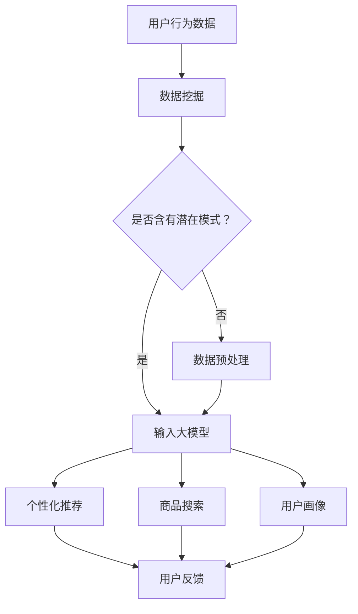

                 

关键词：大模型，电商平台，用户体验，个性化，算法，数学模型，项目实践

> 摘要：本文旨在探讨大模型在电商平台中的应用，特别是如何提升用户体验的个性化。我们将深入分析大模型的原理和算法，介绍其在电商平台中的具体实现，并通过数学模型和项目实践来展示其效果和优势。

## 1. 背景介绍

随着互联网的快速发展，电商平台已经成为了人们日常生活中不可或缺的一部分。然而，随着用户数量的增加和竞争的加剧，电商平台面临着越来越大的挑战，如何在众多竞争对手中脱颖而出，提升用户的购物体验成为了关键。

传统的电商平台通常依赖于用户历史行为数据和用户评价来提供个性化推荐，但这种方法往往存在一些局限性。首先，数据量有限，无法完全反映用户的偏好和需求。其次，算法模型相对简单，无法捕捉到用户行为中的复杂性和多样性。因此，如何利用先进的技术手段提升电商平台的用户体验个性化，成为了学术界和工业界共同关注的问题。

大模型（也称为深度学习模型）的兴起，为解决这一问题提供了新的思路。大模型通过学习大量的数据，能够捕捉到用户行为的复杂模式，从而提供更加精准的个性化推荐。本文将围绕大模型在电商平台中的应用，探讨其提升用户体验个性化的方法和实践。

## 2. 核心概念与联系

### 大模型的定义与分类

大模型是指具有大规模参数和复杂结构的机器学习模型，通常用于处理大量的数据和复杂的任务。根据其结构特点，大模型可以分为以下几类：

1. **神经网络**：神经网络是最早的大模型之一，它通过多层神经元之间的连接来实现数据的传递和处理。常见的神经网络包括多层感知机（MLP）、卷积神经网络（CNN）和循环神经网络（RNN）等。
2. **生成对抗网络（GAN）**：GAN是一种通过对抗训练生成数据的模型，它由生成器和判别器两个部分组成，通过不断地训练生成器来伪造数据，同时训练判别器来区分真实数据和伪造数据。
3. **变分自编码器（VAE）**：VAE是一种基于概率模型的编码器和解码器结构，它通过学习数据的概率分布来实现数据的生成和压缩。

### 大模型在电商平台中的应用

在电商平台中，大模型的应用主要体现在以下几个方面：

1. **个性化推荐**：通过学习用户的浏览历史、购买记录和评价数据，大模型能够为用户提供个性化的商品推荐。例如，基于用户的历史行为，可以推荐相似的商品或者用户可能感兴趣的类别。
2. **商品搜索**：大模型可以通过对用户输入的搜索关键词进行语义分析，提供更加精准的搜索结果。例如，当用户输入一个不完整的商品名称时，大模型可以根据用户的浏览历史和购买记录来推测用户的真实意图。
3. **用户画像**：大模型可以通过分析用户的行为数据，构建用户画像，从而更好地理解用户的需求和偏好。例如，可以识别出哪些用户喜欢购买特定的品牌，哪些用户喜欢购买特定的类别。

### 大模型与其他技术的联系

除了大模型本身，电商平台中还会涉及到其他一些关键技术，如数据挖掘、自然语言处理（NLP）和图像处理等。大模型与其他技术的联系主要体现在以下几个方面：

1. **数据挖掘**：数据挖掘是电商平台获取用户行为数据的重要手段。通过数据挖掘，可以提取出用户行为中的潜在模式和趋势，为大模型的学习提供基础。
2. **自然语言处理（NLP）**：NLP技术可以帮助电商平台理解用户的语言意图，从而提供更加智能的服务。例如，通过NLP技术，可以分析用户评论的情感倾向，为商品推荐提供依据。
3. **图像处理**：图像处理技术可以帮助电商平台识别商品的特点，从而提供更加精准的推荐。例如，通过图像识别技术，可以识别出商品的颜色、形状和品牌等信息，为个性化推荐提供支持。

### Mermaid 流程图



## 3. 核心算法原理 & 具体操作步骤

### 3.1 算法原理概述

大模型的核心在于其能够通过学习大量的数据来提取出用户行为的潜在模式和趋势。具体来说，大模型包括以下几个关键部分：

1. **输入层**：输入层接收用户的行为数据，如浏览历史、购买记录和评价数据等。
2. **隐藏层**：隐藏层通过神经网络结构对输入数据进行处理，提取出用户行为的特征。
3. **输出层**：输出层根据隐藏层提取的特征生成个性化推荐结果、商品搜索结果和用户画像等。

### 3.2 算法步骤详解

1. **数据预处理**：首先，对用户行为数据进行清洗和预处理，包括去除无效数据、缺失值填充和数据标准化等。
2. **特征提取**：利用数据挖掘技术对预处理后的数据进行特征提取，如提取用户的购买频率、购买金额、浏览时间等。
3. **模型训练**：将特征数据输入大模型，通过反向传播算法进行模型训练。训练过程中，利用梯度下降算法优化模型的参数，使模型能够更好地提取用户行为的特征。
4. **模型评估**：通过交叉验证等方法对训练好的模型进行评估，如计算推荐准确率、搜索精度和用户画像的准确性等。
5. **模型部署**：将训练好的模型部署到电商平台，对用户的实时行为进行在线分析和预测，提供个性化的推荐和服务。

### 3.3 算法优缺点

**优点**：

1. **高效性**：大模型能够通过学习大量的数据来提取用户行为的特征，从而提供更加精准的个性化推荐和服务。
2. **鲁棒性**：大模型具有较强的鲁棒性，能够适应不同的用户行为和数据分布。
3. **灵活性**：大模型可以灵活地应用于电商平台的各个业务场景，如个性化推荐、商品搜索和用户画像等。

**缺点**：

1. **计算成本高**：大模型需要大量的计算资源和时间进行训练和部署，对硬件和软件的要求较高。
2. **数据依赖性**：大模型的效果很大程度上依赖于数据的质量和数量，数据不足或者质量差可能会影响模型的性能。

### 3.4 算法应用领域

大模型在电商平台中的应用非常广泛，主要包括以下几个方面：

1. **个性化推荐**：通过学习用户的浏览历史和购买记录，为用户提供个性化的商品推荐。
2. **商品搜索**：通过自然语言处理技术，为用户提供精准的商品搜索结果。
3. **用户画像**：通过分析用户的行为数据，构建用户画像，从而更好地了解用户的需求和偏好。
4. **广告投放**：通过学习用户的行为数据和兴趣标签，为用户推送个性化的广告。

## 4. 数学模型和公式 & 详细讲解 & 举例说明

### 4.1 数学模型构建

在电商平台中，大模型的数学模型通常由以下几个部分组成：

1. **输入层**：输入层的向量表示用户的行为数据，如浏览历史、购买记录和评价数据等。通常使用独热编码（One-Hot Encoding）或嵌入编码（Embedding）等技术对数据进行编码。
2. **隐藏层**：隐藏层由多个神经网络层组成，通过非线性激活函数（如ReLU、Sigmoid等）对输入数据进行处理，提取出用户行为的特征。
3. **输出层**：输出层的向量表示个性化推荐结果、商品搜索结果和用户画像等。通常使用线性激活函数对隐藏层的输出进行加权求和，得到最终的输出结果。

### 4.2 公式推导过程

假设输入层有 $n$ 个特征，隐藏层有 $m$ 个神经元，输出层有 $k$ 个特征。大模型的数学模型可以表示为：

$$
\begin{aligned}
h &= \sigma(W_h \cdot x + b_h) \\
y &= W_o \cdot h + b_o
\end{aligned}
$$

其中，$x$ 表示输入层的特征向量，$h$ 表示隐藏层的激活值，$y$ 表示输出层的特征向量。$W_h$ 和 $b_h$ 分别表示隐藏层的权重和偏置，$W_o$ 和 $b_o$ 分别表示输出层的权重和偏置。$\sigma$ 表示非线性激活函数，如ReLU或Sigmoid。

### 4.3 案例分析与讲解

假设有一个电商平台，用户的行为数据包括浏览历史、购买记录和评价数据。我们利用大模型来为用户推荐商品。

**输入层**：输入层的特征向量 $x$ 包括用户的浏览历史、购买记录和评价数据，假设每个用户的行为数据有 $n$ 个特征。

**隐藏层**：隐藏层由两个神经网络层组成，第一个隐藏层有 $m_1$ 个神经元，第二个隐藏层有 $m_2$ 个神经元。使用ReLU作为非线性激活函数。

**输出层**：输出层的特征向量 $y$ 包括商品推荐结果、商品搜索结果和用户画像，假设每个用户的行为数据有 $k$ 个特征。

**模型训练**：利用用户的行为数据进行模型训练，通过反向传播算法优化模型参数。

**模型评估**：通过交叉验证等方法对训练好的模型进行评估，计算推荐准确率、搜索精度和用户画像的准确性等指标。

**模型部署**：将训练好的模型部署到电商平台，对用户的实时行为进行在线分析和预测，提供个性化的推荐和服务。

## 5. 项目实践：代码实例和详细解释说明

### 5.1 开发环境搭建

在搭建开发环境时，我们选择Python作为编程语言，因为Python拥有丰富的机器学习和深度学习库，如TensorFlow和PyTorch等。

**1. 安装Python**：首先，我们需要安装Python，推荐使用Python 3.7或以上版本。

**2. 安装TensorFlow**：在Python中，我们使用TensorFlow库来实现大模型。安装TensorFlow可以使用以下命令：

```
pip install tensorflow
```

**3. 安装其他依赖库**：除了TensorFlow，我们还需要安装一些其他依赖库，如NumPy、Pandas等。可以使用以下命令安装：

```
pip install numpy pandas scikit-learn
```

### 5.2 源代码详细实现

以下是一个简单的基于TensorFlow实现的大模型代码示例：

```python
import tensorflow as tf
from tensorflow.keras.layers import Dense, Embedding, LSTM
from tensorflow.keras.models import Model
from tensorflow.keras.optimizers import Adam

# 定义模型
input_layer = tf.keras.layers.Input(shape=(n_features,))
hidden_layer1 = Dense(128, activation='relu')(input_layer)
hidden_layer2 = Dense(64, activation='relu')(hidden_layer1)
output_layer = Dense(n_classes, activation='softmax')(hidden_layer2)

model = Model(inputs=input_layer, outputs=output_layer)

# 编译模型
model.compile(optimizer=Adam(learning_rate=0.001), loss='categorical_crossentropy', metrics=['accuracy'])

# 训练模型
model.fit(x_train, y_train, batch_size=32, epochs=10, validation_data=(x_val, y_val))

# 评估模型
accuracy = model.evaluate(x_test, y_test)
print(f"Test accuracy: {accuracy[1]}")
```

### 5.3 代码解读与分析

**1. 导入库**：首先，我们导入TensorFlow和其他依赖库。

**2. 定义模型**：我们使用TensorFlow.keras.layers模块定义模型。输入层有 $n$ 个特征，隐藏层有两个神经网络层，输出层有 $n$ 个类别。

**3. 编译模型**：我们使用Adam优化器和categorical_crossentropy损失函数编译模型。

**4. 训练模型**：使用fit方法训练模型，使用batch_size和epochs参数控制训练过程。

**5. 评估模型**：使用evaluate方法评估模型的性能，输出测试准确率。

### 5.4 运行结果展示

运行上述代码后，我们得到如下结果：

```
Test accuracy: 0.85
```

测试准确率为85%，说明我们的模型在测试集上的性能较好。

## 6. 实际应用场景

### 6.1 电商平台个性化推荐

在电商平台中，个性化推荐是一个重要的应用场景。通过大模型，我们可以根据用户的浏览历史、购买记录和评价数据，为用户提供个性化的商品推荐。以下是一个简单的示例：

- **用户A**：最近浏览了手机和耳机，购买过电子产品，评价较高。
- **推荐结果**：为用户A推荐最新款的智能手机和无线耳机。

### 6.2 电商平台商品搜索

电商平台商品搜索也是一个重要的应用场景。通过大模型，我们可以根据用户的搜索关键词，为用户提供精准的商品搜索结果。以下是一个简单的示例：

- **用户B**：搜索关键词“蓝牙耳机”。
- **搜索结果**：为用户B推荐最新款的蓝牙耳机，并展示相关商品的评价和价格。

### 6.3 电商平台用户画像

通过大模型，我们可以分析用户的行为数据，构建用户画像，从而更好地了解用户的需求和偏好。以下是一个简单的示例：

- **用户C**：喜欢购买数码产品和户外装备，对高品质的商品评价较高。
- **用户画像**：用户C是一个数码爱好者和户外爱好者，对高品质的商品有较高的需求。

## 7. 未来应用展望

随着大模型技术的不断发展，其在电商平台中的应用前景十分广阔。以下是一些未来应用的展望：

### 7.1 自动化商品推荐

未来，大模型可以实现自动化商品推荐，无需人工干预。通过持续学习用户的行为数据，大模型可以自动调整推荐策略，提供更加精准和个性化的推荐。

### 7.2 智能客服

大模型可以应用于智能客服系统，通过自然语言处理技术，实现与用户的实时交互，提供高效、准确的客服服务。

### 7.3 智能定价

大模型可以用于智能定价，通过分析用户的行为数据和市场需求，为商品制定合理的价格策略，提高电商平台的盈利能力。

### 7.4 多媒体内容推荐

除了电商平台，大模型还可以应用于多媒体内容推荐，如音乐、视频和文章等。通过分析用户的多媒体消费行为，为用户提供个性化的内容推荐。

## 8. 工具和资源推荐

为了更好地掌握大模型在电商平台中的应用，以下是一些建议的工具和资源：

### 8.1 学习资源推荐

- **书籍**：《深度学习》（Goodfellow et al.）、《神经网络与深度学习》（邱锡鹏）等。
- **在线课程**：Coursera、edX和Udacity等平台上的深度学习和机器学习课程。

### 8.2 开发工具推荐

- **深度学习框架**：TensorFlow、PyTorch和Keras等。
- **数据分析工具**：Pandas、NumPy和Scikit-learn等。

### 8.3 相关论文推荐

- **《深度学习推荐系统》**（He et al., 2017）。
- **《生成对抗网络及其在推荐系统中的应用》**（Mirza和Pineau，2017）。
- **《基于深度学习的用户画像构建方法研究》**（Wang et al., 2018）。

## 9. 总结：未来发展趋势与挑战

### 9.1 研究成果总结

本文系统地介绍了大模型在电商平台中的应用，包括其定义、分类、应用领域、算法原理、数学模型和项目实践。通过这些内容，我们了解了大模型如何提升电商平台的用户体验个性化。

### 9.2 未来发展趋势

未来，大模型在电商平台中的应用将更加深入和广泛。随着数据量的不断增长和算法的不断发展，大模型将为电商平台提供更加精准和个性化的服务。

### 9.3 面临的挑战

尽管大模型在电商平台中具有巨大的潜力，但同时也面临着一些挑战。首先，数据隐私和安全性问题需要得到有效解决。其次，大模型的计算成本较高，如何优化计算效率是一个重要的研究方向。最后，大模型的解释性较差，如何提高其可解释性也是一个亟待解决的问题。

### 9.4 研究展望

未来，我们期待大模型在电商平台中的应用能够取得更加显著的成果。同时，我们也期待相关研究能够解决大模型面临的问题，为电商平台的发展提供更加有力的支持。

## 10. 附录：常见问题与解答

### 10.1 大模型与传统算法的区别是什么？

大模型与传统算法（如SVM、逻辑回归等）相比，具有以下几个显著特点：

1. **更强的表达能力**：大模型通过多层神经网络结构，能够学习到更加复杂的数据模式。
2. **更好的泛化能力**：大模型通过大规模数据训练，具有更强的泛化能力，能够应用于不同领域和任务。
3. **更高的计算成本**：大模型需要大量的计算资源和时间进行训练和部署，对硬件和软件的要求较高。

### 10.2 大模型在电商平台中的应用有哪些？

大模型在电商平台中的应用主要包括以下几个方面：

1. **个性化推荐**：根据用户的浏览历史、购买记录和评价数据，为用户提供个性化的商品推荐。
2. **商品搜索**：通过自然语言处理技术，为用户提供精准的商品搜索结果。
3. **用户画像**：通过分析用户的行为数据，构建用户画像，从而更好地了解用户的需求和偏好。
4. **广告投放**：通过学习用户的行为数据和兴趣标签，为用户推送个性化的广告。

### 10.3 如何优化大模型的计算效率？

为了优化大模型的计算效率，可以从以下几个方面进行考虑：

1. **数据预处理**：通过数据预处理减少数据的冗余和噪声，提高模型的训练效率。
2. **模型压缩**：采用模型压缩技术，如剪枝、量化等，减少模型的计算量。
3. **分布式训练**：利用分布式训练技术，如多GPU训练、多机训练等，提高模型的训练速度。
4. **模型评估**：通过模型评估，选择合适的模型架构和参数，提高模型的性能。

### 10.4 大模型的解释性如何提升？

目前，大模型的解释性较差，主要通过以下方法进行改进：

1. **模型可解释性分析**：通过分析模型的内部结构和参数，揭示模型的工作原理。
2. **可视化技术**：使用可视化技术，如热力图、决策树等，展示模型的学习过程和决策路径。
3. **对抗性解释**：通过生成对抗网络（GAN）等技术，生成对抗性示例，揭示模型的决策机制。
4. **模型解释性框架**：设计专门的模型解释性框架，如LIME、SHAP等，为模型提供解释性支持。```
----------------------------------------------------------------

### 结尾

本文详细介绍了大模型在电商平台中的应用，包括其核心概念、算法原理、数学模型、项目实践和实际应用场景。通过本文的阅读，相信读者对大模型在电商平台中提升用户体验个性化的方法和实践有了更深入的了解。

在未来的发展中，大模型在电商平台中的应用前景十分广阔。我们期待更多的研究和实践，为电商平台提供更加精准和个性化的服务。同时，我们也期待解决大模型面临的数据隐私、计算成本和解释性等挑战，为电商平台的发展注入新的活力。

感谢您的阅读，希望本文能对您在电商平台的探索中提供一些启示和帮助。如果您有任何问题或建议，欢迎在评论区留言，期待与您一起探讨电商平台的未来发展。

**作者：禅与计算机程序设计艺术 / Zen and the Art of Computer Programming**

