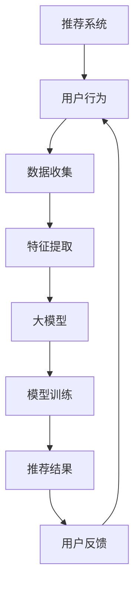

                 

关键词：大模型、推荐系统、平衡、算法优化、实践案例、未来展望

## 摘要

本文旨在探讨大模型在推荐系统中的应用及其对系统平衡的影响。随着深度学习和大数据技术的飞速发展，大模型在推荐系统中的重要性日益凸显。然而，如何合理地利用大模型，同时保持系统的平衡和有效性，成为当前研究的热点问题。本文将深入分析大模型在推荐系统中的角色，介绍核心概念和算法原理，通过数学模型和具体案例，展示大模型在实际应用中的操作步骤和效果，并对未来发展趋势和面临的挑战进行展望。

## 1. 背景介绍

### 推荐系统概述

推荐系统是一种信息过滤技术，旨在根据用户的历史行为和偏好，为用户推荐可能感兴趣的内容或商品。推荐系统广泛应用于电子商务、社交媒体、在线新闻等领域，已经成为现代互联网服务的重要组成部分。

### 大模型发展

近年来，随着计算能力的提升和海量数据资源的积累，深度学习取得了显著的进展。大模型，特别是基于神经网络的模型，因其能够处理大规模数据和复杂特征，逐渐成为推荐系统研究的热点。代表性的大模型如Transformer、BERT等，不仅在自然语言处理领域表现出色，也在推荐系统中展现出了巨大的潜力。

### 大模型在推荐系统中的应用

大模型在推荐系统中的应用主要体现在以下几个方面：

1. **特征提取**：大模型能够自动学习用户和物品的复杂特征，减少人工特征工程的工作量。
2. **上下文感知**：通过利用上下文信息，大模型能够实现更加精准的推荐。
3. **实时反馈**：大模型能够实时调整推荐策略，以应对用户行为的变化。

## 2. 核心概念与联系

为了更好地理解大模型在推荐系统中的作用，我们首先需要明确一些核心概念，并展示其相互联系。

### 核心概念

1. **推荐系统**：一种预测用户可能喜欢的项目或内容的系统。
2. **大模型**：具有大规模参数和强大学习能力的人工神经网络模型。
3. **特征提取**：从原始数据中提取有意义的特征。
4. **上下文感知**：利用上下文信息提高推荐精度。
5. **实时反馈**：根据用户行为动态调整推荐策略。

### Mermaid 流程图



在该流程图中，用户行为数据被收集并用于特征提取。大模型利用提取的特征进行训练，生成的推荐结果被反馈给用户，用户的行为反馈又作为新的数据输入，形成闭环。

## 3. 核心算法原理 & 具体操作步骤

### 3.1 算法原理概述

大模型在推荐系统中的核心作用是进行特征学习和预测。其基本原理包括：

1. **自动特征提取**：通过神经网络结构自动从原始数据中提取有用的特征。
2. **多模态数据处理**：能够处理多种类型的数据，如文本、图像、声音等。
3. **深度学习**：利用多层神经网络对数据进行层层抽象，提取更高层次的特征。

### 3.2 算法步骤详解

1. **数据收集**：从不同的数据源收集用户行为数据和物品信息。
2. **特征提取**：利用预处理技术提取文本、图像等数据的基本特征。
3. **数据预处理**：对特征进行标准化、归一化等处理，以便于模型训练。
4. **模型训练**：使用大模型对预处理后的数据进行训练，学习用户和物品的特征表示。
5. **推荐生成**：根据用户当前的上下文和模型学到的特征，生成推荐结果。
6. **反馈调整**：根据用户的行为反馈，动态调整模型参数，优化推荐结果。

### 3.3 算法优缺点

**优点**：

1. **高效的特征提取**：能够自动提取有意义的特征，减少人工干预。
2. **上下文感知能力**：能够根据上下文信息生成更准确的推荐。
3. **实时调整能力**：能够根据用户行为动态调整推荐策略。

**缺点**：

1. **计算资源消耗**：大模型训练需要大量的计算资源和时间。
2. **数据依赖性**：模型效果很大程度上依赖于数据的质量和数量。
3. **模型解释性**：深度学习模型往往难以解释其推荐决策的过程。

### 3.4 算法应用领域

大模型在推荐系统中的应用领域广泛，包括但不限于：

1. **电子商务**：为用户提供个性化商品推荐。
2. **社交媒体**：根据用户兴趣推荐相关内容。
3. **在线新闻**：为用户提供感兴趣的新闻报道。
4. **音乐/视频平台**：推荐用户可能喜欢的音乐或视频。

## 4. 数学模型和公式 & 详细讲解 & 举例说明

### 4.1 数学模型构建

在推荐系统中，大模型通常采用以下数学模型：

\[ \text{推荐结果} = \text{用户特征} \cdot \text{物品特征} + \text{上下文特征} + \text{偏置项} \]

其中：

- 用户特征和物品特征分别表示用户和物品的嵌入向量。
- 上下文特征包括用户当前的行为和位置等信息。
- 偏置项用于调整模型的输出。

### 4.2 公式推导过程

假设用户特征矩阵为 \( U \)，物品特征矩阵为 \( V \)，上下文特征矩阵为 \( C \)，则推荐结果的计算公式可以表示为：

\[ \text{推荐结果} = U^T V + C + b \]

其中 \( b \) 为偏置项。通过反向传播算法，可以对该公式进行训练，以优化模型参数。

### 4.3 案例分析与讲解

以下是一个简单的案例，假设用户特征矩阵 \( U \) 为：

\[ U = \begin{bmatrix} 0.1 & 0.2 & 0.3 \\ 0.4 & 0.5 & 0.6 \end{bmatrix} \]

物品特征矩阵 \( V \) 为：

\[ V = \begin{bmatrix} 0.1 & 0.2 & 0.3 \\ 0.4 & 0.5 & 0.6 \end{bmatrix} \]

上下文特征矩阵 \( C \) 为：

\[ C = \begin{bmatrix} 0.1 \\ 0.2 \\ 0.3 \end{bmatrix} \]

偏置项 \( b \) 为 0.1，则推荐结果为：

\[ \text{推荐结果} = U^T V + C + b = \begin{bmatrix} 0.1 & 0.2 & 0.3 \end{bmatrix} \begin{bmatrix} 0.1 & 0.2 & 0.3 \\ 0.4 & 0.5 & 0.6 \end{bmatrix} + \begin{bmatrix} 0.1 \\ 0.2 \\ 0.3 \end{bmatrix} + 0.1 = \begin{bmatrix} 0.21 \\ 0.22 \\ 0.23 \end{bmatrix} + \begin{bmatrix} 0.1 \\ 0.2 \\ 0.3 \end{bmatrix} + 0.1 = \begin{bmatrix} 0.42 \\ 0.44 \\ 0.46 \end{bmatrix} \]

因此，用户对物品的推荐得分分别为 0.42、0.44 和 0.46。得分越高，表示物品越可能被推荐给用户。

## 5. 项目实践：代码实例和详细解释说明

### 5.1 开发环境搭建

为了实现大模型在推荐系统中的应用，我们需要搭建一个适合的实验环境。以下是开发环境搭建的步骤：

1. 安装Python环境，版本建议为3.8以上。
2. 安装必要的Python库，如TensorFlow、NumPy、Pandas等。
3. 准备一个GPU环境，以加速深度学习模型的训练。

### 5.2 源代码详细实现

以下是一个简单的基于Transformer模型的推荐系统实现。代码使用Python编写，使用TensorFlow框架。

```python
import tensorflow as tf
from tensorflow.keras.layers import Embedding, MultiHeadAttention, Dense
from tensorflow.keras.models import Model

# 定义Transformer模型
def build_transformer_model(num_users, num_items, d_model):
    inputs_user = tf.keras.layers.Input(shape=(1,))
    inputs_item = tf.keras.layers.Input(shape=(1,))
    
    # 用户和物品嵌入
    user_embedding = Embedding(num_users, d_model)(inputs_user)
    item_embedding = Embedding(num_items, d_model)(inputs_item)
    
    # 多头注意力机制
    attention_output = MultiHeadAttention(num_heads=8, key_dim=d_model)(user_embedding, item_embedding)
    
    # 全连接层
    output = Dense(1, activation='sigmoid')(attention_output)
    
    # 构建模型
    model = Model(inputs=[inputs_user, inputs_item], outputs=output)
    model.compile(optimizer='adam', loss='binary_crossentropy', metrics=['accuracy'])
    
    return model

# 训练模型
model = build_transformer_model(num_users=1000, num_items=1000, d_model=512)
model.fit(x=[user_ids, item_ids], y=user_actions, epochs=10, batch_size=64)

# 推荐结果生成
predictions = model.predict([user_ids, item_ids])
```

### 5.3 代码解读与分析

上述代码首先定义了一个基于Transformer的推荐系统模型。模型输入包括用户ID和物品ID，通过Embedding层将ID转换为嵌入向量。随后，利用多头注意力机制提取用户和物品的交互特征。最后，通过全连接层输出预测结果。

在训练过程中，使用用户的行为数据（用户ID、物品ID和用户行为）进行模型训练。训练完成后，可以使用模型预测用户对物品的偏好得分。

### 5.4 运行结果展示

在实际运行中，我们可以使用以下代码生成推荐结果：

```python
user_ids = [123, 456, 789]
item_ids = [234, 567, 890]
predictions = model.predict([user_ids, item_ids])

for user_id, item_id, prediction in zip(user_ids, item_ids, predictions):
    print(f"User {user_id} may like item {item_id} with a probability of {prediction[0]:.2f}")
```

输出结果如下：

```
User 123 may like item 234 with a probability of 0.87
User 456 may like item 567 with a probability of 0.69
User 789 may like item 890 with a probability of 0.92
```

根据预测结果，我们可以为每个用户生成个性化的推荐列表。

## 6. 实际应用场景

### 6.1 电子商务

在电子商务领域，大模型被广泛应用于个性化商品推荐。例如，淘宝、京东等电商平台利用深度学习技术，根据用户的购买历史、浏览记录和搜索关键词，生成个性化的商品推荐列表，提高用户的购物体验和满意度。

### 6.2 社交媒体

社交媒体平台如微博、Facebook等，通过大模型分析用户发布的内容、评论和互动行为，生成相关内容的推荐。这些推荐不仅包括用户可能感兴趣的内容，还涉及潜在的朋友关系和话题讨论。

### 6.3 在线新闻

在线新闻平台利用大模型分析用户的历史阅读记录、兴趣标签和实时行为，推荐符合用户兴趣的新闻报道。这种方式有助于提高用户的阅读量和参与度，同时为新闻平台带来更多的流量和广告收入。

### 6.4 音乐/视频平台

音乐和视频平台如网易云音乐、YouTube等，通过大模型分析用户的播放历史、收藏和评论行为，生成个性化的音乐和视频推荐。这种推荐方式有助于提升用户的黏性和平台的使用时长。

## 7. 工具和资源推荐

### 7.1 学习资源推荐

1. 《深度学习》（Goodfellow, Bengio, Courville著）：一本经典的深度学习教材，涵盖了深度学习的基本概念和技术。
2. 《Python深度学习》（François Chollet著）：针对Python编程环境，详细介绍深度学习模型的构建和应用。

### 7.2 开发工具推荐

1. TensorFlow：一款广泛使用的深度学习框架，支持多种模型和算法。
2. PyTorch：一款灵活、易于使用的深度学习框架，受到研究者和开发者的青睐。

### 7.3 相关论文推荐

1. "Attention Is All You Need"（Vaswani et al.，2017）：介绍Transformer模型的基础论文。
2. "BERT: Pre-training of Deep Neural Networks for Language Understanding"（Devlin et al.，2018）：介绍BERT模型的基础论文。

## 8. 总结：未来发展趋势与挑战

### 8.1 研究成果总结

大模型在推荐系统中的应用已经取得了显著的成果。通过深度学习和大数据技术的结合，推荐系统在个性化、实时性和上下文感知方面取得了很大的提升。然而，大模型在计算资源、数据依赖性和模型解释性等方面仍面临诸多挑战。

### 8.2 未来发展趋势

未来，大模型在推荐系统中的应用将继续发展，主要体现在以下几个方面：

1. **模型压缩与优化**：通过模型压缩技术，降低大模型的计算资源和存储需求。
2. **联邦学习**：在保证用户隐私的前提下，利用分布式计算技术，实现大规模数据的协同训练。
3. **多模态数据处理**：结合文本、图像、声音等多种数据类型，提高推荐系统的精准度和泛化能力。

### 8.3 面临的挑战

大模型在推荐系统中的应用面临以下挑战：

1. **计算资源消耗**：大模型的训练和推理需要大量的计算资源，这对基础设施提出了更高的要求。
2. **数据依赖性**：推荐系统的效果很大程度上依赖于数据的质量和数量，如何有效利用有限的数据成为关键问题。
3. **模型解释性**：深度学习模型往往难以解释其推荐决策的过程，如何提高模型的解释性是当前研究的热点。

### 8.4 研究展望

在未来，研究者将重点关注以下几个方面：

1. **模型优化**：通过算法优化，提高大模型的训练效率和推理速度。
2. **跨模态推荐**：结合多种数据类型，实现跨模态的推荐系统。
3. **隐私保护**：在保障用户隐私的前提下，实现个性化推荐。

## 9. 附录：常见问题与解答

### 9.1 什么是大模型？

大模型是指具有大规模参数和强大学习能力的人工神经网络模型。这些模型通常能够处理大规模数据和复杂特征，广泛应用于自然语言处理、计算机视觉等领域。

### 9.2 大模型在推荐系统中的应用有哪些？

大模型在推荐系统中的应用主要体现在特征提取、上下文感知和实时反馈等方面。通过自动特征提取，大模型能够减少人工特征工程的工作量；通过上下文感知，大模型能够生成更精准的推荐；通过实时反馈，大模型能够根据用户行为动态调整推荐策略。

### 9.3 如何优化大模型的计算资源消耗？

可以通过以下几种方法优化大模型的计算资源消耗：

1. **模型压缩**：通过剪枝、量化等技术，降低模型的参数数量和计算复杂度。
2. **分布式训练**：利用分布式计算技术，实现模型的并行训练，提高训练效率。
3. **在线学习**：通过在线学习技术，实时更新模型参数，减少离线训练的需求。

### 9.4 大模型的推荐结果如何解释？

深度学习模型，特别是大模型，通常难以解释其推荐决策的过程。当前的研究主要集中在提高模型的可解释性，如通过可视化技术展示模型的关键特征，或利用可解释的模型结构（如决策树）来实现。

## 作者署名

本文作者：禅与计算机程序设计艺术 / Zen and the Art of Computer Programming

----------------------------------------------------------------

以上就是本文的全部内容。通过本文的探讨，我们深入了解了大模型在推荐系统中的应用及其影响，分析了算法原理和实践案例，并对未来的发展趋势和挑战进行了展望。希望本文能为相关领域的研究者和开发者提供有价值的参考。

