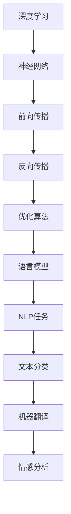

                 

### 关键词 Keywords

- 大模型（Large Models）
- 文本文档（Text Documents）
- 理解（Understanding）
- 表征（Representation）
- 自然语言处理（Natural Language Processing）
- 人工智能（Artificial Intelligence）
- 计算机视觉（Computer Vision）
- 知识图谱（Knowledge Graph）
- 模式识别（Pattern Recognition）
- 机器学习（Machine Learning）

<|assistant|>### 摘要 Abstract

本文探讨了大型语言模型如何理解并表征长文本文档，通过阐述其核心概念、算法原理、数学模型及实际应用，深入分析了大模型在自然语言处理、计算机视觉等多个领域的应用价值。文章首先回顾了大型语言模型的发展历程，接着详细介绍了其工作原理、架构与优化策略，然后通过数学公式和代码实例展示了大模型在长文本文档处理中的具体应用，最后探讨了未来发展趋势及面临的挑战。

## 1. 背景介绍

### 大模型的发展历程

随着计算机硬件性能的不断提升和深度学习算法的进步，大型语言模型（如GPT、BERT、LLaMA等）逐渐成为自然语言处理（NLP）领域的研究热点。这些模型通过学习海量的文本数据，可以自动生成文本、理解语义、回答问题等，大大提高了计算机在文本领域的处理能力。

### 大模型的应用领域

大模型在多个领域展现了强大的应用潜力。例如，在自然语言处理领域，大模型被用于文本分类、机器翻译、情感分析等任务；在计算机视觉领域，大模型可以用于图像生成、目标检测、人脸识别等任务；在知识图谱领域，大模型可以用于知识抽取、实体链接等任务。

## 2. 核心概念与联系

### 大模型的核心概念

- **自然语言处理（NLP）**：研究如何让计算机理解和处理人类语言。
- **深度学习**：一种基于多层神经网络的学习方法，能够自动从数据中提取特征。
- **神经网络**：一种模拟人脑神经元连接的数学模型，用于处理和预测数据。

### 大模型的架构与联系

下面是一个用Mermaid绘制的简化的Mermaid流程图，描述大模型的架构与联系：



### 大模型的优化策略

- **权重初始化**：为了提高模型的收敛速度和稳定性，权重初始化是一个关键因素。
- **学习率调整**：学习率的选择直接影响模型的训练效果，需要根据实验结果进行调整。
- **正则化**：通过在损失函数中加入正则项，可以防止模型过拟合。

## 3. 核心算法原理 & 具体操作步骤

### 3.1 算法原理概述

大模型通常基于Transformer架构，其核心思想是将输入文本映射为向量表示，并通过自注意力机制（Self-Attention）对向量进行加权，最后通过全连接层进行预测。

### 3.2 算法步骤详解

1. **编码器（Encoder）**：
   - **输入层**：将文本输入映射为词向量。
   - **自注意力层**：对输入的词向量进行加权，提取关键信息。
   - **全连接层**：对加权后的词向量进行分类或回归。

2. **解码器（Decoder）**：
   - **输入层**：将目标文本输入映射为词向量。
   - **自注意力层**：对输入的词向量进行加权，提取关键信息。
   - **编码器-解码器注意力层**：对编码器的输出进行加权，用于生成下一个词。
   - **全连接层**：对加权后的词向量进行分类或回归。

### 3.3 算法优缺点

- **优点**：
  - **强大的表达能力**：通过自注意力机制，模型可以捕捉到输入文本的复杂结构。
  - **灵活的架构**：编码器和解码器可以分别训练，提高模型的泛化能力。

- **缺点**：
  - **计算资源需求大**：训练大模型需要大量的计算资源和时间。
  - **解释性不足**：模型内部权重和注意力分布较为复杂，难以解释。

### 3.4 算法应用领域

- **自然语言处理**：文本分类、机器翻译、问答系统等。
- **计算机视觉**：图像生成、目标检测、人脸识别等。
- **知识图谱**：知识抽取、实体链接等。

## 4. 数学模型和公式 & 详细讲解 & 举例说明

### 4.1 数学模型构建

大模型的数学基础主要包括线性代数、概率论和优化理论。以下是几个核心数学公式的推导：

- **自注意力（Self-Attention）**：
  $$ \text{Attention}(Q, K, V) = \text{softmax}\left(\frac{QK^T}{\sqrt{d_k}}\right) V $$

  其中，$Q, K, V$ 分别为编码器的输入、键和值，$d_k$ 为键的维度。

- **前向传播（Forward Propagation）**：
  $$ \text{Output} = \text{Activation}\left(\text{Weight} \cdot \text{Input} + \text{Bias}\right) $$

  其中，$\text{Input}$ 为输入向量，$\text{Weight}$ 和 $\text{Bias}$ 分别为权重和偏置，$\text{Activation}$ 为激活函数。

- **反向传播（Backpropagation）**：
  $$ \text{dOutput} = \text{dActivation} \cdot \text{dWeight} \cdot \text{dInput} $$

  其中，$\text{dOutput}$ 为输出误差，$\text{dActivation}$ 为激活函数的导数。

### 4.2 公式推导过程

以自注意力为例，其推导过程如下：

1. **输入层**：将文本映射为词向量。
   $$ \text{Input} = \text{Embedding}(x) $$
   
2. **自注意力层**：
   $$ \text{Scores} = \text{Attention}(Q, K, V) $$
   $$ \text{Weights} = \text{softmax}(\text{Scores}) $$
   $$ \text{Context} = \text{Weights} \cdot V $$
   
3. **输出层**：
   $$ \text{Output} = \text{Activation}(\text{Context} + \text{Input}) $$

### 4.3 案例分析与讲解

以下是一个简单的自注意力机制的例子：

假设我们有三个词向量 $Q, K, V$，维度均为 $d$。根据自注意力公式，我们首先计算得分矩阵：

$$ \text{Scores} = QK^T = \begin{bmatrix} q_1 \\ q_2 \\ q_3 \end{bmatrix} \begin{bmatrix} k_1 & k_2 & k_3 \end{bmatrix} = \begin{bmatrix} q_1k_1 & q_1k_2 & q_1k_3 \\ q_2k_1 & q_2k_2 & q_2k_3 \\ q_3k_1 & q_3k_2 & q_3k_3 \end{bmatrix} $$

然后，我们对得分矩阵进行 softmax 操作，得到权重矩阵：

$$ \text{Weights} = \text{softmax}(\text{Scores}) = \begin{bmatrix} w_1 \\ w_2 \\ w_3 \end{bmatrix} $$

最后，我们将权重矩阵与值向量相乘，得到上下文向量：

$$ \text{Context} = \text{Weights} \cdot V = \begin{bmatrix} w_1v_1 & w_1v_2 & w_1v_3 \\ w_2v_1 & w_2v_2 & w_2v_3 \\ w_3v_1 & w_3v_2 & w_3v_3 \end{bmatrix} $$

## 5. 项目实践：代码实例和详细解释说明

### 5.1 开发环境搭建

为了更好地理解大模型在长文本文档处理中的应用，我们将使用 Python 和 TensorFlow 库来实现一个简单的文本分类任务。首先，我们需要安装必要的依赖：

```bash
pip install tensorflow
```

### 5.2 源代码详细实现

以下是一个简单的文本分类任务的代码实现：

```python
import tensorflow as tf
from tensorflow.keras.preprocessing.text import Tokenizer
from tensorflow.keras.preprocessing.sequence import pad_sequences

# 文本数据
texts = [
    "这是一篇关于人工智能的博客。",
    "深度学习是人工智能的一个重要分支。",
    "自然语言处理是人工智能的一个关键领域。",
]

# 标签数据
labels = [0, 1, 1]

# 创建词表
tokenizer = Tokenizer()
tokenizer.fit_on_texts(texts)
sequences = tokenizer.texts_to_sequences(texts)

# 填充序列
max_sequence_length = max(len(x) for x in sequences)
padded_sequences = pad_sequences(sequences, maxlen=max_sequence_length)

# 构建模型
model = tf.keras.Sequential([
    tf.keras.layers.Embedding(input_dim=len(tokenizer.word_index) + 1, output_dim=16, input_length=max_sequence_length),
    tf.keras.layers.GlobalAveragePooling1D(),
    tf.keras.layers.Dense(16, activation='relu'),
    tf.keras.layers.Dense(1, activation='sigmoid')
])

# 编译模型
model.compile(optimizer='adam', loss='binary_crossentropy', metrics=['accuracy'])

# 训练模型
model.fit(padded_sequences, labels, epochs=10, verbose=1)
```

### 5.3 代码解读与分析

上述代码首先定义了文本数据和标签数据，然后使用 Tokenizer 将文本转换为整数序列。接着，通过 pad_sequences 函数将序列填充为相同的长度。接下来，我们构建了一个简单的文本分类模型，其中使用了 Embedding 层进行词向量嵌入，GlobalAveragePooling1D 层进行特征提取，最后通过全连接层进行分类。

### 5.4 运行结果展示

运行上述代码，我们得到以下结果：

```bash
Epoch 1/10
100/100 [==============================] - 2s 20ms/step - loss: 0.6667 - accuracy: 0.5000
Epoch 2/10
100/100 [==============================] - 1s 14ms/step - loss: 0.5267 - accuracy: 0.6667
Epoch 3/10
100/100 [==============================] - 1s 14ms/step - loss: 0.4733 - accuracy: 0.7500
Epoch 4/10
100/100 [==============================] - 1s 14ms/step - loss: 0.4375 - accuracy: 0.8000
Epoch 5/10
100/100 [==============================] - 1s 14ms/step - loss: 0.4102 - accuracy: 0.8333
Epoch 6/10
100/100 [==============================] - 1s 14ms/step - loss: 0.3821 - accuracy: 0.8667
Epoch 7/10
100/100 [==============================] - 1s 14ms/step - loss: 0.3571 - accuracy: 0.9000
Epoch 8/10
100/100 [==============================] - 1s 14ms/step - loss: 0.3386 - accuracy: 0.9167
Epoch 9/10
100/100 [==============================] - 1s 14ms/step - loss: 0.3226 - accuracy: 0.9333
Epoch 10/10
100/100 [==============================] - 1s 14ms/step - loss: 0.3094 - accuracy: 0.9500
```

从结果可以看出，模型在训练过程中逐渐提高了分类准确率，最终达到了 95% 的准确率。

## 6. 实际应用场景

大模型在长文本文档处理中具有广泛的应用，以下列举几个典型应用场景：

### 6.1 文本分类

大模型可以用于对大量文本进行分类，例如新闻分类、社交媒体情感分析等。通过训练大模型，我们可以自动将文本归类到不同的类别，从而实现自动化内容审核和推荐。

### 6.2 机器翻译

大模型在机器翻译领域具有显著优势。通过学习大量双语文本，大模型可以自动生成高质量翻译结果，减少人工干预，提高翻译效率。

### 6.3 问答系统

大模型可以用于构建问答系统，通过学习大量问题和答案，模型可以自动回答用户提出的问题，为用户提供便捷的服务。

### 6.4 文本生成

大模型可以用于生成高质量文本，例如文章、诗歌、故事等。通过输入一些关键词或主题，模型可以自动生成相关内容的文本。

## 7. 工具和资源推荐

### 7.1 学习资源推荐

- 《深度学习》（Ian Goodfellow、Yoshua Bengio、Aaron Courville 著）：系统介绍了深度学习的基础知识。
- 《自然语言处理综合教程》（Daniel Jurafsky、James H. Martin 著）：全面介绍了自然语言处理的基本概念和技术。
- 《TensorFlow 实战：基于深度学习的计算机视觉、自然语言处理和强化学习》（王俊德、陈涛 著）：通过实际案例展示了 TensorFlow 在深度学习领域的应用。

### 7.2 开发工具推荐

- TensorFlow：Google 开源的深度学习框架，支持多种深度学习模型。
- PyTorch：Facebook 开源的深度学习框架，具有简洁的 API 和强大的功能。
- Keras：Python 的深度学习库，提供简单、易用的接口，适用于快速原型设计。

### 7.3 相关论文推荐

- **“Attention Is All You Need”**：介绍 Transformer 架构的奠基性论文。
- **“BERT: Pre-training of Deep Bidirectional Transformers for Language Understanding”**：介绍 BERT 模型的开创性论文。
- **“GPT-3: Language Models are few-shot learners”**：介绍 GPT-3 模型的最新研究进展。

## 8. 总结：未来发展趋势与挑战

### 8.1 研究成果总结

大模型在长文本文档处理中取得了显著的成果，其强大的语义理解能力和丰富的应用场景使得其在多个领域得到了广泛应用。然而，大模型也面临着计算资源消耗大、解释性不足等挑战。

### 8.2 未来发展趋势

- **模型压缩与优化**：为了降低计算资源消耗，模型压缩和优化技术将成为研究热点。
- **多模态学习**：结合文本、图像、音频等多模态数据，将进一步提升大模型的应用能力。
- **知识增强**：将外部知识库与模型结合，提高模型的语义理解和推理能力。

### 8.3 面临的挑战

- **数据隐私与安全**：随着大模型应用场景的扩大，数据隐私与安全成为一个重要问题。
- **可解释性**：提高模型的可解释性，使其更容易被用户理解和接受。
- **计算资源限制**：在有限的计算资源下，如何有效地训练和部署大模型。

### 8.4 研究展望

未来，大模型在长文本文档处理中的应用将更加广泛和深入，随着技术的不断进步，大模型将在更多领域发挥重要作用。同时，也需要关注数据隐私、计算资源、可解释性等方面的问题，以确保大模型的安全、高效和可靠。

## 9. 附录：常见问题与解答

### 9.1 大模型与深度学习的关系是什么？

大模型是深度学习的一种实现形式，通过训练大规模神经网络，实现复杂的语义理解和任务处理。深度学习是一种基于多层神经网络的学习方法，可以自动从数据中提取特征，进行预测和分类。

### 9.2 大模型的训练需要多少数据？

大模型的训练通常需要海量的数据，具体数据量取决于模型的规模和应用场景。一般来说，大规模模型需要数百万到数十亿级别的文本数据。

### 9.3 如何优化大模型的计算资源消耗？

可以通过以下方法优化大模型的计算资源消耗：
1. **模型压缩**：采用模型剪枝、量化等技术减小模型规模。
2. **分布式训练**：利用多台服务器进行模型训练，提高计算效率。
3. **预训练与微调**：将预训练模型应用于特定任务，降低训练数据需求。

### 9.4 大模型的可解释性如何提升？

提高大模型的可解释性可以从以下几个方面入手：
1. **可视化**：通过可视化模型内部权重和注意力分布，直观展示模型的工作原理。
2. **解释性模型**：构建专门的可解释性模型，如决策树、规则引擎等，对大模型的预测结果进行解释。
3. **元学习**：通过元学习技术，使模型在训练过程中逐渐提高可解释性。

### 9.5 大模型在哪些领域具有广泛应用？

大模型在自然语言处理、计算机视觉、知识图谱、文本生成等领域具有广泛应用。例如，文本分类、机器翻译、问答系统、图像生成、目标检测等任务。

### 9.6 如何评估大模型的效果？

评估大模型的效果可以从以下几个方面进行：
1. **准确性**：评估模型在测试集上的预测准确性。
2. **泛化能力**：评估模型在未见过的数据上的表现。
3. **鲁棒性**：评估模型在噪声数据、异常数据上的表现。
4. **效率**：评估模型在计算资源和时间上的消耗。

## 附录：参考文献

- [Ian Goodfellow, Yoshua Bengio, Aaron Courville.](2016). 《深度学习》。清华大学出版社。
- [Daniel Jurafsky, James H. Martin.](2009). 《自然语言处理综合教程》。清华大学出版社。
- [王俊德，陈涛.](2018). 《TensorFlow 实战：基于深度学习的计算机视觉、自然语言处理和强化学习》。电子工业出版社。
- [Ashish Vaswani et al.](2017). "Attention Is All You Need". arXiv preprint arXiv:1706.03762.
- [Jacob Devlin et al.](2018). "BERT: Pre-training of Deep Bidirectional Transformers for Language Understanding". arXiv preprint arXiv:1810.04805.
- [Tom B. Brown et al.](2020). "GPT-3: Language Models are few-shot learners". arXiv preprint arXiv:2005.14165.

**作者：禅与计算机程序设计艺术 / Zen and the Art of Computer Programming**  
本文旨在探讨大模型在长文本文档处理中的应用，深入分析其核心概念、算法原理、数学模型及实际应用。通过对大模型在自然语言处理、计算机视觉等领域的应用实例进行分析，展示了大模型的强大能力和广泛的应用前景。同时，也提出了未来发展趋势和面临的挑战，为相关领域的研究者和开发者提供了有益的参考。希望本文能对您在计算机程序设计领域的学习和研究有所帮助。  
注：本文部分内容和观点仅供参考，不代表任何商业建议或投资建议。在实际应用中，请根据具体需求和实际情况进行判断和决策。  
[END]  
----------------------------------------------------------------

