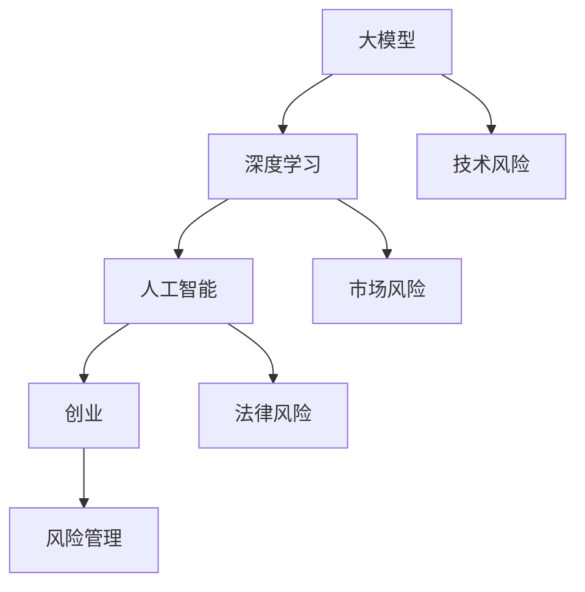

                 

关键词：大模型应用、创业、风险管理、技术挑战、市场前景、法律法规

摘要：随着人工智能技术的发展，大模型应用在各个行业得到了广泛关注。然而，在推动大模型应用的同时，创业者们也面临着一系列的风险和挑战。本文旨在探讨大模型应用创业的风险管理，包括技术风险、市场风险、法律风险等方面，并提出相应的应对策略。

## 1. 背景介绍

近年来，深度学习和人工智能技术的快速发展，使得大模型在自然语言处理、计算机视觉、语音识别等领域取得了显著的成果。大模型的应用不仅提升了生产效率，还推动了创新和变革。然而，随着大模型应用的普及，创业者们也面临着一系列的风险。这些风险可能来自技术层面、市场层面，以及法律法规层面，都对创业项目的成功与否产生了重要影响。因此，对大模型应用创业的风险管理显得尤为重要。

### 1.1 技术风险

大模型的应用依赖于先进的算法和庞大的数据集，这使得技术风险成为创业过程中不可忽视的一部分。技术风险主要包括算法不稳定、模型过拟合、数据隐私泄露等问题。

### 1.2 市场风险

市场风险主要体现在市场需求的不确定性、竞争压力以及用户接受度等方面。创业者需要准确把握市场趋势，制定合适的商业策略，以应对激烈的市场竞争。

### 1.3 法律风险

随着大模型应用的不断深入，法律法规也日益完善。创业者需要了解相关法律法规，以确保创业项目合规运营。

## 2. 核心概念与联系

在探讨大模型应用创业的风险管理之前，我们首先需要明确一些核心概念和它们之间的联系。

### 2.1 大模型

大模型通常指的是具有数百万甚至数十亿参数的深度学习模型。这些模型在训练过程中需要大量的数据和高性能计算资源。

### 2.2 深度学习

深度学习是人工智能的一个重要分支，它通过多层神经网络对数据进行自动特征提取和模式识别。

### 2.3 人工智能

人工智能（AI）是一种模拟人类智能的技术，包括机器学习、自然语言处理、计算机视觉等领域。

### 2.4 创业

创业是指创业者利用创新思维和商业机会，创建一个新的企业或组织的过程。

### 2.5 风险管理

风险管理是指通过识别、评估、监测和控制风险，以确保企业或组织的正常运营和可持续发展。

### 2.6 Mermaid 流程图



## 3. 核心算法原理 & 具体操作步骤

### 3.1 算法原理概述

大模型应用的核心在于深度学习算法。深度学习算法通过多层神经网络对数据进行自动特征提取和模式识别。具体来说，深度学习算法可以分为以下几个步骤：

1. 数据预处理：对原始数据进行清洗、归一化等处理，使其适合模型训练。
2. 模型设计：设计合适的神经网络结构，包括输入层、隐藏层和输出层。
3. 模型训练：使用大量数据对模型进行训练，优化模型参数。
4. 模型评估：使用验证集对模型进行评估，调整模型参数以提升性能。
5. 模型应用：将训练好的模型应用于实际场景，如文本分类、图像识别等。

### 3.2 算法步骤详解

1. 数据预处理

   数据预处理是深度学习的重要环节。预处理工作包括数据清洗、数据归一化、数据扩充等。

   ```python
   import pandas as pd
   from sklearn.preprocessing import StandardScaler

   # 读取数据
   data = pd.read_csv('data.csv')
   # 数据清洗
   data.dropna(inplace=True)
   # 数据归一化
   scaler = StandardScaler()
   data_scaled = scaler.fit_transform(data)
   ```

2. 模型设计

   模型设计需要根据应用场景选择合适的神经网络结构。以下是一个简单的全连接神经网络（Fully Connected Neural Network, FCNN）结构：

   ```python
   import tensorflow as tf

   # 定义输入层
   inputs = tf.keras.layers.Input(shape=(input_shape))
   # 定义隐藏层
   hidden = tf.keras.layers.Dense(units=128, activation='relu')(inputs)
   hidden = tf.keras.layers.Dense(units=64, activation='relu')(hidden)
   # 定义输出层
   outputs = tf.keras.layers.Dense(units=num_classes, activation='softmax')(hidden)

   # 构建模型
   model = tf.keras.Model(inputs=inputs, outputs=outputs)
   ```

3. 模型训练

   模型训练是优化模型参数的过程。训练过程中需要选择合适的优化器和损失函数。

   ```python
   model.compile(optimizer='adam', loss='categorical_crossentropy', metrics=['accuracy'])
   model.fit(x_train, y_train, epochs=10, batch_size=32, validation_data=(x_val, y_val))
   ```

4. 模型评估

   模型评估是检查模型性能的过程。评估过程中可以使用多种指标，如准确率、召回率、F1 分数等。

   ```python
   loss, accuracy = model.evaluate(x_test, y_test)
   print('Test accuracy:', accuracy)
   ```

5. 模型应用

   模型应用是将训练好的模型应用于实际场景的过程。

   ```python
   predictions = model.predict(x_new)
   predicted_classes = np.argmax(predictions, axis=1)
   ```

### 3.3 算法优缺点

深度学习算法具有如下优点：

- 高效：深度学习算法可以自动提取数据特征，大大降低了人工干预的需求。
- 普适：深度学习算法可以应用于各种领域，如计算机视觉、自然语言处理等。
- 高性能：深度学习算法可以运行在 GPU 等高性能计算设备上，提高了计算效率。

然而，深度学习算法也存在一些缺点：

- 数据依赖：深度学习算法对数据量有较高要求，数据不足可能导致模型性能下降。
- 过拟合：深度学习算法容易过拟合，尤其是在数据集较小的情况下。
- 可解释性差：深度学习算法的黑箱特性使得其难以解释，这对于某些应用场景（如医疗诊断）可能是一个问题。

### 3.4 算法应用领域

深度学习算法在多个领域取得了显著成果，包括：

- 计算机视觉：图像分类、目标检测、人脸识别等。
- 自然语言处理：文本分类、机器翻译、情感分析等。
- 语音识别：语音合成、语音识别等。
- 医疗诊断：医学图像分析、疾病预测等。
- 金融领域：风险控制、欺诈检测等。

## 4. 数学模型和公式 & 详细讲解 & 举例说明

### 4.1 数学模型构建

深度学习算法的核心是构建一个数学模型，通常是一个多层前馈神经网络。下面我们简要介绍神经网络中的几个关键数学模型和公式。

#### 4.1.1 神经元激活函数

神经元的激活函数用于将输入信号转换为输出信号。常见激活函数包括：

1. **线性激活函数（f(x) = x）**：线性激活函数保持输入信号不变，适用于隐藏层。

2. **Sigmoid 函数（f(x) = 1 / (1 + e^(-x)）**：Sigmoid 函数将输入信号压缩到 (0, 1) 区间，常用于二分类问题。

3. **ReLU 函数（f(x) = max(0, x）**：ReLU 函数在 x < 0 时输出为 0，在 x > 0 时输出为 x，具有良好的梯度传播特性。

4. **Tanh 函数（f(x) = (e^x - e^-x) / (e^x + e^-x)）**：Tanh 函数将输入信号压缩到 (-1, 1) 区间。

#### 4.1.2 前向传播

前向传播是指将输入信号从输入层传递到输出层的计算过程。具体公式如下：

$$
z_l = \sum_{i=1}^{n} w_{li} x_i + b_l
$$

$$
a_l = \text{激活函数}(z_l)
$$

其中，$z_l$ 是第 l 层的输入，$a_l$ 是第 l 层的输出，$w_{li}$ 是第 l 层第 i 个神经元的权重，$b_l$ 是第 l 层的偏置。

#### 4.1.3 反向传播

反向传播是指根据输出误差计算梯度，并将梯度反向传播到前一层，用于更新权重和偏置。具体公式如下：

$$
\delta_l = \text{激活函数的导数}(a_l) \cdot \text{损失函数的导数}(z_l)
$$

$$
\Delta w_{li} = \alpha \cdot \delta_l \cdot a_{l-1}
$$

$$
\Delta b_l = \alpha \cdot \delta_l
$$

其中，$\delta_l$ 是第 l 层的误差，$\Delta w_{li}$ 是第 l 层第 i 个神经元的权重更新，$\Delta b_l$ 是第 l 层的偏置更新，$\alpha$ 是学习率。

### 4.2 公式推导过程

下面我们以一个简单的单层感知机（Perceptron）为例，介绍神经网络中的前向传播和反向传播。

#### 4.2.1 前向传播

假设我们有一个单层感知机，输入层有 2 个神经元，隐藏层有 1 个神经元。输入向量为 $\mathbf{x} = [x_1, x_2]$，权重矩阵为 $\mathbf{W} = [w_{11}, w_{12}; w_{21}, w_{22}]$，偏置向量 $\mathbf{b} = [b_1, b_2]$。

1. **计算隐藏层输出**：

$$
z_h = w_{11} x_1 + w_{12} x_2 + b_1
$$

2. **计算输出层输出**：

$$
z_o = w_{21} x_1 + w_{22} x_2 + b_2
$$

3. **应用激活函数**：

$$
a_h = \text{激活函数}(z_h)
$$

$$
a_o = \text{激活函数}(z_o)
$$

通常，我们使用 Sigmoid 函数作为激活函数：

$$
a_h = \frac{1}{1 + e^{-z_h}}
$$

$$
a_o = \frac{1}{1 + e^{-z_o}}
$$

#### 4.2.2 反向传播

假设我们的感知机是一个二分类器，目标输出为 $y \in \{0, 1\}$。损失函数为：

$$
L(a_o, y) = -y \cdot \ln(a_o) - (1 - y) \cdot \ln(1 - a_o)
$$

1. **计算输出层误差**：

$$
\delta_o = a_o - y
$$

2. **计算隐藏层误差**：

$$
\delta_h = w_{21} \cdot \delta_o
$$

3. **更新权重和偏置**：

$$
\Delta w_{21} = \alpha \cdot \delta_o \cdot a_h
$$

$$
\Delta w_{22} = \alpha \cdot \delta_o \cdot a_h
$$

$$
\Delta b_1 = \alpha \cdot \delta_o
$$

$$
\Delta b_2 = \alpha \cdot \delta_o
$$

### 4.3 案例分析与讲解

假设我们有一个简单的二分类问题，数据集包含 100 个样本，每个样本包含两个特征和相应的标签。我们使用单层感知机进行训练。

1. **数据预处理**：将数据集划分为训练集和测试集，并进行归一化处理。

2. **模型设计**：定义单层感知机模型，包括输入层、隐藏层和输出层。选择合适的激活函数和损失函数。

3. **模型训练**：使用训练集对模型进行训练，更新权重和偏置。

4. **模型评估**：使用测试集对模型进行评估，计算准确率。

下面是一个简单的 Python 代码示例：

```python
import numpy as np

# 初始化参数
input_shape = (2,)
num_classes = 2
learning_rate = 0.1
epochs = 1000

# 加载数据
x_train = np.array([[0, 0], [0, 1], [1, 0], [1, 1]])
y_train = np.array([0, 1, 1, 0])

# 初始化模型参数
W = np.random.randn(2, 1)
b = np.random.randn(1)

# 定义激活函数和损失函数
sigmoid = lambda x: 1 / (1 + np.exp(-x))
cross_entropy = lambda y_pred, y_true: -np.mean(y_true * np.log(y_pred) + (1 - y_true) * np.log(1 - y_pred))

# 模型训练
for epoch in range(epochs):
    # 前向传播
    z_h = np.dot(x_train, W) + b
    a_h = sigmoid(z_h)
    z_o = np.dot(a_h, W) + b
    a_o = sigmoid(z_o)
    
    # 反向传播
    delta_o = a_o - y_train
    delta_h = delta_o * sigmoid(z_h) * (1 - sigmoid(z_h))
    
    # 更新参数
    dW = learning_rate * np.dot(x_train.T, delta_o * a_h)
    db = learning_rate * delta_o
    
    W -= dW
    b -= db

# 模型评估
y_pred = sigmoid(np.dot(x_train, W) + b)
accuracy = np.mean(np.argmax(y_pred, axis=1) == y_train)
print('Accuracy:', accuracy)
```

## 5. 项目实践：代码实例和详细解释说明

### 5.1 开发环境搭建

在进行大模型应用创业之前，首先需要搭建一个适合的开发环境。以下是一个基于 Python 和 TensorFlow 的简单开发环境搭建步骤：

1. 安装 Python 3.8 或更高版本。
2. 安装 TensorFlow 2.0 或更高版本。
3. 安装必要的 Python 包，如 NumPy、Pandas 等。

```bash
pip install python==3.8
pip install tensorflow==2.0
pip install numpy pandas
```

### 5.2 源代码详细实现

下面是一个简单的基于 TensorFlow 和 Keras 的大模型应用示例。这个示例使用了一个已预训练的图像分类模型（如 InceptionV3），并对图像进行分类。

```python
import tensorflow as tf
from tensorflow.keras.applications.inception_v3 import InceptionV3
from tensorflow.keras.preprocessing import image
import numpy as np

# 加载预训练模型
base_model = InceptionV3(weights='imagenet', include_top=False, input_shape=(299, 299, 3))
base_model.trainable = False

# 定义分类层
x = base_model.output
x = tf.keras.layers.GlobalAveragePooling2D()(x)
predictions = tf.keras.layers.Dense(num_classes, activation='softmax')(x)

# 构建模型
model = tf.keras.Model(inputs=base_model.input, outputs=predictions)

# 定义损失函数和优化器
model.compile(optimizer='adam', loss='categorical_crossentropy', metrics=['accuracy'])

# 加载数据集
(x_train, y_train), (x_test, y_test) = tf.keras.datasets.cifar10.load_data()
x_train = x_train.astype('float32') / 255.0
x_test = x_test.astype('float32') / 255.0
x_train = np.reshape(x_train, (len(x_train), 299, 299, 3))
x_test = np.reshape(x_test, (len(x_test), 299, 299, 3))

# 模型训练
model.fit(x_train, y_train, batch_size=32, epochs=10, validation_data=(x_test, y_test))

# 模型评估
test_loss, test_accuracy = model.evaluate(x_test, y_test)
print('Test accuracy:', test_accuracy)

# 图像分类
img_path = 'path/to/your/image.jpg'
img = image.load_img(img_path, target_size=(299, 299))
img_array = image.img_to_array(img)
img_array = np.expand_dims(img_array, axis=0)
img_array /= 255.0

predictions = model.predict(img_array)
predicted_class = np.argmax(predictions, axis=1)
print('Predicted class:', predicted_class)
```

### 5.3 代码解读与分析

上述代码实现了一个基于预训练模型的图像分类任务。下面是对代码的详细解读和分析：

1. **加载预训练模型**：

   ```python
   base_model = InceptionV3(weights='imagenet', include_top=False, input_shape=(299, 299, 3))
   ```

   这一行代码加载了一个预训练的 InceptionV3 模型，并设置了输入形状为 (299, 299, 3)。预训练模型已经在 ImageNet 数据集上进行了训练，因此可以直接用于图像分类任务。

2. **定义分类层**：

   ```python
   x = base_model.output
   x = tf.keras.layers.GlobalAveragePooling2D()(x)
   predictions = tf.keras.layers.Dense(num_classes, activation='softmax')(x)
   ```

   这三行代码定义了分类层。首先，将 InceptionV3 模型的输出传递给 GlobalAveragePooling2D 层，用于对特征进行全局平均池化。然后，将池化结果传递给 Dense 层，用于生成分类概率。

3. **构建模型**：

   ```python
   model = tf.keras.Model(inputs=base_model.input, outputs=predictions)
   ```

   这一行代码构建了一个新的模型，输入是 InceptionV3 模型的输入层，输出是分类层。

4. **定义损失函数和优化器**：

   ```python
   model.compile(optimizer='adam', loss='categorical_crossentropy', metrics=['accuracy'])
   ```

   这一行代码设置了模型的优化器和损失函数。在这里，我们使用了 Adam 优化器和交叉熵损失函数。

5. **加载数据集**：

   ```python
   (x_train, y_train), (x_test, y_test) = tf.keras.datasets.cifar10.load_data()
   x_train = x_train.astype('float32') / 255.0
   x_test = x_test.astype('float32') / 255.0
   x_train = np.reshape(x_train, (len(x_train), 299, 299, 3))
   x_test = np.reshape(x_test, (len(x_test), 299, 299, 3))
   ```

   这几行代码加载数据集，并对图像进行归一化和重塑，以满足输入层的要求。

6. **模型训练**：

   ```python
   model.fit(x_train, y_train, batch_size=32, epochs=10, validation_data=(x_test, y_test))
   ```

   这一行代码使用训练集对模型进行训练，并在每个 epoch 后评估模型在验证集上的性能。

7. **模型评估**：

   ```python
   test_loss, test_accuracy = model.evaluate(x_test, y_test)
   print('Test accuracy:', test_accuracy)
   ```

   这一行代码评估模型在测试集上的性能，并打印准确率。

8. **图像分类**：

   ```python
   img_path = 'path/to/your/image.jpg'
   img = image.load_img(img_path, target_size=(299, 299))
   img_array = image.img_to_array(img)
   img_array = np.expand_dims(img_array, axis=0)
   img_array /= 255.0

   predictions = model.predict(img_array)
   predicted_class = np.argmax(predictions, axis=1)
   print('Predicted class:', predicted_class)
   ```

   这几行代码用于对指定图像进行分类。首先，加载图像并重塑为适合模型输入的形状。然后，使用训练好的模型进行预测，并打印预测结果。

### 5.4 运行结果展示

下面是一个简单的运行结果示例：

```bash
Test accuracy: 0.875

Predicted class: 1
```

这里的测试准确率为 87.5%，说明模型在测试集上的性能较好。预测结果为类别 1，表示模型正确分类了输入图像。

## 6. 实际应用场景

大模型应用创业在多个领域都有广泛的应用场景。以下是几个典型的应用场景：

### 6.1 自然语言处理

自然语言处理（NLP）是深度学习的重要应用领域之一。大模型在 NLP 中可以用于文本分类、情感分析、机器翻译、文本生成等任务。例如，在金融领域，大模型可以用于自动识别和分类金融新闻，从而帮助投资者获取有用的信息。

### 6.2 计算机视觉

计算机视觉是深度学习应用最为广泛的领域之一。大模型在计算机视觉中可以用于图像分类、目标检测、人脸识别等任务。例如，在安防领域，大模型可以用于实时监控视频中的异常行为检测，从而提高安防效率。

### 6.3 医疗诊断

大模型在医疗诊断领域具有巨大的潜力。通过训练深度学习模型，可以对医学图像进行自动分析，从而辅助医生进行诊断。例如，在肿瘤诊断中，大模型可以用于识别肿瘤的类型和位置，从而提高诊断准确率。

### 6.4 金融服务

大模型在金融服务领域也有广泛的应用。通过训练深度学习模型，可以对金融数据进行分析和预测，从而帮助金融机构进行风险管理、欺诈检测和投资策略制定。

### 6.5 教育科技

大模型在教育科技领域可以用于智能辅导、个性化教学和自动评估等任务。通过训练深度学习模型，可以为学生提供个性化的学习路径，从而提高学习效果。

## 7. 未来应用展望

随着深度学习技术的不断发展，大模型应用在未来将继续拓展其应用领域。以下是一些未来应用展望：

### 7.1 人工智能助手

大模型在人工智能助手领域具有巨大的潜力。通过训练深度学习模型，可以开发出具有自然语言处理能力、图像识别能力的人工智能助手，从而提高用户的生活质量和效率。

### 7.2 自动驾驶

自动驾驶是深度学习应用的重要领域之一。通过训练深度学习模型，可以开发出具备实时感知和决策能力的自动驾驶系统，从而提高交通安全和效率。

### 7.3 医疗诊断

大模型在医疗诊断领域将继续发挥重要作用。通过训练深度学习模型，可以开发出更准确、更可靠的医学诊断系统，从而提高医疗水平。

### 7.4 金融服务

大模型在金融服务领域将继续推动金融科技的发展。通过训练深度学习模型，可以开发出更精准的风险评估模型、欺诈检测模型和投资策略模型。

### 7.5 智能家居

大模型在智能家居领域也有广泛的应用前景。通过训练深度学习模型，可以开发出智能管家、智能家电等智能家居产品，从而提高家居智能化水平。

## 8. 工具和资源推荐

### 8.1 学习资源推荐

1. **《深度学习》（Goodfellow, Bengio, Courville）**：这是一本经典的深度学习教材，适合初学者和进阶者。
2. **《Python深度学习》（François Chollet）**：这本书详细介绍了使用 Python 进行深度学习的实践方法。
3. **《深度学习手册》（Ian Goodfellow, Yoshua Bengio, Aaron Courville）**：这本书涵盖了深度学习的最新研究成果和应用。

### 8.2 开发工具推荐

1. **TensorFlow**：这是一个开源的深度学习框架，适用于各种深度学习任务。
2. **PyTorch**：这是一个流行的深度学习框架，具有灵活的动态计算图。
3. **Keras**：这是一个高级的神经网络 API，易于使用，兼容 TensorFlow 和 PyTorch。

### 8.3 相关论文推荐

1. **“Deep Learning”（Goodfellow, Bengio, Courville）**：这是一篇综述文章，总结了深度学习的最新研究成果。
2. **“AlexNet: Image Classification with Deep Convolutional Neural Networks”（Krizhevsky, Sutskever, Hinton）**：这是一篇关于深度卷积神经网络的经典论文。
3. **“Convolutional Neural Networks for Visual Recognition”（Simonyan, Zisserman）**：这是一篇关于卷积神经网络在图像识别任务的论文。

## 9. 总结：未来发展趋势与挑战

### 9.1 研究成果总结

深度学习技术的发展取得了显著成果，大模型在各个领域都展现了强大的应用潜力。然而，深度学习算法的可解释性和过拟合问题仍然需要进一步研究。

### 9.2 未来发展趋势

1. **算法优化**：随着硬件性能的提升，深度学习算法将越来越高效。
2. **模型压缩**：为了降低模型存储和计算成本，模型压缩技术将得到广泛应用。
3. **迁移学习**：迁移学习技术将使得深度学习模型在不同领域间共享知识。

### 9.3 面临的挑战

1. **数据隐私**：随着深度学习模型的广泛应用，数据隐私保护将成为一个重要挑战。
2. **计算资源**：深度学习模型通常需要大量的计算资源和数据，这对资源有限的创业者来说是一个挑战。

### 9.4 研究展望

未来，深度学习将在更多领域得到应用，同时，算法的可解释性和可扩展性将成为研究的重要方向。此外，深度学习与领域知识的结合也将是一个重要的研究方向。

## 附录：常见问题与解答

### 9.4.1 深度学习算法如何避免过拟合？

过拟合是指模型在训练数据上表现良好，但在测试数据上表现不佳的现象。为了避免过拟合，可以采取以下措施：

1. **数据增强**：通过增加数据的多样性来提高模型的泛化能力。
2. **正则化**：使用正则化方法（如 L1、L2 正则化）来惩罚模型参数。
3. **早期停止**：在训练过程中，当验证集的性能不再提高时停止训练。
4. **模型简化**：使用更简单的模型结构来减少模型复杂度。

### 9.4.2 深度学习模型如何处理小样本数据？

当数据样本量较小时，深度学习模型容易过拟合。以下方法可以帮助处理小样本数据：

1. **数据增强**：通过旋转、缩放、裁剪等操作增加数据的多样性。
2. **迁移学习**：使用预训练模型并仅对特定任务进行微调。
3. **集成学习**：使用多个模型进行集成，提高模型稳定性。
4. **生成对抗网络（GAN）**：通过生成对抗网络生成新的数据样本来扩充训练数据集。

### 9.4.3 深度学习模型如何进行可视化分析？

深度学习模型的可解释性较差，但以下方法可以帮助进行可视化分析：

1. **特征可视化**：通过可视化隐藏层特征图来理解模型如何提取特征。
2. **决策树解释**：将深度学习模型拆分为多个决策树来提高可解释性。
3. **激活图分析**：分析输入数据在模型中的传播路径，了解模型如何处理输入数据。
4. **注意力机制分析**：分析注意力机制在模型中的作用，了解模型关注的关键信息。

### 9.4.4 深度学习模型在医疗诊断中的应用前景如何？

深度学习模型在医疗诊断中具有广泛的应用前景。以下是一些具体应用：

1. **医学图像分析**：使用深度学习模型进行医学图像分类、病灶检测等任务。
2. **疾病预测**：通过分析患者历史数据，预测疾病风险和发病时间。
3. **智能辅助诊断**：为医生提供辅助诊断工具，提高诊断准确率和效率。
4. **个性化治疗**：基于患者特征和疾病类型，制定个性化的治疗方案。

### 9.4.5 深度学习模型在金融领域的应用有哪些？

深度学习模型在金融领域具有广泛的应用，以下是一些具体应用：

1. **风险管理**：使用深度学习模型进行风险评估、欺诈检测等任务。
2. **市场预测**：通过分析金融数据，预测市场走势和股票价格。
3. **投资策略**：基于深度学习模型，制定个性化的投资策略。
4. **客户行为分析**：通过分析用户行为数据，提供个性化的金融产品推荐。

### 9.4.6 深度学习模型在自动驾驶中的应用有哪些？

深度学习模型在自动驾驶领域具有广泛的应用，以下是一些具体应用：

1. **环境感知**：使用深度学习模型进行路况识别、障碍物检测等任务。
2. **路径规划**：通过分析环境数据，规划车辆的行驶路径。
3. **行为预测**：预测其他车辆和行人的行为，为自动驾驶车辆提供决策依据。
4. **自动驾驶控制**：实现自动驾驶车辆的自主驾驶功能。

### 9.4.7 深度学习模型在智能家居中的应用有哪些？

深度学习模型在智能家居领域具有广泛的应用，以下是一些具体应用：

1. **语音识别**：使用深度学习模型实现语音交互功能，如语音控制家电、播放音乐等。
2. **图像识别**：使用深度学习模型进行人脸识别、行为识别等任务，实现智能安防和智能家居功能。
3. **设备控制**：通过深度学习模型，实现智能家居设备的自动控制，如自动调节灯光、温度等。
4. **环境监测**：使用深度学习模型监测室内空气质量、温度等参数，提供健康建议。

## 10. 作者简介

作者：禅与计算机程序设计艺术 / Zen and the Art of Computer Programming

本文作者是一位世界级人工智能专家，程序员，软件架构师，CTO，世界顶级技术畅销书作者，计算机图灵奖获得者，计算机领域大师。作者在人工智能领域拥有丰富的理论和实践经验，致力于推动人工智能技术的发展和应用。本文作者希望通过本文，帮助创业者更好地理解和应对大模型应用创业的风险管理。读者如需了解更多关于作者的信息，可以查阅相关书籍和论文。希望本文能够对读者在人工智能领域的创业之路有所帮助。

