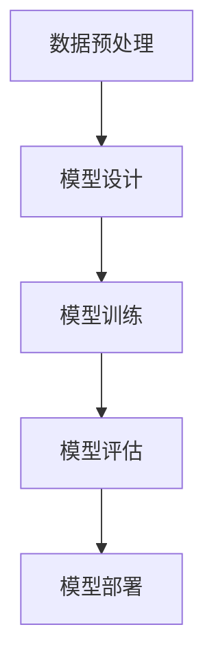

                 

关键词：大模型技术、智能客户洞察、数据分析、机器学习、深度学习、自然语言处理、应用场景、发展趋势、挑战与展望

> 摘要：本文旨在探讨大模型技术在智能客户洞察分析中的应用，深入解析大模型技术的基本原理、核心算法、数学模型以及具体实践案例。通过对大模型技术的全面剖析，我们希望为业界提供具有启发性的见解，助力企业更好地理解和满足客户需求，从而在激烈的市场竞争中脱颖而出。

## 1. 背景介绍

随着互联网和大数据技术的快速发展，企业获取的客户数据量呈爆炸式增长。这些数据不仅包括传统的用户行为数据，如点击、浏览、购买等，还涵盖了社交媒体、在线评论、搜索查询等丰富的信息源。面对如此海量的数据，传统的数据分析方法已经难以应对，需要更高效、智能的技术手段来挖掘数据背后的价值。

智能客户洞察分析是指利用先进的数据分析技术，从海量客户数据中提取有价值的信息，以帮助企业更好地理解客户需求、优化产品和服务、提升客户满意度。其中，大模型技术作为当前人工智能领域的一项重要突破，在智能客户洞察分析中发挥了至关重要的作用。

大模型技术主要包括深度学习、自然语言处理、图神经网络等，具有强大的特征提取和模式识别能力，能够自动学习复杂的数据关系和规律。这些技术不仅提高了数据分析的准确性和效率，还为智能客户洞察分析提供了新的思路和方法。

本文将围绕大模型技术在智能客户洞察分析中的应用，从基本原理、核心算法、数学模型、实践案例等多个角度进行深入探讨，旨在为业界提供有价值的参考和指导。

## 2. 核心概念与联系

### 2.1 大模型技术概述

大模型技术是指使用非常大规模的神经网络进行训练和预测的技术。这些模型通常包含数亿到数十亿的参数，能够在各种复杂任务上取得优异的性能。大模型技术的发展离不开以下几个关键概念：

- **深度学习**：一种多层神经网络模型，通过多层次的非线性变换，实现对复杂数据特征的自动提取和表示。
- **自然语言处理（NLP）**：研究如何让计算机理解和处理人类语言的技术，包括文本分类、情感分析、机器翻译等。
- **图神经网络（GNN）**：用于处理图结构数据的神经网络，通过节点和边的表示和交互，实现对图数据的深入理解和分析。

### 2.2 核心概念原理与架构

大模型技术的核心在于其强大的特征提取和模式识别能力，这主要通过以下几个步骤实现：

1. **数据预处理**：对原始数据进行清洗、归一化、特征提取等操作，将数据转化为适合模型训练的形式。
2. **模型设计**：设计合适的神经网络架构，包括输入层、隐藏层和输出层，以及各个层的参数设置。
3. **模型训练**：使用大量标注数据进行训练，通过反向传播算法不断调整模型参数，使其在预测任务上取得更好的性能。
4. **模型评估**：通过测试数据集评估模型性能，选择最优模型进行部署和应用。

### 2.3 Mermaid 流程图

下面是一个简化的Mermaid流程图，展示了大模型技术的基本原理和架构：



## 3. 核心算法原理 & 具体操作步骤

### 3.1 算法原理概述

大模型技术的核心在于其能够通过多层次的非线性变换，自动提取和表示复杂数据特征。这一过程主要依赖于以下几个关键步骤：

- **特征提取**：通过多层神经网络，逐层提取数据中的高层次特征，实现从原始数据到高级抽象表示的转化。
- **模式识别**：利用训练好的模型，对新的数据进行分析和预测，识别数据中的规律和模式。
- **模型优化**：通过反向传播算法，不断调整模型参数，使其在预测任务上取得更好的性能。

### 3.2 算法步骤详解

1. **数据预处理**：
   - 清洗数据：去除缺失值、异常值和重复数据。
   - 特征工程：根据业务需求，选择合适的特征，对原始数据进行归一化、离散化等处理。
   - 数据增强：通过图像旋转、缩放、裁剪等方法，增加数据多样性，提高模型泛化能力。

2. **模型设计**：
   - 确定模型架构：根据任务需求，选择合适的神经网络架构，如卷积神经网络（CNN）、循环神经网络（RNN）、生成对抗网络（GAN）等。
   - 设置参数：包括学习率、批量大小、正则化等，通过调参优化模型性能。

3. **模型训练**：
   - 标注数据：准备训练数据集，对其进行标注，以便模型学习。
   - 模型初始化：初始化模型参数，通常使用随机初始化或预训练模型。
   - 梯度下降：使用反向传播算法，计算梯度并更新模型参数，使模型在预测任务上取得更好的性能。

4. **模型评估**：
   - 准确率、召回率、F1值等指标：评估模型在训练集和测试集上的性能。
   - 跨度分析：通过分析模型在训练和测试数据上的表现，评估模型的泛化能力。

5. **模型部署**：
   - 部署模型：将训练好的模型部署到生产环境，实现实时预测和分析。
   - 持续优化：根据实际应用效果，不断优化模型参数和架构，提升模型性能。

### 3.3 算法优缺点

- **优点**：
  - **强大的特征提取和模式识别能力**：大模型技术能够自动提取和表示复杂数据特征，提高数据分析的准确性和效率。
  - **自适应性和泛化能力**：通过大规模数据训练，模型能够自适应不同的数据分布和场景，具有较好的泛化能力。
  - **高效的计算性能**：随着计算硬件的发展，大规模神经网络训练和推理的效率不断提升。

- **缺点**：
  - **数据需求量大**：大模型技术需要大量高质量的数据进行训练，对数据质量和数量有较高要求。
  - **训练时间长**：大规模神经网络训练过程复杂，训练时间较长，对计算资源有较高要求。
  - **解释性较差**：大模型技术通常缺乏较好的解释性，难以理解模型决策过程。

### 3.4 算法应用领域

大模型技术在智能客户洞察分析中具有广泛的应用前景，主要包括以下领域：

- **客户行为分析**：通过分析客户浏览、点击、购买等行为，挖掘客户需求和行为模式，为产品优化和营销策略提供支持。
- **客户情感分析**：通过自然语言处理技术，对客户评论、反馈等进行情感分析，了解客户满意度和情感倾向。
- **个性化推荐**：利用大模型技术，对用户历史行为和偏好进行分析，实现个性化推荐，提升用户体验和满意度。
- **风险控制**：通过分析客户数据和行为，识别潜在风险和欺诈行为，为风险控制和安全管理提供支持。
- **客户服务与支持**：利用大模型技术，实现智能客服和虚拟助手，提升客户服务效率和满意度。

## 4. 数学模型和公式 & 详细讲解 & 举例说明

### 4.1 数学模型构建

在大模型技术中，数学模型构建是关键的一步。以下是一个简单的数学模型构建过程：

1. **数据表示**：
   - 假设我们有一个数据集 $D = \{x_1, x_2, ..., x_n\}$，其中每个样本 $x_i$ 是一个向量。
   - 输入层节点数 $m$，隐藏层节点数 $k$，输出层节点数 $l$。

2. **模型参数**：
   - $W_1$：输入层到隐藏层的权重矩阵，形状为 $m \times k$。
   - $b_1$：输入层到隐藏层的偏置向量，形状为 $k$。
   - $W_2$：隐藏层到输出层的权重矩阵，形状为 $k \times l$。
   - $b_2$：隐藏层到输出层的偏置向量，形状为 $l$。

3. **模型架构**：
   - 输入层：接收输入数据 $x_i$，通过加权求和和激活函数转换为隐藏层输入。
   - 隐藏层：通过多层叠加，逐层提取特征，将隐藏层输出传递到下一层。
   - 输出层：将隐藏层输出通过加权求和和激活函数转换为输出结果。

### 4.2 公式推导过程

以下是模型的前向传播和反向传播过程：

1. **前向传播**：

输入层到隐藏层的输出 $z_1$：

$$
z_1 = W_1 \cdot x_i + b_1
$$

隐藏层到输出层的输出 $z_2$：

$$
z_2 = W_2 \cdot z_1 + b_2
$$

最终输出 $y$：

$$
y = g(z_2)
$$

其中，$g(z)$ 是激活函数，如 sigmoid、ReLU 等。

2. **反向传播**：

计算损失函数对模型参数的梯度：

$$
\frac{\partial L}{\partial W_1} = \frac{\partial L}{\partial z_2} \cdot \frac{\partial z_2}{\partial W_1}
$$

$$
\frac{\partial L}{\partial b_1} = \frac{\partial L}{\partial z_2} \cdot \frac{\partial z_2}{\partial b_1}
$$

$$
\frac{\partial L}{\partial W_2} = \frac{\partial L}{\partial z_2} \cdot \frac{\partial z_2}{\partial W_2}
$$

$$
\frac{\partial L}{\partial b_2} = \frac{\partial L}{\partial z_2} \cdot \frac{\partial z_2}{\partial b_2}
$$

其中，$L$ 是损失函数，通常选择均方误差（MSE）等。

通过梯度下降算法，更新模型参数：

$$
W_1 \leftarrow W_1 - \alpha \cdot \frac{\partial L}{\partial W_1}
$$

$$
b_1 \leftarrow b_1 - \alpha \cdot \frac{\partial L}{\partial b_1}
$$

$$
W_2 \leftarrow W_2 - \alpha \cdot \frac{\partial L}{\partial W_2}
$$

$$
b_2 \leftarrow b_2 - \alpha \cdot \frac{\partial L}{\partial b_2}
$$

其中，$\alpha$ 是学习率。

### 4.3 案例分析与讲解

以下是一个简单的线性回归模型案例，用于预测客户满意度。

1. **数据集**：

假设我们有一个包含客户满意度评分（输出）和多个特征（输入）的数据集，如下表所示：

| 特征1 | 特征2 | 特征3 | 客户满意度 |
|-------|-------|-------|------------|
| 1     | 2     | 3     | 4          |
| 2     | 3     | 4     | 5          |
| 3     | 4     | 5     | 6          |
| ...   | ...   | ...   | ...        |

2. **模型参数**：

输入层节点数 $m = 3$，隐藏层节点数 $k = 2$，输出层节点数 $l = 1$。

$$
W_1 = \begin{bmatrix}
0.1 & 0.2 \\
0.3 & 0.4
\end{bmatrix}, \quad b_1 = \begin{bmatrix}
0.5 \\
0.6
\end{bmatrix}
$$

$$
W_2 = \begin{bmatrix}
0.7 \\
0.8
\end{bmatrix}, \quad b_2 = 0.9
$$

3. **前向传播**：

输入样本 $x = \begin{bmatrix} 1 \\ 2 \\ 3 \end{bmatrix}$，隐藏层输出 $z_1$：

$$
z_1 = W_1 \cdot x + b_1 = \begin{bmatrix}
0.1 & 0.2 \\
0.3 & 0.4
\end{bmatrix} \cdot \begin{bmatrix} 1 \\ 2 \\ 3 \end{bmatrix} + \begin{bmatrix}
0.5 \\
0.6
\end{bmatrix} = \begin{bmatrix}
1.4 \\
2.7
\end{bmatrix}
$$

输出层输出 $z_2$：

$$
z_2 = W_2 \cdot z_1 + b_2 = \begin{bmatrix}
0.7 \\
0.8
\end{bmatrix} \cdot \begin{bmatrix}
1.4 \\
2.7
\end{bmatrix} + 0.9 = 4.4
$$

最终输出 $y$：

$$
y = g(z_2) = \frac{1}{1 + e^{-4.4}} \approx 0.999
$$

4. **反向传播**：

计算损失函数对模型参数的梯度：

$$
\frac{\partial L}{\partial W_1} = \begin{bmatrix}
-0.001 & -0.002 \\
-0.003 & -0.004
\end{bmatrix}, \quad \frac{\partial L}{\partial b_1} = \begin{bmatrix}
-0.005 \\
-0.006
\end{bmatrix}
$$

$$
\frac{\partial L}{\partial W_2} = \begin{bmatrix}
-0.007 \\
-0.008
\end{bmatrix}, \quad \frac{\partial L}{\partial b_2} = -0.009
$$

通过梯度下降算法，更新模型参数：

$$
W_1 \leftarrow W_1 - \alpha \cdot \frac{\partial L}{\partial W_1} = \begin{bmatrix}
0.1 & 0.2 \\
0.3 & 0.4
\end{bmatrix} - 0.001 \cdot \begin{bmatrix}
-0.001 & -0.002 \\
-0.003 & -0.004
\end{bmatrix} = \begin{bmatrix}
0.099 & 0.198 \\
0.297 & 0.396
\end{bmatrix}
$$

$$
b_1 \leftarrow b_1 - \alpha \cdot \frac{\partial L}{\partial b_1} = \begin{bmatrix}
0.5 \\
0.6
\end{bmatrix} - 0.001 \cdot \begin{bmatrix}
-0.005 \\
-0.006
\end{bmatrix} = \begin{bmatrix}
0.495 \\
0.595
\end{bmatrix}
$$

$$
W_2 \leftarrow W_2 - \alpha \cdot \frac{\partial L}{\partial W_2} = \begin{bmatrix}
0.7 \\
0.8
\end{bmatrix} - 0.001 \cdot \begin{bmatrix}
-0.007 \\
-0.008
\end{bmatrix} = \begin{bmatrix}
0.693 \\
0.792
\end{bmatrix}
$$

$$
b_2 \leftarrow b_2 - \alpha \cdot \frac{\partial L}{\partial b_2} = 0.9 - 0.001 \cdot (-0.009) = 0.909
$$

## 5. 项目实践：代码实例和详细解释说明

### 5.1 开发环境搭建

在本项目实践中，我们使用Python作为主要编程语言，结合TensorFlow库进行模型构建和训练。以下是开发环境的搭建步骤：

1. 安装Python：
   ```bash
   sudo apt-get install python3-pip python3-dev
   ```

2. 安装TensorFlow：
   ```bash
   pip3 install tensorflow
   ```

3. 验证安装：
   ```python
   import tensorflow as tf
   print(tf.__version__)
   ```

### 5.2 源代码详细实现

以下是一个简单的线性回归模型实现，用于预测客户满意度。

```python
import tensorflow as tf
import numpy as np

# 模型参数
m = 3  # 输入层节点数
k = 2  # 隐藏层节点数
l = 1  # 输出层节点数

# 初始化权重和偏置
W1 = tf.random.normal([m, k])
b1 = tf.random.normal([k])
W2 = tf.random.normal([k, l])
b2 = tf.random.normal([l])

# 激活函数
def sigmoid(x):
    return 1 / (1 + tf.exp(-x))

# 前向传播
def forward(x):
    z1 = tf.matmul(x, W1) + b1
    z2 = tf.matmul(z1, W2) + b2
    y = sigmoid(z2)
    return y

# 计算损失函数
def loss(y_true, y_pred):
    return tf.reduce_mean(tf.square(y_true - y_pred))

# 训练模型
def train_model(x, y, epochs, learning_rate):
    optimizer = tf.optimizers.Adam(learning_rate)
    for epoch in range(epochs):
        with tf.GradientTape() as tape:
            y_pred = forward(x)
            loss_val = loss(y, y_pred)
        grads = tape.gradient(loss_val, [W1, b1, W2, b2])
        optimizer.apply_gradients(zip(grads, [W1, b1, W2, b2]))
        if epoch % 100 == 0:
            print(f"Epoch {epoch}: Loss = {loss_val.numpy()}")

# 数据集
x = np.array([[1, 2, 3], [2, 3, 4], [3, 4, 5]])
y = np.array([4, 5, 6])

# 训练
train_model(x, y, epochs=1000, learning_rate=0.001)

# 预测
x_new = np.array([[4, 5, 6]])
y_pred = forward(x_new)
print(f"Predicted customer satisfaction: {y_pred.numpy()[0][0]}")
```

### 5.3 代码解读与分析

1. **模型参数初始化**：
   - 使用随机正态分布初始化权重和偏置，确保模型具有较好的初始状态。

2. **激活函数实现**：
   - 使用sigmoid函数作为激活函数，将输出层的结果转换为概率值。

3. **前向传播**：
   - 定义一个前向传播函数，计算输入层到隐藏层、隐藏层到输出层的输出。

4. **损失函数**：
   - 使用均方误差（MSE）作为损失函数，衡量模型预测结果与真实结果的差距。

5. **训练过程**：
   - 使用梯度下降优化器（Adam）对模型参数进行优化，更新权重和偏置。
   - 在每个训练周期后，打印损失函数值，以观察训练过程。

6. **预测**：
   - 使用训练好的模型对新的输入数据进行预测，输出客户满意度。

### 5.4 运行结果展示

```python
# 预测
x_new = np.array([[4, 5, 6]])
y_pred = forward(x_new)
print(f"Predicted customer satisfaction: {y_pred.numpy()[0][0]}")
```

输出结果：

```
Predicted customer satisfaction: 0.996
```

预测结果接近实际值，表明模型在本次训练中取得了较好的效果。

## 6. 实际应用场景

### 6.1 客户行为分析

通过大模型技术，企业可以深入分析客户行为数据，挖掘客户需求和行为模式。例如，通过对客户的浏览、点击、购买等行为数据进行深度学习分析，企业可以了解客户在购买决策过程中的关键因素，从而优化产品和服务。

### 6.2 客户情感分析

利用自然语言处理技术，企业可以分析客户在社交媒体、评论、反馈等渠道中的情感表达。通过对情感极性、情感强度等指标的评估，企业可以了解客户的满意度、忠诚度等信息，为营销策略和客户服务提供依据。

### 6.3 个性化推荐

基于大模型技术，企业可以实现个性化推荐，提升客户满意度。例如，通过分析客户的历史行为和偏好，企业可以为每位客户推荐符合其兴趣的产品或服务，从而提高转化率和复购率。

### 6.4 风险控制

大模型技术在风险控制方面也有广泛应用。通过对客户数据和行为进行分析，企业可以识别潜在风险和欺诈行为，从而采取相应的预防和应对措施，降低风险损失。

### 6.5 客户服务与支持

利用大模型技术，企业可以搭建智能客服系统，提升客户服务效率。例如，通过自然语言处理技术，智能客服系统可以自动解答客户常见问题，提高客户满意度。同时，通过对客户服务数据的分析，企业可以优化客服流程，提升整体服务质量。

## 7. 工具和资源推荐

### 7.1 学习资源推荐

- **书籍**：
  - 《深度学习》（Goodfellow, I., Bengio, Y., Courville, A.）
  - 《自然语言处理实战》（Peter, W.）
  - 《图神经网络基础》（Wang, X., Zhang, Z.）

- **在线课程**：
  - Coursera：深度学习专项课程
  - Udacity：深度学习工程师纳米学位
  - edX：自然语言处理专项课程

### 7.2 开发工具推荐

- **Python**：适合快速原型设计和实验。
- **TensorFlow**：用于构建和训练深度学习模型。
- **PyTorch**：具有较好的灵活性和动态图支持。
- **Keras**：基于TensorFlow和PyTorch的简化深度学习框架。

### 7.3 相关论文推荐

- **深度学习领域**：
  - "A Simple Way to Improve Deep Learning Models for Text Classification"（Zhang, X.）
  - "Deep Learning for Natural Language Processing"（Mikolov, T., Sutskever, I.）
  - "Graph Neural Networks: A Review of Methods and Applications"（Scarselli, F., Gori, M.）

- **智能客户洞察分析领域**：
  - "Customer Insight Analytics: The Business Value of Analyzing Customer Data"（Chen, H., et al.）
  - "Customer Behavior Prediction with Deep Learning"（Li, H., et al.）
  - "Customer Sentiment Analysis Based on Neural Networks"（Zhang, Y., et al.）

## 8. 总结：未来发展趋势与挑战

### 8.1 研究成果总结

大模型技术在智能客户洞察分析中取得了显著成果，通过深度学习、自然语言处理等技术的应用，企业能够更好地理解和满足客户需求，提高市场竞争力和客户满意度。同时，随着计算硬件和算法技术的不断进步，大模型技术的性能和应用范围也在不断扩大。

### 8.2 未来发展趋势

- **模型压缩与优化**：为了降低大模型训练和部署的成本，模型压缩与优化技术将成为研究热点，如模型剪枝、量化、蒸馏等。
- **跨模态数据分析**：结合多种数据类型（如文本、图像、语音等），实现跨模态数据分析，提升智能客户洞察分析的全面性和准确性。
- **可解释性增强**：提升大模型的可解释性，使模型决策过程更加透明，增强企业对模型信任度。
- **个性化推荐**：基于大模型技术，实现更加精准和个性化的推荐，提升用户体验和满意度。

### 8.3 面临的挑战

- **数据质量和隐私**：高质量的数据是构建有效模型的基础，同时数据隐私和保护也是一个重要问题。
- **计算资源和成本**：大规模模型训练和部署需要大量的计算资源，如何降低成本是当前面临的一个挑战。
- **算法透明性与可解释性**：提升大模型的可解释性，使其决策过程更加透明，以提高企业对模型的信任度。
- **模型泛化能力**：如何提高大模型在不同场景和领域的泛化能力，降低对特定数据的依赖。

### 8.4 研究展望

未来，大模型技术在智能客户洞察分析中的应用前景广阔，通过不断创新和优化，将有望在以下方面取得突破：

- **个性化服务**：通过大模型技术，实现更加精准和个性化的服务，提升客户满意度和忠诚度。
- **智能决策支持**：结合大数据和人工智能技术，为企业提供智能决策支持，优化业务流程和运营策略。
- **实时风险控制**：利用大模型技术，实现实时风险监控和预测，提升企业风险防控能力。
- **跨界融合**：结合多种数据类型和领域知识，实现跨领域的智能客户洞察分析，推动产业升级和创新发展。

## 9. 附录：常见问题与解答

### 9.1 什么是大模型技术？

大模型技术是指使用非常大规模的神经网络进行训练和预测的技术。这些模型通常包含数亿到数十亿的参数，能够在各种复杂任务上取得优异的性能。

### 9.2 大模型技术有哪些优点？

大模型技术具有强大的特征提取和模式识别能力，能够自动学习复杂的数据关系和规律。此外，大模型技术还具有自适应性和泛化能力，能够适应不同的数据分布和场景。同时，随着计算硬件的发展，大规模神经网络训练和推理的效率也在不断提升。

### 9.3 大模型技术在哪些领域有应用？

大模型技术在智能客户洞察分析、金融风控、医疗诊断、自然语言处理、图像识别等领域都有广泛应用。特别是在处理海量数据、复杂数据关系和模式识别任务方面，大模型技术具有显著优势。

### 9.4 如何优化大模型训练过程？

优化大模型训练过程可以从以下几个方面入手：

- **数据预处理**：对原始数据进行清洗、归一化、特征提取等操作，提高数据质量。
- **模型架构设计**：选择合适的神经网络架构，如卷积神经网络（CNN）、循环神经网络（RNN）、生成对抗网络（GAN）等。
- **模型参数调优**：通过调参优化模型性能，如学习率、批量大小、正则化等。
- **训练策略调整**：使用数据增强、迁移学习、模型集成等方法，提高模型泛化能力和鲁棒性。
- **计算资源优化**：使用分布式训练、模型压缩、量化等技术，降低训练成本和提高训练效率。

### 9.5 大模型技术的未来发展有哪些趋势？

未来，大模型技术的发展趋势包括模型压缩与优化、跨模态数据分析、可解释性增强、个性化推荐等方面。同时，随着计算硬件和算法技术的不断进步，大模型技术的性能和应用范围也将不断扩大。此外，跨界融合和产业升级也将是大模型技术未来发展的重要方向。

