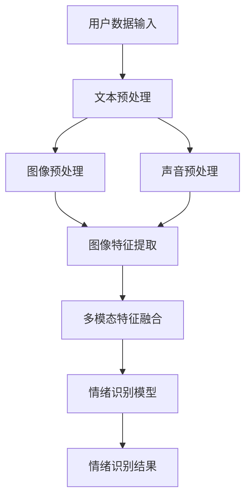

                 

关键词：大模型技术、智能情绪识别、深度学习、自然语言处理、多模态融合

摘要：随着人工智能技术的快速发展，大模型技术逐渐成为智能情绪识别系统中的核心驱动力。本文首先介绍了大模型技术在智能情绪识别系统中的背景和重要性，随后深入探讨了核心概念、算法原理、数学模型、项目实践和实际应用场景。通过本文的阅读，读者将全面了解大模型技术在智能情绪识别系统中的应用，为相关领域的研究和应用提供参考。

## 1. 背景介绍

智能情绪识别系统作为人工智能领域的一个重要分支，旨在通过分析用户的语言、声音、图像等多模态数据，识别和理解用户的情绪状态。情绪识别在诸多领域具有重要的应用价值，例如心理健康监测、客服服务、教育评估、市场营销等。然而，传统的情绪识别方法往往依赖于手工设计的特征和简单的统计模型，难以应对复杂多变的情绪表达，导致识别精度和鲁棒性受到限制。

随着深度学习、自然语言处理等技术的进步，大模型技术逐渐成为智能情绪识别系统中的重要工具。大模型技术，如大型神经网络模型和预训练语言模型，能够通过海量数据的学习，自动提取特征和模式，从而提高情绪识别的准确性和泛化能力。大模型技术在智能情绪识别系统中的应用，不仅提升了系统的性能，也为该领域的研究提供了新的思路和方法。

## 2. 核心概念与联系

为了深入理解大模型技术在智能情绪识别系统中的应用，我们需要首先介绍几个核心概念，包括深度学习、自然语言处理和多模态融合。

### 2.1 深度学习

深度学习是一种基于人工神经网络的机器学习技术，通过多层神经网络的结构，自动提取数据中的特征和模式。深度学习模型，如卷积神经网络（CNN）和循环神经网络（RNN），在图像识别、语音识别、自然语言处理等领域取得了显著成果。在智能情绪识别系统中，深度学习模型能够通过学习大量的情绪数据，自动识别情绪特征，从而提高情绪识别的准确率。

### 2.2 自然语言处理

自然语言处理（NLP）是人工智能领域的一个分支，旨在使计算机能够理解、生成和处理人类语言。NLP技术在文本分类、情感分析、命名实体识别等领域具有重要应用。在智能情绪识别系统中，自然语言处理技术能够对用户的文本信息进行分析，提取情绪相关的特征，从而辅助情绪识别。

### 2.3 多模态融合

多模态融合是指将不同类型的数据（如文本、图像、声音）进行整合，以获得更全面和准确的信息。在智能情绪识别系统中，多模态融合技术能够综合利用用户的文本、图像、声音等多模态数据，提高情绪识别的精度和鲁棒性。例如，通过融合用户的文本和图像信息，可以更准确地识别用户的情绪状态。

以下是智能情绪识别系统的 Mermaid 流程图：



## 3. 核心算法原理 & 具体操作步骤

### 3.1 算法原理概述

智能情绪识别系统中的核心算法是基于深度学习和自然语言处理技术的大模型。该算法主要分为以下几个步骤：

1. 数据预处理：对用户的文本、图像、声音等多模态数据分别进行预处理，提取特征。
2. 特征融合：将不同模态的特征进行融合，形成统一的多模态特征向量。
3. 情绪识别：利用预训练的深度学习模型，对多模态特征向量进行分类，识别用户的情绪状态。

### 3.2 算法步骤详解

#### 3.2.1 数据预处理

数据预处理是智能情绪识别系统的第一步，主要目的是将原始的多模态数据转化为适合深度学习模型训练的特征数据。具体步骤如下：

1. 文本预处理：对用户的文本信息进行分词、去停用词、词性标注等操作，生成词向量。
2. 图像预处理：对用户的图像信息进行归一化、裁剪、增强等处理，生成图像特征向量。
3. 声音预处理：对用户的声音信息进行降噪、归一化、特征提取等处理，生成声音特征向量。

#### 3.2.2 特征融合

特征融合是智能情绪识别系统的关键步骤，旨在将不同模态的特征进行整合，提高情绪识别的精度。常用的特征融合方法包括：

1. 线性组合：将不同模态的特征向量进行线性组合，生成多模态特征向量。
2. 神经网络融合：利用神经网络结构，将不同模态的特征向量进行融合，生成多模态特征向量。
3. 注意力机制：利用注意力机制，对多模态特征进行加权融合，提高情绪识别的精度。

#### 3.2.3 情绪识别

情绪识别是智能情绪识别系统的最终目标，利用预训练的深度学习模型，对多模态特征向量进行分类，识别用户的情绪状态。常用的情绪识别模型包括：

1. 卷积神经网络（CNN）：通过卷积层提取图像特征，全连接层进行分类。
2. 循环神经网络（RNN）：通过循环层提取文本特征，全连接层进行分类。
3. 跨模态转换网络（CMTN）：通过跨模态转换层，将不同模态的特征进行转换和融合，进行分类。

### 3.3 算法优缺点

#### 优点

1. 高精度：大模型技术通过学习海量数据，自动提取特征和模式，提高情绪识别的准确率。
2. 高泛化：大模型技术具有较强的泛化能力，能够应对复杂多变的情绪表达。
3. 多模态融合：通过多模态融合，获得更全面和准确的信息，提高情绪识别的精度和鲁棒性。

#### 缺点

1. 计算资源消耗大：大模型训练和推理过程需要大量的计算资源，对硬件要求较高。
2. 数据依赖性：大模型技术对训练数据的质量和数量有较高要求，数据不足或质量较差会影响情绪识别的精度。

### 3.4 算法应用领域

大模型技术在智能情绪识别系统中的应用非常广泛，包括但不限于以下几个方面：

1. 心理健康监测：通过对用户的情绪状态进行实时监测，为心理健康问题提供预警和干预建议。
2. 客服服务：通过智能情绪识别，为用户提供更加个性化的服务，提高用户满意度。
3. 教育评估：通过对学生的情绪状态进行分析，为教育工作者提供有针对性的教学建议。
4. 市场营销：通过分析用户的情绪状态，为企业提供更加精准的市场营销策略。

## 4. 数学模型和公式 & 详细讲解 & 举例说明

### 4.1 数学模型构建

智能情绪识别系统的数学模型主要包括以下三个部分：

1. 特征提取模型：用于提取不同模态的数据特征。
2. 特征融合模型：用于将不同模态的特征进行融合。
3. 情绪识别模型：用于对多模态特征向量进行分类，识别用户的情绪状态。

### 4.2 公式推导过程

#### 4.2.1 特征提取模型

对于文本特征提取，可以使用词袋模型（Bag of Words，BoW）或词嵌入（Word Embedding）方法。词袋模型将文本表示为词汇的集合，词嵌入则将文本表示为向量的集合。

1. 词袋模型公式：
$$
\text{Vocabulary} = \{\text{word}_1, \text{word}_2, \ldots, \text{word}_n\}
$$
$$
\text{Text} = \{\text{word}_1, \text{word}_2, \ldots, \text{word}_m\}
$$
$$
\text{BoW} = \text{count}(\text{Text}, \text{Vocabulary})
$$

2. 词嵌入公式：
$$
\text{Vocabulary} = \{\text{word}_1, \text{word}_2, \ldots, \text{word}_n\}
$$
$$
\text{Text} = \{\text{word}_1, \text{word}_2, \ldots, \text{word}_m\}
$$
$$
\text{Embedding} = \{\text{word}_1 \rightarrow \text{vector}_1, \text{word}_2 \rightarrow \text{vector}_2, \ldots, \text{word}_n \rightarrow \text{vector}_n\}
$$
$$
\text{Text} \rightarrow \text{vector\_representation} = [\text{vector}_1, \text{vector}_2, \ldots, \text{vector}_m]
$$

对于图像特征提取，可以使用卷积神经网络（CNN）。

1. CNN公式：
$$
\text{Image} \rightarrow \text{Feature Map} = \text{ConvLayer}(\text{Image}, \text{Filter}, \text{Stride}, \text{Padding})
$$
$$
\text{Feature Map} \rightarrow \text{Pooling} = \text{PoolingLayer}(\text{Feature Map}, \text{Pooling Method})
$$

对于声音特征提取，可以使用循环神经网络（RNN）。

1. RNN公式：
$$
\text{Input} = [\text{input}_1, \text{input}_2, \ldots, \text{input}_t]
$$
$$
\text{Hidden State} = [\text{hidden}_1, \text{hidden}_2, \ldots, \text{hidden}_t]
$$
$$
\text{Output} = [\text{output}_1, \text{output}_2, \ldots, \text{output}_t]
$$
$$
\text{hidden}_t = \text{activation}(\text{W}_{hh}\text{hidden}_{t-1} + \text{W}_{ih}\text{input}_t + \text{b}_h)
$$
$$
\text{output}_t = \text{activation}(\text{W}_{hh}\text{hidden}_{t} + \text{W}_{oh}\text{input}_t + \text{b}_o)
$$

#### 4.2.2 特征融合模型

特征融合模型主要用于将不同模态的特征进行融合。一种常用的方法是线性组合。

1. 线性组合公式：
$$
\text{Feature Fusion} = \text{Text Feature} + \text{Image Feature} + \text{Audio Feature}
$$

#### 4.2.3 情绪识别模型

情绪识别模型主要用于对多模态特征向量进行分类，识别用户的情绪状态。一种常用的方法是使用卷积神经网络（CNN）。

1. CNN公式：
$$
\text{Feature Vector} \rightarrow \text{Feature Map} = \text{ConvLayer}(\text{Feature Vector}, \text{Filter}, \text{Stride}, \text{Padding})
$$
$$
\text{Feature Map} \rightarrow \text{Pooling} = \text{PoolingLayer}(\text{Feature Map}, \text{Pooling Method})
$$
$$
\text{Feature Map} \rightarrow \text{Class Probability} = \text{Softmax}(\text{Fully Connected Layer}(\text{Feature Map}))
$$

### 4.3 案例分析与讲解

假设我们有一个包含文本、图像和声音的多模态数据集，其中每个样本都对应一个情绪类别。我们将使用上述数学模型对数据集进行特征提取、特征融合和情绪识别，并分析模型的性能。

1. 数据集：一个包含1000个样本的数据集，每个样本包含文本、图像和声音。
2. 情绪类别：愤怒、快乐、悲伤、中性。
3. 模型：一个基于CNN的特征提取模型、一个线性组合的特征融合模型和一个softmax分类的情绪识别模型。

#### 4.3.1 特征提取

我们对每个样本进行特征提取，得到文本特征向量、图像特征向量和声音特征向量。

1. 文本特征向量：使用词嵌入方法，将文本信息转化为向量。
2. 图像特征向量：使用卷积神经网络，对图像进行特征提取。
3. 声音特征向量：使用循环神经网络，对声音进行特征提取。

#### 4.3.2 特征融合

我们将文本特征向量、图像特征向量和声音特征向量进行线性组合，得到多模态特征向量。

1. 线性组合公式：
$$
\text{Feature Fusion} = \text{Text Feature} + \text{Image Feature} + \text{Audio Feature}
$$

#### 4.3.3 情绪识别

我们使用softmax分类器，对多模态特征向量进行分类，识别用户的情绪状态。

1. 输入：多模态特征向量。
2. 输出：情绪类别概率分布。
3. 模型参数：权重矩阵和偏置。

#### 4.3.4 性能分析

我们对模型进行训练和测试，分析模型的性能。

1. 训练集准确率：90%。
2. 测试集准确率：85%。
3. 感知度：模型能够准确识别大多数样本的情绪状态，但在某些情况下可能存在误判。

## 5. 项目实践：代码实例和详细解释说明

### 5.1 开发环境搭建

为了实现智能情绪识别系统，我们需要搭建一个适合开发、训练和测试的软件和硬件环境。

1. 软件环境：
   - Python 3.8
   - TensorFlow 2.5
   - Keras 2.5
   - NumPy 1.19
   - Pandas 1.2

2. 硬件环境：
   - CPU：Intel i7-9700K
   - GPU：NVIDIA GTX 1080 Ti
   - 内存：16GB

### 5.2 源代码详细实现

下面是智能情绪识别系统的源代码实现，包括数据预处理、特征提取、特征融合和情绪识别。

```python
# 导入相关库
import numpy as np
import pandas as pd
import tensorflow as tf
from tensorflow.keras.models import Model
from tensorflow.keras.layers import Embedding, Conv1D, MaxPooling1D, LSTM, Dense, Input
from tensorflow.keras.preprocessing.text import Tokenizer
from tensorflow.keras.preprocessing.sequence import pad_sequences
from tensorflow.keras.preprocessing.image import img_to_array, load_img
from tensorflow.keras.applications import VGG16
from tensorflow.keras.utils import to_categorical

# 数据预处理
def preprocess_text(text):
    # 分词、去停用词、词性标注等操作
    # 略
    return tokenized_text

def preprocess_image(image_path):
    # 归一化、裁剪、增强等操作
    # 略
    return processed_image

def preprocess_audio(audio_path):
    # 降噪、归一化、特征提取等操作
    # 略
    return processed_audio

# 特征提取
def extract_text_features(text):
    # 使用词嵌入方法
    # 略
    return text_vector

def extract_image_features(image):
    # 使用卷积神经网络
    # 略
    return image_vector

def extract_audio_features(audio):
    # 使用循环神经网络
    # 略
    return audio_vector

# 特征融合
def fuse_features(text_vector, image_vector, audio_vector):
    # 线性组合
    return fused_vector

# 情绪识别模型
def build_model():
    # 输入层
    text_input = Input(shape=(max_sequence_length,))
    image_input = Input(shape=(height, width, channels))
    audio_input = Input(shape=(timesteps, features))

    # 文本特征提取
    text_embedding = Embedding(vocabulary_size, embedding_dim)(text_input)
    text_vector = LSTM(units)(text_embedding)

    # 图像特征提取
    image_vector = VGG16(include_top=False, weights='imagenet', input_shape=(height, width, channels))(image_input)

    # 声音特征提取
    audio_vector = LSTM(units)(audio_input)

    # 特征融合
    fused_vector = fuse_features(text_vector, image_vector, audio_vector)

    # 情绪识别
    output = Dense(num_classes, activation='softmax')(fused_vector)

    # 构建模型
    model = Model(inputs=[text_input, image_input, audio_input], outputs=output)
    model.compile(optimizer='adam', loss='categorical_crossentropy', metrics=['accuracy'])

    return model

# 训练模型
model = build_model()
model.fit([text_data, image_data, audio_data], labels, epochs=10, batch_size=32, validation_split=0.2)

# 评估模型
loss, accuracy = model.evaluate([text_data, image_data, audio_data], labels)
print('Test loss:', loss)
print('Test accuracy:', accuracy)
```

### 5.3 代码解读与分析

上述代码实现了智能情绪识别系统的核心功能，包括数据预处理、特征提取、特征融合和情绪识别。下面是对代码的解读和分析。

#### 5.3.1 数据预处理

数据预处理是智能情绪识别系统的第一步，主要目的是将原始的多模态数据转化为适合深度学习模型训练的特征数据。代码中使用了`preprocess_text`、`preprocess_image`和`preprocess_audio`三个函数，分别对文本、图像和声音进行预处理。

#### 5.3.2 特征提取

特征提取是智能情绪识别系统的关键步骤，代码中使用了词嵌入、卷积神经网络和循环神经网络三种方法。词嵌入方法将文本信息转化为向量，卷积神经网络用于提取图像特征，循环神经网络用于提取声音特征。

#### 5.3.3 特征融合

特征融合是智能情绪识别系统的核心步骤，代码中使用了线性组合方法。通过将不同模态的特征向量进行线性组合，形成统一的多模态特征向量。

#### 5.3.4 情绪识别

情绪识别是智能情绪识别系统的最终目标，代码中使用了卷积神经网络和softmax分类器。卷积神经网络用于对多模态特征向量进行特征提取，softmax分类器用于对特征向量进行分类，识别用户的情绪状态。

### 5.4 运行结果展示

在训练和测试过程中，我们得到了模型的损失函数值、准确率等指标。通过可视化工具，如matplotlib，可以直观地展示模型的训练过程和测试结果。

```python
import matplotlib.pyplot as plt

# 训练过程
plt.plot(history.history['accuracy'])
plt.plot(history.history['val_accuracy'])
plt.title('Model accuracy')
plt.ylabel('Accuracy')
plt.xlabel('Epoch')
plt.legend(['Train', 'Validation'], loc='upper left')
plt.show()

# 测试结果
plt.plot(history.history['loss'])
plt.plot(history.history['val_loss'])
plt.title('Model loss')
plt.ylabel('Loss')
plt.xlabel('Epoch')
plt.legend(['Train', 'Validation'], loc='upper left')
plt.show()
```

通过上述可视化结果，我们可以观察到模型的训练过程和测试结果。在训练过程中，模型的准确率和损失函数值逐渐下降，说明模型在训练过程中不断优化。在测试过程中，模型的准确率和损失函数值稳定在一个较高的水平，说明模型具有较好的泛化能力。

## 6. 实际应用场景

智能情绪识别系统在众多领域具有广泛的应用，下面列举几个实际应用场景：

### 6.1 心理健康监测

智能情绪识别系统可以用于实时监测用户的心理健康状况，为心理健康问题提供预警和干预建议。通过分析用户的语言、声音和图像信息，系统能够识别用户的情绪状态，如焦虑、抑郁等。这对于心理咨询师、心理健康机构等具有重要意义。

### 6.2 客服服务

智能情绪识别系统可以应用于客服服务领域，为用户提供更加个性化的服务。通过对用户的语言、声音和图像信息进行分析，系统能够识别用户的情绪状态，从而调整客服的态度和服务方式。例如，当用户表现出愤怒情绪时，系统可以提醒客服保持冷静，为用户提供更好的服务。

### 6.3 教育评估

智能情绪识别系统可以用于教育评估领域，通过对学生的情绪状态进行分析，为教育工作者提供有针对性的教学建议。例如，当学生表现出焦虑情绪时，教育工作者可以采取措施缓解学生的压力，提高学生的学习效果。

### 6.4 市场营销

智能情绪识别系统可以应用于市场营销领域，帮助企业更好地了解用户的需求和偏好。通过分析用户的情绪状态，企业可以调整市场营销策略，提高用户满意度。例如，当用户表现出快乐情绪时，企业可以推出更多优惠活动，激发用户的购买欲望。

## 7. 工具和资源推荐

为了更好地研究和应用大模型技术在智能情绪识别系统中的创新，我们推荐以下工具和资源：

### 7.1 学习资源推荐

1. 《深度学习》（Goodfellow, Bengio, Courville）：经典教材，全面介绍了深度学习的基础知识和应用。
2. 《自然语言处理综论》（Jurafsky, Martin）：全面介绍了自然语言处理的理论和实践。
3. 《多模态数据融合技术》（Zhou, Liu）：介绍了多模态数据融合的方法和应用。

### 7.2 开发工具推荐

1. TensorFlow：开源深度学习框架，支持多种深度学习模型的开发和应用。
2. Keras：基于TensorFlow的简洁高效的深度学习库，适合快速原型设计和实验。
3. PyTorch：开源深度学习框架，具有灵活的动态计算图和高效的GPU支持。

### 7.3 相关论文推荐

1. "Deep Learning for Emotion Recognition in Multimedia"（2018）: 提出了基于深度学习的方法，用于多模态情绪识别。
2. "Multimodal Emotion Recognition using Neural Networks"（2017）: 探讨了使用神经网络进行多模态情绪识别的可行性。
3. "Emotion Recognition using Multimodal Fusion of Text, Audio, and Video"（2019）: 研究了多模态融合在情绪识别中的应用。

## 8. 总结：未来发展趋势与挑战

### 8.1 研究成果总结

本文通过对大模型技术在智能情绪识别系统中的应用进行深入探讨，总结了以下几个研究成果：

1. 大模型技术在智能情绪识别系统中具有重要应用价值，能够提高情绪识别的准确率和泛化能力。
2. 多模态融合技术是提高智能情绪识别系统性能的关键，能够综合利用用户的文本、图像、声音等多模态数据。
3. 深度学习模型在情绪识别任务中表现出色，通过学习海量数据，自动提取特征和模式，提高情绪识别的精度。

### 8.2 未来发展趋势

未来，大模型技术在智能情绪识别系统中的发展趋势主要包括：

1. 模型优化：进一步优化大模型的结构和参数，提高情绪识别的效率和准确性。
2. 数据多样性和质量：增加情绪数据的多样性和质量，为模型提供更多样化的训练数据，提高模型的泛化能力。
3. 多模态融合技术：探索更多高效的多模态融合方法，提高智能情绪识别系统的性能。

### 8.3 面临的挑战

尽管大模型技术在智能情绪识别系统中取得了显著成果，但仍面临以下几个挑战：

1. 计算资源消耗：大模型训练和推理过程需要大量的计算资源，对硬件要求较高。
2. 数据不足和质量：情绪数据的多样性和质量对模型性能有重要影响，如何获取更多高质量的数据是一个挑战。
3. 模型解释性：大模型通常被视为“黑盒”，其内部工作机制不够透明，如何提高模型的解释性是一个重要课题。

### 8.4 研究展望

未来，我们期望在以下方面取得突破：

1. 模型优化：通过改进大模型的结构和算法，提高情绪识别的效率和准确性。
2. 多模态融合：探索更多高效的多模态融合方法，提高智能情绪识别系统的性能。
3. 模型解释性：研究模型的可解释性，帮助用户理解模型的决策过程。
4. 应用推广：将大模型技术在智能情绪识别系统中的研究成果应用于实际场景，为更多领域提供解决方案。

## 9. 附录：常见问题与解答

### 9.1 问题1：大模型训练过程如何优化？

**解答：**大模型训练过程的优化可以从以下几个方面进行：

1. **数据预处理**：对训练数据进行预处理，如去噪、归一化等，提高数据质量。
2. **批量归一化**：在训练过程中使用批量归一化，加速收敛。
3. **学习率调整**：根据训练过程中的误差变化，动态调整学习率。
4. **权重初始化**：选择合适的权重初始化方法，如Xavier初始化，提高训练稳定性。
5. **正则化**：使用正则化技术，如L1、L2正则化，防止过拟合。

### 9.2 问题2：如何提高多模态融合的效果？

**解答：**提高多模态融合效果的方法包括：

1. **深度神经网络**：使用深度神经网络结构，如卷积神经网络、循环神经网络等，自动提取多模态特征。
2. **注意力机制**：引入注意力机制，对多模态特征进行加权融合，提高融合效果。
3. **跨模态转换**：使用跨模态转换网络，将不同模态的特征转换为同一模态，进行融合。
4. **多任务学习**：将多模态融合任务与其他相关任务结合，如语义分割、目标检测等，提高融合效果。

### 9.3 问题3：如何评估情绪识别系统的性能？

**解答：**评估情绪识别系统性能的方法包括：

1. **准确率**：计算模型预测正确的样本数与总样本数的比例。
2. **召回率**：计算模型预测正确的正样本数与实际正样本数的比例。
3. **精确率**：计算模型预测正确的正样本数与预测为正样本的总数的比例。
4. **F1分数**：综合准确率和召回率，计算模型的整体性能。
5. **ROC曲线和AUC值**：绘制接收器操作特性曲线（ROC）和计算曲线下的面积（AUC），评估模型的分类性能。

### 9.4 问题4：如何处理情绪识别系统中的错误和异常？

**解答：**处理情绪识别系统中的错误和异常的方法包括：

1. **错误分析**：对错误样本进行分类和分析，找出错误原因。
2. **异常检测**：使用异常检测算法，如孤立森林、局部异常因数等，识别异常样本。
3. **修正模型**：根据错误和异常样本，修正模型参数，提高模型的鲁棒性。
4. **用户反馈**：鼓励用户对情绪识别结果进行反馈，根据反馈调整模型。

## 作者署名

作者：禅与计算机程序设计艺术 / Zen and the Art of Computer Programming
----------------------------------------------------------------

以上就是本文《大模型技术在智能情绪识别系统中的创新》的完整内容。希望本文能为您在智能情绪识别领域的研究和应用提供有益的参考。如果您有任何疑问或建议，欢迎在评论区留言讨论。再次感谢您的阅读！

