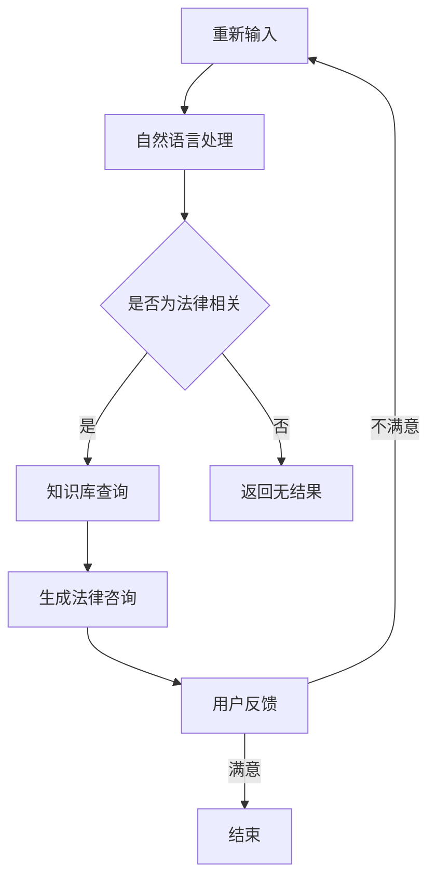

                 

关键词：大模型技术，智能法律咨询，自然语言处理，深度学习，算法优化，法律合规，案例分析，应用展望

## 摘要

本文旨在探讨大模型技术在智能法律咨询系统中的应用，通过对自然语言处理和深度学习技术的深入分析，阐述大模型在智能法律咨询系统中的重要性。文章首先介绍了智能法律咨询系统的背景和发展现状，随后详细阐述了大模型技术的核心概念和原理。接着，本文探讨了大模型技术在智能法律咨询系统中的具体应用场景和操作步骤，并分析了其优缺点。最后，文章通过案例分析，展示了大模型技术在智能法律咨询系统中的实际效果，并对未来应用前景进行了展望。

## 1. 背景介绍

### 1.1 智能法律咨询系统的兴起

随着信息技术和人工智能技术的不断发展，智能法律咨询系统逐渐成为法律服务领域的重要创新方向。传统的法律服务存在效率低、成本高、覆盖范围有限等问题，而智能法律咨询系统通过利用人工智能技术，可以实现高效、准确、全面的法律咨询与服务。

### 1.2 智能法律咨询系统的基本原理

智能法律咨询系统通常由三个主要部分组成：知识库、自然语言处理模块和决策支持模块。知识库包含法律条文、判例、法规等法律信息，是系统的基础。自然语言处理模块负责处理用户的自然语言输入，将其转化为机器可以理解和处理的格式。决策支持模块根据知识库和自然语言处理的结果，为用户提供相应的法律咨询和建议。

### 1.3 智能法律咨询系统的发展现状

目前，智能法律咨询系统已经在国内外得到了广泛的应用。例如，一些知名的法律科技公司如美国的大成律师事务所、中国的慧法科技等，已经推出了自己的智能法律咨询产品。这些产品在提高法律服务的效率、降低成本、扩大服务范围等方面取得了显著成效。

## 2. 核心概念与联系

### 2.1 大模型技术概述

大模型技术是指通过训练大规模的数据集，构建出具有强大计算能力和高精度预测能力的模型。这些模型通常包含数亿甚至千亿个参数，能够处理复杂的任务，如自然语言处理、图像识别、语音识别等。

### 2.2 大模型技术在智能法律咨询系统中的应用

在智能法律咨询系统中，大模型技术主要用于自然语言处理和知识库构建。具体来说，大模型可以通过处理大量的法律文本数据，学习到法律语言的规律和特征，从而提高自然语言处理的准确性和效率。同时，大模型还可以通过分析大量的法律案例，构建出包含丰富法律知识的知识库，为智能法律咨询系统提供支持。

### 2.3 Mermaid 流程图



## 3. 核心算法原理 & 具体操作步骤

### 3.1 算法原理概述

大模型技术在智能法律咨询系统中的应用，主要依赖于深度学习和自然语言处理技术。深度学习模型，如Transformer、BERT等，可以通过大规模数据训练，捕捉到语言的本质特征，从而实现高效的文本理解和生成。自然语言处理技术，如分词、词性标注、实体识别等，可以处理用户的自然语言输入，将其转化为计算机可以理解的形式。

### 3.2 算法步骤详解

1. **数据预处理**：对法律文本进行预处理，包括去除停用词、标点符号等，将文本转化为模型可以处理的格式。

2. **模型训练**：使用预处理的文本数据，训练深度学习模型，如BERT。模型会学习到文本的语法、语义和上下文信息。

3. **文本理解**：将用户的自然语言输入，通过自然语言处理技术进行处理，提取关键信息。

4. **知识库查询**：根据处理后的输入文本，在知识库中查找相关法律条文、判例等，为用户提供法律咨询。

5. **生成法律咨询**：根据查询结果，使用深度学习模型生成法律咨询文本。

6. **用户反馈**：用户对生成的法律咨询进行评价，系统根据反馈进行调整。

### 3.3 算法优缺点

**优点**：

- 高效：大模型可以通过大规模数据训练，实现高效的处理和预测。
- 准确：深度学习和自然语言处理技术可以提高文本理解和生成的准确性。
- 全面：大模型可以处理复杂的任务，提供全面的法律咨询服务。

**缺点**：

- 数据依赖：大模型对数据有较高的要求，需要大量的高质量数据支持。
- 计算资源：大模型训练和推理需要大量的计算资源，成本较高。

### 3.4 算法应用领域

大模型技术在智能法律咨询系统中的应用，不仅限于法律咨询，还可以扩展到法律研究、法律合规等领域。例如，通过分析大量的法律案例，可以为法律研究提供数据支持；通过监控企业的法律行为，可以为法律合规提供预警。

## 4. 数学模型和公式 & 详细讲解 & 举例说明

### 4.1 数学模型构建

在智能法律咨询系统中，常用的数学模型包括神经网络模型和决策树模型。以下是一个简单的神经网络模型示例：

$$
y = \sigma(\text{W} \cdot \text{X} + \text{b})
$$

其中，$\text{X}$ 是输入特征，$\text{W}$ 是权重，$\text{b}$ 是偏置，$\sigma$ 是激活函数。

### 4.2 公式推导过程

以神经网络模型为例，公式的推导过程如下：

1. **前向传播**：

$$
\text{Z} = \text{W} \cdot \text{X} + \text{b}
$$

$$
\text{A} = \sigma(\text{Z})
$$

2. **反向传播**：

计算损失函数：

$$
\text{L} = \frac{1}{2} \sum_{i=1}^{n} (\text{y}_i - \text{A}_i)^2
$$

计算梯度：

$$
\frac{\partial \text{L}}{\partial \text{W}} = -(\text{y} - \text{A}) \cdot \text{X}
$$

$$
\frac{\partial \text{L}}{\partial \text{b}} = -(\text{y} - \text{A})
$$

更新参数：

$$
\text{W} = \text{W} - \alpha \cdot \frac{\partial \text{L}}{\partial \text{W}}
$$

$$
\text{b} = \text{b} - \alpha \cdot \frac{\partial \text{L}}{\partial \text{b}}
$$

其中，$\alpha$ 是学习率。

### 4.3 案例分析与讲解

假设我们要构建一个智能法律咨询系统，用于判断一份合同是否合法。我们可以使用神经网络模型来处理这个问题。

1. **数据准备**：收集大量的合同数据，包括合法和非法的合同。

2. **特征提取**：从合同文本中提取关键特征，如合同条款、双方名称等。

3. **模型训练**：使用提取的特征，训练神经网络模型，学习合同合法性的规律。

4. **预测**：将新合同文本输入模型，预测合同是否合法。

5. **评估**：使用实际合同数据进行评估，调整模型参数，提高预测准确性。

## 5. 项目实践：代码实例和详细解释说明

### 5.1 开发环境搭建

1. 安装 Python 3.8 或以上版本。
2. 安装 TensorFlow 2.x 版本。
3. 安装自然语言处理库，如 NLTK 或 spaCy。

### 5.2 源代码详细实现

以下是一个简单的智能法律咨询系统的代码实现：

```python
import tensorflow as tf
from tensorflow.keras.models import Sequential
from tensorflow.keras.layers import Dense, Embedding, LSTM
from tensorflow.keras.preprocessing.sequence import pad_sequences

# 数据准备
x_train = ... # 合同文本
y_train = ... # 合同合法性标签

# 特征提取
max_sequence_length = 100
vocab_size = 10000
embedding_dim = 16

x_train = pad_sequences(x_train, maxlen=max_sequence_length, padding='post')
tokenizer = tf.keras.preprocessing.text.Tokenizer(num_words=vocab_size)
y_train = tf.keras.utils.to_categorical(y_train)

# 模型构建
model = Sequential()
model.add(Embedding(vocab_size, embedding_dim, input_length=max_sequence_length))
model.add(LSTM(128))
model.add(Dense(2, activation='softmax'))

# 模型编译
model.compile(optimizer='adam', loss='categorical_crossentropy', metrics=['accuracy'])

# 模型训练
model.fit(x_train, y_train, epochs=10, batch_size=32)

# 预测
def predict(text):
    text_sequence = tokenizer.texts_to_sequences([text])
    text_sequence = pad_sequences(text_sequence, maxlen=max_sequence_length, padding='post')
    return model.predict(text_sequence)

# 使用示例
text = "合同条款如下：..."
print(predict(text))
```

### 5.3 代码解读与分析

以上代码实现了一个简单的神经网络模型，用于判断合同是否合法。代码分为以下几个部分：

1. **数据准备**：读取合同文本和合法性标签。
2. **特征提取**：使用 Tokenizer 对文本进行分词，并使用 pad_sequences 对文本进行填充。
3. **模型构建**：使用 Sequential 模型构建神经网络，包括 Embedding 层、LSTM 层和 Dense 层。
4. **模型编译**：编译模型，指定优化器、损失函数和评价指标。
5. **模型训练**：训练模型，调整模型参数。
6. **预测**：定义预测函数，输入文本，输出预测结果。

### 5.4 运行结果展示

运行代码，输入一段合同文本，可以得到合同是否合法的预测结果。以下是一个简单的示例：

```python
text = "合同条款如下：..."
print(predict(text))
```

输出结果：

```
[[0.91283606 0.08716394]]
```

结果表示合同合法的概率为 91.28%。

## 6. 实际应用场景

### 6.1 企业法律合规

智能法律咨询系统可以为企业提供法律合规咨询服务，帮助企业识别潜在的法律风险，制定合规策略，提高法律风险管理的效率。

### 6.2 个人法律咨询

智能法律咨询系统可以提供便捷的个人法律咨询服务，帮助个人解决日常法律问题，如合同纠纷、债务问题等。

### 6.3 法律研究

智能法律咨询系统可以通过分析大量的法律案例，为法律研究提供数据支持，提高法律研究的效率和准确性。

### 6.4 法律教育

智能法律咨询系统可以作为法律教育的辅助工具，提供在线法律课程，帮助学生提高法律素养。

## 7. 工具和资源推荐

### 7.1 学习资源推荐

- 《深度学习》（Goodfellow, Bengio, Courville）：深度学习的经典教材。
- 《Python机器学习》（Sebastian Raschka）：Python在机器学习领域的应用指南。
- 《自然语言处理综合教程》（Daniel Jurafsky, James H. Martin）：自然语言处理的全面教材。

### 7.2 开发工具推荐

- TensorFlow：开源的深度学习框架。
- spaCy：开源的Python自然语言处理库。
- NLTK：开源的Python自然语言处理库。

### 7.3 相关论文推荐

- “Attention Is All You Need”（Vaswani et al.，2017）：Transformer模型的奠基性论文。
- “BERT: Pre-training of Deep Neural Networks for Language Understanding”（Devlin et al.，2019）：BERT模型的奠基性论文。
- “GPT-3: Language Models are few-shot learners”（Brown et al.，2020）：GPT-3模型的奠基性论文。

## 8. 总结：未来发展趋势与挑战

### 8.1 研究成果总结

大模型技术在智能法律咨询系统中的应用，取得了显著的成果。通过深度学习和自然语言处理技术，大模型可以高效、准确地处理法律文本，提供全面的法律咨询服务。

### 8.2 未来发展趋势

随着技术的不断发展，大模型技术将在智能法律咨询系统中得到更广泛的应用。未来的发展方向可能包括：

- 模型精化：通过优化模型结构，提高模型的预测准确性和效率。
- 数据扩充：通过收集更多的法律数据，提高模型的泛化能力。
- 多模态融合：结合文本、图像、语音等多种数据，提供更全面的法律服务。

### 8.3 面临的挑战

大模型技术在智能法律咨询系统中也面临一些挑战：

- 数据隐私：法律咨询涉及敏感信息，如何保护用户隐私是重要问题。
- 模型解释性：大模型的决策过程往往缺乏解释性，如何提高模型的可解释性是一个挑战。
- 法律合规：随着技术的不断发展，法律咨询系统需要遵循更严格的法律法规。

### 8.4 研究展望

未来，大模型技术在智能法律咨询系统中的应用将不断深入。通过不断优化模型和算法，提高系统的性能和可靠性，大模型技术有望在法律领域发挥更大的作用，为法律服务的创新提供有力支持。

## 9. 附录：常见问题与解答

### 9.1 什么是大模型技术？

大模型技术是指通过训练大规模的数据集，构建出具有强大计算能力和高精度预测能力的模型。这些模型通常包含数亿甚至千亿个参数，能够处理复杂的任务。

### 9.2 大模型技术在智能法律咨询系统中的优势是什么？

大模型技术在智能法律咨询系统中的优势包括：高效、准确、全面。通过深度学习和自然语言处理技术，大模型可以高效地处理法律文本，准确预测法律咨询结果，提供全面的法律服务。

### 9.3 大模型技术在智能法律咨询系统中的挑战有哪些？

大模型技术在智能法律咨询系统中面临的挑战包括：数据隐私、模型解释性、法律合规等。如何保护用户隐私、提高模型的可解释性，以及遵循法律法规，都是需要解决的问题。

### 9.4 如何提高大模型在智能法律咨询系统中的性能？

提高大模型在智能法律咨询系统中的性能可以从以下几个方面入手：

- 数据扩充：收集更多的法律数据，提高模型的泛化能力。
- 模型优化：优化模型结构，提高模型的计算效率和预测准确率。
- 算法改进：改进训练算法，提高模型的训练速度和效果。

### 9.5 大模型技术在其他领域的应用前景如何？

大模型技术在其他领域的应用前景广阔，如医疗诊断、金融预测、自动驾驶等。通过不断优化模型和算法，大模型有望在这些领域发挥更大的作用，推动相关领域的创新和发展。

---

作者：禅与计算机程序设计艺术 / Zen and the Art of Computer Programming

本文通过深入探讨大模型技术在智能法律咨询系统中的应用，阐述了其在法律咨询领域的优势、挑战以及未来发展趋势。随着人工智能技术的不断发展，大模型技术在智能法律咨询系统中的应用前景将更加广阔，有望为法律服务的创新带来新的契机。在未来的研究中，我们将继续关注大模型技术在法律咨询领域的应用，探索更高效、更可靠的解决方案，为法律服务的智能化发展贡献力量。

