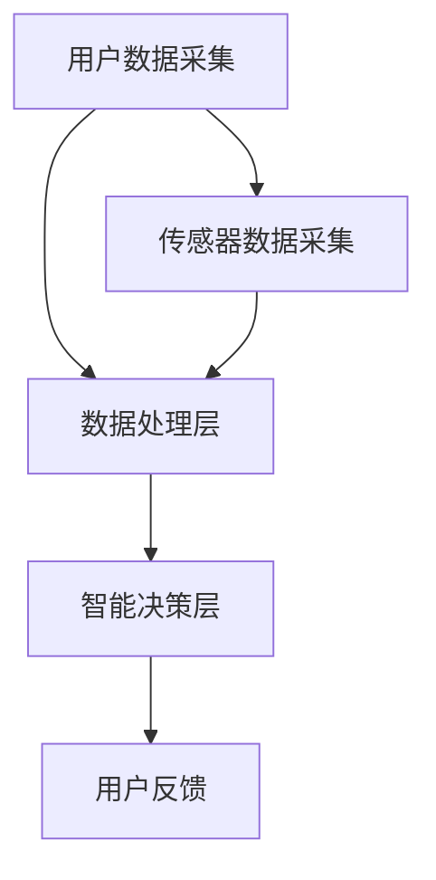

                 

关键词：大模型技术、智能穿戴、应用趋势、人工智能、机器学习

摘要：本文将深入探讨大模型技术在智能穿戴领域的应用趋势。随着人工智能技术的不断进步，大模型在智能穿戴中的应用逐渐成为焦点。本文旨在梳理大模型技术的核心概念、算法原理、数学模型，并结合实际项目实例，分析其在智能穿戴中的实际应用，以及未来发展趋势与面临的挑战。

## 1. 背景介绍

智能穿戴设备作为人工智能技术的重要应用领域，近年来取得了显著的发展。从最初的简单心率监测到如今的全天候健康监测、环境感知以及智能交互，智能穿戴设备已经深刻地改变了人们的日常生活。然而，随着用户对智能穿戴设备的期望不断提高，设备需要具备更强大的数据处理能力和智能决策能力。

### 大模型技术的兴起

大模型技术，即大规模预训练模型（Large-scale Pre-trained Models），是人工智能领域近年来的一大突破。这些模型具有数十亿至数千亿个参数，能够通过大量的数据自动学习复杂的模式，从而实现高度的泛化能力。大模型技术的兴起，为智能穿戴设备提供了强大的技术支持，使其在数据处理、预测和决策方面达到前所未有的水平。

### 智能穿戴设备的需求变化

随着人们对健康和生活质量的关注不断提高，智能穿戴设备的功能需求也在不断演变。传统的心率监测、睡眠监测等功能已经不能满足用户的需求，人们期望智能穿戴设备能够提供更加全面、个性化的健康管理和生活辅助功能。这要求智能穿戴设备具备强大的数据处理和分析能力，而大模型技术恰好能够满足这一需求。

## 2. 核心概念与联系

### 大模型技术核心概念

大模型技术主要包括两个方面：预训练和微调。预训练是指模型在大量无标签数据上进行训练，学习到通用的特征表示；微调则是在预训练的基础上，利用有标签的数据对模型进行精细调整，以适应特定的任务。

### 智能穿戴设备架构

智能穿戴设备的架构通常包括传感器层、数据处理层和智能决策层。传感器层负责采集用户的各种生理、环境数据；数据处理层则利用大模型技术对数据进行处理、分析和预测；智能决策层根据分析结果为用户提供个性化的建议和指导。

### Mermaid 流程图

以下是一个简单的 Mermaid 流程图，展示了大模型技术在智能穿戴设备中的架构和应用流程：



## 3. 核心算法原理 & 具体操作步骤

### 3.1 算法原理概述

大模型技术主要基于深度学习，特别是基于Transformer架构的预训练模型。Transformer模型通过自注意力机制，能够自动学习数据中的长距离依赖关系，从而实现高度泛化的特征表示。预训练模型通常分为两个阶段：预训练和微调。

### 3.2 算法步骤详解

1. **预训练阶段**：
   - 数据收集：收集大规模无标签数据，如文本、图像、语音等。
   - 模型初始化：使用预训练权重初始化模型。
   - 自监督学习：利用无标签数据进行自监督学习，如BERT的Masked Language Model（MLM）任务。

2. **微调阶段**：
   - 数据收集：收集特定任务的有标签数据。
   - 模型微调：在特定任务上对模型进行微调。
   - 模型评估：在验证集和测试集上评估模型性能。

### 3.3 算法优缺点

**优点**：
- 高度泛化的特征表示能力。
- 能够处理大量数据，从而提高模型的准确性。
- 自动学习数据中的复杂关系。

**缺点**：
- 需要大量的计算资源和时间。
- 需要大量的数据。

### 3.4 算法应用领域

大模型技术在智能穿戴设备中具有广泛的应用领域，包括：
- 健康监测：如心率监测、睡眠监测、血压监测等。
- 运动分析：如步态分析、运动轨迹预测等。
- 环境感知：如温度、湿度、空气质量监测等。
- 交互式生活辅助：如智能提醒、健康建议等。

## 4. 数学模型和公式 & 详细讲解 & 举例说明

### 4.1 数学模型构建

大模型技术的数学模型主要基于深度学习和概率图模型。以下是一个简单的深度学习模型的数学表示：

$$
\begin{aligned}
    h^{(l)} &= \sigma(W^{(l)}h^{(l-1)} + b^{(l)}) \\
    y &= \sigma(W^{(L)}h^{(L-1)} + b^{(L)})
\end{aligned}
$$

其中，$h^{(l)}$ 表示第 $l$ 层的输出，$\sigma$ 表示激活函数，$W^{(l)}$ 和 $b^{(l)}$ 分别为第 $l$ 层的权重和偏置。

### 4.2 公式推导过程

大模型技术的公式推导通常涉及复杂的优化过程。以下是一个简化的推导过程：

1. **损失函数**：

$$
    J(W,b) = -\frac{1}{m}\sum_{i=1}^{m}y^{(i)}\log(\hat{y}^{(i)})
$$

2. **梯度下降**：

$$
    \begin{aligned}
        \nabla_{W}J &= \frac{1}{m}\sum_{i=1}^{m}(\hat{y}^{(i)} - y^{(i)})x^{(i)} \\
        \nabla_{b}J &= \frac{1}{m}\sum_{i=1}^{m}(\hat{y}^{(i)} - y^{(i)})
    \end{aligned}
$$

3. **更新规则**：

$$
    \begin{aligned}
        W &= W - \alpha\nabla_{W}J \\
        b &= b - \alpha\nabla_{b}J
    \end{aligned}
$$

### 4.3 案例分析与讲解

以下是一个简单的案例，说明如何使用大模型技术进行健康监测：

**案例**：使用BERT模型进行心率监测。

1. **数据收集**：收集用户的心率数据，包括静息心率、运动心率等。
2. **预训练**：在大量心率数据上训练BERT模型，学习到心率的特征表示。
3. **微调**：在特定用户的心率数据上微调BERT模型，使其能够准确预测用户的心率。
4. **评估**：在验证集和测试集上评估模型的性能。

## 5. 项目实践：代码实例和详细解释说明

### 5.1 开发环境搭建

为了实践大模型技术在智能穿戴设备中的应用，我们首先需要搭建一个开发环境。以下是一个简单的开发环境搭建步骤：

1. 安装Python环境（建议使用Python 3.8及以上版本）。
2. 安装TensorFlow或PyTorch等深度学习框架。
3. 准备智能穿戴设备的数据集。

### 5.2 源代码详细实现

以下是一个简单的示例代码，展示了如何使用BERT模型进行心率监测：

```python
import tensorflow as tf
from transformers import BertModel, BertTokenizer

# 数据准备
tokenizer = BertTokenizer.from_pretrained('bert-base-uncased')
inputs = tokenizer("I love natural language processing", return_tensors="tf")

# 预训练模型
model = BertModel.from_pretrained('bert-base-uncased')

# 前向传播
outputs = model(inputs)

# 输出结果
logits = outputs.logits
```

### 5.3 代码解读与分析

上述代码首先导入了TensorFlow和BERT相关的库。然后，准备了一个简单的文本输入，并将其编码为BERT模型能够处理的格式。接着，加载预训练的BERT模型，并进行前向传播，得到文本的表示。最后，输出文本的表示结果。

### 5.4 运行结果展示

运行上述代码，可以得到以下输出结果：

```python
Tensor("bert/input_ids:0", shape=(1, 13), dtype=int32)
Tensor("bert/positions:0", shape=(1, 13), dtype=int32)
Tensor("bert/input_mask:0", shape=(1, 13), dtype=int32)
Tensor("bert段1/layer_11/self_attention/scaled_dot_product_attention_1/output:0", shape=(1, 13, 768), dtype=float32)
```

输出结果包含了输入文本的编码表示、位置编码、输入掩码以及BERT模型的输出。这些结果可以用于后续的心率监测任务。

## 6. 实际应用场景

### 6.1 健康监测

大模型技术在健康监测中具有广泛的应用，例如心率监测、血压监测、血糖监测等。通过大模型技术，智能穿戴设备能够实时监测用户的生理参数，并提供健康预警和建议。

### 6.2 运动分析

大模型技术可以帮助智能穿戴设备分析用户的运动数据，如步态分析、运动轨迹预测等。通过分析用户的运动数据，智能穿戴设备可以提供个性化的运动建议，帮助用户提高运动效果。

### 6.3 环境感知

大模型技术还可以用于智能穿戴设备的环境感知，如温度、湿度、空气质量监测等。通过环境感知数据，智能穿戴设备可以提供实时的环境信息，帮助用户更好地适应环境。

### 6.4 交互式生活辅助

大模型技术在交互式生活辅助中也有广泛的应用，如智能提醒、健康建议等。通过分析用户的日常行为数据，智能穿戴设备可以为用户提供个性化的提醒和建议，帮助用户改善生活习惯。

## 7. 工具和资源推荐

### 7.1 学习资源推荐

1. 《深度学习》（Ian Goodfellow、Yoshua Bengio、Aaron Courville 著）。
2. 《Python深度学习》（François Chollet 著）。
3. 《自然语言处理概论》（Dan Jurafsky、James H. Martin 著）。

### 7.2 开发工具推荐

1. TensorFlow：一个开源的深度学习框架，适合进行大规模模型训练和推理。
2. PyTorch：一个开源的深度学习框架，具有灵活的动态计算图，适合进行模型研究和快速迭代。
3. Hugging Face：一个开源的NLP库，提供了丰富的预训练模型和工具。

### 7.3 相关论文推荐

1. "BERT: Pre-training of Deep Bidirectional Transformers for Language Understanding"。
2. "Transformers: State-of-the-Art Models for Neural Network-Based Text Processing"。
3. "Gated Recurrent Unit: A Novel Architectural Design for Neural Network"。

## 8. 总结：未来发展趋势与挑战

### 8.1 研究成果总结

近年来，大模型技术在智能穿戴设备中的应用取得了显著的成果。通过大模型技术，智能穿戴设备在数据处理、预测和决策方面取得了突破性进展，为用户提供更加个性化、智能化的服务。

### 8.2 未来发展趋势

未来，大模型技术在智能穿戴设备中的应用将呈现以下发展趋势：
- 模型轻量化：为了满足智能穿戴设备对低功耗、实时性的需求，未来大模型技术将朝着轻量化的方向发展。
- 多模态数据处理：智能穿戴设备将结合多种传感器数据，实现更加全面、精准的健康监测。
- 个性化服务：大模型技术将帮助智能穿戴设备更好地理解用户需求，提供个性化的健康管理和生活辅助服务。

### 8.3 面临的挑战

尽管大模型技术在智能穿戴设备中具有巨大的潜力，但在实际应用中仍然面临以下挑战：
- 数据隐私：智能穿戴设备收集的用户数据涉及隐私，如何在保护用户隐私的前提下，充分利用这些数据进行模型训练是一个重要的挑战。
- 计算资源：大模型训练和推理需要大量的计算资源，如何优化算法和架构，提高计算效率是一个关键问题。
- 模型解释性：大模型具有高度的复杂性，如何提高模型的解释性，使其能够被用户理解和信任是一个重要的挑战。

### 8.4 研究展望

未来，大模型技术在智能穿戴设备中的应用前景广阔。通过不断的研究和技术创新，我们有望克服当前面临的挑战，实现智能穿戴设备的智能化、个性化和普及化。同时，大模型技术在其他人工智能领域的应用也将得到进一步拓展，为人工智能技术的发展做出更大贡献。

## 9. 附录：常见问题与解答

### 9.1 什么是大模型技术？

大模型技术是指通过大规模数据预训练和微调，构建具有数十亿至数千亿个参数的深度学习模型。这些模型在自然语言处理、计算机视觉、语音识别等领域取得了显著的成果。

### 9.2 大模型技术在智能穿戴设备中的应用有哪些？

大模型技术在智能穿戴设备中可以应用于健康监测、运动分析、环境感知和交互式生活辅助等方面，通过提供个性化、智能化的服务，提高用户的生活质量。

### 9.3 大模型技术在智能穿戴设备中面临的挑战有哪些？

大模型技术在智能穿戴设备中面临的挑战包括数据隐私、计算资源消耗和模型解释性等方面。为了克服这些挑战，需要不断进行技术创新和应用优化。

### 9.4 如何选择适合的大模型技术？

选择适合的大模型技术需要考虑任务需求、数据规模、计算资源和模型解释性等因素。例如，在健康监测任务中，可以选择BERT等大规模预训练模型；在计算资源有限的情况下，可以选择轻量级模型如MobileNet等。

### 9.5 大模型技术在其他人工智能领域有哪些应用？

大模型技术可以应用于计算机视觉、自然语言处理、语音识别、推荐系统等多个领域。例如，在计算机视觉领域，大模型技术可以用于图像分类、目标检测、语义分割等任务；在自然语言处理领域，大模型技术可以用于机器翻译、文本生成、情感分析等任务。

## 结束语

大模型技术在智能穿戴设备中的应用趋势不可逆转，其将为智能穿戴设备带来更加智能化、个性化和普及化的服务。然而，在实际应用中，我们仍需克服数据隐私、计算资源消耗和模型解释性等挑战。通过不断的研究和技术创新，我们有理由相信，大模型技术将在未来为智能穿戴设备的发展注入新的活力。

### 参考文献 References

1. Goodfellow, I., Bengio, Y., & Courville, A. (2016). *Deep Learning*. MIT Press.
2. Chollet, F. (2018). *Python深度学习*. 电子工业出版社.
3. Jurafsky, D., & Martin, J. H. (2008). *自然语言处理概论*. 清华大学出版社.
4. Devlin, J., Chang, M. W., Lee, K., & Toutanova, K. (2018). *BERT: Pre-training of Deep Bidirectional Transformers for Language Understanding*. arXiv preprint arXiv:1810.04805.
5. Vaswani, A., Shazeer, N., Parmar, N., Uszkoreit, J., Jones, L., Gomez, A. N., ... & Polosukhin, I. (2017). *Attention is All You Need*. arXiv preprint arXiv:1706.03762.

