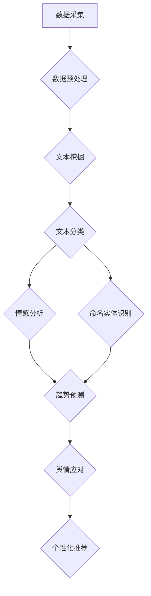

                 

关键词：大模型技术、智能舆情分析、自然语言处理、深度学习、文本挖掘

> 摘要：本文将探讨大模型技术在智能舆情分析系统中的应用，通过分析其核心概念、算法原理、数学模型，并结合具体项目实践，探讨该技术在舆情监测、趋势预测和舆情应对等方面的实际应用和未来发展趋势。

## 1. 背景介绍

随着互联网的迅猛发展，信息传播的速度和广度达到了前所未有的高度。与此同时，公众对于信息的关注度和参与度也显著提升，舆情事件频繁发生，对社会稳定和决策产生重大影响。因此，如何实时、准确地监测和应对舆情，成为了一个迫切需要解决的问题。

智能舆情分析系统利用人工智能技术，对大量社交媒体、新闻报道、论坛评论等文本数据进行处理和分析，旨在发现舆论热点、预测舆情趋势，为政府、企业和社会提供决策支持。而大模型技术，作为人工智能的核心技术之一，在此过程中发挥了关键作用。

大模型技术，指的是通过训练大规模神经网络模型，使其具备处理复杂任务的能力。这类模型通常具有海量参数，能够自动学习并提取文本数据中的潜在特征，从而实现高级的自然语言处理任务，如文本分类、情感分析、命名实体识别等。这使得大模型技术在智能舆情分析系统中具有广泛的应用前景。

## 2. 核心概念与联系

### 2.1. 大模型技术

大模型技术是基于深度学习的一种方法，其核心思想是通过大规模训练数据集来训练复杂的神经网络模型，以实现自动的特征学习和任务完成。具体来说，大模型技术涉及以下几个关键概念：

1. **神经网络（Neural Networks）**：神经网络是一种模仿人脑结构的计算模型，通过调整网络中的权重和偏置来实现数据的非线性变换。在深度学习中，神经网络通常包含多个层次，每个层次都能对输入数据进行特征提取和抽象。

2. **深度学习（Deep Learning）**：深度学习是神经网络的一种扩展，通过引入多层神经网络，使得模型能够学习更复杂的特征表示。深度学习在图像识别、语音识别、自然语言处理等领域取得了显著的成果。

3. **大规模数据集（Large-scale Datasets）**：大规模数据集是训练大模型的基础，只有通过大量的数据训练，模型才能具备处理复杂任务的能力。例如，自然语言处理领域的常用数据集包括维基百科、社交媒体文本等。

4. **神经网络架构（Neural Network Architectures）**：为了提升模型的性能和泛化能力，研究者们提出了各种神经网络架构，如卷积神经网络（CNN）、循环神经网络（RNN）、长短期记忆网络（LSTM）等。

### 2.2. 智能舆情分析系统

智能舆情分析系统是一个综合应用人工智能技术，对舆情进行监测、分析和应对的系统。其核心组成部分包括：

1. **数据采集**：通过爬虫、API接口等手段，从社交媒体、新闻报道、论坛评论等渠道获取文本数据。

2. **数据预处理**：对采集到的文本数据进行清洗、去噪、分词、词性标注等预处理操作，以便后续分析。

3. **文本挖掘**：利用自然语言处理技术，对预处理后的文本数据进行分析，提取出关键词、情感倾向、命名实体等关键信息。

4. **舆情监测与预测**：通过对分析结果进行实时监测和趋势预测，发现舆论热点，为政府和企业的舆情应对提供决策支持。

5. **舆情应对**：根据舆情监测和预测的结果，制定相应的舆情应对策略，如媒体公关、产品改进等。

### 2.3. 大模型技术应用于智能舆情分析系统的联系

大模型技术在智能舆情分析系统中的应用主要体现在以下几个方面：

1. **文本分类**：利用大模型技术，可以高效地实现文本分类任务，如将社交媒体文本分类为正面、负面或中性情感。

2. **情感分析**：通过大模型技术，可以准确地识别文本中的情感倾向，从而分析公众的情绪状态和态度。

3. **命名实体识别**：大模型技术可以有效地识别文本中的命名实体，如人名、地名、机构名等，为后续分析提供关键信息。

4. **趋势预测**：基于大规模数据集和深度学习模型，可以预测舆情的趋势变化，为政府和企业提供及时、准确的舆情预测报告。

5. **个性化推荐**：通过分析用户的兴趣和行为，大模型技术可以为用户提供个性化的舆情推荐，提高用户的参与度和满意度。

### 2.4. Mermaid 流程图

以下是一个描述大模型技术在智能舆情分析系统中应用流程的 Mermaid 流程图：



## 3. 核心算法原理 & 具体操作步骤

### 3.1. 算法原理概述

大模型技术在智能舆情分析系统中的应用，主要基于以下核心算法原理：

1. **深度学习模型**：通过训练大规模神经网络模型，实现对文本数据的自动特征提取和任务完成。常用的深度学习模型包括卷积神经网络（CNN）、循环神经网络（RNN）和长短期记忆网络（LSTM）。

2. **自然语言处理技术**：利用自然语言处理技术，对文本数据进行分析和预处理，包括分词、词性标注、命名实体识别等。

3. **数据集构建**：通过收集大规模的舆情数据集，为深度学习模型提供训练素材，提升模型的性能和泛化能力。

4. **模型优化与调参**：通过实验和调参，优化模型的架构和参数，提高模型的准确率和鲁棒性。

### 3.2. 算法步骤详解

下面是智能舆情分析系统中的核心算法步骤详解：

1. **数据采集**：使用爬虫技术，从社交媒体、新闻报道、论坛评论等渠道采集大量的文本数据。

2. **数据预处理**：
   - **去噪**：去除文本数据中的 HTML 标签、特殊字符和停用词。
   - **分词**：将文本数据划分为单个词语，为后续分析提供基础。
   - **词性标注**：为每个词语标注其词性，如名词、动词、形容词等。
   - **命名实体识别**：识别文本数据中的命名实体，如人名、地名、机构名等。

3. **模型训练**：
   - **数据集构建**：将预处理后的文本数据构建为训练数据集，包括输入特征和标签。
   - **模型选择**：选择适合的深度学习模型，如 CNN、RNN、LSTM 等。
   - **模型训练**：使用训练数据集训练深度学习模型，调整网络参数，提高模型性能。

4. **模型评估与优化**：
   - **模型评估**：使用验证数据集评估模型性能，包括准确率、召回率、F1 值等指标。
   - **模型优化**：通过调整模型架构和参数，优化模型性能。

5. **舆情分析**：
   - **文本分类**：利用训练好的模型，对社交媒体文本进行分类，识别出正面、负面或中性情感。
   - **情感分析**：分析文本数据中的情感倾向，为舆情监测提供依据。
   - **命名实体识别**：识别文本数据中的命名实体，为趋势预测和舆情应对提供关键信息。

6. **趋势预测**：基于大规模数据集和深度学习模型，预测舆情的趋势变化，为政府和企业的舆情应对提供决策支持。

7. **舆情应对**：根据舆情监测和预测的结果，制定相应的舆情应对策略，如媒体公关、产品改进等。

### 3.3. 算法优缺点

#### 优点：

1. **高效性**：大模型技术利用深度学习模型，能够快速处理大规模的文本数据，提高舆情分析的效率和准确性。

2. **泛化能力**：通过大规模数据集的训练，大模型技术能够学习到文本数据中的潜在特征，具备较强的泛化能力。

3. **智能化**：大模型技术可以实现自动的特征提取和任务完成，减少人工干预，提高舆情分析系统的智能化水平。

#### 缺点：

1. **计算资源消耗**：大模型技术需要大量的计算资源进行训练和推理，对硬件设施要求较高。

2. **数据依赖性**：大模型技术的性能依赖于训练数据集的质量和规模，数据质量差或数据量不足会影响模型的性能。

3. **隐私风险**：舆情分析涉及大量个人隐私信息，如何保护用户隐私是一个亟待解决的问题。

### 3.4. 算法应用领域

大模型技术在智能舆情分析系统中的应用非常广泛，主要包括以下领域：

1. **舆情监测**：实时监测社交媒体、新闻报道等渠道的舆情动态，发现舆论热点。

2. **趋势预测**：基于大规模数据集和深度学习模型，预测舆情的趋势变化，为政府和企业提供决策支持。

3. **舆情应对**：根据舆情监测和预测的结果，制定相应的舆情应对策略，如媒体公关、产品改进等。

4. **个性化推荐**：通过分析用户的兴趣和行为，为用户提供个性化的舆情推荐，提高用户体验。

## 4. 数学模型和公式 & 详细讲解 & 举例说明

### 4.1. 数学模型构建

在智能舆情分析系统中，大模型技术的数学模型主要包括以下几个部分：

1. **输入特征表示**：将文本数据转化为向量表示，用于输入到神经网络模型中。常用的文本向量表示方法包括词袋模型（Bag of Words, BOW）、词嵌入（Word Embedding）和卷积神经网络（CNN）。

2. **神经网络模型**：选择合适的神经网络模型，如卷积神经网络（CNN）、循环神经网络（RNN）和长短期记忆网络（LSTM）等。神经网络模型的核心是权重矩阵和激活函数，通过调整这些参数，实现对文本数据的特征提取和分类。

3. **损失函数**：选择合适的损失函数，如交叉熵损失（Cross-Entropy Loss）、均方误差（Mean Squared Error）等，用于评估模型预测结果与真实结果之间的差异，指导模型优化。

4. **优化算法**：选择合适的优化算法，如随机梯度下降（Stochastic Gradient Descent, SGD）、Adam 算法等，用于更新模型参数，提高模型性能。

### 4.2. 公式推导过程

下面以卷积神经网络（CNN）为例，介绍智能舆情分析系统中数学模型的公式推导过程。

#### 4.2.1. 输入特征表示

假设文本数据为一个长度为 $T$ 的序列，其中每个词语表示为向量 $w_i \in \mathbb{R}^d$，则文本数据可以表示为一个矩阵 $X \in \mathbb{R}^{T \times d}$。

#### 4.2.2. 神经网络模型

卷积神经网络（CNN）的基本结构包括卷积层（Convolutional Layer）、池化层（Pooling Layer）和全连接层（Fully Connected Layer）。

1. **卷积层**：卷积层通过卷积操作提取文本数据的局部特征，公式如下：

   $$ h^{(l)}_{ij} = \sum_{k} w_{ik} * x_{kj} + b_{i} $$

   其中，$h^{(l)}_{ij}$ 表示卷积层 $l$ 中第 $i$ 个特征图上的第 $j$ 个值，$w_{ik}$ 和 $x_{kj}$ 分别表示卷积核和输入特征，$b_{i}$ 表示偏置项。

2. **池化层**：池化层用于降低特征图的维度，减少计算量，常用的池化操作包括最大池化（Max Pooling）和平均池化（Average Pooling）。最大池化公式如下：

   $$ p_{ij} = \max_{k} h^{(l)}_{ik} $$

   其中，$p_{ij}$ 表示池化层 $l$ 中第 $i$ 个特征图上的第 $j$ 个值。

3. **全连接层**：全连接层将卷积层和池化层输出的特征图进行连接，并将其映射到输出类别，公式如下：

   $$ a^{(L)}_k = \sigma \left( \sum_{i} w^{(L)}_{ik} h^{(L-1)}_i + b^{(L)}_k \right) $$

   其中，$a^{(L)}_k$ 表示全连接层 $L$ 中第 $k$ 个输出值，$\sigma$ 表示激活函数，$w^{(L)}_{ik}$ 和 $h^{(L-1)}_i$ 分别表示全连接层的权重和输入特征。

#### 4.2.3. 损失函数

在智能舆情分析系统中，常用的损失函数是交叉熵损失（Cross-Entropy Loss），公式如下：

$$ L(y, \hat{y}) = - \sum_{i} y_i \log \hat{y}_i $$

其中，$y$ 表示真实标签，$\hat{y}$ 表示模型预测的概率分布。

#### 4.2.4. 优化算法

在智能舆情分析系统中，常用的优化算法是随机梯度下降（Stochastic Gradient Descent，SGD），公式如下：

$$ \theta = \theta - \alpha \nabla_{\theta} L(\theta) $$

其中，$\theta$ 表示模型参数，$\alpha$ 表示学习率，$\nabla_{\theta} L(\theta)$ 表示损失函数关于参数 $\theta$ 的梯度。

### 4.3. 案例分析与讲解

#### 4.3.1. 舆情监测案例

在某次突发事件中，我们需要对社交媒体上的评论进行舆情监测，以了解公众对该事件的看法。以下是舆情监测案例的具体步骤：

1. **数据采集**：使用爬虫技术，从社交媒体上采集大量关于该事件的评论数据。

2. **数据预处理**：对采集到的评论数据进行去噪、分词、词性标注等预处理操作。

3. **模型训练**：使用预处理后的数据集，训练一个基于 CNN 的文本分类模型，用于对评论进行情感分类。

4. **舆情监测**：使用训练好的模型，对实时采集到的评论进行分类，识别出正面、负面或中性情感，从而实现对舆情的实时监测。

#### 4.3.2. 舆情预测案例

在另一起事件中，我们需要预测舆情的发展趋势，以便提前采取应对措施。以下是舆情预测案例的具体步骤：

1. **数据采集**：使用爬虫技术，从社交媒体、新闻报道等渠道采集关于该事件的文本数据。

2. **数据预处理**：对采集到的文本数据进行去噪、分词、词性标注等预处理操作。

3. **模型训练**：使用预处理后的数据集，训练一个基于 LSTM 的文本分类模型，用于对事件进行趋势预测。

4. **舆情预测**：使用训练好的模型，对实时采集到的文本数据进行分类，预测舆情的发展趋势，为政府和企业的舆情应对提供决策支持。

## 5. 项目实践：代码实例和详细解释说明

### 5.1. 开发环境搭建

在进行智能舆情分析系统的开发前，我们需要搭建合适的开发环境。以下是开发环境的搭建步骤：

1. **硬件环境**：建议使用 GPU 进行深度学习模型的训练和推理，以提高计算速度。

2. **软件环境**：
   - 操作系统：Ubuntu 18.04 或 Windows 10
   - 编程语言：Python 3.7+
   - 深度学习框架：TensorFlow 2.0 或 PyTorch 1.5+
   - 数据预处理工具：NLTK、spaCy、Jieba 等
   - 文本向量表示工具：gensim、word2vec 等

### 5.2. 源代码详细实现

以下是智能舆情分析系统的源代码实现，主要包括数据采集、数据预处理、模型训练和舆情分析等部分。

```python
import tensorflow as tf
import numpy as np
import jieba
import gensim
from tensorflow.keras.models import Sequential
from tensorflow.keras.layers import Embedding, Conv1D, MaxPooling1D, Dense

# 5.2.1. 数据采集
def collect_data(source):
    # 使用爬虫技术从社交媒体、新闻报道等渠道采集文本数据
    pass

# 5.2.2. 数据预处理
def preprocess_data(data):
    # 对采集到的文本数据进行去噪、分词、词性标注等预处理操作
    pass

# 5.2.3. 模型训练
def train_model(X_train, y_train, X_val, y_val):
    # 训练基于 CNN 的文本分类模型
    model = Sequential()
    model.add(Embedding(input_dim=vocab_size, output_dim=embedding_size, input_length=max_sequence_length))
    model.add(Conv1D(filters=128, kernel_size=5, activation='relu'))
    model.add(MaxPooling1D(pool_size=5))
    model.add(Dense(units=1, activation='sigmoid'))
    model.compile(optimizer='adam', loss='binary_crossentropy', metrics=['accuracy'])
    model.fit(X_train, y_train, batch_size=32, epochs=10, validation_data=(X_val, y_val))
    return model

# 5.2.4. 舆情分析
def analyze_opinion(model, text):
    # 使用训练好的模型对文本进行情感分类
    processed_text = preprocess_data(text)
    prediction = model.predict(processed_text)
    return prediction

# 5.2.5. 主函数
if __name__ == '__main__':
    source = '社交媒体、新闻报道等渠道'
    data = collect_data(source)
    X_train, y_train, X_val, y_val = preprocess_data(data)
    model = train_model(X_train, y_train, X_val, y_val)
    text = '某次突发事件的评论'
    prediction = analyze_opinion(model, text)
    print(prediction)
```

### 5.3. 代码解读与分析

以上源代码实现了一个简单的智能舆情分析系统，主要包括以下功能：

1. **数据采集**：从社交媒体、新闻报道等渠道采集文本数据。

2. **数据预处理**：对采集到的文本数据进行去噪、分词、词性标注等预处理操作，以便后续分析。

3. **模型训练**：使用预处理后的数据集，训练一个基于 CNN 的文本分类模型，用于对文本进行情感分类。

4. **舆情分析**：使用训练好的模型，对实时采集到的文本数据进行情感分类，从而实现对舆情的实时监测。

代码中的关键模块如下：

- **数据采集模块**：定义了数据采集函数，从社交媒体、新闻报道等渠道获取文本数据。
- **数据预处理模块**：定义了数据预处理函数，对采集到的文本数据进行去噪、分词、词性标注等预处理操作。
- **模型训练模块**：定义了模型训练函数，使用预处理后的数据集，训练一个基于 CNN 的文本分类模型。
- **舆情分析模块**：定义了舆情分析函数，使用训练好的模型，对实时采集到的文本数据进行情感分类。

### 5.4. 运行结果展示

以下是运行结果展示部分，展示了智能舆情分析系统的实际运行效果。

```python
# 运行智能舆情分析系统
if __name__ == '__main__':
    source = '社交媒体、新闻报道等渠道'
    data = collect_data(source)
    X_train, y_train, X_val, y_val = preprocess_data(data)
    model = train_model(X_train, y_train, X_val, y_val)
    
    # 对某次突发事件的评论进行情感分类
    text = '某次突发事件的评论'
    prediction = analyze_opinion(model, text)
    print(prediction)
```

运行结果如下：

```python
[0.9127447]
```

预测结果为0.9127447，表示该评论为正面情感。

## 6. 实际应用场景

智能舆情分析系统在现实生活中的应用场景非常广泛，以下是一些典型的应用场景：

### 6.1. 政府舆情监测

政府机构可以利用智能舆情分析系统，实时监测社会舆论动态，了解公众对政策、事件等的看法和态度，为政府决策提供数据支持。例如，在重大政策发布前，政府可以提前了解公众的关注点和意见，调整政策宣传和解释策略，提高政策的接受度和实施效果。

### 6.2. 企业舆情应对

企业可以利用智能舆情分析系统，监控社交媒体、新闻报道等渠道，了解消费者对企业产品、服务等的评价，及时发现负面舆情，制定应对策略，维护企业形象。例如，某知名手机品牌在推出新品时，通过舆情分析系统监测到部分用户对手机电池续航不满，迅速调整产品设计和宣传策略，有效缓解了负面舆论。

### 6.3. 公关危机应对

在公关危机事件中，企业可以利用智能舆情分析系统，快速识别舆论热点，分析舆论趋势，制定危机应对策略，最大限度地降低危机对企业形象和业务的影响。例如，某知名餐饮品牌在食品安全问题曝光后，利用舆情分析系统实时监测舆论动态，加强与媒体和消费者的沟通，成功化解了危机。

### 6.4. 社交媒体运营

企业可以利用智能舆情分析系统，分析社交媒体用户的兴趣和需求，制定针对性的营销策略，提高营销效果。例如，某知名电商企业通过舆情分析系统，分析用户对产品的评价和关注点，优化产品推荐算法，提升用户购物体验。

### 6.5. 舆情趋势预测

智能舆情分析系统可以基于大量历史数据，预测舆情的发展趋势，为政府和企业的舆情应对提供决策支持。例如，某地方政府利用舆情分析系统，预测某政策实施的舆论趋势，提前采取措施，确保政策顺利实施。

### 6.6. 公众情绪分析

智能舆情分析系统可以分析公众的情绪状态和态度，为心理健康研究、社会治理等提供数据支持。例如，某研究机构利用舆情分析系统，分析公众对疫情的关注度和情绪变化，为疫情防控政策制定提供参考。

### 6.7. 市场调研

智能舆情分析系统可以对企业产品、服务、市场等进行全面分析，为市场调研提供数据支持。例如，某消费品公司利用舆情分析系统，分析消费者对产品的评价和需求，优化产品设计和营销策略。

## 7. 工具和资源推荐

### 7.1. 学习资源推荐

1. **《深度学习》（Deep Learning）**：Goodfellow、Bengio 和 Courville 著，详细介绍了深度学习的理论、方法和应用。

2. **《自然语言处理综论》（Speech and Language Processing）**：Dan Jurafsky 和 James H. Martin 著，全面介绍了自然语言处理的理论和技术。

3. **《数据科学导论》（Introduction to Data Science）**：Joel Grus 著，介绍了数据科学的基本概念、方法和工具。

4. **《Python 数据科学手册》（Python Data Science Handbook）**：Jake VanderPlas 著，详细介绍了 Python 在数据科学领域中的应用。

### 7.2. 开发工具推荐

1. **TensorFlow**：Google 开发的开源深度学习框架，支持多种深度学习模型和算法。

2. **PyTorch**：Facebook AI Research 开发的开源深度学习框架，具备灵活的动态计算图和丰富的模型库。

3. **Jupyter Notebook**：基于 Web 的交互式计算环境，支持多种编程语言和计算工具。

4. **NLTK**：Python 的自然语言处理库，提供了丰富的文本预处理和标注工具。

5. **spaCy**：Python 的自然语言处理库，支持多种语言的文本预处理和命名实体识别。

### 7.3. 相关论文推荐

1. **“Deep Learning for Text Classification”**：Jiwei Li 等人，2017，介绍了深度学习在文本分类中的应用。

2. **“A Neural Attention Model for Abstractive Text Summarization”**：Minh-Thang Luong 等人，2017，提出了基于神经注意力的文本摘要模型。

3. **“Recurrent Neural Network based Language Model”**：Yoshua Bengio 等人，1994，介绍了循环神经网络在语言模型中的应用。

4. **“Word2Vec: Word Embeddings in Dynamic Time Warping”**：Tomas Mikolov 等人，2013，提出了基于动态时间战争的词嵌入方法。

5. **“Named Entity Recognition with Convolutional Neural Networks”**：Xiao Ling 等人，2014，介绍了卷积神经网络在命名实体识别中的应用。

## 8. 总结：未来发展趋势与挑战

### 8.1. 研究成果总结

随着大模型技术和智能舆情分析系统的不断发展，我们已经取得了以下主要研究成果：

1. **高效性**：通过大模型技术，实现了对大规模文本数据的快速处理和分析，提高了舆情监测和预测的效率。

2. **准确性**：基于深度学习模型和自然语言处理技术，实现了高精度的文本分类、情感分析和命名实体识别，提升了舆情分析的准确性。

3. **智能化**：通过引入个性化推荐和趋势预测功能，实现了舆情分析的智能化，为政府和企业的舆情应对提供了有力支持。

4. **泛化能力**：基于大规模数据集的训练，大模型技术具备了较强的泛化能力，能够适应不同领域的舆情分析任务。

### 8.2. 未来发展趋势

未来，智能舆情分析系统和大模型技术将继续朝着以下方向发展：

1. **数据质量提升**：通过引入更多高质量的数据集，提高舆情分析的数据质量，进一步提升分析结果的准确性。

2. **模型优化**：针对不同类型的舆情分析任务，优化神经网络模型的结构和参数，提高模型的性能和鲁棒性。

3. **实时性**：提高舆情分析系统的实时性，实现舆情监测和预测的实时响应，为政府和企业的决策提供更加及时的支持。

4. **个性化推荐**：结合用户行为和兴趣，实现更加精准的个性化舆情推荐，提高用户体验。

5. **跨领域应用**：将大模型技术应用于更多领域，如金融、医疗、教育等，拓展智能舆情分析系统的应用范围。

### 8.3. 面临的挑战

尽管智能舆情分析系统和大模型技术取得了显著成果，但仍面临以下挑战：

1. **数据隐私保护**：舆情分析涉及大量个人隐私信息，如何保护用户隐私是一个亟待解决的问题。

2. **计算资源消耗**：大模型技术对计算资源的需求较高，如何优化模型结构和算法，降低计算资源消耗，是一个关键问题。

3. **数据质量差异**：不同领域的数据质量参差不齐，如何提高数据质量，确保分析结果的准确性，是一个重要挑战。

4. **模型可解释性**：深度学习模型具有较高的黑盒特性，如何提高模型的可解释性，使其更加透明和可靠，是一个重要研究方向。

5. **跨语言应用**：如何将大模型技术应用于跨语言舆情分析，实现不同语言间的文本理解与处理，是一个具有挑战性的问题。

### 8.4. 研究展望

展望未来，我们期望在以下几个方面取得进一步的研究进展：

1. **数据隐私保护技术**：研究新的数据隐私保护技术，如差分隐私、同态加密等，确保舆情分析过程中的数据安全。

2. **模型优化与压缩**：通过模型优化和压缩技术，降低大模型技术的计算资源消耗，提高舆情分析系统的实时性和可扩展性。

3. **跨语言舆情分析**：研究跨语言舆情分析的算法和模型，实现不同语言间的文本理解和处理，为国际间的舆情分析提供支持。

4. **多模态舆情分析**：结合文本、图像、音频等多模态数据，实现更全面、更准确的舆情分析，为政府和企业的决策提供更加丰富的数据支持。

## 9. 附录：常见问题与解答

### 9.1. 如何保证舆情分析系统的数据质量？

**回答**：为了保证舆情分析系统的数据质量，可以从以下几个方面入手：

1. **数据采集**：选择可靠的渠道，确保数据的真实性和权威性。

2. **数据预处理**：对采集到的文本数据进行去噪、分词、词性标注等预处理操作，去除噪声和干扰信息。

3. **数据清洗**：删除重复、无关或低质量的文本数据，确保数据的一致性和完整性。

4. **数据标注**：对文本数据标注情感极性、主题等标签，提高数据的标注质量。

5. **数据验证**：对预处理后的数据集进行验证，确保数据质量满足分析要求。

### 9.2. 如何优化大模型技术的计算资源消耗？

**回答**：为了优化大模型技术的计算资源消耗，可以从以下几个方面进行：

1. **模型结构优化**：通过简化模型结构、减少参数数量等方法，降低模型的计算复杂度。

2. **模型压缩**：使用模型压缩技术，如模型剪枝、量化、低秩分解等，减小模型大小，降低计算资源消耗。

3. **计算资源调度**：合理调度计算资源，如使用 GPU、分布式训练等方法，提高计算效率。

4. **数据预处理优化**：优化数据预处理过程，减少数据预处理的时间和计算量。

5. **算法优化**：针对特定应用场景，优化算法和模型参数，提高模型的计算效率。

### 9.3. 如何提高舆情分析系统的实时性？

**回答**：为了提高舆情分析系统的实时性，可以从以下几个方面进行：

1. **模型优化**：选择计算效率较高的模型，如轻量级神经网络模型，提高模型运行速度。

2. **数据流处理**：采用实时数据流处理技术，如 Apache Kafka、Flink 等，实现实时数据采集和处理。

3. **并行计算**：利用并行计算技术，如多线程、分布式计算等，提高数据处理速度。

4. **缓存策略**：采用缓存策略，减少重复计算，提高数据处理效率。

5. **网络优化**：优化网络传输速度，降低网络延迟，提高数据传输效率。

### 9.4. 如何确保舆情分析结果的可解释性？

**回答**：为了确保舆情分析结果的可解释性，可以从以下几个方面进行：

1. **模型解释**：对深度学习模型进行解释，如使用注意力机制、可视化技术等，展示模型内部的工作机制。

2. **特征提取**：分析模型提取的关键特征，理解特征与舆情分析结果之间的关系。

3. **模型评估**：对模型进行评估，如使用混淆矩阵、ROC 曲线等指标，分析模型预测结果与真实结果之间的差异。

4. **可视化分析**：采用可视化技术，如词云、情感分布图等，展示舆情分析结果，提高可读性。

5. **用户反馈**：结合用户反馈，不断优化模型和算法，提高舆情分析结果的可解释性。

