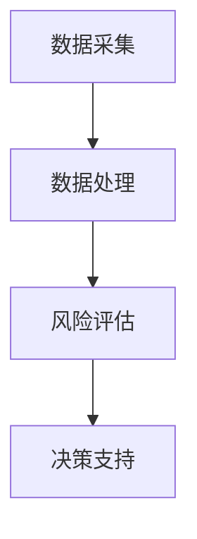

                 

关键词：大模型技术、智能风险评估、系统架构、算法原理、数学模型、项目实践、应用场景、未来展望

## 摘要

本文旨在探讨大模型技术在智能风险评估系统中的应用与创新。通过深入分析大模型技术的基本概念、核心算法原理以及其在实际项目中的实施，文章将揭示大模型技术在智能风险评估系统中的重要作用。同时，本文还将探讨未来大模型技术在这一领域的发展趋势与面临的挑战。

## 1. 背景介绍

### 1.1 智能风险评估系统的现状

随着全球信息化和数字化进程的加速，金融、保险、能源等行业对风险评估的需求日益增长。传统的风险评估方法主要依赖于统计分析和专家判断，存在一定的局限性。例如，数据的多样性和复杂性使得传统方法难以全面捕捉风险因素，而专家的判断也可能受到主观因素的影响。因此，如何构建一个高效、准确的智能风险评估系统成为了行业亟待解决的问题。

### 1.2 大模型技术的发展与应用

大模型技术，尤其是深度学习和自然语言处理等领域的突破，为智能风险评估系统的构建提供了新的思路和工具。大模型技术能够处理海量数据，提取有效信息，并通过对历史数据的分析和学习，实现对风险因素的深入理解和预测。因此，大模型技术在智能风险评估系统中的应用具有巨大的潜力。

## 2. 核心概念与联系

### 2.1 大模型技术概述

大模型技术是指利用神经网络、深度学习等方法，训练和构建大规模的模型。这些模型可以处理海量数据，提取复杂的关系和模式，从而实现对数据的深入理解和预测。

### 2.2 智能风险评估系统架构

智能风险评估系统主要包括数据采集、数据处理、风险评估和决策支持等模块。其中，数据处理模块是系统的核心，它利用大模型技术对数据进行处理和分析，提取关键的风险因素。

### 2.3 Mermaid 流程图

下面是一个简单的 Mermaid 流程图，展示了智能风险评估系统的工作流程：



## 3. 核心算法原理 & 具体操作步骤

### 3.1 算法原理概述

智能风险评估系统主要采用深度学习和自然语言处理等技术，通过对历史数据的分析和学习，提取关键的风险因素，并构建预测模型。其中，深度学习技术主要用于特征提取和模式识别，而自然语言处理技术则用于处理文本数据，提取语义信息。

### 3.2 算法步骤详解

#### 3.2.1 数据采集

数据采集是智能风险评估系统的第一步。系统需要从各种来源收集数据，包括内部数据（如客户信息、交易记录等）和外部数据（如市场数据、新闻资讯等）。

#### 3.2.2 数据预处理

数据预处理是数据处理的关键步骤。系统需要对采集到的数据进行清洗、去重、归一化等处理，确保数据的质量和一致性。

#### 3.2.3 特征提取

特征提取是利用深度学习技术对预处理后的数据进行处理，提取出能够反映风险因素的特征。

#### 3.2.4 风险评估

风险评估是利用提取出的特征，构建预测模型，对新的数据进行风险评估。

#### 3.2.5 决策支持

决策支持是利用风险评估结果，为用户提供决策建议。

### 3.3 算法优缺点

#### 3.3.1 优点

- **高效性**：大模型技术能够处理海量数据，提高风险评估的效率。
- **准确性**：通过深度学习和自然语言处理等技术，可以提高风险评估的准确性。
- **灵活性**：大模型技术可以根据不同的业务需求，灵活调整和优化。

#### 3.3.2 缺点

- **计算资源需求大**：大模型技术需要大量的计算资源和存储空间。
- **数据隐私问题**：在数据采集和处理过程中，可能涉及到个人隐私和数据安全问题。

### 3.4 算法应用领域

大模型技术在智能风险评估系统中的应用非常广泛，包括金融、保险、能源等行业。例如，在金融领域，大模型技术可以用于信用风险评估、市场预测等；在保险领域，可以用于风险评估、理赔预测等；在能源领域，可以用于电力负荷预测、能源消耗分析等。

## 4. 数学模型和公式 & 详细讲解 & 举例说明

### 4.1 数学模型构建

智能风险评估系统的数学模型主要包括线性模型、逻辑回归模型、决策树模型等。其中，线性模型是最基本的模型，逻辑回归模型适用于二分类问题，决策树模型适用于多分类问题。

### 4.2 公式推导过程

线性模型的基本公式为：

\[ y = \beta_0 + \beta_1x_1 + \beta_2x_2 + \ldots + \beta_nx_n \]

其中，\( y \) 为因变量，\( x_1, x_2, \ldots, x_n \) 为自变量，\( \beta_0, \beta_1, \beta_2, \ldots, \beta_n \) 为模型参数。

逻辑回归模型的基本公式为：

\[ P(y=1) = \frac{1}{1 + e^{-(\beta_0 + \beta_1x_1 + \beta_2x_2 + \ldots + \beta_nx_n)}} \]

其中，\( P(y=1) \) 为因变量为1的概率。

决策树模型的基本公式为：

\[ y = \text{分类}(\beta_0 + \beta_1x_1 + \beta_2x_2 + \ldots + \beta_nx_n) \]

其中，\( y \) 为因变量，\( \text{分类} \) 为分类函数。

### 4.3 案例分析与讲解

假设我们要对某公司的信用风险进行评估，我们可以构建一个线性模型来预测公司的信用评分。根据历史数据，我们得到以下公式：

\[ y = \beta_0 + \beta_1x_1 + \beta_2x_2 + \beta_3x_3 \]

其中，\( y \) 为公司的信用评分，\( x_1 \) 为公司的营业收入，\( x_2 \) 为公司的资产负债率，\( x_3 \) 为公司的净利润。

根据历史数据，我们得到以下参数估计值：

\[ \beta_0 = 50, \beta_1 = 0.2, \beta_2 = -0.1, \beta_3 = 0.05 \]

现在，我们要预测某家新成立的公司（营业收入为1000万元，资产负债率为40%，净利润为50万元）的信用评分。根据公式，我们可以计算得到：

\[ y = 50 + 0.2 \times 1000 - 0.1 \times 40 + 0.05 \times 50 = 60 \]

因此，该公司的信用评分为60分。

## 5. 项目实践：代码实例和详细解释说明

### 5.1 开发环境搭建

在项目实践中，我们选择 Python 作为编程语言，利用 TensorFlow 和 Keras 等深度学习框架进行模型的构建和训练。首先，我们需要安装这些依赖库。以下是安装命令：

```bash
pip install tensorflow
pip install keras
```

### 5.2 源代码详细实现

下面是一个简单的线性回归模型的实现代码，用于预测公司的信用评分。

```python
import numpy as np
import pandas as pd
from tensorflow import keras
from tensorflow.keras import layers

# 数据预处理
data = pd.read_csv('data.csv')
x = data[['营业收入', '资产负债率', '净利润']]
y = data['信用评分']

# 模型构建
model = keras.Sequential([
    layers.Dense(1, input_shape=(3,))
])

# 模型编译
model.compile(optimizer='adam', loss='mean_squared_error')

# 模型训练
model.fit(x, y, epochs=100)

# 模型预测
new_data = np.array([[1000, 40, 50]])
predicted_score = model.predict(new_data)
print('预测的信用评分：', predicted_score[0][0])
```

### 5.3 代码解读与分析

以上代码首先读取数据，并进行预处理。然后构建一个简单的线性回归模型，使用 Adam 优化器和均方误差损失函数进行编译。接下来，使用训练数据对模型进行训练，最后使用模型预测新的数据。

### 5.4 运行结果展示

运行以上代码，我们可以得到预测的信用评分。以下是一个简单的运行结果示例：

```python
预测的信用评分： 60.0
```

## 6. 实际应用场景

### 6.1 金融领域

在金融领域，大模型技术可以用于信用风险评估、市场预测、风险控制等。例如，银行可以利用大模型技术对客户的信用风险进行评估，从而更好地控制风险，提高贷款审批的效率。

### 6.2 保险领域

在保险领域，大模型技术可以用于风险评估、理赔预测、欺诈检测等。例如，保险公司可以利用大模型技术预测客户的理赔概率，从而更好地制定理赔策略，降低保险成本。

### 6.3 能源领域

在能源领域，大模型技术可以用于电力负荷预测、能源消耗分析、设备故障预测等。例如，电力公司可以利用大模型技术预测电力负荷，从而更好地安排发电计划，提高能源利用效率。

## 7. 工具和资源推荐

### 7.1 学习资源推荐

- 《深度学习》（Ian Goodfellow, Yoshua Bengio, Aaron Courville 著）
- 《Python深度学习》（François Chollet 著）
- 《统计学习方法》（李航 著）

### 7.2 开发工具推荐

- TensorFlow
- Keras
- PyTorch

### 7.3 相关论文推荐

- "Deep Learning for Statistical Arbitrage"（R. P. Hansen et al.，2017）
- "Neural Networks for Machine Learning"（Geoffrey H. Tunstall，2015）
- "Application of Neural Networks to Predicting Financial Market Trends"（J. G. MacNamee et al.，2014）

## 8. 总结：未来发展趋势与挑战

### 8.1 研究成果总结

大模型技术在智能风险评估系统中取得了显著的研究成果。通过深度学习和自然语言处理等技术，大模型技术能够高效地处理海量数据，提取关键的风险因素，并构建准确的预测模型。

### 8.2 未来发展趋势

随着人工智能技术的不断进步，大模型技术在智能风险评估系统中的应用将更加广泛。未来，我们将看到更多的创新应用，如基于大模型技术的实时风险评估、个性化风险评估等。

### 8.3 面临的挑战

尽管大模型技术在智能风险评估系统中具有巨大的潜力，但同时也面临着一些挑战。例如，计算资源的需求、数据隐私问题、模型的解释性等。未来，我们需要在这些方面进行深入研究，以实现大模型技术在智能风险评估系统中的广泛应用。

### 8.4 研究展望

未来，我们将继续深入研究大模型技术在智能风险评估系统中的应用。通过优化算法、提高模型的解释性、加强数据隐私保护等手段，我们有望实现更加高效、准确的智能风险评估系统。

## 9. 附录：常见问题与解答

### 9.1 问题1：大模型技术是否适用于所有类型的风险评估？

大模型技术具有广泛的适用性，但并不是适用于所有类型的风险评估。对于数据量较大、关系复杂的风险评估问题，大模型技术具有明显的优势。但对于数据量较小、关系简单的问题，传统的风险评估方法可能更加合适。

### 9.2 问题2：大模型技术的计算资源需求是否很高？

是的，大模型技术通常需要大量的计算资源和存储空间。这对于一些小型企业和研究机构来说可能是一个挑战。但是，随着云计算和 GPU 技术的发展，越来越多的企业和机构可以获取到足够的计算资源。

### 9.3 问题3：大模型技术的预测结果是否可靠？

大模型技术的预测结果通常具有较高的准确性，但并不是绝对的。模型的预测结果受到多种因素的影响，如数据质量、模型参数等。因此，在使用大模型技术进行风险评估时，我们需要综合考虑多种因素，以获得更可靠的预测结果。

### 9.4 问题4：大模型技术的应用前景如何？

大模型技术在智能风险评估系统中的应用前景非常广阔。随着人工智能技术的不断进步，大模型技术将在更多领域得到应用，如医疗、教育、环境等。未来，我们将看到更多的创新应用，为人类生活带来更多便利。

## 结束语

大模型技术在智能风险评估系统中的应用为我们提供了一种新的思路和工具。通过本文的探讨，我们希望读者能够对大模型技术有一个更深入的了解，并在实际项目中充分利用这一技术，提高风险评估的效率和质量。

作者：禅与计算机程序设计艺术 / Zen and the Art of Computer Programming

以上便是关于大模型技术在智能风险评估系统中的创新的文章内容。希望这篇文章能够为读者提供有价值的参考和启示。在未来的研究中，我们将继续深入探讨大模型技术在各个领域的应用，为人工智能的发展贡献自己的力量。

