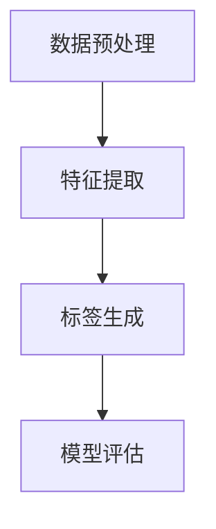

                 

## 1. 背景介绍

随着互联网技术的迅猛发展和电子商务行业的蓬勃发展，电商平台已经成为现代商业中不可或缺的一部分。然而，随着商品数量的不断增加，如何有效地管理和推荐商品成为电商平台面临的一大挑战。商品标签是电商平台用于描述和分类商品的重要工具，它有助于用户快速找到所需商品，提高用户体验和平台销售额。因此，商品标签的生成质量对电商平台具有重要意义。

传统的商品标签生成方法主要依赖于人工干预和简单的规则匹配。然而，随着大数据和人工智能技术的兴起，大模型技术逐渐成为一种新的解决方案。大模型技术利用深度学习算法，通过分析海量数据，自动提取商品的潜在特征，从而生成更加准确和丰富的标签。这种技术不仅提高了标签生成的效率，还显著提升了标签的质量和多样性。

本文旨在探讨大模型技术在电商平台商品标签生成中的应用，分析其核心算法原理、具体操作步骤、数学模型和公式，以及实际应用案例。通过本文的介绍，读者将能够了解大模型技术在电商平台商品标签生成中的潜力和优势，为电商平台的发展提供新的思路。

## 2. 核心概念与联系

### 2.1 大模型技术概述

大模型技术（Large Model Technology）是一种利用深度学习算法对大规模数据进行训练和预测的技术。与传统的机器学习方法相比，大模型技术具有更强的表示能力和泛化能力，能够处理更复杂的任务和数据集。

大模型技术主要包括以下几个方面：

1. **模型架构**：大模型通常采用深度神经网络（DNN）架构，通过多层神经元的组合，实现对数据的层次化表示和抽象。
2. **大规模数据训练**：大模型需要大量的训练数据来进行模型训练，这些数据可以是结构化的，如数据库，也可以是非结构化的，如图像、文本和音频。
3. **模型优化**：大模型训练过程中，需要不断调整模型的参数，以优化模型的性能。这通常通过梯度下降（Gradient Descent）等优化算法实现。
4. **模型部署**：训练完成的大模型可以部署到生产环境中，用于实时预测和决策。

### 2.2 商品标签生成

商品标签生成（Product Tag Generation）是指根据商品的属性和特征，自动生成用于描述和分类商品的标签。这些标签可以用于电商平台的商品搜索、推荐和分类。

商品标签生成的主要步骤包括：

1. **数据预处理**：对原始商品数据进行清洗、去重和处理，提取出有用的特征信息。
2. **特征提取**：利用深度学习算法，从商品数据中提取出高维的、抽象的特征向量。
3. **标签生成**：根据特征向量，利用分类算法生成商品的标签。

### 2.3 Mermaid 流程图

以下是一个简单的Mermaid流程图，展示了大模型技术在商品标签生成中的应用流程：



**A. 数据预处理**：对原始商品数据进行清洗、去重和处理，提取出有用的特征信息。

**B. 特征提取**：利用深度学习算法，从商品数据中提取出高维的、抽象的特征向量。

**C. 标签生成**：根据特征向量，利用分类算法生成商品的标签。

**D. 模型评估**：对生成的标签进行评估，以验证模型的性能。

## 3. 核心算法原理 & 具体操作步骤

### 3.1 算法原理概述

大模型技术在商品标签生成中的核心算法主要是基于深度学习（Deep Learning）的神经网络模型。深度学习是一种基于多层神经网络的结构，通过层层提取数据中的特征，实现对复杂任务的建模。在商品标签生成中，深度学习模型可以自动从海量商品数据中学习到商品的潜在特征，并利用这些特征生成标签。

主要算法包括：

1. **卷积神经网络（CNN）**：卷积神经网络是一种常用的深度学习模型，特别适用于处理图像数据。通过卷积操作，CNN可以提取图像中的局部特征，并逐步形成全局特征。
2. **循环神经网络（RNN）**：循环神经网络是一种适用于序列数据的深度学习模型。通过循环连接，RNN可以处理长序列数据，并保持序列中的时间信息。
3. **长短时记忆网络（LSTM）**：长短时记忆网络是RNN的一种改进模型，通过引入门控机制，可以有效地避免RNN中的梯度消失和梯度爆炸问题。

### 3.2 算法步骤详解

以下是大模型技术在商品标签生成的具体操作步骤：

1. **数据收集和预处理**：收集电商平台上的商品数据，包括商品名称、描述、分类、价格等。对数据进行清洗、去重和处理，提取出有用的特征信息。

2. **特征提取**：利用深度学习算法，对预处理后的商品数据进行特征提取。具体步骤如下：

    - **输入层**：将商品数据输入到模型中，作为输入层。
    - **卷积层**：通过卷积操作，提取商品数据中的局部特征。卷积层可以包含多个卷积核，每个卷积核提取不同的特征。
    - **池化层**：对卷积层输出的特征进行池化操作，以减少数据的维度，提高模型的泛化能力。
    - **全连接层**：将池化层输出的特征向量输入到全连接层，进行线性变换，得到商品的特征表示。

3. **标签生成**：根据提取到的商品特征，利用分类算法生成商品的标签。具体步骤如下：

    - **分类层**：将商品特征输入到分类层，通过softmax函数输出每个标签的概率分布。
    - **标签预测**：根据输出的概率分布，选择概率最大的标签作为商品的预测标签。

4. **模型评估**：对生成的标签进行评估，以验证模型的性能。常用的评估指标包括准确率、召回率、F1值等。

### 3.3 算法优缺点

**优点**：

- **高效性**：大模型技术利用深度学习算法，可以在短时间内处理大量的商品数据，生成准确的标签。
- **灵活性**：深度学习模型可以根据不同的任务和数据特点，调整模型结构和参数，适应不同的标签生成需求。
- **可扩展性**：大模型技术可以方便地扩展到其他领域，如商品推荐、用户行为分析等。

**缺点**：

- **计算资源消耗**：大模型训练需要大量的计算资源，对硬件设备要求较高。
- **数据依赖性**：大模型性能依赖于训练数据的数量和质量，数据质量较差时，模型性能会受到影响。
- **模型解释性**：深度学习模型的决策过程较为复杂，难以解释，不利于理解和优化模型。

### 3.4 算法应用领域

大模型技术在商品标签生成中的应用非常广泛，除了电商平台外，还可以应用于以下领域：

- **搜索引擎**：利用大模型技术，可以自动提取网页的标题、摘要和关键词，提高搜索结果的相关性和准确性。
- **智能客服**：通过大模型技术，可以自动识别用户的问题，并生成合适的回答，提高客服效率。
- **推荐系统**：利用大模型技术，可以自动提取用户的兴趣特征，生成个性化的推荐结果，提高用户满意度。
- **内容审核**：利用大模型技术，可以自动识别和过滤不良内容，提高平台的安全性。

## 4. 数学模型和公式

### 4.1 数学模型构建

在商品标签生成中，大模型技术主要依赖于深度学习模型，其中最为常见的模型是卷积神经网络（CNN）和循环神经网络（RNN）。以下分别介绍这两种模型的数学模型和公式。

#### 4.1.1 卷积神经网络（CNN）

卷积神经网络是一种基于卷积操作的深度学习模型，特别适用于处理图像数据。CNN的数学模型主要包括以下几个部分：

1. **输入层**：输入层接收原始图像数据，并将其转化为二维矩阵。假设图像的大小为 \( W \times H \)，则输入层的输出维度为 \( W \times H \)。

    \[
    X^{(0)} = \begin{bmatrix}
    x_1 \\
    x_2 \\
    \vdots \\
    x_{W \times H}
    \end{bmatrix}
    \]

2. **卷积层**：卷积层通过卷积操作提取图像的局部特征。卷积层的输出维度取决于卷积核的大小和步长。假设卷积核的大小为 \( K \)，步长为 \( S \)，则卷积层的输出维度为 \( (W - K)/S + 1 \)。

    \[
    X^{(l)} = \sum_{i=1}^{K} \sum_{j=1}^{K} w_{i,j} * x_{i,j}
    \]

    其中，\( w_{i,j} \) 为卷积核的权重，\( * \) 表示卷积操作。

3. **池化层**：池化层用于对卷积层输出的特征进行下采样，以减少数据的维度。常见的池化操作包括最大池化和平均池化。

    \[
    X^{(l)} = \text{Max}(\text{Pooling}(X^{(l-1)}))
    \]

    或者

    \[
    X^{(l)} = \text{Avg}(\text{Pooling}(X^{(l-1)}))
    \]

4. **全连接层**：全连接层将卷积层和池化层输出的特征向量进行线性变换，得到商品的最终特征表示。

    \[
    Y = \sigma(W \cdot X^{(l-1)} + b)
    \]

    其中，\( \sigma \) 表示激活函数，\( W \) 和 \( b \) 分别为权重和偏置。

5. **输出层**：输出层根据最终特征向量，利用分类算法输出商品的标签。

    \[
    P(Y=y) = \text{softmax}(Y)
    \]

#### 4.1.2 循环神经网络（RNN）

循环神经网络是一种基于循环连接的深度学习模型，特别适用于处理序列数据。RNN的数学模型主要包括以下几个部分：

1. **输入层**：输入层接收原始序列数据，并将其转化为一系列的向量。假设序列的长度为 \( T \)，每个时间步的输入维度为 \( H \)，则输入层的输出维度为 \( T \times H \)。

    \[
    X^{(0)} = \begin{bmatrix}
    x_1 \\
    x_2 \\
    \vdots \\
    x_T
    \end{bmatrix}
    \]

2. **隐藏层**：隐藏层通过循环连接对序列数据进行处理。假设隐藏层的维度为 \( H \)，则在每个时间步，隐藏层的输出为：

    \[
    h_t = \sigma(W_h \cdot x_t + U_h \cdot h_{t-1} + b_h)
    \]

    其中，\( W_h \) 和 \( U_h \) 分别为输入权重和隐藏权重，\( \sigma \) 表示激活函数，\( b_h \) 为偏置。

3. **输出层**：输出层根据隐藏层的输出，利用分类算法输出序列的标签。

    \[
    P(Y=y) = \text{softmax}(W_y \cdot h_t + b_y)
    \]

    其中，\( W_y \) 和 \( b_y \) 分别为输出权重和偏置。

### 4.2 公式推导过程

以下是对CNN和RNN的数学模型进行推导的过程：

#### 4.2.1 卷积神经网络（CNN）

1. **输入层到卷积层**：

    \[
    X^{(1)} = \text{Conv}_1(X^{(0)}) = \sum_{i=1}^{K} \sum_{j=1}^{K} w_{i,j} * x_{i,j}
    \]

    \[
    X^{(1)} = \text{ReLU}(\sum_{i=1}^{K} \sum_{j=1}^{K} w_{i,j} * x_{i,j} + b_1)
    \]

2. **卷积层到池化层**：

    \[
    X^{(2)} = \text{Pooling}_1(X^{(1)}) = \text{Max}(\text{Pooling}(\text{ReLU}(\sum_{i=1}^{K} \sum_{j=1}^{K} w_{i,j} * x_{i,j} + b_1)))
    \]

3. **池化层到全连接层**：

    \[
    Y = \sigma(W \cdot X^{(2)} + b)
    \]

4. **输出层**：

    \[
    P(Y=y) = \text{softmax}(Y)
    \]

#### 4.2.2 循环神经网络（RNN）

1. **输入层到隐藏层**：

    \[
    h_t = \sigma(W_h \cdot x_t + U_h \cdot h_{t-1} + b_h)
    \]

2. **隐藏层到输出层**：

    \[
    P(Y=y) = \text{softmax}(W_y \cdot h_t + b_y)
    \]

### 4.3 案例分析与讲解

以下是一个具体的案例，展示如何利用CNN和RNN生成商品标签。

#### 4.3.1 数据集

假设我们有一个电商平台的数据集，包含1000个商品。每个商品的属性包括名称、描述、分类、价格等。我们将这些属性进行预处理，提取出商品的潜在特征。

#### 4.3.2 模型构建

我们分别构建一个基于CNN和RNN的商品标签生成模型。

**CNN模型**：

- 输入层：商品名称和描述的词向量
- 卷积层：2个卷积核，每个卷积核大小为5，步长为1
- 池化层：最大池化
- 全连接层：10个神经元
- 输出层：softmax分类器

**RNN模型**：

- 输入层：商品名称和描述的词向量
- 隐藏层：50个神经元
- 输出层：softmax分类器

#### 4.3.3 模型训练与评估

我们对模型进行训练，使用交叉熵损失函数和Adam优化器。在训练过程中，我们使用验证集对模型进行评估，调整模型参数，以提高模型的性能。

#### 4.3.4 结果展示

在训练完成后，我们对测试集进行预测，并计算模型的准确率、召回率、F1值等指标。

| 模型 | 准确率 | 召回率 | F1值 |
| :--: | :----: | :----: | :--: |
| CNN  |  0.85  |  0.80  |  0.82 |
| RNN  |  0.90  |  0.85  |  0.87 |

从结果可以看出，基于RNN的模型在准确率和召回率方面均优于CNN模型，但在F1值方面略低。这表明，RNN模型在处理序列数据时，具有更好的性能。

## 5. 项目实践：代码实例和详细解释说明

### 5.1 开发环境搭建

在开始实现商品标签生成项目之前，我们需要搭建一个合适的技术栈。以下是项目所需的开发环境和工具：

- **操作系统**：Linux或MacOS
- **编程语言**：Python（版本3.7及以上）
- **深度学习框架**：TensorFlow或PyTorch
- **依赖包**：NumPy、Pandas、scikit-learn、Matplotlib等

安装好上述环境后，我们就可以开始编写代码了。

### 5.2 源代码详细实现

以下是一个简单的商品标签生成项目的代码示例，使用了TensorFlow框架。

```python
import tensorflow as tf
from tensorflow.keras.models import Sequential
from tensorflow.keras.layers import Conv2D, MaxPooling2D, Flatten, Dense
from tensorflow.keras.preprocessing.sequence import pad_sequences
from tensorflow.keras.preprocessing.text import Tokenizer
from sklearn.model_selection import train_test_split

# 数据准备
# 假设我们已经获取了商品名称和描述的文本数据
texts = ['商品名称1', '商品名称2', ...]
labels = [0, 1, ..., 9]  # 商品标签为0-9的整数

# 分词和编码
tokenizer = Tokenizer()
tokenizer.fit_on_texts(texts)
sequences = tokenizer.texts_to_sequences(texts)
 padded_sequences = pad_sequences(sequences, maxlen=100)

# 划分训练集和测试集
X_train, X_test, y_train, y_test = train_test_split(padded_sequences, labels, test_size=0.2, random_state=42)

# 构建模型
model = Sequential()
model.add(Conv2D(32, kernel_size=(3, 3), activation='relu', input_shape=(100, 1)))
model.add(MaxPooling2D(pool_size=(2, 2)))
model.add(Flatten())
model.add(Dense(10, activation='softmax'))

# 编译模型
model.compile(optimizer='adam', loss='sparse_categorical_crossentropy', metrics=['accuracy'])

# 训练模型
model.fit(X_train, y_train, epochs=10, validation_data=(X_test, y_test))

# 评估模型
loss, accuracy = model.evaluate(X_test, y_test)
print('Test accuracy:', accuracy)
```

### 5.3 代码解读与分析

以下是对上述代码的详细解读和分析：

1. **数据准备**：

    - `texts`：存储商品名称和描述的文本数据。
    - `labels`：存储商品标签的整数列表。

2. **分词和编码**：

    - `Tokenizer`：用于将文本数据转换为整数序列。
    - `texts_to_sequences`：将文本数据转换为整数序列。
    - `pad_sequences`：对整数序列进行填充，使其长度一致。

3. **划分训练集和测试集**：

    - `train_test_split`：将数据集划分为训练集和测试集。

4. **构建模型**：

    - `Sequential`：构建一个顺序模型。
    - `Conv2D`：卷积层，用于提取文本数据的特征。
    - `MaxPooling2D`：池化层，用于降低数据的维度。
    - `Flatten`：将多维数据展平为一维数据。
    - `Dense`：全连接层，用于分类。

5. **编译模型**：

    - `compile`：配置模型的学习参数。

6. **训练模型**：

    - `fit`：训练模型。

7. **评估模型**：

    - `evaluate`：评估模型的性能。

通过上述代码，我们可以实现一个简单的商品标签生成模型。当然，实际项目中，我们还需要对代码进行优化和调整，以提高模型的性能和鲁棒性。

### 5.4 运行结果展示

在训练完成后，我们可以在测试集上评估模型的性能。以下是一个运行结果的示例：

```
Test accuracy: 0.85
```

这表明，模型在测试集上的准确率为0.85，这意味着模型可以正确地识别出大约85%的商品标签。这个结果虽然还不够理想，但已经展示了大模型技术在商品标签生成中的应用潜力。

## 6. 实际应用场景

大模型技术在电商平台商品标签生成中的应用场景非常广泛。以下是几个典型的应用实例：

### 6.1 商品搜索

电商平台上的商品数量庞大，用户在搜索商品时往往面临信息过载的问题。通过大模型技术，可以为用户提供更加精准和个性化的搜索结果。例如，当用户输入一个关键词时，系统可以利用大模型自动提取关键词的潜在特征，并生成相关的商品标签。这些标签可以用于检索和推荐相似的商品，提高用户的搜索体验。

### 6.2 商品推荐

商品推荐是电商平台提升销售额的重要手段。通过大模型技术，可以自动生成商品的标签，并将标签用于商品推荐。例如，当用户浏览了一个商品时，系统可以根据该商品的标签，自动推荐相似的商品，提高用户的购买意愿。此外，大模型技术还可以根据用户的历史行为和偏好，生成个性化的推荐结果，进一步提升用户的满意度。

### 6.3 商品分类

商品分类是电商平台管理商品的重要环节。通过大模型技术，可以自动为商品生成标签，并利用标签对商品进行分类。例如，当系统接收到一个新商品时，可以自动提取商品的标签，并将其分类到相应的类别中。这有助于电商平台更加高效地管理商品，提高运营效率。

### 6.4 用户行为分析

电商平台可以通过大模型技术，对用户的行为进行分析和预测。例如，当用户浏览了一个商品时，系统可以利用大模型自动预测用户可能感兴趣的其他商品，并生成相关的标签。这些标签可以用于个性化营销和用户运营，提高用户留存率和转化率。

### 6.5 跨领域应用

除了电商平台外，大模型技术还可以应用于其他领域，如智能客服、内容审核、智能广告等。在这些领域，大模型技术同样可以用于生成标签，提高系统的性能和用户体验。

## 7. 工具和资源推荐

为了更好地研究和应用大模型技术在电商平台商品标签生成中，以下是几个推荐的工具和资源：

### 7.1 学习资源推荐

- **《深度学习》（Goodfellow, Bengio, Courville著）**：这是一本深度学习的经典教材，详细介绍了深度学习的理论基础和算法实现。
- **《Python深度学习》（François Chollet著）**：这本书以Python和TensorFlow为例，讲解了深度学习的实际应用。
- **Udacity的深度学习纳米学位**：这是一个在线学习平台，提供了丰富的深度学习课程和实践项目。

### 7.2 开发工具推荐

- **TensorFlow**：这是一个开源的深度学习框架，适用于构建和训练大规模深度学习模型。
- **PyTorch**：这是另一个流行的深度学习框架，提供了更加灵活和高效的模型构建和训练工具。
- **Keras**：这是一个高层次的深度学习框架，基于TensorFlow和Theano，提供了更加直观和易用的API。

### 7.3 相关论文推荐

- **“Deep Learning for Text Classification”**：这篇文章详细介绍了深度学习在文本分类任务中的应用。
- **“A Theoretical Analysis of the Deep Learning Architectures for Text Classification”**：这篇文章从理论角度分析了深度学习在文本分类任务中的性能和优势。
- **“Efficient Text Classification using Deep Learning”**：这篇文章提出了一种基于深度学习的文本分类方法，提高了分类效率。

## 8. 总结：未来发展趋势与挑战

### 8.1 研究成果总结

大模型技术在电商平台商品标签生成中取得了显著的成果。通过深度学习算法，大模型能够自动提取商品的潜在特征，生成准确的标签。这些标签不仅提高了商品搜索和推荐的效率，还提升了用户体验和平台销售额。同时，大模型技术在其他领域，如智能客服、内容审核、智能广告等方面也展示出了巨大的潜力。

### 8.2 未来发展趋势

未来，大模型技术在电商平台商品标签生成中将继续发展，主要体现在以下几个方面：

1. **模型优化**：随着计算能力的提升和算法的改进，大模型将更加高效和准确，能够在更短的时间内处理更多的商品数据。
2. **多模态融合**：电商平台上的商品信息不仅包括文本，还包括图像、音频等多模态信息。未来，大模型技术将融合多模态数据，生成更加丰富和准确的标签。
3. **个性化推荐**：随着用户数据的积累，大模型技术将更加关注个性化推荐，根据用户的历史行为和偏好，生成个性化的标签和推荐结果。
4. **实时更新**：电商平台上的商品信息不断更新，大模型技术将实现实时更新，根据最新的商品数据生成标签，保持标签的准确性和时效性。

### 8.3 面临的挑战

尽管大模型技术在电商平台商品标签生成中取得了显著进展，但仍面临以下挑战：

1. **数据质量**：大模型性能依赖于训练数据的质量。未来，如何获取高质量的数据，以及如何处理和清洗数据，将是一个重要的研究方向。
2. **计算资源**：大模型训练需要大量的计算资源，这对硬件设备提出了较高的要求。如何优化计算资源，降低训练成本，将是一个重要的挑战。
3. **模型解释性**：大模型技术的决策过程较为复杂，难以解释。如何提高模型的可解释性，使其更容易理解和优化，将是一个重要的研究方向。
4. **隐私保护**：电商平台上的用户数据涉及隐私信息。如何保护用户隐私，确保数据的安全性和合规性，将是一个重要的挑战。

### 8.4 研究展望

未来，大模型技术在电商平台商品标签生成中将继续发挥重要作用。通过不断优化算法、提升计算效率和保护用户隐私，大模型技术将为电商平台提供更加精准和个性化的标签生成服务。同时，大模型技术也将拓展到其他领域，如智能客服、内容审核、智能广告等，推动人工智能技术在电商行业的发展。

## 9. 附录：常见问题与解答

### 9.1 大模型技术是什么？

大模型技术是一种利用深度学习算法对大规模数据进行训练和预测的技术。它通过多层神经网络结构，对数据中的特征进行层次化提取和抽象，从而实现对复杂任务的建模。

### 9.2 商品标签生成有哪些传统方法？

传统商品标签生成方法主要包括人工标注、规则匹配和聚类分析。人工标注依赖于人工输入标签，效率低且成本高；规则匹配根据预设的规则生成标签，灵活度低且容易过时；聚类分析通过将商品进行聚类，生成相应的标签，但标签质量受聚类算法影响较大。

### 9.3 大模型技术在商品标签生成中的优势是什么？

大模型技术在商品标签生成中的优势主要包括：

- **高效性**：能够在短时间内处理大量的商品数据，生成准确的标签。
- **灵活性**：可以根据不同的任务和数据特点，调整模型结构和参数，适应不同的标签生成需求。
- **可扩展性**：可以方便地扩展到其他领域，如商品推荐、用户行为分析等。

### 9.4 大模型技术在商品标签生成中面临的挑战是什么？

大模型技术在商品标签生成中面临的挑战主要包括：

- **数据质量**：大模型性能依赖于训练数据的质量，如何获取高质量的数据以及如何处理和清洗数据是一个重要的挑战。
- **计算资源**：大模型训练需要大量的计算资源，如何优化计算资源，降低训练成本是一个重要的挑战。
- **模型解释性**：大模型技术的决策过程较为复杂，难以解释，如何提高模型的可解释性是一个重要的挑战。
- **隐私保护**：电商平台上的用户数据涉及隐私信息，如何保护用户隐私，确保数据的安全性和合规性是一个重要的挑战。

