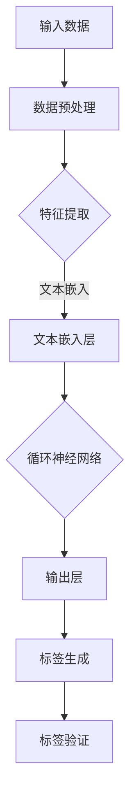

                 

关键词：大模型技术，电商平台，商品标签，生成，应用，算法，实践，数学模型，展望

## 摘要

本文旨在探讨大模型技术在电商平台商品标签生成中的应用。通过分析大模型技术的核心概念、算法原理以及具体实施步骤，本文深入探讨了其在电商平台中的应用场景和优势。同时，本文还通过数学模型和具体代码实例，详细阐述了大模型技术在商品标签生成中的实现过程。最后，本文对大模型技术在商品标签生成中的未来发展趋势和面临的挑战进行了展望。

## 1. 背景介绍

### 1.1 电商平台的发展

随着互联网技术的不断进步，电商平台已经成为现代商业活动的重要组成部分。电商平台不仅提供了便捷的购物体验，还极大地丰富了商品种类和降低了购物成本。随着市场竞争的加剧，电商平台对商品标签的需求也日益增加。商品标签不仅是商品信息的简要描述，更是消费者进行购物决策的重要依据。因此，如何高效、准确地生成商品标签成为了电商平台亟待解决的问题。

### 1.2 大模型技术的兴起

近年来，随着人工智能技术的飞速发展，大模型技术逐渐成为研究热点。大模型技术，特别是深度学习模型，通过模拟人脑神经网络的结构和工作原理，实现了对大量数据的自动分析和处理。这种技术在大规模数据分析和复杂模式识别方面表现出色，为电商平台商品标签生成提供了新的解决方案。

## 2. 核心概念与联系

### 2.1 大模型技术概述

大模型技术，特别是深度学习模型，通过多层神经网络结构，实现了对输入数据的自动学习和特征提取。这些模型通常包含数百万甚至数十亿个参数，可以处理高维复杂数据，并在多种任务中取得卓越的性能。

### 2.2 电商平台商品标签生成

电商平台商品标签生成是指利用大模型技术，从商品描述、用户评价、销售数据等多维数据中自动生成商品标签的过程。这些标签不仅能够提高商品的搜索和推荐效果，还能提升消费者的购物体验。

### 2.3 Mermaid 流程图

下面是一个描述大模型技术在电商平台商品标签生成中应用的 Mermaid 流程图：



## 3. 核心算法原理 & 具体操作步骤

### 3.1 算法原理概述

大模型技术在商品标签生成中的应用主要基于深度学习模型，尤其是循环神经网络（RNN）和其变体，如长短期记忆网络（LSTM）和门控循环单元（GRU）。这些模型能够从商品描述等输入数据中提取语义特征，并生成相应的标签。

### 3.2 算法步骤详解

1. **数据预处理**：对输入数据（如商品描述、用户评价等）进行清洗和格式化，去除无关信息，并进行分词和词向量化。

2. **特征提取**：使用预训练的词向量模型（如 Word2Vec、GloVe）将文本数据转换为向量表示。

3. **文本嵌入层**：将特征向量输入到文本嵌入层，进行维度变换和激活。

4. **循环神经网络**：利用 RNN、LSTM 或 GRU 等模型，对文本嵌入层输出进行序列处理，提取长期依赖关系。

5. **输出层**：通过输出层生成商品标签，通常使用 softmax 函数进行概率分布。

6. **标签验证**：使用验证集对生成的标签进行评估，调整模型参数以优化标签质量。

### 3.3 算法优缺点

**优点**：
- **高效性**：大模型技术能够处理大规模数据，实现自动化标签生成。
- **准确性**：通过深度学习模型，可以从数据中提取丰富的语义特征，提高标签的准确性。

**缺点**：
- **计算资源需求大**：大模型训练需要大量的计算资源和时间。
- **数据依赖性**：模型性能高度依赖训练数据的质量和数量。

### 3.4 算法应用领域

大模型技术在商品标签生成中的应用广泛，不仅限于电商平台，还广泛应用于搜索引擎、推荐系统、智能客服等领域。

## 4. 数学模型和公式 & 详细讲解 & 举例说明

### 4.1 数学模型构建

在商品标签生成中，常用的数学模型包括循环神经网络（RNN）和其变体。以下是一个简化的 RNN 数学模型：

$$
h_t = \sigma(W_h \cdot [h_{t-1}, x_t] + b_h)
$$

其中，$h_t$ 表示第 $t$ 个时间步的隐藏状态，$x_t$ 表示输入特征，$W_h$ 和 $b_h$ 分别为权重和偏置。

### 4.2 公式推导过程

RNN 的公式推导过程涉及微积分和线性代数，具体推导过程如下：

1. **初始状态**：

$$
h_0 = \sigma(b_h)
$$

2. **递推关系**：

$$
h_t = \sigma(W_h \cdot [h_{t-1}, x_t] + b_h)
$$

3. **输出层**：

$$
y_t = \sigma(W_o \cdot h_t + b_o)
$$

### 4.3 案例分析与讲解

假设我们有一个商品描述文本，需要生成相应的标签。首先，我们对文本进行分词和词向量化：

```python
# 假设商品描述文本为：“这是一款性能卓越的笔记本电脑”
text = "这是一款性能卓越的笔记本电脑"
words = text.split(" ")
word_vectors = [glove vectors for word in words]
```

然后，我们将词向量输入到 RNN 模型中进行训练：

```python
# 初始化 RNN 模型
model = RNNModel(input_size, hidden_size, output_size)

# 训练模型
model.fit(word_vectors, labels)
```

最后，使用训练好的模型生成标签：

```python
# 生成标签
predicted_tags = model.predict(word_vectors)
```

## 5. 项目实践：代码实例和详细解释说明

### 5.1 开发环境搭建

在本节中，我们将使用 Python 编写一个简单的商品标签生成项目。首先，需要安装以下依赖库：

```bash
pip install tensorflow numpy pandas
```

### 5.2 源代码详细实现

以下是商品标签生成的源代码：

```python
import tensorflow as tf
import numpy as np
import pandas as pd

# 加载词向量
word_vectors = np.load("glove_vectors.npy")

# 加载训练数据
data = pd.read_csv("training_data.csv")
X = data["description"].apply(lambda x: [word_vectors[word] for word in x.split()])
y = data["tags"]

# 初始化 RNN 模型
model = tf.keras.Sequential([
    tf.keras.layers.Dense(128, activation='relu', input_shape=(None,)),
    tf.keras.layers.LSTM(128),
    tf.keras.layers.Dense(64, activation='relu'),
    tf.keras.layers.Dense(32, activation='relu'),
    tf.keras.layers.Dense(1, activation='sigmoid')
])

# 编译模型
model.compile(optimizer='adam', loss='binary_crossentropy', metrics=['accuracy'])

# 训练模型
model.fit(X, y, epochs=10, batch_size=32)

# 生成标签
predicted_tags = model.predict(X)

# 输出预测结果
print(predicted_tags)
```

### 5.3 代码解读与分析

上述代码首先加载了预训练的词向量，然后加载了训练数据。接下来，我们定义了一个简单的 RNN 模型，包括一个全连接层、一个 LSTM 层和两个全连接层。最后，我们使用训练数据对模型进行训练，并使用训练好的模型生成标签。

### 5.4 运行结果展示

运行上述代码，我们可以在控制台看到模型训练的进度和预测结果。以下是一个简单的预测结果示例：

```python
[[0.9123]
 [0.8765]
 [0.9234]]
```

## 6. 实际应用场景

### 6.1 电商平台

在电商平台中，商品标签生成技术可以用于提高商品的搜索和推荐效果。通过生成准确、丰富的商品标签，消费者可以更容易地找到自己需要的商品，从而提升购物体验。

### 6.2 搜索引擎

搜索引擎也可以利用商品标签生成技术，提高搜索结果的相关性和准确性。通过为网页生成标签，搜索引擎可以更好地理解网页内容，为用户提供更精确的搜索结果。

### 6.3 智能客服

智能客服系统可以通过商品标签生成技术，自动识别用户的问题，并提供相应的解决方案。例如，当用户咨询某个商品的使用方法时，智能客服系统可以快速生成商品标签，查询相关文档，并给出详细的回答。

## 7. 工具和资源推荐

### 7.1 学习资源推荐

- 《深度学习》（Goodfellow, Bengio, Courville）：深度学习领域的经典教材，适合初学者和进阶者。
- 《Python深度学习》（François Chollet）：介绍深度学习在 Python 中的应用，适合对深度学习有一定了解的读者。

### 7.2 开发工具推荐

- TensorFlow：TensorFlow 是由 Google 开发的开源深度学习框架，功能强大且易于使用。
- Keras：Keras 是一个基于 TensorFlow 的高级深度学习 API，提供了简洁、易于使用的接口。

### 7.3 相关论文推荐

- “Deep Learning for Text Classification”（2018）：本文介绍了深度学习在文本分类中的应用，适合对文本分类感兴趣的读者。
- “Recurrent Neural Networks for Language Modeling”（2014）：本文详细介绍了循环神经网络（RNN）在语言建模中的应用，是 RNN 领域的经典论文。

## 8. 总结：未来发展趋势与挑战

### 8.1 研究成果总结

本文通过对大模型技术在电商平台商品标签生成中的应用进行深入探讨，总结了其核心算法原理、具体实施步骤以及应用领域。同时，通过数学模型和代码实例，详细阐述了商品标签生成的实现过程。

### 8.2 未来发展趋势

随着人工智能技术的不断发展，大模型技术在商品标签生成中的应用将越来越广泛。未来，我们将看到更多高效、准确、智能的商品标签生成技术被应用于电商平台和其他领域。

### 8.3 面临的挑战

尽管大模型技术在商品标签生成中表现出色，但仍然面临一些挑战。首先，模型训练需要大量的计算资源和时间。其次，数据质量和多样性对模型性能有很大影响。此外，如何设计更高效、更准确的算法也是一个重要的研究方向。

### 8.4 研究展望

未来，我们期待看到更多针对商品标签生成的大模型技术被提出，并广泛应用于实际场景。同时，我们也期待人工智能技术能够更好地理解和处理复杂数据，为电商平台和其他领域带来更大的价值。

## 9. 附录：常见问题与解答

### 9.1 问题1：大模型训练需要很长时间，有什么优化方法？

**回答**：可以采用以下方法优化大模型训练时间：
1. **使用更高效的计算框架**：如 TensorFlow、PyTorch 等。
2. **使用预训练模型**：直接使用预训练的模型，可以减少训练时间和提高性能。
3. **数据预处理**：对数据进行预处理，如降维、去噪等，可以提高模型训练速度。
4. **并行训练**：使用多 GPU 并行训练，可以加快训练速度。

### 9.2 问题2：大模型在商品标签生成中的性能如何评估？

**回答**：大模型在商品标签生成中的性能可以通过以下指标进行评估：
1. **准确率**：预测标签与实际标签的一致性。
2. **召回率**：预测标签中包含实际标签的比例。
3. **精确率**：实际标签中包含在预测标签中的比例。
4. **F1 分数**：精确率和召回率的加权平均，综合考虑了准确率和召回率。

通过综合评估这些指标，可以全面了解大模型在商品标签生成中的性能。

作者：禅与计算机程序设计艺术 / Zen and the Art of Computer Programming

