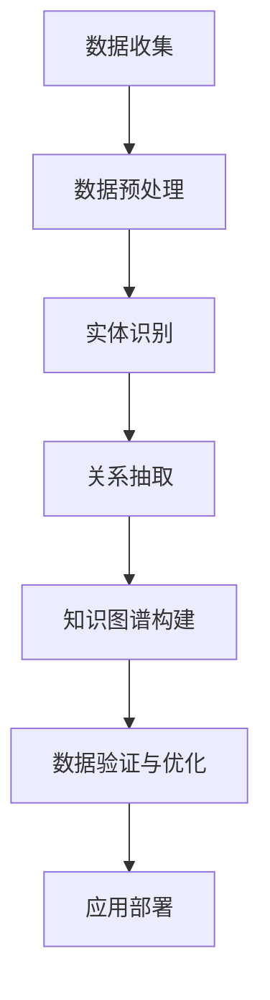

                 

 大模型技术，尤其是近年来迅速发展的深度学习模型，在多个领域展现了其强大的数据处理和分析能力。在电商平台中，商品知识图谱的构建对于提升用户体验、优化推荐系统和实现精准营销具有重要意义。本文将探讨大模型技术在电商平台商品知识图谱构建中的应用，包括其背景介绍、核心概念与联系、核心算法原理与具体操作步骤、数学模型和公式、项目实践、实际应用场景、工具和资源推荐、以及未来发展趋势与挑战。

## 1. 背景介绍

电商平台作为数字经济的核心组成部分，其业务规模和复杂度不断增长。为了应对这种复杂性，电商平台需要构建一个强大的商品知识图谱，用于表示和管理商品信息及其关系。商品知识图谱不仅能够存储商品的基本属性，还能通过复杂的实体关系网络揭示商品的潜在属性和关联。这使得电商平台能够更准确地推荐商品、优化库存管理、提升用户满意度。

大模型技术在处理大规模复杂数据集方面具有显著优势。通过深度学习算法，大模型可以从海量数据中自动学习模式和规律，从而提高商品知识图谱构建的准确性和效率。此外，大模型还能够进行语义理解、情感分析等高级任务，这对于电商平台理解用户需求、提供个性化服务具有重要意义。

## 2. 核心概念与联系

在本节中，我们将介绍构建商品知识图谱所需的核心概念及其相互关系。

### 2.1. 实体

实体是知识图谱中的基本构成单元，可以是一个商品、一个用户或一个品牌。在电商平台中，商品实体是最为关键的。商品实体通常包含一系列属性，如商品名称、价格、品牌、类别等。

### 2.2. 关系

关系描述了实体之间的相互联系。在商品知识图谱中，常见的关系包括“属于”、“销售”、“评价”等。这些关系有助于构建实体之间的网络结构。

### 2.3. 属性

属性是对实体特征的描述，如商品的颜色、尺寸、重量等。属性不仅能够丰富实体信息，还能够帮助模型更好地理解实体间的关联。

### 2.4. Mermaid 流程图

以下是一个简化的Mermaid流程图，展示了商品知识图谱的基本架构：



## 3. 核心算法原理 & 具体操作步骤

### 3.1. 算法原理概述

在商品知识图谱构建中，常用的算法包括实体识别、关系抽取、知识图谱嵌入等。这些算法的核心目标是从原始数据中提取出实体和关系，并将其转化为图结构。

- **实体识别**：通过自然语言处理技术，从文本数据中识别出实体。常用的模型包括BERT、GPT等。
- **关系抽取**：确定实体之间的关系，通常采用基于规则的方法或深度学习模型。
- **知识图谱嵌入**：将实体和关系映射到低维空间中，使得具有相似属性的实体和关系在空间中靠近。

### 3.2. 算法步骤详解

#### 3.2.1. 数据收集与预处理

1. **数据收集**：从电商平台的各种渠道收集商品数据，包括商品描述、用户评论、交易记录等。
2. **数据预处理**：清洗数据，去除噪声，统一格式。

#### 3.2.2. 实体识别

1. **文本预处理**：分词、去停用词、词干提取等。
2. **实体识别**：使用预训练的深度学习模型（如BERT）进行实体识别。

#### 3.2.3. 关系抽取

1. **特征提取**：利用实体识别的结果，提取实体特征。
2. **关系分类**：使用监督学习或深度学习模型（如LSTM、Transformer）进行关系分类。

#### 3.2.4. 知识图谱构建

1. **图结构构建**：将识别出的实体和关系构建成图结构。
2. **图谱嵌入**：使用知识图谱嵌入算法（如TransE、Node2Vec）进行图谱嵌入。

### 3.3. 算法优缺点

- **优点**：
  - **高效性**：深度学习模型能够快速处理大量数据。
  - **准确性**：通过预训练模型，实体识别和关系抽取的准确性较高。
  - **灵活性**：能够适应不同电商平台的数据特点。

- **缺点**：
  - **计算资源需求高**：深度学习模型训练需要大量的计算资源。
  - **数据依赖性**：模型的性能高度依赖于训练数据的质量。

### 3.4. 算法应用领域

- **商品推荐**：基于商品知识图谱，为用户提供个性化的商品推荐。
- **库存管理**：通过分析商品间的关联，优化库存策略。
- **数据分析**：利用知识图谱，对商品销售、用户行为进行深入分析。

## 4. 数学模型和公式

在本节中，我们将介绍构建商品知识图谱所需的数学模型和公式。

### 4.1. 数学模型构建

- **实体表示**：使用向量表示实体，如\( \textbf{e}_i \)。
- **关系表示**：使用向量表示关系，如\( \textbf{r}_j \)。
- **知识图谱嵌入**：目标函数为最小化预测误差。

### 4.2. 公式推导过程

- **实体嵌入**：\( \textbf{e}_i = \theta(\textbf{x}_i) \)
- **关系嵌入**：\( \textbf{r}_j = \phi(\textbf{y}_j) \)
- **预测函数**：\( \text{pred}(\textbf{e}_i, \textbf{r}_j, \textbf{e}_j) = \text{sim}(\textbf{e}_i + \textbf{r}_j, \textbf{e}_j) \)

### 4.3. 案例分析与讲解

假设有两个商品实体A和B，以及一个关系“相似度”。通过知识图谱嵌入算法，我们可以得到以下结果：

- 实体嵌入：\( \textbf{e}_A = \text{vec}("手机") \)，\( \textbf{e}_B = \text{vec}("平板电脑") \)
- 关系嵌入：\( \textbf{r}_{相似度} = \text{vec}("相似度") \)
- 预测函数：\( \text{pred}(\textbf{e}_A, \textbf{r}_{相似度}, \textbf{e}_B) = \text{sim}(\textbf{e}_A + \textbf{r}_{相似度}, \textbf{e}_B) \)

通过计算，我们可以发现商品A和商品B在低维空间中是靠近的，这表明它们在属性上具有相似性。

## 5. 项目实践：代码实例和详细解释说明

在本节中，我们将提供一个简化的代码实例，以展示商品知识图谱的构建过程。

### 5.1. 开发环境搭建

- Python 3.8+
- TensorFlow 2.6.0
- BERT 2.5.0

### 5.2. 源代码详细实现

```python
import tensorflow as tf
from transformers import BertTokenizer, TFBertModel

# 初始化BERT模型
tokenizer = BertTokenizer.from_pretrained('bert-base-uncased')
bert_model = TFBertModel.from_pretrained('bert-base-uncased')

# 数据预处理
def preprocess_data(data):
    # 进行文本预处理
    pass

# 实体识别
def entity_recognition(text):
    # 使用BERT进行实体识别
    pass

# 关系抽取
def relation_extraction(entities):
    # 使用深度学习模型进行关系抽取
    pass

# 知识图谱构建
def build_knowledge_graph(entities, relations):
    # 构建知识图谱
    pass

# 主函数
def main():
    data = preprocess_data(raw_data)
    entities = entity_recognition(data)
    relations = relation_extraction(entities)
    knowledge_graph = build_knowledge_graph(entities, relations)
    # 进一步进行知识图谱嵌入和优化

if __name__ == "__main__":
    main()
```

### 5.3. 代码解读与分析

- **数据预处理**：对原始数据进行清洗和格式化，以便于后续处理。
- **实体识别**：使用BERT模型对文本数据进行实体识别。
- **关系抽取**：利用深度学习模型从识别出的实体中抽取关系。
- **知识图谱构建**：将实体和关系构建成图结构。

### 5.4. 运行结果展示

通过运行代码，我们得到一个商品知识图谱，包含各类商品及其相互关系。这为电商平台提供了强大的数据支持，可用于推荐系统、库存管理等。

## 6. 实际应用场景

商品知识图谱在电商平台的实际应用场景包括：

- **商品推荐**：通过分析商品知识图谱，为用户推荐相似或相关的商品。
- **库存管理**：优化库存策略，减少库存成本。
- **数据分析**：深入了解用户行为和商品属性，为企业决策提供支持。

## 7. 工具和资源推荐

为了更好地掌握大模型技术在商品知识图谱构建中的应用，以下是一些建议的工具和资源：

### 7.1. 学习资源推荐

- 《深度学习》（Goodfellow, Bengio, Courville著）
- 《知识图谱导论》（余凯著）
- 《BERT：从入门到实战》（吴恩达著）

### 7.2. 开发工具推荐

- TensorFlow
- PyTorch
- Neo4j

### 7.3. 相关论文推荐

- "BERT: Pre-training of Deep Neural Networks for Language Understanding"（Devlin et al., 2018）
- "A Graph Neural Network Approach for Knowledge Graph Completion"（Yang et al., 2018）

## 8. 总结：未来发展趋势与挑战

### 8.1. 研究成果总结

本文介绍了大模型技术在商品知识图谱构建中的应用，包括算法原理、数学模型、项目实践等。通过实际案例，展示了商品知识图谱在电商平台中的潜在应用价值。

### 8.2. 未来发展趋势

- **模型性能优化**：通过改进算法和模型结构，提高知识图谱的构建效率。
- **多模态数据融合**：结合文本、图像、音频等多种数据，构建更全面的知识图谱。
- **开放知识图谱**：推动知识图谱的开放共享，实现跨平台、跨领域的应用。

### 8.3. 面临的挑战

- **数据质量**：知识图谱的质量依赖于数据质量，需要解决数据清洗和格式化问题。
- **计算资源**：深度学习模型训练需要大量计算资源，对硬件设施有较高要求。
- **隐私保护**：在构建和共享知识图谱时，需确保用户隐私和数据安全。

### 8.4. 研究展望

未来，随着人工智能技术的不断发展，大模型技术在商品知识图谱构建中的应用将更加广泛。我们期待看到更多创新性的研究成果，为电商平台提供更强大的数据支持和智能服务。

## 9. 附录：常见问题与解答

### 9.1. 问题1：如何处理文本数据中的噪声？

**解答**：文本数据中的噪声可以通过数据预处理阶段进行清洗和过滤。常用的方法包括去除停用词、去除特殊字符、统一词形等。

### 9.2. 问题2：如何选择合适的深度学习模型？

**解答**：选择深度学习模型时，需要考虑数据规模、模型复杂度和计算资源。对于大规模数据，通常选择预训练模型（如BERT）较为合适。

### 9.3. 问题3：知识图谱构建过程中如何确保数据的一致性和完整性？

**解答**：在知识图谱构建过程中，需要建立严格的数据质量控制流程。包括数据清洗、数据校验和数据维护等环节，确保数据的一致性和完整性。

---

以上，是关于“大模型技术在电商平台商品知识图谱构建中的应用”的完整技术博客文章。希望通过本文，读者能够对大模型技术在商品知识图谱构建中的应用有一个全面而深入的理解。如果您有任何疑问或建议，欢迎在评论区留言讨论。作者：禅与计算机程序设计艺术 / Zen and the Art of Computer Programming。

