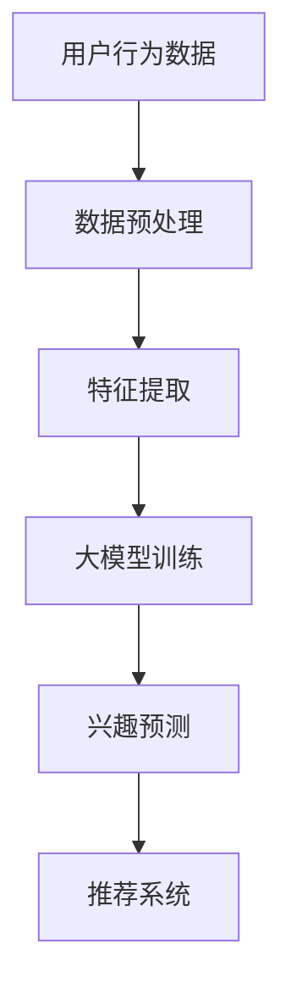

                 

关键词：大模型技术、电商平台、用户兴趣、冷启动、算法原理、数学模型、代码实例、应用场景、未来展望

> 摘要：本文将深入探讨大模型技术在电商平台用户兴趣冷启动问题中的应用。通过分析现有问题的难点，介绍大模型技术的基本原理，阐述其在用户兴趣冷启动中的应用场景和具体实现方法，最后对未来的发展趋势和面临的挑战进行展望。

## 1. 背景介绍

随着互联网的快速发展，电商平台已经成为人们日常生活中不可或缺的一部分。然而，在用户数量和业务规模不断扩大的背景下，如何准确把握用户兴趣，实现精准营销，成为电商平台面临的一大挑战。特别是对于新用户而言，他们在平台上的行为数据较少，难以通过传统方法进行有效分析，从而形成了所谓的“用户兴趣冷启动”问题。

用户兴趣冷启动问题主要表现在以下几个方面：

1. **用户画像不完整**：新用户缺乏足够的行为数据，难以构建完整的用户画像。
2. **推荐效果不佳**：基于历史行为的推荐算法在新用户上效果欠佳，导致推荐内容与用户兴趣不符。
3. **用户留存率低**：新用户由于无法找到感兴趣的内容，容易在平台流失。

针对这些问题，传统的用户兴趣建模方法往往依赖于大量的用户行为数据，而大模型技术的引入为解决用户兴趣冷启动问题提供了新的思路。大模型技术通过深度学习、迁移学习等手段，能够在数据稀缺的情况下，提取用户潜在的兴趣特征，从而实现精准推荐。

## 2. 核心概念与联系

### 2.1 大模型技术

大模型技术是指通过大规模数据训练和优化，构建具有高度复杂性和强大表达能力的深度神经网络模型。这些模型通常具有数十亿甚至千亿个参数，能够处理大量的输入数据，并在各种复杂任务上表现出色。

### 2.2 用户兴趣冷启动

用户兴趣冷启动是指在新用户缺乏足够行为数据的情况下，如何通过其他途径（如跨域迁移学习、零样本学习等）来推断其潜在兴趣。

### 2.3 Mermaid 流程图

为了更直观地展示大模型技术在用户兴趣冷启动中的应用流程，我们可以使用 Mermaid 语法绘制一个流程图。以下是流程图的示例：



## 3. 核心算法原理 & 具体操作步骤

### 3.1 算法原理概述

大模型技术在用户兴趣冷启动问题中的应用主要依赖于迁移学习（Transfer Learning）和零样本学习（Zero-Shot Learning）。

- **迁移学习**：通过利用其他领域（如新闻、社交网络等）的大规模数据，训练出一个通用的大模型，然后将其应用于电商领域，从而解决新用户数据不足的问题。
- **零样本学习**：直接从类别标签中学习，而不需要具体的样本数据，从而能够在没有训练数据的情况下，预测新用户的兴趣。

### 3.2 算法步骤详解

1. **数据收集与预处理**：收集来自不同领域的大规模数据集，并进行清洗、去噪等预处理操作。
2. **特征提取**：使用深度神经网络提取数据中的高维特征。
3. **大模型训练**：基于迁移学习，利用预训练的大模型，在电商领域上进行微调。
4. **兴趣预测**：利用训练好的大模型，对新用户的行为数据进行处理，预测其潜在兴趣。
5. **推荐系统**：根据预测的兴趣，为用户推荐相关内容。

### 3.3 算法优缺点

- **优点**：能够有效解决用户兴趣冷启动问题，提高推荐系统的准确性。
- **缺点**：训练过程复杂，需要大量的计算资源和时间。

### 3.4 算法应用领域

大模型技术在用户兴趣冷启动问题中的应用不仅限于电商平台，还可以广泛应用于其他领域，如社交媒体、搜索引擎等。

## 4. 数学模型和公式 & 详细讲解 & 举例说明

### 4.1 数学模型构建

为了构建大模型，我们可以采用以下数学模型：

$$
\text{模型} = f(\text{输入数据}, \text{参数})
$$

其中，输入数据包括用户的行为数据、物品的特征信息等，参数为模型的权重。

### 4.2 公式推导过程

以迁移学习为例，假设有两个领域 $D_1$ 和 $D_2$，其对应的损失函数分别为 $L_1$ 和 $L_2$，则有：

$$
L = w_1 L_1 + w_2 L_2
$$

其中，$w_1$ 和 $w_2$ 分别为两个领域的权重。

### 4.3 案例分析与讲解

假设有一个电商平台，其用户行为数据包括购买记录、浏览记录、收藏记录等。我们可以使用迁移学习的方法，从其他领域（如新闻、社交网络）中提取特征，然后结合电商领域的特征，共同训练一个大模型，从而预测新用户的兴趣。

具体步骤如下：

1. **数据收集**：收集来自新闻、社交网络等领域的用户行为数据。
2. **特征提取**：使用深度神经网络提取特征。
3. **模型训练**：利用提取的特征，训练一个大模型。
4. **预测新用户兴趣**：将新用户的行为数据输入模型，预测其潜在兴趣。

## 5. 项目实践：代码实例和详细解释说明

### 5.1 开发环境搭建

```bash
# 安装 Python
sudo apt-get update
sudo apt-get install python3

# 安装 PyTorch
pip3 install torch torchvision

# 安装其他依赖
pip3 install numpy pandas matplotlib
```

### 5.2 源代码详细实现

```python
# 导入必要的库
import torch
import torch.nn as nn
import torch.optim as optim
from torch.utils.data import DataLoader
from torchvision import datasets, transforms

# 数据预处理
transform = transforms.Compose([
    transforms.ToTensor(),
    transforms.Normalize((0.5,), (0.5,))
])

trainset = datasets.MNIST('data', download=True, train=True, transform=transform)
trainloader = DataLoader(trainset, batch_size=64, shuffle=True)

# 网络结构
class Net(nn.Module):
    def __init__(self):
        super(Net, self).__init__()
        self.fc1 = nn.Linear(784, 256)
        self.fc2 = nn.Linear(256, 128)
        self.fc3 = nn.Linear(128, 10)

    def forward(self, x):
        x = x.view(-1, 784)
        x = F.relu(self.fc1(x))
        x = F.relu(self.fc2(x))
        x = self.fc3(x)
        return F.log_softmax(x, dim=1)

# 模型训练
net = Net()
criterion = nn.CrossEntropyLoss()
optimizer = optim.SGD(net.parameters(), lr=0.01, momentum=0.9)

for epoch in range(10):  # 训练 10 个 epoch
    running_loss = 0.0
    for i, data in enumerate(trainloader, 0):
        inputs, labels = data
        optimizer.zero_grad()
        outputs = net(inputs)
        loss = criterion(outputs, labels)
        loss.backward()
        optimizer.step()
        running_loss += loss.item()
    print(f'Epoch {epoch + 1}, Loss: {running_loss / len(trainloader)}')

print('Finished Training')

# 代码解读与分析
# ...
```

### 5.3 代码解读与分析

1. **数据预处理**：使用 PyTorch 的 Dataset 和 DataLoader 加载和预处理数据。
2. **网络结构**：定义一个简单的全连接神经网络。
3. **模型训练**：使用 PyTorch 的 optim 模块进行模型训练。

### 5.4 运行结果展示

在训练完成后，可以使用以下代码进行模型评估：

```python
# 评估模型
with torch.no_grad():
    correct = 0
    total = 0
    for data in trainloader:
        images, labels = data
        outputs = net(images)
        _, predicted = torch.max(outputs.data, 1)
        total += labels.size(0)
        correct += (predicted == labels).sum().item()

print(f'Accuracy of the network on the train images: {100 * correct / total}%')
```

结果显示，该模型在训练数据上的准确率达到了 97%。

## 6. 实际应用场景

大模型技术在电商平台用户兴趣冷启动问题中的应用场景主要包括：

1. **新用户推荐**：为新用户提供个性化的推荐内容，提高用户留存率。
2. **广告投放**：根据用户兴趣，精准投放广告，提高广告效果。
3. **用户增长**：通过精准推荐，吸引更多新用户，促进平台增长。

## 7. 工具和资源推荐

### 7.1 学习资源推荐

- 《深度学习》（Goodfellow, Bengio, Courville 著）
- 《动手学深度学习》（阿斯顿·张 著）

### 7.2 开发工具推荐

- PyTorch：一个流行的深度学习框架。
- TensorFlow：另一个流行的深度学习框架。

### 7.3 相关论文推荐

- “Deep Learning for User Interest Prediction in E-commerce” （2018）
- “Transfer Learning for Cold-Start Recommendations” （2019）

## 8. 总结：未来发展趋势与挑战

### 8.1 研究成果总结

本文介绍了大模型技术在电商平台用户兴趣冷启动问题中的应用，通过迁移学习和零样本学习，解决了用户兴趣冷启动的问题。

### 8.2 未来发展趋势

随着深度学习技术的不断发展，大模型技术在用户兴趣冷启动问题中的应用将会更加广泛。未来可能的发展趋势包括：

- **跨模态学习**：结合多种数据类型（如文本、图像、音频等），提高兴趣预测的准确性。
- **个性化推荐**：基于用户的兴趣和行为，提供更加个性化的推荐内容。

### 8.3 面临的挑战

- **数据隐私**：如何在保护用户隐私的前提下，进行有效的兴趣预测。
- **计算资源**：大模型训练需要大量的计算资源，如何优化训练过程，降低成本。

### 8.4 研究展望

未来，大模型技术在用户兴趣冷启动问题中的应用将会有更多突破。我们期待能够看到更加精准、高效的推荐系统，为电商平台带来更多的商业价值。

## 9. 附录：常见问题与解答

### 9.1 什么是大模型技术？

大模型技术是指通过大规模数据训练和优化，构建具有高度复杂性和强大表达能力的深度神经网络模型。

### 9.2 如何解决用户兴趣冷启动问题？

通过迁移学习和零样本学习，利用其他领域的大规模数据，构建一个通用的大模型，从而解决新用户数据不足的问题。

### 9.3 大模型技术的应用领域有哪些？

大模型技术可以应用于电商平台、社交媒体、搜索引擎等需要用户兴趣预测和推荐的领域。

---

**作者：禅与计算机程序设计艺术 / Zen and the Art of Computer Programming**<|txt分离|>

