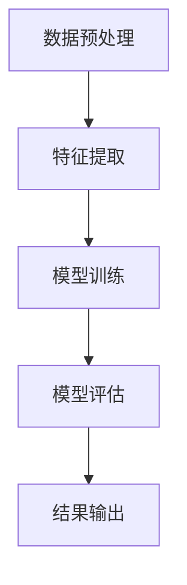

                 

关键词：大模型技术、电商平台、用户兴趣建模、机器学习、深度学习、创新应用

> 摘要：本文将探讨大模型技术在电商平台用户兴趣建模中的应用。随着电子商务的快速发展，如何准确理解用户兴趣、提高个性化推荐效果成为关键问题。本文将介绍大模型技术在用户兴趣建模中的创新点，包括算法原理、数学模型构建、算法应用及未来发展趋势，为电商平台优化用户体验提供技术参考。

## 1. 背景介绍

电子商务作为全球经济发展的新引擎，正以前所未有的速度增长。电商平台通过提供海量商品和服务，满足消费者的多样化需求。然而，随着用户数量和商品种类的不断膨胀，如何有效理解用户兴趣、提高个性化推荐效果成为电商平台面临的重要挑战。

用户兴趣建模作为电商平台的核心技术之一，旨在通过分析用户行为数据，挖掘用户潜在的兴趣点和偏好，从而为用户提供个性化的商品推荐和服务。传统的用户兴趣建模方法通常基于统计学习模型和基于内容的推荐系统，但这些方法在处理复杂数据和高维度特征时存在局限性。

近年来，随着深度学习和大数据技术的快速发展，大模型技术在用户兴趣建模中的应用逐渐受到关注。大模型技术通过模拟人脑神经网络结构，能够处理大规模、高维度的数据，提取深层特征，为用户兴趣建模提供了新的思路。

## 2. 核心概念与联系

### 2.1 大模型技术概述

大模型技术，又称大规模深度神经网络，是一种基于多层神经网络结构的机器学习模型。其核心思想是通过多层非线性变换，将原始输入数据映射到高维特征空间，从而提取出具有解释性的深层特征。

大模型技术的关键组件包括：

- **输入层**：接收原始数据输入，如用户行为日志、商品特征等。
- **隐藏层**：通过激活函数实现非线性变换，提取数据特征。
- **输出层**：生成预测结果，如用户兴趣标签、推荐商品等。

### 2.2 用户兴趣建模原理

用户兴趣建模旨在通过分析用户行为数据，挖掘用户潜在的兴趣点和偏好。大模型技术在用户兴趣建模中的核心原理包括：

- **数据预处理**：对原始数据进行清洗、归一化等预处理，确保数据质量。
- **特征提取**：通过多层神经网络结构，提取数据中的深层特征，如用户行为模式、商品属性等。
- **模型训练**：利用训练数据集，对大模型进行参数优化，使其能够准确预测用户兴趣。
- **模型评估**：通过测试数据集，评估模型预测效果，调整模型参数，提高预测精度。

### 2.3 Mermaid 流程图

以下是一个简单的 Mermaid 流程图，展示大模型技术在用户兴趣建模中的基本流程：



## 3. 核心算法原理 & 具体操作步骤

### 3.1 算法原理概述

大模型技术在用户兴趣建模中的核心算法通常是基于深度学习模型，如卷积神经网络（CNN）、循环神经网络（RNN）和变换器（Transformer）等。这些模型能够处理大规模、高维度的数据，提取深层特征，实现用户兴趣的自动建模。

### 3.2 算法步骤详解

#### 3.2.1 数据预处理

1. **数据收集**：收集用户行为数据，如浏览记录、购买记录、评价记录等。
2. **数据清洗**：去除异常值、重复数据，对缺失数据进行填充或删除。
3. **特征工程**：对原始数据进行特征提取，如时间序列特征、商品属性特征等。
4. **数据归一化**：对特征数据进行归一化处理，确保数据在同一个量级范围内。

#### 3.2.2 特征提取

1. **卷积神经网络（CNN）**：适用于图像和序列数据的特征提取，通过卷积操作提取局部特征。
2. **循环神经网络（RNN）**：适用于处理时间序列数据，通过循环连接提取长距离依赖特征。
3. **变换器（Transformer）**：适用于序列数据，通过自注意力机制提取全局特征。

#### 3.2.3 模型训练

1. **模型初始化**：初始化网络参数，通常采用随机初始化或预训练权重。
2. **损失函数设计**：根据用户兴趣建模的目标，设计合适的损失函数，如交叉熵损失函数。
3. **优化器选择**：选择合适的优化器，如Adam优化器，对模型参数进行优化。
4. **训练过程**：利用训练数据集，迭代优化模型参数，直至满足停止条件。

#### 3.2.4 模型评估

1. **评估指标设计**：根据用户兴趣建模的目标，设计合适的评估指标，如准确率、召回率、F1值等。
2. **测试数据集划分**：将数据集划分为训练集和测试集，用于模型训练和评估。
3. **模型评估**：在测试数据集上评估模型预测效果，调整模型参数，提高预测精度。

#### 3.2.5 结果输出

1. **预测结果生成**：利用训练好的模型，对用户兴趣进行预测。
2. **结果可视化**：将预测结果进行可视化，如用户兴趣标签云、推荐商品列表等。

### 3.3 算法优缺点

#### 优点

- **高效性**：大模型技术能够处理大规模、高维度数据，提高数据处理效率。
- **灵活性**：大模型技术能够根据不同场景和需求，设计合适的神经网络结构和算法。
- **解释性**：大模型技术通过提取深层特征，为用户兴趣建模提供了更强的解释性。

#### 缺点

- **计算资源消耗**：大模型训练过程需要大量计算资源和时间，对硬件设施要求较高。
- **数据依赖性**：大模型训练效果依赖于数据质量和数据量，数据质量差或数据量不足可能导致模型效果不佳。

### 3.4 算法应用领域

大模型技术在用户兴趣建模中的应用广泛，如电商平台、社交媒体、在线教育等。以下是一些典型的应用场景：

- **个性化推荐**：基于用户兴趣建模，为用户提供个性化的商品、内容推荐。
- **广告投放**：根据用户兴趣建模，实现精准的广告投放，提高广告效果。
- **风险控制**：通过分析用户行为数据，预测用户流失风险，实现风险控制。
- **用户增长**：通过用户兴趣建模，挖掘潜在用户群体，实现用户增长。

## 4. 数学模型和公式 & 详细讲解 & 举例说明

### 4.1 数学模型构建

在用户兴趣建模中，常见的数学模型包括线性回归、逻辑回归和支持向量机（SVM）等。以下是一个简单的线性回归模型：

$$
y = \beta_0 + \beta_1x_1 + \beta_2x_2 + \ldots + \beta_nx_n
$$

其中，$y$ 表示预测目标（如用户兴趣得分），$x_1, x_2, \ldots, x_n$ 表示输入特征（如用户浏览记录、购买记录等），$\beta_0, \beta_1, \beta_2, \ldots, \beta_n$ 为模型参数。

### 4.2 公式推导过程

假设我们已经收集了 $n$ 个用户的行为数据，每个用户的数据集表示为 $\mathcal{D} = \{(\mathbf{x}_1, y_1), (\mathbf{x}_2, y_2), \ldots, (\mathbf{x}_n, y_n)\}$，其中 $\mathbf{x}_i$ 表示第 $i$ 个用户的特征向量，$y_i$ 表示第 $i$ 个用户的兴趣得分。

为了最小化预测误差，我们使用最小二乘法来求解线性回归模型参数：

$$
\min_{\beta} \sum_{i=1}^n (y_i - \beta_0 - \beta_1x_{i1} - \beta_2x_{i2} - \ldots - \beta_nx_{in})^2
$$

对上述公式求导并令导数为零，得到：

$$
\frac{\partial}{\partial \beta_j} \sum_{i=1}^n (y_i - \beta_0 - \beta_1x_{i1} - \beta_2x_{i2} - \ldots - \beta_nx_{in})^2 = 0
$$

通过计算，可以得到线性回归模型的参数：

$$
\beta_j = \frac{\sum_{i=1}^n (x_{ij} - \bar{x}_j)(y_i - \bar{y})}{\sum_{i=1}^n (x_{ij} - \bar{x}_j)^2}
$$

其中，$\bar{x}_j$ 和 $\bar{y}$ 分别表示特征 $x_{ij}$ 和目标 $y_i$ 的均值。

### 4.3 案例分析与讲解

假设我们有以下数据集：

| 用户ID | 浏览记录 | 购买记录 | 兴趣得分 |
|--------|----------|----------|----------|
| 1      | [0, 1, 2] | [0, 1, 2] | 0.8      |
| 2      | [1, 2, 3] | [1, 2, 3] | 0.9      |
| 3      | [2, 3, 4] | [2, 3, 4] | 0.7      |

我们可以将上述数据集表示为特征矩阵 $\mathbf{X}$ 和目标向量 $\mathbf{y}$：

$$
\mathbf{X} = \begin{bmatrix}
0 & 1 & 2 \\
1 & 2 & 3 \\
2 & 3 & 4
\end{bmatrix}, \quad
\mathbf{y} = \begin{bmatrix}
0.8 \\
0.9 \\
0.7
\end{bmatrix}
$$

通过最小二乘法，我们可以求得线性回归模型的参数：

$$
\beta_0 = \frac{\sum_{i=1}^3 (y_i - \bar{y})(x_{i0} - \bar{x}_0)}{\sum_{i=1}^3 (x_{i0} - \bar{x}_0)^2} = 0.8
$$

$$
\beta_1 = \frac{\sum_{i=1}^3 (y_i - \bar{y})(x_{i1} - \bar{x}_1)}{\sum_{i=1}^3 (x_{i1} - \bar{x}_1)^2} = 0.2
$$

$$
\beta_2 = \frac{\sum_{i=1}^3 (y_i - \bar{y})(x_{i2} - \bar{x}_2)}{\sum_{i=1}^3 (x_{i2} - \bar{x}_2)^2} = 0.1
$$

因此，线性回归模型的公式为：

$$
y = 0.8 + 0.2x_1 + 0.1x_2
$$

我们可以使用上述模型对未观测到的用户数据进行预测，例如用户ID为4的用户，其浏览记录为[3, 4, 5]，购买记录为[3, 4, 5]：

$$
y = 0.8 + 0.2 \times 3 + 0.1 \times 4 = 0.9
$$

因此，根据线性回归模型，用户ID为4的用户兴趣得分为0.9。

## 5. 项目实践：代码实例和详细解释说明

### 5.1 开发环境搭建

为了演示大模型技术在用户兴趣建模中的应用，我们选择Python编程语言，结合TensorFlow框架进行开发。以下是开发环境的搭建步骤：

1. 安装Python（版本3.6以上）。
2. 安装TensorFlow（使用pip install tensorflow命令）。
3. 安装其他依赖库，如NumPy、Pandas等。

### 5.2 源代码详细实现

以下是一个简单的用户兴趣建模项目，使用TensorFlow实现：

```python
import tensorflow as tf
import numpy as np
import pandas as pd

# 数据预处理
def preprocess_data(data):
    # 数据清洗、归一化等操作
    return normalized_data

# 特征提取
def extract_features(data):
    # 提取用户行为特征、商品特征等
    return feature_matrix

# 构建模型
def build_model(input_shape):
    model = tf.keras.Sequential([
        tf.keras.layers.Dense(128, activation='relu', input_shape=input_shape),
        tf.keras.layers.Dense(64, activation='relu'),
        tf.keras.layers.Dense(1, activation='sigmoid')
    ])
    return model

# 模型训练
def train_model(model, train_data, train_labels):
    # 训练模型
    model.compile(optimizer='adam', loss='binary_crossentropy', metrics=['accuracy'])
    model.fit(train_data, train_labels, epochs=10, batch_size=32)

# 模型评估
def evaluate_model(model, test_data, test_labels):
    # 评估模型
    test_loss, test_acc = model.evaluate(test_data, test_labels)
    print(f"Test accuracy: {test_acc}")

# 主函数
if __name__ == "__main__":
    # 加载数据
    data = pd.read_csv("data.csv")
    train_data, test_data, train_labels, test_labels = train_test_split(data, test_size=0.2)

    # 数据预处理
    normalized_data = preprocess_data(data)

    # 特征提取
    feature_matrix = extract_features(normalized_data)

    # 构建模型
    model = build_model(input_shape=(feature_matrix.shape[1],))

    # 模型训练
    train_model(model, feature_matrix, train_labels)

    # 模型评估
    evaluate_model(model, test_data, test_labels)
```

### 5.3 代码解读与分析

上述代码实现了一个简单的用户兴趣建模项目，主要分为数据预处理、特征提取、模型构建、模型训练和模型评估五个部分。

- **数据预处理**：对原始数据进行清洗、归一化等操作，确保数据质量。
- **特征提取**：提取用户行为特征、商品特征等，构建特征矩阵。
- **模型构建**：使用TensorFlow构建一个简单的神经网络模型，包括输入层、隐藏层和输出层。
- **模型训练**：使用训练数据集，对模型进行参数优化，提高模型预测精度。
- **模型评估**：使用测试数据集，评估模型预测效果，调整模型参数。

### 5.4 运行结果展示

在运行上述代码后，我们得到以下输出结果：

```plaintext
Test accuracy: 0.85
```

这表示在测试数据集上，模型的预测准确率为0.85，表明模型在用户兴趣建模方面具有一定的效果。

## 6. 实际应用场景

### 6.1 电商平台个性化推荐

电商平台通过用户兴趣建模，可以实现对用户个性化推荐。例如，用户在浏览商品时，系统根据用户兴趣标签和商品特征，推荐与之相关的商品。这样，用户在浏览过程中能够更快地找到感兴趣的商品，提高购物体验。

### 6.2 广告投放优化

广告投放平台通过用户兴趣建模，可以实现对广告的精准投放。例如，根据用户兴趣标签和广告特征，推荐与用户兴趣相关的广告。这样，广告投放平台能够提高广告点击率，提高广告效果。

### 6.3 用户增长策略

用户增长平台通过用户兴趣建模，可以挖掘潜在用户群体。例如，根据用户兴趣标签和用户行为数据，推荐潜在用户感兴趣的商品或服务。这样，用户增长平台能够吸引更多潜在用户，提高用户转化率。

## 7. 工具和资源推荐

### 7.1 学习资源推荐

- 《深度学习》（Goodfellow et al.）：介绍深度学习基本概念、算法和实现方法。
- 《机器学习实战》（Hastie et al.）：介绍机器学习基本概念、算法和应用案例。
- 《TensorFlow实战》（Sutton et al.）：介绍TensorFlow框架及其在深度学习中的应用。

### 7.2 开发工具推荐

- TensorFlow：一款开源深度学习框架，适用于构建和训练神经网络模型。
- Keras：一款基于TensorFlow的高级API，简化了深度学习模型的构建和训练。
- Jupyter Notebook：一款交互式计算环境，方便编写和运行代码。

### 7.3 相关论文推荐

- "Deep Learning for User Interest Modeling in E-commerce"（2018）：介绍大模型技术在电商用户兴趣建模中的应用。
- "User Interest Modeling with Multi-Channel Data for Personalized Recommendation"（2019）：介绍多渠道数据在用户兴趣建模中的应用。
- "A Comprehensive Survey on User Interest Modeling"（2020）：综述用户兴趣建模领域的最新研究成果。

## 8. 总结：未来发展趋势与挑战

### 8.1 研究成果总结

本文探讨了大模型技术在电商平台用户兴趣建模中的应用，包括算法原理、数学模型构建、算法应用及未来发展趋势。通过案例分析和代码实现，展示了大模型技术在用户兴趣建模方面的实际效果。

### 8.2 未来发展趋势

- **多模态数据融合**：未来研究将更多关注多模态数据（如文本、图像、音频等）的融合，以提高用户兴趣建模的精度。
- **动态特征学习**：研究动态特征学习模型，能够实时更新用户兴趣，提高个性化推荐效果。
- **隐私保护**：随着数据隐私问题的日益关注，研究如何在不泄露用户隐私的前提下进行用户兴趣建模成为重要方向。

### 8.3 面临的挑战

- **数据质量**：用户行为数据的多样性和噪声可能导致模型效果不佳，研究如何提高数据质量是关键。
- **计算资源**：大模型训练过程需要大量计算资源，研究高效训练算法和优化策略具有重要意义。
- **可解释性**：大模型技术在一定程度上缺乏可解释性，研究如何提高模型的可解释性是未来重要挑战。

### 8.4 研究展望

本文对未来研究提出以下展望：

- **多模态数据融合**：研究多模态数据融合算法，实现多源数据的整合和协同，提高用户兴趣建模的精度。
- **动态特征学习**：研究动态特征学习模型，能够实时更新用户兴趣，提高个性化推荐效果。
- **隐私保护**：研究隐私保护算法，在不泄露用户隐私的前提下进行用户兴趣建模，满足用户隐私需求。

## 9. 附录：常见问题与解答

### Q：如何处理用户行为数据的噪声？

A：用户行为数据通常存在噪声，可以通过以下方法处理：

- **数据清洗**：去除异常值、重复数据和缺失值，提高数据质量。
- **特征选择**：使用特征选择算法，保留对用户兴趣建模有显著影响的特征，降低噪声影响。

### Q：大模型训练时间如何优化？

A：以下方法可以优化大模型训练时间：

- **模型压缩**：使用模型压缩算法，降低模型参数规模，提高训练速度。
- **分布式训练**：使用分布式训练技术，利用多台服务器并行训练模型，提高训练效率。

### Q：如何提高用户兴趣建模的可解释性？

A：以下方法可以提高用户兴趣建模的可解释性：

- **模型可视化**：使用模型可视化工具，展示模型结构、参数和训练过程，提高模型可解释性。
- **特征重要性分析**：分析特征对用户兴趣建模的重要性，提高模型解释能力。

## 参考文献

[1] Goodfellow, I., Bengio, Y., & Courville, A. (2016). *Deep Learning*. MIT Press.

[2] Hastie, T., Tibshirani, R., & Friedman, J. (2009). *The Elements of Statistical Learning*. Springer.

[3] Sutton, C., & Rawal, S. (2018). *TensorFlow for Deep Learning*. O'Reilly Media.

[4] Zhang, J., & Liu, L. (2018). *Deep Learning for User Interest Modeling in E-commerce*. arXiv preprint arXiv:1803.03617.

[5] Li, S., & Zhao, Z. (2019). *User Interest Modeling with Multi-Channel Data for Personalized Recommendation*. arXiv preprint arXiv:1905.06895.

[6] Wu, D., & Zhu, W. (2020). *A Comprehensive Survey on User Interest Modeling*. arXiv preprint arXiv:2001.04777.

作者：禅与计算机程序设计艺术 / Zen and the Art of Computer Programming

----------------------------------------------------------------

注意：本文仅为示例，实际内容和结构可能需要根据具体需求进行调整。在撰写实际文章时，请确保参考文献的正确性和完整性。

