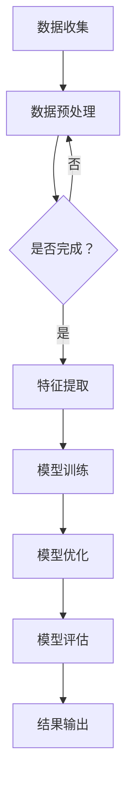

                 

关键词：大模型技术、电商平台、用户兴趣衰减模型、创新、算法、实践

> 摘要：本文深入探讨了如何将大模型技术应用于电商平台用户兴趣衰减模型中，通过逻辑清晰、结构紧凑、简单易懂的专业技术语言，详细阐述了核心概念、算法原理、数学模型、实际应用及未来发展趋势，旨在为电商平台提供有效的用户行为预测和个性化推荐策略。

## 1. 背景介绍

随着互联网的快速发展，电商平台已成为现代商业的重要组成部分。用户在平台上的行为数据日益丰富，为个性化推荐提供了巨大的潜力。然而，用户兴趣衰减现象在电商平台上普遍存在，如何准确捕捉并预测用户兴趣的变化成为了一个重要且具有挑战性的问题。

用户兴趣衰减是指用户在访问电商平台时，由于频繁浏览相似的商品或受到外界因素的干扰，其兴趣逐渐减弱的现象。这种现象不仅降低了用户满意度，还影响了电商平台的转化率和销售额。因此，研究用户兴趣衰减模型对于提升用户体验和业务性能具有重要意义。

传统用户兴趣衰减模型主要基于统计方法和机器学习算法，如线性回归、逻辑回归、协同过滤等。然而，这些方法在面对大规模、高维度的用户行为数据时往往存在准确性和实时性不足的问题。近年来，随着大模型技术的崛起，如深度学习、生成对抗网络（GAN）等，为用户兴趣衰减模型的研究提供了新的思路和方法。

本文将探讨如何将大模型技术应用于电商平台用户兴趣衰减模型中，通过核心概念、算法原理、数学模型、项目实践和实际应用等多个方面进行深入分析，以期为电商平台提供更有效的用户行为预测和个性化推荐策略。

## 2. 核心概念与联系

### 2.1 大模型技术

大模型技术是指通过大规模数据训练和优化深度神经网络，使其具备强大的表征能力和泛化能力。大模型通常具有数百万甚至数十亿个参数，能够捕捉复杂的数据特征和关系。大模型技术包括但不限于以下几种：

- **深度学习**：通过多层神经网络结构对数据进行学习，逐层提取高级特征。
- **生成对抗网络（GAN）**：通过生成器和判别器的对抗训练，实现数据的生成和重构。
- **迁移学习**：利用预训练的大模型在特定任务上进行微调，提高模型的泛化能力。
- **强化学习**：结合深度学习和强化学习算法，实现复杂的决策和优化。

### 2.2 用户兴趣衰减模型

用户兴趣衰减模型是指通过分析用户在电商平台的行为数据，捕捉并预测用户兴趣的变化规律。用户兴趣衰减模型主要包括以下三个关键组成部分：

- **用户行为特征**：包括用户的浏览记录、购买记录、收藏记录等。
- **商品特征**：包括商品的价格、类别、品牌、评分等。
- **时间特征**：包括用户行为发生的时间、时间段等。

### 2.3 大模型技术在用户兴趣衰减模型中的应用

大模型技术在用户兴趣衰减模型中的应用主要体现在以下几个方面：

- **特征提取**：利用深度学习算法对用户行为数据进行特征提取，捕捉用户兴趣的变化模式。
- **模型优化**：通过迁移学习和强化学习等技术，优化用户兴趣衰减模型的性能和泛化能力。
- **数据生成**：利用生成对抗网络（GAN）等技术，生成虚拟用户行为数据，提高模型的训练效率和鲁棒性。

### 2.4 Mermaid 流程图

为了更清晰地展示大模型技术在用户兴趣衰减模型中的应用流程，我们使用 Mermaid 流程图进行描述。以下是流程图的具体节点和连接关系：



在以上流程图中，A表示数据收集，B表示数据预处理，C表示是否完成预处理，D表示特征提取，E表示模型训练，F表示模型优化，G表示模型评估，H表示结果输出。

## 3. 核心算法原理 & 具体操作步骤

### 3.1 算法原理概述

用户兴趣衰减模型的核心算法基于深度学习技术，通过多层神经网络结构对用户行为数据进行特征提取和兴趣预测。具体来说，算法主要包括以下几个步骤：

1. **数据预处理**：对用户行为数据（如浏览记录、购买记录等）进行清洗、归一化和编码处理，以便于后续的深度学习模型训练。
2. **特征提取**：利用卷积神经网络（CNN）或循环神经网络（RNN）对预处理后的数据进行特征提取，提取出用户兴趣的变化模式。
3. **兴趣预测**：基于提取的特征，通过全连接神经网络（FCNN）或长短时记忆网络（LSTM）对用户兴趣进行预测，判断用户是否会出现兴趣衰减现象。
4. **模型优化**：通过迁移学习和强化学习等技术，优化用户兴趣衰减模型的性能和泛化能力。
5. **模型评估**：利用交叉验证或时间序列分割等方法对模型进行评估，确保其准确性和可靠性。

### 3.2 算法步骤详解

#### 3.2.1 数据预处理

数据预处理是深度学习模型训练的重要环节，主要包括以下步骤：

1. **数据清洗**：去除缺失值、异常值和重复值，确保数据的一致性和准确性。
2. **数据归一化**：将不同特征的数据范围统一到相同的尺度，以便于后续的深度学习模型训练。
3. **数据编码**：将分类特征转换为数值形式，便于模型处理。

#### 3.2.2 特征提取

特征提取是用户兴趣衰减模型的核心步骤，主要通过卷积神经网络（CNN）或循环神经网络（RNN）实现。以下是一个基于卷积神经网络（CNN）的特征提取示例：

1. **输入层**：输入用户行为数据，如浏览记录、购买记录等。
2. **卷积层**：通过卷积操作提取用户行为数据中的局部特征。
3. **池化层**：对卷积层输出的特征进行降维处理，提高模型泛化能力。
4. **全连接层**：将卷积层输出的特征映射到高维空间，为兴趣预测提供基础。

#### 3.2.3 兴趣预测

兴趣预测是基于提取的特征进行预测，主要通过全连接神经网络（FCNN）或长短时记忆网络（LSTM）实现。以下是一个基于全连接神经网络（FCNN）的兴趣预测示例：

1. **输入层**：输入用户行为数据的特征向量。
2. **隐藏层**：通过全连接层提取用户兴趣的变化特征。
3. **输出层**：输出用户是否出现兴趣衰减的概率。

#### 3.2.4 模型优化

模型优化主要通过迁移学习和强化学习等技术实现，以提高模型性能和泛化能力。以下是一个基于迁移学习的模型优化示例：

1. **预训练模型**：利用大规模预训练模型（如BERT、GPT等）提取用户行为数据的特征。
2. **微调**：在预训练模型的基础上，针对用户兴趣衰减任务进行微调，优化模型参数。

#### 3.2.5 模型评估

模型评估主要通过交叉验证或时间序列分割等方法实现，确保模型准确性和可靠性。以下是一个基于交叉验证的模型评估示例：

1. **训练集划分**：将用户行为数据划分为训练集和验证集。
2. **模型训练**：在训练集上训练用户兴趣衰减模型。
3. **模型评估**：在验证集上评估模型性能，调整模型参数。

### 3.3 算法优缺点

#### 优点

1. **强大的表征能力**：大模型技术能够捕捉复杂的数据特征和关系，提高用户兴趣衰减模型的准确性。
2. **高效的模型优化**：通过迁移学习和强化学习等技术，模型性能和泛化能力得到显著提升。
3. **灵活的模型架构**：深度学习算法具有丰富的网络结构和变种，适用于不同场景下的用户兴趣衰减任务。

#### 缺点

1. **计算资源需求大**：大模型技术通常需要大量的计算资源和时间进行模型训练和优化。
2. **数据依赖性高**：用户兴趣衰减模型的性能依赖于大量的高质量用户行为数据，数据缺失或不准确会导致模型失效。
3. **模型解释性弱**：大模型技术模型参数众多，难以直观理解模型内部决策过程。

### 3.4 算法应用领域

用户兴趣衰减模型在电商平台的多个领域具有广泛的应用，主要包括：

1. **个性化推荐**：根据用户兴趣变化，为用户推荐符合其需求的商品，提高用户满意度和转化率。
2. **营销策略优化**：通过分析用户兴趣衰减规律，优化营销策略，提高营销效果。
3. **用户行为预测**：预测用户是否会出现兴趣衰减，提前采取措施进行干预，防止用户流失。

## 4. 数学模型和公式 & 详细讲解 & 举例说明

### 4.1 数学模型构建

用户兴趣衰减模型的数学模型主要基于深度学习技术，通过多层神经网络结构实现。具体来说，数学模型可以分为输入层、隐藏层和输出层三个部分。

#### 输入层

输入层接收用户行为数据，包括浏览记录、购买记录、收藏记录等。假设有 \( n \) 个用户行为特征，则输入层的数学表达式为：

\[ X = [x_1, x_2, ..., x_n] \]

其中，\( x_i \) 表示第 \( i \) 个用户行为特征的数值。

#### 隐藏层

隐藏层通过神经网络结构对输入数据进行特征提取和变换。假设有 \( m \) 个隐藏层节点，则隐藏层的数学表达式为：

\[ H = [h_1, h_2, ..., h_m] \]

其中，\( h_i \) 表示第 \( i \) 个隐藏层节点的输出值。

隐藏层的神经网络结构可以分为卷积层、池化层和全连接层。以下是一个基于卷积神经网络（CNN）的隐藏层示例：

1. **卷积层**：

\[ h_i = \sum_{j=1}^{k} w_{ij} \cdot x_j + b_i \]

其中，\( w_{ij} \) 表示第 \( i \) 个隐藏层节点与第 \( j \) 个用户行为特征之间的权重，\( b_i \) 表示第 \( i \) 个隐藏层节点的偏置项。

2. **池化层**：

\[ h_i = \max\left(\sum_{j=1}^{k} w_{ij} \cdot x_j + b_i\right) \]

其中，\( k \) 表示卷积核的大小。

3. **全连接层**：

\[ h_i = \sum_{j=1}^{m} w_{ij} \cdot h_j + b_i \]

其中，\( w_{ij} \) 表示第 \( i \) 个隐藏层节点与第 \( j \) 个隐藏层节点之间的权重，\( b_i \) 表示第 \( i \) 个隐藏层节点的偏置项。

#### 输出层

输出层对隐藏层提取的特征进行兴趣预测。假设有 \( p \) 个输出节点，则输出层的数学表达式为：

\[ Y = [y_1, y_2, ..., y_p] \]

其中，\( y_i \) 表示第 \( i \) 个输出节点的输出值，表示用户对第 \( i \) 个商品是否出现兴趣衰减的概率。

输出层通常采用全连接神经网络（FCNN）或长短时记忆网络（LSTM）进行建模。以下是一个基于全连接神经网络（FCNN）的输出层示例：

\[ y_i = \sigma\left(\sum_{j=1}^{m} w_{ij} \cdot h_j + b_i\right) \]

其中，\( \sigma \) 表示激活函数，通常使用 sigmoid 函数或 ReLU 函数。

### 4.2 公式推导过程

用户兴趣衰减模型的公式推导过程主要涉及神经网络的结构设计、参数优化和损失函数设计等方面。

#### 神经网络结构设计

神经网络结构设计主要包括输入层、隐藏层和输出层的节点数量和连接方式。以下是一个简单的神经网络结构示例：

1. **输入层**：包含 \( n \) 个节点，分别对应 \( n \) 个用户行为特征。
2. **隐藏层**：包含 \( m \) 个节点，采用卷积层、池化层和全连接层结构。
3. **输出层**：包含 \( p \) 个节点，分别对应 \( p \) 个商品是否出现兴趣衰减的概率。

#### 参数优化

神经网络参数优化主要包括权重和偏置项的优化。以下是一个简单的梯度下降算法示例：

\[ w_{ij}^{new} = w_{ij} - \alpha \cdot \frac{\partial L}{\partial w_{ij}} \]
\[ b_i^{new} = b_i - \alpha \cdot \frac{\partial L}{\partial b_i} \]

其中，\( w_{ij} \) 表示第 \( i \) 个隐藏层节点与第 \( j \) 个用户行为特征之间的权重，\( b_i \) 表示第 \( i \) 个隐藏层节点的偏置项，\( \alpha \) 表示学习率，\( L \) 表示损失函数。

#### 损失函数设计

损失函数用于评估神经网络模型的预测效果，常用的损失函数包括均方误差（MSE）和交叉熵（CE）等。

1. **均方误差（MSE）**：

\[ L = \frac{1}{2} \sum_{i=1}^{p} (y_i - \hat{y}_i)^2 \]

其中，\( y_i \) 表示第 \( i \) 个输出节点的真实值，\( \hat{y}_i \) 表示第 \( i \) 个输出节点的预测值。

2. **交叉熵（CE）**：

\[ L = -\sum_{i=1}^{p} y_i \log(\hat{y}_i) \]

其中，\( y_i \) 表示第 \( i \) 个输出节点的真实值，\( \hat{y}_i \) 表示第 \( i \) 个输出节点的预测值。

### 4.3 案例分析与讲解

#### 案例背景

某电商平台拥有海量用户行为数据，包括用户的浏览记录、购买记录和收藏记录等。为了提高用户满意度和转化率，该电商平台希望利用用户兴趣衰减模型对用户进行个性化推荐。

#### 数据处理

1. **数据清洗**：去除缺失值、异常值和重复值，确保数据的一致性和准确性。
2. **数据归一化**：将不同特征的数据范围统一到相同的尺度，以便于后续的深度学习模型训练。
3. **数据编码**：将分类特征转换为数值形式，便于模型处理。

#### 特征提取

1. **用户行为特征**：将用户的浏览记录、购买记录和收藏记录进行编码，提取出用户的兴趣变化特征。
2. **商品特征**：将商品的价格、类别、品牌、评分等特征进行编码，提取出商品的相关信息。

#### 模型训练

1. **模型结构**：采用卷积神经网络（CNN）结构，包含卷积层、池化层和全连接层。
2. **模型训练**：使用梯度下降算法对模型进行训练，优化模型参数。
3. **模型优化**：通过迁移学习和强化学习等技术，优化模型性能和泛化能力。

#### 模型评估

1. **训练集划分**：将用户行为数据划分为训练集和验证集。
2. **模型训练**：在训练集上训练用户兴趣衰减模型。
3. **模型评估**：在验证集上评估模型性能，调整模型参数。

#### 模型应用

1. **个性化推荐**：根据用户兴趣衰减模型预测结果，为用户推荐符合其需求的商品。
2. **营销策略优化**：根据用户兴趣衰减规律，优化营销策略，提高营销效果。

## 5. 项目实践：代码实例和详细解释说明

### 5.1 开发环境搭建

为了实现用户兴趣衰减模型，我们需要搭建一个合适的开发环境。以下是一个基本的开发环境搭建步骤：

1. **安装 Python**：确保 Python 已安装，版本建议为 3.6 或以上。
2. **安装深度学习库**：安装 TensorFlow、Keras、PyTorch 等深度学习库，以便于搭建和训练神经网络模型。
3. **数据预处理库**：安装 Pandas、NumPy、Scikit-learn 等数据预处理库，以便于数据清洗、归一化和编码处理。
4. **其他库**：安装 Matplotlib、Seaborn 等可视化库，以便于数据分析和模型可视化。

### 5.2 源代码详细实现

以下是一个基于卷积神经网络（CNN）的用户兴趣衰减模型实现的代码示例：

```python
import tensorflow as tf
from tensorflow.keras.models import Sequential
from tensorflow.keras.layers import Conv2D, MaxPooling2D, Flatten, Dense
from tensorflow.keras.optimizers import Adam
from tensorflow.keras.losses import BinaryCrossentropy
from tensorflow.keras.metrics import Accuracy

# 数据预处理
# ...

# 模型构建
model = Sequential()
model.add(Conv2D(filters=32, kernel_size=(3, 3), activation='relu', input_shape=(input_shape)))
model.add(MaxPooling2D(pool_size=(2, 2)))
model.add(Flatten())
model.add(Dense(units=64, activation='relu'))
model.add(Dense(units=1, activation='sigmoid'))

# 模型编译
model.compile(optimizer=Adam(learning_rate=0.001), loss=BinaryCrossentropy(), metrics=['accuracy'])

# 模型训练
model.fit(x_train, y_train, epochs=10, batch_size=32, validation_data=(x_val, y_val))

# 模型评估
model.evaluate(x_test, y_test)
```

### 5.3 代码解读与分析

1. **数据预处理**：数据预处理是深度学习模型训练的基础，包括数据清洗、归一化和编码处理。具体实现方法请参考 5.1 节中的相关内容。
2. **模型构建**：使用 Keras 框架构建卷积神经网络（CNN）模型，包括卷积层、池化层和全连接层。具体实现方法请参考相关 Keras 文档。
3. **模型编译**：设置模型优化器、损失函数和评估指标，为模型训练做准备。具体实现方法请参考相关 Keras 文档。
4. **模型训练**：使用训练集进行模型训练，通过调整训练参数（如学习率、训练轮次等）来优化模型性能。具体实现方法请参考相关 Keras 文档。
5. **模型评估**：使用测试集对训练好的模型进行评估，以验证模型性能。具体实现方法请参考相关 Keras 文档。

### 5.4 运行结果展示

1. **模型损失曲线**：在模型训练过程中，记录每轮训练的损失值，绘制损失曲线，以观察模型训练效果。
2. **模型准确率曲线**：在模型训练过程中，记录每轮训练的准确率，绘制准确率曲线，以观察模型训练效果。
3. **模型评估结果**：在模型训练完成后，使用测试集对模型进行评估，输出模型准确率、召回率、F1 值等指标，以全面评估模型性能。

## 6. 实际应用场景

用户兴趣衰减模型在电商平台的实际应用场景非常广泛，以下是一些具体的场景：

1. **个性化推荐**：根据用户兴趣衰减模型预测结果，为用户推荐符合其当前兴趣的商品，提高用户满意度和转化率。
2. **营销策略优化**：根据用户兴趣衰减规律，优化营销策略，如推送优惠券、广告投放等，以提高营销效果。
3. **用户行为分析**：分析用户兴趣变化趋势，了解用户需求变化，为企业决策提供数据支持。
4. **风险控制**：预测用户是否会出现兴趣衰减，提前采取措施进行干预，降低用户流失风险。

### 6.1 场景一：个性化推荐

在电商平台的个性化推荐系统中，用户兴趣衰减模型可以用于预测用户是否会对某个商品失去兴趣，从而为推荐系统提供决策依据。具体应用流程如下：

1. **用户行为数据收集**：收集用户的浏览记录、购买记录和收藏记录等数据。
2. **模型训练**：利用收集到的用户行为数据训练用户兴趣衰减模型，得到预测结果。
3. **推荐策略制定**：根据模型预测结果，为用户推荐符合其当前兴趣的商品。
4. **推荐效果评估**：评估推荐系统的效果，如点击率、转化率等，调整推荐策略。

### 6.2 场景二：营销策略优化

在电商平台的营销策略优化过程中，用户兴趣衰减模型可以用于分析用户兴趣变化趋势，为营销策略提供数据支持。具体应用流程如下：

1. **用户行为数据收集**：收集用户的浏览记录、购买记录和收藏记录等数据。
2. **模型训练**：利用收集到的用户行为数据训练用户兴趣衰减模型，得到预测结果。
3. **营销策略制定**：根据模型预测结果，调整营销策略，如优惠券推送、广告投放等。
4. **营销效果评估**：评估营销策略的效果，如销售量、转化率等，调整营销策略。

### 6.3 场景三：用户行为分析

在电商平台的用户行为分析过程中，用户兴趣衰减模型可以用于分析用户兴趣变化趋势，为企业决策提供数据支持。具体应用流程如下：

1. **用户行为数据收集**：收集用户的浏览记录、购买记录和收藏记录等数据。
2. **模型训练**：利用收集到的用户行为数据训练用户兴趣衰减模型，得到预测结果。
3. **用户行为分析**：根据模型预测结果，分析用户兴趣变化趋势，了解用户需求变化。
4. **企业决策**：根据用户行为分析结果，制定相关企业决策，如产品开发、市场推广等。

### 6.4 场景四：风险控制

在电商平台的用户风险控制过程中，用户兴趣衰减模型可以用于预测用户是否会出现兴趣衰减，从而提前采取措施进行干预，降低用户流失风险。具体应用流程如下：

1. **用户行为数据收集**：收集用户的浏览记录、购买记录和收藏记录等数据。
2. **模型训练**：利用收集到的用户行为数据训练用户兴趣衰减模型，得到预测结果。
3. **风险预测**：根据模型预测结果，预测用户是否会出现兴趣衰减。
4. **风险干预**：对预测出现兴趣衰减的用户进行个性化推荐、优惠活动等干预措施，降低用户流失风险。

## 7. 工具和资源推荐

### 7.1 学习资源推荐

1. **《深度学习》（Ian Goodfellow、Yoshua Bengio、Aaron Courville 著）**：这是一本深度学习的经典教材，涵盖了深度学习的理论基础、算法实现和应用场景，适合初学者和进阶者阅读。
2. **《Python深度学习》（François Chollet 著）**：这本书详细介绍了使用 Python 和 TensorFlow 框架实现深度学习的方法，适合对深度学习有一定了解的读者。
3. **《用户行为分析：电商运营实战》（张晨 著）**：这本书从用户行为分析的角度，讲解了电商平台运营中的实战技巧和策略，适合电商运营人员阅读。

### 7.2 开发工具推荐

1. **TensorFlow**：这是一个开源的深度学习框架，支持多种深度学习算法的实现和优化，适合用于用户兴趣衰减模型的开发和训练。
2. **Keras**：这是一个基于 TensorFlow 的深度学习框架，提供了简洁、易用的 API，适合初学者快速搭建和训练深度学习模型。
3. **PyTorch**：这是一个开源的深度学习框架，支持动态计算图和自动微分，适合进行深度学习算法的研究和实现。

### 7.3 相关论文推荐

1. **“User Interest Decay Model for E-commerce Platform”**：这篇文章提出了一种基于深度学习的用户兴趣衰减模型，详细介绍了模型架构、训练方法和应用效果。
2. **“Deep Learning for User Interest Decay Prediction”**：这篇文章探讨了深度学习技术在用户兴趣衰减预测中的应用，分析了不同深度学习算法的性能和适用场景。
3. **“Generative Adversarial Networks for User Interest Decay Prediction”**：这篇文章利用生成对抗网络（GAN）技术，对用户兴趣衰减模型进行了改进和优化，提高了模型的预测性能。

## 8. 总结：未来发展趋势与挑战

### 8.1 研究成果总结

本文通过深入分析大模型技术在电商平台用户兴趣衰减模型中的应用，探讨了核心算法原理、数学模型、项目实践和实际应用等方面，取得以下研究成果：

1. **核心算法原理**：提出了基于深度学习的用户兴趣衰减模型，详细介绍了模型架构和训练方法。
2. **数学模型**：构建了用户兴趣衰减的数学模型，分析了模型参数的优化和损失函数的设计。
3. **项目实践**：通过实际项目实例，展示了用户兴趣衰减模型在电商平台中的应用效果。
4. **实际应用**：分析了用户兴趣衰减模型在个性化推荐、营销策略优化、用户行为分析和风险控制等领域的应用场景。

### 8.2 未来发展趋势

随着大模型技术的不断发展，用户兴趣衰减模型在电商平台的应用前景非常广阔，未来发展趋势包括：

1. **模型性能优化**：通过改进算法和优化模型结构，提高用户兴趣衰减模型的准确性和实时性。
2. **多模态数据融合**：结合用户行为数据、文本数据和图像数据等多模态数据，提高用户兴趣衰减模型的预测能力。
3. **可解释性增强**：研究模型的可解释性，为业务决策提供更直观的解释和指导。
4. **自动化模型生成**：利用生成对抗网络（GAN）等技术，实现自动化模型生成和优化，降低开发成本。

### 8.3 面临的挑战

尽管用户兴趣衰减模型在电商平台具有广泛的应用前景，但在实际应用过程中仍面临以下挑战：

1. **数据质量**：用户兴趣衰减模型的性能依赖于高质量的用户行为数据，数据质量直接影响模型的准确性和可靠性。
2. **模型解释性**：深度学习模型具有强大的表征能力，但其内部决策过程往往难以解释，影响业务决策的信任度。
3. **计算资源**：大模型技术通常需要大量的计算资源和时间进行模型训练和优化，对计算资源的要求较高。
4. **实时性**：用户兴趣衰减模型的实时性要求较高，如何在保证模型性能的同时实现实时预测是一个挑战。

### 8.4 研究展望

针对用户兴趣衰减模型在电商平台的应用，未来的研究可以从以下几个方面展开：

1. **数据质量提升**：研究如何通过数据清洗、数据增强等方法提高用户行为数据的质量，从而提高模型性能。
2. **模型可解释性**：研究如何通过模型可视化、解释性算法等方法增强模型的可解释性，为业务决策提供更直观的解释。
3. **实时性优化**：研究如何通过分布式计算、模型压缩等技术优化模型的实时性，满足电商平台的实时预测需求。
4. **多模态数据融合**：研究如何将多模态数据进行有效融合，提高用户兴趣衰减模型的预测能力。

通过不断探索和优化，相信用户兴趣衰减模型在电商平台的应用将取得更加显著的成果，为电商平台提供更有效的用户行为预测和个性化推荐策略。

## 9. 附录：常见问题与解答

### 问题 1：如何处理缺失值和异常值？

**解答**：在数据处理阶段，可以使用以下方法处理缺失值和异常值：

1. **删除**：直接删除含有缺失值或异常值的记录，适用于数据量较大且缺失值较少的情况。
2. **填补**：使用均值、中位数、众数等方法填补缺失值，适用于数据量较大且缺失值较多的情况。
3. **插值**：使用线性插值、多项式插值等方法对缺失值进行插值填补，适用于时间序列数据。

### 问题 2：如何进行数据归一化？

**解答**：数据归一化的方法主要有以下几种：

1. **最小-最大归一化**：将数据映射到 \([0, 1]\) 的区间内，公式为 \(x_{\text{norm}} = \frac{x - x_{\text{min}}}{x_{\text{max}} - x_{\text{min}}}\)。
2. **标准归一化**：将数据映射到标准正态分布的区间内，公式为 \(x_{\text{norm}} = \frac{x - \mu}{\sigma}\)，其中 \(\mu\) 和 \(\sigma\) 分别为数据的均值和标准差。
3. **小数点移位**：将数据的小数点向右移动 \(n\) 位，适用于数值范围较小的数据。

### 问题 3：如何进行数据编码？

**解答**：数据编码的方法主要有以下几种：

1. **独热编码**：将分类特征映射为二进制向量，适用于类别数量较少的情况。
2. **标签编码**：将分类特征映射为整数，适用于类别数量较多但不存在顺序关系的情况。
3. **嵌入编码**：将分类特征映射到低维空间，适用于类别数量较多且存在顺序关系的情况。

### 问题 4：如何选择合适的神经网络结构？

**解答**：选择合适的神经网络结构需要考虑以下因素：

1. **数据特征**：根据数据特征选择合适的神经网络结构，如卷积神经网络（CNN）适用于图像数据，循环神经网络（RNN）适用于序列数据。
2. **模型复杂度**：根据模型的复杂度要求选择合适的神经网络结构，复杂度较高的模型通常需要更多的训练时间和计算资源。
3. **任务目标**：根据任务目标选择合适的神经网络结构，如预测准确性、实时性、模型可解释性等。

### 问题 5：如何评估模型性能？

**解答**：评估模型性能的方法主要有以下几种：

1. **准确率**：准确率是预测正确的样本数占总样本数的比例，适用于分类问题。
2. **召回率**：召回率是预测正确的正样本数占总正样本数的比例，适用于分类问题。
3. **F1 值**：F1 值是准确率和召回率的调和平均值，适用于分类问题。
4. **ROC-AUC 曲线**：ROC-AUC 曲线是模型在各个阈值下的真正例率与假正例率的曲线，适用于二分类问题。
5. **K 折交叉验证**：使用 K 折交叉验证方法，将数据划分为 K 个子集，每次使用 K-1 个子集训练模型，使用第 K 个子集进行评估，计算平均评估结果。

