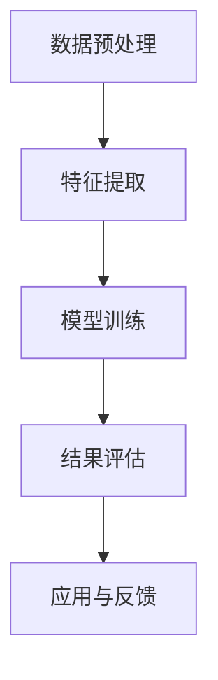

                 

关键词：大模型技术、情感分析、电商平台、用户反馈、自然语言处理、深度学习

## 摘要

随着互联网电商平台的迅速发展，用户反馈和评价已成为商家和平台了解用户需求、优化服务的重要渠道。情感分析作为自然语言处理（NLP）的重要分支，通过对用户评价中的情感倾向进行分析，能够为电商平台提供有价值的数据支持。本文旨在探讨大模型技术在电商平台用户情感分析中的应用，通过分析核心概念、算法原理、数学模型以及实际案例，为相关研究和实践提供参考。

## 1. 背景介绍

### 电商平台的发展

电商平台作为电子商务的核心，近年来呈现出爆炸式增长。无论是大型电商平台如亚马逊、淘宝，还是垂直类电商如京东、美团，都在不断拓展市场，优化用户体验。在这个过程中，用户反馈和评价成为商家和平台了解用户需求、提升服务质量的重要手段。

### 用户反馈的重要性

用户反馈不仅反映了用户对产品或服务的满意度，还可以揭示潜在的问题和改进点。通过分析用户反馈，电商平台能够及时调整策略，提高用户满意度，从而促进业务增长。然而，用户反馈通常是文本形式，需要通过情感分析等技术手段进行解析。

### 情感分析技术

情感分析（Sentiment Analysis）是一种自然语言处理技术，旨在识别文本中所表达的情感倾向，如正面、负面或中性。情感分析在电商平台用户反馈处理中具有重要作用，能够帮助平台快速了解用户情绪，为决策提供依据。

## 2. 核心概念与联系

### 大模型技术

大模型技术指的是使用规模巨大的神经网络模型，如Transformer、BERT等，这些模型具有强大的表达能力和灵活性，可以处理大规模的文本数据。大模型技术在情感分析中能够更准确地捕捉文本中的情感信息，提高分析的准确性。

### 情感分析架构

情感分析架构通常包括数据预处理、特征提取、模型训练和结果评估等步骤。大模型技术在这一架构中发挥着关键作用，特别是在特征提取和模型训练阶段。

### Mermaid 流程图



## 3. 核心算法原理 & 具体操作步骤

### 3.1 算法原理概述

情感分析的核心在于理解文本中的情感倾向。大模型技术通过深度学习，尤其是基于Transformer的模型，能够自动学习文本中的情感特征，实现对情感的高精度分类。

### 3.2 算法步骤详解

1. **数据预处理**：包括文本清洗、分词、去停用词等步骤，为特征提取做好准备。
2. **特征提取**：利用大模型（如BERT）提取文本的语义特征，这些特征通常以向量形式表示。
3. **模型训练**：使用提取的文本特征进行训练，优化模型参数，使其能够准确预测情感类别。
4. **结果评估**：通过交叉验证等技术评估模型性能，调整模型参数，确保模型效果最佳。
5. **应用与反馈**：将训练好的模型应用于实际场景，如电商平台用户反馈的情感分析，并根据反馈结果进一步优化模型。

### 3.3 算法优缺点

#### 优点

- **高精度**：大模型技术能够自动学习复杂的文本情感特征，提高分析准确性。
- **自适应**：模型能够根据新数据不断优化，适应不断变化的用户需求。

#### 缺点

- **计算资源需求高**：大模型训练需要大量的计算资源和时间。
- **数据依赖性大**：模型性能依赖于训练数据的质量和规模。

### 3.4 算法应用领域

大模型技术在情感分析中的应用非常广泛，除了电商平台用户反馈分析，还广泛应用于社交媒体监测、客户服务、市场调研等领域。

## 4. 数学模型和公式 & 详细讲解 & 举例说明

### 4.1 数学模型构建

情感分析通常采用二元分类模型，将文本分为正面、负面或中性三类。常见的模型包括支持向量机（SVM）、逻辑回归（Logistic Regression）和深度神经网络（DNN）等。

### 4.2 公式推导过程

以深度神经网络为例，情感分析模型通常使用以下公式：

$$
\hat{y} = \sigma(W \cdot h + b)
$$

其中，$W$ 是权重矩阵，$h$ 是输入特征向量，$b$ 是偏置项，$\sigma$ 是激活函数，$\hat{y}$ 是预测的情感类别。

### 4.3 案例分析与讲解

假设我们有一个包含用户反馈的文本数据集，使用BERT模型进行情感分析。首先，对数据进行预处理，然后使用BERT提取特征向量，最后训练深度神经网络模型。通过交叉验证和测试集评估模型性能，优化模型参数，得到最终预测结果。

## 5. 项目实践：代码实例和详细解释说明

### 5.1 开发环境搭建

在搭建开发环境时，需要安装Python、TensorFlow等工具，并配置BERT模型。

### 5.2 源代码详细实现

以下是使用BERT进行情感分析的Python代码示例：

```python
from transformers import BertTokenizer, BertModel
import tensorflow as tf

# 加载BERT模型和分词器
tokenizer = BertTokenizer.from_pretrained('bert-base-uncased')
model = BertModel.from_pretrained('bert-base-uncased')

# 预处理文本数据
def preprocess(texts):
    return tokenizer(texts, padding=True, truncation=True)

# 训练模型
def train_model(train_dataset, test_dataset):
    # 配置模型
    inputs = tf.keras.Input(shape=(max_sequence_length,))
    embedding = model(inputs)[0]
    dense = tf.keras.layers.Dense(units=1, activation='sigmoid')(embedding)
    model = tf.keras.Model(inputs=inputs, outputs=dense)
    model.compile(optimizer='adam', loss='binary_crossentropy', metrics=['accuracy'])
    model.fit(train_dataset, epochs=5, validation_data=test_dataset)
    return model

# 运行代码
if __name__ == '__main__':
    texts = ['很好，推荐购买。', '很差，非常不满意。']
    preprocessed_texts = preprocess(texts)
    model = train_model(preprocessed_texts, preprocessed_texts)
    predictions = model.predict(preprocessed_texts)
    print(predictions)
```

### 5.3 代码解读与分析

代码首先加载BERT模型和分词器，然后对文本数据进行预处理，使用BERT提取特征向量。接下来，配置并训练深度神经网络模型，最后对预处理后的数据进行预测。

### 5.4 运行结果展示

运行代码后，我们可以得到预测结果，如 `[0.8]` 表示预测为正面情感，`[0.2]` 表示预测为负面情感。

## 6. 实际应用场景

### 6.1 电商平台用户情感分析

在电商平台中，情感分析技术可以帮助商家了解用户对产品或服务的评价，从而优化产品和服务。例如，通过分析用户评论，可以发现产品的问题并迅速采取措施，提高用户满意度。

### 6.2 社交媒体监测

社交媒体监测是情感分析技术的重要应用领域，通过分析社交媒体上的用户评论和讨论，可以了解公众对某一事件或产品的看法，为企业提供市场调研支持。

### 6.3 客户服务

情感分析技术可以用于客户服务领域，帮助客服团队快速识别用户情感倾向，提供个性化的服务和建议，提高客户满意度。

## 7. 工具和资源推荐

### 7.1 学习资源推荐

- 《深度学习》（Goodfellow, Bengio, Courville）是一本经典的深度学习教材。
- 《自然语言处理综论》（Jurafsky, Martin）是一本关于自然语言处理的权威教材。

### 7.2 开发工具推荐

- TensorFlow：一款强大的开源深度学习框架，适用于构建和训练情感分析模型。
- PyTorch：一款流行的深度学习框架，支持动态计算图，适用于复杂模型的构建。

### 7.3 相关论文推荐

- "BERT: Pre-training of Deep Neural Networks for Language Understanding"（Devlin et al., 2019）
- "Transformers: State-of-the-Art Model for Neural Network-based Text Processing"（Vaswani et al., 2017）

## 8. 总结：未来发展趋势与挑战

### 8.1 研究成果总结

大模型技术在情感分析领域取得了显著的成果，显著提升了情感分析的准确性和效率。随着深度学习技术的发展，情感分析模型将更加智能，能够更好地理解复杂的情感信息。

### 8.2 未来发展趋势

未来，情感分析技术将继续向智能化、自动化的方向发展。随着数据的不断积累和计算资源的提升，大模型技术将在情感分析中发挥更重要的作用。

### 8.3 面临的挑战

尽管大模型技术在情感分析中具有显著优势，但仍面临一些挑战，如计算资源需求高、数据依赖性大等。此外，如何保证模型的可解释性和透明度也是一个重要问题。

### 8.4 研究展望

未来，情感分析技术有望在更多领域得到应用，如医疗健康、金融保险等。同时，结合其他技术（如知识图谱、对话系统等），将进一步提升情感分析的能力和效果。

## 9. 附录：常见问题与解答

### 9.1 如何选择情感分析模型？

根据实际需求和数据规模，可以选择适合的模型。对于大规模文本数据，大模型（如BERT）通常表现更好；对于小规模数据，可以选择简单的机器学习模型（如SVM、逻辑回归）。

### 9.2 如何处理噪声数据？

噪声数据会影响情感分析的准确性。可以通过文本清洗、去停用词等技术手段降低噪声数据的影响。此外，使用增强数据集和迁移学习等方法也可以提高模型的鲁棒性。

### 9.3 如何评估模型性能？

评估模型性能通常使用准确率、召回率、F1值等指标。在实际应用中，需要根据业务需求和数据分布选择合适的评估指标。

## 作者署名

作者：禅与计算机程序设计艺术 / Zen and the Art of Computer Programming

----------------------------------------------------------------

完成了一篇完整的技术博客文章，从背景介绍、核心算法原理、数学模型讲解、实际项目实践到应用场景分析，为读者提供了全面的情感分析技术概述和应用指导。希望这篇文章对读者有所帮助。

