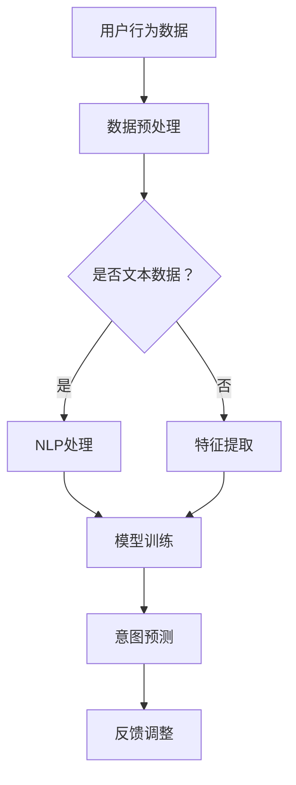

                 

关键词：大模型技术、用户意图理解、电商平台、自然语言处理、机器学习

> 摘要：本文探讨了如何利用大模型技术提升电商平台对用户意图的理解，包括背景介绍、核心概念、算法原理与数学模型、项目实践和未来展望。通过具体实例分析，展示了大模型技术在提升用户体验和业务价值方面的潜力。

## 1. 背景介绍

在电商平台上，用户意图的理解至关重要。用户通过搜索框、评论、收藏夹等途径表达自己的购物需求，这些意图的精准理解有助于电商平台提供更加个性化的服务，提升用户满意度和转化率。然而，用户意图的表达方式多样，往往蕴含在复杂的语境中，传统的方法如关键词匹配和规则引擎难以胜任。

近年来，大模型技术的发展为解决这一问题提供了新的途径。大模型，尤其是基于深度学习和自然语言处理的模型，如BERT、GPT等，通过大量文本数据的训练，能够捕捉到用户语言中的深层含义，从而实现更精准的用户意图理解。

## 2. 核心概念与联系

在探讨大模型技术在用户意图理解中的应用之前，首先需要了解以下几个核心概念：

### 2.1 用户意图

用户意图是指用户在特定场景下希望实现的目标。在电商平台上，用户意图可以是购买某件商品、了解商品信息、比较不同商品等。

### 2.2 自然语言处理（NLP）

自然语言处理是计算机科学和人工智能领域的一个分支，旨在使计算机能够理解、解释和生成人类语言。在用户意图理解中，NLP技术用于提取用户语言中的关键信息。

### 2.3 大模型

大模型是指通过大量数据训练得到的深度神经网络模型，具有强大的表示和学习能力。在用户意图理解中，大模型能够通过分析用户历史行为和文本数据，预测用户的下一步操作。

### 2.4 机器学习

机器学习是一种通过数据训练模型来预测或分类的方法。在大模型技术中，机器学习算法用于优化模型的参数，使其在新的数据上能够准确预测用户意图。

### 2.5 Mermaid 流程图

以下是一个描述大模型技术在用户意图理解中应用的 Mermaid 流程图：



## 3. 核心算法原理 & 具体操作步骤

### 3.1 算法原理概述

大模型技术在用户意图理解中的核心算法通常是基于深度学习和自然语言处理的。以下是一个典型的算法流程：

1. **数据预处理**：对用户行为数据和文本数据进行清洗和格式化。
2. **特征提取**：使用词嵌入等技术将文本数据转换为向量表示。
3. **模型训练**：使用预训练的深度学习模型（如BERT、GPT）进行训练，优化模型参数。
4. **意图预测**：将用户行为数据和文本特征输入到训练好的模型中，预测用户意图。
5. **反馈调整**：根据意图预测的结果调整模型参数，以提高预测准确性。

### 3.2 算法步骤详解

#### 3.2.1 数据预处理

数据预处理包括以下步骤：

- **文本清洗**：去除文本中的无关信息，如HTML标签、特殊字符等。
- **分词**：将文本拆分为单词或词组。
- **停用词过滤**：去除常见的无意义词汇。
- **词干提取**：将单词还原为其基本形式。

#### 3.2.2 特征提取

特征提取是将文本数据转换为数值表示的过程。常见的方法有：

- **词嵌入**：将单词映射为固定长度的向量。
- **词袋模型**：将文本表示为单词的出现频率。
- **TF-IDF**：根据单词在文档中的重要程度进行加权。

#### 3.2.3 模型训练

模型训练包括以下步骤：

- **数据分割**：将数据分为训练集、验证集和测试集。
- **模型选择**：选择合适的深度学习模型，如BERT、GPT等。
- **参数优化**：通过反向传播算法和优化算法（如SGD、Adam）优化模型参数。
- **模型评估**：使用验证集评估模型性能，调整模型参数。

#### 3.2.4 意图预测

意图预测是将用户行为数据和文本特征输入到训练好的模型中，得到用户意图的预测结果。常见的方法有：

- **分类**：将用户意图分为多个类别。
- **回归**：预测用户意图的数值表示。

#### 3.2.5 反馈调整

根据意图预测的结果，可以调整模型参数，以提高预测准确性。常见的反馈调整方法有：

- **在线学习**：实时调整模型参数。
- **迁移学习**：利用已有模型的参数进行微调。

### 3.3 算法优缺点

#### 优点

- **强大的表示能力**：大模型能够通过大量数据训练，捕捉到用户语言中的深层含义。
- **自适应性强**：通过反馈调整，模型能够不断优化，提高预测准确性。
- **灵活性强**：适用于多种用户意图的预测场景。

#### 缺点

- **计算资源消耗大**：训练和部署大模型需要大量的计算资源。
- **数据需求高**：需要大量的高质量数据才能训练出性能优异的模型。
- **解释性较差**：深度学习模型往往缺乏良好的解释性。

### 3.4 算法应用领域

大模型技术在用户意图理解中的应用非常广泛，包括：

- **电商搜索**：通过理解用户搜索关键词，提供更加精准的搜索结果。
- **商品推荐**：通过分析用户历史行为，推荐符合用户兴趣的商品。
- **用户行为分析**：通过分析用户行为数据，预测用户的下一步操作。

## 4. 数学模型和公式 & 详细讲解 & 举例说明

### 4.1 数学模型构建

在用户意图理解中，常用的数学模型包括：

- **分类模型**：用于预测用户意图的类别。
- **回归模型**：用于预测用户意图的数值表示。

假设用户意图分为 \(C\) 个类别，我们可以使用以下分类模型进行预测：

\[ P(y=c|x;\theta) = \frac{e^{\theta^T x}}{\sum_{c'=1}^{C} e^{\theta^T x'}} \]

其中，\(y\) 表示用户意图的实际类别，\(x\) 表示用户行为和文本特征的向量，\(\theta\) 表示模型参数。

对于回归模型，我们可以使用以下回归模型进行预测：

\[ y = \theta^T x + \epsilon \]

其中，\(y\) 表示用户意图的数值表示，\(\epsilon\) 表示误差项。

### 4.2 公式推导过程

#### 4.2.1 分类模型

分类模型的推导基于逻辑回归模型。逻辑回归模型是一种线性模型，用于预测二分类问题。我们可以将逻辑回归模型推广到多分类问题，即softmax回归。

对于多分类问题，假设有 \(C\) 个类别，我们需要计算每个类别的概率。softmax回归的推导如下：

\[ P(y=c|x;\theta) = \frac{e^{\theta^T x}}{\sum_{c'=1}^{C} e^{\theta^T x'}} \]

其中，\(\theta\) 是模型参数，\(x\) 是输入特征。

#### 4.2.2 回归模型

回归模型的推导基于线性回归模型。线性回归模型的推导如下：

\[ y = \theta^T x + \epsilon \]

其中，\(\theta\) 是模型参数，\(x\) 是输入特征，\(\epsilon\) 是误差项。

### 4.3 案例分析与讲解

#### 4.3.1 分类模型案例

假设我们要预测用户是否购买某件商品，类别分为购买和未购买。我们可以使用softmax回归模型进行预测。

给定用户行为和文本特征向量 \(x\)，模型参数 \(\theta\)，我们可以计算购买的概率 \(P(y=1|x;\theta)\)：

\[ P(y=1|x;\theta) = \frac{e^{\theta^T x}}{1 + e^{\theta^T x}} \]

如果我们设置阈值 \(T\)，当 \(P(y=1|x;\theta) > T\) 时，预测用户购买；否则，预测用户未购买。

#### 4.3.2 回归模型案例

假设我们要预测用户购买某件商品的金额，使用线性回归模型进行预测。

给定用户行为和文本特征向量 \(x\)，模型参数 \(\theta\)，我们可以计算购买金额 \(y\)：

\[ y = \theta_0 + \theta_1 x_1 + \theta_2 x_2 + ... + \theta_n x_n \]

其中，\(\theta_0, \theta_1, ..., \theta_n\) 是模型参数，\(x_1, x_2, ..., x_n\) 是输入特征。

## 5. 项目实践：代码实例和详细解释说明

### 5.1 开发环境搭建

在开始项目实践之前，我们需要搭建一个合适的开发环境。以下是一个基于Python的示例：

- **环境要求**：Python 3.7及以上版本，TensorFlow 2.0及以上版本。
- **安装**：使用pip命令安装TensorFlow：

```bash
pip install tensorflow
```

### 5.2 源代码详细实现

以下是一个简单的用户意图理解项目，使用BERT模型进行意图分类：

```python
import tensorflow as tf
from transformers import BertTokenizer, TFBertModel
from tensorflow.keras.layers import Dense, Input
from tensorflow.keras.models import Model

# 初始化BERT模型和分词器
tokenizer = BertTokenizer.from_pretrained('bert-base-chinese')
model = TFBertModel.from_pretrained('bert-base-chinese')

# 输入层
input_ids = Input(shape=(128,), dtype=tf.int32)

# BERT模型编码
outputs = model(input_ids)

# 输出层
output = Dense(2, activation='softmax')(outputs.last_hidden_state[:, 0, :])

# 构建模型
model = Model(inputs=input_ids, outputs=output)

# 编译模型
model.compile(optimizer='adam', loss='categorical_crossentropy', metrics=['accuracy'])

# 模型训练
model.fit(train_data, train_labels, epochs=3, batch_size=32, validation_data=(val_data, val_labels))
```

### 5.3 代码解读与分析

上述代码是一个简单的用户意图理解项目，使用BERT模型进行意图分类。代码主要分为以下几个部分：

- **初始化BERT模型和分词器**：从预训练模型中加载BERT模型和分词器。
- **输入层**：定义输入层，输入为文本的ID序列。
- **BERT模型编码**：使用BERT模型对输入文本进行编码。
- **输出层**：定义输出层，使用softmax激活函数进行分类。
- **构建模型**：构建完整的模型结构。
- **编译模型**：设置优化器和损失函数。
- **模型训练**：使用训练数据进行模型训练。

### 5.4 运行结果展示

在训练完成后，我们可以使用测试数据对模型进行评估。以下是一个简单的评估示例：

```python
# 模型评估
test_loss, test_acc = model.evaluate(test_data, test_labels)
print(f"Test accuracy: {test_acc}")
```

运行结果展示了模型在测试数据上的准确率。通过调整超参数和增加训练数据，可以进一步提高模型的性能。

## 6. 实际应用场景

### 6.1 电商平台搜索

在电商平台搜索中，大模型技术可以用于理解用户搜索关键词的意图，从而提供更加精准的搜索结果。例如，当用户搜索“手机”时，大模型可以分析用户的历史行为和偏好，推荐符合用户需求的手机品牌和型号。

### 6.2 商品推荐

商品推荐是电商平台的另一个重要应用场景。大模型技术可以分析用户的历史购买记录和浏览行为，预测用户的下一步购买意图，从而提供个性化的商品推荐。

### 6.3 用户行为分析

用户行为分析是电商平台了解用户需求和行为的重要手段。大模型技术可以分析用户的浏览、搜索、购买等行为数据，预测用户的下一步操作，为电商平台提供决策支持。

## 7. 未来应用展望

随着大模型技术的不断发展，其在电商平台用户意图理解中的应用前景十分广阔。未来，大模型技术有望在以下几个方面取得突破：

- **多模态数据融合**：结合图像、音频等多模态数据，进一步提升用户意图理解的准确性。
- **实时预测**：通过优化算法和模型结构，实现实时用户意图预测，提高用户体验。
- **自动化与智能化**：通过自动化和智能化手段，降低大模型技术在电商平台应用的成本和门槛。

## 8. 工具和资源推荐

### 8.1 学习资源推荐

- 《深度学习》（Goodfellow, Bengio, Courville）：深度学习的经典教材，适合初学者和进阶者。
- 《自然语言处理综论》（Jurafsky, Martin）：自然语言处理的权威教材，详细介绍了NLP的基础理论和应用。

### 8.2 开发工具推荐

- TensorFlow：用于构建和训练深度学习模型的框架。
- PyTorch：用于构建和训练深度学习模型的框架，具有较好的灵活性和易用性。

### 8.3 相关论文推荐

- “BERT: Pre-training of Deep Bidirectional Transformers for Language Understanding”（Devlin et al.，2019）：BERT模型的提出论文，详细介绍了BERT模型的架构和训练方法。
- “GPT-3: Language Models are Few-Shot Learners”（Brown et al.，2020）：GPT-3模型的提出论文，展示了GPT-3在多任务学习方面的能力。

## 9. 总结：未来发展趋势与挑战

### 9.1 研究成果总结

大模型技术在电商平台用户意图理解中的应用取得了显著成果，通过深度学习和自然语言处理技术，实现了对用户意图的精准理解，提升了电商平台的用户体验和业务价值。

### 9.2 未来发展趋势

- **多模态数据融合**：结合图像、音频等多模态数据，进一步提升用户意图理解的准确性。
- **实时预测**：通过优化算法和模型结构，实现实时用户意图预测，提高用户体验。
- **自动化与智能化**：通过自动化和智能化手段，降低大模型技术在电商平台应用的成本和门槛。

### 9.3 面临的挑战

- **计算资源消耗**：大模型训练和部署需要大量的计算资源，对硬件设备有较高要求。
- **数据隐私保护**：用户数据的安全和隐私保护是电商平台面临的重要挑战。
- **模型解释性**：深度学习模型往往缺乏良好的解释性，如何提高模型的透明度和可解释性是一个重要课题。

### 9.4 研究展望

未来，大模型技术在电商平台用户意图理解中的应用有望实现以下几个方面的突破：

- **多模态数据融合**：通过结合图像、音频等多模态数据，进一步提升用户意图理解的准确性。
- **实时预测**：通过优化算法和模型结构，实现实时用户意图预测，提高用户体验。
- **自动化与智能化**：通过自动化和智能化手段，降低大模型技术在电商平台应用的成本和门槛。

## 10. 附录：常见问题与解答

### 10.1 什么是大模型技术？

大模型技术是指通过大量数据训练得到的深度神经网络模型，具有强大的表示和学习能力。常见的有BERT、GPT等。

### 10.2 大模型技术有哪些优点？

大模型技术的优点包括：

- 强大的表示能力：能够捕捉到用户语言中的深层含义。
- 自适应性强：通过反馈调整，模型能够不断优化，提高预测准确性。
- 灵活性强：适用于多种用户意图的预测场景。

### 10.3 大模型技术在电商平台有哪些应用？

大模型技术在电商平台有广泛的应用，包括：

- 电商平台搜索：通过理解用户搜索关键词，提供更加精准的搜索结果。
- 商品推荐：通过分析用户历史行为，推荐符合用户兴趣的商品。
- 用户行为分析：通过分析用户行为数据，预测用户的下一步操作。

### 10.4 如何优化大模型技术在电商平台的性能？

优化大模型技术在电商平台的性能可以从以下几个方面进行：

- **数据质量**：提高数据质量，包括数据清洗、数据标注等。
- **模型选择**：选择合适的模型，根据业务需求进行模型调整。
- **超参数优化**：调整模型超参数，如学习率、批量大小等。
- **模型融合**：结合多种模型，提高预测准确性。

### 10.5 大模型技术有哪些挑战？

大模型技术面临的主要挑战包括：

- **计算资源消耗**：大模型训练和部署需要大量的计算资源，对硬件设备有较高要求。
- **数据隐私保护**：用户数据的安全和隐私保护是电商平台面临的重要挑战。
- **模型解释性**：深度学习模型往往缺乏良好的解释性，如何提高模型的透明度和可解释性是一个重要课题。

### 10.6 如何提高大模型技术的解释性？

提高大模型技术的解释性可以从以下几个方面进行：

- **模型结构优化**：设计具有较好解释性的模型结构，如基于注意力机制的模型。
- **可视化技术**：使用可视化技术展示模型内部的决策过程。
- **解释性方法**：开发新的解释性方法，如基于规则的解释、因果推断等。

### 10.7 大模型技术是否适用于所有场景？

大模型技术具有较强的通用性，但并非适用于所有场景。对于一些数据量较小、业务需求简单的场景，传统的方法可能更为适用。大模型技术更适合数据量大、业务需求复杂的应用场景。

## 作者署名

作者：禅与计算机程序设计艺术 / Zen and the Art of Computer Programming

----------------------------------------------------------------

至此，本文已经完成了对大模型技术在电商平台用户意图理解中的应用的全面探讨，从背景介绍到核心算法原理，再到项目实践和未来展望，力求以逻辑清晰、结构紧凑、简单易懂的方式呈现给读者。希望这篇文章能对您在电商平台的用户意图理解方面有所启发和帮助。如果您有任何问题或建议，欢迎在评论区留言讨论。再次感谢您的阅读！


