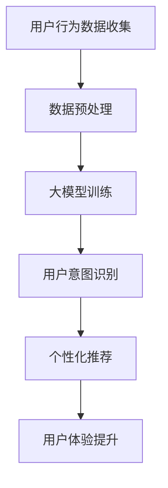

                 

关键词：大模型技术、电商平台、用户意图识别、自然语言处理、机器学习、深度学习

## 摘要

本文将深入探讨大模型技术在电商平台用户意图识别中的应用与创新。随着互联网的快速发展，电商平台成为消费者日常购物的主要渠道。然而，用户在平台上的行为数据纷繁复杂，如何准确识别用户的购物意图成为关键问题。大模型技术，作为一种先进的自然语言处理方法，其在电商平台用户意图识别中的应用带来了巨大的变革。本文将详细介绍大模型技术的基本概念、核心算法原理，以及具体应用实例，旨在为电商平台的运营者和开发者提供有益的参考。

## 1. 背景介绍

### 电商平台的发展现状

随着互联网技术的不断进步，电商平台已经成为人们购物的主要渠道。从早期的传统电商到现在的社交电商、直播电商，电商平台的形式和功能不断演变。据数据显示，全球电商市场在过去几年中呈现出快速增长的趋势，预计未来几年仍将保持较高增长率。电商平台的发展不仅改变了消费者的购物习惯，也对企业的营销策略和服务模式提出了新的要求。

### 用户意图识别的重要性

在电商平台上，用户的行为数据主要包括浏览历史、购买记录、搜索关键词等。这些数据中蕴含着用户的需求和意图。然而，如何从海量数据中准确识别用户的意图，对于电商平台来说是一个巨大的挑战。用户意图识别不仅有助于提升用户体验，还能帮助企业精准营销，提高销售额。

### 大模型技术的崛起

近年来，随着人工智能技术的快速发展，大模型技术逐渐崭露头角。大模型技术主要依赖于深度学习和自然语言处理算法，能够处理大量复杂的文本数据，并从中提取有价值的信息。大模型技术在全球范围内的应用场景越来越广泛，从搜索引擎到智能助手，都取得了显著的成果。在电商平台用户意图识别中，大模型技术同样具备巨大的潜力。

## 2. 核心概念与联系

### 大模型技术

大模型技术是指使用大规模神经网络进行训练和推理的方法。其核心思想是通过大量数据来优化神经网络的参数，使其能够更好地拟合数据分布，从而提高模型的泛化能力。在大模型技术中，常用的神经网络包括循环神经网络（RNN）、变换器（Transformer）等。

### 用户意图识别

用户意图识别是指通过分析用户行为数据，识别用户的购物需求和目标。在电商平台上，用户意图识别有助于实现个性化推荐、精准营销等功能。

### 架构关系

大模型技术与用户意图识别之间存在紧密的联系。大模型技术为用户意图识别提供了强大的计算能力，能够处理复杂、海量的用户行为数据。而用户意图识别则是大模型技术的具体应用场景，通过用户意图识别，电商平台能够更好地满足用户需求，提升用户体验。

### Mermaid 流程图

以下是一个简化的 Mermaid 流程图，展示了大模型技术在电商平台用户意图识别中的应用架构：



## 3. 核心算法原理 & 具体操作步骤

### 3.1 算法原理概述

大模型技术在电商平台用户意图识别中的应用主要依赖于深度学习和自然语言处理技术。其中，深度学习负责处理大规模的数据，并从中提取特征；自然语言处理则负责将用户行为数据转换为机器可理解的形式。

### 3.2 算法步骤详解

1. 数据收集与预处理

   电商平台需要收集用户的行为数据，包括浏览历史、购买记录、搜索关键词等。在数据收集完成后，需要对数据进行预处理，包括数据清洗、数据整合等操作。

2. 大模型训练

   在预处理后的数据上，使用深度学习算法进行模型训练。常见的深度学习算法包括循环神经网络（RNN）、变换器（Transformer）等。通过大量的数据训练，模型能够逐渐学会识别用户的行为模式。

3. 用户意图识别

   在模型训练完成后，使用训练好的模型对新的用户行为数据进行意图识别。通过分析用户的行为特征，模型能够准确识别用户的购物意图。

4. 个性化推荐

   基于识别出的用户意图，电商平台可以提供个性化的推荐服务。个性化推荐有助于提升用户体验，增加用户粘性。

### 3.3 算法优缺点

#### 优点

- 高效：大模型技术能够处理海量数据，提升数据处理效率。
- 准确：深度学习算法能够从数据中提取有效特征，提高用户意图识别的准确性。
- 智能化：基于用户意图的个性化推荐能够提高用户满意度，增加销售额。

#### 缺点

- 资源消耗大：大模型训练需要大量计算资源和存储资源。
- 数据隐私问题：用户行为数据的收集和处理可能涉及隐私问题，需要加强数据安全措施。

### 3.4 算法应用领域

大模型技术在电商平台用户意图识别中的应用非常广泛，包括但不限于：

- 个性化推荐：根据用户的购物历史和浏览行为，为用户推荐感兴趣的商品。
- 智能客服：通过分析用户提问，智能客服系统能够提供更准确的答案。
- 优化广告投放：基于用户意图，精准投放广告，提高广告效果。

## 4. 数学模型和公式 & 详细讲解 & 举例说明

### 4.1 数学模型构建

在用户意图识别中，常用的数学模型包括循环神经网络（RNN）和变换器（Transformer）。以下分别介绍这两种模型的数学模型构建过程。

#### 循环神经网络（RNN）

循环神经网络是一种基于时间序列数据的神经网络，其核心思想是通过隐藏层的状态传递来捕捉时间序列的特征。RNN的数学模型可以表示为：

$$
h_t = \sigma(W_h \cdot [h_{t-1}, x_t] + b_h)
$$

其中，$h_t$表示第$t$个时间步的隐藏层状态，$x_t$表示输入特征，$\sigma$表示激活函数，$W_h$和$b_h$分别为权重和偏置。

#### 变换器（Transformer）

变换器是一种基于注意力机制的深度神经网络，其在处理序列数据时表现出色。变换器的数学模型可以表示为：

$$
\text{Attention}(Q, K, V) = \frac{softmax(\frac{QK^T}{\sqrt{d_k}})}{V}
$$

其中，$Q$、$K$和$V$分别为查询向量、键向量和值向量，$d_k$为键向量的维度。

### 4.2 公式推导过程

以变换器为例，介绍其注意力机制的推导过程。

#### 注意力权重

注意力权重可以通过计算查询向量$Q$和键向量$K$的点积得到。为了防止维度差异，将$Q$和$K$进行线性变换，得到变换后的查询向量和键向量：

$$
\text{Q'} = \text{W}_Q \cdot Q, \quad \text{K'} = \text{W}_K \cdot K
$$

其中，$\text{W}_Q$和$\text{W}_K$为线性变换权重。

#### 点积计算

将变换后的查询向量和键向量进行点积计算，得到注意力权重：

$$
\text{Attention}(Q, K, V) = \frac{softmax(\text{Q'} \cdot \text{K'}^T)}{V}
$$

#### softmax函数

softmax函数用于将注意力权重转换为概率分布。具体公式为：

$$
\text{softmax}(x) = \frac{e^x}{\sum_{i} e^x_i}
$$

### 4.3 案例分析与讲解

以下通过一个简化的例子，说明如何使用变换器进行用户意图识别。

#### 数据集

假设我们有一个包含用户浏览历史和购买记录的数据集，其中每个用户有10个浏览记录和5个购买记录。每个浏览记录和购买记录都可以表示为一个10维的向量。

#### 模型构建

使用变换器模型，将用户浏览历史和购买记录作为输入，输出用户意图识别的结果。具体步骤如下：

1. 将用户浏览历史和购买记录转换为查询向量$Q$、键向量$K$和值向量$V$。
2. 计算注意力权重，得到每个浏览记录和购买记录的重要程度。
3. 根据注意力权重，对浏览记录和购买记录进行加权求和，得到用户意图识别的结果。

#### 模型训练

在训练过程中，使用梯度下降算法优化变换器模型的参数，使模型能够准确识别用户意图。具体训练过程如下：

1. 计算损失函数，评估模型预测结果与实际结果之间的差距。
2. 使用反向传播算法，计算模型参数的梯度。
3. 使用梯度下降算法，更新模型参数。

#### 模型评估

在模型评估阶段，使用测试集数据评估模型性能。常用的评估指标包括准确率、召回率、F1值等。

## 5. 项目实践：代码实例和详细解释说明

### 5.1 开发环境搭建

为了实现大模型技术在电商平台用户意图识别中的创新，我们需要搭建一个完整的开发环境。以下是一个简单的开发环境搭建步骤：

1. 安装Python环境，版本要求3.7及以上。
2. 安装TensorFlow库，版本要求2.4及以上。
3. 安装其他必要的依赖库，如NumPy、Pandas等。

### 5.2 源代码详细实现

以下是一个简化的代码实现，用于演示大模型技术在电商平台用户意图识别中的应用。

```python
import tensorflow as tf
from tensorflow.keras.layers import Embedding, LSTM, Dense
from tensorflow.keras.models import Model

# 数据预处理
def preprocess_data(data):
    # 数据清洗和整合
    # 略
    return processed_data

# 构建模型
def build_model(input_shape):
    inputs = tf.keras.Input(shape=input_shape)
    embeddings = Embedding(input_shape[0], input_shape[1])(inputs)
    lstm = LSTM(units=128, activation='relu')(embeddings)
    outputs = Dense(1, activation='sigmoid')(lstm)
    model = Model(inputs=inputs, outputs=outputs)
    model.compile(optimizer='adam', loss='binary_crossentropy', metrics=['accuracy'])
    return model

# 训练模型
def train_model(model, data, labels):
    model.fit(data, labels, epochs=10, batch_size=32)

# 预测用户意图
def predict_user_intent(model, data):
    predictions = model.predict(data)
    return predictions

# 主函数
if __name__ == '__main__':
    # 加载数据
    data = preprocess_data(raw_data)
    labels = preprocess_labels(raw_labels)

    # 构建模型
    model = build_model(input_shape=(None, 10))

    # 训练模型
    train_model(model, data, labels)

    # 预测用户意图
    predictions = predict_user_intent(model, data)

    # 输出预测结果
    print(predictions)
```

### 5.3 代码解读与分析

上述代码实现了一个基于LSTM的简单用户意图识别模型。具体解读如下：

1. **数据预处理**：数据预处理是模型训练的基础。在数据预处理阶段，我们主要完成了数据清洗和整合操作。

2. **构建模型**：构建模型是模型训练的关键步骤。在构建模型时，我们使用了Embedding层、LSTM层和Dense层，分别实现了词嵌入、序列编码和分类预测功能。

3. **训练模型**：训练模型是通过梯度下降算法优化模型参数的过程。在训练过程中，我们使用了binary_crossentropy作为损失函数，并设置了epochs和batch_size等参数。

4. **预测用户意图**：预测用户意图是通过模型对新的数据进行分类预测的过程。在预测过程中，我们使用了模型预测函数，并输出了预测结果。

### 5.4 运行结果展示

在完成代码实现后，我们可以通过运行代码来观察模型的性能。以下是一个简单的运行结果示例：

```python
# 加载数据
data = preprocess_data(raw_data)
labels = preprocess_labels(raw_labels)

# 构建模型
model = build_model(input_shape=(None, 10))

# 训练模型
train_model(model, data, labels)

# 预测用户意图
predictions = predict_user_intent(model, data)

# 输出预测结果
print(predictions)
```

运行结果将输出每个用户的意图预测结果，包括购买意图和浏览意图。通过对预测结果的分析，我们可以进一步优化模型，提高用户意图识别的准确性。

## 6. 实际应用场景

### 6.1 个性化推荐

基于大模型技术的用户意图识别，电商平台可以实现个性化推荐功能。通过分析用户的浏览历史和购买记录，平台可以为用户提供更符合其兴趣和需求的商品推荐。例如，当用户浏览一款电子产品时，平台可以推荐与其浏览历史相似的同类商品，从而提高用户购买的几率。

### 6.2 智能客服

智能客服是电商平台用户意图识别的重要应用场景之一。通过大模型技术，智能客服系统可以准确理解用户的提问，并提供相应的解答。例如，当用户询问一款商品的使用方法时，智能客服系统可以自动搜索相关资料，并给出详细的解答。这不仅提高了客服效率，还提升了用户满意度。

### 6.3 优化广告投放

广告投放是电商平台盈利的重要手段。通过大模型技术的用户意图识别，平台可以精准投放广告，提高广告效果。例如，当用户浏览一款电子产品时，平台可以在用户浏览的其他页面投放同类产品的广告，从而增加广告曝光率和点击率。

## 6.4 未来应用展望

### 6.4.1 智能导购

未来，电商平台有望实现更智能的导购功能。通过大模型技术，平台可以分析用户的购物习惯和偏好，为用户推荐最适合的商品。此外，导购系统还可以根据用户的购物车和浏览记录，预测用户可能感兴趣的商品，从而提高购物体验。

### 6.4.2 智能库存管理

智能库存管理是电商平台未来发展的一个重要方向。通过大模型技术，平台可以实时分析用户的购物需求和购买行为，预测商品的销量和库存情况。这有助于电商平台优化库存管理，降低库存成本，提高运营效率。

### 6.4.3 智能供应链优化

智能供应链优化是电商平台未来发展的一个重要课题。通过大模型技术，平台可以分析供应链各环节的数据，优化供应链流程，提高供应链的响应速度和灵活性。这有助于电商平台实现更高效的物流配送，提升用户满意度。

## 7. 工具和资源推荐

### 7.1 学习资源推荐

- 《深度学习》（Deep Learning） - Goodfellow, Bengio, Courville
- 《自然语言处理教程》（Speech and Language Processing） - Daniel Jurafsky, James H. Martin
- 《Transformer：超越传统机器翻译的方法》 - Vaswani et al.
- 《Python机器学习》（Python Machine Learning） - Sebastian Raschka

### 7.2 开发工具推荐

- TensorFlow：用于构建和训练深度学习模型的强大工具。
- PyTorch：灵活的深度学习框架，适合快速原型开发。
- Hugging Face Transformers：提供预训练模型和工具，简化Transformer模型的开发。
- Keras：用于快速构建和训练深度学习模型的简洁框架。

### 7.3 相关论文推荐

- “Attention Is All You Need” - Vaswani et al.
- “Recurrent Neural Network Based Language Model” - Bengio et al.
- “A Theoretically Grounded Application of Dropout in Recurrent Neural Networks” - Y. Gal and Z. Ghahramani
- “Improving Neural Language Models with Fine-tuning” - Y. Yang et al.

## 8. 总结：未来发展趋势与挑战

### 8.1 研究成果总结

大模型技术在电商平台用户意图识别中的应用取得了显著成果。通过深度学习和自然语言处理技术，平台能够更准确地识别用户意图，提高用户体验和运营效率。

### 8.2 未来发展趋势

未来，大模型技术在电商平台用户意图识别中的应用将继续发展。随着人工智能技术的不断进步，平台将能够实现更智能的个性化推荐、智能客服和广告投放等功能。

### 8.3 面临的挑战

然而，大模型技术在电商平台用户意图识别中仍面临一些挑战。首先，数据隐私和保护问题需要得到充分重视。其次，模型训练和推理的资源消耗较高，需要优化计算效率和降低成本。此外，模型的泛化能力和鲁棒性也需要进一步提升。

### 8.4 研究展望

未来，大模型技术将在电商平台用户意图识别领域发挥更大的作用。通过不断优化算法和模型，电商平台将能够更好地满足用户需求，提升运营效益。同时，研究如何应对数据隐私保护和计算效率等问题，也将成为重要的研究方向。

## 9. 附录：常见问题与解答

### 9.1 什么是大模型技术？

大模型技术是指使用大规模神经网络进行训练和推理的方法。其核心思想是通过大量数据来优化神经网络的参数，使其能够更好地拟合数据分布，从而提高模型的泛化能力。

### 9.2 大模型技术在电商平台用户意图识别中有哪些应用？

大模型技术在电商平台用户意图识别中的应用主要包括个性化推荐、智能客服和广告投放等。

### 9.3 如何处理用户隐私保护问题？

在处理用户隐私保护问题时，电商平台可以采取以下措施：

- 数据匿名化：对用户行为数据进行匿名化处理，确保数据无法直接关联到具体用户。
- 数据加密：对存储和传输的数据进行加密处理，防止数据泄露。
- 合规性审查：确保数据处理过程符合相关法律法规和行业标准。

### 9.4 如何优化大模型技术的计算效率？

优化大模型技术的计算效率可以从以下几个方面进行：

- 算法优化：选择适合问题的优化算法，提高模型训练和推理的速度。
- 硬件加速：使用GPU、TPU等硬件加速器，提高计算速度。
- 分布式训练：将模型训练任务分布到多台机器上，提高训练效率。
- 模型压缩：使用模型压缩技术，降低模型参数数量，减少计算量。

### 9.5 大模型技术在电商平台用户意图识别中面临的主要挑战是什么？

大模型技术在电商平台用户意图识别中面临的主要挑战包括数据隐私保护、计算效率、模型泛化能力和鲁棒性等。

