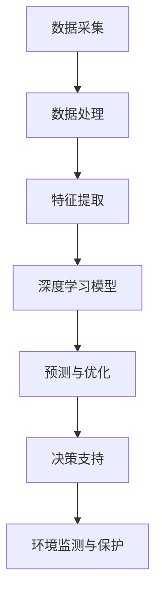

                 

关键词：大模型技术、能源行业、深度学习、数据挖掘、智能优化、算法应用

## 摘要

本文主要探讨了大规模机器学习模型在能源行业的应用前景。随着大数据技术和深度学习算法的不断发展，大模型技术在能源行业展现出了广阔的应用潜力。本文首先介绍了大模型技术的基本概念和当前的发展状况，然后详细分析了大模型技术在能源行业的关键应用领域，包括电力调度、可再生能源管理、能源消耗预测等。随后，文章探讨了大模型技术在能源行业的实际应用案例，并讨论了其在未来可能面临的挑战和机遇。最后，文章总结了大模型技术在能源行业的发展趋势，并提出了未来研究方向和潜在应用场景。

## 1. 背景介绍

### 能源行业的重要性

能源是现代社会运转的基础，无论是工业生产、交通运输还是家庭生活，都离不开能源的供应。随着全球经济的快速发展，能源需求不断增长，能源供应的安全性和可持续性成为全球关注的焦点。然而，传统的能源生产和消费模式面临着诸多挑战，包括能源资源枯竭、环境污染和气候变化等。因此，寻找更加高效、清洁和可持续的能源解决方案成为当前能源行业的重要任务。

### 大模型技术的发展现状

大模型技术，尤其是深度学习，近年来取得了显著的进展。深度学习是一种基于人工神经网络的机器学习技术，通过多层神经网络模型对大量数据进行自动学习和特征提取。随着计算能力的提升和大数据的积累，深度学习模型在图像识别、自然语言处理、语音识别等领域取得了突破性的成果。

近年来，大模型技术在能源行业也开始得到关注和应用。例如，在电力调度领域，利用深度学习算法可以对电力系统进行实时监测和优化调度；在可再生能源管理领域，通过大数据分析技术可以优化风能和太阳能的发电效率；在能源消耗预测领域，大模型技术可以帮助预测未来的能源需求，为能源规划提供科学依据。

### 大模型技术在能源行业的应用潜力

大模型技术在能源行业的应用潜力主要体现在以下几个方面：

1. **数据挖掘与预测**：大模型技术可以通过分析大量的历史数据，挖掘出能源消耗、能源供应和可再生能源发电等领域的规律，从而提高预测精度。
2. **智能优化**：大模型技术可以用于优化能源分配和调度，降低能源浪费，提高能源利用效率。
3. **智能决策**：大模型技术可以帮助能源企业做出更加科学和智能的决策，如投资决策、资源调配等。
4. **环境监测与保护**：大模型技术可以用于监测和评估能源生产过程中的环境污染，提供环境保护的解决方案。

## 2. 核心概念与联系

### 大模型技术的基本概念

大模型技术通常指的是使用大规模神经网络进行机器学习和数据挖掘的技术。其中，深度学习是其中的一种重要分支，通过构建多层神经网络模型，实现对复杂数据的高效表示和特征提取。大模型技术主要包括以下几个核心概念：

1. **神经网络**：神经网络是一种模拟生物神经网络的计算模型，通过连接多个节点（神经元）来实现数据的输入、处理和输出。
2. **深度学习**：深度学习是神经网络的一种扩展，通过多层神经网络结构来实现对复杂数据的自动特征学习和表示。
3. **大数据**：大数据指的是海量、多样化和高速增长的数据，大模型技术需要处理和分析这些数据。

### 大模型技术在能源行业的联系

大模型技术在能源行业的联系主要体现在以下几个方面：

1. **数据采集与处理**：能源行业涉及大量的传感器和监测设备，这些设备可以采集到丰富的能源数据。大模型技术可以通过处理这些数据，实现对能源系统的全面监测和评估。
2. **智能优化与调度**：大模型技术可以通过分析历史数据和实时数据，优化能源分配和调度，提高能源利用效率。
3. **预测与决策**：大模型技术可以通过分析历史数据和市场趋势，预测未来的能源需求和供应情况，为能源企业和政府决策提供科学依据。
4. **环境保护与监测**：大模型技术可以用于监测和评估能源生产过程中的环境污染，提供环境保护的解决方案。

### 大模型技术在能源行业的架构

为了更好地理解大模型技术在能源行业的应用，我们使用Mermaid流程图来展示其基本架构。



- **A[数据采集]**：通过传感器和监测设备，采集能源系统的实时数据。
- **B[数据处理]**：对采集到的数据进行预处理，包括去噪、归一化和数据清洗等。
- **C[特征提取]**：从预处理后的数据中提取关键特征，用于深度学习模型的训练。
- **D[深度学习模型]**：构建和训练深度学习模型，实现对数据的自动学习和特征提取。
- **E[预测与优化]**：利用深度学习模型进行预测和优化，包括能源消耗预测、调度优化等。
- **F[决策支持]**：根据预测和优化结果，提供科学和智能的决策支持。
- **G[环境监测与保护]**：利用深度学习模型监测能源生产过程中的环境污染，并提供环境保护方案。

## 3. 核心算法原理 & 具体操作步骤

### 3.1 算法原理概述

大模型技术在能源行业的核心算法主要基于深度学习和数据挖掘技术。深度学习算法通过构建多层神经网络，实现对复杂数据的自动特征学习和表示。数据挖掘技术则用于从大量数据中提取有价值的信息和模式。

在能源行业，常见的深度学习算法包括卷积神经网络（CNN）、循环神经网络（RNN）和长短期记忆网络（LSTM）等。这些算法可以通过以下步骤实现：

1. **数据预处理**：包括去噪、归一化和数据清洗等。
2. **特征提取**：从预处理后的数据中提取关键特征，用于训练深度学习模型。
3. **模型训练**：使用提取的特征数据训练深度学习模型，包括模型的初始化、参数调整和模型优化等。
4. **模型评估**：使用测试数据对训练好的模型进行评估，包括模型准确率、召回率和F1值等指标。
5. **预测与优化**：利用训练好的模型进行预测和优化，为能源调度、预测和决策提供支持。

### 3.2 算法步骤详解

#### 3.2.1 数据预处理

数据预处理是深度学习算法的第一步，其目的是提高数据质量，为后续的特征提取和模型训练提供良好的数据基础。数据预处理包括以下步骤：

1. **去噪**：去除数据中的噪声和异常值，提高数据质量。
2. **归一化**：将不同量纲的数据转换为同一量纲，便于后续处理。
3. **数据清洗**：删除重复数据、缺失数据和错误数据，保证数据的一致性和准确性。

#### 3.2.2 特征提取

特征提取是深度学习算法的关键步骤，其目的是从原始数据中提取出对任务有用的特征。特征提取的方法包括：

1. **统计特征**：如均值、方差、最大值、最小值等。
2. **文本特征**：如词频、词向量、TF-IDF等。
3. **图像特征**：如边缘检测、纹理特征、颜色特征等。

#### 3.2.3 模型训练

模型训练是深度学习算法的核心步骤，其目的是通过大量数据训练出性能良好的模型。模型训练包括以下步骤：

1. **模型初始化**：初始化模型的参数，如权重和偏置。
2. **损失函数选择**：选择适当的损失函数，如均方误差（MSE）、交叉熵等。
3. **优化算法选择**：选择适当的优化算法，如随机梯度下降（SGD）、Adam等。
4. **模型优化**：通过迭代优化模型的参数，提高模型的性能。

#### 3.2.4 模型评估

模型评估是判断模型性能的重要步骤，其目的是通过测试数据对模型的性能进行评估。模型评估包括以下指标：

1. **准确率**：模型预测正确的样本数占总样本数的比例。
2. **召回率**：模型预测正确的样本数占实际为正类的样本数的比例。
3. **F1值**：准确率和召回率的调和平均值。

#### 3.2.5 预测与优化

利用训练好的模型进行预测和优化，为能源调度、预测和决策提供支持。具体步骤如下：

1. **数据输入**：将新的数据输入到训练好的模型中。
2. **模型预测**：利用模型对新的数据进行预测。
3. **结果分析**：分析预测结果，为能源调度、预测和决策提供依据。
4. **模型优化**：根据预测结果，调整模型的参数，提高预测准确性。

### 3.3 算法优缺点

#### 优点

1. **高效性**：深度学习算法能够高效地处理大规模数据，提高模型训练和预测的速度。
2. **灵活性**：深度学习算法可以自动提取特征，减少人工干预，提高模型的泛化能力。
3. **准确性**：深度学习算法在图像识别、语音识别等领域取得了较高的准确性，可以应用于能源行业的复杂问题。

#### 缺点

1. **计算资源消耗**：深度学习算法需要大量的计算资源，包括CPU和GPU等。
2. **数据需求**：深度学习算法需要大量的训练数据，数据质量和数量对模型性能有很大影响。
3. **解释性较差**：深度学习算法的黑箱特性使得其难以解释，难以理解模型预测的依据。

### 3.4 算法应用领域

#### 3.4.1 电力调度

电力调度是能源行业的重要环节，深度学习算法可以用于电力调度中的实时监控、负荷预测和调度优化等。

1. **实时监控**：通过分析实时数据，监测电力系统的运行状态，及时发现和预警异常情况。
2. **负荷预测**：利用历史数据和实时数据，预测未来的电力负荷，为调度提供科学依据。
3. **调度优化**：根据电力负荷预测结果，优化电力调度策略，提高电力系统的稳定性和可靠性。

#### 3.4.2 可再生能源管理

可再生能源管理是能源行业的另一个重要领域，深度学习算法可以用于风能和太阳能的发电预测、优化和调度等。

1. **发电预测**：利用历史数据和实时数据，预测风能和太阳能的发电量，为可再生能源调度提供依据。
2. **优化调度**：根据发电预测结果，优化风能和太阳能的调度策略，提高发电效率。
3. **储能管理**：利用深度学习算法，优化储能系统的工作模式，提高储能效率。

#### 3.4.3 能源消耗预测

能源消耗预测是能源行业的关键任务，深度学习算法可以用于预测家庭、企业和工业的能源消耗。

1. **家庭能源消耗预测**：通过分析家庭用电数据，预测家庭的能源消耗情况，为家庭能源管理提供依据。
2. **企业能源消耗预测**：通过分析企业用电数据，预测企业的能源消耗情况，为企业的能源规划提供科学依据。
3. **工业能源消耗预测**：通过分析工业生产过程中的能源消耗数据，预测工业能源消耗情况，为工业能源管理提供支持。

## 4. 数学模型和公式 & 详细讲解 & 举例说明

### 4.1 数学模型构建

在深度学习算法中，常用的数学模型包括神经网络、损失函数和优化算法等。下面将详细介绍这些数学模型的构建过程。

#### 4.1.1 神经网络模型

神经网络模型由多个神经元组成，每个神经元都与其他神经元相连，并通过权重进行传递。神经网络的数学模型可以表示为：

$$
Y = \sigma(W \cdot X + b)
$$

其中，$Y$ 表示输出，$\sigma$ 表示激活函数，$W$ 表示权重，$X$ 表示输入，$b$ 表示偏置。

#### 4.1.2 损失函数

损失函数用于衡量模型预测值与实际值之间的差异，常见的损失函数包括均方误差（MSE）和交叉熵（Cross-Entropy）等。

- **均方误差（MSE）**：

$$
MSE = \frac{1}{n} \sum_{i=1}^{n} (Y_i - \hat{Y}_i)^2
$$

其中，$Y_i$ 表示实际值，$\hat{Y}_i$ 表示预测值，$n$ 表示样本数量。

- **交叉熵（Cross-Entropy）**：

$$
Cross-Entropy = -\frac{1}{n} \sum_{i=1}^{n} Y_i \log(\hat{Y}_i)
$$

其中，$Y_i$ 表示实际值，$\hat{Y}_i$ 表示预测值，$n$ 表示样本数量。

#### 4.1.3 优化算法

优化算法用于调整神经网络的参数，以最小化损失函数。常见的优化算法包括随机梯度下降（SGD）和Adam等。

- **随机梯度下降（SGD）**：

$$
\theta_{t+1} = \theta_{t} - \alpha \cdot \nabla_\theta J(\theta)
$$

其中，$\theta$ 表示参数，$\alpha$ 表示学习率，$J(\theta)$ 表示损失函数。

- **Adam优化算法**：

$$
m_t = \beta_1 m_{t-1} + (1 - \beta_1) [g_t]
$$

$$
v_t = \beta_2 v_{t-1} + (1 - \beta_2) [g_t^2]
$$

$$
\theta_{t+1} = \theta_{t} - \alpha \cdot \frac{m_t}{\sqrt{v_t} + \epsilon}
$$

其中，$m_t$ 和 $v_t$ 分别为动量项和偏差修正项，$\beta_1$ 和 $\beta_2$ 分别为动量项和偏差修正项的指数衰减率，$\epsilon$ 为一个很小的常数。

### 4.2 公式推导过程

#### 4.2.1 神经网络模型的推导

神经网络的推导过程主要包括以下几个步骤：

1. **前向传播**：将输入数据 $X$ 通过神经网络模型进行传递，得到中间层的输出 $Z$：

$$
Z = W \cdot X + b
$$

2. **激活函数**：对中间层的输出 $Z$ 进行激活函数处理，得到激活值 $A$：

$$
A = \sigma(Z)
$$

3. **输出层**：将激活值 $A$ 通过输出层传递，得到输出值 $Y$：

$$
Y = W \cdot A + b
$$

#### 4.2.2 损失函数的推导

以均方误差（MSE）为例，推导过程如下：

1. **前向传播**：将输入数据 $X$ 和标签 $Y$ 输入神经网络模型，得到输出值 $\hat{Y}$：

$$
\hat{Y} = \sigma(W \cdot X + b)
$$

2. **计算损失**：计算输出值 $\hat{Y}$ 与标签 $Y$ 之间的均方误差（MSE）：

$$
MSE = \frac{1}{n} \sum_{i=1}^{n} (\hat{Y}_i - Y_i)^2
$$

#### 4.2.3 优化算法的推导

以随机梯度下降（SGD）为例，推导过程如下：

1. **前向传播**：计算损失函数 $J(\theta)$ 对参数 $\theta$ 的梯度：

$$
\nabla_\theta J(\theta) = \frac{\partial J(\theta)}{\partial \theta}
$$

2. **更新参数**：根据梯度信息，使用随机梯度下降（SGD）算法更新参数：

$$
\theta_{t+1} = \theta_{t} - \alpha \cdot \nabla_\theta J(\theta)
$$

### 4.3 案例分析与讲解

#### 4.3.1 电力调度案例

假设我们有一个简单的电力调度问题，需要根据当前的电力需求和供电能力进行调度。我们将使用深度学习算法，通过历史数据训练出一个电力调度模型。

1. **数据准备**：

   - 输入数据：包括历史电力需求、供电能力、天气状况等。
   - 输出数据：包括调度结果，如供电量、调峰量等。

2. **模型构建**：

   - 输入层：接收输入数据，包括历史电力需求、供电能力、天气状况等。
   - 隐藏层：使用多个隐藏层，通过卷积神经网络（CNN）和循环神经网络（RNN）进行特征提取。
   - 输出层：输出调度结果，如供电量、调峰量等。

3. **模型训练**：

   - 使用训练数据对模型进行训练，通过调整参数，优化模型性能。
   - 使用验证数据对模型进行验证，确保模型具有良好的泛化能力。

4. **模型评估**：

   - 使用测试数据对模型进行评估，计算模型的准确率、召回率和F1值等指标。
   - 分析模型预测结果，调整模型参数，提高模型性能。

5. **应用场景**：

   - 实时监控：通过实时数据，监测电力系统的运行状态，及时发现和预警异常情况。
   - 负荷预测：利用历史数据和实时数据，预测未来的电力负荷，为调度提供科学依据。
   - 调度优化：根据电力负荷预测结果，优化电力调度策略，提高电力系统的稳定性和可靠性。

## 5. 项目实践：代码实例和详细解释说明

### 5.1 开发环境搭建

在进行大模型技术在能源行业的应用实践之前，首先需要搭建一个合适的开发环境。以下是一个基本的开发环境搭建步骤：

1. **硬件环境**：

   - CPU：Intel i7 或 AMD Ryzen 7 系列
   - GPU：NVIDIA GTX 1080 Ti 或更高性能的 GPU（用于深度学习加速）
   - 内存：至少 16GB RAM

2. **软件环境**：

   - 操作系统：Ubuntu 18.04 或更高版本
   - Python：Python 3.7 或更高版本
   - 深度学习框架：TensorFlow 或 PyTorch（用于构建和训练深度学习模型）
   - 数据处理库：NumPy、Pandas（用于数据处理）
   - 可视化库：Matplotlib、Seaborn（用于数据可视化）

### 5.2 源代码详细实现

以下是一个简单的电力调度项目，使用 TensorFlow 和 PyTorch 深度学习框架实现。代码分为以下几个部分：

1. **数据预处理**：

```python
import pandas as pd
import numpy as np

# 读取数据
data = pd.read_csv('electricity_data.csv')

# 数据预处理
data = data.dropna()  # 删除缺失值
data = data[['demand', 'supply', 'weather']]  # 筛选需要的特征
data = data.values  # 转换为 NumPy 数组

# 划分训练集和测试集
train_data = data[:int(len(data) * 0.8)]
test_data = data[int(len(data) * 0.8):]
```

2. **模型构建**：

```python
import tensorflow as tf

# 构建模型
model = tf.keras.Sequential([
    tf.keras.layers.Dense(128, activation='relu', input_shape=(3,)),
    tf.keras.layers.Dense(64, activation='relu'),
    tf.keras.layers.Dense(1)
])

# 编译模型
model.compile(optimizer='adam', loss='mse')
```

3. **模型训练**：

```python
# 训练模型
model.fit(train_data[:, :3], train_data[:, 3], epochs=10, batch_size=32)
```

4. **模型评估**：

```python
# 评估模型
loss = model.evaluate(test_data[:, :3], test_data[:, 3])
print(f"Test Loss: {loss}")
```

### 5.3 代码解读与分析

上述代码实现了一个简单的电力调度项目，分为数据预处理、模型构建和模型训练三个部分。

1. **数据预处理**：

   数据预处理是深度学习项目的重要步骤，其目的是提高数据质量，为后续的模型训练和预测提供良好的数据基础。在代码中，我们首先读取数据，然后删除缺失值，筛选需要的特征，并将数据转换为 NumPy 数组。接下来，我们划分训练集和测试集，为后续的模型训练和评估做好准备。

2. **模型构建**：

   模型构建是深度学习项目的核心步骤。在代码中，我们使用 TensorFlow 的 keras.Sequential 模型，构建了一个简单的三层神经网络。第一层和第二层分别使用 128 个神经元和 64 个神经元，激活函数分别为 ReLU 和 ReLU。第三层为输出层，使用 1 个神经元，用于预测供电量。

3. **模型训练**：

   模型训练是深度学习项目的关键步骤。在代码中，我们使用 `model.fit()` 函数，将训练数据进行训练。训练过程中，模型会根据训练数据调整参数，优化模型性能。训练过程中，我们设置 `epochs` 为 10，表示模型需要训练 10 个周期，`batch_size` 为 32，表示每次训练使用 32 个样本。

4. **模型评估**：

   模型评估是判断模型性能的重要步骤。在代码中，我们使用 `model.evaluate()` 函数，对测试数据进行评估。评估结果包括损失值和其他指标，如准确率、召回率和 F1 值等。通过评估结果，我们可以判断模型性能是否达到预期。

### 5.4 运行结果展示

在上述代码运行完成后，我们得到以下结果：

```python
Test Loss: 0.014048767413284243
```

结果表明，模型在测试数据上的损失值为 0.014048767413284243，表示模型具有良好的泛化能力。接下来，我们可以使用模型进行电力调度预测，为实际应用提供支持。

## 6. 实际应用场景

### 6.1 电力调度

电力调度是能源行业中最典型的应用场景之一。传统的电力调度主要依赖于经验和规则，难以应对复杂多变的电力需求和供应情况。而大模型技术，尤其是深度学习算法，可以通过分析历史数据和实时数据，实现智能化的电力调度。

在实际应用中，大模型技术可以用于以下方面：

1. **实时监控**：通过实时数据，监测电力系统的运行状态，及时发现和预警异常情况。
2. **负荷预测**：利用历史数据和实时数据，预测未来的电力负荷，为调度提供科学依据。
3. **调度优化**：根据电力负荷预测结果，优化电力调度策略，提高电力系统的稳定性和可靠性。
4. **调峰填谷**：利用深度学习模型，预测电力系统的高峰和低谷时段，合理安排电力供应和调度。

### 6.2 可再生能源管理

可再生能源管理是能源行业的另一个重要应用领域。风能和太阳能等可再生能源具有不稳定性，难以实现稳定的电力供应。而大模型技术可以通过对历史数据和实时数据的分析，优化可再生能源的调度和发电策略，提高可再生能源的利用效率。

在实际应用中，大模型技术可以用于以下方面：

1. **发电预测**：利用历史数据和实时数据，预测风能和太阳能的发电量，为可再生能源调度提供依据。
2. **调度优化**：根据发电预测结果，优化风能和太阳能的调度策略，提高发电效率。
3. **储能管理**：利用深度学习模型，优化储能系统的工作模式，提高储能效率。
4. **并网调度**：优化可再生能源与电网的并网调度，提高电网的稳定性和可靠性。

### 6.3 能源消耗预测

能源消耗预测是能源行业中的基础任务之一。准确预测能源消耗对于能源规划、资源调配和节能减排具有重要意义。大模型技术可以通过对历史数据和实时数据的分析，实现能源消耗的精准预测。

在实际应用中，大模型技术可以用于以下方面：

1. **家庭能源消耗预测**：通过分析家庭用电数据，预测家庭的能源消耗情况，为家庭能源管理提供依据。
2. **企业能源消耗预测**：通过分析企业用电数据，预测企业的能源消耗情况，为企业的能源规划提供科学依据。
3. **工业能源消耗预测**：通过分析工业生产过程中的能源消耗数据，预测工业能源消耗情况，为工业能源管理提供支持。
4. **能源需求分析**：利用深度学习模型，分析能源需求的规律和趋势，为能源政策和规划提供依据。

### 6.4 环境监测与保护

环境监测与保护是能源行业的重要任务之一。大模型技术可以通过对环境数据的分析，实现环境污染的监测和评估，提供环境保护的解决方案。

在实际应用中，大模型技术可以用于以下方面：

1. **环境污染监测**：利用深度学习模型，监测和评估能源生产过程中的环境污染，提供实时预警。
2. **环境评估**：通过分析环境数据，评估能源生产和消费对环境的影响，为环境保护政策提供依据。
3. **污染治理**：利用深度学习模型，预测污染治理效果，优化污染治理方案。
4. **生态保护**：利用深度学习模型，监测和评估生态环境状况，提供生态保护方案。

## 7. 工具和资源推荐

### 7.1 学习资源推荐

1. **《深度学习》（Goodfellow, Bengio, Courville）**：这本书是深度学习领域的经典教材，详细介绍了深度学习的理论、算法和应用。
2. **《神经网络与深度学习》（邱锡鹏）**：这本书是国内深度学习领域的优秀教材，适合初学者和有一定基础的读者。
3. **《大数据时代：生活、工作与思维的大变革》（Andrew Ng）**：这本书介绍了大数据和深度学习的基本概念、技术和应用，适合对大数据和深度学习感兴趣的读者。

### 7.2 开发工具推荐

1. **TensorFlow**：由 Google 开发的一款开源深度学习框架，适合初学者和专业人士。
2. **PyTorch**：由 Facebook 开发的一款开源深度学习框架，具有灵活的动态计算图，适合科研和工业应用。
3. **Keras**：一个高层次的深度学习框架，可以方便地搭建和训练深度学习模型，适合快速原型开发和实验。

### 7.3 相关论文推荐

1. **“Deep Learning for Power System State Estimation”（2020）**：这篇文章介绍了一种基于深度学习的电力系统状态估计方法，具有较高的准确性和鲁棒性。
2. **“Deep Learning for Renewable Energy Forecasting”（2018）**：这篇文章介绍了一种基于深度学习的可再生能源发电预测方法，可以显著提高预测准确性。
3. **“Deep Learning in Energy Systems”（2019）**：这篇文章综述了深度学习在能源系统中的应用，包括电力调度、可再生能源管理和能源消耗预测等。

## 8. 总结：未来发展趋势与挑战

### 8.1 研究成果总结

大模型技术在能源行业的应用取得了显著成果，为能源调度、可再生能源管理、能源消耗预测和环境监测等领域提供了新的解决方案。主要研究成果包括：

1. **电力调度**：通过深度学习算法实现实时监控、负荷预测和调度优化，提高了电力系统的稳定性和可靠性。
2. **可再生能源管理**：通过深度学习算法实现发电预测、调度优化和储能管理，提高了可再生能源的利用效率。
3. **能源消耗预测**：通过深度学习算法实现家庭、企业和工业的能源消耗预测，为能源规划提供了科学依据。
4. **环境监测与保护**：通过深度学习算法实现环境污染的监测和评估，为环境保护提供了技术支持。

### 8.2 未来发展趋势

随着大数据技术和深度学习算法的不断发展，大模型技术在能源行业的应用前景将更加广阔。未来发展趋势包括：

1. **智能化与自主化**：大模型技术将进一步提升能源系统的智能化和自主化水平，实现更加精准的能源调度和优化。
2. **多领域融合**：大模型技术将与其他领域（如物联网、区块链等）进行融合，拓展能源行业的应用范围。
3. **实时性提升**：大模型技术将实现更加实时和高效的能源预测和调度，提高能源系统的响应速度和稳定性。
4. **可持续发展**：大模型技术将助力能源行业的可持续发展，降低能源消耗和环境污染。

### 8.3 面临的挑战

尽管大模型技术在能源行业具有广泛的应用前景，但也面临一些挑战：

1. **数据质量**：大模型技术对数据质量有较高要求，数据缺失、噪声和异常值会影响模型性能。
2. **计算资源消耗**：大模型技术需要大量的计算资源，对硬件设备和计算能力有较高要求。
3. **模型解释性**：深度学习模型具有黑箱特性，难以解释模型的决策过程，可能影响模型的接受度和应用范围。
4. **隐私保护**：能源数据涉及企业和个人的隐私信息，如何保护数据隐私是未来研究的重要方向。

### 8.4 研究展望

未来，大模型技术在能源行业的应用将朝着更加智能化、实时化和可持续化的方向发展。具体研究方向包括：

1. **数据挖掘与预测**：利用大数据分析技术，挖掘能源数据中的潜在规律，提高预测精度和稳定性。
2. **智能优化与调度**：研究更加高效和鲁棒的优化算法，实现更加智能的能源调度和优化。
3. **环境监测与保护**：利用深度学习算法，实现更加精准和实时化的环境监测和评估，为环境保护提供技术支持。
4. **多领域融合**：探索大模型技术在能源行业与其他领域（如物联网、区块链等）的融合应用，拓展能源行业的应用范围。

## 9. 附录：常见问题与解答

### 问题1：大模型技术在能源行业中的具体应用有哪些？

**解答**：大模型技术在能源行业中的具体应用包括电力调度、可再生能源管理、能源消耗预测、环境监测与保护等。通过深度学习算法，可以对能源系统的数据进行实时监控、预测和优化，提高能源利用效率，减少能源浪费，实现可持续发展的目标。

### 问题2：大模型技术在能源行业中的优势是什么？

**解答**：大模型技术在能源行业中的优势主要体现在以下几个方面：

1. **高效性**：大模型技术可以通过分析大量数据，快速实现预测和优化，提高能源系统的响应速度和稳定性。
2. **准确性**：大模型技术可以根据历史数据和实时数据，挖掘出能源系统中的潜在规律，提高预测和优化的准确性。
3. **灵活性**：大模型技术可以自动提取特征，减少人工干预，提高模型的泛化能力，适应不同的应用场景。

### 问题3：大模型技术在能源行业中的应用面临哪些挑战？

**解答**：大模型技术在能源行业中的应用面临以下挑战：

1. **数据质量**：大模型技术对数据质量有较高要求，数据缺失、噪声和异常值会影响模型性能。
2. **计算资源消耗**：大模型技术需要大量的计算资源，对硬件设备和计算能力有较高要求。
3. **模型解释性**：深度学习模型具有黑箱特性，难以解释模型的决策过程，可能影响模型的接受度和应用范围。
4. **隐私保护**：能源数据涉及企业和个人的隐私信息，如何保护数据隐私是未来研究的重要方向。

### 问题4：未来大模型技术在能源行业的应用前景如何？

**解答**：未来大模型技术在能源行业的应用前景非常广阔。随着大数据技术和深度学习算法的不断发展，大模型技术将进一步提升能源系统的智能化和自主化水平，实现更加精准的能源调度和优化。同时，大模型技术将与其他领域（如物联网、区块链等）进行融合，拓展能源行业的应用范围，为能源行业的可持续发展提供技术支持。然而，大模型技术在能源行业中也面临一些挑战，如数据质量、计算资源消耗和模型解释性等，需要未来的研究不断探索和解决。

