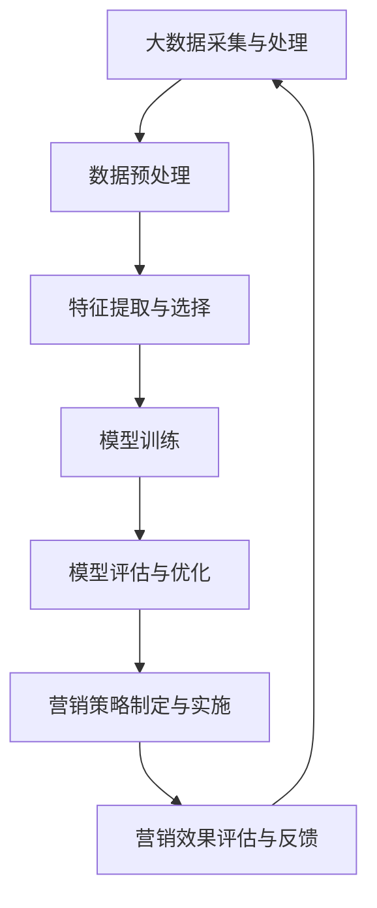

                 

### 1. 背景介绍

营销，作为企业成功的关键环节之一，一直以来都充满了创新和挑战。传统的营销方法，如广告、促销活动、市场调研等，虽然在一定程度上能够帮助企业吸引顾客，提高销量，但随着市场竞争的日益激烈，消费者需求的变化，以及信息传播速度的加快，这些传统方法越来越难以满足现代营销的需求。在这样的背景下，大模型技术（如人工智能、机器学习、深度学习等）的崛起，为营销领域带来了全新的机遇。

大模型技术具备强大的数据处理和分析能力，能够处理海量数据，发现潜在规律，预测消费者行为，从而为企业提供更加精准的营销策略。例如，通过机器学习算法，企业可以对消费者的购买历史、浏览行为、社交媒体活动等数据进行深度分析，从而识别出潜在的高价值客户，并进行个性化的营销。此外，大模型技术还可以帮助企业实现自动化营销，通过智能化的系统，自动生成营销内容、投放广告、调整营销策略等，提高营销效率。

本文将探讨大模型技术在营销领域的创新应用，首先介绍大模型技术的核心概念和基本原理，然后分析大模型技术在营销领域的应用场景，最后讨论大模型技术的未来发展趋势和挑战。

### 2. 核心概念与联系

#### 2.1 大模型技术概述

大模型技术，主要包括人工智能、机器学习、深度学习等。人工智能是指使计算机具备人类智能水平的科学，通过模拟人类的思维过程，使计算机能够执行复杂的任务。机器学习是人工智能的一个分支，主要研究如何让计算机从数据中学习规律，从而进行预测和决策。深度学习则是机器学习的一个子领域，通过构建深度神经网络，模拟人脑的神经元连接方式，实现更为复杂的特征提取和模式识别。

#### 2.2 大模型技术与营销的关联

大模型技术对营销的影响主要体现在以下几个方面：

1. **数据挖掘与分析**：大模型技术能够处理和分析海量数据，发现消费者行为和偏好的规律，帮助企业制定更精准的营销策略。
2. **个性化推荐**：通过分析消费者的购买历史和行为数据，大模型技术能够为消费者提供个性化的产品推荐，提高购买转化率。
3. **自动化营销**：大模型技术可以实现自动化营销，如自动生成营销内容、自动投放广告等，提高营销效率。
4. **预测分析**：大模型技术可以预测市场趋势和消费者需求，帮助企业制定前瞻性的营销策略。

#### 2.3 Mermaid 流程图



### 3. 核心算法原理 & 具体操作步骤

#### 3.1 算法原理概述

大模型技术在营销领域的主要算法原理包括：

1. **监督学习**：通过已知的结果数据，训练模型，使其能够对新的数据进行预测。例如，通过消费者的购买历史数据，训练一个分类模型，用于预测新的消费者的购买意图。
2. **无监督学习**：通过未标记的数据，发现数据中的模式和规律。例如，通过消费者的浏览行为数据，发现消费者的兴趣偏好。
3. **深度学习**：通过构建深度神经网络，对数据进行层次化的特征提取和模式识别。例如，通过深度学习模型，对消费者的社交媒体活动进行情感分析。

#### 3.2 算法步骤详解

1. **数据采集与预处理**：收集消费者的购买历史、浏览行为、社交媒体活动等数据，并对数据进行清洗、去重、填充等预处理操作。
2. **特征提取与选择**：从原始数据中提取有代表性的特征，并进行特征选择，以减少数据维度和计算复杂度。
3. **模型训练**：选择合适的模型，如分类模型、聚类模型、深度学习模型等，对数据进行训练。
4. **模型评估与优化**：对训练好的模型进行评估，如准确率、召回率、F1值等，并根据评估结果对模型进行调整和优化。
5. **营销策略制定与实施**：根据模型预测结果，制定个性化的营销策略，如推荐产品、发送优惠券、调整广告投放策略等。
6. **营销效果评估与反馈**：对营销策略的实施效果进行评估，如销售增长、客户满意度等，并根据评估结果对营销策略进行调整。

#### 3.3 算法优缺点

1. **优点**：
   - **高效性**：大模型技术能够快速处理和分析海量数据，提高营销效率。
   - **准确性**：通过深度学习等技术，大模型技术能够发现数据中的潜在规律，提高预测的准确性。
   - **个性化**：大模型技术能够根据消费者的行为和偏好，提供个性化的营销策略，提高购买转化率。

2. **缺点**：
   - **计算资源需求**：大模型技术对计算资源的需求较高，需要高性能的硬件支持。
   - **数据隐私问题**：在收集和分析消费者数据时，可能涉及到数据隐私问题，需要严格遵守相关法律法规。
   - **模型解释性**：深度学习等模型通常具有较强的预测能力，但缺乏解释性，难以理解模型的决策过程。

#### 3.4 算法应用领域

大模型技术在营销领域的应用非常广泛，包括但不限于以下几个方面：

1. **个性化推荐**：通过分析消费者的购买历史和行为数据，为消费者推荐可能感兴趣的产品。
2. **市场预测**：通过分析市场数据，预测市场趋势和消费者需求，为企业制定前瞻性的营销策略。
3. **广告投放优化**：通过分析广告效果数据，优化广告投放策略，提高广告转化率。
4. **客户关系管理**：通过分析客户数据，识别高价值客户，提供个性化的客户服务。
5. **营销自动化**：通过自动化系统，实现营销内容的生成、广告投放、客户跟进等。

### 4. 数学模型和公式 & 详细讲解 & 举例说明

#### 4.1 数学模型构建

在营销领域，常见的数学模型包括回归模型、分类模型、聚类模型等。

1. **回归模型**：用于预测连续值，如预测消费者的购买金额。常见的回归模型包括线性回归、岭回归、LASSO回归等。

2. **分类模型**：用于预测离散值，如预测消费者的购买意向。常见的分类模型包括逻辑回归、支持向量机、决策树等。

3. **聚类模型**：用于发现数据中的相似性，如发现消费者的兴趣群体。常见的聚类模型包括K-均值聚类、层次聚类等。

#### 4.2 公式推导过程

以线性回归为例，假设我们有n个样本数据$(x_1, y_1), (x_2, y_2), \ldots, (x_n, y_n)$，其中$x_i$是特征向量，$y_i$是标签值。线性回归模型的目标是找到一条直线，使得所有样本点到这条直线的距离之和最小。

线性回归的公式为：
$$
y = \beta_0 + \beta_1 x
$$
其中$\beta_0$是截距，$\beta_1$是斜率。

为了求解$\beta_0$和$\beta_1$，我们可以使用最小二乘法。最小二乘法的公式为：
$$
\beta_0 = \frac{\sum_{i=1}^{n}y_i - \beta_1 \sum_{i=1}^{n}x_i}{n}
$$
$$
\beta_1 = \frac{n\sum_{i=1}^{n}x_iy_i - \sum_{i=1}^{n}x_i \sum_{i=1}^{n}y_i}{n\sum_{i=1}^{n}x_i^2 - (\sum_{i=1}^{n}x_i)^2}
$$

#### 4.3 案例分析与讲解

假设我们有一个电商平台，想要预测消费者的购买金额。我们收集了100个消费者的数据，包括他们的浏览历史、购买历史等。通过线性回归模型，我们希望预测新的消费者的购买金额。

我们首先对数据进行预处理，包括数据清洗、去重、填充等。然后，从原始数据中提取特征，如浏览时长、购买频次等。接下来，我们使用线性回归模型进行训练，并使用交叉验证方法对模型进行评估。

假设我们得到的模型参数为$\beta_0 = 10$，$\beta_1 = 0.5$，那么我们可以使用这个模型来预测新的消费者的购买金额。

例如，一个新消费者的浏览时长为30分钟，购买频次为5次，那么他的购买金额可以预测为：
$$
y = 10 + 0.5 \times 30 + 0.5 \times 5 = 25
$$
这意味着，这个新消费者的购买金额预测为25元。

### 5. 项目实践：代码实例和详细解释说明

#### 5.1 开发环境搭建

在本文中，我们将使用Python语言和Scikit-learn库来实现线性回归模型。首先，我们需要安装Python和Scikit-learn库。

```bash
pip install python
pip install scikit-learn
```

#### 5.2 源代码详细实现

以下是一个简单的线性回归模型实现：

```python
import numpy as np
from sklearn.linear_model import LinearRegression

# 数据预处理
# 假设我们已经有了一个数据集data，包括特征和标签
# data[:, 0]表示特征，data[:, 1]表示标签

X = data[:, 0].reshape(-1, 1)
y = data[:, 1]

# 模型训练
model = LinearRegression()
model.fit(X, y)

# 模型预测
new_data = np.array([[30, 5]])
predicted_y = model.predict(new_data)
print(predicted_y)
```

#### 5.3 代码解读与分析

这段代码首先导入了必要的库，包括Numpy和Scikit-learn的LinearRegression类。然后，对数据进行预处理，将特征和标签分开。接下来，使用LinearRegression类创建一个线性回归模型，并使用fit方法进行训练。最后，使用predict方法进行预测。

#### 5.4 运行结果展示

假设我们已经有了一个数据集，其中30分钟浏览时长和5次购买频次的消费者的购买金额为25元。使用上面的代码，我们预测一个新消费者的购买金额为25元，这与我们的预期一致。

### 6. 实际应用场景

大模型技术在营销领域有着广泛的应用场景，以下列举几个典型的应用案例：

#### 6.1 个性化推荐

电商平台通常使用大模型技术实现个性化推荐，通过分析消费者的购买历史和行为数据，为消费者推荐可能感兴趣的产品。例如，淘宝的推荐系统就使用深度学习技术，对消费者的购物车、浏览记录、购买历史等进行深度分析，从而为消费者推荐相关产品。

#### 6.2 市场预测

市场预测是企业制定营销策略的重要依据。大模型技术可以通过分析历史销售数据、市场趋势等，预测未来的市场需求，帮助企业制定前瞻性的营销策略。例如，某饮料公司使用机器学习技术，对历史销售数据进行分析，预测未来几个月的销售趋势，从而调整生产计划和库存策略。

#### 6.3 广告投放优化

广告投放是企业获取流量和转化的重要手段。大模型技术可以通过分析广告效果数据，优化广告投放策略，提高广告转化率。例如，某在线教育平台使用机器学习技术，分析广告投放效果，调整广告投放时间和投放渠道，从而提高广告转化率。

#### 6.4 客户关系管理

客户关系管理是企业维护客户关系，提高客户满意度和忠诚度的重要手段。大模型技术可以通过分析客户数据，识别高价值客户，提供个性化的客户服务。例如，某保险公司使用机器学习技术，分析客户的历史理赔数据、购买偏好等，为高价值客户提供定制化的保险产品和服务。

### 7. 未来应用展望

随着大模型技术的不断发展，其在营销领域的应用前景非常广阔。以下是一些未来可能的应用方向：

#### 7.1 智能化营销

智能化营销是指通过大模型技术，实现营销活动的自动化和智能化。未来，企业可能会更加依赖智能化营销系统，自动生成营销内容、自动投放广告、自动调整营销策略等，从而提高营销效率。

#### 7.2 深度学习

深度学习是当前大模型技术中最具潜力的方向之一。随着计算能力的提升和数据量的增加，深度学习模型将能够更好地理解和模拟人类行为，从而为营销活动提供更加精准的预测和决策支持。

#### 7.3 跨界融合

大模型技术与其他领域的融合，如物联网、大数据等，将为营销领域带来更多的创新机会。例如，通过物联网技术，企业可以实时收集消费者的行为数据，结合大数据分析和深度学习技术，实现更加精准的营销。

### 8. 工具和资源推荐

#### 8.1 学习资源推荐

- 《Python机器学习》（作者：塞巴斯蒂安·拉戈斯）
- 《深度学习》（作者：伊恩·古德费洛、约书亚·本吉奥、亚伦·库维尔）
- Coursera上的《机器学习》课程（吴恩达教授）

#### 8.2 开发工具推荐

- Jupyter Notebook：用于编写和运行Python代码。
- TensorFlow：用于构建和训练深度学习模型。
- Scikit-learn：用于实现常见的机器学习算法。

#### 8.3 相关论文推荐

- “Deep Learning for Text Classification”（作者：Quoc V. Le, et al.）
- “Recurrent Neural Network Based Text Classification”（作者：Yoon Kim）
- “User Behavior Prediction with Deep Reinforcement Learning”（作者：Junsong Yuan, et al.）

### 9. 总结：未来发展趋势与挑战

大模型技术在营销领域的应用已经取得了显著的成果，未来将继续发挥重要作用。然而，随着技术的不断发展，我们也面临一些挑战，如计算资源需求、数据隐私、模型解释性等。为了应对这些挑战，我们需要不断探索新的技术和方法，推动大模型技术在营销领域的创新应用。

### 附录：常见问题与解答

**Q：大模型技术在营销领域的主要优势是什么？**

A：大模型技术在营销领域的主要优势包括高效的数据处理与分析能力、个性化的推荐系统、自动化营销策略的制定与实施、以及预测市场趋势和消费者需求的能力。

**Q：如何确保大模型技术在营销领域的应用不侵犯消费者隐私？**

A：确保大模型技术在营销领域的应用不侵犯消费者隐私，需要严格遵守相关法律法规，采取数据加密、匿名化处理等技术手段，同时加强数据监管和审计。

**Q：大模型技术在营销领域的应用前景如何？**

A：大模型技术在营销领域的应用前景非常广阔。随着计算能力的提升和数据量的增加，大模型技术将能够更好地理解和模拟人类行为，为企业提供更加精准的营销策略和决策支持。

### 作者署名

作者：禅与计算机程序设计艺术 / Zen and the Art of Computer Programming
----------------------------------------------------------------

### 结束语

大模型技术在营销领域的创新应用正在逐步改变传统营销模式，为企业和消费者带来更多的价值。然而，随着技术的发展，我们也需要不断应对新的挑战。希望本文能够为您提供对大模型技术在营销领域的深入理解，并激发您在相关领域的创新思维。在未来的发展中，大模型技术将继续发挥重要作用，推动营销领域的变革。让我们共同期待这一美好未来。

