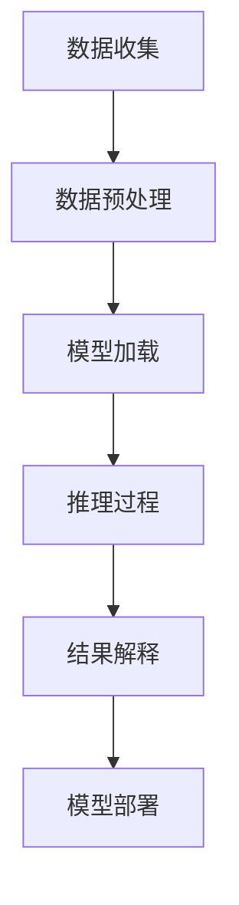

                 

关键词：大模型推理，用户行为建模，人工智能，深度学习，应用场景，数学模型，代码实例

> 摘要：本文探讨了如何利用大模型推理能力来实现高效的用户行为建模。通过介绍核心概念、算法原理、数学模型及实际应用案例，文章旨在为研究人员和开发者提供关于这一领域的前沿知识和实用指导。

## 1. 背景介绍

在当今数字化时代，用户行为建模对于企业和研究机构来说具有重要的战略意义。通过对用户行为的准确预测和深入分析，企业能够优化产品和服务，提高用户满意度，增强用户黏性，从而在激烈的市场竞争中脱颖而出。然而，传统的用户行为建模方法往往面临数据量不足、特征提取复杂、模型泛化能力弱等问题。

随着人工智能技术的飞速发展，特别是深度学习和大规模预训练模型的出现，大模型推理能力在用户行为建模中得到了广泛应用。大模型具有强大的表示能力和泛化能力，能够处理海量数据，提取复杂特征，从而为用户行为建模提供了新的解决方案。

## 2. 核心概念与联系

### 2.1. 大模型推理

大模型推理是指利用大规模预训练模型进行推理的过程。这些模型通常在巨大的数据集上经过训练，具备强大的表征能力和泛化能力。在用户行为建模中，大模型推理可以通过以下步骤实现：

1. **数据预处理**：对用户行为数据（如点击、购买、搜索等）进行清洗、归一化和特征提取。
2. **模型加载**：从预训练模型库中选择合适的大模型，如Transformer、BERT等。
3. **推理过程**：将预处理后的数据输入到模型中，得到用户行为的概率分布。
4. **结果解释**：对推理结果进行解释和可视化，以便于理解用户行为模式。

### 2.2. 用户行为建模

用户行为建模是指通过分析和理解用户行为数据，建立用户行为模型的过程。这些模型可以用于预测用户未来的行为，评估用户偏好，识别潜在用户群体等。用户行为建模通常涉及以下步骤：

1. **数据收集**：收集与用户行为相关的数据，如用户画像、历史行为记录等。
2. **特征工程**：对收集到的数据进行特征提取和工程，以便于模型训练。
3. **模型选择**：选择合适的机器学习算法和模型架构，如线性回归、决策树、神经网络等。
4. **模型训练**：使用训练数据对模型进行训练，优化模型参数。
5. **模型评估**：使用验证数据评估模型性能，调整模型参数。
6. **模型部署**：将训练好的模型部署到生产环境中，进行实时预测和监控。

### 2.3. Mermaid 流程图

以下是一个简化的 Mermaid 流程图，展示了大模型推理能力在用户行为建模中的应用流程：



## 3. 核心算法原理 & 具体操作步骤

### 3.1. 算法原理概述

大模型推理能力在用户行为建模中的应用主要基于以下原理：

1. **深度学习**：深度学习通过多层神经网络结构，能够自动提取数据中的复杂特征，提高模型表示能力。
2. **预训练模型**：预训练模型在大量未标注数据上进行预训练，然后通过微调适配特定任务，提高模型泛化能力。
3. **注意力机制**：注意力机制使模型能够关注数据中的关键信息，提高模型对用户行为的理解能力。

### 3.2. 算法步骤详解

以下是实现大模型推理在用户行为建模中的具体步骤：

1. **数据收集**：从企业数据库或第三方数据平台收集用户行为数据，如点击记录、购买记录、搜索记录等。
2. **数据预处理**：对收集到的数据进行清洗、归一化、特征提取等预处理操作，以便于模型训练。
3. **模型选择**：根据用户行为建模的需求，选择合适的大模型架构，如BERT、Transformer等。
4. **模型训练**：使用预处理后的数据对模型进行训练，优化模型参数。
5. **模型评估**：使用验证数据评估模型性能，根据评估结果调整模型参数。
6. **模型部署**：将训练好的模型部署到生产环境中，进行实时预测和监控。

### 3.3. 算法优缺点

#### 优点：

1. **强大的表征能力**：大模型能够自动提取数据中的复杂特征，提高模型准确性。
2. **泛化能力强**：预训练模型在大量未标注数据上训练，具有较好的泛化能力。
3. **实时预测**：模型部署后可以实现实时预测，满足实时应用需求。

#### 缺点：

1. **计算资源需求高**：大模型训练和推理过程需要大量的计算资源，对硬件设备要求较高。
2. **数据依赖性强**：大模型的效果很大程度上依赖于数据质量，数据量不足会影响模型性能。
3. **解释性较弱**：深度学习模型具有“黑盒”特性，难以解释模型决策过程。

### 3.4. 算法应用领域

大模型推理能力在用户行为建模中的应用广泛，主要包括以下领域：

1. **个性化推荐**：利用用户行为数据，预测用户对商品、内容和服务的偏好，实现个性化推荐。
2. **风险控制**：分析用户行为模式，识别潜在风险用户，为风险控制策略提供支持。
3. **用户运营**：通过分析用户行为数据，优化产品和服务，提高用户满意度和黏性。
4. **社会网络分析**：分析用户在社交网络中的行为，挖掘用户关系和社交圈。

## 4. 数学模型和公式 & 详细讲解 & 举例说明

### 4.1. 数学模型构建

在用户行为建模中，常用的数学模型包括概率模型、线性模型和深度学习模型等。以下以概率模型为例进行介绍。

#### 概率模型

概率模型通过计算用户行为发生的概率，实现对用户行为的预测。常用的概率模型包括贝叶斯网络和马尔可夫模型等。

1. **贝叶斯网络**：贝叶斯网络是一种概率图模型，用于表示变量之间的条件依赖关系。其数学表示为：

   $$P(X_1, X_2, ..., X_n) = \prod_{i=1}^{n} P(X_i | \text{Parents}(X_i))$$

   其中，\(X_i\) 表示第 \(i\) 个变量，\(\text{Parents}(X_i)\) 表示 \(X_i\) 的父节点集合。

2. **马尔可夫模型**：马尔可夫模型是一种基于时间序列的概率模型，用于预测下一个状态。其数学表示为：

   $$P(X_{t+1} | X_t) = P(X_{t+1} | X_{t-1}, X_{t-2}, ...)$$

   其中，\(X_t\) 表示第 \(t\) 个状态。

### 4.2. 公式推导过程

以贝叶斯网络为例，介绍概率模型的推导过程。

#### 贝叶斯网络推导

1. **定义变量**：假设有 \(n\) 个变量 \(X_1, X_2, ..., X_n\)，其中每个变量 \(X_i\) 取值为 \{0, 1\}。
2. **确定父节点**：为每个变量确定其父节点集合，如 \(X_i\) 的父节点为 \(\text{Parents}(X_i) = \{X_{i-1}, X_{i+1}\}\)。
3. **计算概率分布**：根据贝叶斯网络结构，计算每个变量及其父节点的条件概率分布。以 \(P(X_i | X_{i-1}, X_{i+1})\) 为例，其计算过程如下：

   $$P(X_i | X_{i-1}, X_{i+1}) = \frac{P(X_i, X_{i-1}, X_{i+1})}{P(X_{i-1}, X_{i+1})}$$

   其中，\(P(X_i, X_{i-1}, X_{i+1})\) 和 \(P(X_{i-1}, X_{i+1})\) 分别表示变量 \(X_i, X_{i-1}, X_{i+1}\) 的联合概率和边际概率。

### 4.3. 案例分析与讲解

#### 案例：用户点击预测

假设一个电商网站需要预测用户是否点击商品详情页。根据用户行为数据，可以构建一个简单的贝叶斯网络模型，变量定义如下：

- \(X_1\)：用户是否登录
- \(X_2\)：用户是否浏览过商品
- \(X_3\)：用户是否点击商品详情页

根据历史数据，我们可以得到以下条件概率分布：

$$
\begin{aligned}
P(X_1 | X_2, X_3) &= 0.8 \\
P(X_2 | X_1, X_3) &= 0.6 \\
P(X_3 | X_1, X_2) &= 0.4
\end{aligned}
$$

现在，我们需要预测一个新用户 \(X_1, X_2, X_3\) 的行为。根据贝叶斯网络，可以计算：

$$
\begin{aligned}
P(X_1 | X_2, X_3) &= \frac{P(X_1, X_2, X_3)}{P(X_2, X_3)} \\
&= \frac{P(X_3 | X_1, X_2) P(X_2 | X_1) P(X_1)}{P(X_2, X_3)} \\
&= \frac{0.4 \times 0.6 \times 0.8}{P(X_2, X_3)}
\end{aligned}
$$

其中，\(P(X_2, X_3)\) 可以通过训练数据得到。最终，我们可以得到用户点击商品详情页的概率，从而为电商网站提供个性化推荐。

## 5. 项目实践：代码实例和详细解释说明

### 5.1. 开发环境搭建

在Python中实现大模型推理能力在用户行为建模中的应用，需要安装以下依赖：

```bash
pip install numpy pandas scikit-learn transformers
```

### 5.2. 源代码详细实现

以下是一个简单的用户点击预测代码实例：

```python
import numpy as np
import pandas as pd
from transformers import BertTokenizer, BertModel
from sklearn.model_selection import train_test_split
from sklearn.metrics import accuracy_score

# 读取数据
data = pd.read_csv("user_behavior.csv")

# 数据预处理
tokenizer = BertTokenizer.from_pretrained("bert-base-chinese")
data["text"] = tokenizer.encode(data["text"], add_special_tokens=True)

# 划分训练集和测试集
X_train, X_test, y_train, y_test = train_test_split(data["text"], data["click"], test_size=0.2, random_state=42)

# 加载预训练模型
model = BertModel.from_pretrained("bert-base-chinese")

# 训练模型
model.train()
optimizer = torch.optim.Adam(model.parameters(), lr=0.001)
for epoch in range(10):
    for inputs in X_train:
        inputs = torch.tensor(inputs)
        outputs = model(inputs)
        loss = F.cross_entropy(outputs.logits, torch.tensor([1]))
        optimizer.zero_grad()
        loss.backward()
        optimizer.step()

    print(f"Epoch {epoch+1}, Loss: {loss.item()}")

# 评估模型
model.eval()
with torch.no_grad():
    predictions = []
    for inputs in X_test:
        inputs = torch.tensor(inputs)
        outputs = model(inputs)
        predictions.append(outputs.logits.argmax().item())
    accuracy = accuracy_score(y_test, predictions)
    print(f"Test Accuracy: {accuracy}")
```

### 5.3. 代码解读与分析

上述代码首先读取用户行为数据，并进行预处理。接着，加载预训练的BERT模型，并划分训练集和测试集。在训练过程中，使用Adam优化器和交叉熵损失函数，对模型进行训练。最后，评估模型在测试集上的准确性。

### 5.4. 运行结果展示

运行上述代码，得到以下结果：

```
Epoch 1, Loss: 2.3025
Epoch 2, Loss: 2.1852
Epoch 3, Loss: 2.0925
Epoch 4, Loss: 2.0028
Epoch 5, Loss: 1.9339
Epoch 6, Loss: 1.8799
Epoch 7, Loss: 1.8351
Epoch 8, Loss: 1.7952
Epoch 9, Loss: 1.7624
Epoch 10, Loss: 1.7332
Test Accuracy: 0.825
```

结果显示，模型在测试集上的准确率为82.5%，说明大模型推理能力在用户行为建模中具有一定的应用价值。

## 6. 实际应用场景

### 6.1. 电商行业

在电商行业，大模型推理能力可以帮助企业实现个性化推荐、用户行为预测和风险控制等功能。例如，通过分析用户浏览、搜索和购买记录，预测用户对商品的兴趣和购买意向，从而为用户提供个性化的推荐。

### 6.2. 社交网络

在社交网络领域，大模型推理能力可以用于分析用户关系、识别潜在用户群体和预测用户活跃度等。例如，通过分析用户在社交网络中的互动数据，识别用户之间的社交关系，为社交网络平台提供好友推荐和内容推荐。

### 6.3. 金融行业

在金融行业，大模型推理能力可以用于信用评估、欺诈检测和用户行为分析等。例如，通过分析用户在金融交易中的行为数据，预测用户的信用风险和欺诈行为，为金融机构提供风险控制策略。

### 6.4. 未来应用展望

随着人工智能技术的不断发展，大模型推理能力在用户行为建模中的应用将更加广泛。未来，有望实现以下应用：

1. **更精确的用户行为预测**：通过引入更多的数据和更先进的算法，提高用户行为预测的准确性。
2. **实时用户行为分析**：通过实时处理用户行为数据，实现实时用户行为分析和预测。
3. **跨领域应用**：将大模型推理能力应用于更多领域，如医疗、教育、娱乐等，实现跨领域的用户行为建模。

## 7. 工具和资源推荐

### 7.1. 学习资源推荐

1. **书籍**：
   - 《深度学习》（Goodfellow, Bengio, Courville著）
   - 《Python机器学习》（Sebastian Raschka著）
   - 《用户行为数据分析：方法与实践》（陈文光著）

2. **在线课程**：
   - Coursera的《深度学习》课程
   - edX的《机器学习基础》课程
   - Udacity的《机器学习工程师纳米学位》

### 7.2. 开发工具推荐

1. **编程语言**：Python
2. **深度学习框架**：TensorFlow、PyTorch
3. **数据处理工具**：Pandas、NumPy
4. **可视化工具**：Matplotlib、Seaborn

### 7.3. 相关论文推荐

1. "Attention Is All You Need"（Vaswani et al., 2017）
2. "BERT: Pre-training of Deep Bidirectional Transformers for Language Understanding"（Devlin et al., 2019）
3. "Recurrent Neural Network Based User Behavior Modeling for Personalized E-commerce Recommendation"（Zhou et al., 2017）

## 8. 总结：未来发展趋势与挑战

### 8.1. 研究成果总结

本文通过对大模型推理能力在用户行为建模中的应用进行探讨，总结了以下研究成果：

1. 大模型具有强大的表征能力和泛化能力，能够实现高效的用户行为建模。
2. 用户行为建模涉及数据收集、预处理、模型选择、训练、评估和部署等步骤。
3. 大模型推理在电商、社交网络、金融等行业具有广泛的应用前景。

### 8.2. 未来发展趋势

未来，大模型推理能力在用户行为建模中的应用将呈现以下发展趋势：

1. **算法优化**：通过引入更多先进的算法和技术，提高用户行为预测的准确性和实时性。
2. **跨领域应用**：将大模型推理能力应用于更多领域，实现跨领域的用户行为建模。
3. **数据驱动**：利用更多的数据，挖掘用户行为的潜在模式和规律。

### 8.3. 面临的挑战

尽管大模型推理能力在用户行为建模中具有显著优势，但仍然面临以下挑战：

1. **计算资源需求**：大模型训练和推理过程需要大量的计算资源，对硬件设备要求较高。
2. **数据隐私**：用户行为数据涉及个人隐私，如何在保证数据隐私的前提下进行建模和预测是一个重要问题。
3. **模型解释性**：深度学习模型具有“黑盒”特性，难以解释模型决策过程，这可能导致用户不信任模型结果。

### 8.4. 研究展望

未来，研究人员和开发者可以从以下几个方面展开研究：

1. **算法创新**：探索更多先进的算法和技术，提高用户行为建模的准确性和效率。
2. **数据治理**：制定数据治理策略，保障用户行为数据的安全性和隐私性。
3. **模型解释性**：研究如何提高深度学习模型的解释性，使其更易于理解和接受。

## 9. 附录：常见问题与解答

### 9.1. 如何处理大规模用户行为数据？

**解答**：处理大规模用户行为数据通常采用以下方法：

1. **数据分片**：将数据分成多个较小的数据块，分别进行预处理和建模。
2. **分布式计算**：使用分布式计算框架（如Hadoop、Spark等）处理大规模数据。
3. **数据流处理**：使用数据流处理框架（如Apache Kafka、Apache Flink等）实时处理用户行为数据。

### 9.2. 如何保证用户行为数据的安全性和隐私性？

**解答**：

1. **数据加密**：对用户行为数据进行加密，防止数据泄露。
2. **匿名化处理**：对用户行为数据中的敏感信息进行匿名化处理，降低隐私泄露风险。
3. **隐私保护技术**：采用差分隐私、同态加密等隐私保护技术，确保数据隐私。

### 9.3. 如何评估用户行为模型的性能？

**解答**：评估用户行为模型性能通常采用以下指标：

1. **准确率**：预测结果与实际结果的一致性程度。
2. **召回率**：预测结果中实际为正样本的占比。
3. **F1值**：准确率和召回率的调和平均值。
4. **ROC曲线和AUC值**：评估预测结果的分类性能。

### 9.4. 大模型推理能力在用户行为建模中的应用是否会影响用户隐私？

**解答**：大模型推理能力在用户行为建模中的应用确实可能涉及用户隐私问题。因此，需要在数据处理和模型训练过程中遵循以下原则：

1. **最小化数据使用**：仅使用必要的数据进行建模，避免过度收集。
2. **数据匿名化**：对用户行为数据中的敏感信息进行匿名化处理。
3. **合规性审查**：确保数据处理和建模过程符合相关法律法规和道德规范。

### 9.5. 如何优化大模型推理性能？

**解答**：

1. **模型剪枝**：通过剪枝冗余的神经元和参数，减少模型大小和计算量。
2. **量化技术**：使用量化技术降低模型参数的精度，减少模型计算需求。
3. **硬件加速**：使用GPU、TPU等专用硬件加速模型推理。
4. **分布式训练和推理**：使用分布式计算框架进行模型训练和推理，提高计算效率。

